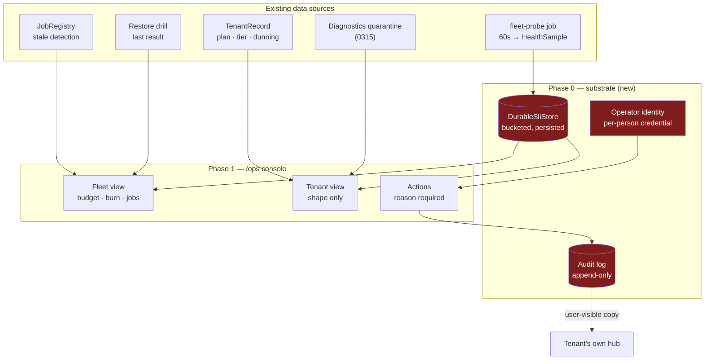
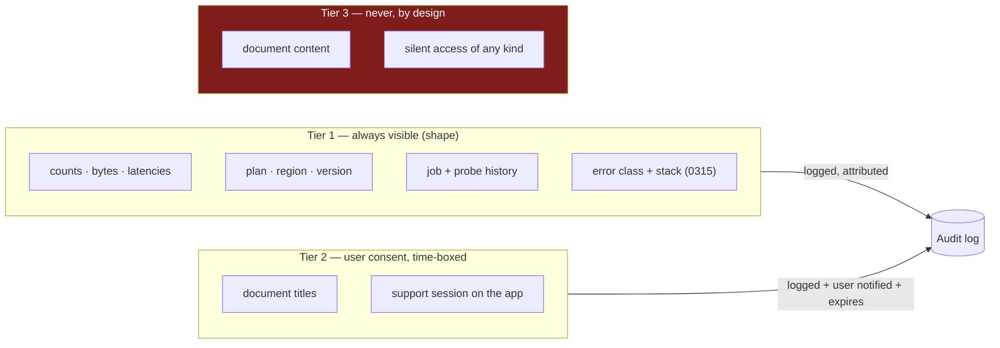
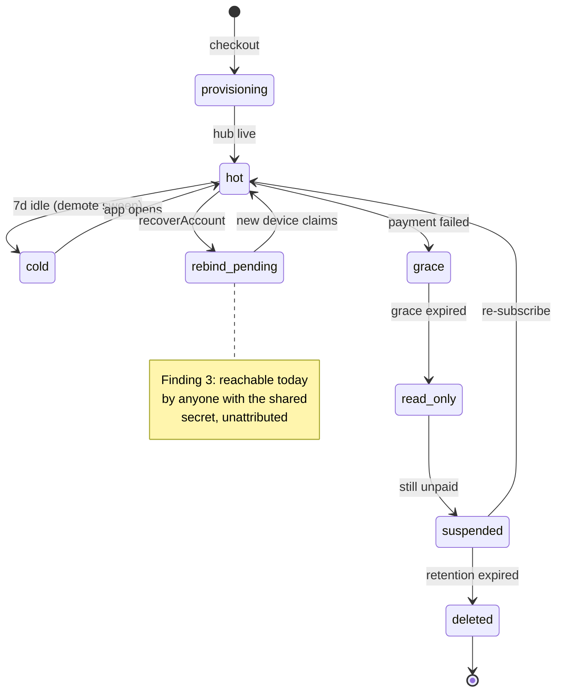
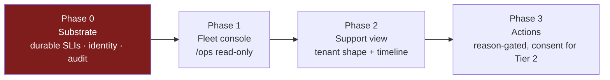

# xNet Cloud operator console — administration, site reliability, and support

> [!TIP]
> **TL;DR** — The SRE mathematics is already built, tested, and wired: SLIs,
> SLOs, error budgets, burn rate, fleet rollup, a public status page, and an
> error-budget-gated rollout engine. What is missing is not a dashboard. It is
> the three things underneath one: a **durable SLI window** (today's error
> budget is amnesiac *and* physically capped at ~33 hours despite being labelled
> 30 days), an **operator identity with an audit log** (`/internal/*` is one flat
> shared secret, and one of the routes behind it clears a tenant's device
> binding), and an **honest support-visibility boundary** (the dashboard tells
> users we hold only encrypted bytes; the hub indexes their plaintext). Fix the
> substrate first, then render it as a server-rendered `/ops` console in
> `apps/cloud` — the same shape as the tenant dashboard, no new bundle.

---

## Problem Statement

xNet Cloud is a real control plane running real tenants. It provisions hubs,
takes money, reconciles dunning, drills restores, and rolls out fleet upgrades.
The people operating it have, today, exactly three ways to answer a question
about it:

1. `curl` an `/internal/*` route with a shared secret in a header.
2. Read JSON lines out of Cloud Run logs.
3. Read the code.

That is workable for one operator who wrote the system. It fails the moment
someone has to answer *"a customer emailed saying sync is broken — what is
actually happening to them?"* under time pressure, and it fails badly the moment
more than one person holds the secret.

This exploration asks four questions:

1. **Administration** — what does an operator need to *do* to a tenant, and what
   should they be forbidden from doing?
2. **Site reliability** — the SRE surface exists as JSON. Is the number it
   reports true?
3. **Support** — what does a support person need to *see* to diagnose a
   customer's problem without violating the promise that makes xNet worth using?
4. **Shape** — one console, or three? Server-rendered, SPA, or off-the-shelf?

---

## Executive Summary

The headline is counter-intuitive: **the reliability code is in better shape
than the reliability data.**

`apps/cloud/src/observability/` contains a clean, well-tested, dependency-free
implementation of the Google SRE model — and it is fed by a 2000-entry in-memory
ring buffer that dies on every deploy. The console this exploration was asked for
would, if built today against that substrate, render a large confident number
that is wrong in both directions: it reads *perfectly healthy* immediately after
a restart (the moment most likely to have broken something), and it reads
*frozen* after two transient probe timeouts.

| Layer                       | Status         | Notes                                                                        |
| --------------------------- | -------------- | ---------------------------------------------------------------------------- |
| SLI / SLO / error-budget math | ✅ Shipped     | `observability/sli.ts`, `slo.ts` — pure, unit-tested                          |
| Fleet probe loop            | ✅ Shipped     | leased job `fleet-probe`, 60s (0411 G2)                                       |
| Public status page          | ✅ Shipped     | `/status.json` → `site/src/pages/status.astro`, k-anon floor 5                |
| Error-budget rollout gate   | ✅ Shipped     | `rollout/engine.ts` aborts on `freeze`                                        |
| Restore drill               | ✅ Shipped     | nightly, rotating sample (0418)                                               |
| Job staleness               | ✅ Shipped     | `/internal/fleet/jobs`, `stale` at 2× interval                                |
| **Durable SLI window**      | 🛑 **Missing** | in-memory ring; ~33h of a 30-day window; resets on deploy                     |
| **Operator identity**       | 🛑 **Missing** | one shared secret, no attribution, non-constant-time compare                  |
| **Control-plane audit log** | 🛑 **Missing** | the *user's* hub has one; the operator's control plane does not               |
| **Operator UI**             | ❌ None        | `/internal/*` is JSON-and-curl only                                           |
| **Support timeline**        | ❌ None        | no way to answer "what happened to this tenant last Tuesday"                  |

> [!IMPORTANT]
> The recommendation is **substrate before surface**. Phase 0 (durable SLIs,
> operator identity, audit log) is roughly a third of the work and carries all of
> the risk. Phase 1 (the console itself) is mostly HTML over data that already
> exists. Building Phase 1 first produces a console that lies confidently, which
> is worse than curl.

---

## Current State In The Repository

### What exists

The control plane is `apps/cloud`, a Hono app. Routes divide cleanly into four
audiences:

```text
┌─────────────────┐   ┌──────────────────┐   ┌────────────────────┐   ┌─────────────────┐
│  PUBLIC         │   │  TENANT          │   │  INTERNAL          │   │  OPERATOR       │
│  /health        │   │  /dashboard      │   │  /internal/*       │   │                 │
│  /status.json   │   │  /account/*      │   │  shared secret     │   │   ❌ nothing    │
│  (k-anon, agg)  │   │  session cookie  │   │  no identity       │   │                 │
└─────────────────┘   └──────────────────┘   └────────────────────┘   └─────────────────┘
```

The fourth column is the gap. The third column is what an operator uses *instead*,
which is the security problem.

| File                                                                       | What it gives an operator console                            |
| -------------------------------------------------------------------------- | ------------------------------------------------------------ |
| [`observability/sli.ts`](../../apps/cloud/src/observability/sli.ts)         | availability, error rate, p95, error budget, burn rate        |
| [`observability/slo.ts`](../../apps/cloud/src/observability/slo.ts)         | plan → objective, budget-as-time, `ship`/`caution`/`freeze`   |
| [`observability/health.ts`](../../apps/cloud/src/observability/health.ts)   | `probeFleet`, `tenantSli`, `fleetSummary`, sample store       |
| [`observability/status.ts`](../../apps/cloud/src/observability/status.ts)   | the public, aggregate-only chokepoint                         |
| [`registry.ts`](../../apps/cloud/src/registry.ts)                           | `TenantRecord` — plan, tier, region, version, dunning state   |
| [`jobs/leased.ts`](../../apps/cloud/src/jobs/leased.ts)                     | job health + `stale` (0411 G2)                                |
| [`rollout/engine.ts`](../../apps/cloud/src/rollout/engine.ts)               | canary → waves, aborts on a frozen budget                     |
| [`backup/restore-drill.ts`](../../apps/cloud/src/backup/restore-drill.ts)   | proof a restore works, not just that replication is on        |
| [`diagnostics.ts`](../../apps/cloud/src/diagnostics.ts)                     | crash/debug report quarantine (0315)                          |
| [`dashboard.ts`](../../apps/cloud/src/dashboard.ts)                         | the rendering pattern to copy — server-rendered, no bundle    |

`dashboard.ts` matters as precedent. It is 972 lines of server-rendered HTML with
inline vanilla-JS hydration and zero client dependencies, deliberately *not* a
second React bundle. An operator console should be the same shape.

### 🔴 Finding 1 — the error budget is measured over ~33 hours and labelled 30 days

Three facts, each independently benign:

- `slo.ts` sets `windowDays: 30` for the 99.9% tier.
- `index.ts:413` constructs `new HealthSampleStore()` — capacity defaults to **2000**.
- `index.ts:415` sets the probe interval to `XNET_CLOUD_PROBE_MS ?? 60_000` — **60s**.

The ring therefore holds at most

$$ 2000 \text{ samples} \times 60\,\text{s} = 120{,}000\,\text{s} = 33.3\,\text{hours} $$

against a window that claims 720 hours. `windowed()` filters correctly to 30
days; there is simply never more than 33 hours of data to filter. Coverage is
**4.6%** of the stated window.

The consequences are sharp in both directions, because the error budget divides
by a very small allowance:

<details>
<summary>Worked example — why two failed probes freeze the fleet</summary>

At 99.9%, `errorBudgetRemaining(sli, 0.999)` computes
`1 - (1 - sli) / 0.001`.

With a **full** 2000-sample ring:

| Failed probes | Availability | Budget remaining | Policy    |
| ------------- | ------------ | ---------------- | --------- |
| 0             | 1.0000       | 100%             | `ship`    |
| 1             | 0.9995       | **50%**          | `ship`    |
| 2             | 0.9990       | **0%**           | 🛑 `freeze` |

With a **partially filled** ring — say 100 samples, ~100 minutes after a deploy —
a single failed probe gives `1 - 0.01/0.001 = -9 → 0%`: instant `freeze`.

And with an **empty** ring, `availability([])` returns `1` by design ("no
evidence of failure"), so the budget reads 100% and the policy reads `ship`.

</details>

> [!WARNING]
> `rollout/engine.ts:169` aborts a fleet rollout when `budgetPolicy()` returns
> `freeze`, and re-checks between waves at line 182. So this is not a cosmetic
> number. **A control-plane restart hands the rollout engine a full error budget
> regardless of what the fleet actually did**, and two probe timeouts hand it a
> freeze. The gate cannot go red across the deploy boundary, and goes red far too
> easily inside one — the exact failure mode `AGENTS.md` names when it requires a
> gate to have a proof it can go red.

`stores/durable.ts` documents the in-memory choice explicitly and honestly —
"losing them on restart only costs … a rebuilt sample window, not a tenant." That
reasoning was right when the samples fed a dashboard. It stopped being right when
they started gating deploys.

### 🔴 Finding 2 — a cold start is recorded as an outage

`sli.ts` states the intent plainly in its header: cold-start waits are *valid*,
"so scale-to-zero tenants aren't unfairly penalized." The implementation does not
do this. `httpHealthProbe` aborts at `timeoutMs = 5000` and returns
`{ ok: false }`. A Cloud Run cold start routinely exceeds five seconds.

`probeFleet` only probes tenants whose `dataTier === 'hot'`, which limits the
blast radius — but `dataTier` is xNet's own hot/cold demotion state (7 days
idle), not Cloud Run's instance count. A `hot` tenant whose revision has scaled
to zero produces `ok: false`, and by Finding 1 two of those freeze the fleet.

### 🔴 Finding 3 — `/internal/*` is a flat secret, and one route behind it is an account-takeover primitive

```ts
// apps/cloud/src/server.ts:665
const requireInternal = (c) =>
  Boolean(deps.internalSecret) && c.req.header('x-internal-secret') === deps.internalSecret
```

Three problems, in ascending order of severity:

1. **Non-constant-time comparison.** `===` on a secret is a textbook timing
   oracle. Low practical risk over the internet, trivially fixed with
   `timingSafeEqual`.
2. **No attribution.** Every internal call is *the secret*, not *a person*. There
   is no operator identity to log, rate-limit, scope, or revoke individually. In
   an incident nobody can answer "who ran that?"
3. **The recovery route.** `POST /internal/account/recover` calls
   `controlPlane.recoverAccount`, which does this
   ([`control-plane.ts:861`](../../apps/cloud/src/control-plane.ts)):

   ```ts
   const updated: TenantRecord = { ...record, did: '' }
   await this.deps.tenants.put(updated)
   ```

   It clears the bound data identity and marks a rebind pending, so **the next
   device to present a passkey claims that hub**.

> [!CAUTION]
> Combining (2) and (3): anyone holding `XNET_CLOUD_INTERNAL_SECRET` can, for any
> `billingUserId`, unbind that tenant's device and bind their own — and leave no
> attributable record of having done so. This is a fleet-wide account-takeover
> key with no audit trail. It is not a hypothetical abuse of a support console;
> it is the current state, and a console would merely make it convenient. This
> is the one part of this exploration that is **not** a two-way door, and it
> should be fixed whether or not the console is ever built.

For contrast, the *user's* hub already has what the operator's control plane
lacks: [`packages/hub/src/routes/audit.ts`](../../packages/hub/src/routes/audit.ts)
pages an author's signed change history, gated by an `audit/read` capability that
`capabilities.ts:50` restricts to `admin`. The substrate for "who did what" was
built for users first. The control plane never got it.

### 🟠 Finding 4 — the confidentiality copy over-claims

`dashboard.ts:650` tells every tenant, in the danger zone:

> …not even we can recover it (we only ever hold encrypted bytes).

For a managed hub on the trusted tier this is not accurate.
[`packages/hub/src/services/search-indexer.ts`](../../packages/hub/src/services/search-indexer.ts)
extracts plaintext from rich text to build the FTS index, and `node-relay.ts`
validates plaintext declarations. Exploration
[0343](./0343_[x]_XNET_AUTH_VS_KEYHIVE_COMPARISON.md) states the position
directly at line 271: the trusted tier provides "integrity (signatures
re-verified) and revocation-denial, but not confidentiality between users of the
same hub," and calls it "the single most" significant finding of that comparison.

This matters here specifically because it determines what a support console is
*allowed* to show. If an operator with hub access can read tenant content, then
the boundary cannot be enforced by physics and must be enforced by design,
policy, and audit — and the customer-facing sentence needs to say so.

---

## External Research

**Break-glass and support access.** The 2026 consensus across access-control
guidance is consistent: sensitive support actions ("log in as user", "reset MFA",
"transfer owner") require elevated permission, **captured reason**, time-bound
elevation with automatic expiry, and per-action logging — with a small, named set
of break-glass principals rather than a shared credential. CyberArk's guidance
adds that all activity under break-glass must be monitored and audited as a
distinct class, not folded into ordinary logs.

**Impersonation with consent.** Clerk, Docebo, and Higher Logic converge on a
pattern worth copying: impersonated sessions are visually marked (a persistent
banner), the impersonated user is notified in-platform and by email at the moment
it happens, and the token itself carries an impersonation claim so downstream
services can refuse actions. Several go further and require the user to *grant*
access before a session can start.

**Error budgets and windows.** Datadog's burn-rate work and the general SRE
literature both land on rolling windows over calendar ones — precisely because a
calendar boundary resets the budget to full at the moment a bad deploy tends to
land. xNet already chose rolling. Finding 1 is the same bug arriving through a
different door: not a calendar reset, a *process* reset.

**Off-the-shelf.** Grafana + Prometheus remains the default answer for fleet
dashboards, and Better Stack / Datadog for hosted. Both are assessed in Options
below; both fail a constraint xNet has already committed to elsewhere.

---

## Key Findings

1. **The maths is done; the measurement is not.** Every formula an operator
   console needs already exists and is unit-tested. The data feeding them covers
   4.6% of its stated window and evaporates on deploy.
2. **A gate that gates deploys must survive deploys.** The rollout engine's
   dependence on the error budget converts a display bug into a safety bug.
3. **The control plane has no concept of an operator.** Not a weak one — none.
   Every privileged action is anonymous by construction.
4. **Support and sovereignty are in genuine tension, and it is resolvable.**
   The resolution is not "operators can see nothing" (then support is
   impossible) nor "operators can see everything" (then the promise is a lie).
   It is: *operators see shape, never content; content requires the user's
   consent; both are logged where the user can read the log.*
5. **The rendering question is nearly settled by precedent.** `dashboard.ts`
   already demonstrates the house pattern for a server-rendered console.

---

## 🧭 Architecture overview



The red boxes are the ones that do not exist. Everything feeding into them does.

### The visibility boundary



> [!NOTE]
> Tier 1 is deliberately generous. Most real support questions — "is my sync
> broken?", "why is my hub slow?", "where did my storage go?" — are answerable
> entirely from shape. The number of tickets genuinely requiring Tier 2 is small,
> and making that path *expensive and visible* rather than *impossible* is what
> keeps the boundary honest instead of routinely circumvented.

### A support session, end to end

```mermaid
sequenceDiagram
  participant U as User
  participant S as Support operator
  participant O as /ops console
  participant AL as Audit log
  participant H as User's hub

  U->>S: "sync has been broken since Tuesday"
  S->>O: look up tenant by email
  O->>AL: read(tenant, operator, reason)
  O-->>S: shape — SLI history, jobs, dunning, diagnostics
  Note over S,O: Tier 1 answers most tickets here

  alt shape is not enough
    S->>O: request Tier 2 access (reason required)
    O->>U: consent prompt (in-app + email)
    U-->>O: grant, 60 min
    O->>AL: grant(operator, scope, expiry)
    O-->>S: time-boxed, banner-marked session
    AL->>H: mirror entry to the user's own hub
    Note over O: auto-expires; no renewal without a fresh grant
  end
```

### Tenant lifecycle an operator has to reason about



---

## Options And Tradeoffs

### A. Where the console lives

| Option                                        | Verdict         | Why                                                                                                                                    |
| --------------------------------------------- | --------------- | -------------------------------------------------------------------------------------------------------------------------------------- |
| **A1. Server-rendered `/ops` in `apps/cloud`** | ✅ **Recommend** | Same origin as the data, same pattern as `dashboard.ts`, zero new deps, ships in the existing container, self-hosters get it free       |
| A2. React SPA in `apps/web`                   | ❌ Reject       | Cross-origin to the control plane, a second bundle, and puts operator credentials in the same app as tenant data                        |
| A3. Grafana + Prometheus                      | 🛑 Reject       | Two services to run and secure; the SLI logic would be re-implemented in PromQL as a second source of truth, diverging from `sli.ts`     |
| A4. Datadog / Better Stack                    | 🛑 Reject       | Fails the vanish test — operations knowledge leaves with the vendor — and mirrors tenant-shaped data into a third party (Charter §4)     |

A3 deserves more than a line, because it is the industry default.

<details>
<summary>Why not Grafana — the second-source-of-truth problem</summary>

Grafana is the right tool when metrics live in a time-series database and
dashboards are queries over them. xNet's situation is different in one decisive
way: the error budget is not a display artifact, it is a **control input** to
`rollout/engine.ts`. If the console computes it in PromQL and the engine computes
it in `sli.ts`, they will drift, and the drift will be discovered during an
incident.

Keeping one implementation means the console must call `tenantSli()` — which
means it lives in the control plane. Grafana could still be added later as a
*read-only second view* over exported metrics; it cannot be the primary.

There is also a self-hosting cost. `xnet hub` is meant to be one binary. An
operations story that requires standing up Prometheus and Grafana is not one a
self-hoster inherits, which quietly makes the managed product better than the
self-hosted one in a way the Charter's BATNA test disfavours.

</details>

### B. Where durable SLI samples go

| Option                                | Verdict         | Why                                                                                                     |
| ------------------------------------- | --------------- | ------------------------------------------------------------------------------------------------------- |
| **B1. Bucketed rollups in `DocStore`** | ✅ **Recommend** | Reuses the existing Firestore/in-memory port; ~720 hourly buckets per tenant covers 30 days exactly      |
| B2. Raise ring capacity to 43,200     | ❌ Reject       | Fixes the window, not the amnesia; ~2 MB/tenant resident and still zeroed on deploy                      |
| B3. Cloud Run log-based metrics       | ❌ Reject       | Vendor lock-in on the number that gates deploys; unavailable to self-hosters                             |
| B4. SQLite on a mounted volume        | ❌ Reject       | The control plane is deliberately stateless-with-Firestore; a volume adds a failover story for one table |

B1 concretely: replace the raw `HealthSample[]` ring with per-tenant hourly
buckets of `{ hourMs, ok, total, latencySumMs, latencyP95Ms }`. Availability over
any window becomes a sum over buckets. Storage is bounded by construction:

$$ 720 \text{ buckets} \times \sim\!60\,\text{B} \approx 43\,\text{KB per tenant per 30 days} $$

The in-memory ring stays as a write-through cache for the current hour, so the
hot path is unchanged and the durable write is one document per tenant per hour.

> [!IMPORTANT]
> Bucketing also fixes Finding 2 for free if the bucket separates *timeout* from
> *error*. A cold-start timeout can then be counted as valid-but-slow, which is
> what `sli.ts`'s header already claims happens.

### C. Operator identity

| Option                                        | Verdict         | Why                                                                                          |
| --------------------------------------------- | --------------- | -------------------------------------------------------------------------------------------- |
| **C1. WorkOS AuthKit + an operator allowlist** | ✅ **Recommend** | The auth funnel already exists (`/auth/start`, `/auth/callback`); adds a named principal only |
| C2. Per-operator static tokens                | 🟡 Fallback     | Attribution without SSO; acceptable interim, but rotation is manual                           |
| C3. Keep the shared secret, add a header       | 🛑 Reject       | Self-asserted identity is not identity; it audits the honest and misses the dishonest         |
| C4. mTLS client certs                          | ❌ Reject       | Real security, disproportionate operational cost for a team of this size                      |

C1 is small because `server.ts:259-299` already runs the WorkOS round trip and
`session.ts` already seals a cookie. An operator session is the same mechanism
with an allowlist check and a distinct cookie name.

> [!NOTE]
> `/internal/*` should keep its shared secret for genuine machine-to-machine
> callers, but the **destructive** routes — `recover`, `plan`, `delete` — should
> move behind operator identity. A secret is fine for "read fleet health"; it is
> not fine for "unbind this person's device."

### D. Revenue-lane check (Charter §6)

An operator console is not a new revenue lane — but it is the machinery behind
one xNet already names. Charter §6 says xNet charges for "improvements —
operations, support, context, and distribution we build and run." Support *is*
the lane; this is the thing that makes it deliverable. Running the five tests
anyway, because the Charter asks for them at the point a lane's mechanism is
designed:

| Test            | Result                                                                                                                                                  |
| --------------- | ------------------------------------------------------------------------------------------------------------------------------------------------------- |
| **Improvement** | ✅ The margin pays for people watching error budgets and answering tickets — labour we provide, not access to something users own anyway                  |
| **BATNA**       | ✅ Only if the console ships **in the same binary**. A managed-only ops story degrades self-hosting by omission — this is the real argument against A3/A4 |
| **Vanish**      | ✅ Tenants keep hubs, data, and `.xnetpack` exports; the console is ours and its disappearance costs them support, not sovereignty                        |
| **Sleep**       | ✅ Survives a competitor open-sourcing the feature set — operating someone's hub at 99.9% is labour, and labour does not fork                             |
| **Rust**        | ✅ The refusal here (no silent operator access to content) is backed by the operations/support lane itself, which survives it                             |

The BATNA row is the one with teeth, and it is the reason A1 beats A3/A4 on
principle and not just on convenience.

---

## Recommendation

Build it in four phases. **Phase 0 is not optional and does not depend on the
console being built at all.**



**Phase 0 — make the numbers true and the actors named.** Durable bucketed SLI
store; separate timeout from error in the probe; constant-time secret compare;
operator identity via WorkOS with an allowlist; an append-only audit log that
every privileged action writes to before it acts. Move `recover` / `plan` /
`delete-data` behind operator identity.

**Phase 1 — a read-only `/ops` fleet console.** Server-rendered HTML in
`apps/cloud`, the `dashboard.ts` pattern. Fleet budget and burn rate, per-tenant
SLI table sorted by worst budget, job staleness, last restore-drill result,
rollout state, dunning cohort counts. Read-only means it cannot make an incident
worse.

**Phase 2 — the support view.** Tenant lookup by email or `billingUserId` (the
`findWhere` index from 0423 already exists for exactly this), plus a **timeline**:
provisioned, probes, tier flips, plan changes, billing events, diagnostics,
operator actions. Tier 1 shape only. The timeline is the single highest-leverage
support artifact and does not exist in any form today.

**Phase 3 — actions and consent.** Reason-required buttons for the actions that
are currently `curl`. Tier 2 consent flow with in-app notification, hard expiry,
and a mirror of the grant into the user's own hub — so the audit log of who
looked at their data is *theirs*, which is the only version of that log a
local-first product can honestly offer.

> [!TIP]
> If only one thing ships from this document, make it **the durable SLI store**.
> It is the smallest change, it removes a live deploy-safety hazard, and every
> later phase renders numbers that are wrong without it.

### Deliberately not doing

- **No visual companion.** The load-bearing content here is substrate and
  security, not layout, and Phase 1 reuses `dashboard.ts`'s existing visual
  language. A `--visual` companion would be overhead. Revisit at Phase 2, where
  the timeline is a genuinely new UI object.
- **No new ADR yet.** Phase 0 and 1 are two-way doors. Phase 3's consent
  model — what an operator may see, and on whose authority — *is* a one-way door
  and earns an ADR in `decisions.mdx` when it is designed, with a tripwire on
  the first ticket that cannot be resolved within Tier 1.
- **No paging/on-call integration.** The alerting seam
  (`createWebhookAlerter`) exists; wiring PagerDuty before there is a rota is a
  gate nobody reads.

---

## Example Code

Bucketed durable SLI storage — the Phase 0 core, over the existing `DocStore` port:

```ts
/** One hour of probe results for one tenant. Content-free by construction. */
export interface SliBucket {
  tenantId: string
  hourMs: number // floor(atMs / 3_600_000) * 3_600_000
  ok: number
  /** Hard failures — connection refused, 5xx. Burns budget. */
  failed: number
  /**
   * Probes that timed out while the revision was cold-starting. Counted as
   * valid-but-slow, NOT as unavailability — the intent `sli.ts` documents but
   * the current probe does not implement (Finding 2).
   */
  coldStart: number
  latencySumMs: number
  maxLatencyMs: number
}

const bucketId = (tenantId: string, hourMs: number): string => `${tenantId}:${hourMs}`

/**
 * Availability over a window, from durable buckets.
 *
 * Returns `null` — never 1 — when the window holds no buckets at all. An empty
 * window means "we have no evidence", and a caller that cannot distinguish that
 * from "perfectly healthy" is the bug in Finding 1: after a restart the fleet
 * read 100% available because nobody had measured it yet.
 */
export function availabilityFromBuckets(
  buckets: SliBucket[],
  windowMs: number,
  nowMs: number
): number | null {
  const floor = nowMs - windowMs
  const inWindow = buckets.filter((b) => b.hourMs >= floor)
  if (inWindow.length === 0) return null
  let ok = 0
  let valid = 0
  for (const b of inWindow) {
    ok += b.ok + b.coldStart // cold starts succeed eventually
    valid += b.ok + b.coldStart + b.failed
  }
  return valid === 0 ? null : ok / valid
}
```

The corresponding change at the consumer end — the rollout gate must refuse to
proceed on absent evidence rather than treating it as health:

```ts
/**
 * Deploy gate. `null` availability (no measurement in the window) is treated as
 * `freeze`, not `ship`: an unmeasured fleet is not a healthy fleet. This is the
 * negative control `AGENTS.md` requires — the gate can go red for the specific
 * reason it previously went silently green.
 */
export function gatePolicy(availability: number | null, objective: number | null): BudgetPolicy {
  if (availability === null) return 'freeze'
  return budgetPolicy(errorBudgetRemaining(availability, objective))
}
```

And the audit-write-before-act shape for every privileged operator route:

```ts
/**
 * Wrap a privileged action so the audit entry is durably written BEFORE the
 * action runs. Ordering is the point: an action that fails must still be
 * attributable, and an operator must not be able to act and then suppress the
 * record by crashing the process.
 */
async function audited<T>(
  log: AuditLog,
  entry: { operator: string; action: string; tenantId: string; reason: string },
  run: () => Promise<T>
): Promise<T> {
  if (!entry.reason.trim()) throw new Error('audit: reason required')
  const id = await log.append({ ...entry, atMs: Date.now(), outcome: 'started' })
  try {
    const result = await run()
    await log.append({ ...entry, atMs: Date.now(), outcome: 'ok', parentId: id })
    return result
  } catch (err) {
    await log.append({ ...entry, atMs: Date.now(), outcome: 'failed', parentId: id })
    throw err
  }
}
```

---

## Risks And Open Questions

> [!WARNING]
> **The console makes the takeover primitive convenient before Phase 0 makes it
> safe.** Phases must not be reordered. A `/ops` console shipped over today's
> shared secret is strictly worse than curl, because it lowers the effort of the
> unattributed action in Finding 3 from "know the API" to "click the button."

| Risk                                                          | Severity | Mitigation                                                                                       |
| ------------------------------------------------------------- | -------- | ------------------------------------------------------------------------------------------------ |
| Console ships before durable SLIs → operators trust a lie      | 🔴 High  | Phase ordering; Phase 1 renders `—` and "unmeasured" rather than a number when buckets are absent |
| Firestore write amplification from bucket writes               | 🟡 Med   | One doc per tenant per hour; write-through cache for the current hour                             |
| Tier 2 consent becomes a rubber stamp users always click       | 🟡 Med   | Hard expiry, no renewal without a fresh grant, mirror every grant into the user's own hub         |
| Audit log itself becomes a tenant-data side channel            | 🟡 Med   | Log action + tenantId + reason; never parameters that could carry content                         |
| Operator allowlist drifts stale as people leave                | 🟡 Med   | Allowlist from WorkOS directory, not a hardcoded array; quarterly review                          |
| `/status.json` inherits wrong numbers                          | 🟠 Med   | Same fix; public status should show "unmeasured", never a fabricated `operational`                |

**Open questions:**

1. **Does the dashboard's "encrypted bytes" copy get corrected, or does the
   architecture get changed to match it?** Finding 4 is a fork. Correcting the
   copy is one commit and honest. Making it true means the hub cannot build an
   FTS index over content — a large change that collides with search. This
   exploration recommends correcting the copy now and treating end-to-end
   encryption for managed hubs as a separate decision, but the call is not mine.
2. **Should the audit log be signed?** The user's hub signs changes. An operator
   audit log that is merely append-only in Firestore is trusted, not verifiable.
   Signing it with the control plane's key would let a user verify the record of
   who touched their tenant. Attractive; not Phase 0.
3. **What is the retention on SLI buckets beyond 30 days?** Enterprise contracts
   may want quarterly evidence. Bucket rollup-of-rollups (hour → day at 30 days)
   is cheap if decided before the first write.
4. **Does the support view need a read path into the hub at all**, or is the
   control plane's own record sufficient for Tier 1? Leaning sufficient — the
   `/dashboard/live.json` probe already returns counts, storage, and diagnostics
   summaries without content.

---

## Implementation Checklist

**Status:** ░░░░░░░░░░ 0/28 items

### Phase 0 — substrate (blocking)

- [ ] Add `SliBucket` + `DurableSliStore` over the existing `DocStore` port in `apps/cloud/src/observability/`
- [ ] Write-through: `HealthSampleStore` keeps the current hour in memory, flushes hourly
- [ ] Implement `availabilityFromBuckets` returning `null` for an unmeasured window
- [ ] Separate `coldStart` from `failed` in `httpHealthProbe` (distinguish abort-on-timeout from connection failure)
- [ ] Rewire `tenantSli` and `fleetSummary` to read buckets, keeping their public signatures
- [ ] `gatePolicy`: treat `null` availability as `freeze` in `rollout/engine.ts`
- [ ] `/status.json`: emit `"unmeasured"` rather than `operational` when no buckets exist
- [ ] Replace `===` with `timingSafeEqual` in `requireInternal`
- [ ] Add operator session: WorkOS callback + allowlist + distinct sealed cookie in `session.ts`
- [ ] Add `AuditLog` port + `DocStore` implementation, append-only, write-before-act
- [ ] Move `POST /internal/account/recover` behind operator identity + required reason
- [ ] Move `POST /internal/tenants/:id/plan` and `/account/delete-data` behind the same
- [ ] Unit tests: bucket math, window boundaries, `null` propagation to the gate
- [ ] **Negative control** — `--selftest` proving the gate goes red on an unmeasured window and on a real budget burn, with in-memory fixtures (0430)

### Phase 1 — fleet console

- [ ] `GET /ops` — server-rendered, operator-session-gated, `dashboard.ts` pattern
- [ ] Fleet header: worst budget, burn rate, `byPolicy` counts, freeze banner
- [ ] Per-tenant SLI table sorted by worst budget remaining; `—` when unmeasured
- [ ] Job staleness panel from `/internal/fleet/jobs`
- [ ] Restore-drill panel: last result, sample size, age
- [ ] Rollout state panel from `run-record.ts`
- [ ] Dunning cohort counts (grace / read-only / suspended) from `TenantRecord.billing`

### Phase 2 — support view

- [ ] `GET /ops/tenants/:id` — Tier 1 shape only
- [ ] Tenant lookup by email / `billingUserId` via the existing `findWhere` index (0423)
- [ ] Tenant timeline: provision, probes, tier flips, plan changes, billing events, diagnostics, operator actions
- [ ] Link out to the tenant's diagnostics quarantine (0315)

### Phase 3 — actions and consent

- [ ] Reason-required action buttons wrapped in `audited()`
- [ ] Tier 2 consent flow: in-app + email prompt, hard expiry, no silent renewal
- [ ] Mirror every grant and access into the user's own hub
- [ ] ADR in `decisions.mdx` for the consent model, with a tripwire

---

## Validation Checklist

- [ ] Restart the control plane mid-window; the fleet budget reflects pre-restart history, not 100%
- [ ] With zero buckets, `/status.json` reads `unmeasured` and the rollout gate returns `freeze`
- [ ] Simulate two consecutive cold-start timeouts; the budget does **not** freeze (Finding 2 fixed)
- [ ] Simulate a genuine two-hour outage; the budget burns proportionally to a 30-day window, not a 33-hour one
- [ ] `--selftest` plants both violations and the gate flags both; it runs in CI beside the real scan
- [ ] `POST /internal/account/recover` with only the shared secret returns 403
- [ ] Every privileged action produces an audit entry naming a person, before the action runs
- [ ] An action that throws still leaves a `started` audit entry
- [ ] A Tier 2 grant expires without renewal and the session dies with it
- [ ] The user can read the record of operator access on their own hub
- [ ] `/ops` returns 403 for a valid *tenant* session (operator ≠ customer)
- [ ] `pnpm typecheck && pnpm lint && pnpm test` green; `pnpm build` and the `check:*` guards pass
- [ ] Bucket storage measured at ~43 KB per tenant per 30 days
- [ ] The dashboard's "encrypted bytes" sentence is either corrected or made true

---

## References

**In-repo**

- [`apps/cloud/src/observability/`](../../apps/cloud/src/observability/) — `sli.ts`, `slo.ts`, `health.ts`, `status.ts`
- [`apps/cloud/src/server.ts`](../../apps/cloud/src/server.ts) — routes, `requireInternal` (line 665)
- [`apps/cloud/src/control-plane.ts`](../../apps/cloud/src/control-plane.ts) — `recoverAccount` (line 861)
- [`apps/cloud/src/dashboard.ts`](../../apps/cloud/src/dashboard.ts) — the server-rendered pattern to copy
- [`apps/cloud/src/rollout/engine.ts`](../../apps/cloud/src/rollout/engine.ts) — the error-budget gate
- [`apps/cloud/src/stores/durable.ts`](../../apps/cloud/src/stores/durable.ts) — the `DocStore` port
- [`packages/hub/src/routes/audit.ts`](../../packages/hub/src/routes/audit.ts) — the audit pattern the control plane lacks
- [`docs/CHARTER.md`](../CHARTER.md) — §4 Consent, §6 No ground rent (five tests)

**Prior explorations**

- [0193 — Cloud operations, uptime, backups and telemetry](./0193_[_]_XNET_CLOUD_OPERATIONS_UPTIME_BACKUPS_AND_TELEMETRY.md) — where the SLI/SLO model came from
- [0201 — Cloud staging, status page and live testing](./0201_[_]_CLOUD_STAGING_STATUS_PAGE_AND_LIVE_TESTING.md) — the public status surface
- [0315 — First-party error telemetry and debug report console](./0315_[x]_FIRST_PARTY_ERROR_TELEMETRY_AND_DEBUG_REPORT_CONSOLE.md) — diagnostics quarantine
- [0343 — xNet auth vs Keyhive](./0343_[x]_XNET_AUTH_VS_KEYHIVE_COMPARISON.md) — the trusted-tier confidentiality gap
- [0418 — Cloud to production: backups, billing, dunning and one UI](./0418_[-]_XNET_CLOUD_TO_PRODUCTION_BACKUPS_BILLING_DUNNING_AND_ONE_UI.md) — the phase this follows
- [0430 — Risk-adjusted engineering](./0430_[-]_RISK_ADJUSTED_ENGINEERING_READING_ASTERISK_14.md) — negative controls, tripwires, gates that can fail

**External**

- [Break-glass access best practices — CyberArk](https://docs.cyberark.com/manage/latest/en/content/sca/dpaforcloud/breakglass.htm)
- [Secure admin impersonation for support with consent and audits — AppMaster](https://appmaster.io/blog/secure-admin-impersonation-controls-audit-scope)
- [Empower your support team with user impersonation — Clerk](https://clerk.com/blog/empower-support-team-user-impersonation)
- [Designing tamper-resistant audit trails — Agnite Studio](https://agnitestudio.com/blog/designing-tamper-resistant-audit-trails-compliance-systems/)
- [Burn rate is a better error rate — Datadog](https://www.datadoghq.com/blog/burn-rate-is-better-error-rate/)
- [SRE error budgets and maintenance windows — Google Cloud](https://cloud.google.com/blog/products/management-tools/sre-error-budgets-and-maintenance-windows)
- [Error budgets: a complete guide — SRE School](https://sreschool.com/blog/error-budgets-a-complete-guide/)
