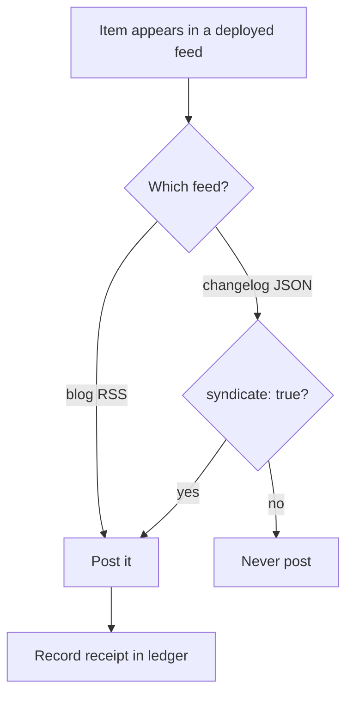
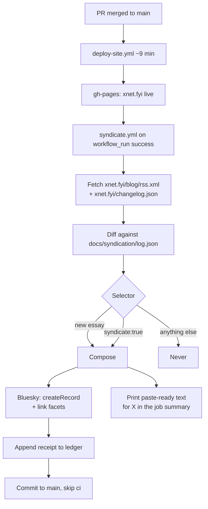
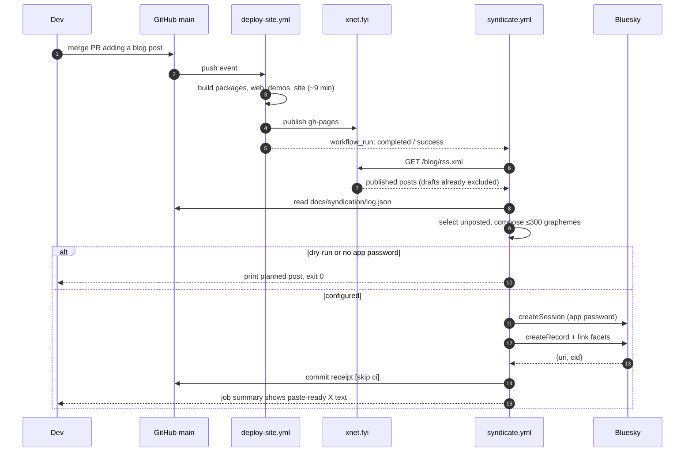
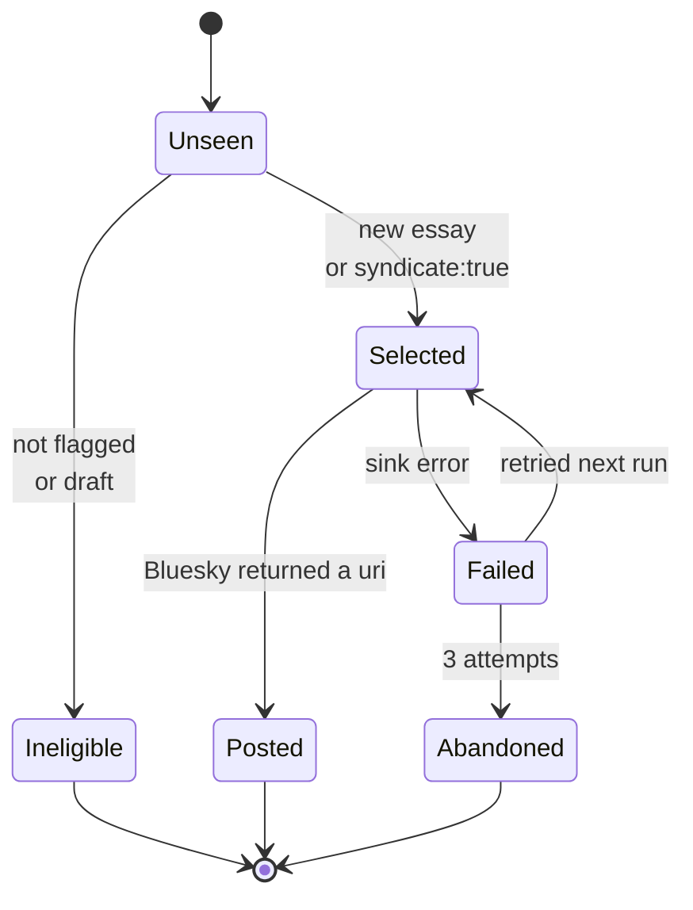

# POSSE Syndication — Automate Bluesky, Post to X by Hand

> [!TIP]
> **TL;DR** — Automate **Bluesky only**, and only for two things: **new blog
> essays** (automatic, from the RSS feed) and **changelog entries the author
> explicitly flags** (`"syndicate": true`). That is roughly 5–7 posts a month
> and costs **nothing**. X is not automated at all: since February 2026 it
> charges **$0.20 per post containing a link**, and every POSSE post contains a
> link by definition. Posting to X stays a manual copy-paste, and the
> syndicator prints the exact text to paste.

## Problem Statement

Two accounts exist and neither has posted. The goal is to announce new work
without hand-running a publishing checklist — but with two hard constraints
that have emerged since this exploration was opened:

1. **No API spend.** If a network charges to post, it does not get automated.
2. **Not everything.** Only blog posts and major releases or updates — not the
   changelog firehose.

Both constraints point the same way, and together they shrink the design
dramatically.

### The accounts

| Network | Handle | Stable id | Automated? |
| ------- | ------ | --------- | ---------- |
| Bluesky | [`xnetfyi.bsky.social`](https://bsky.app/profile/xnetfyi.bsky.social) | `did:plc:26oworspix6mgqcbgmdz4fsu` | ✅ Yes — free |
| X | [`@xnetfyi`](https://x.com/xnetfyi) | — | 🛑 No — manual, see below |

Bluesky was confirmed live through the public XRPC endpoint, which needs no
auth (0 posts, 0 followers, display name already `xNet`, bio already links
`xnet.fyi`):

```bash
curl -s "https://public.api.bsky.app/xrpc/app.bsky.actor.getProfile?actor=xnetfyi.bsky.social"
```

> [!IMPORTANT]
> **Pin the DID, not the handle.** `xnetfyi.bsky.social` is a rented name that
> changes the moment the account moves to a custom domain (`xnet.fyi` being the
> obvious eventual handle). `did:plc:26oworspix6mgqcbgmdz4fsu` does not change.
> Config carries the DID and asserts it after sign-in — the same identity
> discipline §2 of the Charter applies to users.

### Why X is not automated

X replaced tiered pricing with pay-per-use on 2026-02-06. There is no free tier
for new developers, and Basic ($200/mo) and Pro ($5,000/mo) are closed to new
signups.

| Action | Price |
| ------ | ----- |
| Post created, no link | $0.015 |
| Post created, **containing a link** | **$0.20** |
| Post read | $0.005 |

> [!CAUTION]
> A POSSE post is *defined* by carrying a link home to the canonical page.
> There is no version of this feature on X that avoids the expensive case. At
> the proposed cadence that is only about $1.40 a month — genuinely small — but
> the instruction is no API spend, and a metered write path is also a standing
> liability: the price is set by a party with every incentive to raise it, and
> a billing failure becomes a broken deploy. **Decision: X is manual.**

This is not a loss of much. At 5–7 posts a month, pasting into X takes under a
minute each, and a human in the loop on the one network with a hostile pricing
model is a reasonable place to spend that minute. The syndicator makes it
trivial by printing the exact text to paste.

---

## Executive Summary

| Decision | Answer |
| -------- | ------ |
| Architecture | POSSE — publish to `xnet.fyi`, syndicate a copy that links home |
| Automated sink | **Bluesky only** (`com.atproto.repo.createRecord`, app password) |
| X | Manual. Syndicator prints paste-ready text; no X credentials anywhere |
| Source of truth | The **deployed** feeds (`/blog/rss.xml`, `/changelog.json`) |
| Trigger | `workflow_run` after **Deploy Site to GitHub Pages** succeeds |
| What gets posted | New blog essays (automatic) + fragments flagged `"syndicate": true` |
| What never gets posted | Everything else — no digest, no tag heuristics, no AI gatekeeper |
| Volume | ~5–7 posts/month |
| Cost | **$0** |
| State | Committed JSON ledger under `docs/`, **never** under `site/` |
| Footer | ✅ Shipped — inline-SVG icons + Community links, zero third-party requests |
| Door | Two-way — no wire format, no public API, no revenue lane |

---

## Current State In The Repository

Almost every part of this already exists for other reasons.

### Machine-readable feeds already ship

| Surface | File | Role here |
| ------- | ---- | --------- |
| Blog RSS | [`site/src/pages/blog/rss.xml.ts`](../../site/src/pages/blog/rss.xml.ts) | ✅ **Primary trigger** — new essays |
| JSON Feed 1.1 | [`site/src/pages/changelog.json.ts`](../../site/src/pages/changelog.json.ts) | ✅ Carries the opt-in flag |
| Changelog RSS | [`site/src/pages/changelog.xml.ts`](../../site/src/pages/changelog.xml.ts) | Unused by this feature |
| Feed builders | [`site/src/lib/blog-feed.ts`](../../site/src/lib/blog-feed.ts), [`site/src/lib/changelog-feed.ts`](../../site/src/lib/changelog-feed.ts) | Pure functions, no side effects |

The JSON Feed already carries an `_xnet` extension block with the fields a
syndicator wants — see [`site/src/lib/changelog-feed.ts`](../../site/src/lib/changelog-feed.ts):

```jsonc
{
  "id": "2026-08-03-new-essay-the-harvest-you-can-count",
  "url": "https://xnet.fyi/changelog#2026-08-03-…",
  "title": "New essay: The Harvest You Can Count",
  "date_published": "2026-07-19T08:04:20Z",
  "tags": ["platform"],
  "_xnet": { "summary": "…", "highlights": [], "mergedAt": "…", "pr": 584 }
}
```

> [!NOTE]
> `id` is stable and unique (enforced by `site/scripts/validate-changelog.ts`),
> which makes it a free idempotency key. A syndicator that records posted `id`s
> cannot double-post, even if the workflow re-runs.

### Blog metadata

[`site/src/data/blog.ts`](../../site/src/data/blog.ts) holds `slug`, `pubDate`,
`tags`, `draft` and authors. Read its header comment before touching anything:
`pubDate` is the real go-live instant, and `draft: true` posts must never reach
a feed.

> [!IMPORTANT]
> Drive off `publishedPosts()` / the RSS feed, never a glob of
> `site/src/pages/blog/*.astro`. The feed already excludes drafts; a glob does
> not, and the failure mode is announcing an unfinished essay.

### Deploy timing and the loop hazard

[`.github/workflows/deploy-site.yml`](../../.github/workflows/deploy-site.yml)
is the only thing that makes a post public. Its `paths:` filter:

```yaml
paths:
  - 'site/**'
  - 'apps/web/**'
  - 'apps/demos/**'
  - 'packages/**'
  - 'registry/**'
```

> [!WARNING]
> `docs/**` is **not** in that list, and that is load-bearing. If the
> syndication ledger were committed under `site/src/data/`, every syndication
> run would retrigger `deploy-site`, which would retrigger syndication. Put the
> ledger under `docs/`. Memory also records that `deploy-site` takes
> **~9 minutes** — an early check shows the *previous* deploy, so the
> syndicator must run on `workflow_run` completion, not on a timer.

### On-merge automation precedent

[`.github/workflows/stamp-pr-number.yml`](../../.github/workflows/stamp-pr-number.yml)
already solves committing back to `main` from CI: a GitHub App token added to
the ruleset bypass list, gated on the `CHANGELOG_APP_ID` **variable** so it
degrades to a warning when unconfigured, with `[skip ci]` to avoid a loop.

### ATProto groundwork

[`scripts/atproto/publish-lexicons.mjs`](../../scripts/atproto/publish-lexicons.mjs)
(explorations 0372/0420) is a zero-dependency script that authenticates against
a PDS and writes records, with a `--dry-run` that needs no credentials. That is
most of a Bluesky sink already, in the house style.

### ✅ The footer points at both accounts (shipped)

[`site/src/components/sections/Footer.astro`](../../site/src/components/sections/Footer.astro)
now lists both accounts in the brand-column icon row and the Community list.
Verified against the running dev server: both anchors resolve, both SVG paths
render with sane geometry (22×19 and 22×20 in a 24×24 viewBox), and
`performance.getEntriesByType('resource')` returns **zero** non-origin entries.

> [!CAUTION]
> Do **not** add an X timeline embed, follow button, or `platform.twitter.com`
> script. Five essays literally promise the reader that these pages load
> nothing third-party — [`palimpsest.astro`](../../site/src/pages/blog/palimpsest.astro),
> [`the-right-to-say-no.astro`](../../site/src/pages/blog/the-right-to-say-no.astro),
> [`hand-on-the-tiller.astro`](../../site/src/pages/blog/hand-on-the-tiller.astro)
> and two more that avoid even Mermaid to keep it literal — and `site/` is in
> scope for `check-humane-patterns.mjs`'s surplus rules (0257). The shipped
> icons are inline path data, which is why they are fine.

> [!NOTE]
> Unrelated pre-existing bug in the same file: the icon labelled
> `aria-label="GitHub Discussions"` renders the **Discord** logo path. Out of
> scope here.

---

## The Selection Problem

The instruction is "blog posts and major releases or updates". Blog posts are a
clean machine signal. **"Major" is not**, and that is the finding that decides
the design.

<details>
<summary>Every automatic "major" signal in this repo, and why each fails</summary>

| Candidate signal | Volume | Why it fails |
| ---------------- | ------ | ------------ |
| Every changelog fragment | 144 in June, 155 in July (316 total) | ~5/day. This is the firehose the instruction rules out |
| Changelog tags (`app`, `sync`, …) | ~110/mo after dropping `ci`/`devtools` | Tags describe **area**, not significance. Barely reduces volume |
| Every `v*` git tag | **23 tags in 15 days** (v0.1.1 → v3.0.0) | ~1.5/day. Three landed on 2026-07-18 alone |
| Semver **major** tags (`v*.0.0`) | 3 (v1.0.0, v2.0.0, v3.0.0) in 3 weeks | Right volume, wrong meaning: major = *breaking change*, which in an alpha is routine and often boring to a reader |
| Package tags (`@xnetjs/*@…`) | 18 on a single day | Changesets batch release. Pure noise |
| An AI significance scorer | tunable | A gate whose pass condition is not decidable — AGENTS.md: "a gate that cannot go green teaches everyone to ignore red" |

</details>

> [!IMPORTANT]
> There is no existing signal in this repository that means "major". Every
> candidate is either far too noisy or semantically wrong. Inventing a
> heuristic would reliably announce the wrong things. **"Major" has to be a
> human boolean**, and the cheapest place to put it is the changelog fragment
> the author is already writing.

So the whole selector is two rules:



No digest. No tag allowlist. No scoring. An entry that nobody flagged simply
never gets posted, and that is the correct outcome — it goes on the changelog
page, which is where the full record lives.

Opting in costs the author one line in a file they are already editing:

```jsonc
{
  "title": "Your hub keeps the same address when it moves",
  "summary": "…",
  "tags": ["sync"],
  "syndicate": true          // ← default false; this is the whole "major" decision
}
```

### Expected volume

| Stream | Rate | Source |
| ------ | ---- | ------ |
| Blog essays | ~3/month | 24 posts to date; already rate-limited by how hard essays are to write |
| Flagged changelog entries | ~2–4/month | Author's judgement |
| **Total** | **~5–7/month** | All free |

---

## 🧭 Architecture



```text
┌──────────────┐     ┌──────────────┐     ┌────────────────────┐
│  xnet.fyi    │ ──▶ │  Selector +  │ ──▶ │ Bluesky   (auto)   │
│  (canonical) │     │  Composer    │     │ X         (by hand)│
│  feeds       │ ◀── │  + ledger    │     │ …both link home    │
└──────────────┘     └──────────────┘     └────────────────────┘
     origin              decision                 mirror
```

<details>
<summary>Sequence: publishing a new essay</summary>



</details>

### Item state



> [!IMPORTANT]
> `Abandoned` is recorded with a reason, never silently dropped. AGENTS.md is
> explicit: "a truncated run is not a completed one", and "absent" and
> "unreadable" must be different values. A run that posted 1 of 2 exits
> non-zero and names the failure.

---

## Bluesky Implementation Notes

Free and unmetered, but the record format has three sharp edges.

**1. Links are not clickable without a facet.** A bare URL in `text` renders as
plain text. Clickability comes from a `facets` array:

```jsonc
{
  "$type": "app.bsky.feed.post",
  "text": "New essay: The Harvest You Can Count\n\nhttps://xnet.fyi/blog/…",
  "createdAt": "2026-08-02T09:00:00.000Z",
  "facets": [
    {
      "index": { "byteStart": 38, "byteEnd": 74 },
      "features": [{ "$type": "app.bsky.richtext.facet#link", "uri": "https://xnet.fyi/blog/…" }]
    }
  ]
}
```

> [!WARNING]
> `byteStart`/`byteEnd` are **UTF-8 byte offsets**, not JavaScript string
> indices. House copy routinely contains `—`, `’` and `•` — 3 bytes and 1 code
> unit each. Using `indexOf` directly puts the range in the wrong place. This
> is the single most likely bug in the feature.

<details>
<summary>Measured: the naive version is off by 12 bytes on one realistic line</summary>

Run against a line using the punctuation this repo actually writes — em dash,
curly quotes, bullet, emoji:

```text
New essay — “The Harvest You Can Count” • it’s about ledgers 🌾

https://xnet.fyi/blog/the-harvest-you-can-count
```

| Method | Start offset | What the range decodes to |
| ------ | ------------ | ------------------------- |
| `text.indexOf('https://')` (naive) | 65 | `dgers 🌾\n\nhttps://xnet.fyi/blog/the-harvest-y` ❌ |
| `Buffer.byteLength(text.slice(0, i))` | 77 | `https://xnet.fyi/blog/the-harvest-you-can-count` ✅ |

The prefix holds one em dash, two curly quotes, one bullet, one curly
apostrophe and one emoji — 12 bytes more than code units.

Also measured on the same line: **111 graphemes, 112 code units, 124 bytes** —
three different numbers, which is why the budget check must count graphemes.

**Use this line as the unit-test fixture.** The assertion that matters:

```js
const buf = Buffer.from(text, 'utf8')
const f = linkFacets(text)[0]
assert.equal(
  buf.subarray(f.index.byteStart, f.index.byteEnd).toString('utf8'),
  f.features[0].uri
)
```

</details>

**2. The limit is 300 graphemes, not 280 characters.** The lexicon sets
`maxGraphemes: 300` and `maxLength: 3000` bytes on `text`. Count with
`Intl.Segmenter`, not `.length` — an emoji is 1 grapheme and 2 code units.

**3. Bluesky does not shorten URLs.** X wraps links to a flat 23 characters via
t.co; here the full URL counts against the 300. A changelog anchor like
`https://xnet.fyi/changelog#2026-08-03-new-essay-the-harvest-you-can-count` is
74 graphemes of the budget — worth preferring the shorter blog URL where both
exist.

Auth is pleasantly boring: `com.atproto.server.createSession` with the handle
and an app password returns an `accessJwt`. It is short-lived, but you mint a
fresh session per run from a static app password, so there is nothing to rotate
and nothing to write back to a secret.

---

## Options And Tradeoffs

### How X gets posted

| Option | Cost | Verdict |
| ------ | ---- | ------- |
| **Manual paste, syndicator prints the text** | $0 | ✅ **Recommended** — meets the no-spend constraint, ~1 min per post |
| Direct X API (OAuth 1.0a, pay-per-use) | ~$1.40/mo at this cadence | 🛑 Rejected — any spend is out, and the price is set by a hostile party |
| Buffer API (Buffer holds its own X access) | $0 on the free plan, $5/channel above | 🚧 Real fallback if manual posting gets tedious. Adds a third party holding a posting credential |
| Typefully free tier | $0 for ≤15 posts/mo | 🚧 Fits the volume; another third party in the loop |
| Postiz self-hosted | Free to run | ❌ Still needs **our own** X approval → back to $0.20/link |
| Zapier / IFTTT RSS→X | $20+/mo | ❌ Costs more than the API it replaces |
| Browser automation | "Free" | 🛑 ToS violation, suspension risk. Not considered |

> [!TIP]
> If manual X posting becomes annoying, **Buffer is the upgrade path**, not the
> X API — its own enterprise access absorbs the link surcharge, and the free
> plan covers 5–7 posts a month. Revisit only if the annoyance is real.

### Where the syndicator reads from

| Source | Verdict |
| ------ | ------- |
| **Deployed feeds** (`xnet.fyi/blog/rss.xml`) | ✅ Syndicates what is genuinely live; no monorepo build; drafts excluded for free |
| Workspace `site/src/data/**` | ❌ `site/` installs `--ignore-workspace` and cannot be imported from `scripts/`; would announce things that failed to deploy |
| Git tags / GitHub releases | ❌ 23 `v*` tags in 15 days — not a "major" signal |

### Where state lives

| Store | Verdict |
| ----- | ------- |
| **`docs/syndication/log.json`, committed** | ✅ Receipts in git, matches the claims-ledger culture; `docs/**` is outside `deploy-site`'s `paths:` |
| `site/src/data/syndicated.json` | 🛑 **Retriggers `deploy-site` → infinite loop** |
| Actions cache | ❌ Evicted after 7 days; a miss re-posts everything |
| Read back from the Bluesky timeline | ❌ Free, but fails if a post is deleted |

---

## Recommendation

> [!TIP]
> **Build `scripts/syndicate/` as a zero-dependency Node script in the house
> style — `--dry-run` by default until proven, fail-loud — posting only to
> Bluesky, triggered by `workflow_run` on `deploy-site`. Selection is two
> rules: new blog essays, plus changelog fragments the author flagged. X gets
> paste-ready text in the job summary and nothing else.**

1. **Add `syndicate?: boolean` to `ChangelogEntry`** in
   [`site/src/data/changelog.ts`](../../site/src/data/changelog.ts), surfaced
   through the JSON Feed's `_xnet` block, with `--syndicate` on
   [`scripts/changelog/new.mjs`](../../scripts/changelog/new.mjs). Default
   `false`. Update `site/scripts/validate-changelog.ts`.
2. **Blog posts syndicate automatically** from the blog RSS feed — `draft: true`
   is respected for free.
3. **Nothing else is ever posted.** No digest, no tag allowlist, no scorer.
4. **One sink: Bluesky**, DID-pinned, app password, link facets. Keep the sink
   interface narrow so Buffer could be added later without a rewrite.
5. **Ledger at `docs/syndication/log.json`**, committed with `[skip ci]` by the
   GitHub App [`stamp-pr-number.yml`](../../.github/workflows/stamp-pr-number.yml)
   already uses.
6. **X paste text in the workflow job summary**, so announcing on X is a
   copy-paste with no thinking.
7. **`pnpm check:syndication`** enforcing the POSSE invariant — every composed
   post carries an `https://xnet.fyi/…` canonical link, fits 300 graphemes, and
   has a link facet whose byte range decodes back to the URL — with a
   `--selftest` wired into `check:gate-controls` (0430: a gate needs a proof it
   can go red).

### Brand spelling

Post copy is prose a human reads, so it is **`xNet`**, never `XNet`. The handles
are machine surfaces and stay lowercase. Both follow AGENTS.md as written; if an
AI composer is used, its prompt must say so explicitly — a model asked to "write
a post about XNet" will happily keep the wrong casing.

### Charter check

This proposes no new way for xNet to make money, so §6's improvement / BATNA /
vanish tests do not bind. The constraint that applies is "own your audience":
satisfied because `xnet.fyi` stays canonical, every syndicated post links home,
the subscriber-facing artefacts are the RSS and JSON feeds we host, and deleting
either social account tomorrow would cost nothing but reach.

---

## Example Code

<details>
<summary>Link facets and grapheme budget — the fiddly part</summary>

```js
/**
 * Byte ranges for every URL in `text`.
 *
 * The offsets are UTF-8 BYTES, not string indices. Our copy is full of em
 * dashes and curly quotes (3 bytes, 1 code unit each), so using the regex
 * index directly silently mis-slices the link.
 */
export function linkFacets(text) {
  const facets = []
  for (const m of text.matchAll(/https?:\/\/[^\s<>()]+[^\s<>().,;:!?]/g)) {
    facets.push({
      index: {
        byteStart: Buffer.byteLength(text.slice(0, m.index), 'utf8'),
        byteEnd: Buffer.byteLength(text.slice(0, m.index + m[0].length), 'utf8')
      },
      features: [{ $type: 'app.bsky.richtext.facet#link', uri: m[0] }]
    })
  }
  return facets
}

/** 300 GRAPHEMES, not 300 code units — and Bluesky never shortens URLs. */
const seg = new Intl.Segmenter('en', { granularity: 'grapheme' })
export const graphemes = (s) => [...seg.segment(s)].length
```

</details>

<details>
<summary>The Bluesky sink</summary>

```js
const PDS = 'https://bsky.social'

/** @returns {{name: string, post(draft: {text: string}): Promise<{uri: string, url: string}>}} */
export const blueskySink = ({ handle, appPassword, did }) => ({
  name: 'bluesky',
  async post({ text }) {
    if (graphemes(text) > 300) throw new Error(`Bluesky: ${graphemes(text)} graphemes > 300`)

    const auth = await fetch(`${PDS}/xrpc/com.atproto.server.createSession`, {
      method: 'POST',
      headers: { 'content-type': 'application/json' },
      body: JSON.stringify({ identifier: handle, password: appPassword })
    })
    if (!auth.ok) throw new Error(`Bluesky auth ${auth.status}`)
    const session = await auth.json()
    // The handle is rented; the DID is not. Refuse to post as anyone else.
    if (session.did !== did) throw new Error(`signed in as ${session.did}, expected ${did}`)

    const res = await fetch(`${PDS}/xrpc/com.atproto.repo.createRecord`, {
      method: 'POST',
      headers: {
        'content-type': 'application/json',
        authorization: `Bearer ${session.accessJwt}`
      },
      body: JSON.stringify({
        repo: session.did,
        collection: 'app.bsky.feed.post',
        record: {
          $type: 'app.bsky.feed.post',
          text,
          createdAt: new Date().toISOString(),
          facets: linkFacets(text)
        }
      })
    })
    if (!res.ok) throw new Error(`Bluesky ${res.status}: ${await res.text()}`)
    const { uri } = await res.json()
    const rkey = uri.split('/').pop()
    return { uri, url: `https://bsky.app/profile/${handle}/post/${rkey}` }
  }
})
```

</details>

<details>
<summary>Selection and composition — two rules, no heuristics</summary>

```js
/**
 * Everything postable, from the two deployed feeds. Note what is NOT here:
 * no tag allowlist, no digest, no scoring. An entry nobody flagged is simply
 * not a candidate.
 */
export function select({ posts, entries }, posted) {
  return [
    ...posts
      .filter((p) => !posted.has(`blog:${p.slug}`))
      .map((p) => ({ key: `blog:${p.slug}`, headline: p.title, detail: p.description, url: p.url })),
    ...entries
      .filter((e) => e._xnet?.syndicate === true && !posted.has(`log:${e.id}`))
      .map((e) => ({ key: `log:${e.id}`, headline: e.title, detail: e._xnet.summary, url: e.url }))
  ]
}

/** Fit to 300 graphemes, counting the full URL — Bluesky does not shorten. */
export function render({ headline, detail, url }) {
  const room = 300 - graphemes(url) - 2 // the two newlines before the link
  const first = detail.split(/(?<=\.)\s/)[0].trim()
  const full = `${headline} — ${first}`
  return `${graphemes(full) <= room ? full : headline}\n\n${url}`
}
```

Checked against real content from this repo — a blog entry, a changelog entry
with the long anchor URL, and an over-long summary that exercises the fallback:

| Case | Result |
| ---- | ------ |
| `The Harvest You Can Count` (blog) | 182/300 ✅ headline + first sentence |
| `Your imported social library…` (changelog anchor, 78-char URL) | 179/300 ✅ headline + first sentence |
| Over-long summary | 128/300 ✅ falls back to headline only |

</details>

<details>
<summary>The workflow — free, and it never blocks the deploy</summary>

```yaml
name: Syndicate

# Runs only after the site is genuinely live, because we syndicate the
# DEPLOYED feed. deploy-site takes ~9 min; a timer would race it (0364).
on:
  workflow_run:
    workflows: ['Deploy Site to GitHub Pages']
    types: [completed]
  workflow_dispatch:
    inputs:
      dry-run: { type: boolean, default: true }

permissions:
  contents: write

concurrency:
  group: syndicate
  cancel-in-progress: false

jobs:
  syndicate:
    # Never syndicate off a failed deploy — the feed would be stale or absent.
    if: github.event_name != 'workflow_run' || github.event.workflow_run.conclusion == 'success'
    runs-on: ubuntu-latest
    steps:
      - uses: actions/checkout@v4
      # No app password configured → --dry-run, prints the plan, exits 0.
      - run: node scripts/syndicate/run.mjs ${{ inputs.dry-run && '--dry-run' || '' }}
        env:
          BLUESKY_HANDLE: ${{ vars.BLUESKY_HANDLE }}
          BLUESKY_DID: ${{ vars.BLUESKY_DID }}
          BLUESKY_APP_PASSWORD: ${{ secrets.BLUESKY_APP_PASSWORD }}
```

The script appends the same text to `$GITHUB_STEP_SUMMARY` so the X copy is one
click away in the run page:

```js
appendFileSync(process.env.GITHUB_STEP_SUMMARY, `## Paste to X\n\n\`\`\`\n${text}\n\`\`\`\n`)
```

</details>

---

## Risks And Open Questions

| Risk | Severity | Mitigation |
| ---- | -------- | ---------- |
| **Link facet byte offsets computed wrong** | **High — most likely bug** | `linkFacets()` unit-tested against copy containing `—`, `’` and emoji; gate asserts the byte range decodes back to the URL |
| Nobody remembers to set `syndicate: true` | Medium | The whole feature quietly does nothing. Mention it in the `changelog` skill so it is in front of the author at write time |
| Ledger commit races the deploy | Medium | `concurrency: syndicate` + `[skip ci]` + ledger outside `site/` |
| Duplicate posts on workflow re-run | Medium | Feed `id`/`slug` is the idempotency key; ledger checked before every post |
| App password leaked | Medium | Bluesky app passwords are revocable and scoped; rotate from account settings. Never the account password |
| Handle changes to a domain handle | Low | DID pinned in config and asserted after `createSession` |
| Manual X posting silently stops happening | Low | Accepted. X is explicitly best-effort; nothing depends on it |
| Bluesky adds pricing later | Low | Same decision would apply — the sink interface is narrow enough to drop |

**Open questions:**

- [ ] Is `@xnetfyi` already posting anything? The profile returns HTTP 402 to automated fetch, so it still needs a human to look.
- [ ] Move the Bluesky handle to `xnet.fyi` (domain-verified) before the first post? Cheap now, and the DID pin makes it a no-op later. Proposed: yes, not blocking.
- [ ] Should a flagged changelog entry link to the changelog anchor or to a more specific page when one exists? The anchor is 74 graphemes of a 300 budget.
- [ ] Worth posting the first essay by hand on both networks before automating, to see how the copy reads in situ? Proposed: yes.

---

## Implementation Checklist

**Status:** ██░░░░░░░░ 2/15 items

**Phase 0 — point the site at the accounts** ✅

- [x] Add Bluesky + X to the footer icon row and Community links in [`Footer.astro`](../../site/src/components/sections/Footer.astro), as inline SVG (no platform embed)
- [x] Verify the footer renders both marks and the page still makes **zero** third-party requests

**Phase 1 — the opt-in flag**

- [x] Add `syndicate?: boolean` to `ChangelogEntry` in `site/src/data/changelog.ts`
- [x] Surface it in the `_xnet` block of `buildJsonFeed()` in `site/src/lib/changelog-feed.ts`
- [x] Accept `--syndicate` in `scripts/changelog/new.mjs`
- [x] Teach `site/scripts/validate-changelog.ts` about the new field
- [x] Document it in `.claude/skills/changelog/SKILL.md` so authors see it when writing the fragment

**Phase 2 — the syndicator**

- [ ] `scripts/syndicate/facets.mjs` — `linkFacets()` UTF-8 byte offsets + `graphemes()`, unit tested against `—`, `’` and emoji
- [ ] `scripts/syndicate/bluesky.mjs` — DID-pinned sink, app password session, facets
- [ ] `scripts/syndicate/select.mjs` — the two rules, nothing else
- [ ] `scripts/syndicate/ledger.mjs` — read/append `docs/syndication/log.json` with reasons for skips
- [ ] `scripts/syndicate/run.mjs` — orchestration, `--dry-run`, X paste text to `$GITHUB_STEP_SUMMARY`, non-zero exit on partial failure

**Phase 3 — CI and gates**

- [ ] `.github/workflows/syndicate.yml` on `workflow_run` + dispatch
- [ ] Set `BLUESKY_APP_PASSWORD` secret + `BLUESKY_HANDLE` / `BLUESKY_DID` variables **(human: Bluesky → Settings → App Passwords)**
- [ ] Reuse the `CHANGELOG_APP_ID` GitHub App to commit the ledger with `[skip ci]`
- [ ] `scripts/check-syndication.mjs` + `check:syndication`, with `--selftest` wired into `check:gate-controls`

## Validation Checklist

- [ ] `node scripts/syndicate/run.mjs --dry-run` prints the exact text of every planned post and touches no network sink
- [ ] Running it twice with an unchanged ledger plans **zero** posts (idempotency)
- [ ] `linkFacets()` returns correct ranges for text containing an em dash, a curly apostrophe and an emoji before the URL
- [ ] `check:syndication --selftest` goes **red** on a post missing the canonical link, red on one at 301 graphemes, and red on a facet whose byte range does not decode back to its URL
- [ ] A `draft: true` blog post never appears in a plan
- [ ] A changelog fragment without `syndicate: true` never appears in a plan
- [ ] The first real post appears on Bluesky with a **clickable** link (facet applied, not plain text)
- [ ] The run's job summary contains paste-ready X text matching the Bluesky post
- [ ] A failing Bluesky call makes the job exit **non-zero** and the ledger records the failure rather than marking the item posted
- [ ] Committing the ledger does **not** trigger `deploy-site` (check the Actions tab after the first real run)
- [ ] No X credentials exist anywhere in the repo, its secrets, or its variables
- [x] `xnet.fyi` loads zero third-party requests after the footer change (verified: `performance.getEntriesByType('resource')` returns no non-origin entries)

---

## References

**Repository**

- [`site/src/pages/blog/rss.xml.ts`](../../site/src/pages/blog/rss.xml.ts), [`site/src/lib/blog-feed.ts`](../../site/src/lib/blog-feed.ts) — the primary trigger
- [`site/src/pages/changelog.json.ts`](../../site/src/pages/changelog.json.ts), [`site/src/lib/changelog-feed.ts`](../../site/src/lib/changelog-feed.ts) — JSON Feed and the `_xnet` extension
- [`site/src/data/changelog.ts`](../../site/src/data/changelog.ts) — `ChangelogEntry`, fragment conventions
- [`site/src/data/blog.ts`](../../site/src/data/blog.ts) — `publishedPosts()`, `pubDate` and `draft` rules
- [`scripts/changelog/new.mjs`](../../scripts/changelog/new.mjs) — fragment scaffolder
- [`scripts/atproto/publish-lexicons.mjs`](../../scripts/atproto/publish-lexicons.mjs) — zero-dep ATProto client, `--dry-run` mode
- [`.github/workflows/stamp-pr-number.yml`](../../.github/workflows/stamp-pr-number.yml) — commit-back-to-main via GitHub App
- [`.github/workflows/deploy-site.yml`](../../.github/workflows/deploy-site.yml) — the `paths:` filter that forces the ledger out of `site/`
- [`site/src/components/sections/Footer.astro`](../../site/src/components/sections/Footer.astro) — Phase 0, the shipped account links
- [`scripts/check-humane-patterns.mjs`](../../scripts/check-humane-patterns.mjs) — the `--selftest` gate pattern
- [`docs/CHARTER.md`](../../docs/CHARTER.md) §6 — Commons, own your audience

**Related explorations**

- 0362 — publishing / blogging platform (`packages/publish`)
- 0372 / 0420 — joining the ATmosphere; `fyi.xnet.*` lexicons
- 0234 — the Humane Internet Charter and its machine-checkable gates
- 0257 — `site/` is in scope for the humane gates
- 0364 — blog revision transparency; `deploy-site` takes ~9 minutes
- 0197 / 0202 / 0203 — changelog fragments, PR resolution, PR stamping
- 0430 — every gate needs a negative control
- 0421 — explorations need a `review` date or they never close

**External**

- [POSSE — IndieWeb](https://indieweb.org/POSSE)
- [Posting via the Bluesky API — facets, links and threads](https://docs.bsky.app/blog/create-post)
- [`app.bsky.feed.post` lexicon — `maxGraphemes: 300`, `maxLength: 3000`](https://github.com/bluesky-social/atproto/blob/main/lexicons/app/bsky/feed/post.json)
- [Bluesky posts guide — rich text and reply refs](https://docs.bsky.app/docs/advanced-guides/posts)
- [X (Twitter) API Pricing in 2026: All Tiers — Postproxy](https://postproxy.dev/blog/x-api-pricing-2026/)
- [OAuth FAQ — X Developers](https://docs.x.com/fundamentals/authentication/faq)
- [The Best Social Media APIs for Developers in 2026 — Buffer](https://buffer.com/resources/best-social-media-apis/)
- [wpowiertowski/posse — Ghost → Mastodon + Bluesky syndicator](https://github.com/wpowiertowski/posse)
