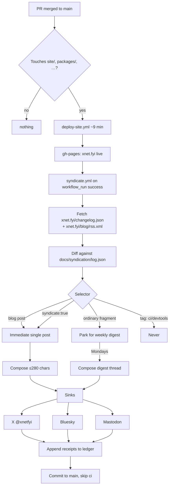
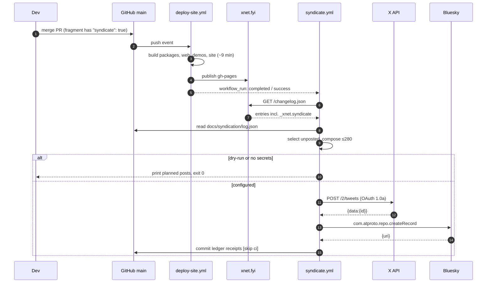
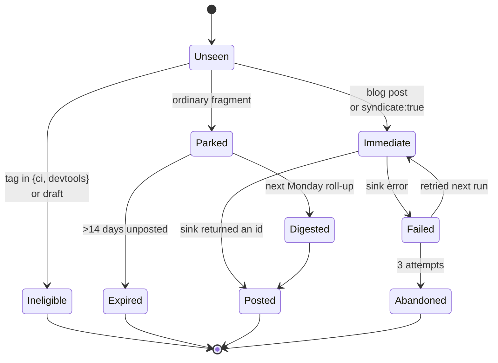

# POSSE Syndication — Automating @xnetfyi From the Changelog and Blog

> [!TIP]
> **TL;DR** — The plumbing is nearly free: `xnet.fyi` already emits a JSON Feed
> and two RSS feeds, so a syndicator can read what actually shipped rather than
> re-deriving it. The hard part is **selection**, not transport. At the current
> rate of ~150 changelog fragments a month, a firehose would post five times a
> day and cost **~$30/month** in X API fees, because X now charges **$0.20 per
> post containing a link**. Recommended: opt-in flag on fragments + a weekly
> digest thread + immediate posts for blog essays, over OAuth **1.0a** (tokens
> that don't expire), with a committed syndication ledger kept **outside
> `site/`**. That is ~4–8 posts a week and **~$2.50/month**.

## Problem Statement

There is now an X account at `@xnetfyi` and nothing posts to it. The ask is to
automate it: changelog entries, blog posts, "any notable change".

Taken literally that is a firehose, and the firehose is the wrong product. Two
numbers frame everything below:

| Signal                        | Volume                              |
| ----------------------------- | ----------------------------------- |
| Changelog fragments (2026-06) | 144                                 |
| Changelog fragments (2026-07) | 155                                 |
| Total fragments on disk       | 316 (`site/src/data/changelog/`)    |
| Blog essays                   | 24 (`site/src/data/blog.ts`)        |

That is **roughly five changelog entries per shipping day** against **two to
three essays per month**. An account with no audience posting five times a day
about `fix(devtools): seed the registered habit-heatmap widget type` will train
the few people who do follow it to mute.

So the real question is not "how do we post to X" — that is a solved afternoon
of work — but **"what earns a post, and who decides?"**

> [!IMPORTANT]
> There is also a values question this repo cannot dodge. Charter §6 says you
> own your audience and a platform should not rent it back to you. Automating
> publication _into_ a walled garden is in tension with that unless the
> syndicated copy is explicitly a **mirror** and never the **origin**. That
> constraint has a name — POSSE — and it happens to also be the cheapest and
> most robust architecture.

---

## Executive Summary

| Decision                    | Answer                                                                       |
| --------------------------- | ---------------------------------------------------------------------------- |
| Architecture                | POSSE — publish to `xnet.fyi`, syndicate a copy with a link home              |
| Source of truth             | The **deployed** feeds (`/changelog.json`, `/blog/rss.xml`), not the workspace |
| Trigger                     | `workflow_run` after **Deploy Site to GitHub Pages** succeeds                  |
| Selection                   | Opt-in `syndicate` field + weekly digest + automatic for blog posts            |
| Transport                   | Direct X API v2, **OAuth 1.0a** user context (non-expiring tokens)             |
| Second sink                 | Bluesky — free, and `lexicons/` + `scripts/atproto/` already exist             |
| State                       | Committed JSON ledger under `docs/`, **never** under `site/`                   |
| Cost                        | ~$2.50/month vs ~$30/month for a firehose                                      |
| Door                        | Two-way — no wire format, no public API, no revenue lane                       |

---

## Current State In The Repository

The good news is that almost every part of this already exists for other
reasons. Nothing here needs to be invented; it needs to be connected.

### Machine-readable feeds already ship

| Surface | File | What it gives us |
| ------- | ---- | ---------------- |
| JSON Feed 1.1 | [`site/src/pages/changelog.json.ts`](../../site/src/pages/changelog.json.ts) | ✅ The richest source — see below |
| Changelog RSS | [`site/src/pages/changelog.xml.ts`](../../site/src/pages/changelog.xml.ts) | ✅ RSS 2.0, CORS-open |
| Blog RSS | [`site/src/pages/blog/rss.xml.ts`](../../site/src/pages/blog/rss.xml.ts) | ✅ RSS 2.0, `dc:creator` bylines |
| Feed builders | [`site/src/lib/changelog-feed.ts`](../../site/src/lib/changelog-feed.ts), [`site/src/lib/blog-feed.ts`](../../site/src/lib/blog-feed.ts) | Pure functions, no side effects |

The JSON Feed already carries an `_xnet` extension block with exactly the fields
a syndicator wants — read
[`site/src/lib/changelog-feed.ts`](../../site/src/lib/changelog-feed.ts):

```jsonc
{
  "id": "2026-08-03-new-essay-the-harvest-you-can-count",
  "url": "https://xnet.fyi/changelog#2026-08-03-…",
  "title": "New essay: The Harvest You Can Count",
  "content_text": "…summary…\n\n• highlight\n• highlight",
  "date_published": "2026-07-19T08:04:20Z",
  "tags": ["platform"],
  "_xnet": { "summary": "…", "highlights": [], "mergedAt": "…", "pr": 584 }
}
```

> [!NOTE]
> `id` is stable and unique (enforced by `site/scripts/validate-changelog.ts`),
> which makes it a free idempotency key. A syndicator that records posted `id`s
> can never double-post, even if the workflow re-runs.

### The data model to extend

[`site/src/data/changelog.ts`](../../site/src/data/changelog.ts) defines
`ChangelogEntry` with `id`, `date`, `title`, `summary`, `highlights[]`,
`tags[]`, optional `hero`, `images[]`, `video`, `authors[]`, `pr`, `mergedAt`.
Fragments are one JSON file per PR in `site/src/data/changelog/`, scaffolded by
[`scripts/changelog/new.mjs`](../../scripts/changelog/new.mjs).

Blog metadata lives in [`site/src/data/blog.ts`](../../site/src/data/blog.ts) —
`slug`, `pubDate`, `tags`, `draft`, authors. The header comment there is worth
reading before touching anything: `pubDate` is the real go-live instant, and
`draft: true` posts must never reach a feed. **A syndicator that reads
`publishedPosts()` inherits that guarantee for free; one that globs
`site/src/pages/blog/*.astro` does not.**

### On-merge automation precedent

[`.github/workflows/stamp-pr-number.yml`](../../.github/workflows/stamp-pr-number.yml)
is the template to copy. It already solves the two annoying problems: writing a
commit back to `main` from CI (a GitHub App token added to the ruleset bypass
list, gated on the `CHANGELOG_APP_ID` **variable** so it degrades to a warning
when unconfigured) and avoiding a CI loop (`[skip ci]`).

### Deploy timing

[`.github/workflows/deploy-site.yml`](../../.github/workflows/deploy-site.yml) is the
only thing that makes a fragment public. Note its `paths:` filter:

```yaml
paths:
  - 'site/**'
  - 'apps/web/**'
  - 'apps/demos/**'
  - 'packages/**'
  - 'registry/**'
```

> [!WARNING]
> `docs/**` is **not** in that list, and that is load-bearing for this design.
> If the syndication ledger were committed under `site/src/data/`, every
> syndication run would retrigger `deploy-site`, which would retrigger
> syndication. Put the ledger under `docs/`. Memory also records that
> `deploy-site` takes **~9 minutes** — an early verification shows the
> _previous_ deploy, so the syndicator must run on `workflow_run` completion,
> not on a timer.

### ATProto groundwork already laid

[`scripts/atproto/publish-lexicons.mjs`](../../scripts/atproto/publish-lexicons.mjs)
(explorations 0372/0420) is a zero-dependency script that authenticates against
a PDS and writes records, with a `--dry-run` mode that needs no credentials.
That is 80% of a Bluesky sink, in the house style.

### Gate conventions

`package.json` carries ~20 `check:*` scripts. The relevant pattern is
`check:gate-controls`, which runs `--selftest` on both
[`scripts/check-humane-patterns.mjs`](../../scripts/check-humane-patterns.mjs) and
`check-motion-vocab.mjs`. Per AGENTS.md, any new gate needs a negative control
that proves it can go red.

### 🛑 What must not happen on the site

Five essays literally promise the reader that the page "loads nothing
third-party" —
[`hand-on-the-tiller.astro:379`](../../site/src/pages/blog/hand-on-the-tiller.astro),
[`palimpsest.astro:533`](../../site/src/pages/blog/palimpsest.astro),
[`the-right-to-say-no.astro:367`](../../site/src/pages/blog/the-right-to-say-no.astro),
and two more that avoid even Mermaid to keep the promise literal.

> [!CAUTION]
> Do **not** add an X timeline embed, follow button, or `platform.twitter.com`
> script to `xnet.fyi`. It would make liars of five published essays, and
> `site/` is in scope for `check-humane-patterns.mjs`'s surplus rules
> (exploration 0257). Syndication is outbound only. A plain `<a>` to the profile
> in the footer is fine; a widget is not.

---

## External Research

### X repriced in February 2026 — this is the finding that shapes everything

X replaced tiered pricing with **pay-per-use as the default** on 2026-02-06.
There is no free tier for new developers, and Basic ($200/mo) and Pro
($5,000/mo) are closed to new signups.

| Action | Price |
| ------ | ----- |
| Post created, no link | **$0.015** |
| Post created, **contains a link** | **$0.20** |
| Post read | $0.005 (capped 2M/mo) |
| User lookup | $0.01 |

> [!IMPORTANT]
> **A post with a link costs 13× a post without one.** Every POSSE post
> contains a link by definition — that is the entire point of POSSE. So the
> unit cost of this project is $0.20 per syndicated item, and the only lever
> that matters is *how many items*.

<details>
<summary>Cost model — firehose vs discipline</summary>

Let $n_\ell$ = link-bearing posts/month and $n_t$ = text-only posts/month:

$$ C = 0.20\,n_\ell + 0.015\,n_t $$

**Firehose** (every fragment, one post each, all with links):

$$ C = 0.20 \times 150 = \$30.00/\text{month} \approx \$360/\text{year} $$

…for five posts a day of mostly-internal changes.

**Recommended discipline:**

| Stream | Rate | Shape | Monthly |
| ------ | ---- | ----- | ------- |
| Blog essays | ~3/mo | 1 link post | $0.60 |
| Weekly changelog digest | ~4.3/mo | thread: 1 link + 3 text | $1.05 |
| Opt-in notable singles | ~4/mo | 1 link post | $0.80 |
| **Total** | **~11/mo** | | **≈ $2.45** |

A **thread** is the cheap primitive: put the canonical link in the first post
only and every follow-up costs $0.015. A four-post digest thread is $0.245, not
$0.80.

</details>

> [!WARNING]
> The thread trick assumes X only surcharges posts whose own text contains a
> URL, and that a t.co-wrapped link, a quote-post, and a link card are all
> billed the same. None of that is documented precisely enough to trust. Treat
> the model as a hypothesis and **reconcile it against the first real invoice**
> — that is an explicit validation item below.

### Auth: OAuth 1.0a beats OAuth 2.0 for a single-account bot

This is counterintuitive — 1.0a is the legacy standard — but for unattended CI
it is clearly correct.

| | OAuth 1.0a user context | OAuth 2.0 PKCE |
| --- | --- | --- |
| Access token lifetime | **Never expires** unless revoked | 2 hours |
| Refresh token | n/a | 6 months, **one-time use, rotates** |
| CI storage | Four static secrets, set once | Must write the new refresh token back to a repo secret **every run** |
| Failure mode | Silent only on revocation | One failed write-back **bricks the chain** and needs a human re-auth |

OAuth 2.0 refresh-token rotation exists to detect replay by invalidating the
whole chain when a token is reused — exactly the behaviour you do not want when
a GitHub Actions job dies between "refresh" and "save secret".

> [!TIP]
> Use OAuth 1.0a: `API_KEY`, `API_SECRET`, `ACCESS_TOKEN`, `ACCESS_SECRET`.
> Four secrets, no rotation, no write-back, no state. It still authorises
> `POST /2/tweets` on the v2 API.

### Prior art: POSSE

POSSE — *Publish (on your) Own Site, Syndicate Elsewhere* — is the IndieWeb
practice of posting to your own site first and pushing copies outward with a
link back. It is the exact architectural expression of Charter §6, and it means
the X account can be abandoned at any time without losing anything.

### Transport alternatives surveyed

| Route | Cost | Who holds the keys | Verdict |
| ----- | ---- | ------------------ | ------- |
| **Direct X API, OAuth 1.0a** | ~$2.50/mo | Us | ✅ **Recommended** |
| Direct X API, OAuth 2.0 PKCE | same | Us | 🛑 Rotation footgun in CI |
| Buffer API (GA on all plans, ~100 req/15min) | $0–$5/channel/mo | Buffer | ✅ Viable fallback — Buffer's own X access absorbs the $0.20 |
| Typefully | Free ≤15 posts/mo | Typefully | 🚧 Fits the volume, but text-networks only and a hard cap |
| Postiz (self-hosted, open source) | Free to run | Us | ❌ Still needs **our own** X approval → same $0.20. No saving |
| Zapier / IFTTT RSS→X | $20+/mo | Third party | ❌ Costs more than the API and we lose control of the copy |
| Browser automation / unofficial libs | "Free" | Us | 🛑 ToS violation, account suspension risk. Not considered |

Buffer is the interesting one: because Buffer holds enterprise-grade X access
and resells it per channel, it sidesteps the link surcharge entirely. It is the
right fallback if the $0.20 model turns out worse than modelled, and it is a
one-file change if the sink interface is kept narrow.

### Free sinks worth adding at the same time

- **Bluesky** — `com.atproto.repo.createRecord` with an app password. No cost,
  no rate anxiety, and `scripts/atproto/publish-lexicons.mjs` already shows the
  shape.
- **Mastodon** — a single `POST /api/v1/statuses` with a bearer token.

Both are ~30 lines each behind the same sink interface. Since X is the
expensive, fragile, values-awkward sink, having two free ones behind the same
code makes X replaceable rather than load-bearing.

---

## Key Findings

1. **Transport is trivial; selection is the whole problem.** 150 fragments a
   month cannot all be tweeted, at any price.
2. **$0.20 per link post** makes post *count* the only cost lever, and makes
   threads the efficient primitive.
3. **The feeds already exist and are CORS-open.** Reading the deployed feed —
   not the workspace — is both simpler and more correct: it syndicates what is
   actually live.
4. **OAuth 1.0a is the boring correct choice** for unattended posting.
5. **The ledger must live outside `site/`** or the deploy loop closes on itself.
6. **Blog posts are the high-value stream** and they are already rate-limited by
   how hard essays are to write. They should be automatic.
7. **Not a revenue lane.** Charter §6's three "No ground rent" tests
   (improvement / BATNA / vanish) govern *charging*, and nothing here charges
   anyone. The applicable Charter constraint is the mirror-never-origin
   invariant, which POSSE satisfies by construction.

---

## 🧭 Architecture



The pipeline in three boxes:

```text
┌──────────────┐     ┌──────────────┐     ┌──────────────┐
│  xnet.fyi    │ ──▶ │  Selector +  │ ──▶ │  Sinks       │
│  (canonical) │     │  Composer    │     │  X / bsky /  │
│  feeds       │ ◀── │  + ledger    │     │  mastodon    │
└──────────────┘     └──────────────┘     └──────────────┘
     origin              decision              mirror
```

<details>
<summary>Sequence: what happens on a merge that ships something notable</summary>



</details>

### Syndication state per item



> [!IMPORTANT]
> `Expired` and `Abandoned` are recorded in the ledger with a reason, not
> silently dropped. AGENTS.md is explicit: "a truncated run is not a completed
> one", and "absent" and "unreadable" must be different values. A syndication
> run that posted 3 of 5 must exit non-zero and say which two failed.

---

## Options And Tradeoffs

### Selection — the decision that actually matters

| Option | Who decides | Posts/mo | Cost/mo | Verdict |
| ------ | ----------- | -------- | ------- | ------- |
| **A. Firehose** — every fragment | Nobody | ~150 | $30.00 | ❌ Five a day of `fix(devtools):` noise |
| **B. Tag allowlist** — drop `ci`, `devtools` | The tag vocabulary | ~110 | $22.00 | ❌ Barely helps; tags describe area, not significance |
| **C. Opt-in field** — `"syndicate": true` on the fragment | The PR author | ~4 | $0.80 | ✅ Author knows; costs one line; defaults to quiet |
| **D. AI scoring** — Haiku ranks fragments | A model | tunable | $0.80 + tokens | 🚧 Good *composer*, poor *gatekeeper* — see below |
| **E. Weekly digest** — roll up the week | The calendar | ~4.3 threads | $1.05 | ✅ Nothing is lost, nothing is spammed |
| **F. Blog auto-post** | `publishedPosts()` | ~3 | $0.60 | ✅ Already rate-limited by effort |
| **→ C + E + F** | | **~11** | **≈$2.45** | ✅ **Recommended** |

> [!NOTE]
> On option D: an AI selector is a gate whose pass condition is not decidable,
> which AGENTS.md warns against — "a gate that cannot go green teaches everyone
> to ignore red". The same model is excellent at the *bounded* job of squeezing
> a title and summary into 280 characters, where the fallback is a deterministic
> template and a bad output is visible before posting. Use the model for
> composition, a human boolean for selection.

Option C costs the author one line in a file they are already editing:

```jsonc
{
  "title": "Your hub keeps the same address when it moves",
  "summary": "…",
  "tags": ["sync"],
  "syndicate": true          // ← opt in, default false
}
```

### Where the syndicator reads from

| Source | Pro | Con | Verdict |
| ------ | --- | --- | ------- |
| **Deployed feeds** (`xnet.fyi/changelog.json`) | Syndicates what is genuinely live; no monorepo build; survives site refactors | Depends on the deploy having landed | ✅ **Recommended** |
| Workspace `site/src/data/**` | No network | `site/` installs `--ignore-workspace` and cannot be imported from `scripts/`; would post things that failed to deploy | ❌ |
| GitHub release / PR events | Real-time | Fragments are not releases; PR titles are not user-facing copy | ❌ |

### Where state lives

| Store | Auditable | Loop risk | Verdict |
| ----- | --------- | --------- | ------- |
| **`docs/syndication/log.json`, committed** | ✅ Receipts in git, matches the claims-ledger culture | None — `docs/**` is outside `deploy-site`'s `paths:` | ✅ **Recommended** |
| `site/src/data/syndicated.json` | ✅ | 🛑 **Retriggers `deploy-site` → infinite loop** | 🛑 |
| Actions cache | ❌ | None | ❌ Evicted after 7 days; a miss re-posts everything |
| Read back from the X timeline | ⚠️ | None | ❌ Costs $0.005/read and fails if a post is deleted |

---

## Recommendation

> [!TIP]
> **Build `scripts/syndicate/` as a zero-dependency Node script in the house
> style — `--dry-run` by default in CI until proven, fail-loud, four static
> OAuth 1.0a secrets — driven by a `workflow_run` trigger on `deploy-site`.
> Ship X and Bluesky sinks together so X is never the only path out.**

Concretely:

1. **Add `syndicate?: boolean` to `ChangelogEntry`**, surfaced through the JSON
   Feed's `_xnet` block, with `--syndicate` on `scripts/changelog/new.mjs`.
   Default `false`. Update `site/scripts/validate-changelog.ts`.
2. **Blog posts syndicate automatically** from `publishedPosts()` via the
   existing RSS feed — `draft: true` is respected for free.
3. **A weekly digest thread** on Monday covering everything merged in the last
   seven days that was not already posted, grouped by tag. Link in post 1 only.
4. **Never syndicate** `ci` or `devtools`-only fragments.
5. **X sink over OAuth 1.0a**; **Bluesky sink** over an app password; Mastodon
   optional. One narrow interface so Buffer can replace the X sink in one file.
6. **Ledger at `docs/syndication/log.json`**, committed with `[skip ci]` by the
   same GitHub App that `stamp-pr-number.yml` already uses.
7. **`pnpm check:syndication`** enforcing the POSSE invariant — every composed
   post carries an `https://xnet.fyi/…` canonical link and is ≤280 characters —
   with a `--selftest` wired into `check:gate-controls`.

### Brand spelling

Tweet copy is prose a human reads, so it is **`xNet`**, never `XNet`. The handle
`@xnetfyi` is a machine surface and stays lowercase. Both follow AGENTS.MD
as written; the composer prompt must say so explicitly, because a model asked
to "write a tweet about XNet" will happily capitalise it.

### Charter check

This proposes no new way for xNet to make money, so §6's improvement / BATNA /
vanish tests do not bind. The Charter constraint that *does* apply is
"own your audience": satisfied because `xnet.fyi` stays canonical, every
syndicated post links home, the subscriber-facing artefacts are the RSS and
JSON feeds we host, and deleting the X account tomorrow would cost nothing but
reach.

---

## Example Code

<details>
<summary>OAuth 1.0a request signing, zero dependencies (the only fiddly part)</summary>

```js
import { createHmac, randomBytes } from 'node:crypto'

const enc = (s) => encodeURIComponent(s).replace(/[!*()']/g, (c) =>
  '%' + c.charCodeAt(0).toString(16).toUpperCase())

/**
 * OAuth 1.0a HMAC-SHA1 Authorization header. Note the body is NOT signed for
 * JSON requests — only the OAuth params — which is why POST /2/tweets works
 * with a plain JSON body.
 */
export function oauthHeader({ method, url, key, secret, token, tokenSecret }) {
  const params = {
    oauth_consumer_key: key,
    oauth_nonce: randomBytes(16).toString('hex'),
    oauth_signature_method: 'HMAC-SHA1',
    oauth_timestamp: String(Math.floor(Date.now() / 1000)),
    oauth_token: token,
    oauth_version: '1.0'
  }
  const base = [
    method.toUpperCase(),
    enc(url),
    enc(Object.keys(params).sort().map((k) => `${enc(k)}=${enc(params[k])}`).join('&'))
  ].join('&')

  params.oauth_signature = createHmac('sha1', `${enc(secret)}&${enc(tokenSecret)}`)
    .update(base)
    .digest('base64')

  return 'OAuth ' + Object.keys(params).sort()
    .map((k) => `${enc(k)}="${enc(params[k])}"`)
    .join(', ')
}
```

</details>

<details>
<summary>The sink interface — narrow on purpose, so X is replaceable</summary>

```js
/**
 * @typedef {{ text: string, replyTo?: string }} Draft
 * @typedef {{ name: string, post(draft: Draft): Promise<{ id: string, url: string }> }} Sink
 */

/** Post a thread: the first draft carries the canonical link, the rest don't. */
export async function postThread(sink, drafts) {
  const receipts = []
  let replyTo
  for (const draft of drafts) {
    // No try/catch: a partial thread must fail loudly. AGENTS.md — a truncated
    // run is not a completed one, and the ledger records what DID land so the
    // retry doesn't duplicate.
    const receipt = await sink.post({ ...draft, replyTo })
    receipts.push(receipt)
    replyTo = receipt.id
  }
  return receipts
}

/** @returns {Sink} */
export const xSink = (creds) => ({
  name: 'x',
  async post({ text, replyTo }) {
    const url = 'https://api.x.com/2/tweets'
    const res = await fetch(url, {
      method: 'POST',
      headers: {
        'content-type': 'application/json',
        authorization: oauthHeader({ method: 'POST', url, ...creds })
      },
      body: JSON.stringify({
        text,
        ...(replyTo ? { reply: { in_reply_to_tweet_id: replyTo } } : {})
      })
    })
    if (!res.ok) throw new Error(`X API ${res.status}: ${await res.text()}`)
    const { data } = await res.json()
    return { id: data.id, url: `https://x.com/xnetfyi/status/${data.id}` }
  }
})
```

</details>

<details>
<summary>Selection + composition, with a deterministic fallback</summary>

```js
const NEVER = new Set(['ci', 'devtools'])
const LIMIT = 280
const LINK_COST = 23 // t.co wraps every URL to a fixed width

const eligible = (e) => !e.tags.every((t) => NEVER.has(t))

/** Immediate: author opted in. Everything else parks for the weekly digest. */
export function select(entries, posted) {
  const fresh = entries.filter((e) => eligible(e) && !posted.has(e.id))
  return {
    immediate: fresh.filter((e) => e._xnet?.syndicate === true),
    parked: fresh.filter((e) => e._xnet?.syndicate !== true)
  }
}

/**
 * Deterministic composer. The AI path (Haiku, mirroring
 * scripts/changelog/ai-release-notes.mjs) refines this and FAILS OPEN to it —
 * a missing ANTHROPIC_API_KEY must never block a post.
 */
export function compose(entry) {
  const room = LIMIT - LINK_COST - 2
  const head = entry.title.trim()
  const tail = entry._xnet.summary.split(/(?<=\.)\s/)[0].trim()
  const body = (head + ' — ' + tail).length <= room
    ? `${head} — ${tail}`
    : head.slice(0, room)
  return `${body}\n\n${entry.url}`
}
```

</details>

<details>
<summary>The workflow — runs after the deploy, never blocks it</summary>

```yaml
name: Syndicate

# Runs only after the site is genuinely live, because we syndicate the
# DEPLOYED feed. deploy-site takes ~9 min; a timer would race it (0364).
on:
  workflow_run:
    workflows: ['Deploy Site to GitHub Pages']
    types: [completed]
  schedule:
    - cron: '0 10 * * 1' # Monday digest
  workflow_dispatch:
    inputs:
      dry-run: { type: boolean, default: true }

permissions:
  contents: write

concurrency:
  group: syndicate
  cancel-in-progress: false

jobs:
  syndicate:
    # Never syndicate off a failed deploy — the feed would be stale or absent.
    if: github.event_name != 'workflow_run' || github.event.workflow_run.conclusion == 'success'
    runs-on: ubuntu-latest
    steps:
      - uses: actions/checkout@v4
      # No secrets configured → --dry-run, prints the plan, exits 0.
      - run: node scripts/syndicate/run.mjs ${{ inputs.dry-run && '--dry-run' || '' }}
        env:
          X_API_KEY: ${{ secrets.X_API_KEY }}
          X_API_SECRET: ${{ secrets.X_API_SECRET }}
          X_ACCESS_TOKEN: ${{ secrets.X_ACCESS_TOKEN }}
          X_ACCESS_SECRET: ${{ secrets.X_ACCESS_SECRET }}
          BLUESKY_HANDLE: ${{ vars.BLUESKY_HANDLE }}
          BLUESKY_APP_PASSWORD: ${{ secrets.BLUESKY_APP_PASSWORD }}
          ANTHROPIC_API_KEY: ${{ secrets.ANTHROPIC_API_KEY }}
```

</details>

---

## Risks And Open Questions

| Risk | Severity | Mitigation |
| ---- | -------- | ---------- |
| X reprices again | High — it already did in Feb 2026 | Narrow sink interface; Buffer is a one-file swap. `review: 2026-11-01` |
| The $0.20 link model is wrong in detail | Medium | Reconcile against the first invoice before removing `--dry-run` (validation item) |
| OAuth 1.0a token silently revoked | Medium | The job fails loudly; add a monthly no-op heartbeat so a dead token surfaces without waiting for a release |
| Ledger commit races the deploy | Medium | `concurrency: syndicate` + `[skip ci]` + ledger outside `site/` |
| Duplicate posts on workflow re-run | Medium | `id` from the feed is the idempotency key; ledger is checked before every post |
| AI composer writes something wrong or off-brand | Medium | Deterministic fallback; `xNet` casing in the prompt; `--dry-run` prints exact text; nothing is auto-deleted so a bad post is a human `gh`/manual fix |
| Automating into a walled garden reads badly | Low but real | POSSE by construction; canonical link enforced by a gate; no X widgets on `xnet.fyi` |
| ToS: bulk/duplicate automated content | Low | ~11 posts/month of distinct content is ordinary product-account behaviour |

**Open questions:**

- [ ] Does the $0.20 surcharge apply per-post or per-URL, and does a link **card** or **quote-post** count? Determines whether the thread trick works.
- [ ] Should the weekly digest post even in a week with nothing notable? (Proposed: no — silence over filler.)
- [ ] Should the account also syndicate **explorations**? They are internal-facing and there are ~85/month; proposed **no**.
- [ ] Is `@xnetfyi` already following/posting anything? The profile returned HTTP 402 to automated fetch, so it was not verified during this exploration.
- [ ] Does a Bluesky sink want its own DID under `fyi.xnet.*` (0372) or is `bsky.social` fine to start? Proposed: `bsky.social` now, revisit with 0420.

---

## Implementation Checklist

**Status:** ░░░░░░░░░░ 0/18 items

**Phase 1 — data model**

- [ ] Add `syndicate?: boolean` to `ChangelogEntry` in `site/src/data/changelog.ts`
- [ ] Surface it in the `_xnet` block of `buildJsonFeed()` in `site/src/lib/changelog-feed.ts`
- [ ] Accept `--syndicate` in `scripts/changelog/new.mjs`
- [ ] Teach `site/scripts/validate-changelog.ts` about the new field

**Phase 2 — the syndicator**

- [ ] `scripts/syndicate/oauth.mjs` — OAuth 1.0a signing, zero-dep, unit tested
- [ ] `scripts/syndicate/sinks.mjs` — `xSink`, `blueskySink`, shared `postThread`
- [ ] `scripts/syndicate/select.mjs` — eligibility, immediate vs parked, digest roll-up
- [ ] `scripts/syndicate/compose.mjs` — deterministic composer + Haiku refinement that fails open
- [ ] `scripts/syndicate/ledger.mjs` — read/append `docs/syndication/log.json` with reasons for skips
- [ ] `scripts/syndicate/run.mjs` — orchestration, `--dry-run`, non-zero exit on partial failure

**Phase 3 — CI**

- [ ] `.github/workflows/syndicate.yml` on `workflow_run` + Monday cron + dispatch
- [ ] Reuse the `CHANGELOG_APP_ID` GitHub App to commit the ledger with `[skip ci]`
- [ ] Set `X_API_KEY` / `X_API_SECRET` / `X_ACCESS_TOKEN` / `X_ACCESS_SECRET` repo secrets **(human, needs the X developer portal)**
- [ ] Set `BLUESKY_HANDLE` variable + `BLUESKY_APP_PASSWORD` secret **(human)**

**Phase 4 — gates and docs**

- [ ] `scripts/check-syndication.mjs` — POSSE invariant (canonical link present, ≤280 chars, `xNet` casing) with `--selftest`
- [ ] Wire `check:syndication` into `package.json` and its selftest into `check:gate-controls`
- [ ] Document the opt-in field in `.claude/skills/changelog/SKILL.md`
- [ ] Add a `Sources`-style footer note to `docs/` explaining where the ledger lives and why it is not under `site/`

## Validation Checklist

- [ ] `node scripts/syndicate/run.mjs --dry-run` prints the exact text of every planned post and touches no network sink
- [ ] Running it twice with an unchanged ledger plans **zero** posts (idempotency)
- [ ] A deliberately failing sink makes the job exit **non-zero**, and the ledger records the failure rather than marking the item posted
- [ ] `check:syndication --selftest` goes **red** on a planted post that omits the canonical link, and red on one at 281 characters
- [ ] A `draft: true` blog post never appears in a plan
- [ ] A `ci`-only fragment never appears in a plan
- [ ] The first real post lands on X **and** Bluesky with matching text and a working `xnet.fyi` link
- [ ] Committing the ledger does **not** trigger `deploy-site` (check the Actions tab after the first real run)
- [ ] The first month's X invoice is within 25% of the ~$2.50 model — if not, reopen the transport decision and price Buffer
- [ ] `xnet.fyi` still loads zero third-party requests after the change (network panel on `/blog/palimpsest`)

---

## References

**Repository**

- [`site/src/pages/changelog.json.ts`](../../site/src/pages/changelog.json.ts) — JSON Feed 1.1 endpoint
- [`site/src/lib/changelog-feed.ts`](../../site/src/lib/changelog-feed.ts) — feed builders and the `_xnet` extension
- [`site/src/pages/blog/rss.xml.ts`](../../site/src/pages/blog/rss.xml.ts), [`site/src/lib/blog-feed.ts`](../../site/src/lib/blog-feed.ts) — blog RSS
- [`site/src/data/changelog.ts`](../../site/src/data/changelog.ts) — `ChangelogEntry`, fragment conventions
- [`site/src/data/blog.ts`](../../site/src/data/blog.ts) — `publishedPosts()`, `pubDate` and `draft` rules
- [`scripts/changelog/new.mjs`](../../scripts/changelog/new.mjs) — fragment scaffolder
- [`scripts/changelog/ai-release-notes.mjs`](../../scripts/changelog/ai-release-notes.mjs) — the fail-open Haiku pattern to copy
- [`scripts/atproto/publish-lexicons.mjs`](../../scripts/atproto/publish-lexicons.mjs) — zero-dep ATProto client, `--dry-run` mode
- [`.github/workflows/stamp-pr-number.yml`](../../.github/workflows/stamp-pr-number.yml) — commit-back-to-main via GitHub App
- [`.github/workflows/deploy-site.yml`](../../.github/workflows/deploy-site.yml) — the `paths:` filter that forces the ledger out of `site/`
- [`scripts/check-humane-patterns.mjs`](../../scripts/check-humane-patterns.mjs) — the `--selftest` gate pattern
- [`docs/CHARTER.md`](../../docs/CHARTER.md) §6 — Commons, own your audience, No ground rent

**Related explorations**

- 0362 — publishing / blogging platform (`packages/publish`)
- 0372 / 0420 — joining the ATmosphere; `fyi.xnet.*` lexicons
- 0234 — the Humane Internet Charter and its machine-checkable gates
- 0257 — `site/` is in scope for the humane gates
- 0364 — blog revision transparency; `deploy-site` takes ~9 minutes
- 0197 / 0202 / 0203 — changelog fragments, PR resolution, PR stamping
- 0430 — every gate needs a negative control
- 0421 — explorations need a `review` date or they never close

**External**

- [POSSE — IndieWeb](https://indieweb.org/POSSE)
- [X (Twitter) API Pricing in 2026: All Tiers — Postproxy](https://postproxy.dev/blog/x-api-pricing-2026/)
- [X (Twitter) API Posting: 2026 Integration Guide — Postproxy](https://postproxy.dev/blog/x-twitter-api-posting-integration-guide/)
- [OAuth FAQ — X Developers](https://docs.x.com/fundamentals/authentication/faq)
- [How long do the OAuth 1.0a tokens last? — X Developers](https://devcommunity.x.com/t/how-long-do-the-oauth-1-0a-tokens-last/182011)
- [Twitter/X API Pricing 2026: All Tiers Compared — xpoz.ai](https://www.xpoz.ai/blog/guides/understanding-twitter-api-pricing-tiers-and-alternatives/)
- [The Best Social Media APIs for Developers in 2026 — Buffer](https://buffer.com/resources/best-social-media-apis/)
- [Postiz Review 2026 — linkstartai](https://www.linkstartai.com/en/agents/postiz)
- [wpowiertowski/posse — Ghost → Mastodon + Bluesky syndicator](https://github.com/wpowiertowski/posse)
- [xdevplatform/xurl — official X API CLI](https://github.com/xdevplatform/xurl)
