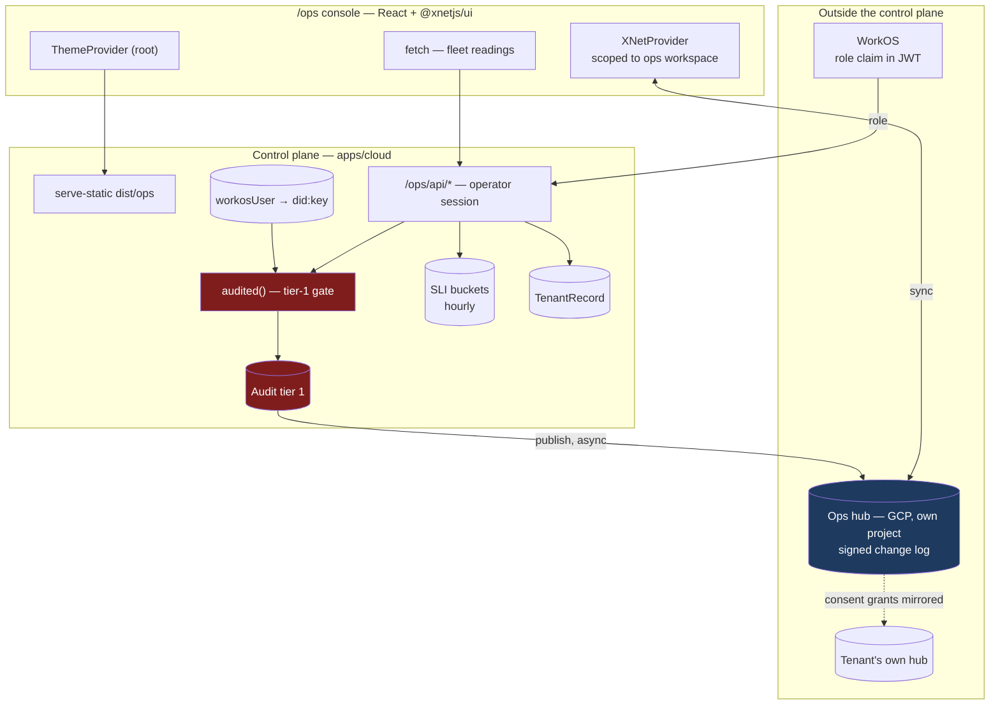
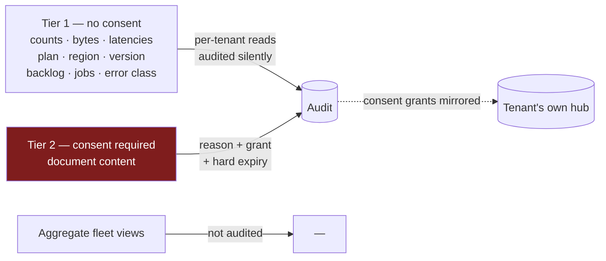
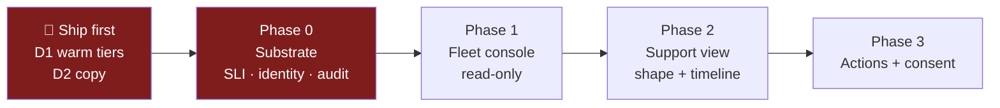

# Operator console — the decided plan

> [!TIP]
> **TL;DR** — This is the decision register and build plan for xNet Cloud's
> operator console. Sixteen decisions are settled; the research behind them is
> [exploration 0431](./0431_[_]_XNET_CLOUD_OPERATOR_CONSOLE_SRE_AND_SUPPORT.md),
> which stays where it is. The console is **React + Tailwind on `@xnetjs/ui`**,
> served same-origin from `apps/cloud`, running **on xNet for the record and
> REST for the readings**. Two defects found while deciding ship **before**
> any of it: the tiers that sell a 99.9% SLO are provisioned scale-to-zero, and
> five user-facing surfaces claim we cannot read data the hub demonstrably
> indexes.

---

## Problem Statement

[Exploration 0431](./0431_[_]_XNET_CLOUD_OPERATOR_CONSOLE_SRE_AND_SUPPORT.md)
established that xNet Cloud has no operator surface: `/internal/*` behind a flat
shared secret, JSON and `curl`, no attribution, no audit trail, and an SLI
substrate that reports health it has not measured. It surveyed the options but
left sixteen decisions open.

This document closes them and says what gets built, in what order. It does not
re-argue the research — where a claim is load-bearing it cites 0431 or the code.

> [!IMPORTANT]
> **Two findings emerged during the decision process that are not in 0431 and do
> not depend on the console being built at all.** They are live defects on
> surfaces you are about to sell. They ship first, standalone. See
> [Ship-first defects](#-ship-first-defects).

---

## Executive Summary

The console is the visible part; almost none of the risk is there. The risk is in
three substrate properties that must be true before a console is worth looking
at: the numbers must be **measured**, the actors must be **named**, and the
boundary between shape and content must be **enforced and logged**.

| Layer | Decision | Phase |
| ----- | -------- | ----- |
| Warm provisioning | `minInstances` derived from the SLO, not the isolation tier | 🔴 Ship first |
| Confidentiality copy | Correct all five claims | 🔴 Ship first |
| SLI durability | Hourly buckets in `DocStore`; 30d raw + daily rollup to 13mo | 0 |
| Gate semantics | Stale → freeze · young → excluded · fleet-wide zero → freeze | 0 |
| Public status | New `unmeasured` component state | 0 |
| Operator identity | WorkOS org role (authz) + Firestore DID binding (attribution) | 0 |
| Audit | Tier-1 Firestore gate + tier-2 signed node on the ops hub | 0 |
| Shared secret | Reads keep it; mutations reject it | 0 |
| Console | React + `@xnetjs/ui`, Vite → `dist/ops`, `serve-static` | 1 |
| Support view | Shape-only tenant view + timeline | 2 |
| Actions & consent | Reason-gated actions; per-incident, time-boxed consent | 3 |

---

## 🔴 Ship-first defects

Neither of these waits for the console. Both are small. Both are wrong today.

### D1 — the tiers that sell an SLO scale to zero

```ts
// packages/cloud/src/provisioner/adapters/cloud-run-litestream.ts:131
private minInstances(spec: ProvisionSpec): number {
  // Always-warm tier keeps one instance hot; everyone else scales to zero.
  return spec.entitlements.isolation === 'dedicated-warm' ? 1 : 0
}
```

Cross-referenced against `PLAN_CATALOG`:

| Plan | Isolation | SLA | `minInstances` | Burns budget? |
| ---- | --------- | --- | -------------- | ------------- |
| `demo` | `pooled` | none | 0 | ❌ objective `null` |
| `personal` | `dedicated-sleep` | best-effort | 0 | ❌ objective `null` |
| `family` | `dedicated-sleep` | best-effort | 0 | ❌ objective `null` |
| `team` | `dedicated-warm` | best-effort | **1** | ❌ objective `null` |
| `community` | `dedicated-project` | **99.9%** | **0** | ✅ **yes** |
| `company` | `dedicated-project` | **99.9%** | **0** | ✅ **yes** |
| `enterprise` | `region-pinned` | **custom (99.95%)** | **0** | ✅ **yes** |

> [!CAUTION]
> **The always-warm instance is given to the one tier that cannot burn an error
> budget, and withheld from all three that can.** `region-pinned` is not handled
> by the function at all — it falls through to `0`. A 99.9% monthly budget is
> 43.2 minutes; a single Cloud Run cold start with a Litestream restore can spend
> a meaningful fraction of that, and the tier is sold on the guarantee.

**Fix:** warmth is a **floor built from two independent reasons**, not one rule
replacing another. A plan stays warm if it publishes an availability objective
**or** its isolation tier is explicitly `dedicated-warm`. Sleep tiers keep
scaling to zero — they carry `objective: null`, so cold starts there cannot burn
a budget and are harmless.

> [!WARNING]
> The obvious fix — "warm iff the objective is non-null" — is wrong, and
> modelling the cost is what caught it. `team` is `dedicated-warm` but
> `best-effort`, so an objective-only rule would have **dropped a paying tier to
> scale-to-zero**. `PLAN_PRICING` models `team` with `warm: true`; the price
> already covers that COGS. Saving it would have been a silent downgrade.

This also corrects 0431's Finding 2, which aimed the cold-start problem at the
wrong tenants: it is not a measurement bug on sleep tiers, it is a provisioning
bug on SLO tiers.

**Cost delta (modelled against `packages/cloud/src/cost/pricing.ts`):** none of
consequence, because the price list already assumed the fixed behaviour.
`UNIT_COSTS.warmComputePerMonth` is **$6/unit/month**, so `minInstances` 0 → 1
adds ~$6/month per SLO tenant.

| Plan | Modelled | Price | Warm delta | Effect on margin |
| ---- | -------- | ----- | ---------- | ---------------- |
| `community` | `warm: true, warmUnits: 2` | $99/mo | +$6 | None — already priced warm |
| `enterprise` | `warm: true, warmUnits: 4` | $2000/mo | +$6 | None — already priced warm; 0.3% of revenue |
| `company` | **no scenario in `PLAN_PRICING`** | — | +$6 | ⚠️ unmodelled — see open questions |
| `team` | `warm: true` | $96/mo | 0 | Unchanged by the corrected rule |

`floor-margin.test.ts` passes unchanged. The one gap is that **`company` has no
`PricingScenario` at all**, so its margin floor is unasserted — that predates
this work and is noted rather than fixed here.

### D2 — five surfaces claim we cannot read data the hub indexes

> [!NOTE]
> Implementation found **five**, not four. Two were in the same `compare.ts`
> entry as the one already flagged, and a fifth was in the Habitat comparison
> two rows below it. The count in the decision interview was low.

| Location | Claim | Verdict |
| -------- | ----- | ------- |
| [`dashboard.ts:650`](../../apps/cloud/src/dashboard.ts) | "we only ever hold encrypted bytes" | ✅ corrected |
| [`site/src/pages/cloud/index.astro:20`](../../site/src/pages/cloud/index.astro) | "We hold encrypted bytes we cannot read." | ✅ corrected |
| [`site/src/data/compare.ts:1239`](../../site/src/data/compare.ts) | "the confidential body stays on a hub that **never sees plaintext**" | ✅ corrected |
| `compare.ts:1239` (same entry) | "xNet is **the end-to-end encrypted workspace**" | ✅ corrected — the exact claim `HonestMachine.astro` refuses |
| [`compare.ts:1244`](../../site/src/data/compare.ts) | "xNet's hub, which **never sees plaintext**" | ✅ corrected — kept the true half (no master read credential) |
| [`site/src/pages/privacy.astro:113`](../../site/src/pages/privacy.astro) | "we cannot read your data with it" | ✅ **no change needed** — "with it" scopes to the billing identity, and the surrounding paragraph is explicitly about the billing/data identity split |

[`search-indexer.ts`](../../packages/hub/src/services/search-indexer.ts) extracts
plaintext from rich text to build the FTS index. Exploration
[0343](./0343_[x]_XNET_AUTH_VS_KEYHIVE_COMPARISON.md) states the position at line
271: the trusted tier provides integrity and revocation-denial, "but not
confidentiality between users of the same hub."

> [!NOTE]
> This is not a new standard being imposed. The repo **already holds** this
> standard elsewhere and the cloud surface drifted from it. See
> `site/src/components/followed/HonestyBox.astro` ("We won't say everything is
> end-to-end encrypted"), `HonestMachine.astro` ("We won't call the whole thing
> end-to-end encrypted, because today it isn't") and `TrustBoundary.astro`
> ("precisely so the post never overclaims end-to-end encryption").

**Fix:** say the true and stronger thing — we hold your data, we do not look
without your consent, and here is the signed log that proves it. Correcting three
of four would be worse than correcting none, so all of them move together.

---

## The decision register

Sixteen decisions, each with the reasoning compressed to the line that decided it.

| # | Decision | Chosen | Because |
| - | -------- | ------ | ------- |
| 1 | Scope | Full console, all four phases | — |
| 2 | Data boundary | Record on xNet, readings in Firestore | 0323's 318k-row cold-open stall and 250-change burst cliff make a change log the wrong shape for a per-tenant hourly time series |
| 3 | Ops hub | GCP managed path, own project, outside the fleet provisioner | The Railway/Docker path is **already** dogfooded by the demo hub; the managed path is dogfooded by nothing |
| 4 | Identity | WorkOS org role (authz) + Firestore DID binding (attribution) | Roles are core AuthKit, arrive as **JWT claims** (no API call on the request path), and Directory Sync is not required |
| 5 | Audit scope | Graduated by sensitivity | A reason prompt on every read trains operators to type "investigating", producing a log that looks rigorous and means nothing |
| 6 | Tier 1 line | Shape only | Titles leak the thing being protected — a document called "Q3 layoffs" is the payload |
| 7 | Copy | Correct all four | See D2 |
| 8 | Gate semantics | Distinguish stale from young | A gate that freezes on every new signup gets switched off within a month |
| 9 | Warm tiers | `minInstances` from the SLO | See D1 |
| 10 | Public status | Add `unmeasured` | "Absent" and "unreadable" must be different values (`AGENTS.md`) |
| 11 | Shared secret | Reads keep it, mutations reject it | `cloud-company-metrics.mjs` is a real consumer; the takeover route is not worth keeping compatible |
| 12 | Build | Inside `apps/cloud`, Vite → `dist/ops` | One package, one deploy, no Dockerfile context changes |
| 13 | Tenant dashboard | Enable the stack, don't migrate | 0418 Phase 3 does it later, with usage evidence |
| 14 | Consent | Per-incident, time-boxed, never standing | Standing access is what erodes into routine unlogged looking |
| 15 | Retention | Audit 12mo **surviving tenant deletion**; SLI 30d + 13mo daily | Purging on deletion creates look-then-delete, which erases its own evidence |
| 16 | Landing | This doc is the plan; 0431 stays as research | Its findings are still the evidence base and stay citable |

---

## 🧭 Architecture



### The two-tier audit, and why the order matters

```mermaid
sequenceDiagram
  participant O as Operator
  participant API as /ops/api
  participant FS as Firestore (tier 1)
  participant Q as Publish queue
  participant OH as Ops hub (tier 2)

  O->>API: action + typed reason
  API->>API: WorkOS role claim ✓ · DID binding ✓
  API->>FS: append {operator, action, tenant, reason, started}
  Note over FS: FAIL-CLOSED — no write, no action
  FS-->>API: ok
  API->>API: perform the action
  API->>FS: append {outcome}
  API->>Q: enqueue signed node
  Q->>OH: publish (async, signed by operator DID)
  alt ops hub unreachable
    Q-->>Q: retain; queue depth becomes an alertable metric
    Note over Q,OH: action already happened — availability preserved,<br/>gap is VISIBLE, never silent
  end
```

> [!IMPORTANT]
> Tier 1 is the gate because it lives on the substrate the console already needs.
> Tier 2 is the verifiable copy. This is what lets the ops hub be a real
> dependency (ADR-31) without it becoming a single point of failure for incident
> response: during a fleet incident you can still see everything and still act —
> only audit *history* goes stale.

### The visibility boundary



> [!WARNING]
> This boundary is enforced by the console and the audit trail, **not by
> cryptography**. An operator with hub database access can read content
> regardless — that is precisely why D2's copy correction is not optional. The
> promise we can honestly make is "we do not look without your consent, and the
> log proves it," not "we cannot look."

---

## Phases



**Phase 0 — substrate.** Durable hourly SLI buckets; stale-vs-young gate
semantics; `unmeasured` public status; WorkOS operator role plus the Firestore
DID binding; the two-tier audit log; timing-safe secret compare with mutations
moved off the shared secret.

**Phase 1 — read-only fleet console.** React + `@xnetjs/ui` in
`apps/cloud/ops/`, Vite to `dist/ops/`, served by `serve-static` behind the
operator session. Read-only cannot make an incident worse.

**Phase 2 — support view.** Tenant lookup by email or `billingUserId` (the
`findWhere` index from 0423 already exists for this), shape-only tenant page, and
the timeline — the single highest-leverage support artifact, which exists in no
form today.

**Phase 3 — actions and consent.** Reason-gated actions wrapped in `audited()`;
the per-incident Tier 2 consent flow over Resend; every request, grant, denial
and expiry mirrored to the tenant's own hub.

---

## Example Code

The gate semantics from decision 8 — the part most likely to be got subtly wrong:

```ts
/** Why a tenant has no usable SLI window. The distinction is the whole point. */
export type WindowState =
  | { kind: 'measured'; availability: number }
  /** Newest bucket older than 2× the probe interval — measurement is BROKEN. */
  | { kind: 'stale'; newestBucketMs: number }
  /** Too few buckets because the tenant is new — benign, not evidence of harm. */
  | { kind: 'young'; bucketCount: number }

export function windowState(
  buckets: SliBucket[],
  opts: { nowMs: number; windowMs: number; probeIntervalMs: number; minBuckets: number }
): WindowState {
  const inWindow = buckets.filter((b) => b.hourMs >= opts.nowMs - opts.windowMs)
  if (inWindow.length === 0) return { kind: 'young', bucketCount: 0 }

  const newest = Math.max(...inWindow.map((b) => b.hourMs))
  // Reuses the jobs registry's existing definition of stale: 2× the interval.
  if (opts.nowMs - newest > 2 * opts.probeIntervalMs) {
    return { kind: 'stale', newestBucketMs: newest }
  }
  if (inWindow.length < opts.minBuckets) {
    return { kind: 'young', bucketCount: inWindow.length }
  }

  let ok = 0
  let valid = 0
  for (const b of inWindow) {
    // Cold starts count as valid-but-slow: the request eventually succeeded.
    ok += b.ok + b.coldStart
    valid += b.ok + b.coldStart + b.failed
  }
  return valid === 0
    ? { kind: 'young', bucketCount: inWindow.length }
    : { kind: 'measured', availability: ok / valid }
}
```

```ts
/**
 * The fleet deploy gate. `stale` freezes — a fleet nobody is measuring is not a
 * healthy fleet, and silent measurement failure is the exact hazard this whole
 * substrate exists to remove. `young` is EXCLUDED rather than frozen, so a new
 * signup never blocks a rollout; a gate that cries wolf gets switched off.
 */
export function fleetGate(states: WindowState[], objective: number | null): BudgetPolicy {
  if (states.length === 0) return 'freeze' // probing itself has stopped
  if (states.some((s) => s.kind === 'stale')) return 'freeze'

  const measured = states.filter((s): s is Extract<WindowState, { kind: 'measured' }> =>
    s.kind === 'measured'
  )
  if (measured.length === 0) return 'freeze' // every tenant young AND none measured

  const worst = Math.min(...measured.map((m) => errorBudgetRemaining(m.availability, objective)))
  return budgetPolicy(worst)
}
```

<details>
<summary>D1's fix — warmth derived from the SLO</summary>

```ts
/**
 * Always-warm iff the plan sells a measurable availability objective. Deriving
 * this from the SLO rather than the isolation tier is the fix for D1: the tier
 * check gave the warm instance to `dedicated-warm` (best-effort, cannot burn a
 * budget) and withheld it from `dedicated-project` and `region-pinned`, which
 * carry 99.9% and 99.95%. You cannot serve an availability SLO from a service
 * that scales to zero.
 */
private minInstances(spec: ProvisionSpec): number {
  return sloForPlan(spec.plan).objective !== null ? 1 : 0
}
```

Note this must not import from `apps/cloud` — `sloForPlan` reads
`PLAN_CATALOG[plan].sla`, so the mapping belongs in `@xnetjs/entitlements`
beside the catalogue, with `apps/cloud/src/observability/slo.ts` re-exporting it.

</details>

---

## ADRs

Two one-way doors are opened by this plan. Both are drafted here and land in
`site/src/content/docs/docs/architecture/decisions.mdx` as **ADR-31** and
**ADR-32** before Phase 0 code merges.

<details>
<summary>ADR-31 — Operational record on xNet; ops hub outside the fleet</summary>

**Decision:** operator actions, incident notes and consent grants are signed xNet
nodes on a dedicated ops hub, run through the managed GCP path in its own project
and **never** provisioned by the fleet provisioner. Metrics and tenant state stay
in Firestore.

**Tripwire:** the ops hub's change log crosses ~100k changes, or any proposal to
put a per-tenant time series on it — either re-opens the record/readings split.

</details>

<details>
<summary>ADR-32 — Support sees shape; content requires per-incident consent</summary>

**Decision:** operators see Tier 1 (shape) without consent. Content requires a
typed reason, the tenant's grant, and a hard expiry. Standing consent is refused
at every tier, including enterprise contracts.

**Tripwire:** the first support ticket that cannot be resolved at Tier 1, or the
first enterprise contract negotiation that makes standing access a condition of
sale — either re-opens the consent model.

</details>

---

## Risks And Open Questions

| Risk | Severity | Mitigation |
| ---- | -------- | ---------- |
| Console built before durable SLIs → operators trust a lie | 🔴 High | Phase ordering; Phase 1 renders "measuring"/"unmeasured", never a fabricated number |
| Ops hub shares fate with the fleet | 🔴 High | Own GCP project, outside the provisioner (ADR-31); tier-1 gate never blocks on it; local replica serves reads |
| D1 fix raises cost on SLO tiers | 🟠 Med | One always-on instance on your highest-priced plans; model against `packages/cloud/src/cost/pricing.ts` before enabling |
| `@xnetjs/ui` as devDep breaks the Docker closure | 🟠 Med | `pnpm --filter xnet-cloud...` devDep resolution is unverified — prove the image builds before wiring the console |
| Consent becomes a rubber stamp | 🟡 Med | Hard expiry, no renewal without a fresh grant, no standing grants, mirrored to the tenant's hub |
| Audit entries leak content via parameters | 🟡 Med | Entry schema is operator DID + action + tenantId + reason + outcome. Never parameters |
| Operator DID rotation vs 12-month retention | 🟡 Med | **Open** — history must outlive the key that signed it |
| WorkOS RBAC pricing | 🟡 Med | **Open** — documented as core AuthKit and delivered as JWT claims, but the pricing page does not itemise RBAC. Confirm before depending on it commercially |

**Open questions:**

1. **What is the actual worst-case hub cold start?** No figure exists anywhere in
   the repo. The probe timeout and the D1 cost model both depend on it. Measure a
   Litestream restore-on-boot for a representative database before setting either.
2. **Operator DID rotation.** A 12-month audit retention outlives any sensible key
   rotation period. Does the ops hub keep retired DIDs resolvable, or does each
   entry carry the key material needed to verify it standalone?
3. **Does Tier 2 ever get built?** ADR-32's tripwire is the first ticket that
   cannot be resolved at Tier 1. If that ticket never arrives, Phase 3's consent
   flow is machinery nobody needed — which is a good outcome, not a failure.

---

## Implementation Checklist

**Status:** ░░░░░░░░░░ 0/52 items

### 🔴 Ship first — independent of everything below

- [x] Move the SLA→warmth mapping into `@xnetjs/entitlements` beside `PLAN_CATALOG`
- [x] `minInstances` returns 1 when `sloForPlan(plan).objective !== null`
- [x] Test: `community`, `company`, `enterprise` provision warm; `personal`, `family`, `demo` do not
- [x] Test: `region-pinned` no longer falls through to 0
- [x] Model the cost delta against `packages/cloud/src/cost/pricing.ts`
- [x] Correct `apps/cloud/src/dashboard.ts:650`
- [x] Correct `site/src/pages/cloud/index.astro:20`
- [x] Correct `site/src/data/compare.ts:1239`
- [x] Verify `site/src/pages/privacy.astro:113` reads correctly in context
- [x] Changeset: ~~**major** for `@xnetjs/entitlements`~~ — **none required**, and the plan was wrong twice: adding `availabilityObjective`/`requiresWarmInstance` is additive (minor at most), and both `@xnetjs/entitlements` and `@xnetjs/cloud` are `private: true`, so `publishable-pathspec.mjs` excludes them entirely (`packages/AGENTS.md`)

### Phase 0 — substrate

- [x] `SliBucket` + `DurableSliStore` over the existing `DocStore` port
- [x] Hourly write-through: in-memory current hour, flush on the hour
- [x] Separate `coldStart` from `failed` in `httpHealthProbe`
- [x] Raise the probe timeout above measured worst-case cold start (open question 1)
- [x] `windowState()` — measured / stale / young
- [x] `fleetGate()` — stale freezes, young excluded, empty freezes
- [x] Daily rollup job: hourly → daily at 30 days, retained 13 months
- [ ] Add `unmeasured` to `ComponentStatus` and the status severity ordering
- [ ] Replace the hardcoded `control-plane: operational` with a measured signal
- [ ] `timingSafeEqual` in `requireInternal`
- [ ] WorkOS organisation + `operator` role; read the role claim from the JWT
- [ ] Operator session: distinct sealed cookie, separate from the tenant session
- [ ] `workosUser → did:key` binding store in Firestore, via the device-grant claim
- [ ] Stand up the ops hub: GCP, own project, outside the fleet provisioner
- [ ] Seed the first operator DID via a `scripts/cloud-*.mjs`
- [ ] `AuditLog` port: tier-1 Firestore append, fail-closed, before the action
- [ ] Tier-2 publisher: signed node authored by the operator DID, async
- [ ] Publish-queue depth exposed as an alertable metric
- [ ] Move `POST /internal/account/recover` behind operator identity + reason
- [ ] Move `POST /internal/tenants/:id/plan` and `/account/delete-data` likewise
- [ ] Mutation routes reject `x-internal-secret` outright
- [ ] Confirm `cloud-company-metrics.mjs` still works unchanged
- [ ] Privacy policy: audit retention, what it holds, that it survives deletion
- [ ] ADR-31 and ADR-32 in `decisions.mdx`, each with its `Tripwire:`
- [ ] **Negative control** — `--selftest` planting a stale window and a real budget burn, both of which the gate MUST flag, fixtures in memory (0430)

### Phase 1 — fleet console

- [ ] `@xnetjs/ui` + `@xnetjs/charts` as **devDependencies** of `xnet-cloud`
- [ ] Prove the Docker image still builds with a workspace devDep in the closure
- [ ] `apps/cloud/tailwind.config.js` spreading `packages/ui/tailwind.config.js`
- [ ] Vite config → `apps/cloud/dist/ops/`; Dockerfile build step before `--prod`
- [ ] `serve-static` route for `dist/ops/`, operator-session-gated
- [ ] `ThemeProvider` at root; `XNetProvider` scoped to the ops workspace only
- [ ] Fleet header: worst budget, burn rate, policy counts, freeze banner
- [ ] Per-tenant SLI table; "measuring" for young, "unmeasured" for stale
- [ ] Job staleness, restore-drill, rollout state, dunning cohort panels

### Phase 2 — support view

- [ ] Tenant lookup by email / `billingUserId` via the `findWhere` index (0423)
- [ ] Shape-only tenant page — no titles, no values
- [ ] Tenant timeline: provision, probes, tier flips, plan changes, billing, diagnostics, operator actions
- [ ] Per-tenant reads written to the audit log silently, no prompt

### Phase 3 — actions and consent

- [ ] Reason-required action buttons wrapped in `audited()`
- [ ] Tier 2 request → Resend email → consent page on the control plane
- [ ] Hard expiry (60 min default), no renewal without a fresh grant
- [ ] Mirror every request, grant, denial and expiry to the tenant's own hub

---

## Validation Checklist

- [ ] `community` / `company` / `enterprise` services show `minInstanceCount: 1` in GCP
- [ ] No user-facing surface claims we cannot read tenant data
- [ ] Restart the control plane mid-window; the budget reflects pre-restart history
- [ ] A brand-new tenant does **not** freeze the fleet
- [ ] Stopping the probe job **does** freeze the fleet within 2× the interval
- [ ] `/status.json` reads `unmeasured`, never a fabricated `operational`
- [ ] `POST /internal/account/recover` with only the shared secret returns 403
- [ ] `cloud-company-metrics.mjs` still succeeds with only the shared secret
- [ ] Every privileged action writes a tier-1 entry naming a person before it runs
- [ ] An action that throws still leaves a `started` entry
- [ ] Each entry appears on the ops hub signed by the operator DID, via `GET /audit/authors/:did/changes`
- [ ] Altering a tier-1 row is detectable against the signed tier-2 copy
- [ ] Kill the ops hub: console renders, actions work, queue depth alerts
- [ ] A Tier 2 grant expires without renewal and the session dies with it
- [ ] The tenant can read the record of operator access on their own hub
- [ ] Deleting a tenant leaves their audit entries intact
- [ ] `/ops` returns 403 for a valid tenant session
- [ ] Runtime image contains no CodeMirror or echarts; only `dist/ops/` assets
- [ ] `--selftest` runs in CI beside the real scan and both controls go red
- [ ] `pnpm typecheck && pnpm lint && pnpm test`, `pnpm build`, and the `check:*` guards

---

## References

**Decided in**

- [0431 — xNet Cloud operator console: SRE and support](./0431_[_]_XNET_CLOUD_OPERATOR_CONSOLE_SRE_AND_SUPPORT.md) — the research this plan closes

**In-repo**

- [`packages/cloud/src/provisioner/adapters/cloud-run-litestream.ts`](../../packages/cloud/src/provisioner/adapters/cloud-run-litestream.ts) — D1, `minInstances` at line 131
- [`packages/entitlements/src/plans.ts`](../../packages/entitlements/src/plans.ts) — the plan → isolation → SLA catalogue
- [`apps/cloud/src/observability/`](../../apps/cloud/src/observability/) — `sli.ts`, `slo.ts`, `health.ts`, `status.ts`
- [`apps/cloud/src/rollout/engine.ts`](../../apps/cloud/src/rollout/engine.ts) — the gate this feeds
- [`packages/hub/src/routes/audit.ts`](../../packages/hub/src/routes/audit.ts) — the signed audit trail reused for tier 2
- [`packages/ui/package.json`](../../packages/ui/package.json) — zero `@xnetjs/*` deps
- [`.storybook/preview.tsx`](../../.storybook/preview.tsx) — `ThemeProvider` only
- [`scripts/cloud-company-metrics.mjs`](../../scripts/cloud-company-metrics.mjs) — the shared secret's real consumer
- [`packages/hub/src/services/search-indexer.ts`](../../packages/hub/src/services/search-indexer.ts) — D2's contradiction

**Prior explorations**

- [0323 — Entity component system and high-frequency state](./0323_[_]_ENTITY_COMPONENT_SYSTEM_AND_HIGH_FREQUENCY_STATE.md) — the 318k-row stall; why readings stay off the change log
- [0343 — xNet auth vs Keyhive](./0343_[x]_XNET_AUTH_VS_KEYHIVE_COMPARISON.md) — the trusted-tier confidentiality gap
- [0418 — Cloud to production](./0418_[-]_XNET_CLOUD_TO_PRODUCTION_BACKUPS_BILLING_DUNNING_AND_ONE_UI.md) — Phase 3 inherits the console's stack
- [0423 — Making 768 hubs look like one](./0423_[x]_MAKING_768_HUBS_LOOK_LIKE_ONE_THE_SHARD_KEY_IS_THE_PERSON.md) — the `findWhere` index for tenant lookup by billing key
- [0430 — Risk-adjusted engineering](./0430_[-]_RISK_ADJUSTED_ENGINEERING_READING_ASTERISK_14.md) — negative controls and tripwires
