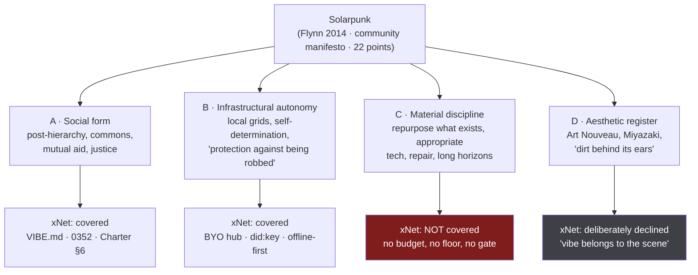
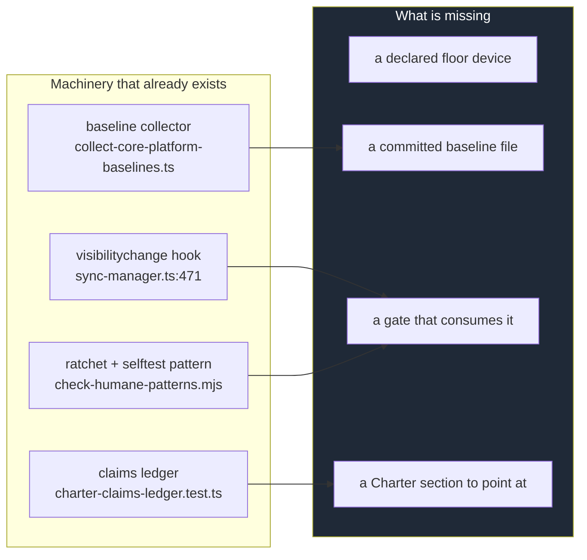
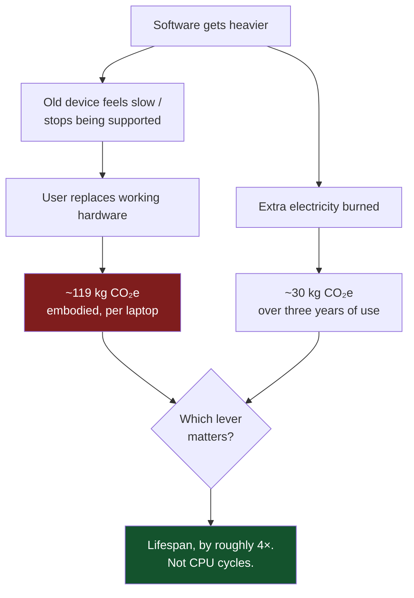

# Solarpunk principles and the material half of the Charter

> [!TIP]
> **TL;DR** — Solarpunk splits into an **aesthetic-social** half (community,
> commons, optimism, decentralisation) that xNet has already absorbed into
> [`docs/VIBE.md`](../VIBE.md) and exploration
> [0352](./0352_[x]_THE_VIBE_OF_XNET_SCENES_COMMONS_AND_SOLARPUNK.md), and a
> **material** half (energy, hardware lifespan, salvage, longevity) that the
> repo has never audited and currently enforces nothing about. Do **not** make a
> carbon claim — local-first is not obviously greener than a PUE-1.1 data centre
> and we cannot measure it honestly. Make the one material claim that is true,
> falsifiable and ours to keep: **xNet will not shorten the life of your
> hardware.** Ship it as a declared **device floor** plus a ratcheted CI budget,
> in the exact shape of the humane-patterns gate. Refuse the "green hosting
> tier" revenue lane outright — it fails the improvement test and is
> greenwashing with an invoice.

---

## Problem Statement

The ask was deep research on solarpunk principles. The honest first finding is
that "solarpunk principles" is two lists wearing one name, and xNet has quietly
adopted one of them and ignored the other.

The **social** list — post-scarcity, post-hierarchy, community self-governance,
decentralised infrastructure, optimism as refusal — is already load-bearing
here. It arrived through
[0246](./0246_[x]_PERMACULTURE_FOR_THE_OPEN_WEB_REGENERATING_THE_DIGITAL_COMMONS.md)
(permaculture as a design discipline) and
[0352](./0352_[x]_THE_VIBE_OF_XNET_SCENES_COMMONS_AND_SOLARPUNK.md) (vibe,
scenes, commons), and it is written down in [`docs/VIBE.md`](../VIBE.md), whose
lineage table already names permacomputing under the protocol layer.

The **material** list — energy budgets, hardware lifespan, salvage, repair,
appropriate technology, designing for a century rather than a quarter — has no
document, no receipt, and no gate. There is no bundle budget in the repo. There
is no declared minimum device. Nothing in `packages/` or `apps/` reads
`navigator.connection` or `saveData`. Thirty-six source files call
`setInterval`, and no policy governs any of them. If xNet doubled its cold-open
memory tomorrow, every check in CI would stay green.

That gap matters more than it looks, because the material half is where
solarpunk's most-cited criticism lands: that it is **aesthetic-first and
politics-never** — pretty green towers over an unchanged extractive economy.
A project that takes the vibe and skips the physics has done exactly the thing
solarpunk's own critics warn about, and has done it in a repo whose founding
document says _"a commitment with no receipt is just marketing."_

So the question this exploration answers is narrow and answerable:

1. What do solarpunk's principles actually say, in their primary sources,
   stripped of the illustration style?
2. Which of them can a **local-first workspace** honestly act on, and which are
   category errors for software?
3. What is already true in this repo, what is claimed and unbacked, and what is
   simply absent?
4. What is the smallest thing we could ship that turns a material claim into a
   receipt — without inventing a carbon number we cannot defend?

---

## Executive Summary

- **The primary sources are consistent, and less mystical than the imagery.**
  Adam Flynn's 2014 _Notes toward a manifesto_ frames infrastructure itself as
  the political act, quoting Chokwe Lumumba: <mark>"Dealing with infrastructure
  is a protection against being robbed of one's self-determination."</mark> The
  community manifesto's 22 points repeat the same structural moves: repurpose
  what exists, local autonomous systems, <mark>"high-tech backends with simple,
  elegant outputs."</mark> None of that is about the colour green.
- **Permacomputing is the software-shaped translation, and it is a real
  checklist.** Ten named principles — _hope for the best prepare for the worst;
  care for all hardware; observe first; not doing; expose the seams; simplicity
  vs complexity vs scale; keep it flexible; build on solid ground; everything
  has a place; integrate renewables._ Seven of the ten are directly auditable
  against this codebase. Two are already true here and unclaimed. One we
  actively fail.
- **The load-bearing physical fact is embodied carbon, not electricity.**
  Manufacturing accounts for roughly **70–90%** of a phone or laptop's lifetime
  emissions. Which means the fastest way for software to emit carbon is not to
  burn CPU — it is to **make a working computer feel broken**. Windows 10's
  end-of-support is the worked example: ~400M devices unable to upgrade, an
  estimated 700M kg of e-waste, caused entirely by a software decision.
- **Therefore: do not make a carbon claim.** A synced replica living on five
  devices is not free, hyperscale data centres run PUE ≈ 1.1–1.2, and the
  Sustainable Web Design model's own numbers put **user devices at 0.080
  kWh/GB against data centres at 0.055** — i.e. the client side is the _larger_
  operational segment. "Local-first is greener" is unproven, and shipping it as
  a slogan would be the greenwash we just criticised.
- **Make the claim we can keep instead — a floor, not a footprint.** xNet
  declares a **minimum supported device**, publishes what it costs to run there,
  and ratchets that number in CI against a committed baseline. That is the same
  machinery `check-humane-patterns.mjs` already uses, it is falsifiable, and it
  maps to permacomputing's second principle (care for all hardware) and Charter
  §Exit (a person who cannot afford a new laptop still has the right to leave
  with their data).
- **Refuse the obvious revenue lane.** A "green hosting" or "carbon-neutral
  tier" SKU fails the improvement test (the margin buys an offset certificate,
  not labour we perform), fails the vanish test (an offset evaporates with the
  vendor), and hands us a standing incentive to keep the baseline dirty so the
  premium keeps selling. Refused in §6 shape, with the five tests applied
  explicitly below.

---

## What solarpunk actually says

Reading the primary sources rather than the moodboards, the principles cluster
into four families. Only two of them are software's business.



**Family D is the one to keep refusing**, and the refusal is already principled
rather than lazy: VIBE.md's governing rule is _"the platform may not have a vibe
monopoly; vibe belongs to the scene."_ An xNet that shipped Art Nouveau chrome
would be committing the same error as the corporate green-tower renderings —
adopting the picture in place of the politics. Nothing below asks for a leaf
icon.

**Family C is the gap**, and it is the only one that produces new work.

<details>
<summary>The 22-point community manifesto, condensed — and which points are actionable for a workspace</summary>

| Point family                                   | Claim                                  | Actionable in software?  |
| ---------------------------------------------- | -------------------------------------- | ------------------------ |
| 1–2 Optimism as rebellion                      | hope against denial _and_ despair      | 🎭 Tone only             |
| 3–4 Post-scarcity, post-capitalist, the "punk" | counterculture, not a product category | ✅ Charter §6 refusals   |
| 5–6 Diversity of tactics                       | no single correct implementation       | ✅ BYO hub, forkability  |
| 9–10 Sustainability + justice as one thing     | access must not be a luxury good       | ✅ **the device floor**  |
| 11 Repurpose what exists                       | not "destroy and rebuild"              | ✅ old hardware, salvage |
| 15 Local energy grids, autonomous systems      | function without the centre            | ✅ offline-first         |
| 18 High-tech backends, simple elegant outputs  | complexity hidden, not eliminated      | ✅ CRDT under plain UI   |
| 20 Built environment adapted for solar gain    | physical siting                        | ❌ category error        |
| Aesthetic points                               | Art Nouveau, jugaad, Miyazaki          | 🛑 declined (VIBE.md)    |

</details>

### Permacomputing: the software-shaped version

Permacomputing is what happens when someone runs solarpunk's material half
through a compiler. Its ten principles are specific enough to audit against.
The Hundred Rabbits collective is the lived proof — two people on a 1982
sailboat, running donated and discarded devices, who found that _"to make fast
software, you need slow computers"_ after their Apple hardware and
subscription-gated tools failed at sea.

| #   | Permacomputing principle                     | xNet today                                                                 | Status          |
| --- | -------------------------------------------- | -------------------------------------------------------------------------- | --------------- |
| 1   | Hope for the best, prepare for the worst     | offline-first queue, multi-hub failover, sync degrades rather than blocks  | ✅ Shipped      |
| 2   | Care for all hardware — especially the chips | nothing. No declared floor, no budget, no ratchet                          | ❌ Absent       |
| 3   | Observe first                                | `collect-core-platform-baselines.ts` exists; nothing consumes it as a gate | 🚧 Partial      |
| 4   | Not doing                                    | the humane-patterns gate is literally institutionalised refusal            | ✅ Shipped      |
| 5   | Expose the seams                             | signed, hash-chained change log; public spec; devtools log store           | ✅ Shipped      |
| 6   | Simplicity vs complexity vs scale            | contested — Electron shell, 48 direct web deps, 50 workspace packages      | ⚠️ Strained     |
| 7   | Keep it flexible                             | schema-driven nodes, plugin sandbox, lenses                                | ✅ Shipped      |
| 8   | Build on solid ground                        | SQLite, Yjs, Ed25519 — all boring and mature by choice                     | ✅ Shipped      |
| 9   | (Almost) everything has a place              | BYO hub, forkable MIT core, FRAND trademark                                | ✅ Shipped      |
| 10  | Integrate biological and renewable resources | category error for a client; partly meaningful for hub hosting             | 🛑 Out of scope |

> [!IMPORTANT]
> Seven of ten already pass, **and none of them are claimed anywhere.** The work
> here is less "build a sustainability programme" and more "notice that the
> project has been doing permacomputing by accident, name the one principle it
> fails, and put a receipt on it."

---

## Current state in the repository

### What is already true, and unclaimed

| Claim                     | Where it lives                                                                                                                                                                     |
| ------------------------- | ---------------------------------------------------------------------------------------------------------------------------------------------------------------------------------- |
| Works with the centre off | [`packages/runtime/src/sync/offline-queue.ts`](../../packages/runtime/src/sync/offline-queue.ts), [`connection-manager.ts`](../../packages/runtime/src/sync/connection-manager.ts) |
| Survives one hub dying    | [`packages/runtime/src/sync/MultiHubSyncManager.ts`](../../packages/runtime/src/sync/MultiHubSyncManager.ts)                                                                       |
| Seams are inspectable     | [`packages/sync/src/change.ts`](../../packages/sync/src/change.ts), [`packages/sync/src/chain.ts`](../../packages/sync/src/chain.ts)                                               |
| Old versions keep working | [`packages/sync/src/negotiation.ts`](../../packages/sync/src/negotiation.ts), [`deprecation.ts`](../../packages/sync/src/deprecation.ts)                                           |
| You can leave with it all | [`packages/data/src/portability/`](../../packages/data/src/portability/), exploration [0344](./0344_[x]_FIRST_CLASS_DATA_EXPORT_IMPORT_AND_PORTABLE_BUNDLES.md)                    |
| Boring, durable substrate | SQLite via [`packages/sqlite/`](../../packages/sqlite/), Yjs, Ed25519                                                                                                              |

The protocol has an explicit deprecation system — `DeprecationType` covers
`protocol | schema | feature | api`, with migration notices rather than hard
breaks. That is permacomputing principle 8 in production, and it is the closest
thing in the repo to a hundred-year posture.

### What is absent

> [!WARNING]
> **There is no footprint gate of any kind.** `scripts/` holds 56 entries and
> ~15 `check:*` guards. None of them measures bytes, memory, cold-open time, or
> a minimum device. `collect-core-platform-baselines.ts` produces numbers that
> nothing enforces — an observation with no consumer, which by this repo's own
> rule (_"any new workflow, job, or advisory check needs a named consumer and a
> decidable pass condition"_) is the shape of a check that will rot.

Specific gaps found:

- **No declared minimum device.** The desktop shell pins `electron: ^33.0.0`
  (Chromium 130), and exploration
  [0386](./0386_[x]_SCROLL_EDGE_FADE_AFFORDANCE.md) treats that as a CSS floor —
  but the floor is an incidental consequence of a dependency version, not a
  commitment to anyone.
- **No network-condition awareness.** Zero hits for `navigator.connection`,
  `saveData`, or `getBattery` across `packages/*/src` and `apps/web/src`. A
  metered or 2G connection is invisible to the sync layer.
- **Unbudgeted polling.** 36 files call `setInterval`; eleven of them in the hub
  alone (`disk-watchdog`, `federation-health`, `discovery`, `eviction`,
  `awareness`, `crawl`, …). Each is individually reasonable and collectively
  ungoverned — the classic way an idle process stops being idle.
- **Lifecycle handling exists but only for persistence.** `sync-manager.ts`
  attaches `visibilitychange`/`pagehide` **to flush the registry**, not to back
  off work when the tab is hidden. The hook is there; the energy behaviour is
  not.



The encouraging read: **every mechanism this needs already exists in the repo.**
Nothing here asks for new infrastructure, only for wiring four existing pieces
into a loop.

---

## External research

### The number that decides everything

Manufacturing dominates a personal device's lifetime emissions. The figures
cluster tightly across sources: **85–95%** for smartphones (≈55 kg CO₂e to
manufacture one), **~78–80%** for laptops (a Surface laptop: 152 kg CO₂e total,
119 kg of it manufacturing, against 30 kg of use over three years).

Which inverts the intuition about what "green software" means:



The Windows 10 case makes it concrete rather than theoretical: a support
cut-off left ~400 million devices unable to upgrade, with campaigners
estimating **over 700 million kg of e-waste** — an environmental event caused
by a software decision, not a hardware failure. Right-to-repair groups now
describe software support cut-offs as the coming _"e-waste tsunami."_

> [!IMPORTANT]
> **Software is an e-waste pump.** Not metaphorically — it is the mechanism by
> which functioning hardware becomes waste. That single sentence is the whole
> material case, and it is the one solarpunk claim a workspace app can make
> without exaggeration.

### The claim we must _not_ make

It is tempting to go from "local-first" to "therefore greener." The evidence
does not support it.

- **Hyperscale data centres are efficient.** PUE of **1.1–1.2** is routine, with
  ML-scheduled workloads to keep servers off idle. A self-hosted hub on a spare
  box is very unlikely to match that.
- **The client is the bigger operational segment.** The Sustainable Web Design
  model v4 splits energy intensity as data centres **0.055 kWh/GB**, networks
  **0.059**, and **user devices 0.080** — total ≈ 0.30 kWh/GB against a global
  grid average around 494 gCO₂e/kWh. Moving work to devices moves it toward the
  _larger_ coefficient, not away from it.
- **Replication multiplies.** A space living on nine devices is nine copies of
  the storage and nine devices doing the merge. Solarpunk's own principle 11 is
  _repurpose what exists_ — it says nothing about duplicating it ninefold.
- **The measurement is contested anyway.** Practitioners publishing carbon
  numbers for websites are themselves warning the models are too coarse for
  per-product claims.

> [!CAUTION]
> A "local-first is greener" line in marketing would be a **one-way
> reputational door**: unfalsifiable, unverifiable, and precisely the
> aesthetic-first move that solarpunk's sympathetic critics call greenwashing.
> Charter §"How this charter stays honest" already forbids it in spirit. This
> exploration recommends forbidding it in writing.

### Jevons, honestly

Efficiency work has a rebound: make the client cheaper to run and people run
more of it, sync more spaces, keep more tabs open. Nothing proposed here escapes
that, and the exploration should not pretend otherwise. The reason the **floor**
framing survives Jevons while the **footprint** framing does not: a floor is a
commitment about _who can participate_, and widening participation is the goal,
not a leak in the efficiency argument. There is no rebound paradox in "an eight
year-old laptop still works."

---

## Key findings

1. **Solarpunk's material half is the unclaimed half here.** Seven of
   permacomputing's ten principles already pass in this repo, uncredited. One —
   _care for all hardware_ — fails outright, with nothing measuring it.
2. **The correct unit is lifespan, not energy.** Embodied carbon is ~4× use-phase
   carbon for a laptop, so the highest-leverage sustainability act available to
   a client application is refusing to obsolete hardware.
3. **A carbon claim is not available to us.** The device side of the SWD model is
   the heaviest coefficient, data centres are efficient, and replication
   multiplies. Any "greener" claim would be marketing, not a receipt.
4. **A floor claim _is_ available, and it is also a justice claim.** The
   manifesto's ninth and tenth points insist sustainability must not be a luxury
   good. A declared minimum device is the software expression of that: the
   person on a six-year-old machine is not a degraded tier.
5. **The floor is Charter §Exit's missing precondition.** §Exit promises leaving
   loses nothing. If the export flow only runs on hardware you cannot afford,
   the right to leave is theoretical for exactly the people it was written for.
6. **Every mechanism needed already exists.** Baseline collector, ratchet
   pattern, selftest convention, claims ledger. This is wiring, not building.
7. **The gate must be a ratchet with a negative control.** `AGENTS.md` is
   explicit: gate absolutes teach people to ignore red, and a gate with no proof
   it can go red is unfalsifiable. A byte budget that silently stopped measuring
   after a bundler change would look exactly like a lean app.

---

## Options and tradeoffs

| #   | Option                                                 | Cost     | Honesty risk | Verdict            |
| --- | ------------------------------------------------------ | -------- | ------------ | ------------------ |
| A   | Do nothing — keep solarpunk as vibe                    | none     | rising       | ❌ Rejected        |
| B   | Full permacomputing posture (uxn-style, drop Electron) | enormous | none         | 🛑 Rejected        |
| C   | Carbon accounting + published footprint                | high     | **severe**   | 🛑 Rejected        |
| D   | **Declared device floor + ratcheted budget**           | small    | low          | ✅ **Recommended** |
| E   | "Green hosting" revenue tier                           | medium   | severe       | 🛑 Refused         |

### A — Do nothing

Defensible today, worse every month. The repo already invokes solarpunk in a
shipped document (`VIBE.md`) and permacomputing by name in its lineage table.
Invoking a movement's name while enforcing none of its material commitments is
the exact failure mode this project built a claims ledger to prevent. The cost
of A is not zero; it is a slowly accumulating honesty debt in a public document.

### B — Full permacomputing posture

Hundred Rabbits' answer is to strip dependencies to near zero and target a
hand-built stack (uxn) that runs on anything. Intellectually the strongest
position available, and genuinely admirable. It is also incompatible with what
xNet is: a CRDT-backed workspace with a rich editor, a canvas, local vector
search and an AI surface. Rewriting toward a 64 kB virtual machine is not a
tightening of scope, it is a different product.

<details>
<summary>Why the Electron/dependency critique still lands, even though we reject B</summary>

Permacomputing principle 6 (_simplicity, complexity and scale_) is where xNet is
genuinely strained: 50 workspace packages, 48 direct dependencies in
`apps/web`, an Electron shell. The honest answer is not "that's fine" — it is
that complexity is acceptable **only while the outputs stay simple and the floor
stays low**, which is manifesto point 18 ("high-tech backends with simple,
elegant outputs") read as an engineering constraint rather than a slogan.

That is precisely what option D measures. The floor is the instrument that keeps
the complexity honest: you may add the fiftieth package, provided the eight
year-old laptop still opens the app. Without the floor, principle 6 is an
opinion. With it, it has a number.

</details>

### C — Carbon accounting

Measure and publish gCO₂e per sync, per session, per hub-month. Attractive
because it looks rigorous. Rejected because the underlying models are too coarse
for per-product claims, the device-side coefficient works against us, and the
first time someone audits the number we would be defending a methodology rather
than a promise. Worse, it invites C's evil twin, option E.

### D — Declared device floor + ratcheted budget ✅

Three pieces, all in existing shapes:

1. **A declared floor** — a named minimum device and OS, published, e.g. "a 2017
   laptop with 8 GB RAM, and the last two macOS/Windows/Linux LTS releases."
   Written in the Charter as a commitment, not in a README as a system
   requirement.
2. **A committed baseline** — cold-open time, peak memory, and shipped bytes on
   that floor, recorded in a checked-in JSON file the way other ratchets in this
   repo work.
3. **A gate that ratchets it** — `scripts/check-footprint-budget.mjs`, failing
   when a change regresses past the committed baseline plus tolerance, with
   `--selftest` planting an in-memory violation it must catch.

```mermaid
sequenceDiagram
    participant Dev as Pull request
    participant CI as ci.yml (typecheck job)
    participant Base as footprint-baseline.json
    participant Gate as check-footprint-budget.mjs

    Dev->>CI: push
    CI->>Gate: node scripts/check-footprint-budget.mjs
    Gate->>Base: read committed baseline
    Gate->>Gate: measure bytes / cold-open / peak RSS
    alt within baseline + tolerance
        Gate-->>CI: green
    else regression
        Gate-->>CI: red — "raises the floor; justify or optimise"
    end
    CI->>Gate: node scripts/check-footprint-budget.mjs --selftest
    Gate->>Gate: plant violation in memory
    Gate-->>CI: must go red, else the gate is blind
```

**Named consumer:** the `typecheck` job in `ci.yml`. **Pass condition:** no
regression past the committed baseline — a ratchet against a baseline, never an
absolute, per `AGENTS.md`.

> [!NOTE]
> **Corrected during implementation.** This section originally said the `lint`
> job. `lint` is deliberately build-free (exploration 0193) and a byte budget
> has nothing to measure without `apps/web/dist`, so the gate runs in
> `typecheck` — which already runs `pnpm turbo run build` — for exactly the
> reason `check:api-report` does. The **negative control** still runs in `lint`,
> inside the existing `check:gate-controls` step: it is pure in-memory logic and
> needs no build, so keeping it beside the other controls means a blind gate is
> caught in the fast job.

> [!NOTE]
> Deliberately _not_ in scope for the first cut: the hub. Server-side footprint
> is a real question but it is an operator's question, and it belongs with the
> operator console work in
> [0433](./0433_[-]_OPERATOR_CONSOLE_THE_DECIDED_PLAN.md) rather than in a
> client gate. Widening the population comes after the first one holds green —
> the same sequencing exploration
> [0428](./0428_[-]_CAN_YOU_JUST_DO_THINGS_SEEING_THE_DEGREES_OF_FREEDOM.md)
> used for the capability register.

### E — "Green hosting" revenue tier 🛑 Refused

A paid tier promising renewable-powered or carbon-neutral hub hosting. The
Charter §6 tests, applied explicitly:

| Test            | Verdict | Reasoning                                                                                                                                           |
| --------------- | ------- | --------------------------------------------------------------------------------------------------------------------------------------------------- |
| **Improvement** | ❌ Fail | The margin buys an offset certificate and a badge, not labour, capital or operations we perform. Renewable siting is our supplier's work, not ours. |
| **BATNA**       | ⚠️ Weak | Self-hosting stays possible, but the tier's whole pitch is that the free path is dirtier — degradation by insinuation.                              |
| **Vanish**      | ❌ Fail | If xNet disappears, the offset disappears with it. Nothing the customer paid for survives.                                                          |
| **Sleep**       | ❌ Fail | Any competitor can buy the same certificates tomorrow. There is nothing to defend.                                                                  |
| **Rust**        | n/a     | Applies to refusals, not lanes — but note the refusal below survives easily: hosting already pays for hosting.                                      |

> [!CAUTION]
> The disqualifying property is the **incentive it creates**. An operator paid a
> premium for a clean tier has a standing reason to keep the default tier dirty,
> exactly as an operator paid for match access has a reason to make matches
> scarce ([0417](./0417_[x]_THE_MATCHMAKER_AND_THE_METER_DATING_WITHOUT_A_PROFIT_MOTIVE.md)).
> Sustainability sold as an upgrade is sustainability withheld as a default —
> and manifesto point 9 says access must not be a luxury good. Refuse the lane
> outright; fold any genuine efficiency work into the flat hosting bill.

---

## Recommendation

**Ship option D, refuse option E, and write both down.**

1. **Add a Charter section, `§7 Floor — old hardware keeps working.`** One
   commitment, in the existing Enforced / Architectural / Aspirational shape:

   > Software is how working computers become waste. xNet will not be part of
   > that. We declare a minimum supported device, we publish what the app costs
   > to run there, and CI fails a change that raises it. We make no claim to be
   > "greener" than anything — we make one claim we can prove: your old laptop
   > keeps working.

   Plus a refused rent under §6: **No sustainability upcharge.** Efficiency work
   is folded into the flat hosting bill and never sold as a tier.

2. **Declare the floor.** Publish the target device explicitly rather than
   letting `electron: ^33` decide it by accident. Concretely: a 2017-class
   laptop, 8 GB RAM, and the oldest OS that Chromium 130 supports.

3. **Commit a baseline and a gate.** `scripts/check-footprint-budget.mjs`, fed
   by the existing `collect-core-platform-baselines.ts`, ratcheting against
   `footprint-baseline.json`, with `--selftest` and fixtures held in memory so a
   control can never leak into the real scan.

4. **Pin a receipt.** A `floor-old-hardware-keeps-working` entry in
   [`packages/telemetry/test/charter-claims-ledger.test.ts`](../../packages/telemetry/test/charter-claims-ledger.test.ts),
   in the same shape as `agency-capabilities-are-visible`.

5. **Ban the carbon claim in copy.** Add a `greenwash` rule to
   `scripts/check-humane-patterns.mjs` matching marketing identifiers
   (`carbonNeutral`, `co2Saved`, `greenTier`, `ecoBadge`, `climatePositive`) in
   the `surplus` scope, with a fix message pointing at this document. It is
   cheap, it is in the gate's existing idiom, and it stops a well-meaning future
   contributor from shipping the one claim we decided we cannot defend.

6. **Claim what is already true.** Seven permacomputing principles pass today
   and are credited nowhere. Add the lineage to `VIBE.md`'s protocol row —
   that is a documentation edit, not a project.

### Why this is a two-way door

Every piece is one commit from deletion: a Charter section, a baseline file, a
script, a ledger entry, a gate rule. No wire format changes, no public API, no
revenue lane opens. The one thing with lasting consequence is the _refusal_ of
option E — and a refusal that we later wanted to reverse would need an ADR in
`site/src/content/docs/docs/architecture/decisions.mdx` anyway, which is the
correct level of friction for it.

### Why the review date is late

`review: 2027-02-01` rather than the 90-day default, deliberately. A floor
commitment is only meaningful measured against the hardware population it
serves, and that population is mid-shift: the Windows 10 support cut-off is
pushing a very large cohort of working machines toward replacement right now.
Re-deciding the floor before that wave resolves would be re-deciding on noise.
Six months also gives the ratchet two quarters of real baseline data, which is
what makes the re-decision evidence-based rather than a re-vote.

---

## Example code

The gate, in the idiom `check-humane-patterns.mjs` already established —
declarative budget entries, an escape hatch requiring a written reason, and an
in-memory negative control.

```js
#!/usr/bin/env node
/**
 * Footprint ratchet (exploration 0434).
 *
 * `AGENTS.md`: ratchet against a committed baseline, never an absolute — and
 * carry a proof the gate can go red. Absolutes here would be meaningless (what
 * is "too many bytes"?) and would teach everyone to ignore the failure.
 *
 * Named consumer: the `typecheck` job in ci.yml (it reads build output).
 * Pass condition: no metric exceeds baseline * (1 + tolerance).
 *
 *   node scripts/check-footprint-budget.mjs
 *   node scripts/check-footprint-budget.mjs --selftest
 */

/** @type {{ id: string, unit: string, tolerance: number, why: string }[]} */
const METRICS = [
  {
    id: 'web.initial-bytes',
    unit: 'bytes (gzip, first load)',
    tolerance: 0.03,
    why: 'first load is what a slow connection pays before anything is usable'
  },
  {
    id: 'floor.cold-open-ms',
    unit: 'ms on the declared floor device',
    tolerance: 0.1,
    why: 'the floor device is the commitment; a regression here retires hardware'
  },
  {
    id: 'floor.peak-rss-mb',
    unit: 'MB resident, steady state',
    tolerance: 0.05,
    why: '8 GB machines are the floor — headroom is the whole promise'
  }
]

/** A raise needs a written reason in the same commit, like `humane-ok`. */
const FLOOR_OK = /\/\*\s*floor-ok:\s*(.+?)\s*\*\//

export function evaluate(baseline, measured) {
  const failures = []
  for (const metric of METRICS) {
    const before = baseline[metric.id]
    const now = measured[metric.id]
    // Absent ≠ unreadable: a missing metric is a broken measurement, not a pass.
    if (before === undefined || now === undefined) {
      failures.push({ id: metric.id, kind: 'unmeasured' })
      continue
    }
    if (now > before * (1 + metric.tolerance)) {
      failures.push({ id: metric.id, kind: 'regression', before, now, why: metric.why })
    }
  }
  return failures
}
```

> [!WARNING]
> The `unmeasured` branch is the load-bearing part. A silently-stopped measurement
> is the failure mode `AGENTS.md` names directly — _"a regex that silently
> stopped matching after a rename looks exactly like a clean codebase."_ Absent
> and unreadable must be different values, and neither may return green.

And the copy guard, dropped into the existing `RULES` array:

```js
{
  // Exploration 0434: the SWD model puts user devices at the *heaviest*
  // coefficient and hyperscale PUE at ~1.1, so "local-first is greener" is
  // unproven. We claim a floor, never a footprint.
  name: 'unbacked green claim',
  group: 'surplus',
  re: /\b(carbonNeutral|co2Saved|carbonSaved|greenTier|ecoBadge|climatePositive|carbonFootprintSaved)\b/,
  fix: 'xNet claims a hardware floor, not a carbon footprint — see exploration 0434; fold efficiency into the flat bill, never a badge'
}
```

---

## Risks and open questions

| Risk                                                              | Severity | Mitigation                                                                                                |
| ----------------------------------------------------------------- | -------- | --------------------------------------------------------------------------------------------------------- |
| The floor device has no CI runner, so the gate measures a proxy   | 🔴 High  | Measure bytes + RSS in CI; measure cold-open on real floor hardware quarterly and record it manually      |
| Cold-open timing is noisy in CI and the gate flakes               | 🟠 Med   | Wide tolerance (10%), median of N runs, and ratchet only — a flaky gate is worse than no gate             |
| The Charter grows a section nobody enforces                       | 🟠 Med   | Ship the ledger entry in the same PR; an Aspirational-only §7 is exactly the marketing we criticised      |
| Jevons rebound eats the efficiency win                            | 🟡 Low   | Named in the doc; the floor framing does not depend on the efficiency argument                            |
| Reads as sustainability theatre despite refusing the carbon claim | 🟠 Med   | The refused-rent entry does the work: refusing a green SKU is costlier and more legible than claiming one |
| Electron's own floor moves under us on the next major bump        | 🟠 Med   | Treat an Electron major as a floor change requiring an explicit decision, not a dependabot merge          |

**Open questions:**

- What exactly is the floor device? A 2017 laptop is a reasonable opening bid,
  but this should be answered from the telemetry consent tiers if any usable
  device distribution exists, not from taste.
- Does the floor bind `apps/expo` too? Mobile has a genuinely different
  obsolescence curve and a much shorter OS support tail.
- Should the 36 `setInterval` sites get a **polling register** in the shape of
  the capability register — each declaring an interval and a reason? Attractive,
  but it is a second gate and this exploration recommends one.
- Does the hub deserve a floor of its own — "runs on a Raspberry Pi 4"? That is
  the most solarpunk sentence available to this project and it is currently
  untested. Deferred to the operator work, not dropped.

---

## Implementation checklist

**Status:** ░░░░░░░░░░ 0/12 items

- [x] Decide and write down the floor device (model class, RAM, OS range)
- [x] Add `docs/CHARTER.md` §7 Floor, in Enforced/Architectural/Aspirational shape
- [x] Add the `No sustainability upcharge` refused rent to `docs/CHARTER.md` §6
- [x] Record the option-E refusal and its five-test verdicts in `docs/ECONOMICS.md` §4a
- [ ] Extend `scripts/collect-core-platform-baselines.ts` to emit bytes and peak RSS
- [x] Commit `footprint-baseline.json` with the first measured baseline
- [x] Write `scripts/check-footprint-budget.mjs` with the ratchet and `--selftest`
- [x] Wire it into the `lint` job in `ci.yml`, with the selftest as a sibling step
- [x] Add the `unbacked green claim` rule to `scripts/check-humane-patterns.mjs`
- [x] Pin `floor-old-hardware-keeps-working` in `packages/telemetry/test/charter-claims-ledger.test.ts`
- [x] Credit the seven passing permacomputing principles in `docs/VIBE.md`'s protocol row
- [ ] Add a changelog fragment ("xNet now promises your old laptop keeps working")

## Validation checklist

- [ ] `node scripts/check-footprint-budget.mjs` passes on a clean `main`
- [ ] `node scripts/check-footprint-budget.mjs --selftest` goes **red** on a planted regression
- [ ] Deleting a metric from the measured input produces `unmeasured`, not a pass
- [ ] A deliberate +20% bundle regression on a scratch branch fails CI
- [ ] `pnpm check:humane-patterns` fails on a planted `carbonNeutral` identifier
- [ ] `pnpm check:humane-patterns --selftest` still passes with the new rule added
- [ ] The claims-ledger test fails if `docs/CHARTER.md` §7 loses its Enforced claim
- [ ] The app cold-opens on real floor hardware, timed and recorded once by hand
- [ ] `pnpm check:exploration-links` passes (every reference in this doc resolves)
- [ ] No copy anywhere in `site/` claims xNet is greener than an alternative

---

## References

**Solarpunk primary sources**

- Adam Flynn, [_Solarpunk: Notes toward a manifesto_](https://hieroglyph.asu.edu/2014/09/solarpunk-notes-toward-a-manifesto/), Project Hieroglyph, 2014
- [_A Solarpunk Manifesto_](https://re-des.org/a-solarpunk-manifesto/) (ReDes adaptation of the community manifesto)
- [_A Solarpunk Manifesto_](https://theanarchistlibrary.org/library/the-solarpunk-community-a-solarpunk-manifesto), The Anarchist Library

**Criticism**

- [_Solarpunk Is Not About Pretty Aesthetics. It's About the End of Capitalism_](https://www.vice.com/en/article/solarpunk-is-not-about-pretty-aesthetics-its-about-the-end-of-capitalism/), Vice
- [_What Is Solarpunk? History, Themes, Criticism_](https://builtin.com/articles/solarpunk), Built In

**Permacomputing and computing within limits**

- [Permacomputing principles](https://permacomputing.net/principles/)
- Hundred Rabbits, [_Weathering Software Winter_](https://100r.co/site/weathering_software_winter.html) and [permacomputing 101](https://100r.co/site/permacomputing_101.html)
- [_Permacomputing — How the Concept of Permaculture Is Being Adapted to the Digital World_](https://en.reset.org/permacomputing-how-the-concept-of-permaculture-is-being-adapted-to-the-digital-world/), RESET
- [LIMITS — Workshop on Computing within Limits](https://computingwithinlimits.org/2026/); [_Overview over the first decade of LIMITS_](https://arxiv.org/html/2605.30543v1)
- [Low-tech Magazine](https://en.wikipedia.org/wiki/Low-tech_Magazine) (solar-powered server, 2018)

**The material numbers**

- [Hardware Embodied Carbon Emissions](https://www.techcarbonstandard.org/technology-categories/lifecycle/embodied), Technology Carbon Standard
- [_Examining the Carbon Footprint of Devices_](https://devblogs.microsoft.com/sustainable-software/examining-the-carbon-footprint-of-devices/), Microsoft
- [_Estimating Digital Emissions_](https://sustainablewebdesign.org/estimating-digital-emissions/), Sustainable Web Design Model v4
- [_Why We Don't Report Website Carbon Emissions_](https://www.debugbear.com/blog/website-carbon-emissions), DebugBear
- [_Right to Repair warns of e-waste tsunami from software support cut-offs_](https://www.letsrecycle.com/news/right-to-repair-warns-of-e-waste-tsunami-from-software-support-cut-offs/), letsrecycle.com

**Internal**

- [`docs/CHARTER.md`](../CHARTER.md) — the six commitments and the five revenue tests
- [`docs/VIBE.md`](../VIBE.md) — the positive companion; already names permacomputing
- [`docs/ECONOMICS.md`](../ECONOMICS.md) §4a — per-refusal Rust verdicts
- [0246](./0246_[x]_PERMACULTURE_FOR_THE_OPEN_WEB_REGENERATING_THE_DIGITAL_COMMONS.md) — permaculture as a design discipline
- [0352](./0352_[x]_THE_VIBE_OF_XNET_SCENES_COMMONS_AND_SOLARPUNK.md) — scenes, commons, solarpunk (the social half)
- [0351](./0351_[x]_FRONTIER_ECONOMICS_WITHOUT_ENCLOSURE_RAILROADS_AIRLINES_AND_THE_COMMONS.md) — no ground rent
- [0358](./0358_[x]_VALUE_CAPTURE_WITHOUT_ENCLOSURE_MOATS_SUBSTRATES_AND_THE_SLEEP_TEST.md) — the sleep test
- [0429](./0429_[x]_THE_RUST_TEST_ASTERISK_15_AND_THE_PRICE_OF_A_REFUSAL.md) — the rust test
- [0430](./0430_[-]_RISK_ADJUSTED_ENGINEERING_READING_ASTERISK_14.md) — why every gate needs a negative control
