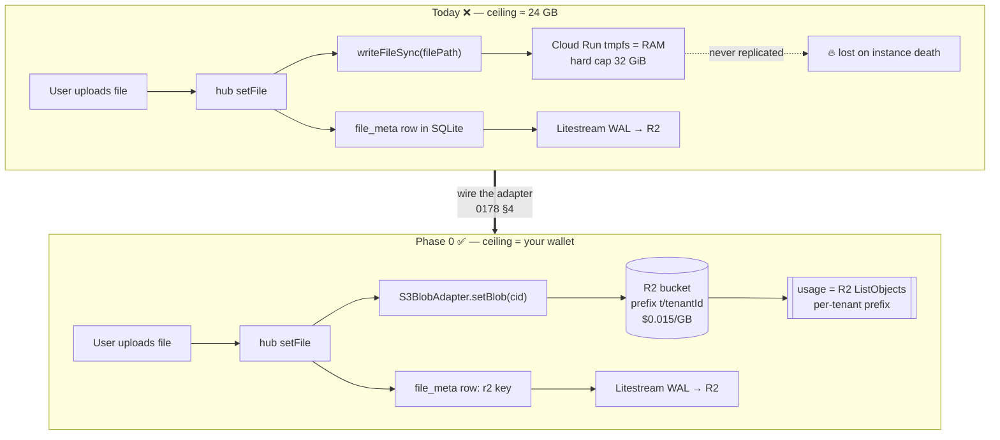
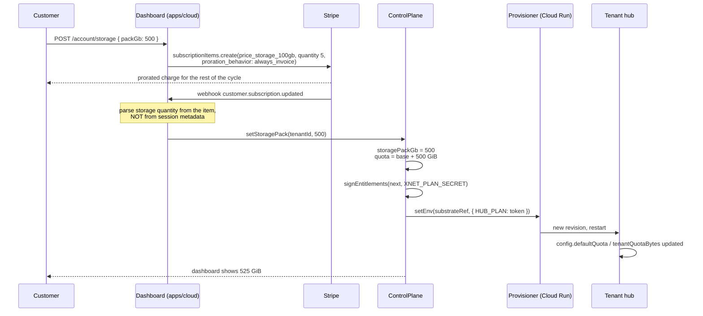
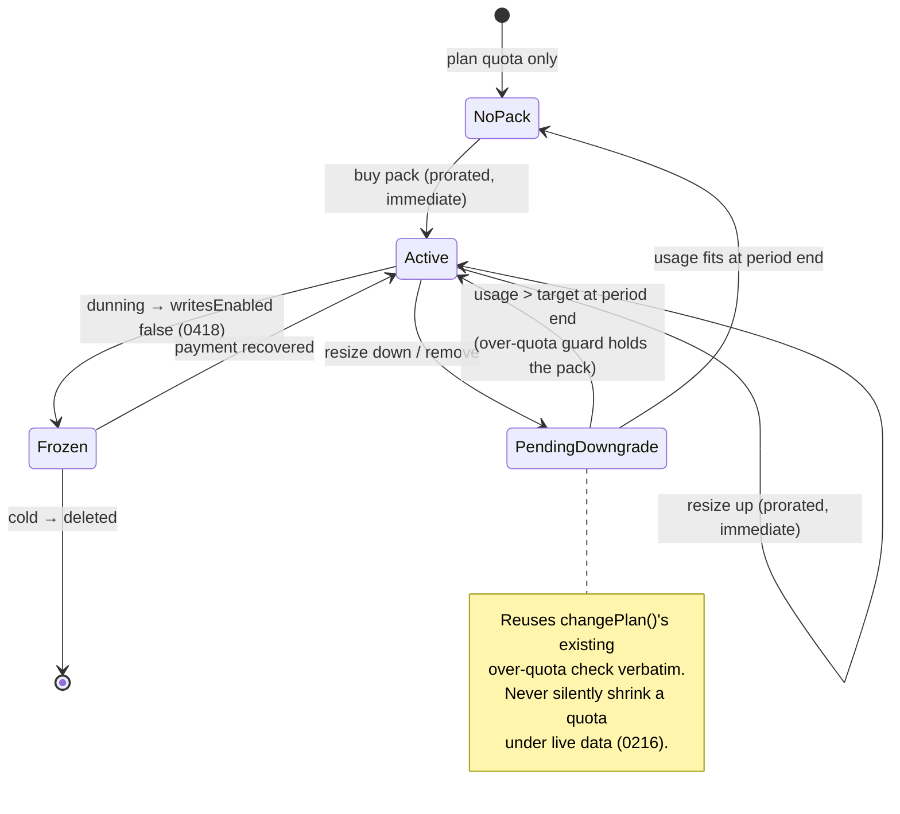

# Cloud Storage Tier Upgrades (+100 / +500 / +1000 GB)

> [!TIP]
> **TL;DR** — Yes, and the entitlement machinery is already built: `withStorage()`,
> `resolveEntitlements(plan, overrides)` and `changePlan()` treat a quota change as a
> live in-place flip with no migration. But **we cannot sell this today**, because a
> stored byte currently lands on the hub's local filesystem — which on Cloud Run is
> RAM, capped at 32 GiB — and the quota it maps to is enforced **per user, not per
> tenant**. Fix those two first (Phase 0), then sell three additive packs at a flat
> **$0.03/GB‑month** — **+100 GB $3, +500 GB $15, +1000 GB $30** — which holds a
> constant **~42% gross margin** at every size and leaves everything else about the
> plan untouched.

## Problem Statement

A customer likes their plan. They want more room — 100 GB, 500 GB, maybe 1 TB — and
nothing else about their subscription to change. Today the only answer we have is
"move to a bigger plan", which also changes their isolation tier, seat count, AI
budget, SLA and price, and may trigger a data migration.

Three questions, in order:

1. **Can the system express it?** Can a tenant hold a quota that is not their plan's
   default, without changing anything else?
2. **Can the substrate deliver it?** If we sell 500 GB, does the running hub actually
   have somewhere to put 500 GB?
3. **What is the right price?** What does a byte cost us, what do people expect to
   pay, and does charging for it survive the Charter's "no ground rent" tests?

The answers are **yes**, **no**, and **$0.03/GB‑month** — in that order, and the
middle one is the whole exploration.

## Executive Summary

| Layer                          | Status       | Notes                                                           |
| ------------------------------ | ------------ | --------------------------------------------------------------- |
| Entitlement contract           | ✅ Shipped   | `withStorage()`, `quotaBytes` in the signed token               |
| In-place flip (no migration)   | ✅ Shipped   | `requiresMigration()` is false within an isolation tier         |
| Downgrade / over-quota guard   | ✅ Shipped   | `changePlan()` → `over-quota`, with a wipe escape hatch (0216)  |
| Override plumbing end-to-end   | 🚧 Partial   | `changePlan` accepts overrides; the self-serve route drops them |
| Bytes actually stored in R2    | ❌ Not wired | `S3BlobAdapter` exists but the hub does `writeFileSync`         |
| Aggregate (per-tenant) ceiling | ❌ Missing   | `quotaBytes` is enforced **per user**; watchdog is demo-only    |
| Stripe add-on line item        | ❌ Missing   | Checkout hard-codes one line item, `quantity: 1`                |
| Dashboard / pricing-page UI    | ❌ Missing   | Storage quota is display-only                                   |

**The finding that reorders everything:** the plan catalog already promises
`company: 1024 GiB` and `enterprise: 5 TiB`, and the substrate cannot deliver a
fraction of either. Storage tiers are not a feature request on top of a working
system — they are the thing that forces us to finish the storage tiering that
[0177](./0177_[_]_DATA_BACKEND_TIERING_AND_COLD_STORAGE_ECONOMICS.md) and
[0178](./0178_[_]_COST_EFFICIENT_SQLITE_HOSTING_NO_LIBSQL_MIGRATION.md) designed and
never wired up.

The good news is that once the bytes are in R2, the economics are clean, linear, and
provably margin-positive — and a storage add-on is the most Charter-defensible
revenue line xNet has, because it is a literal pass-through of a cost we literally
pay, on a resource the customer can walk away from at any time.

---

## Current State In The Repository

### The entitlement side is done

[`packages/entitlements/src/plans.ts`](../../packages/entitlements/src/plans.ts) was
written with exactly this in mind. The doc comment on `IsolationTier` says it out
loud:

> A plan selects an isolation tier; crossing a tier boundary is what triggers a data
> migration (everything below it is an in-place entitlement flip — see `withStorage`,
> `withSeats`, `withConcurrency`).

- [`plans.ts:284`](../../packages/entitlements/src/plans.ts) — `withStorage(entitlements, quotaBytes)`, validated, pure.
- [`plans.ts:274`](../../packages/entitlements/src/plans.ts) — `resolveEntitlements(plan, overrides)` merges a partial override over the catalog base.
- [`plans.ts:372`](../../packages/entitlements/src/plans.ts) — `requiresMigration()` compares **isolation and residency only**. A quota change within a tier returns `false`.

The control plane already uses it. [`control-plane.ts:658`](../../apps/cloud/src/control-plane.ts) `changePlan()`
resolves the new entitlements, checks migration, guards a downgrade against measured
usage, then does a live `provisioner.setEnv()` with a freshly-signed token. No data
moves.

The token itself carries `quotaBytes` as a plain signed field
([`entitlements.ts:27`](../../packages/entitlements/src/entitlements.ts)), and the hub
reads it into `defaultQuota` at
[`config.ts:76`](../../packages/hub/src/config.ts). So "tell this hub it now has
500 GB" is already a solved, signed, tamper-resistant operation.

> [!NOTE]
> The over-quota guard is genuinely good and we should reuse it verbatim for pack
> _removal_. [`control-plane.ts:673`](../../apps/cloud/src/control-plane.ts) refuses a
> quota reduction when measured usage exceeds the target **or when usage cannot be
> measured at all** (cold hub) — the "absent ≠ unreadable" rule from `AGENTS.md`,
> applied correctly.

### Gap 1 — the self-serve route silently drops overrides

```ts
// apps/cloud/src/server.ts:434
const result = await deps.controlPlane.changePlan(tenant.tenantId, plan as PlanId)
//                                                                  ^ no overrides
```

`changePlan`'s third parameter defaults to `{}`, so `resolveEntitlements` falls back
to the bare catalog. **Any storage pack a tenant has bought evaporates the moment
they change plan through the dashboard.** The internal operator route
([`server.ts:774`](../../apps/cloud/src/server.ts)) threads `body.overrides` correctly;
the customer-facing one does not.

The same hole exists on the provisioning path: `provisionForBilling()`
([`control-plane.ts:393`](../../apps/cloud/src/control-plane.ts)) takes `overrides`, but
its only caller is the Stripe `checkout.session.completed` webhook, whose metadata
carries `{ customerRef, plan }` and nothing else
([`stripe-gateway.ts:91`](../../apps/cloud/src/billing/stripe-gateway.ts)).

### Gap 2 — a stored byte lands on local disk, and local disk is RAM

This is the blocker.

[`packages/hub/src/storage/sqlite.ts`](../../packages/hub/src/storage/sqlite.ts) stores
blob **pointers** in SQLite and the bytes on the filesystem:

```ts
// sqlite.ts:1394 — file upload
writeFileSync(filePath, data)
// sqlite.ts:1333 — backup blob
writeFileSync(blobPath, data)
```

`file_meta.file_path` and `backups.blob_path` are local paths under `config.dataDir`.
[`data-usage.ts`](../../packages/hub/src/data-usage.ts) then walks that directory to
report `usedBytes` on `/health` — which is what the control plane's over-quota guard
reads. So the entire quota accounting system is measuring **the local disk**.

Exploration 0178 §4 already called this out and pointed at the fix:

> **Blobs already go to R2.** Bulk bytes are already pointer-referenced in the DB
> (`backups.blob_path`, `file_meta.file_path`); route them through the `S3BlobAdapter`
> shipped in PR #68.

The adapter exists —
[`packages/cloud/src/storage/s3-adapter.ts`](../../packages/cloud/src/storage/s3-adapter.ts),
implementing `@xnetjs/storage`'s `StorageAdapter` against R2 — but **nothing in
`packages/hub` imports it**. The routing was designed, the adapter was built, and the
wire was never connected.

Meanwhile the substrate is Cloud Run
([`cloud-run-litestream.ts`](../../packages/cloud/src/provisioner/adapters/cloud-run-litestream.ts)),
whose `CloudRunUpsert` has fields for `image`, `env` and `minInstances` — and **no disk
at all**. Cloud Run's writable filesystem is an in-memory tmpfs that counts against the
instance memory limit, and the maximum configurable memory is **32 GiB**.

```text
┌──────────────────────────┐        ┌──────────────────────┐
│  Cloud Run instance      │        │   Cloudflare R2      │
│  ┌────────────────────┐  │        │                      │
│  │ tmpfs = RAM ≤32 GiB│──┼── WAL ─▶  hub.db replica     │  ← Litestream (wired ✅)
│  │  hub.db            │  │        │                      │
│  │  blobs/  ◀── ALL   │  │   ╌╌╌╌╌▶  blobs/             │  ← S3BlobAdapter (NOT wired ❌)
│  │  backups/   USER   │  │        │                      │
│  │             BYTES  │  │        └──────────────────────┘
│  └────────────────────┘  │
└──────────────────────────┘
```

> [!CAUTION]
> **Selling a 500 GB pack today would sell capacity that physically cannot exist.**
> The realistic ceiling is roughly 32 GiB minus the hub process's own working set —
> call it ~24 GB. The catalog's existing `company` (1024 GiB) and `enterprise` (5 TiB)
> quotas are already unbuildable on this substrate. Neither is self-serve today
> (`company` is not in `PRICE_BY_PLAN`, `enterprise` is contact-sales), so nobody has
> been sold an impossible number yet — but the catalog is writing cheques the
> provisioner cannot cash.

### Gap 3 — the quota is per **user**, and there is no aggregate ceiling

[`server.ts:392`](../../packages/hub/src/server.ts) passes the plan's `quotaBytes` to
`NodeRelayService` as `perUserQuota`, and the enforcement message confirms it:

```ts
// packages/hub/src/services/node-relay.ts:332
;`Storage limit reached (${this.options.quotaBytes} bytes per user). `
```

So a `family` tenant (250 GiB, 5 seats) can legitimately store **1.25 TiB** across its
members before any limit fires. If we sell "+500 GB" and map it to `quotaBytes`, a
seat-metered tenant gets 500 GB _times their seat count_ — we would bill once and
provision N times.

And there is no backstop. The disk watchdog is explicitly demo-only:

```ts
// packages/hub/src/config.ts:146
/** Disk-watchdog budget; `null` = no watchdog (watchdog stays demo-only, 0291). */
export const resolveDiskWatchdogBytes = (config: HubConfig): number | null =>
  config.demo && config.demoOverrides ? config.demoOverrides.diskLimitBytes : null
```

> [!WARNING]
> A paying tenant's hub has **no aggregate storage guard whatsoever**. The per-user
> quota is the only thing between it and a full filesystem — which, on Cloud Run, is a
> full memory allocation and an OOM kill. This is the demo-hub failure of
> [0291](./0291_[_]_DEMO_HUB_RUNAWAY_STORAGE_QUOTA_AND_EVICTION_NOT_ENFORCED.md)
> waiting to happen to a customer who pays us.

### Gap 4 — a catalog inversion that storage packs would fix

| Plan     | Price    | Quota (per user!) | Isolation       |
| -------- | -------- | ----------------- | --------------- |
| personal | $5/mo    | 25 GiB            | dedicated-sleep |
| family   | $15/mo   | **250 GiB**       | dedicated-sleep |
| team     | $12/seat | **100 GiB**       | dedicated-warm  |

`family` ships 2.5× the storage of the strictly more expensive, more isolated `team`
tier. That is not a deliberate design; it is what happens when storage is welded to a
plan tier that is really selling isolation and warmth. Decoupling storage into an
add-on removes the need to ever make that trade again.

### Gap 5 — Stripe checkout is single-line-item

```ts
// apps/cloud/src/billing/stripe-gateway.ts:95
line_items: [{ price, quantity: 1 }],
```

One price, quantity hard-coded to 1. Notably, **seats are not wired either** — `team`
is advertised at `$12/seat/mo` on the pricing page but checkout bills a single unit.
An add-on needs a second line item, which is the same plumbing seats need.

---

## External Research

### What a byte costs us

Cloudflare R2, the substrate 0178 already chose, at published 2026 rates:

| Item                       | Rate             |
| -------------------------- | ---------------- |
| Standard storage           | **$0.015/GB‑mo** |
| Infrequent Access storage  | $0.010/GB‑mo     |
| Class A ops (writes/lists) | $4.50 / million  |
| Class B ops (reads)        | $0.36 / million  |
| **Egress**                 | **$0.00**        |

This exactly matches `UNIT_COSTS.r2StoragePerGbMonth: 0.015` already committed in
[`packages/cloud/src/cost/pricing.ts`](../../packages/cloud/src/cost/pricing.ts), so the
repo's cost model needs no revision — only extension.

Zero egress is load-bearing for the Charter: "no egress or export fees" is a published
promise, and R2 is the reason we can keep it while selling storage.

### What people expect to pay

| Provider          | Headline tier    | Effective $/GB‑mo |
| ----------------- | ---------------- | ----------------- |
| iCloud+           | 2 TB @ $9.99     | ~$0.0049          |
| Google One        | 2 TB @ ~$9.99    | ~$0.0049          |
| Dropbox Plus      | 2 TB @ $11.99    | ~$0.0059          |
| Backblaze B2      | raw object store | ~$0.006           |
| **Cloudflare R2** | raw object store | **$0.015**        |

> [!IMPORTANT]
> **Consumer cloud storage is priced below our raw input cost.** Apple and Google run
> their own datacenters and treat storage as retention infrastructure for a much larger
> business. We buy ours at $0.015/GB. Any xNet storage price will look expensive next
> to iCloud on a $/GB basis, and no amount of pricing cleverness changes that. The
> honest framing is that we are not selling a photo locker — we are selling capacity
> inside a live, synced, exportable, self-hostable hub — and the answer to "iCloud is
> cheaper per GB" is a real one: **bring your own bucket** (Option D).

### Stripe mechanics

Adding a storage pack to a live subscription is a second `SubscriptionItem`, not a
price swap. Two properties matter:

- **Multiple line items bill on one invoice.** The `$0.30` fixed fee is already paid by
  the base subscription, so the marginal payment cost of an add-on is the **2.9%
  percentage only**. This is a genuine margin advantage over selling storage standalone,
  and the existing cost model's `stripeFixedPerCharge` must _not_ be applied twice.
- **Proration is the default** on quantity and item changes, with `immediate` /
  `next period` / `none` available. Mid-cycle upgrades should prorate immediately
  (the customer wants the space now); mid-cycle downgrades should apply at period end
  (no refund complexity, and it gives the over-quota guard a whole cycle of runway).

---

## Key Findings

1. **The hard part is already built.** Quota is a signed field, a flip is a `setEnv`,
   and the downgrade guard is careful and correct. This is a plumbing-and-pricing
   exercise, not an architecture exercise.
2. **The blocker is physical, not logical.** Bytes go to a RAM-backed filesystem capped
   at 32 GiB. Nothing above ~24 GB is sellable until `S3BlobAdapter` is wired into the
   hub's storage layer.
3. **`quotaBytes` means "per user".** Selling a per-tenant pack that maps to it would
   multiply capacity by seat count. Either the pack must be per-seat too (confusing and
   uncomfortably close to a per-member meter), or the hub needs a genuine tenant-level
   aggregate quota.
4. **Paying tenants have no disk guard at all.** Whatever else this exploration does,
   promoting the disk watchdog out of demo-only is not optional once real volume lands.
5. **Overrides leak on plan change.** A bought pack is destroyed by any self-serve plan
   change. Fixing this requires storing the pack _as a pack_, not as a resolved absolute.
6. **Storage is the cleanest revenue line xNet has.** It is a marginal, recurring,
   pass-through cost on a resource with a real alternative. It passes all three Charter
   §6 tests more comfortably than anything else we sell.

### Where a byte lives — today vs. required



> [!NOTE]
> Moving blobs off the instance filesystem also fixes a durability hole nobody has
> written down: today a blob written between Litestream syncs lives **only** in tmpfs.
> Litestream replicates the SQLite WAL, not the blob directory. An instance dying takes
> those files with it, while the `file_meta` row survives — leaving a pointer to nothing.

---

## Options And Tradeoffs

### Option A — Fixed additive packs at a flat rate ⭐

Three SKUs, each an additive `+N GB` on top of whatever the plan includes.

| Pack     | Price/mo | COGS (R2 + 10% ops) | Stripe 2.9% | Margin | %   |
| -------- | -------- | ------------------- | ----------- | ------ | --- |
| +100 GB  | $3       | $1.65               | $0.087      | $1.26  | 42% |
| +500 GB  | $15      | $8.25               | $0.435      | $6.32  | 42% |
| +1000 GB | $30      | $16.50              | $0.870      | $12.63 | 42% |

The margin is constant because both price and cost are linear in $G$:

$$
\text{margin\%} = \frac{p - 1.1c - 0.029p}{p}
= \frac{0.03 - 1.1(0.015) - 0.029(0.03)}{0.03} = 42.1\%
$$

where $p = \$0.03$ is the price per GB‑month and $c = \$0.015$ the R2 rate. The `1.1`
is a defensive 10% operations allowance — at realistic object sizes (multi‑MB media)
R2 Class A/B costs are closer to 1–3% of the storage line, so this is conservative.

**Good:** trivially explainable ("three cents a gig"), one number to defend, constant
margin at every size, no new plan ids, and the `+100/+500/+1000` shape is exactly what
was asked for.
**Bad:** no volume discount, which is what buyers of the 1 TB pack will expect. And
$0.03/GB is ~6× iCloud's headline rate.

### Option B — Metered usage billing

A Stripe metered price against measured GB, reported monthly from R2 `ListObjects`.

**Good:** perfectly fair; nobody pays for space they don't use; no packs to pick.
**Bad:** unpredictable bills are precisely what the AI gateway's hard-budget design
([0201](./0201_[_]_OPENROUTER_LITELLM_METERED_AI_AND_CREDITS_BILLING.md), 0244) went out of its way to avoid, and
the pricing page already promises "a hard budget stop prevents surprise bills". Storage
grows silently and monotonically — it is the _worst_ candidate for metering. Also needs a
usage-reporting pipeline that does not exist.

### Option C — More plan tiers (`personal-plus`, `family-xl`, …)

**Bad:** combinatorial. Storage × seats × isolation × AI budget is already a
four-dimensional space compressed into seven plan ids; adding a storage axis to the plan
id multiplies the catalog, the Stripe price list, the pricing page, and the migration
matrix. It also re-creates Gap 4 — new inversions every time a tier is added.
🛑 **Rejected.**

### Option D — Bring your own bucket (BYOB) ⭐ companion

The tenant supplies their own R2/S3 credentials; the hub writes blobs to _their_ bucket
and they pay Cloudflare directly. xNet charges nothing per GB.

**Good:** this is the **BATNA receipt**. It makes "storage is priced above iCloud" a
choice rather than a trap, and it is the strongest possible answer to the ground-rent
question — we cannot be renting you your own bytes if you can point us at your own
bucket. It also unlocks tenants whose data volume we would rather not underwrite at all.
**Bad:** support surface (their bucket, their misconfiguration, their outage), and it
must not become the _only_ honest option — if BYOB is strictly better for everyone, the
paid pack is overpriced.

Note the `S3BlobAdapterOptions` already carries `clientConfig` and `prefix`, so the
adapter is BYOB-shaped by construction.

### Option E — Do nothing; contact sales above the plan quota

**Good:** zero engineering; already the status quo.
**Bad:** the status quo silently promises 1 TiB on `company` and 5 TiB on `enterprise`
that the substrate cannot deliver. "Do nothing" is not neutral here — it leaves a live
overclaim in the catalog.

### Comparison

| Option              | Predictable bill | Margin | Charter fit  | Eng cost  | Verdict            |
| ------------------- | ---------------- | ------ | ------------ | --------- | ------------------ |
| A · fixed packs     | ✅ Yes           | 42%    | ✅ Strong    | 🚧 Medium | ⭐ **Recommended** |
| B · metered         | ❌ No            | ~42%   | ⚠️ Weak      | ❌ High   | Rejected           |
| C · more plan tiers | ✅ Yes           | varies | ⚠️ Neutral   | ❌ High   | 🛑 Rejected        |
| D · BYOB            | ✅ Yes ($0)      | $0     | ✅ Strongest | 🚧 Medium | ⭐ Ship alongside  |
| E · nothing         | —                | —      | ❌ Overclaim | ✅ None   | Rejected           |

### 🧭 Charter §6 — the three "no ground rent" tests

Applied explicitly, as required for any new revenue lane
([0351](./0351_[x]_FRONTIER_ECONOMICS_WITHOUT_ENCLOSURE_RAILROADS_AIRLINES_AND_THE_COMMONS.md)):

| Test                                                               | Verdict | Reasoning                                                                                                                                                                                                                                        |
| ------------------------------------------------------------------ | ------- | ------------------------------------------------------------------------------------------------------------------------------------------------------------------------------------------------------------------------------------------------ |
| **Improvement** — are we charging for something we build and run?  | ✅ Pass | Every GB sold is a GB we rent from Cloudflare at $0.015 and replicate, monitor and back up. The margin rides on an operation, not on access. This is the _textbook_ improvement charge — closer to it than seats, and far closer than AI markup. |
| **BATNA** — does the customer have a real alternative?             | ✅ Pass | Three of them: keep it local (xNet is local-first; the device copy is unlimited and free), self-host the MIT hub against your own bucket, or BYOB on managed (Option D). Free `.xnetpack` export and zero egress mean leaving costs nothing.     |
| **Vanish** — if xNet disappeared, do they lose what they paid for? | ✅ Pass | No. The authoritative copy is on their device; the cloud copy is a replica. With BYOB the bytes are already in an account we do not control.                                                                                                     |

> [!IMPORTANT]
> **The tripwire for the ADR:** _if a storage pack ever becomes a material share of
> revenue, the incentive to degrade local-first storage appears._ The day someone
> proposes capping on-device storage, throttling local sync, or making export slower for
> large workspaces, this decision must be re-opened. Charging for cloud bytes is an
> improvement charge only for as long as **not** buying them remains fully functional.

A fourth, softer test the pack must keep passing: **it must never become a seat meter in
disguise.** `withSeats()` already refuses to attach seats to the flat `community` plan
([0359](./0359_[_]_COMMUNITY_HOSTING_AND_RECURRING_REVENUE_THE_SKOOL_QUESTION.md)); a
per-seat storage pack would smuggle the same meter back in through the storage door.
Hence the recommendation below that packs are **per tenant**, which is also what Gap 3
demands on technical grounds. The two arguments land in the same place, which is usually
a sign the answer is right.

---

## Recommendation

Ship **Option A + Option D**, in four phases, and do not sell anything until Phase 0 is
green.

> [!IMPORTANT]
> **Storage packs: additive, per tenant, flat $0.03/GB‑month.**
> **+100 GB $3 · +500 GB $15 · +1000 GB $30.** Annual billing at 2 months free
> ($0.025/GB effective, ~31% margin). Everything else about the plan — isolation, seats,
> AI budget, SLA, price — is untouched.

Three design decisions carry the weight:

**1. Store the pack, derive the quota.** Never persist a resolved absolute
`quotaBytes` override. Persist `storagePackGb: number` on `TenantRecord` and compute:

$$
\text{quotaBytes} = \text{PLAN\_CATALOG}[plan].\text{quotaBytes} + \text{storagePackGb} \times 2^{30}
$$

at every `resolveEntitlements` call site. This is what makes a plan change safe: a
`personal` tenant with a +500 GB pack who upgrades to `family` gets
$250 + 500 = 750$ GiB, not a stale 525 GiB absolute that silently _downgrades_ them.
An absolute override is a bug generator; the pack is the fact, the quota is the
derivation.

**2. The pack is per tenant, and the hub learns a second number.** Add
`tenantQuotaBytes` to `PlanEntitlements` alongside the existing per-user `quotaBytes`,
enforced as an aggregate ceiling in the hub. Per-user quota keeps doing its job (one
member cannot eat the whole hub); the tenant ceiling is what we bill against. Absent
`tenantQuotaBytes` must mean **unlimited**, not zero, for the same fail-open reason
`writesEnabled` documents at
[`plans.ts:100`](../../packages/entitlements/src/plans.ts) — a token signed before the
field existed must not brick a hub.

**3. Sell the pack as a second Stripe line item, never a price swap.** The base
subscription keeps its price id and its invoice; the pack is a `SubscriptionItem` with
`quantity` = pack size in units of 100 GB against a `price_storage_100gb` at $3. This
gives 100/500/1000 as `quantity: 1|5|10` with a single Stripe price, prorates natively,
and — because it rides the existing invoice — costs only the 2.9%.

### Purchase flow



> [!WARNING]
> `setEnv` on Cloud Run creates a **new revision**, which restarts the hub. For a
> scale-to-zero tenant this is invisible. For an always-warm tenant (`team`,
> `community`, `company`, `enterprise` — see `requiresWarmInstance()`) it is a brief
> connection drop during a rolling revision. Storage purchases should therefore be
> applied through the same path as plan changes and counted against the SLA error budget,
> or deferred to the next natural revision for warm tenants.

### Pack lifecycle



The `PendingDowngrade` self-loop is the important bit: a downgrade that would strand
data does **not** fail the customer's checkout — it keeps billing the pack and tells
them what to free. Silent data loss is the one outcome that is never acceptable, and
`changePlan` already encodes that judgement.

<details>
<summary>Why not price at $0.02/GB to look closer to the competition?</summary>

At $0.02/GB the margin equation becomes:

$$
\frac{0.02 - 0.0165 - 0.00058}{0.02} = 14.6\%
$$

A 15% gross margin on a line item that carries real operational risk (support,
restore drills, the eviction and lifecycle work storage volume forces) is not a
business — it is a subsidy with extra steps. And it still would not beat iCloud, which
is at $0.005. Undercutting toward a price we cannot reach loses the margin _and_ the
comparison.

$0.03 is the lowest rate that keeps storage in the same margin neighbourhood as the
rest of the offering while staying a defensible ~2× on the input cost. The right answer
to the iCloud comparison is BYOB, not a race we lose.

**The real price lever is R2 Infrequent Access at $0.010/GB.** Auto-tiering blobs
untouched for 30 days would drop blended COGS toward ~$0.011/GB and make a $0.02 tier
viable at ~40% margin. That is a Phase 4 optimisation, not a launch requirement, and it
carries its own complexity (a $0.01/GB retrieval fee makes a cold-blob read cost a
month of storage).

</details>

<details>
<summary>Rejected: charge the pack per seat</summary>

Tempting, because `quotaBytes` is already per-user — "+100 GB per person" maps onto the
existing enforcement with zero hub changes.

Rejected on two independent grounds, either of which is sufficient:

1. **Charter.** A storage charge that scales with headcount is a per-member meter
   wearing a different hat. `withSeats()` refuses this for `community`; routing it
   through storage would be an end-run around a receipt the Charter names explicitly.
2. **It does not answer the question.** Someone who wants 1 TB for a personal archive
   has one seat. Per-seat packs price the archive user out and the large team in — the
   opposite of the demand.

</details>

---

## Example Code

The shape of the three changes. Illustrative, not final.

**Entitlements — the derivation, and the aggregate ceiling:**

```ts
// packages/entitlements/src/plans.ts

export interface PlanEntitlements {
  // …existing fields…
  /**
   * Aggregate storage ceiling for the WHOLE tenant, in bytes.
   *
   * Distinct from {@link quotaBytes}, which the hub enforces **per user** — one
   * member cannot eat the hub. This is what we bill against, and what the R2
   * usage rollup is compared to.
   *
   * **Absent means unlimited**, not zero. A token signed before this field
   * existed must keep working; the failure mode of the alternative is freezing
   * every hub in the fleet on rollout (the same fail-open rule as
   * `writesEnabled`).
   */
  tenantQuotaBytes?: number
}

/** GiB of purchased storage add-on → the entitlement fields it implies. */
export function withStoragePack(entitlements: PlanEntitlements, packGb: number): PlanEntitlements {
  if (!Number.isInteger(packGb) || packGb < 0) {
    throw new Error(`Invalid storage pack: ${packGb}`)
  }
  const base = PLAN_CATALOG[entitlements.plan]
  const packBytes = packGb * GiB
  return {
    ...entitlements,
    // Per-user quota rises too, so a single member can actually use the space
    // they bought on a one-seat plan.
    quotaBytes: base.quotaBytes + packBytes,
    tenantQuotaBytes: base.quotaBytes * Math.max(1, base.seats) + packBytes
  }
}
```

**Control plane — store the pack, derive the quota, stop dropping it:**

```ts
// apps/cloud/src/registry.ts
export interface TenantRecord {
  // …existing fields…
  /**
   * Purchased storage add-on in GiB (Stripe SubscriptionItem quantity × 100).
   *
   * Stored as the PACK, never as a resolved absolute quota. A plan change
   * re-derives the quota from the new plan's base plus this number, so a tenant
   * who upgrades never silently loses the space they bought — and never keeps a
   * stale absolute that shrinks them.
   */
  storagePackGb?: number
}

// apps/cloud/src/control-plane.ts
private entitlementsFor(
  record: Pick<TenantRecord, 'storagePackGb'>,
  plan: PlanId,
  overrides: Partial<Omit<PlanEntitlements, 'plan'>> = {}
): PlanEntitlements {
  const resolved = resolveEntitlements(plan, overrides)
  return record.storagePackGb
    ? withStoragePack(resolved, record.storagePackGb)
    : resolved
}
```

```diff
--- a/apps/cloud/src/server.ts
+++ b/apps/cloud/src/server.ts
@@ -434
-    const result = await deps.controlPlane.changePlan(tenant.tenantId, plan as PlanId)
+    // The tenant's purchased storage pack is re-derived inside changePlan from
+    // the stored `storagePackGb`; passing no overrides here previously DROPPED it.
+    const result = await deps.controlPlane.changePlan(tenant.tenantId, plan as PlanId)
```

> The diff above is deliberately a no-op at the call site: the fix belongs **inside**
> `changePlan`, reading the pack off the record it already loads. A fix that requires
> every caller to remember to pass overrides is a fix that will regress the next time
> someone adds a fifth call site.

**Cost model — extend, don't rewrite:**

```ts
// packages/cloud/src/cost/pricing.ts

/** Published price of a storage add-on, USD per GB-month. */
export const STORAGE_PACK_PRICE_PER_GB_MONTH = 0.03

/** Defensive multiplier for R2 Class A/B operations on top of raw storage. */
export const STORAGE_OPS_MULTIPLIER = 1.1

/**
 * Margin on a storage pack. Marginal Stripe cost is the PERCENTAGE ONLY — the
 * $0.30 fixed fee is already paid by the base subscription the add-on rides on.
 */
export function storagePackMargin(packGb: number): PlanCostBreakdown {
  const revenue = packGb * STORAGE_PACK_PRICE_PER_GB_MONTH
  const storage = packGb * UNIT_COSTS.r2StoragePerGbMonth * STORAGE_OPS_MULTIPLIER
  const stripe = revenue * UNIT_COSTS.stripePercent
  // …compose into the existing PlanCostBreakdown shape…
}
```

---

## Risks And Open Questions

| #   | Risk                                                                               | Severity | Mitigation                                                                                                         |
| --- | ---------------------------------------------------------------------------------- | -------- | ------------------------------------------------------------------------------------------------------------------ |
| R1  | Selling capacity the substrate cannot provision                                    | 🔴 High  | Phase 0 gates everything; a test asserts no sellable quota exceeds the substrate ceiling                           |
| R2  | Per-user quota multiplies a per-tenant pack by seat count                          | 🔴 High  | `tenantQuotaBytes` aggregate ceiling before any pack is sold                                                       |
| R3  | Paying hubs have no disk watchdog; a full tmpfs is an OOM kill                     | 🔴 High  | Promote the watchdog out of demo-only, sized from the substrate not the plan                                       |
| R4  | Bought pack silently destroyed by a self-serve plan change                         | 🟠 Med   | Derive quota from a stored `storagePackGb` inside `changePlan`; regression test                                    |
| R5  | Blobs in tmpfs are unreplicated — instance death orphans `file_meta` rows          | 🟠 Med   | Same fix as Phase 0; add an orphan-pointer audit like `provisioner/orphan-audit`                                   |
| R6  | R2 raises prices, inverting margin on packs already sold                           | 🟡 Low   | 42% margin absorbs a ~2× input increase; annual packs are the exposure, so cap annual terms at 12 months           |
| R7  | Storage revenue creates an incentive to degrade local-first storage                | 🟡 Low   | The ADR tripwire above; the Charter claims-ledger test is the enforcement surface                                  |
| R8  | Restore time from R2 for a 1 TB tenant makes the nightly restore drill impractical | 🟠 Med   | The drill restores the SQLite DB, not blobs — but confirm blob-restore SLO separately before selling the 1 TB pack |

### Open questions

- [ ] **Does the nightly restore drill still pass at 1 TB?** The drill restores a hub
      from its replica. With blobs in R2 the DB stays small, so this should be
      unaffected — but "should be" is not a measurement, and the 1 TB pack should not
      ship until it is one.
- [ ] **What is the substrate ceiling after Phase 0, exactly?** With blobs in R2 the
      local footprint is SQLite + WAL + FTS. What does that come to for a workspace with
      1 TB of blobs? The `nodes_fts` index and `node_changes` log both scale with content
      count, and [0249](./0249_[_]_THE_COLD_OPEN_STALL_NAMING_THE_15S_QUERY_AND_THE_9S_IDENTITY_BUCKET.md) already
      found a 318k-row change log to be a real problem. **The quota that matters may end
      up being object count, not bytes.**
- [ ] **Should `company` and `enterprise` catalog quotas be corrected now?** They promise
      capacity that does not exist. Nobody can self-serve them, but leaving a known-false
      number in a signed contract is how it eventually gets sold.
- [ ] **Does BYOB change the SLA?** If their bucket is down, our hub degrades. The SLA
      needs an explicit carve-out, which means BYOB probably cannot ship on `99.9` plans
      without one.
- [ ] **Per-tenant R2 usage measurement** — `ListObjectsV2` over a tenant prefix is
      $4.50/M Class A ops and slow at scale. Cloudflare's per-bucket analytics may be
      cheaper, but per-_prefix_ accounting probably needs a running counter in the hub.

---

## Implementation Checklist

**Status:** ░░░░░░░░░░░░░░░░░░░░ 0/20 items

### Phase 0 — make the bytes real (blocks everything)

- [ ] Wire `S3BlobAdapter` into the hub's blob path so `setFile`/`setBackupBlob` write to R2 under a per-tenant prefix instead of `writeFileSync`
- [ ] Keep the local filesystem path as the self-host default — the hub must never require an object store (anti-lock-in, 0174)
- [ ] Migrate existing tenants' on-disk blobs to R2, with an orphan-pointer audit for `file_meta` rows whose bytes are gone
- [ ] Replace `measureDataUsage`-based `usedBytes` on `/health` with a figure that counts R2-resident bytes
- [ ] Promote the disk watchdog out of demo-only, sized from the **substrate** (instance memory) rather than the plan quota
- [x] Add `tenantQuotaBytes` to `PlanEntitlements`, absent ⇒ unlimited, with a fail-open test mirroring `writesEnabled`
- [ ] Enforce `tenantQuotaBytes` as an aggregate ceiling in `NodeRelayService` alongside the existing per-user check

### Phase 1 — entitlements + control plane

- [x] `withStoragePack(entitlements, packGb)` in `packages/entitlements`, with a changeset
- [ ] `storagePackGb?: number` on `TenantRecord`
- [ ] Derive quota from the stored pack **inside** `changePlan` / `provisionForBilling`, so no call site can drop it
- [x] Regression test: `personal` + 500 GB pack → upgrade to `family` → quota is 750 GiB, not 525 GiB
- [ ] `ControlPlane.setStoragePack(tenantId, packGb)` routing a reduction through the existing over-quota guard

### Phase 2 — billing

- [ ] `price_storage_100gb` at $3/mo; `STRIPE_PRICE_STORAGE_100GB` in `stripeGatewayFromEnv`
- [ ] Add a `SubscriptionItem` (quantity = packGb/100) rather than swapping the base price; `proration_behavior: always_invoice` on increase, `none` + period-end on decrease
- [ ] Parse the storage quantity from `customer.subscription.updated` items — **not** from checkout session metadata, which does not carry it
- [ ] `storagePackMargin()` in the cost model + a floor-margin test asserting every published pack clears 35%

### Phase 3 — surfaces

- [ ] Dashboard: a storage card with used/quota, a pack picker, and prorated-price preview
- [ ] `site/src/data/pricing.ts`: an add-on row on `/cloud/pricing`, plus an FAQ entry on how storage is priced and why BYOB exists
- [ ] Changelog fragment: "Add storage to any plan without changing anything else"
- [ ] ADR in `site/src/content/docs/docs/architecture/decisions.mdx` — new revenue lane, with the **Tripwire** from the Recommendation section

### Phase 4 — BYOB (ships alongside, not after)

- [ ] Per-tenant `S3BlobAdapterOptions` from customer-supplied credentials, stored encrypted
- [ ] SLA carve-out documented for BYOB tenants

## Validation Checklist

- [ ] A tenant with a +500 GB pack can actually write 500 GB, verified end to end against R2 — not asserted from the quota field
- [ ] Killing the hub instance mid-upload loses no committed blob (the Phase 0 durability fix, proven by test)
- [ ] A `family` tenant with 5 seats and a +100 GB pack is capped at plan-base + 100 GB **in aggregate**, not +500 GB
- [ ] Plan change preserves the pack: `personal`+500 → `family` yields 750 GiB (the R4 regression test, green)
- [ ] Removing a pack while over the target quota returns `over-quota` and **keeps billing the pack** — no silent shrink, no data loss
- [ ] A hub whose `HUB_PLAN` token predates `tenantQuotaBytes` boots and accepts writes (fail-open confirmed, not assumed)
- [ ] A self-hosted hub with no `HUB_PLAN` and no object-store config still stores blobs locally and is unaffected by every change above
- [ ] Floor-margin test green for +100/+500/+1000 at the published prices
- [ ] Stripe test-mode: buy → prorate → webhook → quota flip observed on the hub's `/health`
- [ ] Nightly restore drill still passes for a tenant holding a 1 TB pack
- [ ] Charter claims-ledger test updated so "no ground rent" still has a receipt with a storage line item in the catalogue

## References

### In this repository

- [`packages/entitlements/src/plans.ts`](../../packages/entitlements/src/plans.ts) — plan catalog, `withStorage`, `resolveEntitlements`, `requiresMigration`
- [`packages/entitlements/src/entitlements.ts`](../../packages/entitlements/src/entitlements.ts) — signed `HUB_PLAN` token
- [`apps/cloud/src/control-plane.ts`](../../apps/cloud/src/control-plane.ts) — `changePlan`, over-quota guard, `wipeAndChangePlan`
- [`apps/cloud/src/server.ts`](../../apps/cloud/src/server.ts) — `/account/plan` (drops overrides), `CHECKOUT_PLANS`
- [`apps/cloud/src/billing/stripe-gateway.ts`](../../apps/cloud/src/billing/stripe-gateway.ts) — single-line-item checkout
- [`packages/cloud/src/cost/pricing.ts`](../../packages/cloud/src/cost/pricing.ts) — `UNIT_COSTS`, `PLAN_PRICING`
- [`packages/cloud/src/cost/floor-margin.test.ts`](../../packages/cloud/src/cost/floor-margin.test.ts) — the margin gate to extend
- [`packages/cloud/src/storage/s3-adapter.ts`](../../packages/cloud/src/storage/s3-adapter.ts) — `S3BlobAdapter`, built and unwired
- [`packages/cloud/src/provisioner/adapters/cloud-run-litestream.ts`](../../packages/cloud/src/provisioner/adapters/cloud-run-litestream.ts) — no disk in `CloudRunUpsert`
- [`packages/hub/src/storage/sqlite.ts`](../../packages/hub/src/storage/sqlite.ts) — `writeFileSync` blob path, `file_meta.file_path`
- [`packages/hub/src/services/node-relay.ts`](../../packages/hub/src/services/node-relay.ts) — per-user quota enforcement
- [`packages/hub/src/config.ts`](../../packages/hub/src/config.ts) — `resolvePlanLimits`, demo-only `resolveDiskWatchdogBytes`
- [`site/src/data/pricing.ts`](../../site/src/data/pricing.ts) — public tiers
- [`docs/CHARTER.md`](../CHARTER.md) §6 — No ground rent

### Related explorations

- [0174 — Managed hosting as open core](./0174_[_]_MANAGED_HOSTING_AS_OPEN_CORE_IN_THE_PUBLIC_MONOREPO.md) — anti-lock-in invariant
- [0175 — Managed hub fleet deployment](./0175_[_]_MANAGED_HUB_FLEET_DEPLOYMENT_AND_AI_GATEWAY.md) — isolation tiers, live flips
- [0177 — Data backend tiering and cold-storage economics](./0177_[_]_DATA_BACKEND_TIERING_AND_COLD_STORAGE_ECONOMICS.md) — the hot/warm/cold ladder
- [0178 — Cost-efficient SQLite hosting](./0178_[_]_COST_EFFICIENT_SQLITE_HOSTING_NO_LIBSQL_MIGRATION.md) — §4 "blobs already go to R2", the undone work
- [0216 — Seamless cloud plan upgrade/downgrade](./0216_[x]_SEAMLESS_CLOUD_PLAN_UPGRADE_DOWNGRADE_AND_OVER_QUOTA_GUARDRAILS.md) — the over-quota guard to reuse
- [0291 — Demo hub runaway storage](./0291_[_]_DEMO_HUB_RUNAWAY_STORAGE_QUOTA_AND_EVICTION_NOT_ENFORCED.md) — the failure mode awaiting paid tenants
- [0351 — Frontier economics without enclosure](./0351_[x]_FRONTIER_ECONOMICS_WITHOUT_ENCLOSURE_RAILROADS_AIRLINES_AND_THE_COMMONS.md) — the three no-ground-rent tests
- [0359 — Community hosting and recurring revenue](./0359_[_]_COMMUNITY_HOSTING_AND_RECURRING_REVENUE_THE_SKOOL_QUESTION.md) — why packs must not be per-seat
- [0418 — xNet Cloud to production](./0418_[-]_XNET_CLOUD_TO_PRODUCTION_BACKUPS_BILLING_DUNNING_AND_ONE_UI.md) — dunning, `writesEnabled` fail-open precedent

### External

- [Cloudflare R2 pricing](https://developers.cloudflare.com/r2/pricing) — $0.015/GB‑mo standard, $0.010 IA, zero egress
- [Configure memory limits · Cloud Run](https://docs.cloud.google.com/run/docs/configuring/services/memory-limits) — 32 GiB maximum
- [In-memory volume mounts · Cloud Run](https://docs.cloud.google.com/run/docs/configuring/services/in-memory-volume-mounts) — tmpfs counts against the memory limit
- [Change the price of existing subscriptions · Stripe](https://docs.stripe.com/billing/subscriptions/change-price) — add-on items
- [Subscription prorations · Stripe](https://docs.stripe.com/billing/subscriptions/prorations)
- [Recurring pricing models · Stripe](https://docs.stripe.com/products-prices/pricing-models)
- [Cloud storage price index 2026](https://cleanor.app/blog/cloud-storage-price-index-2026-what-a-gigabyte-costs) — consumer $/GB comparables
