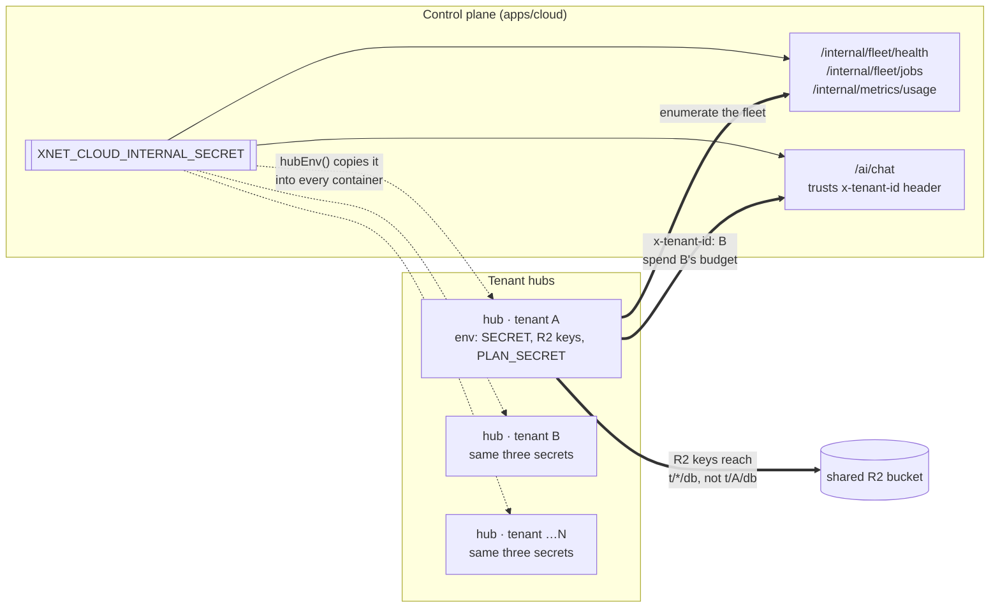
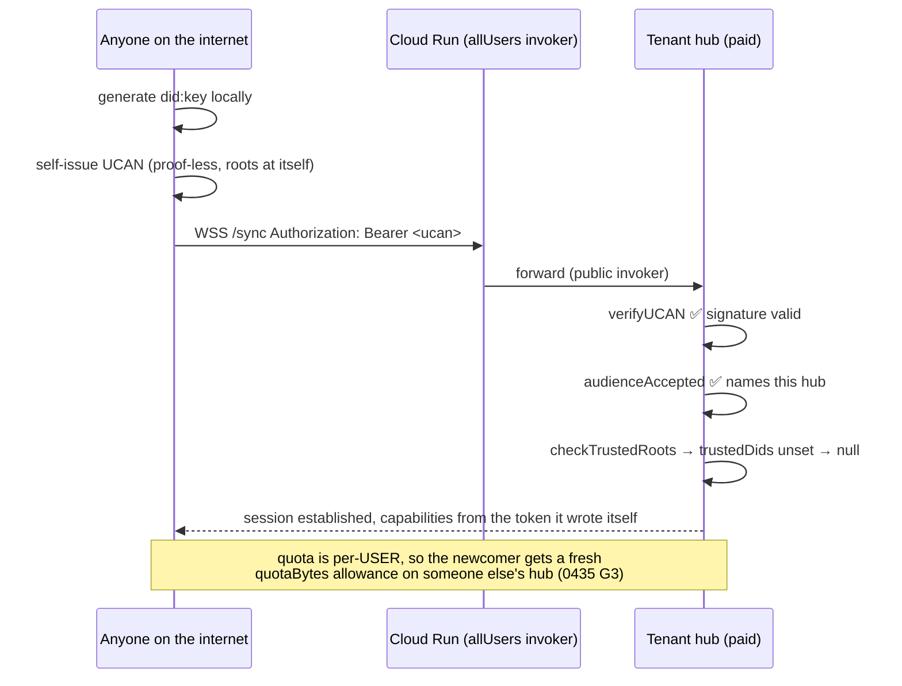
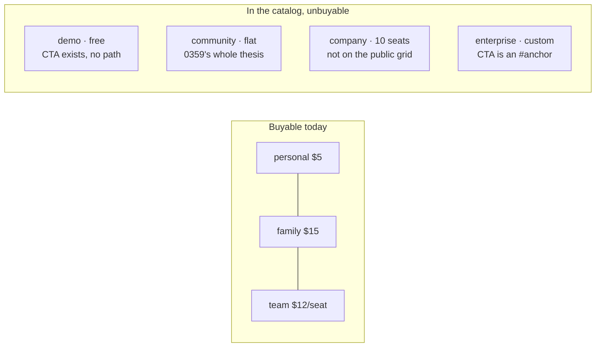
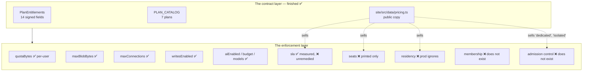
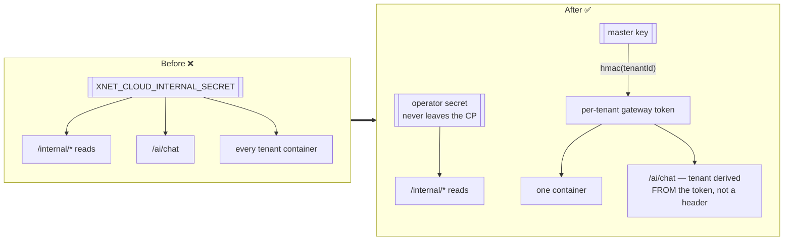

# Cloud product gaps — who is the tenant, blast radius, and the plans nobody can buy

> [!TIP]
> **TL;DR** — [0435](./0435_[_]_CLOUD_STORAGE_TIER_UPGRADES.md) found that we sell
> storage the substrate cannot hold. Digging into the rest of the product finds the
> same shape three more times, and one of them is a live security defect: **every
> tenant hub is handed the fleet's operator secret and the fleet's R2 credentials**,
> so any code running in any container can enumerate the whole fleet and bill AI to
> anyone else's budget. Underneath that sits a structural hole — **xNet Cloud has no
> model of who is inside a tenant.** `seats` is a decorative number, no hub restricts
> which DIDs may connect, and there is no invite, member list, or removal anywhere in
> the control plane. And commercially, **four of seven plans have no purchase path at
> all**, including the free tier the pricing page's primary CTA points at.

## Problem Statement

Exploration 0435 asked one product question — can we sell more storage? — and the
answer turned out to be an architecture answer: no, because the bytes go to RAM. That
is a useful failure mode to generalise. It suggests the cloud product has a pattern
where **the contract layer is finished and the enforcement layer is not**, and where
the marketing copy is written against the contract layer.

So: where else does that pattern hold? Three questions, asked of the whole product
rather than one feature:

1. **Who is the tenant?** A plan says `seats: 5`. Five of whom? How does person two
   get in, how do they get out, and what stops person six?
2. **What is a "dedicated hub" actually isolating?** We sell five isolation tiers up
   to `region-pinned`. If one tenant's container is compromised, what does the
   attacker reach?
3. **Who can become a customer?** The catalog has seven plans. How many of them can
   somebody actually buy today, by clicking?

The answers are **nobody knows**, **the entire fleet**, and **three**.

## Executive Summary

| #      | Gap                                                                       | Severity     | Status                                                    |
| ------ | ------------------------------------------------------------------------- | ------------ | --------------------------------------------------------- |
| **G1** | Every tenant hub holds the fleet-wide operator + R2 credentials           | 🔴 Live      | ❌ `hubEnv` injects `XNET_CLOUD_INTERNAL_SECRET` verbatim  |
| **G2** | `x-tenant-id` is an unauthenticated header behind that shared secret      | 🔴 Live      | ❌ Any hub can spend any tenant's AI budget                |
| **G3** | No admission control — a paid hub accepts any self-issued UCAN            | 🔴 Live      | ❌ `trustedDids` is never set by the control plane         |
| **G4** | No tenant membership model at all (no invite, roster, role, removal)      | 🔴 High      | ❌ `TenantRecord` holds one `billingUserId`, one `did`     |
| **G5** | `seats` is display-only; checkout bills `quantity: 1`                     | 🟠 Med       | ❌ Team advertised "$12/seat, add seats any time"          |
| **G6** | Free tier has no provisioning path — the top-of-funnel CTA dead-ends      | 🟠 Med       | ❌ `demo` is not in `CHECKOUT_PLANS`                       |
| **G7** | `community`, `company`, `enterprise` have no purchase path                | 🟠 Med       | ❌ No self-serve, no contact-sales route                   |
| **G8** | `residency` is honoured by the fake provisioner and ignored by the real one | 🟠 Med     | ❌ `spec.region ?? config.region` — never `entitlements`   |
| **G9** | `ShardAllocator` counts live in a `Map` that dies with the process        | 🟠 Med       | ❌ Re-fills shard 0 into Cloud Run's hard 1,000 cap        |
| **G10**| No tax calculation anywhere                                              | 🟠 Med       | ❌ No `automatic_tax`; VAT is owed from the first EU sale  |
| **G11**| Team's public "99.9% availability" is measured against nothing           | 🟡 Low       | ❌ Catalog says `best-effort` → objective `null`           |
| **G12**| SLA is measured but never remedied — no service credit exists            | 🟡 Low       | ❌ `sloForSla` computes; nothing pays out                  |

**The finding that reorders everything:** G1–G4 are the same gap seen from four
angles. xNet Cloud provisions *hubs*; it does not model *tenants*. A hub knows its
quota, its blob ceiling and its connection cap — all resource numbers — and knows
nothing about which humans are entitled to it. Everything downstream (seats, sharing,
enterprise SSO, per-member community pricing, even "delete my data") needs a roster
that does not exist, and the absence shows up as a security hole before it shows up
as a missing feature.

> [!CAUTION]
> **G1 and G2 are live defects on a running surface, not roadmap items.** They should
> ship independently of and before everything else in this document, the same way
> [0433](./0433_[-]_OPERATOR_CONSOLE_THE_DECIDED_PLAN.md) split its D1/D2 out of the
> console plan. Nothing below them is blocked on them.

---

## Current State In The Repository

### 🔴 G1 — every tenant hub is handed the fleet's keys

[`control-plane.ts:194`](../../apps/cloud/src/control-plane.ts) builds the environment
for every managed hub:

```ts
// apps/cloud/src/control-plane.ts:199
const env: Record<string, string> = {
  HUB_PLAN: signEntitlements(entitlements, this.deps.planSecret),
  XNET_PLAN_SECRET: this.deps.planSecret          // ← fleet-wide signing key
}
if (this.deps.managedAi && entitlements.aiEnabled) {
  env.XNET_CLOUD_URL = this.deps.managedAi.cloudUrl
  env.XNET_CLOUD_INTERNAL_SECRET = this.deps.managedAi.internalSecret  // ← operator secret
  env.XNET_TENANT_ID = tenantId
}
```

And the substrate adapter adds two more
([`cloud-run-litestream.ts:126`](../../packages/cloud/src/provisioner/adapters/cloud-run-litestream.ts)):

```ts
LITESTREAM_PATH: `t/${spec.tenantId}/db`,
R2_BUCKET: this.config.r2Bucket,
R2_ACCESS_KEY_ID: this.config.r2AccessKeyId,      // ← one bucket, one credential
R2_SECRET_ACCESS_KEY: this.config.r2SecretAccessKey
```

Now trace `managedAi.internalSecret` back to where it is configured
([`index.ts:324`](../../apps/cloud/src/index.ts) and
[`index.ts:553`](../../apps/cloud/src/index.ts)):

```ts
// line 324 — injected into every AI-enabled tenant hub
? { cloudUrl, internalSecret: env.XNET_CLOUD_INTERNAL_SECRET }
// line 553 — gates every /internal/* route on the control plane
...(env.XNET_CLOUD_INTERNAL_SECRET ? { internalSecret: env.XNET_CLOUD_INTERNAL_SECRET } : {}),
```

**They are the same environment variable.** Two authorization domains — "this hub may
call the AI gateway" and "this caller is the fleet operator" — collapsed onto one
secret, and that secret is copied into every paying customer's container.



What the shared secret still opens, after
[0433](./0433_[-]_OPERATOR_CONSOLE_THE_DECIDED_PLAN.md) decision 11 correctly closed
the mutation routes:

| Route                      | Gate                    | What a tenant hub gets                                     |
| -------------------------- | ----------------------- | ---------------------------------------------------------- |
| `/internal/account/recover`| Operator identity ✅    | Nothing — the secret is rejected here (0433 fixed this)    |
| `/internal/tenants/:id/plan`| Operator identity ✅   | Nothing                                                     |
| `/internal/fleet/health`   | Shared secret ❌        | **Every `tenantId`, `plan` and `hubUrl` in the fleet**      |
| `/internal/fleet/jobs`     | Shared secret ❌        | Job queue state                                             |
| `/internal/metrics/usage`  | Shared secret ❌        | Fleet aggregates                                            |

> [!WARNING]
> The mitigation 0433 shipped is real and it holds: the account-takeover primitive is
> behind an operator identity now. What remains is **enumeration** — one compromised
> hub reads `/internal/fleet/health` and learns the id, plan and public URL of every
> other tenant. Chain that to G3 below (any DID may connect to any hub) and the
> enumeration is not academic.

The repo already knows the right pattern and applies it one line away. Diagnostics
derives a **per-tenant** secret from the master
([`diagnostics.ts:69`](../../apps/cloud/src/diagnostics.ts)):

```ts
export function diagnosticsSecretFor(masterSecret: string, tenantId: string): string {
  return `${tenantId}.${hmacHex(masterSecret, `diag:${tenantId}`).slice(0, 32)}`
}
```

`hubEnv` calls that for `XNET_DIAGNOSTICS_SECRET` and then passes the raw master for
`XNET_CLOUD_INTERNAL_SECRET` in the block immediately above it. This is not a design
disagreement to litigate; it is one function that was not reused.

### 🔴 G2 — `x-tenant-id` is a header, and headers are typed by the caller

[`ai/wiring.ts:103`](../../apps/cloud/src/ai/wiring.ts):

```ts
const secret = env.XNET_CLOUD_INTERNAL_SECRET
return async (c) => {
  if (!secret || c.req.header('x-internal-secret') !== secret) return null
  const tenantId = c.req.header('x-tenant-id')   // ← whatever the caller says
  if (!tenantId) return null
  const record = await controlPlane.getTenant(tenantId)
  ...
  return { tenantId, virtualKey: record.aiKeyRef, budgetUsd: …, customerId: … }
}
```

Once the shared secret matches, the tenant is whoever the `x-tenant-id` header claims
to be. The returned context carries the **other tenant's OpenRouter virtual key** and
their Stripe `customerId`, so metered overage bills to them. The file's own comment
concedes the shape of the problem — *"A per-tenant gateway token would tighten the
blast radius — a hardening follow-up"* — but reads it as a hardening nicety rather
than as the only thing standing between tenant A and tenant B's wallet.

> [!IMPORTANT]
> This is the exact failure the AI budget work went out of its way to prevent. 0244
> built a hard cap so a tenant could not surprise *themselves* with a bill. G2 lets
> them surprise *someone else* with one.

### 🔴 G3 — a paid tenant's hub is an open relay

The hub requires a UCAN (`auth: true` by default,
[`types.ts:177`](../../packages/hub/src/types.ts)) and then applies a trusted-root
policy — **if one is configured**
([`ucan.ts:44`](../../packages/hub/src/auth/ucan.ts)):

```ts
const checkTrustedRoots = (token: string, config: HubConfig): string | null => {
  const trusted = config.trustedDids
  if (!trusted || trusted.length === 0) return null   // ← no policy = everyone passes
  ...
}
```

`trustedDids` appears in exactly four places in the repo: the type, this check, one
test, and a CLI hint in `packages/cli/src/commands/enroll.ts`. **The control plane
never sets it.** `hubEnv` has no `HUB_TRUSTED_DIDS`, and `TenantRecord` has no field
that could supply one beyond the single bound `did`.

Meanwhile the Cloud Run client makes every hub publicly invokable by design
([`google-cloud-run-client.ts`](../../apps/cloud/src/provisioner/google-cloud-run-client.ts)):

```ts
policy: { bindings: [{ role: 'roles/run.invoker', members: ['allUsers'] }] }
```

The comment explains the reasoning — *"Hubs are publicly routable and enforce their
own DID/passkey auth"* — and the reasoning is correct. The hub does enforce DID auth.
It just does not enforce *which* DIDs, so a self-issued UCAN from a key generated
thirty seconds ago is accepted on a hub someone else is paying for.



Two things make this worse than it first sounds. First, the per-user quota that 0435
already flagged means an uninvited DID does not eat the owner's allowance — it gets
its own, so the natural backstop points the wrong way. Second, `maxConnections` is the
only aggregate limit in the system, so the practical ceiling on squatters is a
connection count sold as a *feature* (`enterprise: 10000`).

### 🔴 G4 — there is no model of who is inside a tenant

[`TenantRecord`](../../apps/cloud/src/registry.ts) is the control plane's whole idea of
a customer. It holds exactly one person:

```ts
/** WorkOS billing user that owns this tenant. */
billingUserId: string
/** Bound data identity (`did:key`); empty while a rebind is pending. */
did: string
```

There is no `members`, no `invites`, no role, no removal. The route list confirms it —
`/account/plan`, `/account/ai-budget`, `/account/delete-data`, `/account/recover`,
`/device/start`, `/device/token`, `/claim`. Nothing that adds a second human.

The device-grant flow ([`device-grant.ts`](../../apps/cloud/src/device-grant.ts)) is
the only thing shaped like an invitation, and its semantics are explicitly
*single-identity*: the dashboard-authenticated billing user approves a short code, and
the control plane binds **the** DID. It answers "is this my other laptop?", not "is
this my co-founder?".

So for a `family` tenant, the second family member has two options, neither designed:
share the billing login (defeats the passkey identity model), or connect a fresh DID
straight to the hub URL — which works, because of G3, and is indistinguishable from an
attacker doing the same thing.

> [!NOTE]
> This is not a criticism of the hub's authorization model, which is rich and
> correct — grants, spaces, roles, the CRUD split, `share-access.ts`. The hub knows how
> to express "this DID may read that space". What is missing is the layer above:
> nothing decides **which DIDs are the tenant** in the first place, and no product
> surface anywhere lets a paying customer say so.

### 🟠 G5 — `seats` is a number we print

Every consumer of `entitlements.seats` in the entire repository:

```
apps/cloud/src/dashboard.ts:283   <dt>Seats</dt><dd>${isSeatMetered(e) ? e.seats : 'Unlimited members'}</dd>
site/src/pages/cloud/pricing.astro:80   <dd>{tier.seats}</dd>
```

Two render calls. `packages/hub/src/config.ts:74` resolves four fields out of the
signed token — `quotaBytes`, `maxBlobBytes`, `maxConnections`, `writesEnabled` — and
`seats` is not among them. The hub could not enforce a seat count if it wanted to,
because (G4) it has no roster to count.

Billing is the same story from the other end
([`stripe-gateway.ts:95`](../../apps/cloud/src/billing/stripe-gateway.ts)):

```ts
line_items: [{ price, quantity: 1 }],
```

Against public copy that says, on [`pricing.ts`](../../site/src/data/pricing.ts):

- Team — `$12/seat/mo`, `from $36/mo (3 seats)`, **"Per-seat billing, add seats any time"**
- Family — **"5 seats, one bill"**
- Onboarding step 4 — **"Manage billing, add seats, export everything"**

A three-seat Team subscription bills $12. The margin model in
`packages/cloud/src/cost/pricing.ts` assumes it bills $36.

### 🟠 G6 — the free tier's front door opens onto a wall

The pricing page's first card is Free — *"No card required"*, CTA
`startUrl('demo')` → `https://cloud.xnet.fyi/auth/start?plan=demo`. That route seals a
session and redirects to `/dashboard?plan=demo`. The dashboard renders a plan picker
built from `CHECKOUT_PLANS`
([`server.ts:176`](../../apps/cloud/src/server.ts)):

```ts
const CHECKOUT_PLANS: { id: PlanId; label: string; price: string }[] = [
  { id: 'personal', label: 'Personal', price: '$5/mo' },
  { id: 'family', label: 'Family', price: '$15/mo' },
  { id: 'team', label: 'Team', price: '$12/seat/mo' }
]
```

`demo` is not there, and `POST /checkout` rejects any plan that is not
(`server.ts:486`). The only code paths that provision a tenant are the Stripe
`checkout.session.completed` webhook and the operator route `POST /internal/tenants`.
**There is no way for a visitor to obtain the free hub the pricing page's primary CTA
promises.** They sign in, land on a dashboard offering three paid plans, and the `plan`
query parameter they carried is dropped on the floor.

### 🟠 G7 — three plans exist only in the catalog



`community` is the plan [0359](./0359_[_]_COMMUNITY_HOSTING_AND_RECURRING_REVENUE_THE_SKOOL_QUESTION.md)
argued for and the Charter cites by name as the receipt for "no per-member pricing on
communities". It has entitlements, an isolation tier, a 99.9% SLA and `seats: 0`. It
has no price, no Stripe id, no checkout entry, and no row on the public pricing grid.
The one plan whose existence is load-bearing for a Charter commitment cannot be
purchased.

`enterprise`'s CTA is `/cloud#enterprise` — an anchor on the marketing page. There is
no contact route, no lead capture, no quote object, and no invoicing path in
`apps/cloud`. The Enterprise card promises four things:

| Promise                        | Reality                                                                   |
| ------------------------------ | ------------------------------------------------------------------------- |
| SSO / SCIM via WorkOS          | `AuthorizationUrlOptions` supports `connectionId`/`organizationId`; `/auth/start` never passes either, and no `organizationId` is stored on a tenant. SCIM is absent entirely. |
| Data residency (region pinning)| See G8 — the real provisioner ignores it                                   |
| Custom SLA & support           | Measured (`sloForSla` → 0.9995), never remedied (G12)                     |
| Audit logging & admin controls | The hub has `/audit`; there is no tenant-admin surface (needs G4)         |

### 🟠 G8 — residency works in the fake and not in the real

```ts
// packages/cloud/src/provisioner/memory.ts:40  — the DEV provisioner
const region = spec.region ?? spec.entitlements.residency ?? 'local'

// packages/cloud/src/provisioner/adapters/cloud-run-litestream.ts:166 — PRODUCTION
const region = spec.region ?? this.config.region
```

The production adapter has no `entitlements.residency` fallback. And the self-serve
path never supplies `spec.region` either: `provisionForBilling` is called from the
Stripe webhook, whose metadata is `{ customerRef, plan }`. So a `region-pinned`
enterprise tenant lands in `config.region` like everybody else, while
`requiresMigration()` cheerfully reports that changing residency is a migration —
guarding a boundary the substrate does not implement.

> [!WARNING]
> This is the failure mode `AGENTS.md` names directly: a coercion that returns a value
> the caller cannot distinguish from success. `residency: 'eu-west-1'` and
> `residency: undefined` produce the same Cloud Run service. If we ever sell residency
> to a customer with a legal reason to need it, the wrong answer looks exactly like
> the right one.

### 🟠 G9 — the shard allocator forgets

Cloud Run enforces a hard, un-raisable cap of 1,000 services per project per region,
which is why `ShardAllocator` exists. Its state
([`sharding.ts:38`](../../packages/cloud/src/provisioner/sharding.ts)):

```ts
export class ShardAllocator {
  private readonly counts = new Map<string, number>()
```

`CloudRunLitestreamProvisioner` constructs a fresh one in its constructor
([`cloud-run-litestream.ts:109`](../../packages/cloud/src/provisioner/adapters/cloud-run-litestream.ts)),
and nothing rehydrates it from the tenant store. **Every control-plane restart resets
every count to zero**, so `allocate()` walks back to `xnet-hub-0` and keeps handing it
out. Deploys are frequent; the counter is never right for long.

There is a second, quieter bug in the same object: the cap is per project *per
region*, and `allocate()` takes no region argument. A multi-region fleet counts one
number across all of them, which happens to fail safe today and fails the wrong way
the moment G8 is fixed and regions actually diverge.

$$
\text{services in } P_0 = \sum_{r \in \text{regions}} n_r \quad\text{vs. the real limit}\quad \max_r n_r \le 1000
$$

<details>
<summary>What the failure actually looks like in production</summary>

Shard 0 fills to its 800-service soft cap; the allocator rolls to shard 1 and keeps
going. A routine deploy restarts the control plane. The next customer to check out
gets `allocate() → xnet-hub-0`, and `createService` returns `RESOURCE_EXHAUSTED`
(or, for a tenant id that collides with an existing service, `ALREADY_EXISTS`).

The customer has already paid — the webhook fires on
`checkout.session.completed`, so provisioning failure happens *after* the charge. The
saga in [`saga.ts`](../../apps/cloud/src/saga.ts) will unwind the provisioning steps,
but the Stripe subscription is live and the tenant record is not. That is the worst
ordering to discover a quota bug in.

</details>

### 🟠 G10 — no tax, anywhere

`grep -rn "automatic_tax\|tax_behavior\|tax_id" apps/cloud packages/cloud` returns
nothing. `checkout.sessions.create` is called with `mode`, `customer`, `line_items`,
`success_url`, `cancel_url` and metadata. No `automatic_tax: { enabled: true }`, no
`customer_update: { address: 'auto' }` (which Stripe requires alongside it), no tax ID
collection, no reverse-charge handling.

For a UK/EU-domiciled seller this is not a "later" item: VAT on B2C digital services is
owed in the customer's member state from the **first** euro, with no registration
threshold, and the price shown must be tax-inclusive. Retro-fitting tax after the
first hundred subscriptions means either eating the VAT out of a 42%-margin business or
raising every existing customer's price.

### 🟡 G11 / G12 — the SLA is measured, mislabelled, and unremedied

`availabilityObjective` ([`plans.ts:394`](../../packages/entitlements/src/plans.ts))
returns `null` for `best-effort`, and `team.sla` is `best-effort`. So
`errorBudgetRemaining` for a Team tenant is `1` no matter what happens. The pricing
page's Team card lists **"99.9% best-effort availability"** as a highlight. The number
and the word contradict each other, and the catalog implements the word.

And nothing anywhere converts a burnt error budget into money. `sloForSla`,
`errorBudgetMs`, `budgetPolicy`, `fleetSummary` — a complete measurement stack, with no
credit issuance, no `/account/credits`, and no Stripe credit-note call. A published
99.9% with no remedy is a marketing claim, not an SLA, which matters because
`community` and `company` both carry it and `enterprise` promises "custom SLA" to
buyers whose procurement will ask for the remedy in writing.

---

## External Research

### Per-tenant credentials are a solved problem on both substrates

**Cloudflare R2** ships exactly the primitive G1 needs. `POST
/accounts/{account_id}/r2/temp-access-credentials` mints short-lived S3 credentials
derived from a parent token, scoped to **one bucket, a set of permitted operations,
and optionally a list of prefixes**. That maps one-to-one onto the
`t/<tenantId>/` layout the Litestream path already uses — a hub gets a credential that
can reach its own prefix and nothing else, and it expires.

**Cloud Run** wants a dedicated service account per service: *"Each service should have
its own service account. Shared accounts mean shared blast radius."* The current
`spec()` in
[`google-cloud-run-client.ts:66`](../../apps/cloud/src/provisioner/google-cloud-run-client.ts)
sets only `containers` and `scaling`, so every tenant hub runs as the shard project's
**default compute service account** — which by default carries project-wide Editor.
Adding `serviceAccount` to the upsert is a one-field change to the proto mapping.

### Seat enforcement: soft-then-hard is the consensus

The pattern the SaaS billing literature converges on is *tranched*: a soft limit at the
fair-usage line that notifies and starts a monetisation conversation, and a genuine
hard limit far beyond it that protects the platform. Alerts at 75/90/100%; be lenient
on brief overage, act on sustained. Notably, "hard limit" rarely means shut off — for
seats it usually means *refuse the eleventh invitation*, which is a much softer
failure than disconnecting a person who is already working.

This matters for xNet specifically because a hub is not a web app: a seat is a device
that is mid-sync. Kicking a connected DID off a hub is a data-loss-shaped event even
though the local copy is authoritative.

### Tax

Stripe Tax covers roughly the compliance surface a company at this stage needs:
automatic rate calculation, VAT ID validation with reverse charge for EU/AU B2B, nexus
monitoring against US thresholds ($100k/200 transactions in most states, $500k in
CA/NY/TX), and filing for US states, EU OSS, UK, AU, NZ and CA. It is a per-transaction
fee on top of the 2.9%, which the storage margin model in 0435 does not currently
account for.

### The comparison that frames G7

Every managed-hosting product that sells to communities and companies has the same
three-lane funnel: a genuinely self-serve free tier, self-serve paid tiers, and a
sales-assisted lane with a real contact form and a quote. xNet has the middle lane
only. The free lane is a broken link and the sales lane is an HTML anchor.

---

## Key Findings

1. **One environment variable holds two authorization domains.** `XNET_CLOUD_INTERNAL_SECRET`
   is both the AI-gateway credential handed to every tenant container and the gate on
   `/internal/*` read routes. Splitting them is a small, mechanical change with a large
   effect, and `diagnosticsSecretFor` is the pattern to copy.
2. **The AI gateway trusts a header for identity.** Behind the shared secret,
   `x-tenant-id` selects whose virtual key and whose Stripe customer gets used. This is
   cross-tenant billing, not just cross-tenant reads.
3. **"Dedicated hub" is a scheduling property, not a security boundary.** One shared R2
   credential, one shared plan-signing secret, one shared operator secret, and the
   default compute service account. The blast radius of any single hub is the fleet,
   on tiers whose entire pitch is isolation.
4. **The hub has no idea who its tenant is.** No trusted roots, no roster, no seat
   enforcement. G3 and G4 are the same missing concept wearing a security hat and a
   product hat.
5. **`seats` is a contract with no enforcement and no billing** — and the public copy
   sells it three times.
6. **Four of seven plans cannot be bought**, including the free one the primary CTA
   points at and the `community` plan the Charter names as a receipt.
7. **Two fields are honoured by the dev implementation and ignored by production**
   (`residency`), or forgotten across restarts (`ShardAllocator`). Both are the "silent
   plausible normal state" failure `AGENTS.md` forbids.
8. **Tax is a from-the-first-sale obligation, not a scale problem.**

### The one diagram that holds the argument



Read left to right, the pattern 0435 found is the whole product's pattern: **the
marketing copy is written against the contract layer, and the contract layer is ahead
of enforcement by exactly the fields nobody has had to defend yet.**

---

## Options And Tradeoffs

### A. Where does tenant membership live?

This is the load-bearing choice; G3, G4, G5, community pricing and enterprise SSO all
resolve against it.

#### A1 — Hub-native only: the owner's grants are the roster

Keep `TenantRecord` single-owner. The owner adds collaborators using the hub's existing
share/grant machinery, and the control plane never learns their names.

**Good:** zero new control-plane state; nothing to keep in sync; maximally
local-first — the roster is the owner's data, not ours.
**Bad:** the control plane cannot set `trustedDids` (it does not know the DIDs), so G3
stays open. Seats cannot be billed. There is no way to answer "who has access to this
tenant" during a support call or a GDPR request. The owner must be online for a new
member to join, which for a 5,000-member community plan is not a flow.

#### A2 — Control-plane roster of DIDs ⭐

Add `members: TenantMember[]` to `TenantRecord`, where a member is
`{ did, role, addedAtMs, addedBy }`. Invitations reuse the device-grant flow verbatim —
it is already a code-approval handshake between an authenticated dashboard user and a
locally-generated DID; it simply binds an *additional* DID instead of *the* DID. The
control plane derives `HUB_TRUSTED_DIDS` from the roster and pushes it with the
entitlement token on the existing `setEnv` path.

**Good:** closes G3 with a config value the hub already understands
(`checkTrustedRoots` needs no changes). Makes `seats` countable and therefore billable.
Gives support and GDPR a roster to read. Reuses the invitation UX that exists.
**Bad:** the roster is control-plane state a self-hosted hub does not have — the
anti-lock-in invariant means `trustedDids` must stay **optional** and absent must keep
meaning "no policy". Membership changes trigger a `setEnv`, and on Cloud Run that is a
new revision (the same warm-tenant restart caveat 0435 flagged for storage packs).

#### A3 — WorkOS Organizations as the roster

Model a tenant as a WorkOS Organization; members are WorkOS users; SSO and SCIM come
for free at the enterprise tier.

**Good:** SCIM directory sync is genuinely hard to build and WorkOS already has it —
this is the only option that makes the Enterprise card's SSO/SCIM promise true without
new infrastructure.
**Bad:** it puts the *billing* identity provider in charge of the *data* identity
roster, which inverts the separation the whole device-grant design exists to preserve
(0192: "the non-custodial app must NOT embed WorkOS"). A WorkOS user is an email; a
member is a `did:key`. They are not the same object and conflating them re-custodializes
identity.

#### Verdict

| Option              | Closes G3 | Bills seats | SSO/SCIM  | Local-first | Verdict                          |
| ------------------- | --------- | ----------- | --------- | ----------- | -------------------------------- |
| A1 · hub-native     | ❌        | ❌          | ❌        | ✅ Strongest| Rejected — leaves G3 open        |
| A2 · CP roster      | ✅        | ✅          | 🚧 later  | ✅ Preserved| ⭐ **Recommended**               |
| A3 · WorkOS orgs    | ✅        | ✅          | ✅        | ❌ Inverts  | 🚧 Enterprise **mapping** onto A2 |

A2 is the substrate; A3 becomes a mapping *into* A2 for enterprise tenants (a WorkOS
Organization membership event adds a pending member slot; the human still binds their
own DID through the device grant). That keeps the DID as the member identity and uses
WorkOS for the thing WorkOS is actually good at — telling us the human left the company.

### B. What to do about `seats` in the meantime

| Option                                    | Effect                                                                       | Verdict          |
| ----------------------------------------- | ---------------------------------------------------------------------------- | ---------------- |
| Bill seats now, enforce later             | Fixes the revenue hole; "add seats any time" still 404s                      | Half a fix       |
| Enforce now, bill later                   | Impossible — enforcement needs the roster (A2)                                | Not available    |
| **Ship A2, then bill and enforce together**| One coherent release; the copy becomes true in one step                      | ⭐ Recommended   |
| Correct the copy to match the code today  | Free, honest, ships this afternoon                                            | ⭐ Do both       |

The last row is not a consolation prize. Until the roster exists, the pricing page
claims three things that are false. Editing `site/src/data/pricing.ts` costs nothing
and removes the worst outcome, which is a customer discovering the gap by trying to use
it.

### C. Selling `community`, `company`, `enterprise`

**C1 — self-serve everything.** Add all three to `CHECKOUT_PLANS` and `PRICE_BY_PLAN`.
Fast, but `enterprise` implies a contract, residency (G8) and an SLA remedy (G12) that
do not exist; selling it self-serve sells all three defects at once. 🛑

**C2 — a real contact-sales lane. ⭐** `POST /contact` capturing
`{ email, plan, orgName, seats, notes }` into the existing durable store, an operator
route to convert a lead into a provisioned tenant with overrides, and Stripe invoicing
rather than Checkout. Unblocks `enterprise` and `company` honestly.

**C3 — `community` goes self-serve. ⭐** This one is different in kind. `community` is
flat-billed by design, has no residency requirement and no custom contract; the only
reason it is unbuyable is that nobody added a price. It should join `CHECKOUT_PLANS`
alongside a public pricing-grid row, because the Charter cites its existence as a
receipt and an uncitable receipt is not one.

**C4 — a genuinely free `demo`.** `POST /account/start-free` provisioning a pooled
`demo` tenant with no card. This is the top of the entire funnel and it is currently a
dead link. It also needs 0291's eviction work to be real, since a free pooled tier with
no eviction is the runaway-storage failure by construction.

### 🧭 Charter §6 — the three tests, applied to seats

Seat billing is an existing revenue lane, but G5 means we have never actually charged
for it, so the tests are worth running before we start.

| Test                                                        | Verdict     | Reasoning                                                                                                                                                                          |
| ----------------------------------------------------------- | ----------- | ---------------------------------------------------------------------------------------------------------------------------------------------------------------------------------- |
| **Improvement** — are we charging for something we run?     | ✅ Pass     | A seat is a collaborator whose device syncs against a hub we operate — real connections, real storage, real relay. `plans.ts` already draws this line: *"a seat is a collaborator we provision capacity for, never an audience member the customer brought."* |
| **BATNA** — is there a real alternative?                    | ✅ Pass     | Self-host the MIT hub with unlimited members; the entitlements package is MIT and dependency-free so a self-hosted hub never phones home.                                           |
| **Vanish** — do they lose what they paid for?               | ✅ Pass     | Every member's authoritative copy is on their own device. Losing the hub loses the relay, not the data.                                                                             |

> [!IMPORTANT]
> **The tripwire for the seats ADR:** _the moment a seat is charged for someone the
> customer brought rather than someone we provision capacity for, this decision is
> void._ The concrete signal is a proposal to seat-meter `community`, or to count
> read-only/audience DIDs as seats on any plan. `withSeats()` already refuses the
> former ([`plans.ts:306`](../../packages/entitlements/src/plans.ts)); the roster in A2
> is where the latter would sneak in, because once you have a member list somebody will
> want to bill it by length. **Roles must distinguish `member` from `guest`, and only
> `member` may count.**

---

## Recommendation

Four phases. Phase S is independent of the rest and ships first.

> [!IMPORTANT]
> **Phase S — split the secret, scope the credentials.** No new concepts, no product
> decisions, no migration. It is the same `diagnosticsSecretFor` derivation applied two
> more times, plus two fields on the Cloud Run upsert.

### Phase S — blast radius (ships alone, immediately)



1. Derive a per-tenant gateway token exactly as diagnostics does, and **resolve the
   tenant from the token** rather than from `x-tenant-id`. G2 disappears as a
   consequence: there is no header left to lie in.
2. Give `/internal/*` reads their own secret that is never injected into a hub.
3. Per-tenant R2 credentials scoped to the `t/<tenantId>/` prefix, refreshed on the
   existing `setEnv` path.
4. `serviceAccount` on `CloudRunUpsert`, one per tenant service, and stop running on
   the default compute account.
5. Per-tenant `XNET_PLAN_SECRET` derived the same way, so a leaked hub env cannot mint
   entitlements for any tenant but itself.

<details>
<summary>Why per-tenant plan signing is safe with a shared verifier</summary>

The hub verifies its own token with the secret in its own env; it never verifies
another tenant's. So `planSecretFor(master, tenantId) = hmac(master, "plan:" + tenantId)`
requires no change to `entitlementsFromEnv` or `verifyEntitlements` — the control plane
signs with the derived key and injects the same derived key. Self-hosted hubs are
untouched (no `HUB_PLAN`, no secret, no code path).

The one migration concern is tenants provisioned before the change: their env holds the
master. A rolling `setEnv` across the fleet re-keys them, and until it completes both
keys must verify. That argues for a `HUB_PLAN_KID` field and a two-key verifier for one
release, then dropping the master.

</details>

### Phase T — the tenant roster (A2)

`TenantMember { did, role: 'owner' | 'member' | 'guest', addedAtMs, addedBy }` on
`TenantRecord`; the device-grant flow extended to bind an additional DID; the roster
projected into `HUB_TRUSTED_DIDS` on every entitlement push. `seats` becomes the count
of `role === 'member'`, and the invitation that would exceed it is refused with a
message, not a disconnect.

Two invariants:

- **Absent `trustedDids` still means no policy.** A self-hosted hub must be unaffected,
  and a token pushed before this field existed must not lock anyone out. Same fail-open
  rule as `writesEnabled`.
- **Enforcement refuses admission, never evicts a live session.** A hub that drops a
  connected member because a seat count changed is a data-loss event in a local-first
  product, even when it technically is not.

### Phase C — commerce

Seats billed as a real Stripe `quantity`; `automatic_tax` on Checkout with
`customer_update: { address: 'auto' }`; `community` added to `CHECKOUT_PLANS` and the
public grid; `POST /contact` plus an operator convert-to-tenant route for `company` and
`enterprise`; `POST /account/start-free` for `demo`.

### Phase E — enterprise truth

`residency` honoured by the real provisioner or removed from the Enterprise card;
region added to `ShardAllocator` and its counts rehydrated from the tenant store;
WorkOS Organization mapping onto the Phase T roster; an SLA credit policy that either
issues credits or the SLA claims come off the page.

> [!CAUTION]
> Phase E contains the only genuine one-way doors in this document: a published SLA
> remedy and a residency guarantee both become contractual. Everything in Phases S, T
> and C is reversible. Do not let Phase E's weight delay the other three.

---

## Example Code

Illustrative, not final.

**Phase S — the derivation that already exists, used twice more:**

```ts
// apps/cloud/src/control-plane.ts

/**
 * Per-tenant credential derived from a fleet master, the same construction
 * `diagnosticsSecretFor` uses. The point is not secrecy strength — it is that a
 * hub env can only ever contain a credential that speaks for that one tenant, so
 * reading one container's environment does not yield the fleet.
 */
const gatewayTokenFor = (master: string, tenantId: string): string =>
  `${tenantId}.${hmacHex(master, `gw:${tenantId}`).slice(0, 32)}`

private hubEnv(tenantId: string, entitlements: PlanEntitlements): Record<string, string> {
  const planKey = planSecretFor(this.deps.planMasterSecret, tenantId)
  const env: Record<string, string> = {
    HUB_PLAN: signEntitlements(entitlements, planKey),
    XNET_PLAN_SECRET: planKey                       // ← derived, not the master
  }
  if (this.deps.managedAi && entitlements.aiEnabled) {
    env.XNET_CLOUD_URL = this.deps.managedAi.cloudUrl
    // Derived, and self-identifying: the gateway reads the tenant OUT of this
    // token. `x-tenant-id` is no longer consulted, so it can no longer lie.
    env.XNET_CLOUD_GATEWAY_TOKEN = gatewayTokenFor(this.deps.managedAi.masterSecret, tenantId)
  }
  return env
}
```

```ts
// apps/cloud/src/ai/wiring.ts — the resolver, with the header removed

function tenantResolver(env, controlPlane, nowMs) {
  const master = env.XNET_CLOUD_GATEWAY_MASTER
  return async (c) => {
    // Identity comes from the credential, not from a sibling header. There is
    // no code path here that reads a caller-supplied tenant id.
    const tenantId = tenantFromGatewayToken(master, c.req.header('authorization'))
    if (!tenantId) return null
    const record = await controlPlane.getTenant(tenantId)
    ...
  }
}
```

**Phase T — the roster and its projection:**

```ts
// apps/cloud/src/registry.ts

export interface TenantMember {
  /** The member's data identity. Bound through the device-grant flow, never minted by us. */
  did: string
  /**
   * `guest` deliberately does NOT count against `seats`. A seat is capacity we
   * provision for a collaborator; an audience member the customer brought is not
   * one, and billing them would be the per-member meter Charter §6 refuses.
   */
  role: 'owner' | 'member' | 'guest'
  addedAtMs: number
  /** The billing user who approved this member's device grant. */
  addedBy: string
}

export interface TenantRecord {
  // …existing fields…
  /**
   * Everyone entitled to this tenant's hub. **Absent means legacy**, not empty:
   * a record written before this field existed has an implicit roster of
   * `[{ did, role: 'owner' }]`, and must not be projected as an empty
   * `HUB_TRUSTED_DIDS` — that would lock the owner out of their own hub.
   */
  members?: TenantMember[]
}
```

```ts
// apps/cloud/src/control-plane.ts — projection into the hub

private trustedDidsFor(record: TenantRecord): string[] {
  const roster = record.members ?? (record.did ? [{ did: record.did, role: 'owner' as const }] : [])
  return roster.map((m) => m.did).filter(Boolean)
}

// in hubEnv():
//   Only set the policy when we have a non-empty roster. An empty value must
//   never be written: `checkTrustedRoots` treats absent/empty as "no policy",
//   and a hub that writes an empty list would be indistinguishable from one
//   that was never configured — except that we would believe it was locked down.
const trusted = this.trustedDidsFor(record)
if (trusted.length > 0) env.HUB_TRUSTED_DIDS = trusted.join(',')
```

```ts
// packages/entitlements/src/plans.ts — seats become countable

/** Members that consume a seat. Guests are free and uncounted, by policy. */
export function seatsUsed(members: readonly { role: string }[]): number {
  return members.filter((m) => m.role === 'owner' || m.role === 'member').length
}

/** Can this tenant admit one more billed member? Flat plans are always yes. */
export function canAdmitMember(e: PlanEntitlements, used: number): boolean {
  return !isSeatMetered(e) || used < e.seats
}
```

**Phase C — the two-line tax fix:**

```ts
// apps/cloud/src/billing/stripe-gateway.ts
const session = await this.stripe.checkout.sessions.create({
  mode: 'subscription',
  customer,
  line_items: [{ price, quantity: args.seats ?? 1 }],
  // Stripe REQUIRES customer_update alongside automatic_tax when a customer is
  // passed — without it the call fails rather than silently skipping tax.
  automatic_tax: { enabled: true },
  customer_update: { address: 'auto', name: 'auto' },
  tax_id_collection: { enabled: true },
  ...
})
```

---

## Risks And Open Questions

| #   | Risk                                                                                  | Severity | Mitigation                                                                                          |
| --- | ------------------------------------------------------------------------------------- | -------- | ---------------------------------------------------------------------------------------------------- |
| R1  | Re-keying the fleet to per-tenant plan secrets bricks hubs mid-rollout                | 🔴 High  | `HUB_PLAN_KID` + a two-key verifier for one release; roll `setEnv` in waves; never drop the master until the fleet reports the new kid |
| R2  | Projecting an empty roster writes an empty `HUB_TRUSTED_DIDS` and locks out the owner  | 🔴 High  | Legacy records imply `[owner]`; refuse to write an empty value at all (see the code note)           |
| R3  | Seat enforcement disconnects a member who is mid-sync                                 | 🟠 Med   | Refuse **admission**, never evict an established session; alert at 90% instead                       |
| R4  | A community host's 5,000 members each need a device grant                             | 🟠 Med   | `guest` role admitted by an owner-signed invite link rather than one-by-one approval; guests are uncounted and uncharged |
| R5  | Per-tenant R2 temp credentials expire while a hub is asleep                           | 🟠 Med   | Refresh on wake through the existing reactivate path; treat an expired credential as a loud failure, never a silent read-only |
| R6  | Enabling `automatic_tax` changes the price existing customers pay                     | 🟠 Med   | Tax-inclusive vs exclusive is a pricing decision, not a config flag — decide before the first EU sale, not after |
| R7  | Adding `community` to self-serve exposes 0291's unenforced eviction to paying users   | 🟠 Med   | Gate on the aggregate ceiling 0435 Phase 0 adds; `community` is 500 GiB and flat-billed, so it is the most exposed plan |
| R8  | The roster becomes the thing somebody wants to bill by length                         | 🟡 Low   | The ADR tripwire above; the Charter claims-ledger test is the enforcement surface                    |

### Open questions

- [ ] **Does `HUB_TRUSTED_DIDS` break device rebinding?** `recoverAccount` clears the
      bound DID so the next passkey claims the hub. With a trusted-root policy in force,
      a recovering user's new DID is not yet trusted — recovery must push the roster
      *before* the user attempts to connect, or the fix for G3 breaks the recovery path.
- [ ] **What is a seat when one human has four devices?** A member is a DID and a device
      is a DID. Either members carry multiple DIDs (a person object we do not have) or a
      four-device user burns four seats. The former is more work and more correct.
- [ ] **Can `checkTrustedRoots` express delegation?** It requires every root issuer to be
      in the list. If a member delegates to their own second device via a UCAN proof
      chain, the root is the member — which works. Confirm with a test rather than
      assuming, because it determines whether the roster holds people or devices.
- [ ] **Should the free `demo` tier exist at all before eviction is enforced?** 0291 is
      still open. A free pooled tier without eviction is a storage bill with no ceiling.
- [ ] **Do per-tenant R2 credentials work with Litestream?** Litestream reads static S3
      credentials from its config at start-up. Short-lived credentials imply either a
      long TTL, a restart on rotation, or a sidecar that refreshes them — and a restart
      on rotation collides with the warm-instance SLO tiers.
- [ ] **What does an SLA credit actually pay?** A percentage of the monthly fee is the
      industry default, but on a $15 plan that is cents. It may be more honest to drop
      the numeric SLA from `community` than to build a credit engine that issues $0.45.

---

## Implementation Checklist

**Status:** ░░░░░░░░░░░░░░░░░░░░░░░░░░ 0/26 items

### Phase S — blast radius (ships alone, before everything)

- [ ] Give `/internal/*` reads a distinct `XNET_OPERATOR_READ_SECRET` that is never injected into a hub
- [ ] `gatewayTokenFor(master, tenantId)` derived per tenant; injected as `XNET_CLOUD_GATEWAY_TOKEN`
- [ ] Resolve the AI tenant **from the token**; delete the `x-tenant-id` read entirely
- [ ] Update `packages/hub/src/features/ai-forwarder.ts` to send the derived token
- [ ] Per-tenant R2 credentials scoped to `t/<tenantId>/`, refreshed on `setEnv` and on reactivate
- [ ] `serviceAccount` field on `CloudRunUpsert` + the proto mapping in `google-cloud-run-client.ts`
- [ ] `planSecretFor(master, tenantId)` + `HUB_PLAN_KID` + two-key verify for one release
- [ ] Negative-control test: a request bearing tenant A's gateway token and `x-tenant-id: B` must resolve to **A**

### Phase T — the tenant roster

- [ ] `TenantMember` + `members?: TenantMember[]` on `TenantRecord`, absent ⇒ implicit `[owner]`
- [ ] Extend the device grant to bind an additional DID (`POST /account/members/invite`)
- [ ] `POST /account/members/:did/remove`, owner-only, with an audit entry
- [ ] Project the roster into `HUB_TRUSTED_DIDS`; refuse to write an empty value
- [ ] `seatsUsed()` / `canAdmitMember()` in `@xnetjs/entitlements`, with a changeset
- [ ] Refuse the invitation that would exceed `seats`; never evict a live session
- [ ] Push the roster inside `recoverAccount` **before** the new DID is expected to connect
- [ ] Dashboard: a members card with roles, invite, remove, and seats used/total

### Phase C — commerce

- [ ] Bill seats as a real Stripe `quantity`; keep it in sync from `customer.subscription.updated`
- [ ] `automatic_tax` + `customer_update: { address: 'auto' }` + `tax_id_collection` on Checkout
- [ ] `community` in `CHECKOUT_PLANS`, `PRICE_BY_PLAN`, and the public pricing grid
- [ ] `POST /account/start-free` provisioning a pooled `demo` tenant — the CTA that currently dead-ends
- [ ] `POST /contact` lead capture + an operator route converting a lead into a tenant with overrides
- [ ] Correct `site/src/data/pricing.ts` **today**: Team's "99.9%", "add seats any time", "5 seats, one bill"

### Phase E — enterprise truth

- [ ] `residency` honoured in `cloud-run-litestream.ts`, or removed from the Enterprise card
- [ ] `ShardAllocator` keyed by `(project, region)` and rehydrated from the tenant store on boot
- [ ] WorkOS Organization → roster mapping; `organizationId` on `TenantRecord`; `/auth/start` passes it
- [ ] An SLA credit policy that issues credits, or the numeric SLA comes off `community`/`company`
- [ ] Two ADRs in `site/src/content/docs/docs/architecture/decisions.mdx`: the membership contract, and seat billing (with the tripwire above)

## Validation Checklist

- [ ] Reading every environment variable of one tenant hub yields **no** credential that acts on another tenant — proven by a test that asserts the env contains no value equal to any fleet master
- [ ] A request with tenant A's gateway token and `x-tenant-id: B` bills **A**, or is refused; never B
- [ ] `/internal/fleet/health` refuses the secret a tenant hub holds
- [ ] A freshly generated DID with a self-issued UCAN is **rejected** by a provisioned tenant hub, and accepted after it is added to the roster
- [ ] A self-hosted hub with no `HUB_PLAN` and no `HUB_TRUSTED_DIDS` accepts connections exactly as it does today (anti-lock-in, unchanged)
- [ ] A tenant record written before `members` existed still admits its owner after the roster ships
- [ ] A `team` tenant at 3/3 seats refuses a 4th invitation and does **not** disconnect any of the 3
- [ ] `recoverAccount` followed immediately by a device claim succeeds with the trusted-root policy in force
- [ ] A 3-seat Team checkout produces a $36 Stripe invoice, with VAT applied for an EU billing address
- [ ] `community` can be purchased end to end by a visitor with no operator involvement
- [ ] The free CTA on `/cloud/pricing` provisions a working pooled hub with no card
- [ ] Restarting the control plane does not cause the next provision to target a full shard — asserted against a seeded store, not observed once
- [ ] A tenant with `residency: 'eu-west-1'` lands in a EU Cloud Run region, verified from the returned `substrateRef` and not from the entitlement field
- [ ] Every claim on `site/src/data/pricing.ts` maps to an enforcing code path or has been removed — one test, one table, no exceptions

## References

### In this repository

- [`apps/cloud/src/control-plane.ts`](../../apps/cloud/src/control-plane.ts) — `hubEnv`, the two shared secrets, `changePlan`, `recoverAccount`
- [`apps/cloud/src/index.ts`](../../apps/cloud/src/index.ts) — `XNET_CLOUD_INTERNAL_SECRET` wired to both the operator gate and the tenant hubs
- [`apps/cloud/src/ai/wiring.ts`](../../apps/cloud/src/ai/wiring.ts) — `tenantResolver`, the `x-tenant-id` trust
- [`apps/cloud/src/diagnostics.ts`](../../apps/cloud/src/diagnostics.ts) — `diagnosticsSecretFor`, the derivation to copy
- [`apps/cloud/src/server.ts`](../../apps/cloud/src/server.ts) — `CHECKOUT_PLANS`, `requireInternal`, `asOperator`, the route list
- [`apps/cloud/src/registry.ts`](../../apps/cloud/src/registry.ts) — `TenantRecord`, single-owner
- [`apps/cloud/src/billing/stripe-gateway.ts`](../../apps/cloud/src/billing/stripe-gateway.ts) — `quantity: 1`, no tax
- [`apps/cloud/src/provisioner/google-cloud-run-client.ts`](../../apps/cloud/src/provisioner/google-cloud-run-client.ts) — `allUsers` invoker, no `serviceAccount`
- [`packages/cloud/src/provisioner/adapters/cloud-run-litestream.ts`](../../packages/cloud/src/provisioner/adapters/cloud-run-litestream.ts) — shared R2 credentials, region fallback
- [`packages/cloud/src/provisioner/sharding.ts`](../../packages/cloud/src/provisioner/sharding.ts) — `ShardAllocator`, in-memory counts
- [`packages/entitlements/src/plans.ts`](../../packages/entitlements/src/plans.ts) — the catalog, `seats`, `residency`, `withSeats`, `availabilityObjective`
- [`packages/hub/src/auth/ucan.ts`](../../packages/hub/src/auth/ucan.ts) — `checkTrustedRoots`, the unset policy
- [`packages/hub/src/config.ts`](../../packages/hub/src/config.ts) — `resolvePlanLimits`, the four fields the hub actually reads
- [`site/src/data/pricing.ts`](../../site/src/data/pricing.ts) — the public claims
- [`docs/CHARTER.md`](../CHARTER.md) §6 — No ground rent, and the `community` receipt

### Related explorations

- [0435 — Cloud storage tier upgrades](./0435_[_]_CLOUD_STORAGE_TIER_UPGRADES.md) — the exploration this one continues; per-user quota, the unwired `S3BlobAdapter`
- [0174 — Managed hosting as open core](./0174_[_]_MANAGED_HOSTING_AS_OPEN_CORE_IN_THE_PUBLIC_MONOREPO.md) — the anti-lock-in invariant every fix here must preserve
- [0175 — Managed hub fleet deployment](./0175_[_]_MANAGED_HUB_FLEET_DEPLOYMENT_AND_AI_GATEWAY.md) — isolation tiers, sharding, the 1,000-service cap
- [0192 — Cloud onboarding and UI hosting](./0192_[_]_XNET_CLOUD_ONBOARDING_AND_UI_HOSTING.md) — the device-grant design and why the app must not embed WorkOS
- [0207 — Full cloud dashboard](./0207_[_]_FULL_CLOUD_DASHBOARD_HOSTED_APP_AND_CUSTOM_DOMAINS.md) — the dashboard this adds a members card to
- [0244 — OpenRouter deep integration](./0244_[x]_OPENROUTER_DEEP_INTEGRATION_MARGIN_SAFE_BILLING_AND_USER_SPEND_CAPS.md) — the AI budget G2 lets someone else spend
- [0291 — Demo hub runaway storage](./0291_[_]_DEMO_HUB_RUNAWAY_STORAGE_QUOTA_AND_EVICTION_NOT_ENFORCED.md) — blocks a free tier being safe
- [0337 — Signed agent audit trails](./0337_[x]_OPENCLAW_HERMES_INTEGRATION_SIGNED_AGENT_AUDIT_TRAILS_AND_TEXT_CONTROL_PLANE.md) — where `trustedDids` came from
- [0338 — OAuth and shared global identity](./0338_[x]_OAUTH_AND_SHARED_GLOBAL_IDENTITY.md) — the SSO connection plumbing that exists but is never called
- [0351 — Frontier economics without enclosure](./0351_[x]_FRONTIER_ECONOMICS_WITHOUT_ENCLOSURE_RAILROADS_AIRLINES_AND_THE_COMMONS.md) — the three no-ground-rent tests
- [0359 — Community hosting and recurring revenue](./0359_[_]_COMMUNITY_HOSTING_AND_RECURRING_REVENUE_THE_SKOOL_QUESTION.md) — the plan that cannot be bought
- [0418 — xNet Cloud to production](./0418_[-]_XNET_CLOUD_TO_PRODUCTION_BACKUPS_BILLING_DUNNING_AND_ONE_UI.md) — dunning, `writesEnabled` fail-open, export holds
- [0423 — Making 768 hubs look like one](./0423_[x]_MAKING_768_HUBS_LOOK_LIKE_ONE_THE_SHARD_KEY_IS_THE_PERSON.md) — the paging and lookup patterns a roster should follow
- [0431 — Operator console, SRE and support](./0431_[_]_XNET_CLOUD_OPERATOR_CONSOLE_SRE_AND_SUPPORT.md) — Finding 3, the flat internal secret
- [0433 — Operator console, the decided plan](./0433_[-]_OPERATOR_CONSOLE_THE_DECIDED_PLAN.md) — decision 11 closed the mutation routes; the read routes are what remain

### External

- [Temporary credentials · Cloudflare R2 docs](https://developers.cloudflare.com/r2/api/s3/temporary-credentials/) — bucket + operation + **prefix**-scoped, expiring S3 credentials
- [R2 temporary credentials API](https://developers.cloudflare.com/api/resources/r2/subresources/temporary_credentials/methods/create) — `POST /accounts/{account_id}/r2/temp-access-credentials`
- [Cloud Run with a least-privilege custom service account](https://oneuptime.com/blog/post/2026-02-17-how-to-configure-cloud-run-to-use-a-custom-service-account-with-least-privilege-permissions/view) — "shared accounts mean shared blast radius"
- [Cloud Run for multi-tenant platforms running untrusted code](https://docs.cloud.google.com/run/docs/securing/multi-tenant) — Google's own isolation guidance
- [Subscription and plan enforcement · Multi-Tenant SaaS Architecture Hub](https://www.multi-tenant-saas.com/tenant-billing-usage-metering/subscription-and-plan-enforcement/) — entitlement enforcement patterns
- [Fair usage policies in SaaS](https://www.willingnesstopay.com/fair-usage-policy) — the tranched soft-then-hard limit pattern
- [Stripe Tax](https://stripe.com/tax) — VAT ID validation, reverse charge, OSS/MOSS filing
- [What subscription businesses need to know about sales tax · Stripe](https://stripe.com/resources/more/what-subscription-businesses-need-to-know-about-sales-tax) — recurring-charge taxability, US thresholds
