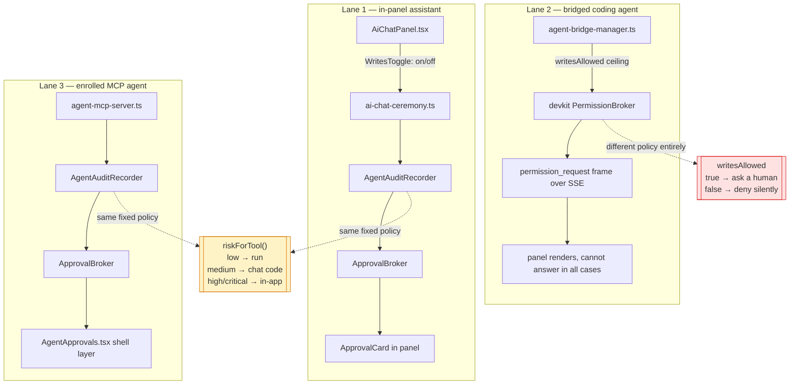
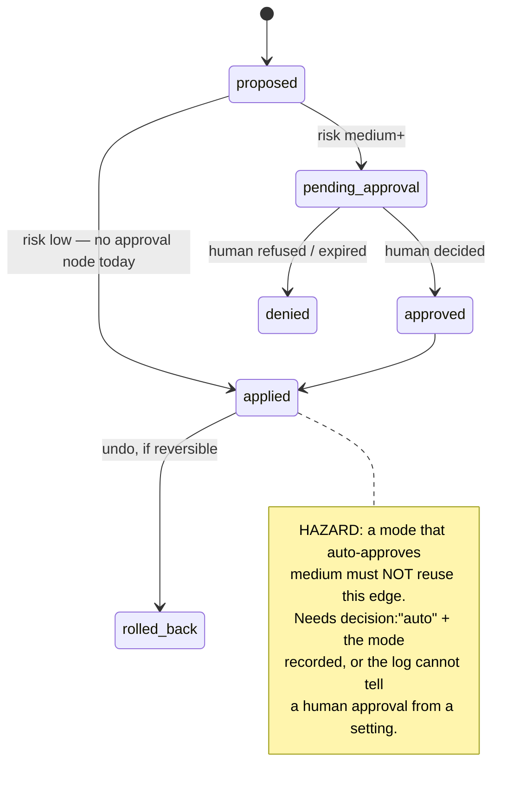
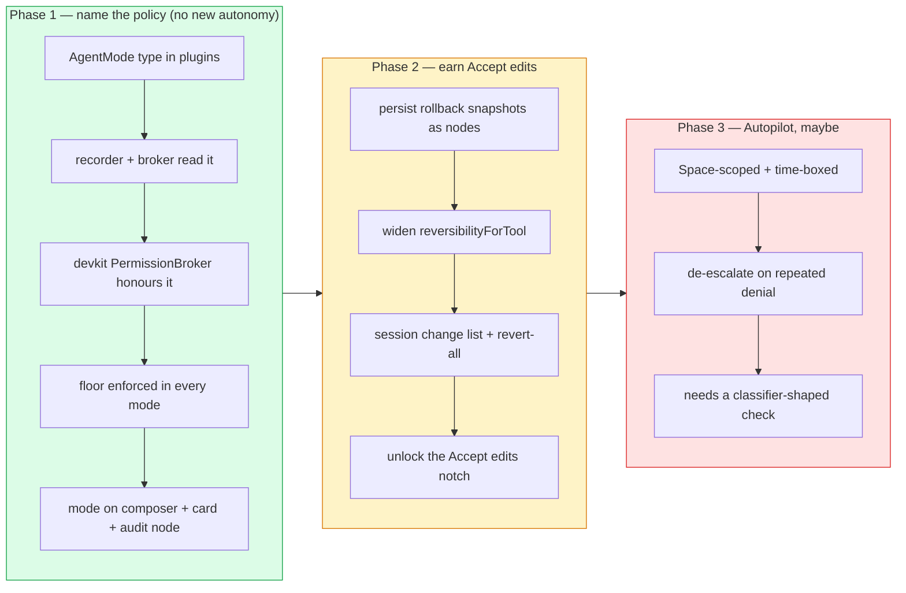

# Agent Autonomy Modes — One Dial Across Three Consent Lanes

> [!TIP]
> **TL;DR** — Ship the mode selector, but understand what it actually is: **a mode
> dial is an undo feature wearing a dropdown**. Claude Code can offer "Accept
> edits" because `git diff` and `git checkout` make an unreviewed edit free to
> reverse. xNet's equivalent — `rollbackHandle` — covers exactly **one tool** and
> lives in a `Map` that dies with the process. Unify today's three unrelated
> consent lanes behind one `AgentMode` first (Phase 1, no new autonomy), make undo
> durable (Phase 2), and only then let the dial reach "Accept edits". Never ship
> `bypassPermissions`: its safety argument is "the blast radius is a checkout you
> can delete", and a workspace is not a checkout.

---

## Problem Statement

The prompt is concrete: the desktop AI agent should get a mode selector like Claude
Code's — Manual, Accept edits, Plan, Auto, Bypass permissions — so the operator can
choose between "always ask", "sometimes ask", and "just do it".

Underneath it sits a harder question. xNet does not have *an* agent. It has **three
separate consent lanes**, built at different times, each with its own idea of what
"allowed" means, and none of them user-settable beyond a single checkbox:

| Lane | Who drives | Control today | Shape |
| ---- | ---------- | ------------- | ----- |
| In-panel assistant | `AiChatPanel` | `WritesToggle` checkbox, default **off** | binary, then hard-coded risk tiers |
| Bridged coding agent | Claude Code / Codex over the devkit daemon | `writesAllowed`, derived from whether an MCP config path exists | binary, fixed at daemon launch |
| Enrolled MCP agent | OpenClaw, Hermes, anything over `agent-mcp-server` | **none** | policy is entirely `riskForTool` |

Adding a dropdown to the chat panel would give the operator a dial that controls
one third of the surface while looking like it controls all of it. That is not a
UI gap — it is a **mode error waiting to happen**, and mode errors are the thing
this whole class of interface is historically worst at.

So the real question is: *what is the smallest honest dial, what does each position
mean mechanically, and what must never be on it?*

---

## Executive Summary

> [!IMPORTANT]
> Three findings drive the recommendation, and the second one is load-bearing.
>
> 1. **The policy already exists; it is just not named or reachable.** Today's
>    `low → auto / medium → chat code / high+ → in-app` mapping in
>    `agent-audit.ts` *is* a mode. It has no name, no UI, and no way to change it.
>    Phase 1 is a rename and a unification, not new capability.
> 2. **"Accept edits" is a promise about undo, and xNet cannot currently keep it.**
>    Only `xnet_apply_page_markdown` is `reversible`; its snapshots live in an
>    in-process `Map` on the service instance. Restart the app and the undo is
>    gone — the recorder's own error message admits it.
> 3. **An auto-approved action must not be indistinguishable from a low-risk one
>    in the audit log.** Today a `low` call writes an `AgentAction` and no
>    `AgentApproval`. If a mode auto-approves a medium write and it lands the same
>    way, the log loses the one distinction the entire 0337 design exists to prove.

The recommendation is a **three-position dial plus a non-negotiable floor**,
delivered in three phases, with the floor shipping in Phase 1 alongside the dial.

---

## Current State In The Repository

### The three lanes, drawn



Two brokers, two policies, one operator. Lanes 1 and 3 share
`AgentAuditRecorder` + `ApprovalBroker` and therefore share a policy. Lane 2 is a
completely separate mechanism in `@xnetjs/devkit` that knows nothing about risk
tiers — it asks a yes/no question about a tool name, or denies without asking.

<details>
<summary>File-by-file survey of what exists</summary>

| File | Role | Status |
| ---- | ---- | ------ |
| [agent-audit.ts](../../packages/plugins/src/ai-surface/agent-audit.ts) | Risk tiering, nonce ceremony, `AgentAction`/`AgentApproval` nodes | ✅ Shipped (0337) |
| [approval-broker.ts](../../packages/plugins/src/ai-surface/approval-broker.ts) | Park/settle over any recorder, no React, no transport | ✅ Shipped (0414) |
| [ai-chat-ceremony.ts](../../packages/workbench/src/views/ai-chat-ceremony.ts) | Panel adapter: reads bypass, writes park | ✅ Shipped (0394 Ph2) |
| [ai-chat-write-tools.ts](../../packages/workbench/src/views/ai-chat-write-tools.ts) | The 4-tool write allow-list + fidelity gate | ✅ Shipped |
| [ApprovalCard.tsx](../../packages/workbench/src/views/ApprovalCard.tsx) | The one card both lanes render | ✅ Shipped (0414) |
| [AgentApprovals.tsx](../../packages/workbench/src/AgentApprovals.tsx) | Shell-level approvals for bridged agents | ✅ Shipped (0414) |
| [permission-broker.ts](../../packages/devkit/src/permission-broker.ts) | Bridge daemon's in-turn park, default-deny | ✅ Shipped (0416) |
| [mcp-guardrail.ts](../../packages/plugins/src/services/mcp-guardrail.ts) | Risk classification + confirm gate for generic CRUD | ✅ Shipped (0175) |
| [egress-budget.ts](../../packages/plugins/src/ai-surface/egress-budget.ts) | Cumulative per-session read budget | ✅ Shipped (0416) |
| Mode / autonomy setting | — | ❌ Does not exist |
| Durable rollback | `rollbackSnapshots` is an in-process `Map` | 🛑 In-memory only |

</details>

### The policy that is already a mode, just unnamed

[`agent-audit.ts:146`](../../packages/plugins/src/ai-surface/agent-audit.ts:146) is the
whole thing:

```ts
const surfaceForRisk = (risk: AiRiskLevel): AgentApprovalSurface =>
  risk === 'medium' ? 'chat' : 'app'
```

Combined with the `if (risk === 'low')` fast path above it, that is a fixed,
three-band policy hard-coded into a library. Nothing reads a setting. The panel's
`WritesToggle` does not change it — it only decides whether write tools are
*advertised to the model at all*
([ai-chat-write-tools.ts:55](../../packages/workbench/src/views/ai-chat-write-tools.ts:55)).

> [!NOTE]
> That distinction is already the right one and should survive: **advertising is
> not permission**. The comment in `ai-chat-write-tools.ts` says so explicitly.
> The mode dial adds a third, separate question — *given that the tool is
> advertised and permitted, who confirms each call?*

### The undo that "Accept edits" would depend on

Two facts, both verified in the source:

```ts
// agent-audit.ts:131-140 — only ONE tool is snapshot-reversible
const REVERSIBLE_TOOLS = new Set(['xnet_apply_page_markdown'])
const COMPENSATABLE_TOOLS = new Set(['xnet_apply_database_mutation'])
```

```ts
// service.ts:240 — the snapshots live and die with the process
private readonly rollbackSnapshots = new Map<string, AiPageMarkdownRollbackSnapshot>()
```

And the recorder is honest about the consequence
([agent-audit.ts:373](../../packages/plugins/src/ai-surface/agent-audit.ts:373)):

> "rollback snapshots live in-process; the serve process that applied it has gone
> away"

> [!WARNING]
> This is the single most important fact in the document. Claude Code's
> `acceptEdits` mode is safe because the docs can say *"review changes in your
> editor or via `git diff` after the fact"*. xNet has a signed change log and CRDT
> history, but there is no operator-facing "undo everything this agent did in this
> session", and the one working undo evaporates on restart. **A mode that
> auto-applies edits, on top of an undo that only sometimes exists, is a promise
> the software cannot keep.**

### The trifecta status of the panel today

Simon Willison's lethal trifecta is private data + untrusted content + external
communication. xNet's assistant has all three legs within reach:

```text
┌─────────────────┐   ┌──────────────────────┐   ┌──────────────────────┐
│  Private data   │   │  Untrusted content   │   │  External comms      │
│  the whole      │   │  xnet_create_        │   │  outward-facing      │
│  workspace via  │   │  external_context_   │   │  writes — the        │
│  search/query   │   │  resource (medium,   │   │  guardrail's         │
│  (metered)      │   │  network.fetch)      │   │  "sending" class     │
└─────────────────┘   └──────────────────────┘   └──────────────────────┘
```

Both counterweights already exist and are good: the `EgressMeter` makes bulk reads
cumulative-budgeted rather than per-call innocuous, and `AiContextPackResource`
carries a `trust.level` of `workspace | external-untrusted` with an
`instructionBoundary`. But note what falls out: **`network.fetch` is classified
`medium`**, so any mode that auto-approves "medium" auto-approves pulling untrusted
text into the context that the same mode lets the agent act on unsupervised. Those
two must not sit on the same notch of the dial.

---

## External Research

### What everyone else shipped

| Product | Positions | The interesting bit |
| ------- | --------- | ------------------- |
| **Claude Code** | `default` (Manual), `acceptEdits`, `plan`, `auto`, `dontAsk`, `bypassPermissions` | Mode sets a *baseline*; deny/ask rules and **protected paths** apply in every mode, including bypass |
| **Codex CLI** | `suggest`, `auto-edit`, `full-auto` | Two orthogonal axes: approval mode = "when to ask a human", sandbox = "how far it may touch" |
| **Cursor** | Agent / Ask / Plan / Debug, plus Auto-run (ex-"YOLO") | 3.6's Auto-review: allowlist → sandbox → classifier subagent → ask |

> [!IMPORTANT]
> All three converge on the same escalation ladder, and it is **not** a single
> dial:
>
> ```text
> pre-approved rule  →  sandbox/reversible  →  classifier  →  ask the human
> ```
>
> The mode selects *where on that ladder the default sits*. It never removes the
> rungs. Claude Code is explicit: deny rules and explicit `ask` rules apply in
> every mode, and `rm -rf ~` still prompts even under `bypassPermissions` as a
> "circuit breaker against model error".

### Details worth stealing outright

From the Claude Code permission-modes documentation, four design decisions are
directly transplantable:

1. **Protected paths.** A named set of targets that is *never* auto-approved
   regardless of mode (`.git`, `.claude`, shell rc files, …). The mode dial cannot
   reach them. xNet's analogue is obvious and is discussed below.
2. **The mode is not settable by the agent.** *"The mode is set through these
   controls, not by asking Claude in chat."* An agent that can widen its own mode
   does not have a mode.
3. **Per-folder memory, with plan as the exception.** A mode picked in the UI is
   remembered per folder and beats the config default — except Plan, which applies
   to the current session only. Sticky autonomy is remembered; sticky *caution*
   is deliberately not.
4. **Auto mode falls back, loudly.** Three consecutive classifier blocks, or
   twenty total, and the mode pauses itself and resumes prompting. Autonomy that
   is going badly de-escalates on its own.

### The failure mode with 45 years of literature behind it

Norman's 1981 analysis of human error named the **mode error**: executing an
intention correctly for one mode while the system is in another. The aviation
human-factors literature calls the consequence **automation surprise**, and finds
two recurring causes — the operator loses track of a mode transition, and the
rules of interaction silently change with the mode.

The mitigation from that literature is not "label the mode". It is: make the
transitions visible at the moment of action, and support an accurate mental model
of what each mode does. Applied here, that means the mode belongs **on the
composer and on the approval card and in the audit record** — not tucked in
settings.

> [!CAUTION]
> January 2026 produced four production trifecta exploits in five days, and
> **Notion AI was one of them** — the closest analogue to xNet's shape that
> exists. The exploit class does not require a code vulnerability; poisoned
> content in the workspace is enough. Every notch of the dial that removes a human
> from the loop removes the one check that catches this class.

---

## Key Findings

### 1. The dial has to sit below all three lanes, or it is a lie

The mode must live in `@xnetjs/plugins` next to `AgentAuditRecorder`, be consumed
by `ApprovalBroker`, and be honoured by the devkit `PermissionBroker` too. A mode
that only reaches `AiChatPanel` produces exactly the automation surprise the
literature warns about: the operator sets "Manual", then a bridged Claude Code
session behaves however the daemon was launched.

### 2. `writesAllowed` and the risk tiers are the same question asked twice

The devkit broker's ceiling comment — *"the launch flag stays the ceiling…
approving in chat cannot grant a capability the daemon was not started with"* — is
the correct instinct, and it is the same instinct as `surfaceForRisk`. Unify them:
the mode is the ceiling; per-action approval narrows within it, never widens.

### 3. Auto-approval must be a *decision* in the audit log, not an absence

Today, a `low` call writes an `AgentAction` with `status: applied` and **no**
`AgentApproval` node. If a permissive mode auto-approves a medium write and it
lands identically, the audit log can no longer answer "was a human in the loop?"
— which is the whole point of ADR-29 and of the 0337 ceremony.



### 4. Risk in xNet is per-*tool*; the interesting risk is per-*target*

`riskForTool` reads a constant off the tool definition. Editing a scratch note and
editing the Charter are the same risk. Claude Code compensates with protected
paths and a target-aware classifier. xNet has neither, which caps how far the dial
can responsibly go — and points at what "protected paths" should mean here.

### 5. The Charter already contains the sequencing rule

Exploration [0426](0426_%5B-%5D_SHOULD_THE_USER_BE_IN_CHARGE_SURRENDER_AS_A_DESIGN_CONSTRAINT.md)
Rule 3: *"The autonomy a feature may take is bounded by how cheaply the user can
revoke it and leave with their data. Any feature that increases what the software
decides must point at the mechanism that makes leaving cheap."*

This exploration is precisely such a feature. Its mechanism is **undo**, and
Finding 2 in the Executive Summary says undo is not there yet. Rule 3 is not an
obstacle to route around; it is the delivery plan.

> [!NOTE]
> 0426 also **considered and rejected** a "surrender mode" toggle — but for a
> reason that does not apply here. That toggle would have made a *Charter promise*
> (§3, no loss-aversion machinery) conditional on a setting. This dial makes no
> Charter promise conditional: the floor below it is unconditional in every mode,
> which is exactly what makes it a different object.

---

## Options And Tradeoffs

| Option | Positions | Verdict |
| ------ | --------- | ------- |
| **A** — Port Claude Code's five modes verbatim | Manual / Accept edits / Plan / Auto / Bypass | 🛑 Rejected — two positions have no xNet mechanism, one is unshippable |
| **B** — Three modes matched to enforceable behaviour | Ask / Accept edits / Autopilot | ✅ Adopt as the dial |
| **C** — No modes; per-tool "always allow" rules on the card | — | 🚧 Adopt as a *layer*, not instead of B |
| **D** — Mode dial × unconditional floor (two axes) | B + protected targets | ✅ **Recommended** — B plus the floor from D |

### Option A — port the five modes verbatim

**For:** instant familiarity; the operator already knows the vocabulary; matches
what was asked for; keyboard cycling is a known good interaction.

**Against:** "Plan" in Claude Code means *blocked from editing, produces a plan
artifact, and the approval of that plan switches the mode*. xNet has
`xnet_plan_page_patch` and `AiMutationPlan` but no plan-approval flow that gates a
mode transition — so "Plan" would just be "Manual with extra words".
"Auto" means *a separate classifier model reviews each action against a large,
maintained rule corpus* — xNet has no classifier and building one is a project, not
a checkbox. Shipping five positions where two are decorative teaches the operator
the dial is decorative, which is worse than three honest ones.

**Bypass permissions** deserves its own paragraph. Its stated justification is
containment: *"Only use this mode in isolated environments like containers, VMs, or
dev containers… where Claude Code cannot damage your host system."* The blast
radius is a checkout you can re-clone. xNet's blast radius is the user's
workspace — their notes, their contacts, their money-adjacent records — replicated
to every device they own by design. There is no container story. And note that even
Claude Code keeps a circuit breaker inside bypass mode.

### Option B — three modes matched to what can actually be enforced

```text
┌──────────────┬───────────────────────────────────────────────────────┐
│ Ask          │ today's behaviour, named. Reads run. Every write       │
│ (default)    │ pauses: medium → in-chat code, high+ → in-app.         │
├──────────────┼───────────────────────────────────────────────────────┤
│ Accept edits │ reversible writes to targets you already opened run    │
│              │ without asking, and appear in a session change list.   │
│              │ Everything on the floor still pauses.                  │
├──────────────┼───────────────────────────────────────────────────────┤
│ Autopilot    │ scoped to one Space, time-boxed, floor intact,         │
│ (Phase 3)    │ de-escalates on repeated denials.                      │
└──────────────┴───────────────────────────────────────────────────────┘
```

Three positions, each with a mechanism that exists or is scheduled. "Plan" is not a
mode here — it is the *writes-off* state that `WritesToggle` already expresses, and
it is better modelled as "the write tools are not advertised" than as a fourth
notch. (If a plan-approval flow ever lands, promoting it to a notch is additive.)

### Option C — modeless, per-tool allow rules

Add **"Always allow this"** to `ApprovalCard`. No modes at all; the system learns
the operator's actual boundaries one decision at a time. This is Norman-optimal —
no mode means no mode error — and it maps onto Claude Code's `permissions.allow`
layer, which is the part that applies *in every mode*.

**Against on its own:** it does not answer the request. "Let it work for twenty
minutes while I get coffee" cannot be expressed as a set of per-tool grants made in
advance, because the operator does not know which tools the agent will need. It is
a genuinely good *complement* and a poor *replacement*.

### Option D — the floor (recommended alongside B)

A named set of actions that **no mode auto-approves**, ever. xNet's protected
paths, in decreasing obviousness:

| Floor category | Why | Where the check already half-exists |
| -------------- | --- | ---------------------------------- |
| **Irreversible tools** | `reversibilityForTool()` already returns `irreversible` for deletes | `agent-audit.ts:135` |
| **Outward-facing writes** | Sending a message is the "external communication" leg of the trifecta | `mcp-guardrail.ts` classes these `high` |
| **Schema changes** | `database.write.schema` reshapes every row, not one | `AiScope` already distinguishes it |
| **`network.fetch`** | Pulls untrusted content into the context the mode lets the agent act on | `xnet_create_external_context_resource` |
| **Cross-Space writes** | Blast radius beyond what the operator was looking at | Space is the replication unit (0258) |
| **Identity / hub role changes** | Changes who can do what, not what is done | `packages/hub` roles (0383) |

> [!IMPORTANT]
> The floor is what makes the dial safe to ship at all, and it is why this is not
> the toggle 0426 rejected. The dial moves the default; the floor does not move.
> Ship them in the same change, or the dial ships without its counterweight.

### Charter check

This proposes no new revenue lane, so the three "No ground rent" tests from
[`docs/CHARTER.md`](../CHARTER.md) §6 do not apply. Rule 3 from 0426 does, and is
answered by the phasing: Phase 2 (durable undo) is the mechanism that makes the
autonomy granted in Phase 2's dial position cheap to revoke.

---

## Recommendation

> [!TIP]
> **Adopt Option B + D, in three phases, and let the phase boundary be defined by
> undo rather than by UI work.**



**Phase 1 ships the dial with two reachable positions** (`ask`, and writes-off) and
the `acceptEdits` notch present but disabled with an honest reason — the same
pattern the panel already uses for tiers whose fidelity is insufficient. That is
not a placebo: it makes the dial's existence and its limit legible at once, and it
is the difference between "not built yet" and "we decided not to".

Five rules, in order of how load-bearing they are:

1. **One `AgentMode`, defined in `@xnetjs/plugins`, honoured by all three lanes.**
   Anything else is an automation surprise generator.
2. **The floor is unconditional.** No mode auto-approves anything in the Option D
   table. Mirrors Claude Code's protected paths.
3. **The agent cannot set its own mode.** `xnet_set_mode` must never exist as an
   `AiExtraTool`. Setting it is a host-surface action, stamped with the operator's
   DID, exactly like `approveFromApp`.
4. **Auto-approval is a recorded decision.** `AgentApproval.decision` gains `auto`,
   and both `AgentAction` and `AgentApproval` record the `mode` in force. A mode
   change is itself an audit event.
5. **Autonomy is sticky; caution is not.** Remember `acceptEdits` per Space. Never
   silently *raise* the mode across sessions — a raise is always a fresh gesture.

### What is explicitly rejected

> [!CAUTION]
> **`bypassPermissions` is not on the roadmap and should be written into an ADR as
> a refusal, not left as an unbuilt backlog item.** It has no containment story on
> a replicated personal workspace, and an unbuilt item drifts into a built one.
> This is the ADR the `door: one-way` frontmatter refers to, alongside the
> `AgentMode` enum itself.

---

## Example Code

<details>
<summary>The mode type, the floor, and the resolver (illustrative)</summary>

```ts
// packages/plugins/src/ai-surface/agent-mode.ts

/**
 * How much the operator has delegated. One value, honoured by every consent
 * lane — the panel ceremony, the MCP recorder, and the devkit bridge broker.
 *
 * Deliberately three positions, not five: `plan` in other harnesses means a
 * plan artifact whose approval switches the mode, and `bypass` means "the
 * blast radius is a container". xNet has neither, and a notch with no
 * mechanism teaches the operator the dial is decorative.
 */
export type AgentMode = 'ask' | 'acceptEdits' | 'autopilot'

/**
 * Actions no mode auto-approves. The dial moves the default; this does not
 * move. Mirrors the protected-path rule every comparable harness converged on.
 */
export type FloorReason =
  | 'irreversible'
  | 'outward-facing'
  | 'schema-change'
  | 'network-fetch'
  | 'cross-space'
  | 'identity-change'

export type ModeVerdict =
  | { decision: 'run' }
  | { decision: 'ask'; surface: 'chat' | 'app'; floor?: FloorReason }

/**
 * The single policy function. `surfaceForRisk` in agent-audit.ts becomes a
 * caller of this rather than the policy itself.
 *
 * Order matters and is not negotiable: the floor is consulted before the mode,
 * so a permissive mode can never reach past it.
 */
export function resolveMode(input: {
  mode: AgentMode
  risk: AiRiskLevel
  reversibility: AgentReversibility
  floor: FloorReason | null
}): ModeVerdict {
  if (input.floor) return { decision: 'ask', surface: 'app', floor: input.floor }
  if (input.risk === 'low') return { decision: 'run' }

  switch (input.mode) {
    case 'ask':
      return { decision: 'ask', surface: input.risk === 'medium' ? 'chat' : 'app' }
    case 'acceptEdits':
      // The notch exists only for writes we can actually take back. A
      // `compensatable` write auto-applied is a write with no undo button,
      // which is the promise `acceptEdits` implicitly makes and must keep.
      return input.reversibility === 'reversible'
        ? { decision: 'run' }
        : { decision: 'ask', surface: input.risk === 'medium' ? 'chat' : 'app' }
    case 'autopilot':
      return input.risk === 'critical'
        ? { decision: 'ask', surface: 'app' }
        : { decision: 'run' }
  }
}
```

</details>

<details>
<summary>Where the composer control goes, and what it must say</summary>

The current `WritesToggle` is a checkbox line below the chat body
([AiChatPanel.tsx:1244](../../packages/workbench/src/views/AiChatPanel.tsx:1244)). The
mode belongs where Claude Code, Cursor and the desktop app all put it — adjacent
to the send button, always visible, showing the *active* mode as its label rather
than a generic "Mode" affordance:

```text
 ┌──────────────────────────────────────────────────────┐
 │  Ask xNet anything…                                  │
 │                                                      │
 ├──────────────────────────────────────────────────────┤
 │  [ Ask before each edit ▾ ]              ⏎ Send      │
 └──────────────────────────────────────────────────────┘
                   │
                   ├── Ask before each edit          ✓
                   ├── Accept edits          (needs undo)
                   └── Autopilot in this Space   (Phase 3)
```

Two non-obvious requirements fall out of the mode-error literature:

- `ApprovalCard` must name the mode. An operator in `acceptEdits` who *still* gets
  a card needs to know instantly whether that is the floor firing or the mode
  having silently reverted.
- The mode indicator must reflect the **bridged** agent's mode too, not only the
  panel's — `AgentApprovals.tsx` is the shell-level surface and already exists for
  exactly this reason.

</details>

---

## Risks And Open Questions

| # | Risk | Severity | Mitigation |
| - | ---- | -------- | ---------- |
| 1 | `acceptEdits` ships before durable undo | 🔴 High | Phase gate — the notch is disabled until Phase 2 lands, with the reason shown |
| 2 | Mode reaches one lane only → automation surprise | 🔴 High | Define `AgentMode` in `@xnetjs/plugins`, not in the workbench; Phase 1 acceptance criterion is all three lanes |
| 3 | Auto-approved actions become invisible in the audit log | 🔴 High | `decision: 'auto'` + `mode` on both node types, before any auto-approving notch is reachable |
| 4 | Per-tool risk is too coarse for a real `acceptEdits` | 🟡 Medium | The floor covers the categorical cases; per-target risk is future work, and its absence is why Autopilot is Phase 3 |
| 5 | Prompt injection under a permissive mode (the Notion AI class) | 🟡 Medium | `network.fetch` on the floor; `EgressMeter` already caps bulk reads; `trust.level` already marks external resources |
| 6 | `AgentApproval` schema change ripples through replicated data | 🟡 Medium | Additive fields only; `mode` absent reads as "pre-mode era", which is honest |
| 7 | The dial makes the panel's existing writes-toggle redundant/confusing | 🟢 Low | Fold it in: writes-off becomes the tool-advertising state the mode reads, not a second control |

### Open questions

- **Is the mode per Space, per session, or per agent?** Claude Code's answer is
  per-folder with plan as a session-only exception. The Space is xNet's closest
  analogue (0258), which argues per-Space with a session override — but a bridged
  coding agent's "folder" is a repo, not a Space, so lane 2 may need its own
  binding. Unresolved.
- **Does `autopilot` need a classifier to be honest, or is Space-scoping plus the
  floor plus de-escalation enough?** Every comparable product concluded it needs a
  classifier. That is the strongest argument for keeping Phase 3 in the "maybe"
  column rather than the plan.
- **Should the operator's mode be visible to the model?** Telling the model it is
  in `acceptEdits` may change its behaviour for the worse. Withholding it produces
  worse explanations to the operator. Leaning toward withholding.
- **Does the devkit `PermissionBroker` become a consumer of `resolveMode`, or does
  it keep its own ceiling and merely read the mode?** The latter is a smaller
  change and preserves the launch-flag ceiling; the former is the real unification.

---

## Implementation Checklist

**Status:** ░░░░░░░░░░ 0/22 items

### Phase 1 — name the policy, ship the floor (no new autonomy)

- [ ] Add `packages/plugins/src/ai-surface/agent-mode.ts` with `AgentMode`,
      `FloorReason`, `ModeVerdict`, `resolveMode`
- [ ] Add `floorReasonFor(tool, args)` — irreversible / outward-facing /
      schema-change / network-fetch / cross-space / identity-change
- [ ] Re-express `surfaceForRisk` in `agent-audit.ts` as a caller of `resolveMode`
      (behaviour identical at `mode: 'ask'` — assert this with a test)
- [ ] Thread `mode` through `AgentAuditRecorderConfig` and `AgentAuditContext`
- [ ] Export from the `ai-surface` sub-barrel, one grouped line in the root barrel
      (per `packages/AGENTS.md`)
- [ ] Add `mode` to `AgentAction` and `AgentApproval` schema properties; add
      `'auto'` to the approval `decision` union (additive only)
- [ ] Record a `mode-changed` audit event when the operator moves the dial
- [ ] Make `@xnetjs/devkit`'s `PermissionBroker` read the mode, keeping the launch
      flag as the ceiling
- [ ] Replace `WritesToggle` with a `ModeSelector` on the composer row of
      `AiChatPanel.tsx`; persist under `xnet:ai-agent-mode`
- [ ] Show the active mode on `ApprovalCard`, and name the floor reason when the
      floor is why the card appeared
- [ ] Surface the mode in `AgentApprovals.tsx` so a bridged agent's mode is visible
      in the shell
- [ ] Render the `acceptEdits` notch disabled, with the honest reason
- [ ] Changeset for `@xnetjs/plugins` + `@xnetjs/devkit` (minor; check the diff for
      a removed export before settling on minor)
- [ ] Changelog fragment: "Choose how much the assistant does on its own"

### Phase 2 — earn `acceptEdits`

- [ ] Persist rollback snapshots as nodes instead of the in-process
      `rollbackSnapshots` Map ([service.ts:240](../../packages/plugins/src/ai-surface/service.ts:240))
- [ ] Widen `REVERSIBLE_TOOLS` beyond `xnet_apply_page_markdown`, or state per tool
      why it cannot be reversible
- [ ] Add a session-scoped change list with "revert everything this agent did"
- [ ] Enable the `acceptEdits` notch, gated on the reversibility check in
      `resolveMode`
- [ ] Negative-control test: a `compensatable` write must still park in
      `acceptEdits`

### Phase 3 — Autopilot (decide, do not assume)

- [ ] Decide whether Autopilot ships at all, given the classifier question
- [ ] If yes: Space scoping, time box, and de-escalation after N consecutive
      denials
- [ ] ADR in `site/src/content/docs/docs/architecture/decisions.mdx` — the
      `AgentMode` enum, the unconditional floor, and the refusal of a bypass mode,
      each with a `Tripwire:`

---

## Validation Checklist

- [ ] `mode: 'ask'` produces byte-identical ceremony behaviour to today (test
      asserts the pre/post mapping for every risk level)
- [ ] Every floor category parks in **every** mode — one test per `FloorReason`,
      parameterised over all `AgentMode` values
- [ ] A negative control plants a tool that *should* hit the floor and fails the
      suite if it does not (per `AGENTS.md`: a gate needs proof it can go red)
- [ ] No `AiExtraTool` can read or set the mode — assert the tool registry contains
      no mode-mutating tool
- [ ] An auto-approved action writes an `AgentApproval` with `decision: 'auto'` and
      the mode in force; an operator-approved one is distinguishable from it in a
      query
- [ ] Setting the mode in the panel changes what a **bridged** Claude Code session
      is allowed to do without asking (drive the real desktop app per
      `.claude/skills/electron-prototype`)
- [ ] Restarting the app preserves the mode and, after Phase 2, preserves undo for
      an action applied before the restart
- [ ] `acceptEdits` remains unreachable until Phase 2 lands — asserted, not just
      visually disabled
- [ ] No mode makes `xnet_create_external_context_resource` run without a human
- [ ] `pnpm build && pnpm typecheck && pnpm test` green; `check:api-report` run
      after a build (stale `dist` gives a false failure)

---

## References

### In this repository

- [`agent-audit.ts`](../../packages/plugins/src/ai-surface/agent-audit.ts) — risk tiering, nonce ceremony, audit nodes (0337)
- [`approval-broker.ts`](../../packages/plugins/src/ai-surface/approval-broker.ts) — park/settle, transport-free (0414)
- [`ai-chat-ceremony.ts`](../../packages/workbench/src/views/ai-chat-ceremony.ts) — the panel adapter (0394 Phase 2)
- [`ai-chat-write-tools.ts`](../../packages/workbench/src/views/ai-chat-write-tools.ts) — advertising is not permission
- [`ApprovalCard.tsx`](../../packages/workbench/src/views/ApprovalCard.tsx) / [`AgentApprovals.tsx`](../../packages/workbench/src/AgentApprovals.tsx) — the two rendering surfaces
- [`permission-broker.ts`](../../packages/devkit/src/permission-broker.ts) — the bridge's default-deny ceiling (0416)
- [`mcp-guardrail.ts`](../../packages/plugins/src/services/mcp-guardrail.ts) — risk classification for generic CRUD (0175)
- [`egress-budget.ts`](../../packages/plugins/src/ai-surface/egress-budget.ts) — cumulative read budget (0416)
- Exploration [0426](0426_%5B-%5D_SHOULD_THE_USER_BE_IN_CHARGE_SURRENDER_AS_A_DESIGN_CONSTRAINT.md) — Rule 3, surrender scales with exit
- Exploration [0416](0416_%5B-%5D_AGENT_HARNESS_OR_AGENT_SUBSTRATE.md) — ADR-29, xNet is not a harness
- Exploration [0394](0394_%5B-%5D_AI_INTEGRATION_AND_QUALITY_TECHNIQUES.md) — the in-chat approval ceremony
- [`docs/CHARTER.md`](../CHARTER.md) §6 — the No-ground-rent tests

### External

- [Choose a permission mode — Claude Code docs](https://code.claude.com/docs/en/permission-modes)
- [Configure permissions — Claude Agent SDK](https://platform.claude.com/docs/en/agent-sdk/permissions)
- [How to configure approval and sandbox modes in OpenAI Codex CLI](https://inventivehq.com/knowledge-base/openai/how-to-configure-sandbox-modes)
- [Cursor 3.6 Auto-review: fewer prompts, safer agents](https://byteiota.com/cursor-36-auto-review-run-mode/)
- [The lethal trifecta for AI agents — Simon Willison](https://simonwillison.net/2025/Jun/16/the-lethal-trifecta/)
- [The lethal trifecta and how to defend against it — HiddenLayer](https://www.hiddenlayer.com/research/the-lethal-trifecta-and-how-to-defend-against-it)
- [A rigorous view of mode confusion — Springer](https://link.springer.com/chapter/10.1007/3-540-45732-1_4)
- [Mode confusion of human–machine interfaces for automated vehicles — JCDE](https://academic.oup.com/jcde/article/9/5/1995/6679564)
- [Design of user-interface without automation surprises for discrete event systems — ScienceDirect](https://www.sciencedirect.com/science/article/abs/pii/S0967066106000268)
