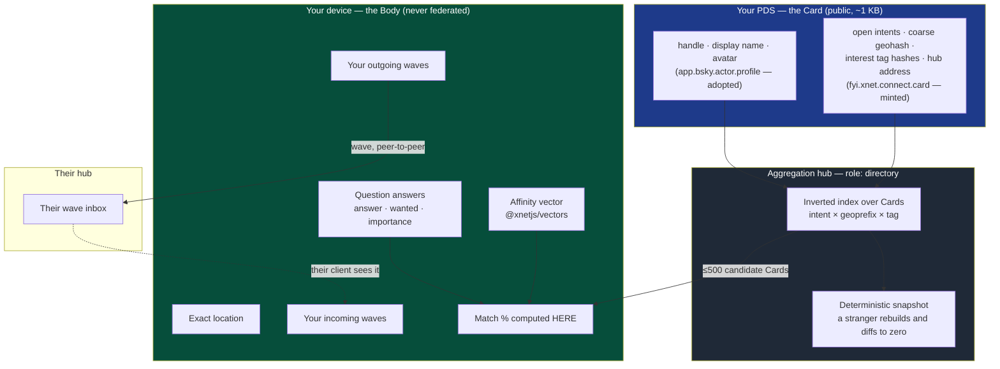
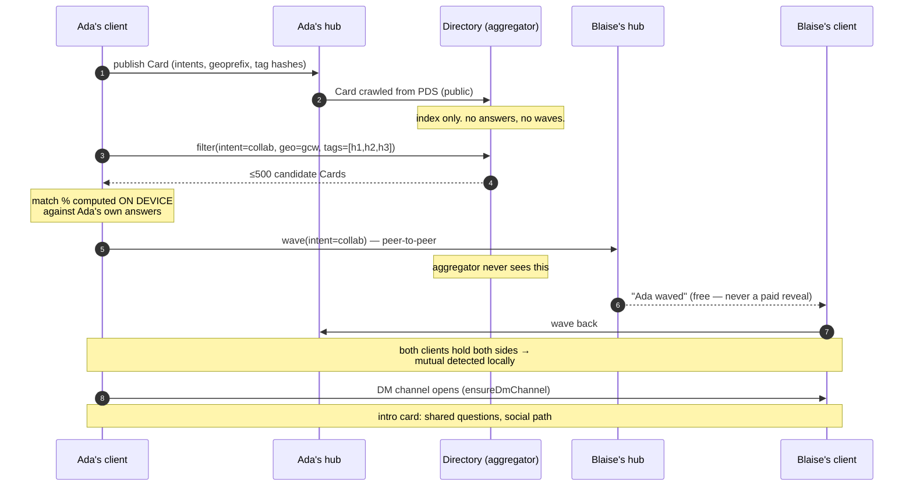
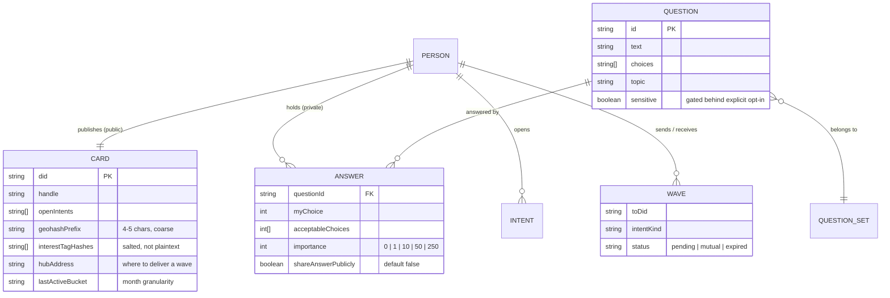
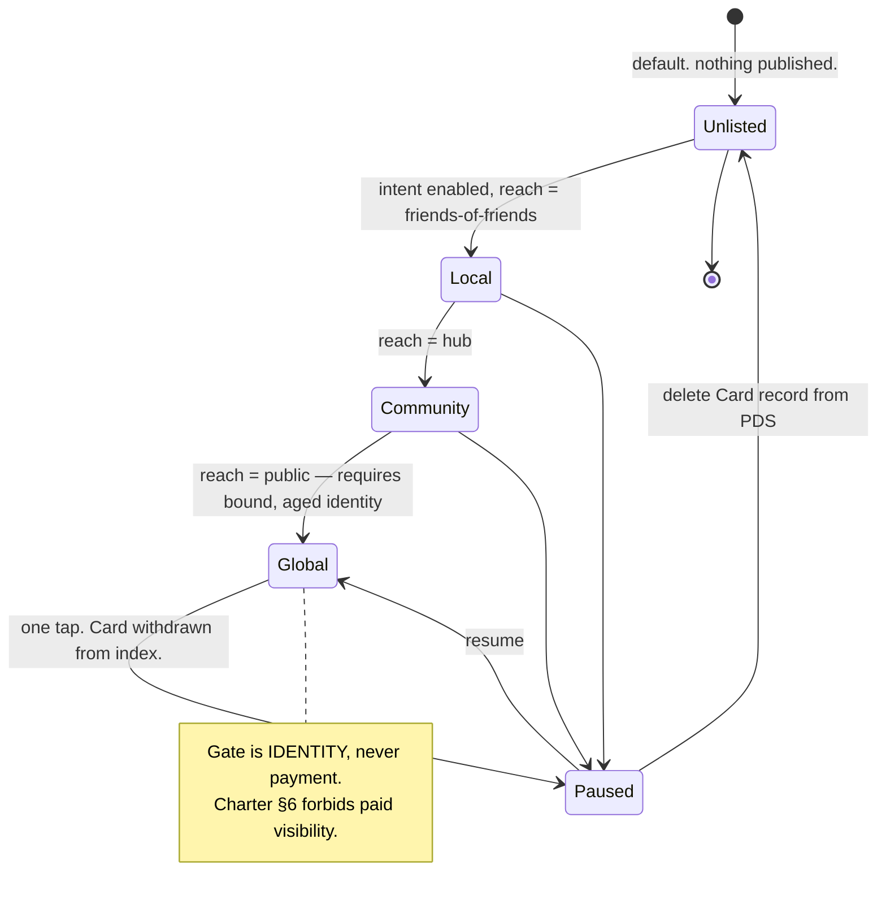

# Matching at cost — the people index, the question bank, and what the aggregation hub actually is

> [!TIP]
> **TL;DR** — The aggregation hub should hold **public cards and nothing else**.
> Split the profile into a **Card** (public, federated, one small record in the
> user's own AT Protocol repo) and a **Body** (question answers, orientation,
> exact location, waves — private, never federated, never on the aggregator).
> The aggregator is then just the shipped `index` role pointed at one more
> collection: derived-only, rebuildable by a stranger, replicable by anyone.
> Waves go **peer-to-peer to the recipient's own hub**, so no central server
> ever holds who is interested in whom. Match percentages are computed **on
> device** against answers you already hold, which is what keeps them legal
> under Charter §6. Servers are cheap — roughly **one €16/month box per 100k
> active people**. Moderation is not: at reasonable assumptions it runs **~250×
> the server cost per user**, and that, not infrastructure, is what decides
> whether "free for everyone" is real. Ship no new revenue lane; matching rides
> the flat hosting bill, and a person with no xNet plan at all can still take
> part by publishing a Card to a PDS they already own.

---

## Problem Statement

The ask has five parts, and they pull in different directions:

1. **An OkCupid-shaped product** — a large question bank, importance weighting,
   match percentages, and "see who liked you" — generalised past romance to
   friendship, collaboration, work, and mentorship in one app.
2. **At cost.** As much given away as possible; ideally folded into the free
   tier of xNet Cloud, so anyone already paying for hosting gets their people
   profile and full network access with no extra charge.
3. **Federated public profile data**, possibly over AT Protocol.
4. **An aggregation hub** that holds the index of people so they can be queried
   efficiently — the part the user correctly identifies as the crux.
5. All of it over **deeply personal data**, with moderation, in a product
   category that attracts predators and fraud at a rate no other category
   matches.

The tensions are not incidental. "Efficiently queryable index of people"
and "deeply personal data" are the same sentence. "Free for everyone" and
"moderated" are the same sentence. And "match percentage" runs directly at a
clause of xNet's own Charter that forbids scoring people.

This document answers the crux — **what is the aggregation hub** — and treats
the rest as constraints on that answer.

---

## Executive Summary

**One — the matchmaking engine is already built, and it is already OkCupid's
math.** `packages/social/src/connect/` is 1,808 lines of shipped, tested code:
derived affinity vectors, reciprocal scoring, graph proximity, MMR diversity,
private set intersection, coarsened geohashes, a `/discover` surface in the
nav. OkCupid's published algorithm is the geometric mean of two directional
satisfaction scores; `reciprocalScore()` in
[`matching.ts`](../../packages/social/src/connect/matching.ts) is the harmonic
mean of the same two quantities, chosen for the same reason (it punishes
asymmetry). What is missing is not the ranker. It is **candidate supply** — the
federated half of [exploration 0174](./0174_[_]_GENERALIZED_PEOPLE_MATCHING_AND_CONNECTION.md),
whose checklist stands at 23 checked and 11 unchecked, with every unchecked item
on the hub side.

**Two — the aggregation hub should hold no personal data at all.** The instinct
is to build a directory service that stores profiles and matches them
server-side. Don't. Split the profile the way
[exploration 0367](./0367_[_]_THE_XNET_INDEX_THE_PROJECTION_MODEL_THE_CARD_AND_THE_BODY.md)
already split index entries: a **Card** (handle, display name, open intents,
coarse geohash cell, a handful of interest-tag hashes — about 1 KB, public,
written to the user's own AT Protocol repo) and a **Body** (your answers to 300
questions, your orientation, your exact location, who you waved at — private,
on your own hub, never federated). The aggregator indexes Cards. That is the
whole job.

**Three — waves never touch the aggregator.** A wave is a message to a person,
and xNet already delivers messages to people's hubs. Send it to the recipient's
hub, resolved from their Card. Mutual-match detection is then a local set
intersection on the recipient's device — they hold both their outbox and their
inbox. No central server holds interest edges, so there is nothing to subpoena,
leak, or later sell. This also removes the need for the commitment-hash
rendezvous, which is fortunate, because **the shipped commitment cannot be
matched server-side anyway** — see the finding below.

**Four — the match percentage is defensible, but only under a rule we have to
write down.** Charter §6 forbids "scored intimacy," enforced by a CI gate on
identifiers like `relationshipScore` and `closenessScore`. That clause is about
grading a relationship you already have. A compatibility percentage between two
strangers, computed from answers both people deliberately gave for that purpose,
is a different object. The line worth committing to: **a number may be computed
about an answer set, never about a person, and never ranked globally.**
Symmetric, on-device, decomposable into the questions that produced it, shown
only for a specific named pair. No desirability score, no percentile, no
leaderboard, no ELO.

**Five — "see who liked you" is free, and that is the whole product argument.**
It is the single most valuable thing Match Group sells, and on xNet it cannot be
sold: `payToReveal` is already a CI failure. Better, it is free *structurally* —
the recipient sees the wave because it was addressed to them, not because a
reveal was unlocked. This is already how
[`discover.tsx`](../../apps/web/src/routes/discover.tsx) behaves today.

**Six — servers are trivially cheap and moderation is not.** At 100k monthly
active people the index fits on one Hetzner CX43 at €15.99/month. Extrapolating
Bluesky's published 2025 numbers with a 4× report-rate multiplier for the
category, moderation lands near **$0.60–0.72 per active person per year**
against a server cost near **$0.0025**. That is roughly 250:1. Infrastructure is
not the constraint on giving this away; **labour is**, and any plan that does
not say so is not a plan.

**Seven — the honest verdict on ATProto: yes for the Card, never for the Body,
and the private-data work does not change that.** Bluesky's permissioned-data
proposal states plainly that it "provides access control, not confidentiality.
It is not end-to-end encrypted," and it is explicitly a work in progress with no
timeline. Question answers about sex, politics, and mental health must not sit
on someone else's server in readable form on the strength of a proposal.

---

## Current State In The Repository

> [!IMPORTANT]
> The client-side matchmaker is real, tested and in the nav. Every missing piece
> is on the server side, and every missing piece is in 0174's unchecked column.
> This exploration is the plan for that column, not a restatement of it.

| Component | Status | Where |
| --- | --- | --- |
| `ConnectableProfile` / `ConnectionIntent` / `ConnectionWave` schemas | ✅ Shipped | [`connect/schemas.ts`](../../packages/social/src/connect/schemas.ts) |
| Seven intents from one primitive (`friends`…`romance`) | ✅ Shipped | [`connect/constants.ts`](../../packages/social/src/connect/constants.ts) |
| Reciprocal scoring, Adamic-Adar, MMR rerank, exploration bonus | ✅ Shipped | [`connect/matching.ts`](../../packages/social/src/connect/matching.ts) |
| Matchmaker orchestration + "why you matched" evidence | ✅ Shipped | [`connect/matchmaker.ts`](../../packages/social/src/connect/matchmaker.ts) |
| Derived affinity (no written profile) | ✅ Shipped | [`connect/affinity.ts`](../../packages/social/src/connect/affinity.ts) |
| Shared-salt PSI for mutual interests / friends | ✅ Shipped | [`connect/psi.ts`](../../packages/social/src/connect/psi.ts) |
| Coarse geohash cells (5 chars ≈ 5 km) | ✅ Shipped | [`connect/geohash.ts`](../../packages/social/src/connect/geohash.ts) |
| `/discover` route, waves-received list, wave-back → DM | ✅ Shipped | [`discover.tsx`](../../apps/web/src/routes/discover.tsx) |
| Derived-only `index` hub role | ✅ Shipped | [`roles.ts`](../../packages/hub/src/roles.ts), [`atproto-index.ts`](../../packages/hub/src/features/atproto-index.ts) |
| Affinity appview + `no scoreboard` structural test | ✅ Shipped | [`features/affinity.ts`](../../packages/hub/src/features/affinity.ts), [`test/affinity.test.ts`](../../packages/hub/test/affinity.test.ts) |
| ATProto identity binding (handle ↔ DID) | ✅ Shipped | [`services/atproto-binding.ts`](../../packages/hub/src/services/atproto-binding.ts) |
| Public write budgets, image pre-screen, labelers | ✅ Shipped | [`packages/abuse/`](../../packages/abuse/) |
| **Question bank + weighted answers** | ❌ **Not built** | the OkCupid engine has no schema at all |
| **Hub directory / candidate supply beyond your own graph** | ❌ Not built | 0174 checklist, unchecked |
| **Wave delivery to a remote person** | ❌ Not built | 0174 checklist, unchecked |
| **Rate limits on proximity queries** (anti-triangulation) | ❌ Not built | 0174 checklist, unchecked |
| **Labeler / appeals wiring for connect surfaces** | ❌ Not built | 0174 checklist, unchecked |
| **Age assurance** | ❌ Not built | no code, and now a legal exposure |
| Free tier able to hold a profile | 🛑 **Does not exist** | `demo` = 10 MiB, pooled, disposable |

### Finding: the shipped wave commitment cannot be matched by a server

[`wave.ts`](../../packages/social/src/connect/wave.ts) computes:

```ts
hashHex([input.fromDid, input.toDid, input.intentKind, input.salt].join(' '), 'blake3')
```

The commitment is **order-dependent**. A waves at B produces
`H(A‖B‖intent‖salt)`; B waves at A produces `H(B‖A‖intent‖salt)`. These never
collide, so a hub holding both commitments cannot tell they are a mutual pair —
which is precisely what the file's own docstring says the design is for
("after a hub signals both commitments are present"). `isMutualPair()` works
only on plaintext, on a client that already holds both sides.

This is not a bug that hurts anything today, because nothing federates waves
yet. It matters because it is the seam a central rendezvous would be built on,
and it does not hold weight. Two ways out:

- **Fix it** — canonicalise the pair and derive the salt from a Diffie-Hellman
  agreement over the two DIDs' keys, so both sides independently compute the
  same tag without ever having spoken: `H(sort(A,B) ‖ intent ‖ ECDH(sk_self, pk_other))`.
- **Or delete the need for it**, which is what the recommendation below does by
  delivering waves peer-to-peer.

Prefer the second. Keep `waveCommitment` only if an offline-rendezvous fallback
is later built, and fix the ordering at that point.

### Finding: there is no free tier that can hold a profile

`demo` is the only free plan, and it is 10 MiB, `isolation: 'pooled'`, on a
disposable volume with periodic reset
([`plans.ts`](../../packages/entitlements/src/plans.ts)). Five photos at 2 MB
each overshoot it by 1,000×. The next rung, `personal`, is $50/year for 25 GiB.

So "bake it into the free tier" cannot mean what it sounds like today. It has a
good answer anyway, and the answer is better than raising `demo` — see
**The two free lanes** below.

---

## External Research

### OkCupid's actual algorithm, and its actual track record

For each question OkCupid stores three things: **your answer**, **the answer you
want from a match**, and **how much the question matters to you**, on a scale
that maps to numeric weights. It computes how satisfied each person would be
with the other, then combines the two directions with a **geometric mean** —
chosen so that a 50/50 pair beats a 0/100 pair, because "affection needs to be
mutual." It then reports the **conservative end of the confidence interval**, so
the displayed number rises as you both answer more questions.

Two things follow. First, xNet's `reciprocalScore()` already implements the same
idea with the harmonic mean, for the identical stated reason. Second, the
confidence-interval trick is worth copying outright: it is honest, it makes the
number improve through effort rather than payment, and it is quietly
anti-gaming.

The uncomfortable part: the evidence that the percentage *predicts* anything is
thin. A [JSTOR Daily review](https://daily.jstor.org/dont-fall-in-love-okcupid/)
of the research is titled, more or less, that it doesn't work. That is not a
reason to drop the feature — people plainly enjoy it, and it is a superb
conversation starter — but it is a reason to describe it accurately in the UI as
**agreement on things you both said matter**, not as compatibility. Saying so
out loud is cheap and is itself a differentiator.

### AT Protocol: what it can and cannot carry

Records written to a PDS are public the moment they exist — relays subscribe and
ingest immediately. The [Private Data Working
Group](https://atproto.wiki/en/working-groups/private-data) and
[proposal 0016, permissioned data](https://github.com/bluesky-social/proposals/tree/main/0016-permissioned-data)
are the ongoing answer, and the proposal is explicit about its limits: it is
"a proposal, not the final specification," it offers "access control, not
confidentiality," it is "not end-to-end encrypted" (deliberately, so servers can
still index and moderate), access control is per-space rather than per-record,
and no timeline is given.

For a Card — handle, avatar, "open to collaborators and friendship, roughly
around Leeds" — that is fine, and public is arguably correct. For the Body it is
disqualifying.

The repo already has the right instinct here: exploration 0372's **adopt >
extend > mint** rule, and the observation that `net.x.*` is unclaimable so xNet
mints under `fyi.xnet.*`. Applied here: **adopt** `app.bsky.actor.profile` for
name/avatar/description, and **mint** exactly one new lexicon,
`fyi.xnet.connect.card`, for the matching-specific fields nothing existing
carries.

### Prior art: there is essentially none

Searches across AT Protocol, Nostr and the wider fediverse surface no serious
decentralised people-matching project. There is scattered ActivityPub
experimentation and no shipped, moderated, federated matcher. This mirrors
exploration 0412's finding of a
cohort with zero direct competitors — encouraging for novelty, and a warning
that nobody has yet paid the moderation bill in public so there is no operating
precedent to copy.

### Trust and safety: the numbers that actually govern this

- **Bluesky, 2025**: grew from 25M to 41M users; reviewed **9.97 million user
  reports**, applied 16.49M labels, removed 2.45M pieces of content, with 24/7
  coverage. The 2024 report puts the trust and safety team at **~100
  moderators**, hired partly through an external contracting vendor. That is
  roughly **0.3 reports per user-year** on a microblogging product.
- **Romance fraud**: the FTC recorded **55,604 romance scam reports in the first
  nine months of 2025**, up 22% year over year, with **over $1.16 billion**
  reported lost and a Q3 median individual loss of $2,218. Notably, **close to
  60% of victims said it began on a social media platform**, most often
  Facebook — not on a dating app. That is directly relevant, because a Card
  published to a social protocol is a social-media surface.
- **Minor safety and age assurance**: Texas, Utah and Louisiana have enacted App
  Store Accountability Acts; the Texas law took effect **1 January 2026**, with
  California's equivalent effective January 2027. These apply to **all** apps
  available to residents, not only apps directed at minors, and require
  developers to honour age-category signals from app stores and obtain parental
  consent for under-18s.
- **CSAM tooling**: NCMEC will not hand raw hash databases to small platforms
  and Microsoft does not release PhotoDNA's algorithm broadly — but the
  **PhotoDNA Cloud Service is free to qualified organisations**, and the
  Canadian Centre for Child Protection's **Shield by Project Arachnid** is a
  no-cost API. US platforms that confirm CSAM must file a CyberTipline report.
  So the tooling is obtainable at zero licence cost; the duty and the staffing
  are the real weight.

---

## Key Findings

> [!WARNING]
> **The four constraints that actually shape the design.** Everything in the
> Recommendation is downstream of these, and each one kills at least one
> obvious approach.

1. **Anything the aggregator stores, the aggregator is responsible for** —
   legally, morally, and operationally. Storing orientation and question answers
   centrally creates a subpoena target and a breach that ends the project. The
   only safe index is one that could be published in full without harming
   anyone. That is a design constraint, not a nice-to-have, and it is
   satisfiable: a Card meets it.
2. **Moderation cost scales with active people, not with paying people.** Server
   cost is negligible either way. This is the only real threat to "free for
   everyone."
3. **The obvious fix for #2 — charging for global reach — is banned.** Gating
   who can see you behind a payment is `paidVisibility`, which the
   [`metered connection`](../../scripts/check-humane-patterns.mjs) CI rule fails
   the build on and Charter §6 refuses by name. The gate on global reach has to
   be **social or identity-based, never financial**.
4. **A percentage about a person is forbidden; a percentage about an answer set
   is not.** The distinction has to be written into the Charter and the CI gate,
   or it will be re-argued every six months and eventually lost.

---

## 🧭 Architecture

### The three planes

```text
┌──────────────────────────┐   public, ~1 KB      ┌──────────────────────────┐
│  YOUR PDS / YOUR HUB     │ ───── Card ────────▶ │  AGGREGATION HUB         │
│  fyi.xnet.connect.card   │                      │  role: directory         │
│  (adopts bsky profile)   │                      │  DERIVED-ONLY. Rebuilds  │
└──────────────────────────┘                      │  from public Cards.      │
                                                  │  Holds nothing else.     │
┌──────────────────────────┐                      └────────────┬─────────────┘
│  YOUR DEVICE / YOUR HUB  │                                   │
│  BODY: 300 answers,      │ ◀──── coarse candidate set ───────┘
│  orientation, exact loc, │        (≤500 Cards, filtered)
│  affinity vector, waves  │
│  NEVER LEAVES            │ ──── wave ────▶ THEIR HUB (peer-to-peer, not the aggregator)
└──────────────────────────┘
```



<details>
<summary>Why the aggregator must be derived-only, in the repo's own words</summary>

[`atproto-index.ts`](../../packages/hub/src/features/atproto-index.ts) already
enforces exactly the discipline this needs, and its docstring is the argument:

> **Derived-only.** The index holds no authoritative state: its entire dataset
> rebuilds from public inputs, so restart-from-source IS the disaster recovery.
> The role refuses to start on a data dir holding tenant state — derived and
> authoritative state never share a directory (`assertDerivedOnlyDataDir`).

That guard is the reason waves cannot live on the aggregator even if someone
later wants them to: a wave is authoritative state, and the role would refuse to
start. The architecture is enforced by a startup assertion rather than by
anyone's memory, which is the standard this repo holds elsewhere.

</details>

### What the aggregation hub actually does

Exactly three things, and deliberately not a fourth.

| # | Job | Cost shape | Notes |
| --- | --- | --- | --- |
| 1 | **Crawl** public Cards from PDSes via `com.atproto.sync.listReposByCollection` + `listRecords` | Bandwidth, bursty | The mechanism 0372 already measured; the index role already speaks it |
| 2 | **Filter** — return ≤500 Cards matching `intent × geohash prefix × ≥N tag hashes × recently active` | One indexed SQLite query | This is a *filter*, not a ranker |
| 3 | **Serve a deterministic snapshot** so anyone can rebuild the index | R2 object, zero egress | The BATNA and vanish tests passing structurally |
| — | 🛑 **Rank people.** Not its job, ever. | — | Ranking on device is what makes §6 tractable |

Job 3 is what stops this becoming the "global chokepoint tier" Charter §6
refuses. xNet runs one instance; the inputs are public; anyone can run another
with `xnet hub --role directory` and diff it against ours.

### The matching flow, end to end



### Data model



> [!NOTE]
> `ANSWER` never leaves the device unless `shareAnswerPublicly` is set per
> answer — the OkCupid behaviour where you could show some answers on your
> profile and keep others private. Default false, per answer, every time.
> `CARD.interestTagHashes` are salted with a network-wide salt so the index can
> intersect them without holding a plaintext interest list.

### Listing lifecycle



---

## Options And Tradeoffs

### Where the index lives

| Option | Verdict | Why |
| --- | --- | --- |
| **A. Extend the shipped `index` role with a Cards collection** | ✅ **Recommended** | Reuses derived-only discipline, deterministic snapshots, `assertDerivedOnlyDataDir`, and the crawl mechanism. Adding a collection is a one-line change — 0374 designed it that way on purpose |
| B. New standalone directory service with its own store | ⚠️ Possible, worse | Duplicates the crawl and snapshot machinery, and invites someone to put waves in it "just for now" |
| C. Revive the dormant shard ring (`registry` role) | 🛑 Rejected | Dormant by decision (0423); `test/shards-dormant.test.ts` fails if it acquires a config surface without that decision being remade. 0367/0381 documented why |
| D. No aggregator — friends-of-friends only | 🛑 Rejected | This is today's behaviour and it has the cold-start failure every pure-P2P system has (0174's survey of Scuttlebutt). A matcher that only shows you people you already know is not a matcher |

The one wrinkle in A: the `index` role sets `publicInteractions: { enabled: true }`
and refuses tenant state. That is fine for Cards, and it is exactly why a
`directory` preset should be a **sibling** of `index` (same engine, different
collection set) rather than a flag on it — per
[`roles.ts`](../../packages/hub/src/roles.ts)'s rule that a role is a preset,
never a runtime branch.

### Where waves live

| Option | Verdict | Why |
| --- | --- | --- |
| **A. Peer-to-peer to the recipient's hub** | ✅ **Recommended** | No central interest graph exists. Nothing to leak or subpoena. Reuses hub message delivery. Recipient's client does the mutual check locally |
| B. Central rendezvous with ECDH-derived commitments | ⚠️ Fallback only | Genuinely private (the server sees opaque tags) and works when the recipient's hub is unreachable. But it puts authoritative state on the aggregator, which the derived-only guard forbids — it would need its own plane. Requires fixing the ordering bug first |
| C. Central rendezvous with plaintext waves | 🛑 Rejected | Builds the exact database that makes this category dangerous |

### Where the match percentage is computed

| Option | Verdict | Why |
| --- | --- | --- |
| **A. On device, against candidates fetched from the index** | ✅ **Recommended** | Answers never leave. The score has no server-side existence, so it cannot be boosted, sold, or ranked globally. Compute is trivial — 500 candidates × 300 questions is microseconds |
| B. On the aggregator, over uploaded answers | 🛑 Rejected | Requires centralising the most sensitive data in the system to save compute that costs nothing |
| C. Homomorphic / MPC scoring between peers | ⚠️ Interesting, later | Would let two people compute agreement without either revealing answers. Real research value; enormous complexity for a problem A already solves, because A only needs *your* answers plus *their public* ones |

Option A has one honest limitation worth stating: it can only score against
answers the candidate chose to publish. Private answers can't be matched on
without one of B or C. The mitigation is the OkCupid confidence-interval
behaviour — the number is a conservative lower bound, and the UI says so.

### The revenue question — applying Charter §6's five tests

There is **no new revenue lane here**, which is the same conclusion
[exploration 0417](./0417_[x]_THE_MATCHMAKER_AND_THE_METER_DATING_WITHOUT_A_PROFIT_MOTIVE.md)
reached and the Charter already codifies as "no rent on introductions." The
tests below therefore apply to the decision to **fold matching into hosting**.

| Test | Verdict | Reasoning |
| --- | --- | --- |
| **Improvement** | ✅ Pass | The margin pays for crawl, index and snapshot compute we run. The Cards are the users' own records, free for anyone to read from their PDS |
| **BATNA** | ✅ Pass | `xnet hub --role directory` is MIT and derived-only. Self-hosting the whole directory is one flag, undegraded |
| **Vanish** | ✅ Pass | Every Card lives in the user's own repo; every answer on their own device; every wave in the two participants' hubs. If xNet disappeared, someone rebuilds the index from the relay by Tuesday |
| **Sleep** | ⚠️ **Weak** | A competitor open-sourcing the directory takes this lane to zero — identical to 0420's affinity appview. Which is exactly why it must **never** be priced as its own SKU. The durable labour is moderation and the question bank's curation, not the index |
| **Rust** | ⚠️ **Borrowed time — label it** | The refused lane (paid reveal, boosts, paid visibility) is what funds every incumbent's user acquisition. Surviving lane: flat hosting. But hosting revenue does not buy distribution, so **the refusal is affordable only if the free Card lane produces organic reach.** If it does not, this refusal is on borrowed time and must be marked so in `ECONOMICS.md` §4a rather than quietly dropped later |

> [!CAUTION]
> The Rust verdict is the one to take seriously. Match Group can outspend any
> honest matcher on acquisition precisely because it sells the things we refuse.
> The counter is not a marketing budget; it is that a Card costs nothing to
> publish and works from an account the person already has. If that does not
> generate reach, the correct response is to write "this refusal is on borrowed
> time" in the economics doc — **not** to reopen paid visibility.

---

## 💰 Cost: the part that decides "free"

### Servers

Reusing [exploration 0381](./0381_[_]_HOSTING_THE_INDEX_INFRASTRUCTURE_COST_STRUCTURE_AND_THE_SUBSIDY_MATH.md)'s
verified substrate prices (Hetzner CX43 8 vCPU/16 GB at **€15.99**, Cloudflare
R2 at **$0.015/GB-month with zero egress**):

| Scale | Index size | Query load | Server cost/mo | Cloud customers to cover it |
| --- | --- | --- | --- | --- |
| 10k listed / 3k MAU | ~10 MB | <5 qps | **~$5** (shares an existing box) | 2 personal |
| 100k listed / 30k MAU | ~100 MB | ~25 qps avg | **~$20** (one CX43) | 6 personal, or 0.25 community |
| 1M listed / 200k MAU | ~1 GB | ~170 qps avg | **~$250–600** (3 boxes + R2) | 8 community |
| 10M listed / 2M MAU | ~10 GB | ~1,700 qps | **~$2.5–6k** | 75 community |

A Card is about 1 KB, so even 10M people is 10 GB — an index that fits in RAM.
The workload is a filtered scan over an inverted index, not a firehose appview:
no timeline fanout, no post volume, no notification graph. This is genuinely
cheap, and it is why "at cost" is achievable on the infrastructure axis.

### Moderation — the number that actually matters

<details>
<summary>Derivation, with every assumption stated</summary>

**Base rate.** Bluesky reviewed 9.97M reports in 2025 across a user base that
grew 25M → 41M (mean ≈ 33M) ⇒ **≈ 0.30 reports per user-year** on microblogging.

**Category multiplier.** Dating and matching surfaces attract harassment,
unsolicited imagery, impersonation and fraud at a materially higher per-user
rate than microblogging. There is no public figure for this; **4×** is an
estimate, not a measurement. ⇒ **≈ 1.2 reports per active user-year.**

**Throughput.** Bluesky's ~100 moderators against 9.97M reports ⇒ **≈ 100k
reports per moderator-year** with tooling assistance.

**Cost.** Fully loaded contractor moderator: **$45–60k/year.**

$$
\text{cost per active user-year} = \frac{1.2}{100{,}000} \times \$45\text{–}60\text{k} \approx \$0.54\text{–}0.72
$$

**Against servers** at the 100k-listed row: $20/mo ÷ 30k MAU ⇒ **$0.008 per
active user-year**.

$$
\frac{\$0.60}{\$0.008} \approx \mathbf{75\times}
$$

At the 1M row the ratio narrows to roughly 20–40× as server cost grows
super-linearly with query volume; at small scale it exceeds 200×. Every number
above is an estimate built on one published data point and one assumed
multiplier. **Treat the ratio, not the absolute figure, as the finding.**

</details>

> [!IMPORTANT]
> **Moderation costs one to two orders of magnitude more than servers, per
> person, at every scale we would plausibly reach.** At 1M active people that is
> roughly **$600k/year in labour against ~$6k/year in servers**. Any statement
> that this can be "free for everyone" which does not name that number is
> marketing.

### The two free lanes

Given the above, "free" has to be defined precisely. Two lanes, both honest:

**Lane 1 — included in every paid plan, at zero marginal price.** Exactly what
was asked for. A `personal` customer's $3.80/month margin absorbs $0.05/month of
moderation and $0.002 of servers without noticing. This is not a discount; it is
that matching genuinely costs almost nothing incremental for someone whose hub
we already run. ✅ **Ship this.**

**Lane 2 — free participation with no xNet plan at all.** Publish a Card to a
PDS you already own (a Bluesky account works), keep the Body on your own device
in the local-first client, receive waves at any hub including a self-hosted one.
xNet's marginal cost for this person is: indexing 1 KB, serving some queries,
and **zero for photos**, because photo blobs are served from their own PDS and
never touch our storage.

> [!TIP]
> Lane 2 is the important one, and it is better than raising the `demo` quota.
> Raising `demo` puts other people's photos on our disk and our CSAM duty; Lane 2
> keeps the network open to non-customers while leaving the expensive, liable
> parts where they belong. It is also what makes the BATNA test pass in
> practice rather than on paper.

The residual exposure in Lane 2 is moderation labour for non-customers, which is
real and unbounded by revenue. The bound is the **stackable-labeler model**: xNet
operates one default labeler at a budget it chooses, and anyone — a community, a
region, a demographic — can run and publish another that users subscribe to.
That is the ATProto answer and, given the arithmetic above, the only one that
survives. `packages/abuse/` already has the labeler, community-notes, appeals
and trust-scoring scaffolding for it.

### What must not be the answer

Charging for global reach. It is the obvious fix, it would work, and it is
`paidVisibility` — banned by the
[`metered connection`](../../scripts/check-humane-patterns.mjs) rule and refused
by name in Charter §6. **The gate on global reach must be identity, not money:**
a bound, aged AT Protocol handle via the shipped
[`atproto-binding.ts`](../../packages/hub/src/services/atproto-binding.ts), plus
optional vouches from already-listed people. That gate is *also* the better
anti-Sybil defence, which is the actual thing global reach needs protecting
from.

---

## Recommendation

> [!IMPORTANT]
> **Build a `directory` hub role that indexes public Cards and nothing else.
> Keep every answer, every exact location, and every wave off it. Compute match
> percentages on device. Ship the question bank as the new work — it is the only
> genuinely missing engine. Fold the whole thing into hosting at zero marginal
> price, and open a free Card-only lane for people with no xNet plan.**

Concretely, in shipping order:

1. **The question bank** (`QuestionSchema`, `AnswerSchema` in
   `packages/social/src/connect/`). Answer + wanted answers + importance, with
   OkCupid's weight ladder and its conservative confidence bound. Per-answer
   publish toggle, default off. Sensitive topics behind explicit opt-in. This is
   the largest genuinely new piece and it is pure local data — no server, no
   protocol, no risk.
2. **`agreementPercent()`** in `matching.ts`, next to `reciprocalScore()`.
   Symmetric, decomposable (returns the contributing questions, not just a
   number), lower-bounded by answer count. Add the Charter line and extend the
   `scored intimacy` CI rule with the identifiers this must never grow
   (`desirabilityScore`, `attractivenessRank`, `matchPercentile`, `eloRating`).
3. **The Card lexicon** — adopt `app.bsky.actor.profile`, mint
   `fyi.xnet.connect.card` under `lexicons/fyi/xnet/connect/`. **One-way door:
   this earns an ADR** in
   `site/src/content/docs/docs/architecture/decisions.mdx`, with a tripwire.
4. **The `directory` role** — a sibling preset to `index` in
   [`roles.ts`](../../packages/hub/src/roles.ts) sharing the atproto index
   engine, with `fyi.xnet.connect.card` in its collection set and the filter
   endpoint (`intent × geoprefix × tag hashes × activity bucket`, hard cap 500
   results). Deterministic snapshot, derived-only guard, and a structural test
   in the shape of `no scoreboard` asserting the route surface stays this small.
5. **Peer wave delivery** — deliver to the hub address on the recipient's Card.
   Mutual detection on device. Leave `waveCommitment` in place, documented as
   unused-and-order-dependent, or fix it as part of an explicit offline-fallback
   decision.
6. **Rate limits on proximity queries** via `public-write-budget` — the
   anti-triangulation defence that
   [`geohash.ts`](../../packages/social/src/connect/geohash.ts) says is the
   caller's job and no caller currently does.
7. **Identity gate on global reach** — bound ATProto handle with a minimum
   account age, plus vouching. Never a payment.
8. **Age assurance before any `romance` intent reaches `public` reach.** This is
   a legal precondition in Texas today and California from January 2027, not a
   polish item.

Explicitly **not** recommended: a central profile store, server-side ranking,
paid reveals or boosts of any kind, a global "most compatible" or "most popular"
listing, xNet operating a PDS for people (rejected in 0420 for the same reason
it should be rejected here), and reviving the dormant shard ring.

---

## Example Code

### The agreement calculation, on device

```ts
/**
 * Symmetric agreement over a shared answer set (exploration 0438).
 *
 * NOT a score about a person. It is a statistic about two answer sets, computed
 * on device, decomposable into the questions that produced it, and meaningful
 * only for a specific named pair. Charter §6 permits this and forbids the other
 * thing: no percentile, no ranking, no global ordering, no number attached to
 * a person independent of who is asking.
 */
export const IMPORTANCE_WEIGHTS = {
  irrelevant: 0,
  'a little': 1,
  somewhat: 10,
  very: 50,
  mandatory: 250
} as const

export type Answer = {
  questionId: string
  myChoice: number
  acceptableChoices: readonly number[]
  importance: keyof typeof IMPORTANCE_WEIGHTS
}

/** How satisfied `viewer` would be with `other`, in [0, 1]. */
function satisfaction(viewer: readonly Answer[], other: readonly Answer[]): number {
  const theirs = new Map(other.map((a) => [a.questionId, a]))
  let earned = 0
  let possible = 0
  for (const mine of viewer) {
    const match = theirs.get(mine.questionId)
    if (!match) continue // unanswered by them — excluded, never penalised
    const weight = IMPORTANCE_WEIGHTS[mine.importance]
    possible += weight
    if (mine.acceptableChoices.includes(match.myChoice)) earned += weight
  }
  return possible === 0 ? 0 : earned / possible
}

export type Agreement = {
  /** Conservative lower bound, in [0, 1]. Rises as both answer more. */
  percent: number
  /** How many questions both people answered — the confidence basis. */
  shared: number
  /** The questions that drove it. A number you cannot open is a verdict. */
  drivers: { questionId: string; agreed: boolean; weight: number }[]
}

export function agreementPercent(a: readonly Answer[], b: readonly Answer[]): Agreement {
  const shared = new Set(a.map((x) => x.questionId)).intersection(
    new Set(b.map((x) => x.questionId))
  ).size
  if (shared === 0) return { percent: 0, shared: 0, drivers: [] }

  // Geometric mean: mutual satisfaction, so 50/50 beats 0/100 (OkCupid's
  // reason, and the same reason reciprocalScore uses the harmonic mean).
  const raw = Math.sqrt(satisfaction(a, b) * satisfaction(b, a))

  // Report the conservative end of the confidence interval, so the number
  // improves through effort rather than payment.
  const margin = 1 / Math.sqrt(shared)
  return {
    percent: Math.max(0, raw - margin),
    shared,
    drivers: buildDrivers(a, b)
  }
}
```

### The directory role preset

```ts
// packages/hub/src/roles.ts — a sibling of `index`, not a flag on it.
/**
 * The people directory (exploration 0438): indexes PUBLIC connect Cards and
 * serves a coarse candidate filter. Derived-only, like `index`: it holds no
 * answers, no waves, no exact locations, and no scores. If it ever needs
 * authoritative state, that is the signal the design has drifted.
 */
directory: {
  federation: { enabled: false },
  shards: { enabled: false },
  crawl: { enabled: false },
  publicInteractions: { enabled: true },
  atprotoIndex: { enabled: true, collections: [...DEFAULT_INDEX_COLLECTIONS, CONNECT_CARD_COLLECTION] }
}
```

### The Card lexicon

```jsonc
// lexicons/fyi/xnet/connect/card.json — the ONLY thing minted. Everything
// human-visible (name, avatar, description) is adopted from app.bsky.actor.profile.
{
  "lexicon": 1,
  "id": "fyi.xnet.connect.card",
  "defs": {
    "main": {
      "type": "record",
      "key": "literal:self",
      "record": {
        "type": "object",
        "required": ["openIntents"],
        "properties": {
          "openIntents": { "type": "array", "items": { "type": "string" }, "maxLength": 7 },
          "geohashPrefix": { "type": "string", "maxLength": 5 },
          "interestTagHashes": { "type": "array", "items": { "type": "string" }, "maxLength": 32 },
          "hubAddress": { "type": "string", "format": "uri" },
          "lastActiveMonth": { "type": "string" }
        }
      }
    }
  }
}
```

> [!WARNING]
> No orientation field. No age field. No gender field. No "looking for" field.
> Everything a stalker or a discriminating employer would want is in the Body,
> matched on device. If a future PR adds one of these to the Card, that PR is
> the failure mode of this entire design — which is why the validation checklist
> below asks for a structural test on the Card's field set, not a code review.

---

## Risks And Open Questions

| Risk | Severity | Mitigation |
| --- | --- | --- |
| **Moderation labour outruns any revenue** | 🔴 Existential | Stackable labelers (users subscribe to third-party moderation); xNet's default labeler runs at a chosen budget rather than an obligation. Accept that some content is only labelled by others |
| **Age assurance is a legal precondition, not a feature** | 🔴 High | Texas ASAA live since 1 Jan 2026; Utah, Louisiana, California (Jan 2027). Applies to all apps, not just minor-directed ones. Block `romance` at `public` reach until app-store age signals are honoured |
| **Hosting photos pulls us into CSAM duty** | 🔴 High | Lane 2 hotlinks blobs from the user's own PDS. For paid tenants who do upload: PhotoDNA Cloud Service (free to qualified orgs) or Project Arachnid Shield (no-cost API), plus the shipped on-device `image-prescreen` |
| **Romance fraud at scale** | 🟠 Medium-high | FTC: 55,604 reports and $1.16B in nine months of 2025. Identity gate on global reach + account age + vouching. Note the FTC's own finding that ~60% of these start on social media — a public Card *is* a social surface |
| **Geohash triangulation** | 🟠 Medium | `geohash.ts` says proximity queries "must be rate-limited by the caller" and no caller does. Wire `public-write-budget` before any public reach ships. Consider 4-char cells (≈20 km) for `romance` |
| **The Card becomes a profile** | 🟠 Medium | Every product instinct will push fields into the Card because it makes filtering better. Structural test on the field set, in the shape of `no scoreboard` |
| **Match % drifts into a person score** | 🟠 Medium | Extend the `scored intimacy` CI rule now, before the first PR that wants a leaderboard |
| **Sleep test is weak** | 🟡 Low but structural | Never price the directory as a SKU. Accept the lane is worth roughly zero on its own and is a reason people pay for hosting |

### Open questions

1. **Does the Card leak too much by existing?** A public record saying "open to
   romance, roughly here, active this month" is itself sensitive in some places
   and for some people. Should `romance` be excluded from public Cards entirely,
   reachable only at `friends-of-friends` and `hub` reach? **Leaning yes**, and
   it costs the product real reach — this is the sharpest unresolved trade.
2. **Who curates the question bank?** OkCupid's bank was user-submitted and
   moderated. A community-authored bank is more xNet-shaped and is also an
   unbounded moderation surface of its own.
3. **How do private answers get matched?** Option A can only match on published
   answers. Is the confidence-bound honesty enough, or does this eventually need
   the MPC path (Option C)?
4. **Does one app serving `romance` and `hiring` create a harassment vector?**
   0174 asserts per-intent isolation and `connect.test.ts` covers it, but
   isolation of *listings* is not isolation of *people* — the same human is
   behind both, and a rejected romance wave can return as a hiring wave.
5. **Is 4× the right report-rate multiplier?** The entire moderation
   number rests on it and it is a guess. One quarter of real data replaces this
   whole section.

---

## Implementation Checklist

**Status:** `░░░░░░░░░░ 0/26 items`

### Phase 1 — the question engine (local only, no protocol, no risk)

- [ ] Add `QuestionSchema` and `AnswerSchema` to `packages/social/src/connect/schemas.ts`
- [ ] Add `IMPORTANCE_WEIGHTS` ladder and `questionTopics` to `connect/constants.ts`
- [ ] Implement `agreementPercent()` in `connect/matching.ts` — geometric mean, conservative bound, decomposable drivers
- [ ] Seed a starter bank of ~200 questions across topics, with `sensitive` flags
- [ ] Question-answering UI: answer / acceptable answers / importance, plus a per-answer publish toggle defaulting to off
- [ ] Show the percentage only with its drivers — no bare number anywhere in the UI

### Phase 2 — the Charter line, before anything federates

- [ ] Add the "a number about an answer set, never about a person" clause to `docs/CHARTER.md` §6
- [ ] Extend the `scored intimacy` rule in `scripts/check-humane-patterns.mjs` with `desirabilityScore|attractivenessRank|matchPercentile|eloRating|hotnessScore`
- [ ] Add the negative control to `--selftest` so the new identifiers provably fail the gate
- [ ] Pin the claim in `packages/telemetry/test/charter-claims-ledger.test.ts`

### Phase 3 — the Card

- [ ] Write `lexicons/fyi/xnet/connect/card.json`; adopt `app.bsky.actor.profile` for human-visible fields
- [ ] **ADR** in `site/src/content/docs/docs/architecture/decisions.mdx` — minting a lexicon and opening a romance surface are both one-way doors. Include a `Tripwire:`
- [ ] Publish pipeline: local `ConnectableProfile` → Card record in the user's PDS, consent-gated, off by default
- [ ] Structural test asserting the Card's field set — a new field is a deliberate decision, not a review nit

### Phase 4 — the directory role

- [ ] Add the `directory` preset to `packages/hub/src/roles.ts` (sibling of `index`, shares the engine)
- [ ] Add `fyi.xnet.connect.card` to the directory's collection set in `atproto-index.ts`
- [ ] Implement the filter endpoint: `intent × geoprefix × tag hashes × activity bucket`, hard cap 500
- [ ] Deterministic snapshot test — two rebuilds from the same inputs are byte-identical
- [ ] Structural test in the shape of `no scoreboard`: the directory exposes exactly one filter route and no ranking route
- [ ] Verify `assertDerivedOnlyDataDir` refuses to start the role on a tenant data dir

### Phase 5 — waves and safety

- [ ] Deliver waves peer-to-peer to the `hubAddress` on the recipient's Card
- [ ] Mutual detection on device from the local outbox ∩ inbox
- [ ] Document `waveCommitment` as unused and order-dependent, or fix it under an explicit offline-fallback decision
- [ ] Wire `public-write-budget` to proximity queries and wave sends
- [ ] Identity gate on `public` reach: bound ATProto handle + minimum account age, via `atproto-binding.ts`
- [ ] Labeler subscription + appeals wiring on connect surfaces
- [ ] Block `romance` at `public` reach until app-store age signals are honoured

### Phase 6 — the economics, written down

- [ ] Record the Rust verdict for "no rent on introductions" in `docs/ECONOMICS.md` §4a, labelled **on borrowed time** until the free-Card lane demonstrably produces reach
- [ ] Document Lane 1 / Lane 2 in the pricing page — matching is included, never a SKU

---

## Validation Checklist

- [ ] An audit of the live directory index shows **zero** answers, exact locations, orientations, ages, or waves — only Card fields
- [ ] A stranger runs `xnet hub --role directory`, rebuilds from public inputs, and diffs to zero against ours
- [ ] Deleting your Card record from your PDS removes you from the index within one crawl cycle, with nothing left behind
- [ ] The match percentage is identical when computed on two devices from the same answer sets, and changes only when answers change
- [ ] Clicking any percentage shows the questions that produced it and their weights
- [ ] The percentage rises when either party answers more questions, with no other change — the confidence bound is real
- [ ] Two people with a mutual wave open a DM; a one-sided wave is visible to its recipient and to nobody else, and never appears on the aggregator's disk
- [ ] Seeing who waved at you requires no payment, no plan, and no upgrade prompt anywhere in the flow
- [ ] `pnpm check:humane-patterns --selftest` fails on planted `matchPercentile` and `payToReveal` identifiers
- [ ] A `romance` listing is invisible to a `hiring` query and vice versa, across the federated path as well as locally
- [ ] A scripted client issuing 10,000 proximity queries from moving coordinates is throttled before it can triangulate a 5-char cell down to a street
- [ ] A person with no xNet plan publishes a Card from a Bluesky account, appears in the index, receives a wave at a self-hosted hub, and completes an introduction — with zero bytes of theirs on xNet storage
- [ ] `pnpm test`, `pnpm typecheck`, `pnpm lint`, `pnpm build` and the `check:*` guards green

---

## References

### In this repository

- [0174 — Generalized people matching and connection](./0174_[_]_GENERALIZED_PEOPLE_MATCHING_AND_CONNECTION.md) — the primitive, and the 11 unchecked server-side items this doc plans
- [0417 — The matchmaker and the meter](./0417_[x]_THE_MATCHMAKER_AND_THE_METER_DATING_WITHOUT_A_PROFIT_MOTIVE.md) — why introductions are never sold
- [0367 — The Index: the projection model, the card and the body](./0367_[_]_THE_XNET_INDEX_THE_PROJECTION_MODEL_THE_CARD_AND_THE_BODY.md) — the split reused here
- [0374 — The Index: one executable plan](./0374_[_]_THE_XNET_INDEX_ONE_EXECUTABLE_PLAN_THE_PIPELINE_THE_SITE_AND_THE_SHIPPING_ORDER.md) · [0378 — The Index as a place](./0378_[_]_THE_INDEX_AS_A_PLACE_INTERACTION_WITHOUT_A_SCOREBOARD.md)
- [0381 — Hosting the Index: cost structure and subsidy math](./0381_[_]_HOSTING_THE_INDEX_INFRASTRUCTURE_COST_STRUCTURE_AND_THE_SUBSIDY_MATH.md) — the substrate prices reused above
- [0382 — Everything is a hub: roles, not services](./0382_[_]_EVERYTHING_IS_A_HUB_ROLES_NOT_SERVICES_AND_THE_HUB_OF_HUBS.md) · [0423 — The shard key is the person](./0423_[x]_MAKING_768_HUBS_LOOK_LIKE_ONE_THE_SHARD_KEY_IS_THE_PERSON.md)
- [0420 — Publishing the social graph to the ATmosphere](./0420_[-]_PUBLISHING_THE_SOCIAL_GRAPH_TO_THE_ATMOSPHERE.md) — the appview precedent and its five-test worked example
- [0422 — Relationship primitives](./0422_[x]_RELATIONSHIP_PRIMITIVES_UNBUNDLING_THE_SOCIAL_GRAPH.md) — the origin of "no scored intimacy"
- [`docs/CHARTER.md`](../CHARTER.md) §6 · [`scripts/check-humane-patterns.mjs`](../../scripts/check-humane-patterns.mjs) · [`packages/social/src/connect/`](../../packages/social/src/connect/)

### External

- [OkCupid's matching algorithm explained](https://www.hackerearth.com/practice/notes/okcupids-matching-algorithm-1/) · [OKCupid: the math behind online dating — AMS](https://blogs.ams.org/mathgradblog/2016/06/08/okcupid-math-online-dating/) · [OkCupid's own guide to match questions](https://okcupid-app.zendesk.com/hc/en-us/articles/22982200783771-How-Does-OkCupid-Work-Our-Complete-Guide-to-Match-Questions-the-Algorithm-and-Setting-Up-Your-Account)
- [OkCupid's matching algorithm doesn't work — JSTOR Daily](https://daily.jstor.org/dont-fall-in-love-okcupid/)
- [AT Protocol overview](https://atproto.com/guides/overview) · [AT Protocol specification](https://atproto.com/specs/atp)
- [Private Data Working Group — atproto wiki](https://atproto.wiki/en/working-groups/private-data) · [Proposal 0016: permissioned data](https://github.com/bluesky-social/proposals/tree/main/0016-permissioned-data)
- [Bluesky 2025 transparency report](https://bsky.social/about/blog/01-29-2026-transparency-report-2025) · [Bluesky 2024 moderation report](https://bsky.social/about/blog/01-17-2025-moderation-2024)
- [FTC: $1.16B lost to romance scams in 2025](https://www.centraloregondaily.com/news/consumer/ftc-romance-scams-1-billion-losses-2025/article_c32c7fc5-c3a9-4cdc-8f4b-c80293080267.html) · [FTC on social media scam losses](https://www.ftc.gov/news-events/news/press-releases/2026/04/new-ftc-data-show-people-have-lost-billions-social-media-scams)
- [State App Store Accountability Acts — Wiley](https://www.wiley.law/alert-State-App-Store-Accountability-Acts-Introduce-New-Obligations-for-App-Developers) · [New app developer compliance requirements for 2026 — Venable](https://www.venable.com/insights/publications/2025/12/new-app-developer-compliance-requirements)
- [CSAM filtering options compared — Prostasia Foundation](https://prostasia.org/blog/csam-filtering-options-compared/) · [Minimum child safety measures for online platforms — NCMEC](http://globalchildexploitationpolicy.org/content/gpp-ncmec/us/en/policy-advocacy/minimum-child-safety-measures-for-online-platforms.html)
- [Reciprocal recommendation for online dating — Xia et al. (arXiv:1501.06247)](https://arxiv.org/pdf/1501.06247)
