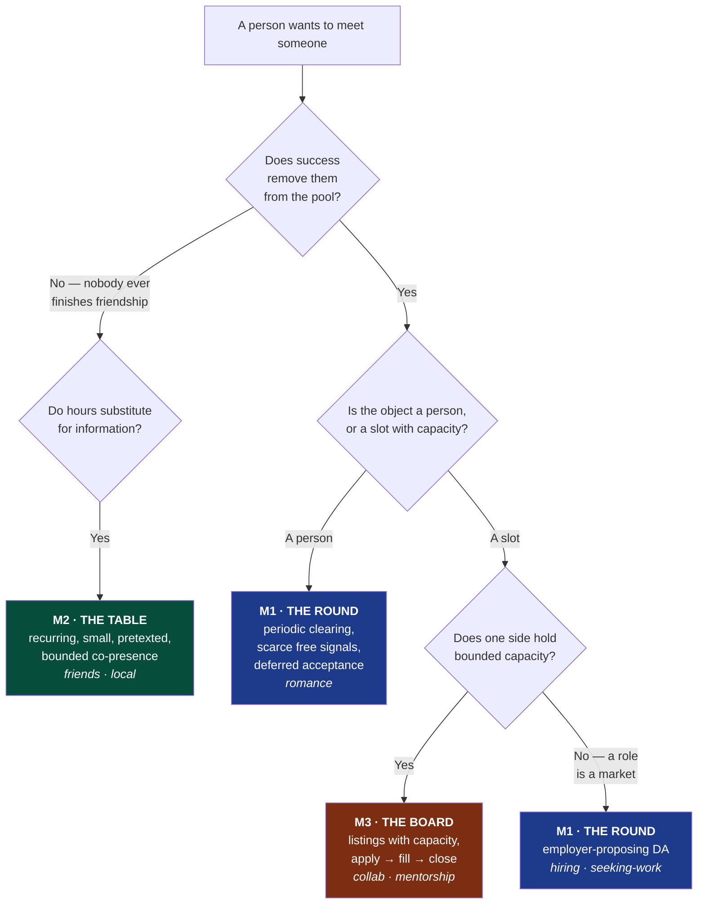
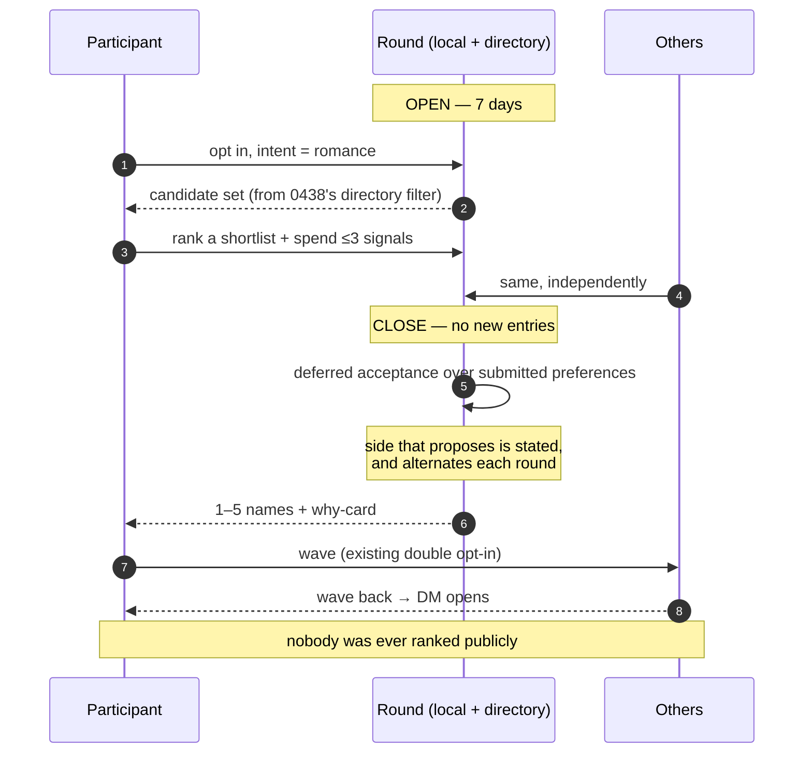
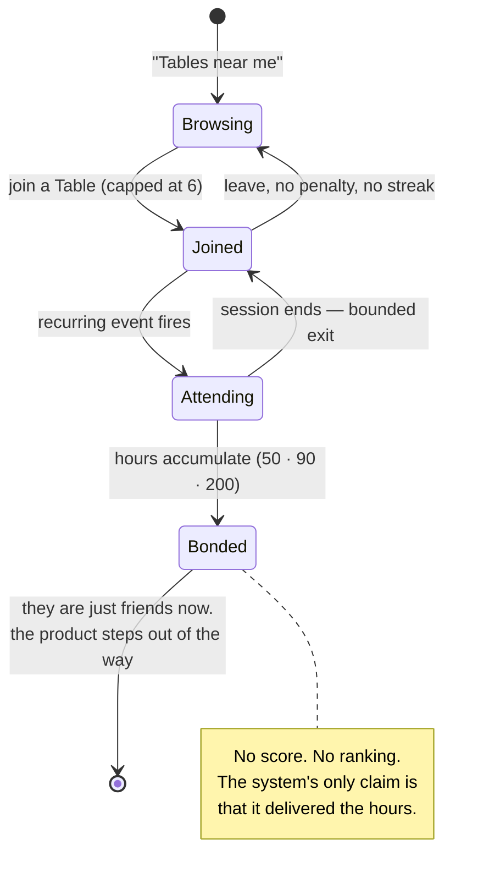

# Three mechanisms, not one — what actually matches people, and why friendship is not a market

> [!TIP]
> **TL;DR** — There is no optimal people-matching system, because "matching"
> is three different problems and only one of them is a market. **Romance,
> hiring and cofounding** are markets that clear — participants leave on
> success — and they want **rounds, scarce free signals, and deferred
> acceptance**, not an infinite feed. **Friendship is not a market at all**:
> Hall's research puts casual friendship at ~50 hours of time together and
> close friendship past 200, which no questionnaire can shortcut, so the
> mechanism is recurring, pretexted, bounded **co-presence** — a table, not a
> match. **Collaboration and mentorship** match a person to a *slot with
> capacity*, which is a board, not a feed. Keep 0174's one primitive for
> *representation*; split the *mechanism* three ways. The single most
> transferable finding: every system people genuinely love **reduces the number
> of decisions, not the number of options** — and the repo already has the
> template for that in `welcome.ts`.

---

## Problem Statement

[Exploration 0438](./0438_[_]_MATCHING_AT_COST_THE_PEOPLE_INDEX_AND_THE_AGGREGATION_HUB.md)
answered *where the data lives*: a public Card, a private Body, a derived-only
aggregation hub, waves delivered peer-to-peer. It deliberately did not answer
*what the mechanism is*. It assumed the OkCupid shape — a big question bank, a
percentage, a browsable candidate feed — because that is what was asked for.

This document asks whether that shape is right, and for whom. Four questions:

1. **What is the optimal people-matching system?**
2. **What have people done in the past that they genuinely liked?**
3. **What systems do we have today that people genuinely like** — both in the
   world and in this repository?
4. **Are they different for romance, work, collaborators, and friends?**

Question 4 turns out to answer question 1. [Exploration 0174](./0174_[_]_GENERALIZED_PEOPLE_MATCHING_AND_CONNECTION.md)
asserts *one primitive, seven intents* — that romance, friendship,
collaboration, hiring, job-seeking, mentorship and local meetups are "facets of
the same mechanism." That claim is half right, and the half that is wrong is
the expensive half.

---

## Executive Summary

**One — the seven intents are three mechanisms, and the dividing line is
whether success removes you from the pool.** Romance, hiring and job-seeking
*clear*: you find someone, you leave. Friendship and local connection never
clear — nobody has ever "completed" friendship — so there is no market to
design, no equilibrium to reach, and no matching algorithm that helps.
Collaboration and mentorship are a third shape again: the object being matched
is a **slot with capacity** (a project needing a Rust person for five hours a
week; a mentor with room for three people), not a person.

**Two — for the markets that clear, the answer is already known, and it is not
a feed.** Alvin Roth's market-design programme names three requirements —
markets must be **thick**, **uncongested**, and **safe**. A continuous swipe
feed is thick and catastrophically congested: everyone can contact everyone, so
nobody's interest carries information. The fix that has repeatedly worked in
real markets is **a round plus scarce free signals**. The NRMP's preference
signalling is the cleanest natural experiment available: after signals were
introduced, applications per applicant fell from **75.9 to 48.2**, adoption
among matched applicants reached **95.7%**, and a signal made an interview
invitation **2.95× more likely**. Scarcity of *your own* attention, given away
free, fixed congestion that unlimited applications had created. That is the
Charter-clean version of a super-like, and it cannot be sold.

**Three — friendship is a scheduling problem wearing a matching problem's
clothes.** Jeffrey Hall's work puts casual friendship at roughly **50 hours**
of time together, friendship at **90**, close friendship past **200** — and
finds that **hours spent working together don't count as much**. No
questionnaire compresses 50 hours. So the mechanism for friends is not a better
ranker; it is a **recurring, small, pretexted, bounded gathering**: Timeleft's
Wednesday dinners, run clubs, D&D tables, Focusmate's 50-minute sessions where
**over 99% of bookings get matched** and the thing people praise is the
appointment, not the partner. The system's job is to deliver *hours*, and to
make them cheap to attend and cheap to leave.

**Four — what people have loved, across sixty years, shares six properties.**
Operation Match (1965) mailed you a list of names after a 75-question form.
Speed dating (1998, invented by Rabbi Yaacov Deyo with a Purim noisemaker in a
Beverly Hills coffee shop) rotates strangers on a timer. The Marriage Pact gives
you **one match, one name, no photos, no profile** once a year. HN's "Who is
hiring" is a monthly plain-text thread. None of these rank people. All of them
have a **round**, a **pretext**, a **bounded exit**, **scarce attention**, an
**accountable norm**, and — the common root — they **reduce the number of
decisions you must make**. Tinder maximises options *and* decisions. That is the
whole difference.

**Five — the repo already contains the correct design template, in an unrelated
feature.** [`welcome.ts`](../../packages/social/src/community/welcome.ts)'s
docstring states it exactly: *"rank nobody, and instead make it impossible for a
first post to go unanswered."* It orders by **how long someone has been
waiting** — a time field, like every other calm feed — and it is a stewardship
surface, not a standing one. Generalised, that is the answer to "who should the
system show you": not the best candidates, but **the people who have been
waiting longest and nobody has answered**.

**Six — a stable matching is *more* Charter-compliant than the ranked feed we
already ship.** `scoreCandidate()` produces a global ordering of people.
Deferred acceptance produces an **assignment**: you rank your own preferences,
the algorithm clears, nobody is ever placed on a public scale. The mechanism the
economics literature considers optimal is also the one that scores nobody. That
is a rare and welcome alignment, and it should be taken.

---

## Current State In The Repository

> [!IMPORTANT]
> Everything shipped is **ranking machinery for a continuous feed**. Nothing in
> the repo has a concept of a round, a signal budget, a capacity, or a stable
> matching. The convening substrate half-exists — `EventSchema` and `RsvpSchema`
> are real — but `Event` has **no recurrence**, and recurrence is the entire
> mechanism for friendship.

| Capability | Status | Where |
| --- | --- | --- |
| Reciprocal scoring (harmonic mean, punishes asymmetry) | ✅ Shipped | [`matching.ts`](../../packages/social/src/connect/matching.ts) |
| MMR diversity rerank, UCB1 / Thompson exploration, adaptive λ | ✅ Shipped | [`exploration.ts`](../../packages/social/src/connect/exploration.ts) |
| Double-opt-in wave → DM | ✅ Shipped | [`wave.ts`](../../packages/social/src/connect/wave.ts), [`discover.tsx`](../../apps/web/src/routes/discover.tsx) |
| Seven intents on one primitive | ✅ Shipped | [`constants.ts`](../../packages/social/src/connect/constants.ts) |
| Graph proximity (Adamic-Adar, shortest path) | ✅ Shipped | [`graph.ts`](../../packages/social/src/connect/graph.ts) |
| **The welcome queue — the design template** | ✅ Shipped | [`welcome.ts`](../../packages/social/src/community/welcome.ts) |
| Chronological feeds, no leaderboard, banned dark patterns | ✅ Enforced | [`check-humane-patterns.mjs`](../../scripts/check-humane-patterns.mjs) |
| `Event` + `Rsvp` nodes | 🚧 Partial | [`event.ts`](../../packages/data/src/schema/schemas/event.ts) — `startsAt`/`endsAt` only |
| Spaces, channels, projects, milestones, courses, games | ✅ Shipped | [`packages/data/src/schema/schemas/`](../../packages/data/src/schema/schemas/) |
| Wave notification rule | ✅ Shipped | [`notify/rules.ts`](../../packages/comms/src/notify/rules.ts) (`CONNECTION_WAVE_SCHEMA`) |
| **Recurrence on `Event`** | ❌ Not built | the gap that blocks the whole friendship half |
| **Matching rounds** (open → close → clear) | ❌ Not built | no concept anywhere |
| **Scarce signal budget** | ❌ Not built | no concept anywhere |
| **Deferred acceptance / stable matching** | ❌ Not built | `rankMatches` scores, it does not clear |
| **Capacity on an intent** ("I can mentor 3") | ❌ Not built | `ConnectionIntent` has no capacity field |
| **A listing whose object is a slot, not a person** | ❌ Not built | closest existing shapes are `project.ts` / `task.ts` |

### The template worth generalising

From [`welcome.ts`](../../packages/social/src/community/welcome.ts), verbatim:

> So: rank nobody, and instead make it impossible for a first post to go
> unanswered. This module answers one question for a host — *who just arrived
> and is still waiting to be spoken to?*

and on why it stays inside the Charter:

> The queue orders by **how long someone has been waiting** — a time field,
> exactly like every other calm feed. It scores nobody, ranks nobody, and is
> visible to the people who can act on it (space admins), not to the membership
> as standing.

The evidence it cites is directly transferable: in newcomer research across
~140k newcomers, those who got a reply to their first post returned at **56%**
versus **44%** for those who did not. Replace "first post" with "first wave" and
the design writes itself — **the thing that matters is that nobody is left
unanswered**, not that the best people are surfaced first.

---

## External Research

### The one framework that organises everything: Roth's three requirements

Roth's market-design programme — Nobel 2012, with Shapley — holds that a
marketplace works when it is **thick**, **uncongested**, and **safe**.

- **Thick** — enough participants that a good match plausibly exists.
- **Uncongested** — enough *time and attention* to actually evaluate offers.
  Congestion is what happens when a market gets thick too fast: plenty of
  potential counterparties, no way to work through them.
- **Safe** — participants can act on their true preferences instead of gaming a
  flawed system.

> [!IMPORTANT]
> **Modern dating apps are thick and safe-ish and catastrophically congested,
> and the congestion is the product.** When anyone can contact anyone at zero
> cost, a contact carries no information, so the market floods and the operator
> sells a way to cut the queue. Every mechanism below is, at bottom, a way of
> making attention scarce **without making it purchasable**.

### The natural experiment: NRMP preference signalling

The US residency match runs deferred acceptance and had a congestion crisis —
applicants applying to ever more programmes, programmes unable to tell genuine
interest from shotgunning. The fix was **preference signals**: a small, fixed,
free allocation of tokens an applicant can attach to programmes they truly want.

| Measure | Before | After | Source |
| --- | --- | --- | --- |
| Applications per applicant | 75.9 ± 31.8 (2021) | **48.2 ± 23.6 (2024)** | otolaryngology signalling analysis |
| Signal use among matched applicants | <25% (2021) | **95.7% (2024)** | same |
| Interview invitation likelihood with a signal | — | **2.95×** | AAMC / AMA |
| Programme directors saying signals affect screening | — | **~80%** | NRMP 2024 PD survey |

Nearly universal voluntary adoption, a third fewer applications, and a signal
that actually means something — achieved by *giving away* a scarce thing rather
than selling an unlimited one. This is the single most important external
finding in this document.

### The system people love most is the one that gives them the least

| System | Era | Mechanism | What people actually liked |
| --- | --- | --- | --- |
| **Operation Match** | 1965 | 75-question form → punch cards → **a mailed list of names and phone numbers**, $3 | No photos, no browsing. A short list, and the excuse to call |
| **Speed dating** | 1998 | Timed rotation; Rabbi Deyo's Purim noisemaker signalled the switch | Everyone meets everyone; the timer removes the decision to leave |
| **The Marriage Pact** | 2017– | Questionnaire → Gale-Shapley → **one match, one name**, once a year | "No pictures, no profile, and you don't get a bunch of matches to scroll past" |
| **NRMP** | 1952– | Deferred acceptance + scarce signals | Stability, and a single decision day |
| **Focusmate** | 2016– | Random pairing into a 50-min session; **>99% of bookings matched**; timeliness score | The appointment, not the partner |
| **Timeleft** | 2020s | Six strangers, dinner, every Wednesday, 300 cities | A pretext, a table, a fixed end |
| **HN "Who is hiring"** | 2011– | One plain-text thread, monthly, no ranking | A round; everyone reads it because everyone reads it |
| **YC cofounder matching** | 2021– | Profile + invite + accept; **130k invites → 33k matches**, ~25% acceptance | Bounded double opt-in against a real, dated goal |
| **Secret Santa / Elfster** | — | Random assignment, one recipient, a deadline | One person to think about |
| **Village dance / church social / bowling league** | pre-1980s | Recurring co-presence with a pretext | Nobody had to declare an intention |

<details>
<summary>The six properties every one of these shares</summary>

1. **A round, not a stream.** Annual (Marriage Pact, NRMP), monthly (HN),
   weekly (Timeleft), hourly (Focusmate). A deadline manufactures *thickness* —
   Roth's first requirement — because everyone shows up at once.
2. **Scarce attention, given away free.** One match. Two to five signals. One
   recipient. Never purchasable; that is what keeps the scarcity informative
   rather than extractive.
3. **A pretext.** Dinner, work session, game, project, the dance. The ostensible
   activity removes the "I am here to be evaluated" frame, which is the single
   most exhausting thing about dating apps.
4. **A bounded exit.** The dinner ends. The session is 50 minutes. The rotation
   bell rings. A bad draw costs an hour, not an evening's courage.
5. **An accountable norm.** The shadchan's reputation; Focusmate's timeliness
   score; a community that sees you at the next dance.
6. **Fewer decisions, not more options.** This is the root property, and the
   others are its consequences. Every beloved system *removes* choices.

</details>

### Friendship: the research that dissolves the problem

Jeffrey Hall's 2019 study in the *Journal of Social and Personal Relationships*
puts it in hours: roughly **50 hours** together to move from acquaintance to
casual friend, **90** to "friend", and **more than 200** to close friend. The
detail that matters most for product design:

> Hours spent working together just don't count as much.

Two consequences, both severe for a matching product:

- **No amount of profile data compresses 50 hours.** A friendship matcher that
  returns a ranked list of compatible strangers has delivered zero of the 50.
  It has done the easy 1% and called it the product.
- **The work surface cannot be reused for it.** If co-working hours do not
  count, then "we put you in a Slack channel together" is not a friendship
  mechanism, however much it looks like one.

This is why the beloved friendship systems are all *conveners* — Timeleft, run
clubs, book clubs, D&D tables, Focusmate — and why none of them are matchers.
They deliver hours on a schedule, cheaply, with a pretext and an exit.

### The impossibility nobody should paper over

Gale-Shapley deferred acceptance produces a **stable** matching: no pair exists
who both prefer each other to their assigned partners. Truth-telling is a
dominant strategy **for the proposing side**. It is not for the receiving side,
and Roth (1982) showed no stable mechanism is strategy-proof for everyone.

> [!WARNING]
> In an employment match the asymmetry is tolerable — you pick a side and say
> so. In **romance the two sides are the same kind of participant**, so
> "applicant-proposing" has no natural meaning and whichever side proposes gets
> the better deal. Any honest romance round must either alternate the proposing
> side between rounds, randomise it per participant, or state plainly which side
> proposes. Pretending the algorithm is neutral would be the kind of quiet
> unfairness this project exists to refuse.

---

## Key Findings

### Finding 1 — the intents split on five questions, not on subject matter

| Question | Romance | Hiring / seeking-work | Cofounder / collab | Mentorship | Friends / local |
| --- | --- | --- | --- | --- | --- |
| Does success remove you from the pool? | ✅ Yes | ✅ Per role | ✅ Cofounder / ❌ ongoing | ⚠️ At capacity | ❌ **Never** |
| Is it exclusive? | ✅ Usually | ✅ Per role | ⚠️ Few slots | ⚠️ Capacity-bounded | ❌ Unbounded |
| Is the object a person or a slot? | Person | **Slot** | **Slot** | **Slot** | Person… |
| Does verification matter? | Safety | Credentials | Track record | Expertise | ❌ Barely |
| **Do hours substitute for information?** | ⚠️ Partly | ❌ No | ⚠️ Partly | ⚠️ Partly | ✅ **Entirely** |

The last row is the one that changes the architecture. Where hours substitute
for information, **stop building a matcher and start building a calendar**.



### Finding 2 — the shipped feed is the one shape none of the beloved systems use

`rankMatches()` returns an ordered list of people, continuously, with no
deadline and no budget. Every system in the survey table above does the
opposite: a round, a small output, a scarce input. The repo has built a superb
**ranker** and no **mechanism**. Ranking is the part that turned out not to
matter — Hinge, Tinder and OkCupid all converged on similar rankers and diverged
entirely on mechanism, and it is the mechanism people talk about.

### Finding 3 — deferred acceptance scores nobody, which our ranked feed cannot say

```text
  RANKED FEED (shipped)                  DEFERRED ACCEPTANCE (proposed)
  ┌──────────────────────┐               ┌──────────────────────────────┐
  │ 1. Ada      0.91     │               │ You ranked: Ada, Blaise, Cai │
  │ 2. Blaise   0.88     │  a global     │ They ranked: (their own)     │
  │ 3. Cai      0.74     │  ordering     │ ──────────────────────────── │
  │ 4. …                 │  of PEOPLE    │ Result: you and Blaise.      │
  └──────────────────────┘               │ No ordering of people exists.│
   ⚠ the artefact an operator sells      └──────────────────────────────┘
                                          ✅ an assignment, not a scale
```

Charter §6's "no scored intimacy" and the `scored intimacy` CI rule exist
because a score is the artefact an operator sells. A stable matching has no such
artefact to leak: your preference list is yours, the clearing is one-shot, and
the output is a name. **The mechanism economists consider optimal is also the
one with nothing to sell.**

### Finding 4 — scarce signals are the Charter-clean super-like, and the CI gate must be extended before they ship

A signal budget is *structurally* the same object as a super-like: a scarce,
high-information contact. The only difference is whether it can be bought. That
difference is one PR wide, so it needs a gate now, not later — the
`metered connection` rule already bans `payToReveal` and `boostPrice`, and must
grow `buySignals`, `extraSignals`, `signalPack`, `signalRefill`.

---

## Options And Tradeoffs

### How many mechanisms?

| Option | Verdict | Reasoning |
| --- | --- | --- |
| **A. One mechanism for all seven intents** (0174 as written) | 🛑 Rejected | Costs the friendship half entirely. A ranked feed delivers none of Hall's 50 hours, and hiring's congestion problem has an answer a feed cannot express |
| **B. Seven mechanisms, one per intent** | 🛑 Rejected | No shared machinery, seven surfaces to moderate, and the intents genuinely do cluster. Overfitting to a taxonomy |
| **C. Three mechanisms over one representation** | ✅ **Recommended** | The clustering falls out of the five questions above, not out of subject matter. `ConnectableProfile` / `ConnectionIntent` stay as the shared representation; only the clearing differs |
| D. Two — market and non-market | ⚠️ Close | Genuinely tempting, and simpler. But mentorship's **capacity** is not expressible in either a round or a table, and capacity is the whole mechanism for "I can take three people" |

### For the markets that clear: what clears them?

| Option | Verdict | Reasoning |
| --- | --- | --- |
| Continuous ranked feed (shipped) | 🛑 Rejected for this class | Congested by construction; the failure Roth names |
| **Periodic round + scarce free signals + deferred acceptance** | ✅ **Recommended** | The NRMP result is the strongest available evidence, and the Marriage Pact shows it works socially, not just theoretically |
| Round + top-*k* mutual scoring, no DA | ⚠️ Simpler fallback | Much easier to explain and implement; loses stability, so people are matched to someone they'd both trade away. Acceptable for a first round |
| Auction / paid priority | 🛑 Refused | `paidVisibility`. Charter §6, CI-enforced |

### For friendship: what delivers hours?

| Option | Verdict | Reasoning |
| --- | --- | --- |
| Better friend ranker | 🛑 Rejected | Delivers 0 of 50 hours. This is the central finding |
| **Recurring small pretexted gathering (the Table)** | ✅ **Recommended** | Timeleft, run clubs, Focusmate, D&D — the whole beloved set. Needs recurrence on `Event`, which is a small change |
| Reuse work channels / spaces | 🛑 Rejected | Hall: co-working hours "don't count as much". Reusing the work surface would look like progress and deliver none |
| One-to-one random pairing (Focusmate shape) | ✅ **Also recommended** | Cheaper than a group, works at low density, and is the one convening format proven at 1:1. Ship alongside, not instead |

### Revenue

**No new lane is proposed.** Every mechanism here rides the flat hosting bill,
exactly as
[0417](./0417_[x]_THE_MATCHMAKER_AND_THE_METER_DATING_WITHOUT_A_PROFIT_MOTIVE.md)
fixed and 0438 reaffirmed. The three "no ground rent" tests are therefore
inherited unchanged from 0438 rather than re-derived: improvement ✅ (compute we
run), BATNA ✅ (self-hostable, derived-only), vanish ✅ (preferences and hours
live with the participants). The one thing this document *adds* is a new way to
smuggle a lane in — **selling signals** — and the recommendation closes that
door with a CI rule before the feature exists.

---

## Recommendation

> [!IMPORTANT]
> **Keep 0174's one primitive as the representation. Split the mechanism three
> ways: the Round for markets that clear, the Table for friendship, the Board
> for capacity-bounded slots. Ship the Table first — it is the smallest change,
> it depends on nothing in 0438, and it is the half the industry has not
> built.**

### M1 · The Round — romance, hiring, seeking-work, cofounder

A dated window. Everyone opts in, ranks a shortlist, and spends a small budget
of free signals. On close, the round clears and returns **one to five names**,
not a feed.

- **Signal budget**: fixed per round, free, non-transferable, non-purchasable.
  Start at 3, tune later.
- **Clearing**: deferred acceptance. State which side proposes; for romance,
  alternate it round to round and say so in the UI.
- **Output**: names with the "why" card that already exists
  ([`buildIntroCard`](../../packages/social/src/connect/wave.ts)), then the
  existing double-opt-in wave. A round produces *candidates for a wave*, never a
  forced introduction.
- **Cadence**: monthly for romance and cofounder; continuous-with-weekly-clearing
  for hiring, whose participants arrive on their own schedule.



### M2 · The Table — friends, local

Not a matcher. A **recurring, capped, pretexted gathering** that delivers hours.

- **Recurring** — the missing field on `EventSchema`. Weekly or fortnightly.
- **Capped** at ~6. Big enough to survive a no-show, small enough that everyone
  speaks.
- **Pretexted** — every Table has a subject or activity: a book, a language, a
  run, a repository, a game. The pretext is what makes attending require no
  declaration of loneliness.
- **Bounded** — a stated end time. Leaving is the default, not a decision.
- **Seeded, not matched** — the affinity layer chooses *who is invited to which
  Table*, and that is the only place ranking appears. Once seated, no scores, no
  percentages, no "compatibility" anywhere in the surface.
- **The measure is hours, not matches.** Show a person the hours they have
  accumulated with people, because that is the quantity Hall's research says
  predicts friendship. Never show it per person, and never rank it — that would
  be `closenessScore` with extra steps.
- **Also ship the 1:1 Focusmate shape**: book a slot, get a stranger with a
  shared interest, 50 minutes, bounded. It works at densities where a table of
  six cannot be filled, which is every new region.



### M3 · The Board — collab, mentorship

The object is a **slot**, and slots have shapes and capacity.

- A listing says what is needed and how much: *"Rust, ~5 hrs/week, through
  October"*; *"I can mentor 3 people on distributed systems, 1 hr/month."*
- People apply to slots. Capacity fills. The listing closes and disappears —
  the HN "Who is hiring" property that makes the thread readable.
- **Nobody is scored.** You are matched to a *slot*, and slots are matched by
  fit to a stated shape, which is a property of the work, not of the person.
- Closest existing shapes are [`project.ts`](../../packages/data/src/schema/schemas/project.ts)
  and [`task.ts`](../../packages/data/src/schema/schemas/task.ts); a `ConnectionSlot`
  probably belongs beside them rather than in `connect/`.

### Shipping order, and why

| Order | Mechanism | Why here |
| --- | --- | --- |
| **1st** | **M2 · The Table** | Depends on **nothing** in 0438 — no directory, no Card, no lexicon, no aggregation hub. Needs recurrence on `Event` and a seeding pass. It is also the half nobody has built, and the half with the strongest research behind it |
| 2nd | **M3 · The Board** | Second-least coupled; a listing is a node like any other. Serves the work/collab intents that need no romance-grade safety machinery |
| 3rd | **M1 · The Round** | Needs 0438's candidate supply to be thick enough to clear, and carries all the safety and age-assurance weight. Do it last, deliberately |

> [!TIP]
> That ordering inverts the obvious one, and it is the most actionable thing in
> this document. The romance round is the exciting part and the blocked part.
> The Table is unglamorous, unblocked, and — on the evidence — the mechanism
> people actually like.

---

## Example Code

### Deferred acceptance — the clearing, as pure math

```ts
/**
 * Deferred acceptance (Gale & Shapley 1962) for a matching round.
 *
 * Produces a STABLE ASSIGNMENT, not a ranking: no pair exists who both prefer
 * each other to their assigned partner. This is why it is Charter-safe where a
 * ranked feed is not — the output is a name, and no global ordering of people
 * is ever constructed, stored, or displayable (Charter §6, "no scored
 * intimacy").
 *
 * HONESTY REQUIREMENT: truth-telling is dominant for the PROPOSING side only.
 * Roth (1982) proved no stable mechanism is strategy-proof for both sides. For
 * symmetric markets (romance) the caller MUST alternate `proposers` between
 * rounds and the UI MUST say which side is proposing this round. Hiding that
 * asymmetry would be a quiet unfairness, which is worse than a loud one.
 */
export type Preferences = ReadonlyMap<string, readonly string[]>

export function deferredAcceptance(
  proposers: Preferences,
  receivers: Preferences
): Map<string, string> {
  const rank = new Map<string, Map<string, number>>()
  for (const [receiver, list] of receivers) {
    rank.set(receiver, new Map(list.map((id, i) => [id, i])))
  }

  const held = new Map<string, string>() // receiver → currently held proposer
  const next = new Map<string, number>() // proposer → index into their list
  const free = [...proposers.keys()]

  while (free.length > 0) {
    const proposer = free.pop() as string
    const list = proposers.get(proposer) ?? []
    const i = next.get(proposer) ?? 0
    if (i >= list.length) continue // exhausted their list — unmatched, and that is a valid outcome

    next.set(proposer, i + 1)
    const target = list[i]
    const order = rank.get(target)
    if (!order?.has(proposer)) {
      free.push(proposer) // not on their list at all — try the next one
      continue
    }

    const incumbent = held.get(target)
    if (incumbent === undefined) {
      held.set(target, proposer)
    } else if ((order.get(proposer) as number) < (order.get(incumbent) as number)) {
      held.set(target, proposer)
      free.push(incumbent) // displaced — back into the pool
    } else {
      free.push(proposer)
    }
  }

  return held
}
```

### The signal budget — scarce, free, and structurally unsellable

```ts
/**
 * A round's signal budget (exploration 0439).
 *
 * Scarce attention is what fixes congestion (Roth); the NRMP's result is the
 * receipt — applications per applicant fell 75.9 → 48.2 once signals existed,
 * with 95.7% voluntary adoption.
 *
 * The budget is a CONSTANT, not a balance: there is no field to top up, no
 * transaction, no purchase path, and no carry-over. That is deliberate — a
 * balance is one PR away from a product, and `check-humane-patterns` grows
 * `buySignals|extraSignals|signalPack|signalRefill` in the same change that
 * adds this file (Charter §6, "no rent on introductions").
 */
export const SIGNALS_PER_ROUND = 3

export function signalsRemaining(spentThisRound: number): number {
  return Math.max(0, SIGNALS_PER_ROUND - spentThisRound)
}
```

### Hours, not scores — the friendship measure

```ts
/**
 * Hours accumulated with people through Tables (exploration 0439).
 *
 * Hall (2019): ~50 h to casual friend, ~90 h to friend, 200+ h to close
 * friend — and co-working hours "don't count as much", which is why only
 * Table sessions count here and Space/Channel activity does not.
 *
 * Returns ONE aggregate for the person themselves. It is deliberately NOT
 * per-relationship: an hours-per-person number is `closenessScore` wearing a
 * clock, and Charter §6 forbids exactly that. The system may claim it
 * delivered hours; it may never grade a relationship with them.
 */
export function hoursTogether(sessions: readonly { minutes: number }[]): number {
  return sessions.reduce((total, s) => total + s.minutes, 0) / 60
}
```

---

## Risks And Open Questions

| Risk | Severity | Mitigation |
| --- | --- | --- |
| **A round needs density to clear** | 🔴 High | A round with 12 participants produces bad stable matches and looks broken. Gate rounds on a minimum participant count per (intent × region) and say plainly "not enough people here yet" rather than clearing a thin market. This is Roth's thickness requirement as a runtime check |
| **The Table needs local density too — but far less** | 🟠 Medium | Six people beats twelve hundred. And the 1:1 Focusmate shape works at any density, which is why it ships alongside |
| **Signals become a product** | 🟠 Medium | Ban the identifiers in `check-humane-patterns.mjs` in the same PR that introduces the budget, with a `--selftest` negative control |
| **A round deadline reads as manufactured urgency** | 🟠 Medium | The `manufactured urgency` rule deliberately does not match real deadlines (`expiresAt`, `deadline`) — but the copy must state facts ("closes Friday") and never dread ("3 spots left"). This is the nearest miss in the whole design |
| **Hours become a streak** | 🟠 Medium | `relationshipStreak` is already banned. Never show hours per person, never show consecutive weeks, never notify about a gap |
| **Proposing-side asymmetry is unfair and invisible** | 🟠 Medium | Alternate per round; state it in the UI. Do not pretend the algorithm is symmetric |
| **The Table is a harassment surface with a nicer name** | 🟠 Medium | Small caps, a host, the existing `@xnetjs/abuse` labeler stack, and the ability to leave silently with no penalty and no visible departure |
| **Three mechanisms is three surfaces to build and moderate** | 🟡 Low-medium | They share one representation and one safety stack. The shipping order exists so only one is in flight at a time |

### Open questions

1. **Who proposes in a romance round?** Alternating is the honest answer, but it
   means half the participants get the worse side each round and will notice.
   Is a randomised-per-participant assignment better, or worse for trust?
2. **Should a Table be seeded by affinity at all?** Timeleft assigns
   semi-randomly and people like it. Affinity seeding risks recreating a filter
   bubble at the dinner table, which `mmrRerank` was written to prevent but
   would now be operating on seats rather than a feed.
3. **Does the Board need reciprocity?** Applying to a slot is one-sided by
   nature, which breaks the "nobody can contact you cold" invariant that the
   wave protects. A slot's owner opting in by *publishing* it may be sufficient
   consent — but that is an argument, not a proof.
4. **Is `local` a Table intent or a Round intent?** It is listed here under the
   Table, but "local" covers both "meet neighbours" (Table) and "find a
   badminton partner" (closer to a Board slot).
5. **Does 0438's Card carry enough for a Round to seed from?** The Card is
   deliberately thin — intents, coarse geohash, tag hashes. A round may need
   more, and every field added to the Card is a field 0438 warned against.
6. **Do we ever measure whether this works?** The honest metric for the Table is
   hours delivered; for the Round it is matches that produced a second
   conversation. Both require a post-intro feedback loop that 0174 left
   unchecked and that `exploration.ts`'s bandit already expects as input.

---

## Implementation Checklist

**Status:** `░░░░░░░░░░ 0/24 items`

### Phase 1 — the Table (unblocked; depends on nothing in 0438)

- [ ] Add recurrence to [`EventSchema`](../../packages/data/src/schema/schemas/event.ts) (`recurrence`, `recurrenceEndsAt`) and expand occurrences at read time — never store computed occurrences
- [ ] Add `TableSchema` in `packages/social/src/connect/`: pretext, cap (default 6), host, recurring event relation, join policy
- [ ] Seed a Table's invite set from the existing affinity + `mmrRerank` path — the only place ranking appears in M2
- [ ] Implement `hoursTogether()` — one aggregate for the person, never per relationship
- [ ] Ship the 1:1 session shape (Focusmate-style): book a slot, bounded duration, shared-interest pairing
- [ ] Leaving a Table is silent, instant, penalty-free, and produces no notification to anyone
- [ ] Surface Tables on `/discover` beside matches, with no scores or percentages anywhere in the Table UI

### Phase 2 — the guardrails, before any Round exists

- [ ] Extend the `metered connection` rule in [`check-humane-patterns.mjs`](../../scripts/check-humane-patterns.mjs) with `buySignals|extraSignals|signalPack|signalRefill|priorityRound`
- [ ] Add these to `--selftest` as planted violations, so the gate provably goes red
- [ ] Add a `hoursPerPerson|weeksInARow` ban to the `scored intimacy` rule — the two ways hours become a score
- [ ] Pin a claims-ledger receipt for "signals are never sold"

### Phase 3 — the Board (collab, mentorship)

- [ ] Add `capacity` to `ConnectionIntentSchema` ("I can mentor 3")
- [ ] Add `ConnectionSlot` beside [`project.ts`](../../packages/data/src/schema/schemas/project.ts): shape, commitment, window, capacity, filled count
- [ ] Apply → accept → capacity decrements → listing closes and leaves the board
- [ ] Board surface orders by **how long a slot has been open**, in the shape of [`welcome.ts`](../../packages/social/src/community/welcome.ts) — a time field, never a score

### Phase 4 — the Round (depends on 0438's directory for thickness)

- [ ] `RoundSchema`: intent, region, opens, closes, proposing side, minimum participants
- [ ] `deferredAcceptance()` in `connect/matching.ts` — pure, tested against known stable-matching fixtures
- [ ] `SIGNALS_PER_ROUND` constant + spend tracking; no balance, no top-up path
- [ ] Thickness gate: refuse to clear below a minimum participant count and say so plainly
- [ ] Alternate the proposing side each round; display which side proposes, in the round's own UI
- [ ] Round output feeds the existing wave flow — a round proposes candidates, it never forces an introduction
- [ ] Post-intro feedback loop wired into `updateArm()` so `exploration.ts`'s bandit finally has its input

### Phase 5 — write down what was decided

- [ ] Record the three-mechanism split in 0174 as a correction to "one primitive, seven intents" — the primitive stands, the mechanism claim does not
- [ ] Note in `docs/VIBE.md` that friendship is delivered in hours and never scored

---

## Validation Checklist

- [ ] A person joins a Table, attends four sessions, and the product has shown them **zero** compatibility percentages, rankings, or scores at any point
- [ ] `hoursTogether()` has no per-person variant anywhere in the codebase, and a planted `hoursPerPerson` identifier fails `check:humane-patterns`
- [ ] Leaving a Table produces no notification, no streak break, no visible departure, and no prompt to reconsider
- [ ] A round with fewer than the minimum participants **refuses to clear** and says why, rather than producing thin matches
- [ ] `deferredAcceptance()` returns a provably stable assignment on the standard fixtures, and returns *unmatched* rather than a bad match when a preference list is exhausted
- [ ] The proposing side is visible in the round UI and demonstrably alternates between two consecutive rounds
- [ ] A participant cannot obtain a fourth signal by any path — no purchase, no referral, no carry-over, no admin grant
- [ ] A round's output is at most five names, and each arrives with a why-card, not a percentage
- [ ] The Board orders open slots by age, and a filled slot disappears from the board entirely
- [ ] Applying to a slot cannot be used to contact its owner about anything other than that slot
- [ ] A 1:1 session can be booked and completed in a region with fewer than 20 listed people — the low-density path works
- [ ] `pnpm test`, `pnpm typecheck`, `pnpm lint`, `pnpm build` and the `check:*` guards green

---

## References

### In this repository

- [0438 — Matching at cost: the people index and the aggregation hub](./0438_[_]_MATCHING_AT_COST_THE_PEOPLE_INDEX_AND_THE_AGGREGATION_HUB.md) — where the data lives; this document is where the mechanism lives
- [0174 — Generalized people matching and connection](./0174_[_]_GENERALIZED_PEOPLE_MATCHING_AND_CONNECTION.md) — the one-primitive claim this document half-corrects
- [0417 — The matchmaker and the meter](./0417_[x]_THE_MATCHMAKER_AND_THE_METER_DATING_WITHOUT_A_PROFIT_MOTIVE.md) — the accountable-intermediary history and the refused lane
- [0422 — Relationship primitives](./0422_[x]_RELATIONSHIP_PRIMITIVES_UNBUNDLING_THE_SOCIAL_GRAPH.md) — the origin of "no scored intimacy"
- [0378 — The Index as a place: interaction without a scoreboard](./0378_[_]_THE_INDEX_AS_A_PLACE_INTERACTION_WITHOUT_A_SCOREBOARD.md)
- [`packages/social/src/community/welcome.ts`](../../packages/social/src/community/welcome.ts) — the design template: rank nobody, order by who has waited longest
- [`packages/social/src/connect/`](../../packages/social/src/connect/) · [`packages/data/src/schema/schemas/event.ts`](../../packages/data/src/schema/schemas/event.ts) · [`docs/CHARTER.md`](../CHARTER.md) §3, §6 · [`scripts/check-humane-patterns.mjs`](../../scripts/check-humane-patterns.mjs)

### Market design

- [Gale & Shapley, *College Admissions and the Stability of Marriage* (1962)](https://web.stanford.edu/~alroth/papers/GaleandShapley.revised.IJGT.pdf)
- [Roth, *Market design and maintenance* (NBER)](https://www.nber.org/system/files/chapters/c14930/c14930.pdf) · [*What Have We Learned from Market Design?*](https://onlinelibrary.wiley.com/doi/abs/10.1111/j.1468-0297.2007.02121.x) · [*The Art of Designing Markets* (HBR)](http://web.stanford.edu/~alroth/papers/HBR.ArtOfDesigningMarkets.pdf)
- [How to fix a broken marketplace — HBS Working Knowledge](https://hbswk.hbs.edu/item/how-to-fix-a-broken-marketplace) (thick / uncongested / safe)
- [The stable marriage problem underpins dating apps and school choice — Scientific American](https://www.scientificamerican.com/article/the-stable-marriage-problem-solution-underpins-dating-apps-and-school/)
- [Manipulation and gender neutrality in stable marriage procedures (arXiv:0909.4437)](https://arxiv.org/pdf/0909.4437)

### Signalling and real matches

- [NRMP 2024 Program Director Survey: program signaling](https://www.nrmp.org/wp-content/uploads/2024/09/Program-Director-2024-Program-Signaling-Report-Final-09242024.pdf) · [NRMP on signaling's impact](https://www.nrmp.org/about/news/2024/09/nrmp-explores-impact-of-program-signaling-on-program-director-residency-selection-behaviors/)
- [Analyzing otolaryngology signaling match trends 2018–2024 (PMC)](https://www.ncbi.nlm.nih.gov/pmc/articles/PMC12529452/) — the 75.9 → 48.2 applications figure
- [When residency program signals matter — AMA](https://www.ama-assn.org/medical-students/preparing-residency/when-residency-program-signals-matter-and-when-they-probably)
- [Stanford's Marriage Pact as a matching market — NPR/WVXU](https://www.wvxu.org/2021-04-09/stanfords-marriage-pact-is-actually-a-great-way-to-understand-economic-markets)
- [Y Combinator co-founder matching](https://www.ycombinator.com/blog/co-founder-matching/) · [How YC's founder-matching service worked out — TechCrunch](https://techcrunch.com/2024/05/03/y-combinator-founder-matching-tool-hona-medical-ai-startup/)

### Friendship, co-presence, and history

- [Hall, *How many hours does it take to make a friend?* (2019)](https://journals.sagepub.com/doi/10.1177/0265407518761225) · [KU summary](https://news.ku.edu/news/article/2018/03/06/study-reveals-hours-it-takes-make-friend)
- [Focusmate — about](https://www.focusmate.com/about/) · [FAQ](https://www.focusmate.com/faq/) · [Fast Company on body doubling](https://www.fastcompany.com/90632591/focusmate-body-doubling-virtual-coworking)
- [Operation Match (Wikipedia)](https://en.wikipedia.org/wiki/Operation_Match) · [Operation Match — Radio Diaries](https://www.radiodiaries.org/post/operation-match) · [How the first computerized dating service came to be — NPR](https://www.npr.org/2025/12/26/nx-s1-5645853/operation-match-how-the-first-computerized-dating-service-came-to-be)
- [The history of speed dating](https://www.originaldating.com/blog/2014/6/24/the-history-of-speed-dating/) — Rabbi Yaacov Deyo, 1998
