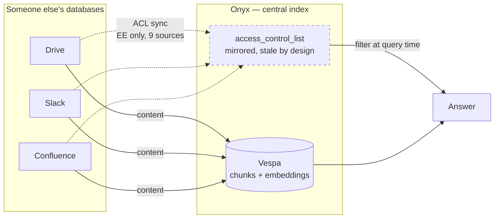
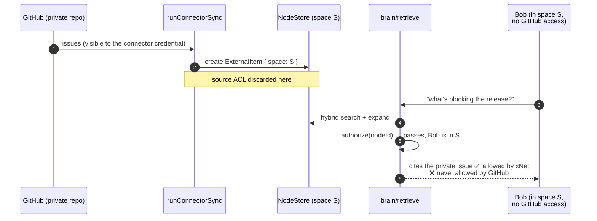
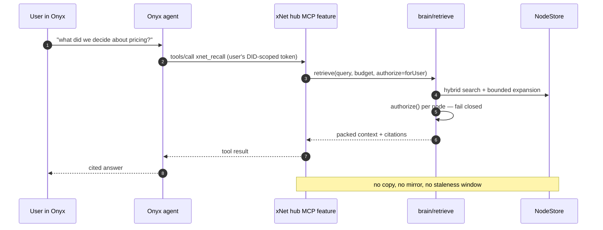

# Onyx — the permission mirror, and three mechanisms worth importing

> [!TIP]
> **TL;DR** — Don't integrate Onyx as a dependency. Their whole architecture is
> a central index that mirrors everyone else's permissions, which is the exact
> thing xNet's charter refuses and the exact tax they pay forever. Do meet them
> at one seam: **Onyx already speaks MCP, and xNet already is an MCP server**, so
> xNet can be a knowledge source for Onyx without copying a byte. Then import
> three mechanisms their connector framework has and ours doesn't —
> **checkpointed sync**, a **slim pass for deletions**, and a **federated
> query-time mode**. And fix the thing looking at us from their war stories:
> xNet's own synced `ExternalItem` nodes silently launder source permissions
> into space permissions today.

---

## Problem Statement

Onyx (formerly Danswer) is the open-source leader in the category next door to
xNet — connectors into a knowledge base, hybrid retrieval, cited answers, agents
over the result. 31.4k stars, 4.3k forks, ~9,500 commits on main, MIT-licensed
core. They have shipped, at scale, several things xNet has sketched.

So there are two questions, and they deserve separate answers:

1. **Should xNet integrate with Onyx?** Depend on it, deploy alongside it, feed
   it, consume it, or port pieces of it.
2. **What has Onyx learned that xNet should learn without paying the tuition?**

The temptation is to answer the first question by architecture-envy and the
second by cargo cult. Both are wrong. The honest answer turns on one structural
difference that runs through everything below.

## Executive Summary

Onyx and xNet look like neighbours and are built on opposite bets.

Onyx assumes your data lives in forty other companies' databases, so their job
is to copy it into one place they control, and — this is the hard part — copy
each source's access control list along with it, then keep those lists fresh
forever. That mirror is their moat and their permanent tax. Their permission
sync covers nine of fifty-plus connectors, and it is Enterprise-Edition only.

xNet assumes your data lives in your hub, where the authorization already is.
[Exploration 0379](./0379_[_]_A_KNOWLEDGE_BASE_ON_XNET_PRIMITIVES_DISTILLATION_BURSTS_AND_THE_GOVERNED_CORPUS.md)
already named this: permission mirroring "is precisely the problem xNet does not
have." That remains true for xNet-native data. It is **not** true for data xNet
pulls in through a connector, and nobody has said so out loud until now.

> [!IMPORTANT]
> The recommendation is **borrow, don't buy, and meet at MCP**. Concretely:
> expose xNet as a network-reachable MCP knowledge source that Onyx (and Glean,
> and Claude, and anything else that speaks MCP) can query in place; import
> checkpointing, pruning and a federated mode into `defineConnector`; and stamp
> source-ACL provenance on synced nodes so the connector path stops laundering
> permissions.

| Path                                              | Verdict     | Why                                                                     |
| ------------------------------------------------- | ----------- | ----------------------------------------------------------------------- |
| Adopt Onyx as xNet's retrieval backend            | 🛑 Rejected | Python + Postgres + Vespa + Redis + MinIO under a local-first TS client  |
| Deploy Onyx, push xNet data into it               | 🛑 Rejected | Copies the user's data into a second index; fails the charter outright   |
| **Expose xNet over MCP, Onyx queries in place**   | ✅ Adopt    | No copy, no mirror, one seam, serves every consumer not just Onyx        |
| Port Onyx connectors wholesale                    | ❌ No       | Python, and their `Document` model assumes a central chunk store         |
| **Import checkpoint + prune + federated mode**    | ✅ Adopt    | Three real gaps in `defineConnector`, each a live bug class today        |
| **Stamp source ACLs on synced nodes**             | ✅ Adopt    | Closes a permission-laundering hole we currently have and don't discuss  |

---

## Current State In The Repository

xNet already has most of the pieces. The gaps are specific and small, which is
what makes this worth writing down rather than shrugging at.

### The connector primitive

[`packages/plugins/src/connectors/define-connector.ts`](../../packages/plugins/src/connectors/define-connector.ts)
defines a connector as a capability-declaring feature module with one method:

```ts
export interface ConnectorSyncSpec {
  schemas: string[]
  spaceProperty?: string
  cadence?: ConnectorCadence // 'manual' | 'hourly' | 'daily' | { everyMs }
  pull(ctx: ConnectorSyncContext): Promise<ConnectorSyncResult>
}
```

One `pull`. No cursor, no resume point, no way to ask "what still exists at the
source". Compare Onyx, which grew five interfaces over the same surface because
one was never enough (see External Research).

[`packages/plugins/src/connectors/sync-runner.ts`](../../packages/plugins/src/connectors/sync-runner.ts)
is genuinely nice work and does something Onyx does not: it composes the guards
so the connector author cannot forget them. Egress is limited to declared hosts
via `guardedFetch`, writes are limited to declared schemas via `guardStore`,
every created node is stamped with the target space, and writes are charged
against a separate `connector` budget surface so a backfill can't starve the
interactive agent. It refuses a cross-space write loudly:

```ts
throw new ConnectorSyncError(
  `connector '${connectorId}' tried to write a node into space ${...} ` +
  `but its sync target is ${...} (cross-space write refused)`
)
```

Seven connectors ship today —
[`slack-migration.ts`](../../packages/plugins/src/connectors/slack-migration.ts),
[`rss.ts`](../../packages/plugins/src/connectors/rss.ts),
[`calendar.ts`](../../packages/plugins/src/connectors/calendar.ts), and GitHub,
Notion, Airtable and Linear in
[`api-connectors.ts`](../../packages/plugins/src/connectors/api-connectors.ts),
all four landing on one shared `xnet://xnet.fyi/ExternalItem@1.0.0` schema.

### Retrieval

[`packages/brain/src/retrieve.ts`](../../packages/brain/src/retrieve.ts) is the
hybrid GraphRAG retriever from exploration 0211: hybrid entry search, bounded
graph expansion over typed relations, then an authorization filter that runs
**before** anything can reach the model, and fails closed —

```ts
try {
  return await authorize(nodeId)
} catch {
  // Fail closed: an authorization error means "not allowed", never "allowed".
  return false
}
```

[`packages/vectors/src/hybrid.ts`](../../packages/vectors/src/hybrid.ts) does
reciprocal rank fusion at $k = 60$, the same constant Onyx uses, because it is
the same paper.

### The MCP surface

[`packages/plugins/src/services/mcp-server.ts`](../../packages/plugins/src/services/mcp-server.ts)
exposes eleven tools — `xnet_query`, `xnet_get`, `xnet_create`, `xnet_update`,
`xnet_delete`, `xnet_create_task`, `xnet_create_page`, `xnet_send_message`,
`xnet_get_write_audit`, `xnet_recall`, `xnet_schemas` — with deferred loading so
most definitions cost nothing per turn.

> [!WARNING]
> [`packages/plugins/src/services/mcp-http.ts`](../../packages/plugins/src/services/mcp-http.ts)
> **binds loopback only and refuses to start on a non-loopback host.** That is
> the correct default and it is also the blocker for every "some other server
> queries xNet" story, including this one. Option B below is mostly the work of
> earning a network-reachable equivalent without giving up what loopback bought.

### The economics

`docs/CHARTER.md` §6 states the three tests any revenue lane must pass —
Improvement, BATNA, Vanish — at lines 324–328. They apply to exactly one part of
this exploration, handled in Options.

---

## External Research

### What Onyx actually is

| Dimension     | Onyx                                                     |
| ------------- | -------------------------------------------------------- |
| Licence       | MIT core (CE); Enterprise Edition on top                  |
| FOSS mirror   | `onyx-dot-app/onyx-foss` — "100% MIT-licensed and automatically synced with the main Onyx repository", for strict-OSS shops |
| Backend       | Python                                                    |
| Frontend      | Next.js                                                   |
| Search        | Vespa (default), chunked + embedded, hybrid               |
| Runtime deps  | Postgres, Redis, MinIO, indexing workers                  |
| Deploy        | Docker Compose, Kubernetes, Helm/Terraform; Lite (<1 GB) and Standard modes |
| Connectors    | 50+ out of the box or via MCP                             |
| Scale signals | 31.4k stars, 4.3k forks, ~9,500 commits on main           |

The FOSS-mirror detail is worth pausing on. Keeping a separate 100%-MIT mirror
in sync, purely so licence-strict buyers have something clean to point at, is a
sign the MIT/EE split in the main repo creates real friction at procurement.
[Exploration 0345](./0345_[_]_COPYLEFT_LICENSING_GPL_AGPL_VS_MIT_PLUS_FSL.md)
landed xNet on MIT core plus FSL cloud, which puts the non-MIT part in a
separate app rather than a subdirectory. That looks like the better shape, and
Onyx's mirror is the evidence.

### The connector ladder

This is the part worth studying closely. Onyx's connectors subclass one or more
of five interfaces, and the progression is a record of what breaks at scale:

```text
LoadConnector                      load_from_state()        "give me everything"
  └─ PollConnector                 poll_source(start, end)  "give me what changed"
       └─ CheckpointedConnector    + persisted state        "resume where you died"
            └─ …WithPermSync       + ACL sync               "and who may see it"

SlimConnector                      get_slim_documents()     "which IDs still exist"
```

`SlimConnector` sits off to the side deliberately. It fetches **IDs only, not
documents**, and exists for one job: pruning. You cannot detect a deletion from a
poll, because a deleted thing does not show up in a list of things that changed.
The only way is to periodically ask the source for the full set of IDs and diff
it against what you hold. Onyx runs that on a 30-day default; refresh runs every
30 minutes.

Their unit of ingestion is a **CCPair** — a connector configuration bound to a
credential — so "the marketing SharePoint site with the service account" is a
distinct, individually-schedulable, individually-failable object from "the
engineering SharePoint site with a different token".

<details>
<summary>Onyx's connector contribution checklist — what shipping one costs them</summary>

Before a connector PR is accepted, a contributor must:

1. Add a `DocumentSource` type to the constants file
2. Register the connector in the factory mapping
3. Update frontend metadata and form configuration
4. Write documentation with credential setup instructions
5. Implement tests in `backend/tests/daily/connectors`
6. Demonstrate end-to-end functionality **with recorded video evidence**

Six steps across four layers, plus a video. That is what fifty connectors costs
when each one is a bespoke integration into a central store. xNet's
`defineConnector` collapses steps 1–3 into the definition object, which is the
right instinct — but xNet also has seven connectors, not fifty, so the claim is
untested.

</details>

### The permission mirror

Onyx offers three access models per connector: **private** (only the creator),
**public** (everyone), and **auto-sync** ("Onyx will maintain an access control
list from the source and restrict users to only see data they have access to").

Auto-sync is the interesting one, and its limits tell the story:

- It covers **nine** connectors — Confluence, Jira, Google Drive, Gmail, Slack,
  Salesforce, GitHub, Box, SharePoint — out of fifty-plus.
- It is **Enterprise Edition only**.
- Enforcement is a document-level `access_control_list` field filtered at query
  time in Vespa. Slack's implementation, for instance, iterates channel members
  and writes the resulting access into Vespa.
- Their own docs note the tradeoff plainly: direct user/group assignment
  "requires less calls to external APIs which may be preferred in certain
  deployments". Translation — the mirror is expensive to keep warm.
- Their public docs say **nothing** about staleness windows, drift detection, or
  what happens between a revocation at the source and the next sync.

That silence is not sloppiness. It is that there is no good answer. If Alice
loses access to a Drive folder at 09:00 and the ACL sync runs at 09:30, Onyx
will answer Alice's 09:15 question using that folder. Every vendor in this
category has that window. It is a structural consequence of copying someone
else's authorization decisions into your own database.



### Federated connectors — the escape hatch

Onyx's newer answer to the mirror problem is to stop mirroring. A **federated**
connector queries the external system live during a chat turn, using the asking
user's own credentials, and never indexes anything. Their Slack federated
connector defaults to a 30-day lookback and 25 messages per query, with toggles
for DMs, group DMs and private channels, and — the load-bearing sentence — the
searchable content "depends on the connector configuration settings and the
**user's individual access permissions in Slack**."

No mirror. No staleness window. No leak. The source enforces its own rules
because you are asking it as the user. The costs are latency inside the turn,
rate limits, and no semantic search over content you never embedded.

This is the single most important idea to take from Onyx, and it is the one
their marketing talks about least.

### Actions and MCP

Onyx agents can call external tools registered either as an **OpenAPI 3.0/3.1
schema** or as an **MCP server**, with flexible auth, grouped in the chat input
bar by the server they came from and individually toggleable per turn.

That is the seam. Onyx is already built to consume an MCP server it does not
own, using credentials it does not hold. xNet is already an MCP server. Nobody
has to build a "connector" in either direction.

---

## Key Findings

> [!IMPORTANT]
> **Finding 1 — xNet has the permission-mirror problem too, in the connector
> path, and has never said so.**

Exploration 0379's claim that permission mirroring is "precisely the problem
xNet does not have" is true of xNet-native data and false of synced data. Walk
the actual code:

1. The GitHub connector pulls issues from a private repo.
2. `runConnectorSync` stamps each created node with the target `space`.
3. The node is now an ordinary `ExternalItem` under ordinary xNet authorization.
4. `retrieve()` in `packages/brain` authorizes it against **xNet's** ACLs.

Nothing in that chain knows the issue came from a private repo. Anyone in the
space reads it, whether or not they could read it on GitHub. The connector has
quietly relabelled GitHub's authorization decision as the space's.



The blast radius is bounded by the space, which is real mitigation and much
better than Onyx's default. It is not the same as being correct. The honest
framing is: **xNet doesn't need a permission mirror for its own data, and does
need permission provenance for borrowed data.**

> [!NOTE]
> **Finding 2 — xNet cannot detect a deletion at the source. At all.**

`ConnectorSyncSpec` has `pull` and nothing else. There is no `SlimConnector`
equivalent, no ID-listing pass, no prune job. Once a connector writes an
`ExternalItem`, that node lives until a human deletes it. Delete an issue on
GitHub, revoke a Notion page, remove a Slack message under a retention policy —
xNet keeps serving it to the model forever, with a citation pointing at a URL
that 404s.

This is a correctness bug today, not a hypothetical. It also interacts badly
with the leak above: content removed at the source precisely *because* it should
not have been visible is exactly the content that persists.

> [!NOTE]
> **Finding 3 — `pull` is all-or-nothing, so a big sync can never finish.**

There is no cursor. A connector that dies at item 9,000 of 10,000 restarts at
zero on the next run, re-doing 9,000 writes against the `connector` budget
guardrail — which will throttle it, which makes it more likely to die early, and
around it goes. Onyx grew `CheckpointedConnector` for exactly this. xNet's
budget guardrail makes the failure mode *worse* than Onyx's, because we
correctly throttle a run that we incorrectly force to restart.

> [!NOTE]
> **Finding 4 — the stacks do not mix, and that is fine.**

Onyx is Python, Postgres, Vespa, Redis, MinIO and a worker pool. xNet is
TypeScript, SQLite, local-first, and its whole pitch
(`packages/AGENTS.md`, ADR-28) is that a hub is *one self-contained process* a
person can run. Requiring a Vespa cluster to answer a question fails the BATNA
test in the charter before anyone even prices it. There is no version of "adopt
Onyx's backend" that survives contact with §6.

> [!TIP]
> **Finding 5 — the seam already exists on both sides.**

Onyx consumes MCP servers as Actions. xNet is an MCP server with eleven tools
and a real guardrail behind them. The integration is not a project; it is a
transport change and an auth story. Everything else is already built.

---

## Options And Tradeoffs

### Option A — Deploy Onyx alongside xNet; push xNet data into it

Run Onyx, write an Onyx connector that pulls from a hub, index xNet content in
Vespa.

**Against:** this copies the user's data into a second index with its own ACL
model, its own staleness window, and its own operator. It is the enclosure
pattern the charter exists to refuse, performed on ourselves. It also means
every xNet permission change needs to propagate into Vespa — we would have
*built* the permission mirror we are lucky enough not to need.

🛑 **Rejected.** Not on stack grounds. On charter grounds.

### Option B — Expose xNet over MCP; Onyx queries it in place ✅

Mount an authenticated, network-reachable MCP endpoint as a hub feature, and
register it in Onyx as an Action. Onyx's agent calls `xnet_query` / `xnet_recall`
mid-turn; xNet authorizes against its own store, for the asking user, at the
moment of asking; results flow back as tool output and are cited.

This is Onyx's federated pattern with xNet on the source side. Nothing is
indexed, nothing is mirrored, and the authorization decision is made once, by the
system that owns it, at the time of the question.



**For:** one seam serves every MCP consumer, not just Onyx — Claude, Glean if
they ship MCP, the user's own agent. It composes with the guardrail already in
`AiSurfaceService`. It is the cheapest option by a wide margin.

**Against, and it is not small:** `mcp-http.ts` is loopback-only on purpose, and
that purpose was well-reasoned (exploration 0175 explicitly contrasts it with
OpenClaw's `0.0.0.0:18789` default). Making it reachable means re-earning every
guarantee — DID-scoped auth rather than a shared pairing token, per-user
authorization context rather than "whoever holds the secret", rate limits, and an
audit trail. That is a genuine trust-boundary change and a public API.

> [!CAUTION]
> This is the **one-way door** in this exploration. A network-reachable MCP
> surface on the hub is a public API and a new attack surface; both are hard to
> walk back once anything depends on them. It earns an ADR in
> `site/src/content/docs/docs/architecture/decisions.mdx` with a tripwire —
> the observation that would re-open it is *any* authorization bypass traced to
> the remote transport.

### Option C — Port Onyx's connectors

Fifty-plus connectors is real value.

**Against:** they are Python, and more to the point their `Document`/`Section`
model assumes a central chunk store with an `access_control_list` field. Porting
one means rewriting it against `defineConnector` anyway, at which point you have
written a connector and read some Python for inspiration.

❌ **Not as a port.** ✅ **Yes as a reading list** — their per-source credential
docs and pagination edge cases are worth mining when xNet adds a source they
already support.

### Option D — Adopt Onyx as xNet's retrieval backend

🛑 **Rejected** on Finding 4. `packages/AGENTS.md` already forbids the shape of
this for workflow engines and the reasoning transfers verbatim: requiring a
self-hoster to operate a Vespa cluster to run their own hub fails BATNA outright.

### Option E — Import the mechanisms, integrate nothing ✅

Independent of B. Three gaps, each closable inside `defineConnector`:

| Mechanism            | Onyx equivalent            | xNet today | Fixes                       |
| -------------------- | -------------------------- | ---------- | --------------------------- |
| Checkpointed sync    | `CheckpointedConnector`    | ❌ none    | Finding 3 — big syncs stall |
| ID-listing / prune   | `SlimConnector`, 30d prune | ❌ none    | Finding 2 — stale deletions |
| Federated mode       | federated connectors       | ❌ none    | Finding 1 — no copy, no leak |
| Source-ACL provenance| `access_control_list`      | ❌ none    | Finding 1 — laundering      |

✅ **Adopt all four.** These are two-way doors — additive optional fields on a
spec interface — and each one closes a live defect.

### Revenue-lane check

Option B has a commercial shadow: "xNet Cloud as the governed connector and
retrieval layer other AI tools query." Charter §6 tests, applied honestly:

- **Improvement test — ✅ passes.** The margin would pay for running sync
  workers, holding credentials in the broker, and keeping egress guarded. That
  is operations we perform, not access to data the user already owns.
- **BATNA test — ✅ passes, conditionally.** The MCP feature must ship in the
  MIT hub, not `apps/cloud`. A self-hoster mounts it and gets the identical
  capability; Cloud sells not having to operate it. If the endpoint ever becomes
  Cloud-only, the lane fails this test and must be withdrawn.
- **Vanish test — ✅ passes.** If xNet-the-company vanished, the hub keeps
  serving MCP to whatever the user points at it. Nothing in the seam is ours.

The condition in the middle test is the whole thing, and it should be written
into the ADR rather than trusted to memory.

---

## Recommendation

Do three things, in this order, and treat them as separable.

**First, close the connector defects (Option E).** They are bugs, they are ours,
and they need no external dependency or decision. Extend `ConnectorSyncSpec` with
an optional checkpoint, an optional `listIds` pass with a prune job over it, and
a `sourceAccess` stamp so a synced node carries the provenance of the permission
that let us read it. Then make `retrieve()` honour that stamp. This is the
highest-value work in the document and the least glamorous.

**Second, add a federated connector mode.** Not every source should be copied.
A connector should be able to declare `mode: 'federated'` and expose a `search`
rather than a `pull`, called at query time with the asking user's credential.
This makes xNet strictly better than Onyx on the axis Onyx cares most about,
because xNet can offer it in the MIT core where Onyx gates ACL sync behind EE.

**Third, and only after an ADR, mount the remote MCP feature (Option B).** The
loopback constraint exists for good reasons and the replacement has to be at
least as strong. Ship it in `packages/hub` so the BATNA condition holds by
construction rather than by discipline.

Do **not** deploy Onyx, depend on Onyx, or port Onyx. Do read their connector
directory when adding a source they already support, and do watch `onyx-foss` —
a company maintaining a separate pure-MIT mirror is a company feeling licence
pressure, and that is worth knowing before xNet's own MIT/FSL line gets tested.

---

## Example Code

The proposed `ConnectorSyncSpec`, additive and backward-compatible — every
existing connector keeps working with `pull` alone.

```ts
/** What a connector persists between runs so it can resume rather than restart. */
export interface ConnectorCheckpoint {
  /** Opaque to the runner; the connector's own cursor. */
  cursor: string
  /** False when the source has more to give — the runner reschedules immediately. */
  complete: boolean
}

/** The permission that let us read this item, carried forward onto the node. */
export interface SourceAccess {
  /** 'public' at the source, or 'restricted' — never absent, never guessed. */
  visibility: 'public' | 'restricted'
  /** Opaque source-side principals (channel id, repo id, folder id). */
  scopes: string[]
  /** When this judgement was made. Staleness is a value, not a vibe. */
  observedAt: string
}

export interface ConnectorSyncSpec {
  schemas: string[]
  spaceProperty?: string
  cadence?: ConnectorCadence

  /**
   * Pull external data into nodes. Receives the previous checkpoint (if the
   * connector returned one) and may return a new one. A connector that ignores
   * checkpoints behaves exactly as it does today.
   */
  pull(ctx: ConnectorSyncContext): Promise<ConnectorSyncResult>

  /**
   * Return the full set of source-side ids that still exist, for pruning.
   * Omitting this is legal and means "this connector cannot detect deletions" —
   * which the runner records loudly rather than treating as "nothing deleted".
   */
  listIds?(ctx: ConnectorSyncContext): Promise<{ ids: string[] }>

  /**
   * Query-time search against the source, using the *asking user's* credential.
   * A connector that implements this is never indexed; its results are fetched
   * inside the turn and cited, and the source enforces its own permissions.
   */
  search?(query: string, ctx: ConnectorSearchContext): Promise<ConnectorSearchHit[]>
}
```

The prune half, sketched against the existing runner. Note the failure mode: an
incomplete listing must never be treated as a complete one, per the root
`AGENTS.md` rule that "a truncated run is not a completed one."

```ts
export async function pruneConnector(
  def: ConnectorDefinition,
  ports: RunConnectorSyncPorts & { held: () => Promise<Array<{ id: string; sourceId: string }>> }
): Promise<{ pruned: number }> {
  if (!def.sync.listIds) {
    // Not "nothing to prune" — "cannot know". Different values, loudly.
    throw new ConnectorSyncError(
      `connector '${def.id}' cannot detect deletions (no listIds); ` +
        `synced nodes will outlive their source items`
    )
  }
  const { ids } = await def.sync.listIds(buildContext(def, ports))
  const live = new Set(ids)
  const held = await ports.held()
  let pruned = 0
  for (const node of held) {
    if (!live.has(node.sourceId)) {
      await ports.store.update(node.id, { properties: { sourceDeletedAt: nowIso() } })
      pruned++
    }
  }
  return { pruned }
}
```

<details>
<summary>Why soft-delete rather than hard-delete on prune</summary>

Two reasons. The synced node may have accumulated xNet-native relations —
comments, task links, mentions — that a hard delete would orphan or cascade
through. And a source outage that returns an empty list would, with hard delete,
silently destroy the corpus; with a `sourceDeletedAt` stamp it is recoverable and
visible.

The retrieval filter then excludes anything carrying `sourceDeletedAt`, so the
model stops citing it immediately while the graph stays intact. A separate,
slower reaper can hard-delete after a grace period, once two consecutive prune
runs agree.

</details>

And the provenance filter in `brain/retrieve.ts` — the smallest change with the
largest effect:

```ts
async function passesAuthorization(
  nodeId: string,
  authorize: Authorizer | undefined,
  sourceAccess: SourceAccess | undefined,
  viewerScopes: ReadonlySet<string>
): Promise<boolean> {
  if (authorize && !(await authorizeSafely(nodeId, authorize))) return false
  if (!sourceAccess || sourceAccess.visibility === 'public') return true
  // Borrowed content: the viewer must hold a source-side scope too. Absent
  // scope information is "unreadable", never "readable".
  return sourceAccess.scopes.some((s) => viewerScopes.has(s))
}
```

---

## Risks And Open Questions

> [!CAUTION]
> **The remote MCP endpoint is the risk in this document.** Everything else is
> additive and local. Mounting an authenticated JSON-RPC surface that can mutate
> a workspace, reachable from the network, is the shape of vulnerability that
> exploration 0175 explicitly designed against. If it ships, it ships read-only
> first — `xnet_query`, `xnet_get`, `xnet_recall`, `xnet_schemas` — with the
> write tools unmounted on the remote transport entirely.

Open questions, honestly unresolved:

1. **Where do `viewerScopes` come from?** The provenance filter needs to know
   which source-side principals the *viewer* holds, which means either the
   viewer connects their own credential per source (clean, high friction) or
   xNet infers it (fast, and exactly the drift problem Onyx has). Leaning
   toward: no inference, and a connector without per-viewer scopes marks its
   nodes `restricted` with an empty scope set, making them retrievable only by
   the person who configured the connector. Strict, and correct.

2. **Does the space boundary already suffice?** A reasonable person could argue
   that putting the private-repo sync in a space only the engineering team can
   see is the whole answer, and `sourceAccess` is over-engineering. The
   counter-argument is that it makes correctness depend on an operator's
   judgement at configuration time, with no runtime check — and that is exactly
   the class of thing the codebase's own error rule says to make loud.

3. **Does the federated mode fit the hub's execution model?** Query-time fetch
   inside a turn means latency and an outbound call under the asking user's
   credential, from a process that presently holds only connector-scoped
   broker secrets. The credential story needs designing, not assuming.

4. **Is checkpointing enough, or does this want the level-triggered pattern?**
   ADR-28 says long-running work is made restart-safe by "a pure decision
   function over stored state, re-evaluated on a schedule", not by an engine
   remembering where it was. A checkpoint is arguably a small engine remembering
   where it was. The reconciliation: the checkpoint is *stored state*, the
   scheduler re-evaluates whether to continue, and no process holds the position
   in memory. Worth checking that reading against the ADR's author before
   building.

5. **Does Onyx stay MIT?** The `onyx-foss` mirror suggests the question is
   already live for them. If the main repo relicenses, the reading-list value of
   their connector directory changes character — and it becomes a data point for
   exploration 0345's line.

---

## Implementation Checklist

**Status:** ░░░░░░░░░░ 0/14 items

**Phase 1 — close the connector defects (no external dependency)**

- [ ] Add `ConnectorCheckpoint` to `packages/plugins/src/connectors/define-connector.ts`; thread the previous checkpoint into `ConnectorSyncContext` and accept a new one on `ConnectorSyncResult`
- [ ] Persist checkpoints hub-side in the `connectorSyncFeature` mount, keyed by connector id + space
- [ ] Make `runConnectorSync` reschedule immediately when a run returns `complete: false`, so a large backfill drains across runs instead of restarting
- [ ] Add optional `listIds` to `ConnectorSyncSpec` and implement `pruneConnector` in `sync-runner.ts`, throwing loudly when a connector cannot detect deletions
- [ ] Implement `listIds` for the four `api-connectors.ts` sources (GitHub, Notion, Airtable, Linear)
- [ ] Add `sourceDeletedAt` to `EXTERNAL_ITEM_SCHEMA` and filter it out in `packages/brain/src/retrieve.ts`

**Phase 2 — permission provenance**

- [ ] Add `SourceAccess` to the connector types; require every connector's `pull` to stamp it (no default — an unstamped write is refused by `runConnectorSync`, matching how the space stamp already works)
- [ ] Extend `passesAuthorization` in `packages/brain/src/retrieve.ts` to check source scopes, failing closed on absent provenance
- [ ] Backfill: mark all existing `ExternalItem` nodes `restricted` with an empty scope set, so the migration cannot open access it previously granted

**Phase 3 — federated mode**

- [ ] Add optional `search` to `ConnectorSyncSpec` plus a `ConnectorSearchContext` carrying the asking user's credential
- [ ] Build a federated Slack connector as the reference implementation (mirrors Onyx's, and Slack is already the most-synced source)
- [ ] Surface federated hits in `retrieve()` as first-class results with citations, distinguishable in the pack from indexed ones

**Phase 4 — the remote MCP surface (ADR first)**

- [ ] Write the ADR in `site/src/content/docs/docs/architecture/decisions.mdx` with the BATNA condition ("the feature ships in the MIT hub, never Cloud-only") and a tripwire ("any authorization bypass traced to the remote transport re-opens this")
- [ ] Mount a read-only, DID-authed MCP feature in `packages/hub/src/features/`, reusing the `AiSurfaceService` guardrail, with write tools unmounted on this transport

## Validation Checklist

- [ ] `pnpm --filter @xnetjs/plugins test` and `pnpm --filter @xnetjs/brain test` pass
- [ ] A connector whose `pull` throws at item N resumes at item N on the next run — asserted with a fake source, not by inspection
- [ ] A source item deleted between runs is stamped `sourceDeletedAt` and stops appearing in `retrieve()` results
- [ ] A connector without `listIds` fails the prune job **loudly**; a negative-control test asserts the throw, per the root `AGENTS.md` gate rule
- [ ] An unstamped `sourceAccess` write is refused by `runConnectorSync`, with a test proving the refusal (the negative control for Phase 2)
- [ ] A viewer in the space but without the source scope cannot retrieve a `restricted` synced node — the direct regression test for Finding 1
- [ ] The federated Slack connector returns zero results for a channel the asking user cannot read, driven by the real API in a daily-tagged test
- [ ] The remote MCP feature rejects an unauthenticated request, rejects a request whose DID scope does not cover the workspace, and exposes no tool with `kind: 'create' | 'update' | 'delete'`
- [ ] `pnpm build && pnpm typecheck && pnpm lint` clean, and `pnpm check:api-report` refreshed after the `@xnetjs/plugins` surface change
- [ ] A changeset exists for `@xnetjs/plugins` and `@xnetjs/brain` — the `ConnectorSyncSpec` change is additive (minor), the `retrieve()` signature change is **major**

## References

**Onyx**

- [onyx-dot-app/onyx](https://github.com/onyx-dot-app/onyx) — main repository
- [onyx-dot-app/onyx-foss](https://github.com/onyx-dot-app/onyx-foss) — the 100%-MIT auto-synced mirror
- [Connector architecture README](https://github.com/onyx-dot-app/onyx/blob/main/backend/onyx/connectors/README.md) — the five connector interfaces
- [Connectors overview](https://docs.onyx.app/admins/connectors/overview) — CCPairs, auto-sync permissions, prune and refresh cadence
- [Access controls](https://docs.onyx.app/security/architecture/access_controls) — CE vs EE, RBAC, the Curator role
- [Slack federated connector](https://docs.onyx.app/admins/connectors/official/slack/slack_federated) — query-time search under the user's own permissions
- [Actions & MCP](https://docs.onyx.app/overview/core_features/actions) — OpenAPI and MCP action registration
- [Connector Types and Lifecycle](https://deepwiki.com/onyx-dot-app/onyx/3.2-supported-data-sources) — CCPair and indexing lifecycle detail
- [Document Search and Indexing Backends](https://deepwiki.com/onyx-dot-app/onyx/8.5-document-search-and-indexing-backends) — Vespa and `access_control_list` filtering

**xNet — code**

- [`packages/plugins/src/connectors/define-connector.ts`](../../packages/plugins/src/connectors/define-connector.ts)
- [`packages/plugins/src/connectors/sync-runner.ts`](../../packages/plugins/src/connectors/sync-runner.ts)
- [`packages/plugins/src/connectors/api-connectors.ts`](../../packages/plugins/src/connectors/api-connectors.ts)
- [`packages/plugins/src/services/mcp-server.ts`](../../packages/plugins/src/services/mcp-server.ts)
- [`packages/plugins/src/services/mcp-http.ts`](../../packages/plugins/src/services/mcp-http.ts)
- [`packages/brain/src/retrieve.ts`](../../packages/brain/src/retrieve.ts)
- [`packages/vectors/src/hybrid.ts`](../../packages/vectors/src/hybrid.ts)
- [`docs/CHARTER.md`](../CHARTER.md) §6 — the Improvement / BATNA / Vanish tests

**xNet — prior explorations**

- [0196 — Agent-native connectors and integration marketplace](./0196_[x]_AGENT_NATIVE_CONNECTORS_AND_INTEGRATION_MARKETPLACE.md) — where `defineConnector` came from
- [0211 — AI second brain: GraphRAG, memory and tiering](./0211_[x]_AI_SECOND_BRAIN_GRAPHRAG_MEMORY_AND_TIERING.md) — the retriever
- [0345 — Copyleft licensing: GPL/AGPL vs MIT + FSL](./0345_[_]_COPYLEFT_LICENSING_GPL_AGPL_VS_MIT_PLUS_FSL.md) — the licence line Onyx's mirror is evidence about
- [0379 — A knowledge base on xNet primitives](./0379_[_]_A_KNOWLEDGE_BASE_ON_XNET_PRIMITIVES_DISTILLATION_BURSTS_AND_THE_GOVERNED_CORPUS.md) — the competitive frame this document corrects
