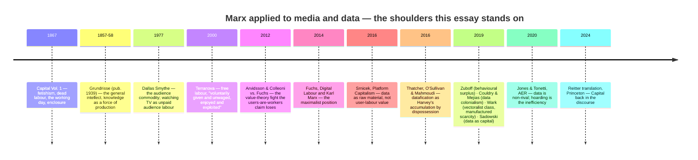
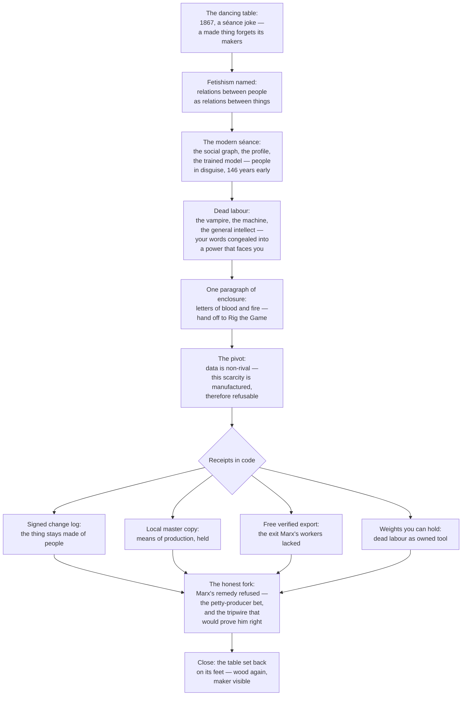

# A Blog Post On Marx's *Capital*: The Dancing Table, Data Fetishism, And xNet

> [!TIP]
> **TL;DR** — Write it as essay #22, provisional title **"The Dancing Table"**,
> slug `the-dancing-table`. The open lane is **commodity fetishism and dead
> labour**, not enclosure (*Rig the Game or Play* already owns that ground).
> The spine: Marx's séance-table image for a made thing that forgets its
> makers → the social graph and the trained model as the same trick at scale →
> provenance as de-fetishisation (the signed change log literally names the
> people inside the thing) → the honest fork, where xNet takes Marx's
> diagnosis and refuses his prescription. Use the diagnosis, not the politics.

## Problem Statement

What would a blog post based on Karl Marx's *Capital* look like as the next
entry in the series (`site/src/pages/blog/`)? *Capital* Volume 1 (1867) is
the most sustained analysis ever written of what happens when the things
people make together stop belonging to the people who made them — which is,
one sentence shorter, the thesis of this entire blog. But it is also the most
politically loaded book a software company can cite. The question is whether
there is an angle that is genuinely fresh for the series, honest about where
xNet departs from Marx, and safe from reading as either advocacy or
naïveté — and what the mechanics of shipping it are.

## Executive Summary

**Yes — write it**, and write it the way the series wrote Lanier
(exploration 0347): concrete image first, one big idea carried carefully, an
honest section that disagrees with the source. Five findings drive the shape:

1. **The lane that is open is fetishism, not enclosure.** The series has
   already spent its enclosure ammunition: *Rig the Game or Play* covers the
   Landlord's Game and monopoly-as-enclosure, *The Right to Say No* covers
   extraction economics, and the registry backlog already reserves "The
   Landlord's Game Was About Enclosure" for the Inclosure Acts. Chapter 26's
   "letters of blood and fire" can get one paragraph and a hand-off link. The
   untouched material is **Chapter 1, Section 4** — commodity fetishism — and
   the **dead labour** thread (Chapter 10's vampire, Chapter 15's machinery,
   the *Grundrisse*'s "general intellect"). No essay in the series has
   touched either.
2. **The opening image writes itself.** In the fetishism section Marx jokes
   that a table, once it becomes a commodity, "stands on its head, and
   evolves out of its wooden brain grotesque ideas" — a wink at the
   table-turning séance craze of the 1850s. A made thing gets up and dances,
   and the making disappears. That is a series-grade concrete opening
   (the loom, the vault, the furnace, the record store…), and it lands
   directly on the load-bearing sentence: a "definite social relation
   between men" assuming "the fantastic form of a relation between things."
   Your social graph is relations between people, repackaged as a *thing* a
   platform owns. The series already published this idea in modern dress —
   Lanier's "digital information is really just people in disguise" (*People
   in Disguise*) **is commodity fetishism restated** — which gives the essay
   its series-threading move: Marx got there 146 years earlier, from the
   other direction.
3. **The AI section is the freshest application.** "Capital is dead labour,
   that, vampire-like, only lives by sucking living labour" (Ch. 10) plus
   Ch. 15's worker who "becomes a mere appendage" to the machine, plus the
   *Grundrisse*'s knowledge become "a direct force of production" — this is
   an uncannily precise description of a foundation model: the accumulated
   past work of millions, congealed into a machine that then confronts the
   people who wrote it as an alien power. The essay must attribute the
   "general intellect" to the *Grundrisse* (1857–58 notebooks), **not** to
   *Capital*, and the xNet answer is already shipped and already titled:
   *Weights You Can Hold* — dead labour you own is just a tool.
4. **The economics must route around the weak analogy.** The academic fight
   over whether users literally produce surplus value (Fuchs) was lost on
   Marx's own terms (Arvidsson & Colleoni 2012; Srnicek's
   boom-that-never-came argument). The defensible chain is: user activity as
   **raw material** (Srnicek), accumulation as **dispossession** (Harvey via
   Thatcher et al. 2016), and — sharpest of all for xNet — **manufactured
   scarcity** (Wark 2019; Jones & Tonetti 2020): data is non-rival, so unlike
   land, the enclosure is not zero-sum necessity but a protocol choice.
   Scarcity is *made*, by the same class of technical decisions xNet makes
   differently.
5. **The honest fork is the intellectual heart** (the 0347 template).
   Marx's prescription was collective ownership; he had open contempt for
   the small-producer answer — everyone owning their own plot — as doomed
   petty-bourgeois nostalgia that reconcentrates. xNet's prescription **is**
   the small-producer answer, applied to data: every person owning their own
   means of production (local master copy, self-minted identity, exit rights)
   plus federation, betting that protocol design (MIT wire format, no ground
   rent, no take rate) can block the reconcentration Marx predicted. The
   essay should say plainly: we take the diagnosis and refuse the
   prescription, and Marx would have called us naïve — then make the case
   for why data's non-rivalry changes the arithmetic that made him right
   about land and looms.

> [!IMPORTANT]
> The essay uses *Capital* as a **diagnostic instrument, not a political
> programme**. That framing is not a disclaimer bolted on at the end; it is
> the structure — the final section exists to disagree with Marx, exactly as
> the Lanier essay's section 5 exists to refuse the micropayment half of data
> dignity. The series template for "take the diagnosis, refuse the
> prescription" is already established; this essay is its third use.

## Current State In The Repository

### Blog infrastructure (what a new post touches)

- **Registry**: `site/src/data/blog.ts` — hand-maintained `posts[]`, newest
  first by `pubDate`. Entry fields: `slug`, `title`, `description` (the
  deck), `pubDate` (ISO-8601 UTC, taken from the merge commit, never
  post-dated), `authors: ['crs48', 'claude']`, `tags`, `readingMinutes`,
  optional `draft: true` while authoring. Index and RSS derive from it.
- **Page**: `site/src/pages/blog/the-dancing-table.astro` — hand-authored,
  art-directed, en-GB, no third-party assets.
- **Series state**: 21 published essays; newest *The Matchmaker and the
  Meter* (2026-08-01). This is #22.

> [!WARNING]
> Two things the build will **not** catch if missed (learned on *Rig the
> Game or Play* and *The Harvest You Can Count*): the new post needs a
> **`heroArt` entry in `site/src/pages/blog/index.astro`** (the map at
> ~line 33) or the index card renders artless, and the essay needs a
> **`Sources` section** (see `the-matchmaker-and-the-meter.astro` ~line 263
> for the format). Both are conventions enforced by nobody but this
> checklist.

### The lane analysis — what the series has already said

| Essay | Ground it owns | Overlap risk for this post |
| --- | --- | --- |
| *Rig the Game or Play* | 🛑 Enclosure, the Landlord's Game, rent-as-rigging | High — keep Ch. 26 to one paragraph + link |
| *The Right to Say No* | 🛑 Extraction economics, leverage | Medium — cite, don't re-argue |
| *People in Disguise* | ⚠️ Provenance, "people in disguise" | The **bridge**, not a rival — cross-link deliberately |
| *Weights You Can Hold* | ⚠️ Local model weights | The AI section's landing pad — cite by title |
| *The Harvest You Can Count* | ✅ Legibility, what ledgers refuse to price | Adjacent only |
| *Palimpsest* | ✅ Economics of keeping everything | Adjacent only |
| Backlog: "The Landlord's Game Was About Enclosure" | 🛑 Reserved for the Inclosure Acts | This essay must not eat its material |

The fetishism/dead-labour lane touches none of the reserved ground and gives
both *People in Disguise* and *Weights You Can Hold* a 19th-century ancestor.

### The receipts — where xNet already answers the diagnosis

| Marx (source) | The data-economy form | xNet's structural answer | Primary code / doc |
| --- | --- | --- | --- |
| Social relations between people appear as "a relation between things" (Vol. 1, Ch. 1 §4) | The "social graph" as a platform-owned asset; the profile as commodity | Every change atom carries `authorDID` + an Ed25519 signature — the thing stays legibly made of people; de-fetishisation at the wire level | `packages/sync/src/change.ts` |
| "Capital is dead labour, that, vampire-like, only lives by sucking living labour" (Ch. 10 §1) | Foundation models: accumulated past work confronting its authors as an alien power | Local/BYO models — dead labour you own is a tool; metered AI billed at exact cost, never at attention | `packages/brain/`, `packages/cloud/src/ai/metered-gateway.ts` |
| The labourer "becomes a mere appendage" to the machinery (Ch. 15 §1) | The user as appendage to the feed; engagement as the working day | Calm charter axis, CI-enforced: no engagement machinery, no analytics SDKs | `docs/CHARTER.md` §3, `scripts/check-humane-patterns.mjs` |
| Expropriation "written … in letters of blood and fire" (Ch. 26); separation of producers from means of production | Data enclosure: reaching your own social world only through a platform | The master copy is local (OPFS SQLite); hubs are relays, not aggregators | `packages/data/src/store/store.ts` |
| The precondition of capital: producers who cannot walk away | Lock-in, egress fees, identity ransom | Free verified export (`.xnetpack`), self-minted `did:key`, no protocol tolls (MIT) | `packages/data/src/portability/`, `packages/identity/src/keys.ts`, `docs/CHARTER.md` §6 |
| Scarcity as the ground of value | **Manufactured** scarcity: protocols making abundant information scarce (Wark) | The wire format, client, and hub are MIT; entitlements are dependency-free; no rent on what you would own anyway | root `LICENSE`, `packages/entitlements/` |

No new revenue lane is proposed by this exploration, so the Charter §6
three-test gauntlet (improvement / BATNA / vanish) is not triggered — but the
essay should *cite* the "No ground rent" tests as the practical form the
refusal takes, the way *The Matchmaker and the Meter* cites the metered
connection rule.

## External Research

Full digest gathered from primary sources (marxists.org chapter texts fetched
and quote-verified; Princeton UP; the platform-Marxism literature). Condensed:

### The conceptual apparatus, verified

- **Commodity fetishism** — Vol. 1, Ch. 1, §4, "The Fetishism of Commodities
  and the Secret Thereof". Verified sentence (Moore/Aveling 1887): "There it
  is a definite social relation between men, that assumes, in their eyes,
  the fantastic form of a relation between things." The dancing-table
  passage is in the same section (the wooden brain, table-turning) — exact
  wording to be re-verified against the chosen translation at draft time.
- **The vampire** — Vol. 1, Ch. 10, §1. Verified wording: "Capital is dead
  labour, that, vampire-like, only lives by sucking living labour, and lives
  the more, the more labour it sucks." The commonly quoted "which,
  vampire-like, lives only by sucking" is a paraphrase — quote the 1887 text
  and name the translation.
- **Machinery** — Vol. 1, Ch. 15. Verified: the labourer "becomes a mere
  appendage to an already existing material condition of production" (§1).
  The sharper aphorism "in the factory, the machine makes use of him" is
  reported for §4 but was **not** surfaced by the fetch — verify before
  quoting. The famous "appendage of the machine" most people remember is
  actually the *Communist Manifesto*.
- **Primitive accumulation** — Part VIII, Chs. 26–33. Verified: "This
  primitive accumulation plays in Political Economy about the same part as
  original sin in theology" and "letters of blood and fire" (both Ch. 26).
- **General intellect** — **not in *Capital***. It is the *Grundrisse*'s
  "Fragment on Machines" (Notebook VII, 1857–58, unpublished until 1939).
  Verified at `grundrisse/ch14.htm`: machines as "organs of the human brain,
  created by the human hand; the power of knowledge, objectified"; the
  worker who "steps to the side of the production process" to become its
  "watchman and regulator". This fragment is the bridge to the entire
  digital-labour literature.

<details>
<summary>Publication and translation details (for the essay's framing paragraph)</summary>

- First edition: *Das Kapital. Kritik der politischen Oekonomie. Erster
  Band*, published 14 September 1867 by Verlag von Otto Meissner, Hamburg;
  first print run 1,000 copies. Only Vol. 1 appeared in Marx's lifetime;
  Engels edited Vols. 2 (1885) and 3 (1894) from manuscripts.
- English translations: **Moore/Aveling 1887** (ed. Engels, Swan
  Sonnenschein; the public-domain text on marxists.org — this is the one to
  quote and link); **Ben Fowkes 1976** (Penguin/NLR, intro Mandel; the
  scholarly standard); **Paul Reitter 2024** (ed. Reitter & Paul North,
  Princeton UP, 17 Sep 2024 — first new English translation in ~50 years,
  based on the second German edition, the last Marx revised; confirmed via
  the Princeton UP page). The Reitter edition's existence is a nice hook:
  the book is having a moment.
- ⚠️ **Project Gutenberg does not carry *Capital* Vol. 1 in English** —
  ebook #46423 is the 1859 *Contribution to the Critique of Political
  Economy*, and Standard Ebooks lists only a placeholder. Link marxists.org,
  nothing else.

</details>

### The lineage this essay stands in



The one-line positions, for the essay's middle third:

- **Smythe (1977)**: the ancestor — broadcast audiences are the commodity;
  attention is unpaid work. Everyone below is downstream.
- **Terranova (2000)**: digital free labour is structural, not incidental —
  built on the post-workerist reading of the general intellect.
- **Fuchs (2014)**: users literally produce surplus value; Facebook and
  Foxconn on one continuum. The maximalist claim the essay must *not* adopt.
- **Srnicek (2016)**: rejects Fuchs on Marx's own terms — if free user
  activity were surplus labour, capitalism had found an infinite frontier
  and the boom would show; user activity is **raw material**, the labour is
  the engineers'. The sober middle the essay routes through.
- **Zuboff (2019)**: "behavioural surplus" — experience claimed as free raw
  material. Deliberately *not* Marxist (her "surplus" is not surplus value),
  yet she revives the vampire image herself; the left critique (Morozov's
  "Capitalism's New Clothes") is that dropping Marx costs her the ability to
  explain *why* the extraction imperative exists.
- **Couldry & Mejias (2019)**: data colonialism — the analogy is to land
  grab and enclosure (life → data as work → labour), not the wage relation.
- **Wark (2019)**: the "vectoralist class" rules by owning information flows
  and "the legal and technical protocols for making otherwise abundant
  information scarce". The single most xNet-shaped sentence in the
  literature.
- **Sadowski (2019)**: data as a distinct form of capital; accumulation as
  extraction "with little regard for consent and compensation".
- **Jones & Tonetti (2020, AER)**: data is non-rival; the same data can
  serve many users at once; hoarding is the inefficiency and consumer data
  property rights get near-optimal allocation. Mainstream-economics cover
  for the essay's structural claim.

### The criticisms the essay must pre-empt

- **The labour-theory-of-value trap.** Do not claim users produce surplus
  value. Arvidsson & Colleoni showed the claim fails on time-based value
  theory; Srnicek's raw-material framing survives. The essay's fetishism and
  dead-labour arguments never needed the value claim anyway.
- **Users aren't workers.** No wage, no contract, no working day — so
  Ch. 10's machinery of struggle (Factory Acts) has no direct analogue.
  GDPR-as-Factory-Act is suggestive colour, not structure. One sentence,
  flagged as analogy.
- **Data is not land.** Non-rivalry (Jones & Tonetti) breaks the enclosure
  analogy's zero-sum premise — and that is the essay's *pivot*, not its
  embarrassment: the scarcity is manufactured (Wark), therefore refusable
  (xNet). The weakness of the analogy is the strength of the position.
- **"Data is the new oil" fatigue.** Data is not found, it is co-produced by
  instrumentation. Avoid the extraction-metaphor cliché family entirely;
  fetishism gives the essay better images than oil derricks.

## Key Findings

1. **Fetishism is the series' missing ancestor concept.** Two shipped essays
   (*People in Disguise*, *The Vault and the View*) argue that data is
   people-in-relation disguised as an ownable thing. Ch. 1 §4 is the
   original statement of that inversion, with a better opening image than
   either essay found. The series gains depth by acknowledging its lineage.
2. **The signed change log is de-fetishisation, literally.** Fetishism =
   the social origin of a thing becoming invisible in the thing. A
   hash-chained log where every atom names its author
   (`packages/sync/src/change.ts`) is the origin made *un*-losable. This is
   the essay's strongest single receipt, and it is the same receipt the
   Lanier essay used for two-way links — the two essays confirm each other.
3. **The AI passage needs exactly one careful footnote.** The
   dead-labour-vampire → foundation-model mapping is vivid and defensible,
   but "general intellect" must be attributed to the *Grundrisse*, the
   vampire must be quoted in the named translation, and the machine that
   "makes use of him" must be re-verified or dropped. Sloppy Marx quotation
   is the most-policed quotation genre on the internet.
4. **The honest fork has real intellectual content, not just balance.**
   Marx's case against small-producer ownership was that it reconcentrates —
   petty producers get outcompeted, mortgaged, and absorbed. The essay's
   counter is specific: reconcentration ran on rivalrous inputs (land,
   machines) and distribution chokepoints; data is non-rival and the
   protocol is MIT, so holding your own copy costs the network nothing and
   the chokepoints are the only thing left to refuse — which is what the
   Charter's "No ground rent" tests refuse. Marx's prediction becomes a
   falsifiable design constraint: **if xNet ever charges rent on access to
   what you'd own anyway, the reconcentration thesis wins.** That gives the
   essay a stake, not just an opinion.
5. **Political risk is managed by structure, not softening.** The essay
   never endorses a programme; it reads a 159-year-old diagnostic against
   shipped code, disagrees with the author's remedy in plain sight, and
   keeps every quote short, translated, and attributed. The series has twice
   shipped this shape (Lanier's refused micropayments; Monopoly's Georgist
   framing) without reading as manifesto.

### How the essay's argument flows



## Options And Tradeoffs

| Option | Shape | Pros | Cons |
| --- | --- | --- | --- |
| **A. The fetishism essay** (recommended) | Dancing table → fetishism → dead labour/AI → non-rivalry pivot → receipts → honest fork | Fresh lane; best opening image; threads two shipped essays; the fork has real content | Demands quotation discipline; Marx draws hot takes regardless of care |
| B. The enclosure essay | Ch. 26–27 → data enclosure → data colonialism | Strongest existing literature (Couldry & Mejias, Harvey) | 🛑 Lane occupied by *Rig the Game or Play* + reserved backlog essay; third enclosure essay in a year |
| C. The digital-labour essay | Smythe → Terranova → Fuchs vs. Srnicek → verdict | Intellectually rigorous | Reads as a literature review; hinges on the value-theory fight, which is inside baseball and a loss for the vivid version |
| D. The working-day essay | Ch. 10 → attention economy → the fight over hours as the fight over feeds | Vampire quote lives here; Factory Acts / GDPR rhyme | Users-aren't-workers objection hits this shape hardest; Calm-axis ground partly covered by series already |

**Recommendation: A, absorbing the best of C and D.** Srnicek's raw-material
correction becomes one honest paragraph inside A's middle; the vampire quote
opens the dead-labour section without importing D's whole frame.

## Recommendation

Ship **essay #22**: slug `the-dancing-table`, title **"The Dancing Table"**,
tags `['essay', 'economics', 'philosophy']`, authors `['crs48', 'claude']`,
~13 minutes. Fallback titles: *"The Wooden Brain"*, *"Made Scarce"*.

Proposed deck (for `blog.ts`):

> In 1867, in the middle of the driest book ever written about money, Karl
> Marx cracked a joke about a séance: make a table into a commodity and it
> stands on its head, dancing with ideas of its own. The trick — things made
> by people, forgetting their makers — is now the business model of the
> social graph and the training corpus alike. On commodity fetishism as the
> oldest description of the data economy, what it takes to build software
> that refuses the trick, and the one place we part company with Marx.

Section sketch (en-GB, series voice, humanize skill applied):

1. **The table that danced** — Hamburg, 1867, 1,000 copies; the séance craze;
   the wooden brain. Fetishism in one move: the relation between people
   vanishes into the thing.
2. **The modern séance** — the social graph as owned object; the profile as
   commodity; cross-link *People in Disguise* ("Lanier found the same door
   from the other side"). One paragraph of enclosure with the blood-and-fire
   quote, handed off to *Rig the Game or Play*.
3. **Dead labour, standing up** — the vampire (Ch. 10, quoted exactly,
   translation named); the machine the worker tends (Ch. 15); the
   *Grundrisse*'s general intellect, attributed as such; the foundation
   model as the general intellect privatised. Srnicek's correction carried
   honestly: you are not the worker here — you are the field being
   harvested, which is worse.
4. **The manufactured famine** — data is non-rival (Jones & Tonetti); Wark's
   protocols that make abundance scarce; scarcity as a design decision,
   which means it can be designed away.
5. **Receipts** — the signed change log (the thing stays made of people);
   the local master copy; free verified export; weights you can hold; the
   Charter's "No ground rent" tests as the refusal in writing. Shipped code
   only, paths linkable.
6. **The fork** — Marx's remedy vs. the petty-producer bet; why he'd call
   this naïve; why non-rivalry changes the reconcentration arithmetic; the
   falsifiable tripwire (the day xNet charges ground rent, he was right).
7. **Close** — the table set back on its feet: wood, joinery, and the name
   of whoever made it.

## Example Code

Registry entry (`site/src/data/blog.ts`, prepended to `posts[]`):

```ts
{
  slug: 'the-dancing-table',
  title: 'The Dancing Table',
  description:
    'In 1867, in the middle of the driest book ever written about money, ' +
    'Karl Marx cracked a joke about a séance: make a table into a commodity ' +
    'and it stands on its head, dancing with ideas of its own. The trick — ' +
    'things made by people, forgetting their makers — is now the business ' +
    'model of the social graph and the training corpus alike. On commodity ' +
    'fetishism as the oldest description of the data economy, what it takes ' +
    'to build software that refuses the trick, and the one place we part ' +
    'company with Marx.',
  pubDate: '2026-08-XXT00:00:00Z', // from the merge commit at publish
  authors: ['crs48', 'claude'],
  tags: ['essay', 'economics', 'philosophy'],
  readingMinutes: 13,
  draft: true // drop when shipping
}
```

Plus the `heroArt` entry in `site/src/pages/blog/index.astro` (the map at
~line 33) — the build stays green without it, so it is checklist-enforced.

## Risks And Open Questions

- **Reading as advocacy.** The largest risk. Mitigated structurally (section
  6 disagrees with Marx on his central remedy; the essay's stake is a
  tripwire against *ourselves*), and tonally: no "late capitalism" register,
  no programme, the séance joke keeping the temperature down. The series
  precedent (Georgism in *Rig the Game*, refused micropayments in *People in
  Disguise*) shows the shape lands.
- **Quotation discipline.** Marx misquotation is a competitive sport. Every
  quote <15 words, in quotation marks, from the Moore/Aveling 1887 text as
  hosted on marxists.org, translation named once in the Sources. The
  "machine makes use of him" line is unverified — confirm in `ch15.htm` §4
  or cut. "General intellect" is *Grundrisse*, never *Capital*.
- **The value-theory trap.** One reviewer pass specifically checking the
  essay never implies users produce surplus value. Srnicek's correction is
  in the essay *as armour*.
- **Gutenberg fabrication hazard.** *Capital* Vol. 1 is **not** on Project
  Gutenberg in English (#46423 is the 1859 *Critique*). Sources link
  marxists.org only. (Per the food-forests rule: a 403 is a bot-block; a
  404 in our own Sources list is a fabrication.)
- **Series fatigue on economics.** Three of the last five essays carry the
  `economics` tag. The counterweight: this one is really a *philosophy*
  essay wearing economics — the fetishism material is metaphysics of
  making, and the AI section is new ground for the series.
- **Open**: whether the Reitter 2024 translation earns a sentence (the
  "*Capital* is having a moment" hook) or dates the essay; hero art
  direction (a table mid-turn, wood grain?); exact `pubDate`.

## Implementation Checklist

- [ ] Invoke the `humanize` skill before drafting (house style: conversational,
      short words, no lists in essays), then draft
      `site/src/pages/blog/the-dancing-table.astro` per the section sketch —
      en-GB, art-directed, no third-party assets, `Sources` section in the
      series format.
- [ ] Verify every Marx quote against the marxists.org chapter files
      (`ch01.htm` §4 incl. the dancing-table wording, `ch10.htm` §1 vampire,
      `ch15.htm` §1/§4, `ch26.htm`, `grundrisse/ch14.htm`); name the
      Moore/Aveling 1887 translation once; confirm-or-cut the "machine makes
      use of him" line.
- [ ] Verify the xNet receipts against code as cited: `authorDID`/signature
      fields in `packages/sync/src/change.ts`, local store, portability,
      `check-humane-patterns.mjs`, Charter §3/§6.
- [ ] Add the registry entry to `site/src/data/blog.ts` with `draft: true`.
- [ ] Add the `heroArt` entry in `site/src/pages/blog/index.astro`.
- [ ] Read-through for the three tone rules: no advocacy register, no implied
      posthumous endorsement, no surplus-value claim about users; the fork
      section carries the disagreement.
- [ ] `pnpm build` the site (not `astro dev`) and check the page, the index
      card (hero art renders), and prev/next threading from *The Matchmaker
      and the Meter*.
- [ ] Set `pubDate` from the merge commit, drop `draft`, update
      `readingMinutes` from the final word count.
- [ ] PR with `skip-changelog` label (site-only), DCO sign-off on every
      commit, merge-commit per repo convention, CI green before merge.

## Validation Checklist

- [ ] Post renders in the production build; appears in `/blog` index and RSS
      with correct metadata; index card shows hero art.
- [ ] `seriesNeighbors()` threads it as #22 (prev: *The Matchmaker and the
      Meter*).
- [ ] No third-party network requests on the page.
- [ ] Every Marx quote in the shipped essay is <15 words, quoted, attributed
      to chapter and translation; a sceptical reader can find each on
      marxists.org from the Sources section.
- [ ] Every xNet receipt is verifiable by following a link or file path.
- [ ] en-GB spelling throughout; `tellscan.mjs` (humanize skill) shows no
      elevated tells.

## References

**Primary Marx sources (quote-verified by fetch)**

- *Capital* Vol. 1, Moore/Aveling 1887, marxists.org:
  ToC <https://www.marxists.org/archive/marx/works/1867-c1/>;
  Ch. 1 (fetishism) <https://www.marxists.org/archive/marx/works/1867-c1/ch01.htm>;
  Ch. 10 (working day, vampire) <https://www.marxists.org/archive/marx/works/1867-c1/ch10.htm>;
  Ch. 15 (machinery) <https://www.marxists.org/archive/marx/works/1867-c1/ch15.htm>;
  Ch. 26 (primitive accumulation) <https://www.marxists.org/archive/marx/works/1867-c1/ch26.htm>
- *Grundrisse*, "Fragment on Machines" (general intellect):
  <https://www.marxists.org/archive/marx/works/1857/grundrisse/ch14.htm>
- Reitter translation (Princeton UP, 2024):
  <https://press.princeton.edu/books/hardcover/9780691190075/capital>
- Publication history: <https://en.wikipedia.org/wiki/Das_Kapital>
- ⚠️ Not-a-source: <https://www.gutenberg.org/ebooks/46423> is the 1859
  *Critique*, not *Capital*.

**The platform-Marxism literature**

- Smythe, "Communications: Blindspot of Western Marxism" (1977).
- Terranova, "Free Labor," *Social Text* 18(2), 2000:
  <https://read.dukeupress.edu/social-text/article-abstract/18/2%20(63)/33/33433/Free-LaborPRODUCING-CULTURE-FOR-THE-DIGITAL>
- Arvidsson & Colleoni, *The Information Society* 28(3), 2012; Fuchs's
  rejoinder, *tripleC* 10(2), 2012:
  <https://www.triple-c.at/index.php/tripleC/article/view/434>
- Fuchs, *Digital Labour and Karl Marx* (Routledge, 2014):
  <https://www.routledge.com/Digital-Labour-and-Karl-Marx/Fuchs/p/book/9780415716161>
- Srnicek, *Platform Capitalism* (Polity, 2016).
- Thatcher, O'Sullivan & Mahmoudi, "Data colonialism through accumulation by
  dispossession," *EPD* 34(6), 2016:
  <https://journals.sagepub.com/doi/10.1177/0263775816633195>
- Zuboff, *The Age of Surveillance Capitalism* (2019); left critique:
  <https://marxandphilosophy.org.uk/reviews/17332_the-age-of-surveillance-capitalism-the-fight-for-a-human-future-at-the-new-frontier-of-power-by-shoshana-zuboff-reviewed-by-pierluca-damato/>;
  Morozov, "Capitalism's New Clothes," *The Baffler*, 2019.
- Couldry & Mejias, *The Costs of Connection* (Stanford UP, 2019):
  <https://colonizedbydata.com/>
- Wark, *Capital Is Dead* (Verso, 2019).
- Sadowski, "When data is capital," *Big Data & Society* 6(1), 2019, DOI
  10.1177/2053951718820549 (Sage page 403s to bots; citation cross-verified):
  <https://journals.sagepub.com/doi/10.1177/2053951718820549>
- Jones & Tonetti, "Nonrivalry and the Economics of Data," *AER* 110(9),
  2020: <https://www.aeaweb.org/articles?id=10.1257%2Faer.20191330>
- Boyle, "The Second Enclosure Movement" (2003) — the IP-commons ancestor of
  the data-enclosure analogy.

**Repository**

- `docs/CHARTER.md` §3 (Calm), §6 (No ground rent)
- `packages/sync/src/change.ts` (authorDID + Ed25519 signature per change)
- `packages/data/src/store/store.ts`; `packages/data/src/portability/`
- `packages/identity/src/keys.ts`; `packages/entitlements/`
- `packages/brain/`; `packages/cloud/src/ai/metered-gateway.ts`
- `scripts/check-humane-patterns.mjs`
- `site/src/data/blog.ts`; `site/src/pages/blog/index.astro` (`heroArt`)
- Explorations: 0347 (Lanier — the "diagnosis without prescription"
  template), 0363 (*Rig the Game* — the enclosure lane), 0292 (*Weights You
  Can Hold*), 0245 (*The Right to Say No*), 0351 (No-ground-rent tests),
  0269/0239 (blog infrastructure)
