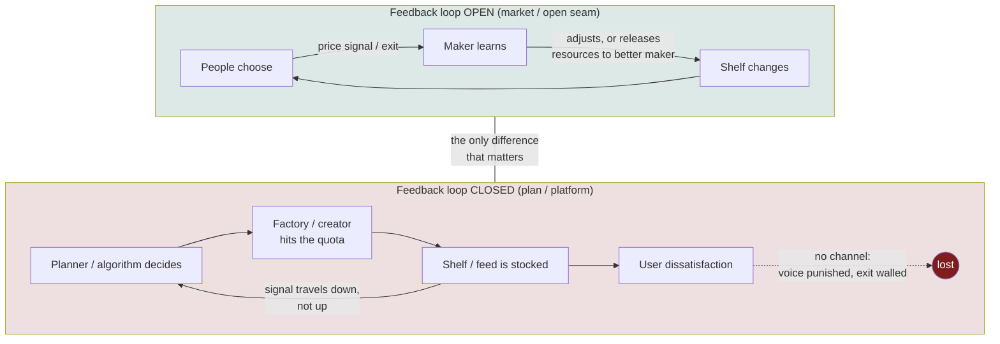

# Blog Post — "The Wall Faces Inward": Feedback, Planning, and Platforms

> [!TIP]
> **TL;DR** — Write the essay. Source material is Maxinomics'
> ["The Simple Question Socialism Couldn't Answer"](https://www.youtube.com/watch?v=mMHyhneAxXY)
> (the economic calculation problem, told through the Berlin natural
> experiment). The xNet essay is **not** a recap and **not** a
> capitalism-vs-socialism take: it argues that the interesting variable was
> never markets vs planning but **whether the feedback loop is allowed to
> close** — and that today's platforms, capitalist to the bone, run planned
> economies over your attention and your data, complete with the one detail
> that gives the essay its title: the guard towers faced inward. Title
> **"The Wall Faces Inward"**, slug `the-wall-faces-inward`, tags
> `['essay', 'economics', 'philosophy']`, ~13 minutes.

> [!NOTE]
> **Numbering + succession.** A sibling worktree independently claimed 0441
> for a Marx *Capital* essay plan ("The Dancing Table") in the same hour;
> this doc was committed first and keeps the number (collision rule:
> earliest commit wins). That session then authored **0443 "The Table and
> the Wall"** (unmerged at the time of writing), which merges both parents
> into one essay plan — when 0443 lands, the essay is written from 0443 and
> this doc stands as its calculation-problem parent.

## Problem Statement

The prompt: write a blog post based on the Maxinomics video. The video is a
90k-view explainer on why centrally planned economies failed — scarcity,
feudalism → enclosures → Marx, the profit-is-unpaid-labour claim, and then
its centrepiece: Berlin 1949–1989 as "the finest grand natural experiment the
world has ever run", two grocery stores twenty minutes apart, one stocked by
shoppers' choices and one stocked by a ledger drawn up a thousand miles away.

A straight recap would be worthless — that video already exists and it is
good. The exploration question is: **what does xNet specifically have to say
that the video cannot?** The answer sits in the video's own blind spot. It
frames the lesson as socialism-vs-capitalism and closes with "who owns what
and who gets to decide?" — without noticing that the most-used allocation
systems on Earth today are not markets at all. A feed is a plan. A ranking
algorithm is an Office of Prices. And the companies that run them are the
most capitalist institutions in history. The mechanism the video documents —
feedback loss, quota-chasing, walls that face inward — describes the modern
platform economy uncannily well, and xNet's charter positions (no ground
rent, no egress fees, verified export) are precisely the "open seam" that the
mechanism says you must never close.

This follows the discipline from
[0417](./0417_[x]_DATING_APPS_CONNECTION_NOT_PROFIT.md): the video is the
**story**; the essay must be the **mechanism**. And like
[0363](<./0363_[x]_BLOG_POST_RIG_THE_GAME_OR_PLAY_MONOPOLY_AS_BAD_GAME_DESIGN.md>),
it needs an honesty beat — the video rounds at least one number up, and the
essay must not inherit the rounding.

## Executive Summary

The essay's spine, in six beats:

1. **Open with the detail, not the debate.** When the Berlin Wall went up in
   1961, everything about it — guard towers, dog runs, tripwires — faced
   inward. A wall that faces outward is a defence. A wall that faces inward
   is a confession: the system knows which way people would walk.
2. **The two grocery stores.** The video's strongest material, compressed:
   one store where every basket is a ballot that travels *up* to the maker,
   one store where the shelf was decided months ago in a room and the signal
   travels *down* to a factory whose job is the quota, not the customer.
   East Berlin carried one mustard. Not because nobody wanted a second
   mustard — because no channel existed for wanting to matter.
3. **Name the real variable.** This is where the essay leaves the video
   behind. Mises (1920) and Hayek (1945) framed it as calculation and
   knowledge; Hirschman (1970) gives the sharper tool: **exit and voice**.
   The plan failed not because planners were stupid but because every
   feedback channel was closed — prices couldn't speak, complaint was
   career-limiting, and exit was 2.7 million people quietly taking a metro
   ticket west until a wall closed that channel too. Systems don't fail when
   they make mistakes. They fail when they stop being able to *hear* their
   mistakes.
4. **The turn: the plan came back wearing a growth deck.** Coase (1937)
   noted every firm is a planned economy inside; that's fine — firms face
   external feedback. But a platform at scale internalises the market that
   was supposed to discipline it. The feed decides what's on your shelf.
   Engagement is the quota, and Goodhart's law does to engagement what quota
   fever did to Soviet nails — the metric gets hit while the thing it proxied
   quietly dies. Creators optimise for the plan, not the reader (the
   thumbnail *is* the dense loaf that fills the quota faster than
   croissants). And when you stop wanting what the feed serves, no material
   is released to a better maker — the algorithm was never yours to release.
5. **The honest complications, stated not buried.** (a) Platforms are
   capitalist firms — so this is not "socialism bad"; the mechanism is
   indifferent to ideology, it only cares whether feedback can close.
   (b) Engagement *is* a signal — the problem is it's a quota-shaped one,
   measuring what's easy to count. (c) The video's life-expectancy
   "completely erased by 1999" claim overstates the literature — near-full
   convergence for women, a persistent ~1-year gap for men into the 2010s —
   and the essay says so.
6. **Land it on the seam.** The signal a planner cannot fake, dilute, or
   A/B-test away is exit. That is why the wall was built, and it is why
   lock-in — egress fees, proprietary formats, contexts that don't travel —
   is not a growth tactic but the oldest move in the planner's playbook.
   xNet's positions (no egress fees, verified free export, no ground rent)
   are one company deciding, in writing, that its wall will never face
   inward. Close on the video's own closing question — "who owns what, and
   who gets to decide?" — pointed at data.

---

## Source Video

How the transcript was obtained (0417 said it couldn't be)

Memory 0417 recorded YouTube transcripts as unfetchable (`oembed` gives title
only). That is no longer the whole story, but the ladder got longer:

1. `oembed` — title/author only. ✅ works, insufficient.
2. In-page `timedtext` caption URL from `ytInitialPlayerResponse` — returns
   **HTTP 200 with an empty body** (YouTube now requires a proof-of-origin
   token). ❌
3. In-page `youtubei/v1/get_transcript` innertube call — **400
   `FAILED_PRECONDITION`** from a fresh Playwright profile. ❌
4. `pip install yt-dlp`, then
   `yt-dlp --skip-download --write-subs --write-auto-subs --sub-langs "en.*"` —
   ✅ **works**, manual + ASR VTT tracks, no cookies needed. Strip cue
   timestamps and dedupe consecutive lines for a clean ~30k-char transcript.

Update for future sessions: **yt-dlp is the transcript path**; browser-side
scraping of the transcript panel fails even when the panel exists.

The video (Maxinomics, ~25 min, sponsored segment excluded) in one paragraph:
scarcity → feudalism → the shift from "fight for me" to "pay me taxes" makes
land tradeable → enclosures create the propertyless factory class → Marx
(biographical sketch: poverty, Engels' mill money funding the anti-mill book,
11 people at the funeral) → "profit is unpaid labour" → but *Capital* offers
no design for the other side, leaving "how do you know what to make?"
unanswered → two grocery stores thought experiment → Berlin: airlift,
2.7M exits 1949–61, "nobody has the intention of building a wall", the wall →
the East Berlin planning chain reconstructed from historical documents
(Politburo five-year plan → State Planning Commission's physical-unit ledger,
~2,000 commodities → eight wage bands → the Office of Prices working
backwards from "bread should be ≤1% of the lowest wage" → Ministry of Trade
quotas by district) → outcomes (3,000 vs 10,000+ SKUs; the Trabant unchanged
for 30 years with ten-year waiting lists; the life-expectancy gap) → why:
incentives at every layer point at the quota, bad news cannot travel up,
power concentrates (Stalin 29 yrs, Mao 27, Castro 49) → Nordics are
explicitly *not* this (free markets + taxes + safety net) → closes on "who
owns what and who gets to decide?"

The full cleaned transcript is in the session scratchpad; it is not committed
(fair-use: the essay paraphrases and quotes at most one short line).

## Current State In The Repository

### What the essay stands on

| Repo source | What the essay borrows |
| --- | --- |
| [`docs/ECONOMICS.md`](../ECONOMICS.md) §1 | "Rent is a cliff" — a company defending a cliff builds walls; the Gates 1996 sleep-loss email |
| [`docs/CHARTER.md`](../CHARTER.md) §"No ground rent" | The refused rents, each with a receipt — the essay's closing rule set |
| [`packages/data/src/portability/`](../../packages/data/src/portability/) | `.xnetpack` verified export (0344) — the "open seam" is shipped code, not a promise |
| [0358](./0358_[x]_VALUE_CAPTURE_WITHOUT_ENCLOSURE_MOATS_SUBSTRATES_AND_THE_SLEEP_TEST.md) | Rent fails discontinuously — why cliff-defenders escalate |
| [0438](./0438_[_]_MATCHING_AT_COST_THE_PEOPLE_INDEX_AND_THE_AGGREGATION_HUB.md) | Aggregation theory: demand capture is the modern chokepoint |
| [0417](./0417_[x]_DATING_APPS_CONNECTION_NOT_PROFIT.md) | The video→essay discipline: villain story in, mechanism story out |

### Where it sits among the published essays

The economics essays so far argue **fairness/harm** (The Right to Say No,
People in Disguise), **game design** (Rig the Game or Play), **pricing
mechanics** (The Matchmaker and the Meter), and **stewardship** (Data Should
Work Like Soil). The lever this essay adds is **cybernetic**: extraction
isn't just unfair or unfun, it is *deaf* — a system that closes its feedback
channels loses the ability to know what to make, whoever owns it. No
existing essay makes the feedback/planning argument; The Matchmaker and the
Meter is the nearest neighbour (prices as honest signals) and should be
cross-linked.

### Blog conventions that bite (from 0363/0368/0364 + memory)

- `site/src/pages/blog/<slug>.astro` — **`.astro`, not MDX**; en-GB spelling.
- **`heroArt` entry in `blog/index.astro` AND a `Sources` section** — miss
  either and the build still passes (0363, 0368). Both are checklist items.
- Source links: **403 = bot-block (fine), 404 = fabrication (not fine)**
  (0368).
- RSS picks the post up from the collection automatically.
- Revision transparency: essays are revisable; commit ≠ revision (0364).
- POSSE: merging to main syndicates the new post to Bluesky **only if
  `BLUESKY_APP_PASSWORD` is set** — currently dormant (0432), no action
  needed.
- `/humanize` before PR: the corpus is already clean; run `tellscan.mjs` and
  fix only elevated tells + the three standing rules (0684 rules:
  conversational tone, no lists) — generic de-AI advice damages this corpus.

## External Research

The canon, in the order the essay uses it:

| Work | Year | What it contributes |
| --- | --- | --- |
| Mises, *Economic Calculation in the Socialist Commonwealth* | 1920 | The original claim: without prices on capital goods, rational allocation is impossible |
| Hayek, *The Use of Knowledge in Society* (AER) | 1945 | Prices as a telecommunications system for dispersed, tacit knowledge |
| Lange, *On the Economic Theory of Socialism* | 1936 | The strongest counter: simulate the auctioneer. Honest to name; the Politburo never tried it |
| Coase, *The Nature of the Firm* | 1937 | Every firm is a planned economy inside — the boundary is where feedback lives |
| Hirschman, *Exit, Voice, and Loyalty* | 1970 | The essay's engine: systems die when both exit and voice are closed |
| Spufford, *Red Plenty* | 2010 | Texture: the planners were brilliant and earnest; the tragedy is structural, not moral |
| Shalizi, "In Soviet Union, Optimization Problem Solves You" | 2012 | The computational-complexity coffin for planning; also warns *firms* hit the same wall |
| Phillips & Rozworski, *The People's Republic of Walmart* | 2019 | Prior art for beat 4 — corporations as planned economies. The essay flips its conclusion |
| Ellickson / Goodhart (via Strathern's phrasing) | 1975/1997 | "When a measure becomes a target, it ceases to be a good measure" — engagement as quota |

Fact-checks on the video's empirical spine:

- **Life expectancy**: the video claims the East–West gap "completely
  erased" by 1999. [Max Planck Institute for Demographic
  Research](https://www.mpg.de/9655128/germany-regional-life-expectancy)
  ([ScienceDaily
  summary](https://www.sciencedaily.com/releases/2015/09/150922150055.htm)):
  convergence was fast but the video rounds up — women's gap effectively
  closed (0.1 yr by 2013); men's was still ~1.2 yr in 2013. Related:
  ["three hours of life per
  euro"](https://www.sciencedaily.com/releases/2014/10/141015085752.htm) of
  post-unification transfers. **The essay uses the accurate version** — it
  is still a stunning result and honesty is the house style.
- **2.7M exits 1949–1961**: standard documented figure (Berlin Wall
  Memorial / Bundeszentrale für politische Bildung give ~2.5–2.7M) — verify
  live link at writing time.
- **Trabant waiting lists 10+ years, used cars above new**: well documented;
  cite a durable source (e.g. Deutsches Museum / contemporary reporting),
  not a listicle.
- **"Nobody has the intention of building a wall"** — Walter Ulbricht,
  15 June 1961, wall began 13 August 1961 (59 days). Solid; easy primary
  citation.

## Key Findings

> [!IMPORTANT]
> The essay's load-bearing move is refusing the video's frame. The variable
> is not markets vs planning, private vs public, left vs right. It is
> **open-loop vs closed-loop**. Berlin is the cleanest controlled experiment
> ever run on feedback loss — and the modern feed reproduces the closed-loop
> architecture inside nominally market institutions.

The mapping that carries beat 4 (use sparingly in the essay — two or three
rows in prose, never as a table):

| East Berlin (from the video's planning chain) | Platform economy |
| --- | --- |
| Politburo sets priorities for five years | Ranking team sets the objective function |
| Office of Prices works backwards from decreed ratios | Algorithmic pricing/reach: opaque, decreed, appealable nowhere |
| Factory's job is the quota, not the customer | Creator's job is engagement, not the reader |
| Dense loaves beat croissants (quota per hour) | Clickbait beats craft (engagement per hour) |
| One mustard: wanting has no channel | Monoculture feed: the long tail is stocked but unreachable |
| Bad news cannot travel up | Metrics dashboards measure the quota, not the deadweight loss |
| Exit closed by a wall that faces inward | Exit closed by egress fees, lock-in, non-portable context |

Anti-mapping (the essay must concede these or it becomes the mirror-image
propaganda of what it critiques):

- Platforms have competitors and users *can* leave — the wall is made of
  switching costs, not concrete. The essay's claim is about the *direction
  of effort*: cliff-defenders invest in raising exit costs (ECONOMICS.md §1),
  which is planner logic.
- Engagement is a real signal with real feedback — Goodhart-corrupted, not
  absent. East Berlin is the limit case, not the description.
- The video's Nordic point survives: taxes + safety nets are orthogonal to
  the loop question. Keep the essay entirely out of electoral politics; the
  US "democratic socialist" clips from the video do not appear.

## Options And Tradeoffs

| Option | Angle | Verdict |
| --- | --- | --- |
| A. Straight recap/react | Summarise the video, add commentary | 🛑 No xNet value-add; the video does it better |
| B. "Platforms are planned economies" | People's-Republic-of-Walmart flip | 🚧 Strong but arrives at critique without a landing |
| C. "Exit is the signal" (Hirschman) | Lock-in as the wall; portability as the seam | 🚧 The landing, but needs B's setup to earn it |
| D. **B + C: mechanism then seam** | Berlin → feedback loss → feed-as-plan → exit → xNet receipts | ✅ **Recommended** — setup earns the landing; landing pays off the setup |

No new revenue lane is proposed, so the Charter §6 three-test gauntlet does
not apply; the essay instead *cites* the already-tested "No ground rent"
receipts as its close.

## Recommendation

Write it as Option D. **Title: "The Wall Faces Inward."** Slug
`the-wall-faces-inward`. Tags `['essay', 'economics', 'philosophy']`.
~2,800–3,200 words, ~13 min. Structure per the six beats in the Executive
Summary; hero art in the house geometric style (a wall cross-section with
every fixture pointing in). One short video quote maximum; everything else
paraphrased with the video credited prominently in Sources as the piece that
prompted the essay.

Tone guards: en-GB; conversational; no bulleted lists in the essay body; no
US-politics vocabulary ("socialism" appears only as the historical system
under discussion, never as a live political label); the honesty beat about
the life-expectancy rounding stays in.

## Risks And Open Questions

> [!WARNING]
> **This topic is a culture-war magnet.** The defence is the same one the
> essay makes: stay on mechanism. If a paragraph could be read as a vote
> recommendation in any country, cut it. The Nordic paragraph exists solely
> to detach the mechanism from the label and then leave.

- **Reader misread risk**: "local-first CRDT company dunks on socialism" is
  a bad headline. Mitigation: beat 4 arrives early enough that no one can
  excerpt beats 1–3 as the whole essay; the title itself points at
  platforms.
- **Attribution**: the essay leans on one creator's research/framing for its
  narrative spine. Mitigation: name and link Maxinomics in the opening or
  Sources prominently; paraphrase; add primary sources the video doesn't
  cite (Hirschman, Coase, MPIDR) so the essay does independent work.
- **Fact fragility**: the East Berlin planning-chain specifics (Office of
  Prices, eight wage bands, "bread ≤1% of lowest wage") come from the
  video's claimed historical documents and are hard to independently verify
  quickly. Mitigation: present as the video's reconstruction, credited, not
  as our own research.
- **Open question**: does the essay mention xNet's own planning surface
  (ranking inside the Index, 0374/0438)? A one-line concession — "any index
  ranks; the question is whether you can leave with everything" — probably
  strengthens it. Decide at draft time.

## Implementation Checklist

- [ ] Draft `site/src/pages/blog/the-wall-faces-inward.astro` (en-GB, six
      beats, no lists, one video quote max)
- [ ] Hero art + `heroArt` entry in `site/src/pages/blog/index.astro`
- [ ] `Sources` section: Maxinomics video first, then Mises 1920, Hayek
      1945, Coase 1937, Hirschman 1970, Spufford 2010, Shalizi 2012,
      Phillips & Rozworski 2019, MPIDR life-expectancy pages, Ulbricht
      quote source, 2.7M-exits source
- [ ] Verify every source link resolves (403 = bot-block OK; 404 =
      fabrication, replace) (0368)
- [ ] Cross-link The Matchmaker and the Meter and Rig the Game or Play where
      the arguments touch
- [ ] `/humanize` pass: `tellscan.mjs`, fix elevated tells + 3 standing
      rules only
- [ ] Changelog fragment (`node scripts/changelog/new.mjs --title ... --tags
      blog`) or `skip-changelog` label
- [ ] PR, let CI run, merge (merge-commit only)

## Validation Checklist

- [ ] `site` build passes locally (`--ignore-workspace` install caveat)
- [ ] Post renders at `/blog/the-wall-faces-inward` with hero art on index
- [ ] RSS feed includes the new post
- [ ] Every `Sources` link returns non-404
- [ ] tellscan shows no elevated tells vs corpus baseline
- [ ] Read-aloud pass: no paragraph excerpt reads as electoral commentary

## References

- Video: [The Simple Question Socialism Couldn't Answer — Maxinomics](https://www.youtube.com/watch?v=mMHyhneAxXY)
- [Hayek, "The Use of Knowledge in Society" (1945)](https://www.econlib.org/library/Essays/hykKnw.html)
- [Mises, "Economic Calculation in the Socialist Commonwealth" (1920)](https://mises.org/library/economic-calculation-socialist-commonwealth)
- [Shalizi, "In Soviet Union, Optimization Problem Solves You" (2012)](https://crookedtimber.org/2012/05/30/in-soviet-union-optimization-problem-solves-you/)
- [MPIDR: East–west divide in life expectancy almost overcome](https://www.mpg.de/9655128/germany-regional-life-expectancy)
- [ScienceDaily: three hours of life per euro](https://www.sciencedaily.com/releases/2014/10/141015085752.htm)
- Hirschman, *Exit, Voice, and Loyalty* (1970); Coase, "The Nature of the
  Firm" (1937); Spufford, *Red Plenty* (2010); Phillips & Rozworski, *The
  People's Republic of Walmart* (2019)
- Repo: [`docs/ECONOMICS.md`](../ECONOMICS.md), [`docs/CHARTER.md`](../CHARTER.md), explorations 0358, 0363, 0417, 0438
