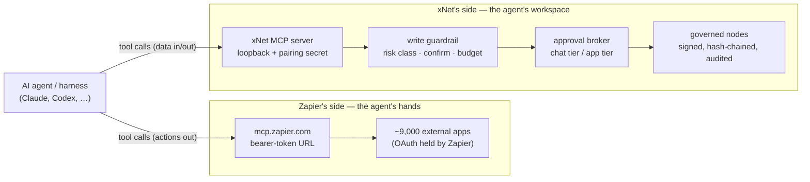
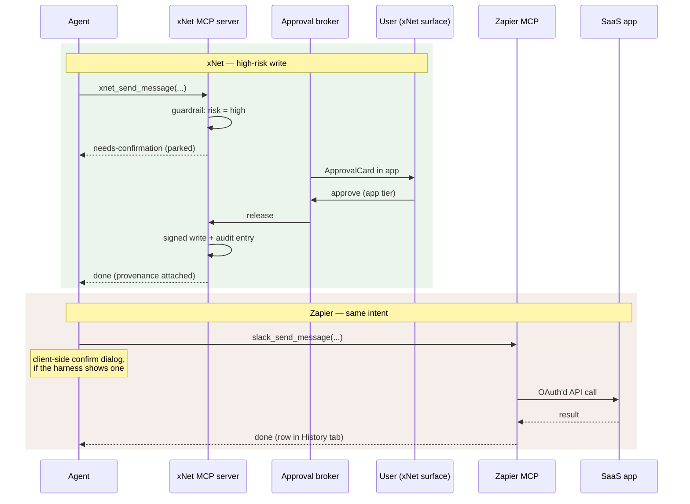

# xNet And Zapier MCP — Substrate Versus Aggregator

> [!TIP]
> **TL;DR** — Zapier MCP and xNet's MCP server sit on **opposite sides of the
> agent** and mostly do not compete: Zapier aggregates ~9,000 external apps
> into hosted pass-through *tools* (the agent's hands); xNet is the governed
> *substrate* the agent reads and writes (the workspace), with signed audit,
> a two-tier approval ceremony, and an egress budget Zapier structurally
> cannot offer. Where they overlap — connectors — the designs are inverted:
> Zapier proxies actions through its cloud, xNet syncs services into governed
> nodes with hub-held secrets. Recommendation: **refuse to build an
> aggregator** (the 0416 logic again, one layer over), keep first-party
> connectors deep, and spike a **consume lane** that lets a user plug an
> external aggregator like Zapier MCP into xNet's agent stack *behind* the
> existing guardrail and consent lanes.

## Problem Statement

"How does xNet compare to Zapier MCP?" hides three separable questions:

1. **Taxonomy** — are they even the same kind of thing? Both expose MCP
   endpoints to AI agents, so from a harness's `.mcp.json` they look like
   peers. Are they?
2. **Rivalry** — where do they genuinely compete, and should xNet respond
   (catch up on breadth, differentiate on governance, or ignore)?
3. **Complementarity** — should xNet *use* Zapier MCP — as a long-tail
   connector backend, or as an egress lane its agents can call — and under
   what consent regime?

Answering these matters now because the connector surface
(`packages/plugins/src/connectors/`) is six services wide, exploration
[0437](./0437_[_]_AGENT_AUTONOMY_MODES_ONE_DIAL_ACROSS_THREE_CONSENT_LANES.md)
is about to unify the consent lanes an external tool aggregator would have to
pass through, and [0440](./0440_[_]_ONYX_THE_PERMISSION_MIRROR_AND_THREE_MECHANISMS_WORTH_IMPORTING.md)
just settled the same "meet at MCP, don't take the dependency" question for
Onyx.

## Executive Summary

- **Different layer, same protocol.** In 0392's five-concern separation
  (catalog / protocol / auth / transport aggregation / harness), Zapier MCP is
  a hosted **catalog + auth + aggregation** product for *external* apps. xNet's
  MCP server ([`packages/plugins/src/services/mcp-server.ts`](../../packages/plugins/src/services/mcp-server.ts))
  is a **substrate** endpoint over *your own* data. An agent plausibly connects
  to both at once; they meet in the harness's tool list, not in the market.
- **The trust models are opposites.** Zapier: one bearer-token URL grants full
  access to every connected account; every payload transits Zapier's US cloud;
  approval is whatever the client shows. xNet: loopback-only bind, constant-time
  pairing secret, risk-classified writes parked in an approval broker, session
  egress metered in *bytes*, every write signed and hash-chained to a DID.
- **Where they do overlap — connectors — the architectures invert.** Zapier is
  a pass-through action proxy (data flows agent → Zapier → app and back). An
  xNet connector ([`define-connector.ts`](../../packages/plugins/src/connectors/define-connector.ts))
  syncs the service into governed nodes and exposes tools *over the nodes*;
  secrets live in the hub broker, never with the agent. xNet has 6 connectors;
  Zapier has ~9,000 apps. That gap is real and permanent — and mostly fine,
  because breadth is Zapier's business and depth-with-governance is ours.
- **Economics diverge for chatty agents.** Zapier meters 2 tasks per successful
  tool call against plan quotas (Free ≈ 50 calls/month). xNet's substrate calls
  are free and local; the costs xNet meters are *risk* (write budget:
  120 writes/60s) and *egress* (2 MiB/session), not invocation count.
- **Recommendation: consume, don't compete.** No xNet aggregator (fails the
  same commoditisation test as the harness refusal in ADR-29, and a hosted
  credential vault for 9,000 apps is the charter's nightmare tenant). Instead:
  document the "external aggregator as gated egress" pattern, spike wiring an
  external MCP server through `agentExtraTools` + the write guardrail, and use
  a gap analysis to decide which few connectors deserve first-party depth.

---

## Current State In The Repository

xNet already ships a complete MCP *substrate* stack — the comparison is not
hypothetical on our side.

| Component | Status | Where |
| --------- | ------ | ----- |
| MCP server, 11 built-in tools | ✅ Shipped | [`packages/plugins/src/services/mcp-server.ts`](../../packages/plugins/src/services/mcp-server.ts) |
| Streamable HTTP transport, hardened | ✅ Shipped | [`packages/plugins/src/services/mcp-http.ts`](../../packages/plugins/src/services/mcp-http.ts) |
| Write guardrail (risk classes, confirm gate, budgets) | ✅ Shipped | [`packages/plugins/src/services/mcp-guardrail.ts`](../../packages/plugins/src/services/mcp-guardrail.ts) |
| In-process Electron MCP server | ✅ Shipped | [`apps/electron/src/main/agent-mcp-server.ts`](../../apps/electron/src/main/agent-mcp-server.ts) |
| `xnet mcp serve` CLI (stdio / `--http`, read-only default) | ✅ Shipped | [`packages/cli/src/commands/mcp.ts`](../../packages/cli/src/commands/mcp.ts) |
| Approval broker + two-tier release | ✅ Shipped | [`packages/plugins/src/ai-surface/approval-broker.ts`](../../packages/plugins/src/ai-surface/approval-broker.ts), [`agent-ceremony-tools.ts`](../../packages/plugins/src/ai-surface/agent-ceremony-tools.ts) |
| Session egress budget (2 MiB, byte-metered reads) | ✅ Shipped | [`packages/plugins/src/ai-surface/egress-budget.ts`](../../packages/plugins/src/ai-surface/egress-budget.ts) |
| Connector primitive (sync-into-nodes, hub-held secrets) | ✅ Shipped | [`packages/plugins/src/connectors/define-connector.ts`](../../packages/plugins/src/connectors/define-connector.ts) |
| Concrete connectors | 🚧 6 services | GitHub, Notion, Airtable ([`api-connectors.ts`](../../packages/plugins/src/connectors/api-connectors.ts)), Google Calendar ([`calendar.ts`](../../packages/plugins/src/connectors/calendar.ts)), RSS, Slack migration |
| Plugin registry / published index | 🚧 19 entries | [`registry/registry.json`](../../registry/registry.json), egress closed-by-default via [`ecosystem/network-endowment.ts`](../../packages/plugins/src/ecosystem/network-endowment.ts) |
| External MCP servers *consumed by* xNet agents | ❌ Not built | no seam registers a remote MCP endpoint as agent tools |
| Autonomy mode dial (0437) | ❌ Not built | zero `AgentMode` hits outside the exploration |

Three details do the comparative work:

- **Progressive disclosure.** The server sets `defer_loading` on every tool
  outside a small core set, and refuses to register `xnet_recall` when
  retrieval is absent — "a tool that always answers 'unavailable' is worse
  than one that isn't there." This is the opposite instinct from dynamic
  discovery over a 30,000-action catalog.
- **The guardrail meters risk, not invocations.** Deletes and outward-facing
  creates (e.g. `ChatMessage`) classify as `high`; writes return
  `needs-confirmation` until re-called with `confirm: true`; a cost budget
  (default 120 writes/60s) rate-limits the rest. A separate
  `createConnectorWriteGuardrail()` budgets bulk backfill apart from
  interactive writes.
- **Egress is the threat model.** From
  [`egress-budget.ts`](../../packages/plugins/src/ai-surface/egress-budget.ts):
  reads are individually innocuous — "`xnet_query` twenty times is not a
  suspicious call, it is twenty unsuspicious ones" — so the budget meters
  result *bytes* and fails loudly with `EgressBudgetError` rather than
  truncating, because a short result is indistinguishable from "that is all
  the data there was."

## External Research

### What Zapier MCP is

A hosted MCP endpoint at `mcp.zapier.com` (Streamable HTTP), one server per
AI client, exposing Zapier's catalog — **~9,000 apps, 30,000–40,000 actions**
as of mid-2026 — as agent-callable tools. Auth from client to Zapier is a
bearer secret (or token-in-URL, which Zapier itself describes as
password-equivalent); OAuth to the downstream apps happens inside Zapier,
reusing its 13-year credential infrastructure, so the agent never sees app
credentials. Tool exposure defaults to dynamic discovery, with per-server
manual curation and field pre-filling available. 195k+ MCP servers created,
4.6M+ tool calls, per Zapier's own numbers.

**Pricing** — no separate SKU; each successful tool call costs **2 tasks**
against the plan quota. Free = 100 tasks/month ≈ 50 calls; Professional from
$19.99/mo (750 tasks); Team from $69/mo (2,000 tasks). Failed calls are free;
so are tool listing and auth setup.

**Adjacent products** — Zaps (deterministic pre-built workflows, no runtime
reasoning), Zapier Agents (Zapier-hosted autonomous agents, billed
separately), and MCP Client (Zaps calling *external* MCP servers — Zapier
consuming the protocol in the other direction).

### The critique

- **Credential centralization.** Every connected app's tokens live behind one
  bearer secret; compromise of the server URL is blast radius across all of
  them. Critics also cite a 2025 Zapier repo breach (2FA misconfiguration,
  customer data in a private repo) and weak-key retrieval in Zapier Storage.
- **Lethal trifecta.** A hosted catalog of thousands of read+write tools makes
  Simon Willison's trifecta — private data, untrusted content, external
  communication — trivially co-present in one agent. The demonstrated
  exfiltration case was Atlassian's MCP server, not Zapier's, but the shape is
  generic.
- **Data path.** Every payload transits Zapier's US cloud; no data-residency
  options; not HIPAA-suitable.
- **Approval is the client's problem.** Zapier offers workspace governance and
  action history, not per-call human approval; the confirm dialog is whatever
  Claude or Cursor happens to show.
- **Context bloat.** Dynamic discovery over 30k actions degrades tool
  selection; practitioner guidance is to hand-curate small tool sets — i.e.
  to manually reinvent the progressive disclosure xNet's server does by
  default.

### The neighbours

| Approach | Model | Notes |
| -------- | ----- | ----- |
| **Zapier MCP** | Hosted aggregator, task-metered | Unmatched breadth; coarse human-shaped actions |
| **Composio** | AI-native gateway, per-call pricing | ~500+ toolkits; free tier 20k calls/mo vs Zapier's ~50 |
| **Pipedream MCP** | Developer-first, embeddable auth | ~2,700 apps; acquired by Workday (closed Jan 2026) — roadmap risk |
| **Anthropic connectors directory** | Curated catalog of *first-party* servers | ~841 integrations; no aggregator in the data path |
| **Merge Agent Handler** | Governed tool packs, DLP, SIEM | Enterprise-first, narrow category coverage |
| **Direct per-app MCP servers** | Each vendor runs its own | First-party auth, no middleman; N connections, no normalization |

The directory model (each service runs its own MCP server, nobody aggregates
the data path) is the ecosystem's centre of gravity drifting *toward* xNet's
posture, not away from it.

## Key Findings

### 1. They sit on opposite sides of the agent

A harness config that lists both is coherent and probably common: xNet for
memory, records, tasks, and audit; Zapier for "send the Slack message."
Neither replaces the other. The comparison people reach for ("both are MCP
things") is a protocol-level pun, like comparing Postgres to Twilio because
both speak TCP.

### 2. Where the writes differ: ceremony versus pass-through

The xNet path is slower and asks more of the user — deliberately. The
two-tier release means the chat-tier `xnet_approve` ceremony *mechanically
cannot* release high/critical actions; those wait for an xNet surface. Zapier
has nothing at this layer, because it cannot: it does not own a UI the user
trusts, so approval devolves to the client. This is the substrate/aggregator
distinction made concrete — governance lives where the data lives.

### 3. The connector overlap is real but inverted

Both products answer "my agent needs my calendar." Zapier's answer: proxy the
call at request time. xNet's answer
([`define-connector.ts`](../../packages/plugins/src/connectors/define-connector.ts)):
sync the calendar into governed nodes on a cadence, then let the agent query
nodes — "instead of giving the agent a credentialed shell, it syncs an
external service into governed xNet nodes and exposes agent-callable tools
over them." Consequences:

- **Offline and fast reads** for synced services; nothing for the other 8,994.
- **Secrets never reach the agent** (hub broker) — same property Zapier
  offers, achieved without a third party in the data path.
- **The permission-laundering caveat from 0440 applies here too**: synced
  `ExternalItem` nodes take on space permissions, not source permissions.
  Zapier's pass-through model doesn't have this bug — it also doesn't have
  the local copy.

### 4. What each meters is the tell

| | Zapier MCP | xNet substrate |
| --- | --- | --- |
| Unit metered | successful tool calls (2 tasks each) | write **risk** and read **bytes** |
| Free allowance | ≈ 50 calls/month | unmetered local calls |
| Rate limit | plan task quota | 120 writes/60s; 2 MiB egress/session |
| What running out looks like | calls stop until billing resets | `EgressBudgetError`, loud and typed |

Zapier meters *usage* because usage is its revenue. xNet meters *risk and
exfiltration surface* because those are its threat model. Neither number is
comparable to the other; that they are denominated in different units is the
whole finding.

### 5. Charter check — why an xNet aggregator is refused

If xNet built a hosted "one endpoint, N apps" broker, `docs/CHARTER.md` §6's
three tests apply:

- **Improvement?** Partially — running OAuth refresh and rate limiting is real
  work. But the margin comes from sitting in the flow of every action:
  usage-metered middleman revenue, the definition of a toll.
- **BATNA?** Fails. Users' app credentials would pool in xNet's cloud; leaving
  means re-authing everything. Credential centralization *is* the lock-in.
- **Vanish test?** Fails. If the broker vanishes, every integration breaks
  simultaneously — the single point of failure the charter's "no global
  chokepoint tier" receipt exists to prevent (and `packages/AGENTS.md` already
  bans workflow orchestrators from `packages/hub` for the same reason).

> [!IMPORTANT]
> The refusal rhymes with ADR-29. The harness layer commoditised in June
> 2026; the aggregator layer is commoditising now (Zapier, Composio,
> Pipedream-under-Workday, Merge, plus every vendor shipping first-party MCP
> servers). Entering it late, against incumbents, in a posture the charter
> forbids, buys nothing xNet's thesis needs. The layer that is still empty —
> signed, portable, tamper-evident agent accountability — is the one xNet
> already occupies.

## Options And Tradeoffs

| Option | Verdict | Rationale |
| ------ | ------- | --------- |
| **A. Ignore** — status quo, no relationship | 🚫 Weak | Leaves "how do xNet agents act on external apps?" unanswered; users will wire aggregators in anyway, ungoverned |
| **B. Compete** — build an xNet-hosted aggregator | 🛑 Refused | Fails all three §6 tests; late entry into a commoditising layer; credential-vault liability (Key Finding 5) |
| **C. Consume** — external MCP servers as gated egress inside xNet's agent lanes | ✅ Recommended | Reuses shipped guardrail/broker/budget seams; user brings their own Zapier/Composio account and its risk stays theirs |
| **D. Curate** — deepen a few first-party connectors; point the long tail at aggregators in docs | ✅ Recommended | Depth-with-governance where it matters (the 0440 mechanisms: checkpointed sync, deletions pass, query-time mode); honesty about the 8,994 apps we will never sync |

Option C in detail — what "consume" means concretely

The server already merges `this.config.aiSurface.getTools()` and
`this.agentExtraTools` into its tool list. A consume lane would:

1. Let a user register a remote MCP endpoint (URL + secret) in xNet config —
   secret stored in the same hub/keychain lane connector secrets use, never in
   agent-visible config.
2. Proxy the remote server's tools into `agentExtraTools`, each wrapped by
   the write guardrail with a conservative default risk class: **every**
   outward-acting remote tool is at least `high` (it is outward-facing by
   definition), so it parks in the approval broker until released from an
   xNet surface.
3. Count remote tool *arguments* against the session egress budget — the
   arguments to an outbound call are exactly the bytes leaving the workspace,
   which is what the budget exists to meter. This closes the lethal-trifecta
   loop: xNet holds the private data, the aggregator holds the outbound
   channel, and the byte budget + approval ceremony sit between them.
4. Defer-load the remote tools like everything non-core, so a 30k-action
   catalog cannot flood the context window.

This is 0437's Lane 3 (outward egress) with a concrete first tenant, which is
why `review:` is pegged to the AgentMode work.

## Recommendation

**Refuse B loudly, ship C as a spike, practise D deliberately.**

1. **Write the one-paragraph positioning down** (in 0416's orbit, not a new
   ADR — this is a two-way door): xNet's MCP server is the substrate lane;
   aggregators are a client-side choice xNet governs but does not operate.
2. **Spike the consume lane** behind the existing guardrail (Option C
   details above). Success looks like: a bridged agent calls one Zapier tool;
   the call parks; an ApprovalCard releases it; the audit trail shows the
   outbound arguments and their byte cost.
3. **Run the connector gap analysis** before writing any new connector:
   which apps do actual xNet users need agent access to, and for which of
   those does sync-into-nodes beat pass-through? Email (0308, JMAP) is the
   obvious candidate; most of the long tail is not.
4. **Fix the 0440 permission-laundering caveat** before deepening any
   connector — it is the one place where xNet's model is currently *weaker*
   than the pass-through alternative it criticises.

## Risks And Open Questions

- **Prompt injection through synced content.** A synced GitHub issue or
  calendar invite is untrusted content sitting inside the trusted store; if a
  consume lane adds outbound tools, xNet hosts the full trifecta itself. The
  approval ceremony is the mitigation, but 0437's autonomy dial could weaken
  it if "autonomous" mode ever auto-releases outward writes. It must not.
- **`cli-wrap.ts` egress is display-only.** Subprocess connectors bypass
  `guardedFetch`; an aggregator consumed via a wrapped CLI would dodge the
  whole gate. The consume lane must be HTTP-transport-only.
- **Curation drift.** Docs pointing users at Zapier/Composio age; Pipedream's
  Workday acquisition shows how fast the neighbour list changes. Keep the
  pointer generic ("any remote MCP aggregator") rather than naming one
  partner.
- **Unverified externals.** Zapier's 2025 beta-era free limits and the
  actions.zapier.com → mcp.zapier.com lineage could not be confirmed from
  primary sources; the 2-tasks-per-call model and current tiers are from
  Zapier's own docs.

## Implementation Checklist

- [ ] Add the positioning paragraph (substrate vs aggregator, consume-don't-compete) to exploration 0416's orbit / the agents docs page.
- [ ] Spike: register a remote MCP endpoint into `agentExtraTools` via [`mcp-server.ts`](../../packages/plugins/src/services/mcp-server.ts), wrapped by [`mcp-guardrail.ts`](../../packages/plugins/src/services/mcp-guardrail.ts) with default risk `high` for all remote tools.
- [ ] Meter remote-tool call arguments against the session egress budget in [`egress-budget.ts`](../../packages/plugins/src/ai-surface/egress-budget.ts).
- [ ] Store remote-server secrets in the connector secret lane (hub broker / keychain), never agent-visible config.
- [ ] Defer-load all remote tools (`defer_loading = true`, no exceptions for remote catalogs).
- [ ] Verify the parked-approval path end-to-end for a remote tool call (extend [`mcp-http-parked-approval.test.ts`](../../packages/plugins/src/__tests__/mcp-http-parked-approval.test.ts)).
- [ ] Connector gap analysis: enumerate requested external apps, mark each sync-into-nodes vs point-at-aggregator, file as a short follow-up doc or an update here.
- [ ] Cross-reference this doc from 0437 (consume lane = Lane 3 tenant) and 0440 (permission-laundering fix is a prerequisite for deepening connectors).

## Validation Checklist

- [ ] Demo transcript: bridged agent calls one remote (Zapier) tool → call parks → ApprovalCard release → audit entry shows tool, arguments, and byte cost.
- [ ] A remote tool call attempted over a `cli-wrap` transport is rejected, not silently un-gated.
- [ ] Egress budget test: outbound remote-call arguments count toward the 2 MiB session budget and trip `EgressBudgetError` loudly.
- [ ] `pnpm check:exploration-links` and `pnpm check:exploration-fallow` pass with this doc added.
- [ ] 0437's mode dial, once built, cannot auto-release outward remote writes in any mode (negative-control test).

## References

- Zapier MCP docs — https://docs.zapier.com/mcp/home ; usage/metering — https://docs.zapier.com/mcp/usage
- Zapier MCP client setup (bearer/URL auth, one-server-per-client) — https://help.zapier.com/hc/en-us/articles/36265392843917
- Zapier MCP product page (adoption stats, SOC 2) — https://zapier.com/mcp
- MCP Client by Zapier (Zaps consuming external MCP servers) — https://help.zapier.com/hc/en-us/articles/38777069364109
- Simon Willison, "The lethal trifecta" — https://simonwillison.net/2025/Jun/16/the-lethal-trifecta/
- ByteBridge, "The hidden risks of Zapier MCP for enterprises" — https://bytebridge.medium.com/the-hidden-risks-of-zapier-mcp-for-enterprises-b9f9735c06e2
- Composio pricing/positioning — https://peliqan.io/blog/composio-pipedream-peliqan-mcp/
- Workday acquires Pipedream — https://newsroom.workday.com/2025-11-19-Workday-Signs-Definitive-Agreement-to-Acquire-Pipedream
- Anthropic connectors directory FAQ — https://support.claude.com/en/articles/11596036
- Prior xNet decisions: [0416 (ADR-29, harness refusal)](./0416_[-]_AGENT_HARNESS_OR_AGENT_SUBSTRATE.md), [0437 (autonomy modes)](./0437_[_]_AGENT_AUTONOMY_MODES_ONE_DIAL_ACROSS_THREE_CONSENT_LANES.md), [0440 (Onyx)](./0440_[_]_ONYX_THE_PERMISSION_MIRROR_AND_THREE_MECHANISMS_WORTH_IMPORTING.md), [0196 (connectors)](./0196_[x]_AGENT_NATIVE_CONNECTORS_AND_INTEGRATION_MARKETPLACE.md), `docs/CHARTER.md` §6.
