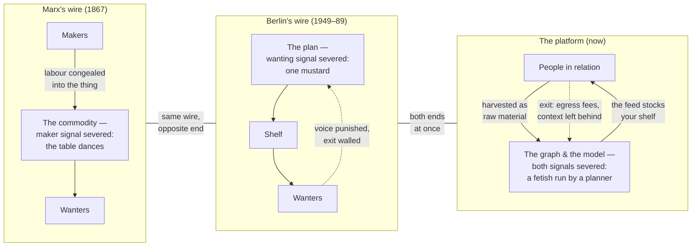

# A Blog Post Merging Marx's *Capital* And The Calculation Problem: The Table And The Wall

> [!TIP]
> **TL;DR** — Merge the two planned essays into one: **"The Table and the
> Wall"**, slug `the-table-and-the-wall`, ~15 minutes, hard word budget
> 3,400. The synthesis that pays for the merge: commodity fetishism and the
> economic calculation problem are **the same severed channel seen from
> opposite ends** — the commodity hides the makers from the wanters, the
> plan hides the wanters from the makers — and the modern platform cuts both
> wires at once. Marx's dancing table opens, Berlin's inward-facing wall
> turns, the feed-as-plan and the model-as-dead-labour land it, and xNet's
> receipts (provenance = the maker channel, portability = the exit channel)
> close it. Supersedes both parent 0441s.

## Problem Statement

Two explorations, written the same day in sibling worktrees — and, by
numbering accident, both called 0441 — each planned a blog essay:

- **"The Dancing Table"**
  ([0441 in this tree, now withdrawn](<./0441_[_]_BLOG_POST_THE_DANCING_TABLE_MARX_CAPITAL_AND_THE_DATA_ECONOMY.md>)):
  Marx's *Capital* Vol. 1 — commodity fetishism (relations between people
  disguised as things), dead labour and the vampire, foundation models as
  the general intellect privatised, provenance as de-fetishisation.
- **"The Wall Faces Inward"** (`0441_[_]_BLOG_POST_THE_WALL_FACES_INWARD_FEEDBACK_PLANNING_AND_PLATFORMS.md`,
  authored in the `cloud-product-gaps-9aa408` worktree, not yet merged): the
  Maxinomics video on the economic calculation problem — Berlin's two
  grocery stores, Hirschman's exit and voice, the feed as a planned economy,
  lock-in as the wall that faces inward.

The instruction is to combine them into **one** blog post. That is not
concatenation — two ~13-minute essays stapled together is a 26-minute essay
nobody finishes. The exploration question: what single thesis earns the
merge, what gets cut from each parent to fit a ~15-minute budget, and what
title and structure carry it?

The raw materials co-operate unusually well, because the Maxinomics video's
own arc runs *through* Marx: scarcity → enclosures → Marx's biography →
"profit is unpaid labour" → and then the video's central observation that
*Capital* diagnoses the factory but offers **no design for the other side**
— "how do you know what to make?" — which is precisely the door the Berlin
material walks through. The first essay ends where the second begins.

## Executive Summary

**The merged thesis** — the sentence the whole essay exists to earn:

> [!IMPORTANT]
> <mark>Fetishism and the calculation problem are the same wire cut at
> opposite ends.</mark> A commodity is a thing that has forgotten who made
> it: the **maker signal** is severed on its way *to* you. A plan is a shelf
> that has forgotten who wanted it: the **wanting signal** is severed on its
> way *from* you. Marx named the first failure in 1867; the states built on
> his book produced history's purest case of the second; and the platform
> economy — capitalist to the bone — runs both failures simultaneously: the
> social graph is a fetish (your relations, owned as a thing) and the feed
> is a plan (your shelf, stocked by an objective function you cannot appeal
> to and cannot leave with your context intact).

Structural findings that shape the essay:

1. **The two opening images rhyme, and the series title pattern already
   exists for the pair.** A table that stands on its head and dances
   (Ch. 1 §4's séance joke — the made thing forgetting its makers) and a
   wall whose every fixture points at its own citizens (the system knowing
   which way people would walk). *The Vault and the View*, *The Workshop and
   the Walled Garden*, *The Matchmaker and the Meter* — the two-noun title
   is house style: **"The Table and the Wall"**.
2. **The merge dissolves each parent's biggest risk.** "The Dancing Table"
   alone risked reading as Marx advocacy; "The Wall Faces Inward" alone
   risked reading as a socialism dunk. Combined, the essay uses Marx's own
   instruments to explain why the states built in his name failed, then uses
   that failure to indict capitalist platforms — it is structurally
   symmetric, offending both camps equally, which is the safest position a
   culture-war-adjacent essay can occupy and also simply the true one: the
   mechanism is indifferent to ideology; it only cares whether the channels
   are open.
3. **Each parent supplies what the other lacked.** The Dancing Table's fork
   section ("Marx's remedy refused") was its weakest beat — abstract, easy
   to read as hedging. Berlin *is* that fork, made concrete: the remedy was
   tried, at scale, for forty years, with a control group twenty minutes
   away. Conversely, the Wall essay lacked a deep past — its story started
   in 1920 with Mises; fetishism gives the feed critique its 1867 ancestor
   and its philosophical engine (the feed is the fetish *operationalised*:
   people-in-relation, repackaged as an owned, rankable inventory).
4. **The cuts are decided here, not at draft time.** From the Table: the
   enclosure paragraph (gone entirely — *Rig the Game or Play* owns the
   lane and the video grazes it anyway), the standalone "manufactured
   famine" section (folded to one paragraph), the petty-producer fork
   (absorbed by Berlin). From the Wall: the Nordic paragraph (one
   sentence), the Coase/Walmart flip (one paragraph), the planning-chain
   reconstruction (two or three details maximum — the mustard, the Office
   of Prices, the dense loaves). Both parents' AI material merges into one
   section: the model as dead labour **and** as planner.
5. **All research is inherited, verified, and gotcha-mapped.** The Marx
   quotes are chapter-located and translation-pinned (Moore/Aveling 1887
   via marxists.org; the vampire line's exact wording; "general intellect"
   is *Grundrisse*, never *Capital*; *Capital* is **not** on Project
   Gutenberg). The Berlin facts are fact-checked with the video's
   life-expectancy rounding corrected (MPIDR: women's gap closed, men's
   ~1.2 yr in 2013). The transcript path is `yt-dlp` (browser-side scraping
   fails). Nothing new needs fetching to draft.

## Current State In The Repository

### The parents and their status

| Doc | Where | Status | Disposition |
| --- | --- | --- | --- |
| 0441 "The Dancing Table" | this tree, committed | ✅ Research complete | Marked `withdrawn`, superseded by this doc; its digest and References remain the Marx source of record |
| 0441 "The Wall Faces Inward" | worktree `cloud-product-gaps-9aa408`, unmerged | ✅ Research complete | Cannot be edited from this branch; its owner should mark it withdrawn on merge. Cited here by filename |
| ⚠️ Numbering collision | both are 0441; 0442 is taken by the Zapier doc in a third worktree | — | Resolved by the standing rule (earliest commit wins, tie → lower hash) when branches meet `main`; this doc deliberately takes 0443 and links the local parent only |

### Blog infrastructure (unchanged from the parents; the binding version)

- Registry entry in `site/src/data/blog.ts` (`draft: true` while authoring;
  `pubDate` from the merge commit, never post-dated).
- Page at `site/src/pages/blog/the-table-and-the-wall.astro` — `.astro`, not
  MDX; en-GB; no third-party assets; conversational, **no lists in the essay
  body** (humanize house rules).
- **`heroArt` entry in `site/src/pages/blog/index.astro`** (map at ~line 33)
  **and a `Sources` section** (format: `the-matchmaker-and-the-meter.astro`
  ~line 263) — the build passes silently without either; both are
  checklist-enforced only.
- `/humanize` pass before PR: `tellscan.mjs`, fix elevated tells plus the
  three standing rules only — the corpus is clean and generic de-AI advice
  damages it.
- Site-only PR → `skip-changelog` label; DCO sign-off; merge-commit; POSSE
  to Bluesky is dormant until `BLUESKY_APP_PASSWORD` is set (0432).

### The receipts table (merged from both parents, deduplicated)

| Severed channel (source) | Platform form | xNet's structural answer | Primary code / doc |
| --- | --- | --- | --- |
| Maker signal: "a definite social relation between men … the fantastic form of a relation between things" (Vol. 1, Ch. 1 §4) | The social graph as owned asset; the profile as commodity | Every change atom carries `authorDID` + Ed25519 signature — the thing stays legibly made of people | `packages/sync/src/change.ts` |
| Wanting signal: the shelf decided in a room; quota over customer (Berlin planning chain) | The feed as plan; engagement as quota; Goodhart's law as quota fever | No engagement machinery to plan against: chronological feeds, Calm charter axis, CI-enforced | `docs/CHARTER.md` §3, `scripts/check-humane-patterns.mjs` |
| Exit walled: 2.7M exits, then the wall faces inward | Egress fees, non-portable context, identity ransom | Free verified export (`.xnetpack`), self-minted `did:key`, local master copy | `packages/data/src/portability/`, `packages/identity/src/keys.ts`, `packages/data/src/store/store.ts` |
| Dead labour: "vampire-like, only lives by sucking living labour" (Ch. 10 §1); the general intellect (*Grundrisse*) | The foundation model: accumulated past work confronting its authors as an alien planner | Local/BYO models — dead labour you own is a tool; metered AI at exact cost | `packages/brain/`, `packages/cloud/src/ai/metered-gateway.ts` |
| Scarcity as ground of value vs. data's non-rivalry | Manufactured scarcity: "protocols for making otherwise abundant information scarce" (Wark) | MIT wire format, dependency-free entitlements, no ground rent | root `LICENSE`, `packages/entitlements/`, `docs/CHARTER.md` §6 |

No new revenue lane is proposed; the Charter §6 three-test gauntlet is not
triggered. The essay *cites* the "No ground rent" receipts as its close, as
both parents planned.

---

## External Research

Both parents' digests stand; nothing here is new research, only the merge
map. Full details: the Marx digest in the withdrawn local 0441 (quotes
chapter-located and fetch-verified against marxists.org; publication and
translation history including Reitter/Princeton 2024); the calculation-canon
table and Berlin fact-checks in the Wall 0441 (Mises 1920, Hayek 1945, Lange
1936, Coase 1937, Hirschman 1970, Spufford 2010, Shalizi 2012, Phillips &
Rozworski 2019; MPIDR life-expectancy correction; Ulbricht's 15 June 1961
denial, 59 days before the wall).

### How the two literatures already touch

The bridge is older than either parent noticed: the digital-labour tradition
(Terranova, Fuchs) is built on the *Grundrisse*'s general intellect — the
same fragment the essay's AI section quotes — and its strongest internal
critic (Srnicek) is also the author of *Platform Capitalism*, the
platforms-as-planners source. One thinker already holds both ends of the
wire. The essay inherits his double guard: users are **raw material, not
workers** (so no surplus-value claim), and platforms internalise the market
that was supposed to discipline them (so the plan critique applies).



## Key Findings

1. **The merged essay is a mechanism essay with a longer fuse.** The 0417
   discipline (video in, mechanism out) still governs; the mechanism is now
   stated once and shown three times — 1867, 1961, now — instead of argued
   twice in parallel essays. Repetition across eras *is* the argument: the
   failure is structural, not ideological.
2. **Berlin replaces the weakest section of the Marx essay.** The
   petty-producer fork required the reader to care about a 150-year-old
   intra-socialist argument. "The remedy was tried; here is the control
   group; the wall's fixtures pointed inward" requires nothing. The
   falsifiable tripwire survives the merge intact and gains force: the day
   xNet charges rent on access to what you would own anyway, **both**
   verdicts land at once — Marx's reconcentration thesis and the planner
   diagnosis.
3. **The AI section is where the two parents genuinely fuse** (not
   alternate): the model is dead labour (Table) *deployed as a planner*
   (Wall) — your accumulated words, congealed, then set above you to stock
   your shelf. Neither parent could say this alone; it is the merge's one
   genuinely new sentence, and probably the pull-quote.
4. **Length is the enemy and the cuts are non-negotiable.** Budget 3,400
   words. The mapping table appears as two or three rows in prose, never as
   a table. One Marx quote per concept, all <15 words. One video quote
   maximum. If a draft paragraph serves only one parent's argument, it is
   the first candidate to cut.
5. **The video keeps prominent credit; Marx keeps exact citation.** The
   Berlin narrative spine is Maxinomics' reconstruction and is presented as
   such (their research, credited, linked first in Sources); the
   planning-chain specifics stay attributed to the video, not asserted as
   our own. The Marx apparatus carries its own citations (translation named
   once; marxists.org links per chapter).

### The essay's structure (eight beats, ~3,400 words)

```mermaid
flowchart TD
  A["1 · The dancing table<br/>Hamburg 1867, the séance joke —<br/>a made thing forgets its makers"] --> B["2 · The trick named<br/>fetishism: relations between people<br/>as relations between things;<br/>the modern séance — graph, profile<br/>(cross-link People in Disguise)"]
  B --> C["3 · The book with no second half<br/>'how do you know what to make?' —<br/>Capital diagnoses, doesn't design;<br/>the states that answered anyway"]
  C --> D["4 · The wall faces inward<br/>two grocery stores, one mustard,<br/>dense loaves, 2.7M exits, the wall —<br/>the wanting signal severed"]
  D --> E["5 · One wire, two cuts<br/>Hirschman's exit & voice;<br/>fetish hides makers, plan hides wanters —<br/>the variable is the open channel,<br/>not the ideology"]
  E --> F["6 · The plan in a growth deck<br/>the feed as shelf, engagement as quota,<br/>Goodhart as quota fever; the model as<br/>dead labour deployed as planner<br/>(vampire quoted; Grundrisse attributed;<br/>Srnicek guard: raw material, not workers)"]
  F --> G["7 · Honesty beat<br/>platforms are capitalist — mechanism is<br/>ideology-blind; engagement is a real,<br/>quota-shaped signal; life-expectancy<br/>rounding corrected; scarcity here is<br/>manufactured (non-rival data)"]
  G --> H["8 · The seam<br/>receipts: signed log (maker channel),<br/>free export (exit channel), no ground rent;<br/>the tripwire; close — the table on its feet,<br/>a wall with nothing pointing in"]
```



## Options And Tradeoffs

| Option | Shape | Pros | Cons |
| --- | --- | --- | --- |
| **A. Single-mechanism interleave** (recommended) | The severed-wire thesis owns the structure; Marx and Berlin serve it as beats 1–5, platforms as 6–8 | The merge pays for itself with a thesis neither parent had; symmetric politics; one 15-min read | Hardest to draft; demands the cuts actually happen |
| B. Two-act essay | Act I the Table (Marx), Act II the Wall (Berlin→platforms), short coda joins them | Easier to draft from the parents | Reads as two essays stapled; ~20+ min; the joint arrives too late to reframe Act I |
| C. Ship the parents separately, cross-linked | As originally planned | Each was a clean 13-min shape with its own image | Explicitly not what was asked; also duplicates the AI section and the receipts close across two essays a week apart |
| D. The Wall absorbs a Marx cameo | Wall essay as written; fetishism gets one paragraph | Smallest delta from a finished plan | Wastes the Table's opening image and the de-fetishisation receipt — the series' strongest Marx material reduced to seasoning |

**Recommendation: A.** B is the fallback if drafting proves the interleave
unwritable — and if even B sprawls past 4,000 words, that is the signal to
revert to C (the parents were both sound; the `review` date carries this
escape hatch).

## Recommendation

Ship **essay #22**: slug `the-table-and-the-wall`, title **"The Table and
the Wall"**, tags `['essay', 'economics', 'philosophy']`, authors
`['crs48', 'claude']`, ~15 minutes, hard budget 3,400 words. Fallback
titles: *"The Wall Faces Inward"* (if the Marx opening is demoted at draft
time), *"One Mustard"*.

Proposed deck (for `blog.ts`):

> In 1867, in the driest book ever written about money, Karl Marx cracked a
> joke about a séance: turn a table into a commodity and it stands on its
> head, dancing — the people who made it vanish into the thing. Ninety-four
> years later, a state founded on that book built a wall, and every guard
> tower faced its own citizens. One story, told from both ends of a severed
> wire: things that forget their makers, and shelves that forget their
> wanters. The feed that stocks your attention runs on both cut wires at
> once — and this essay is about the software decision to keep them
> connected.

Tone guards (union of both parents'): en-GB; conversational; no lists in
the essay body; no US-politics vocabulary — "socialism" only as the
historical system under discussion; no advocacy register in either
direction; the Maxinomics video credited prominently; every Marx quote <15
words, translation named once; the honesty beats (life-expectancy rounding;
engagement-is-a-signal; platforms-are-capitalist) stay in.

## Example Code

Registry entry (`site/src/data/blog.ts`, prepended to `posts[]`):

```ts
{
  slug: 'the-table-and-the-wall',
  title: 'The Table and the Wall',
  description:
    'In 1867, in the driest book ever written about money, Karl Marx ' +
    'cracked a joke about a séance: turn a table into a commodity and it ' +
    'stands on its head, dancing — the people who made it vanish into the ' +
    'thing. Ninety-four years later, a state founded on that book built a ' +
    'wall, and every guard tower faced its own citizens. One story, told ' +
    'from both ends of a severed wire: things that forget their makers, ' +
    'and shelves that forget their wanters. The feed that stocks your ' +
    'attention runs on both cut wires at once — and this essay is about ' +
    'the software decision to keep them connected.',
  pubDate: '2026-08-XXT00:00:00Z', // from the merge commit at publish
  authors: ['crs48', 'claude'],
  tags: ['essay', 'economics', 'philosophy'],
  readingMinutes: 15,
  draft: true // drop when shipping
}
```

## Risks And Open Questions

> [!WARNING]
> **Still a culture-war magnet — now from two directions.** The symmetry
> defence only works if the essay executes it: Marx's instruments applied
> honestly, Berlin's failure stated plainly, the platform indictment carried
> by mechanism rather than mood. The read-aloud test from the Wall parent
> survives the merge: if any paragraph excerpt reads as electoral
> commentary in any country, cut it. The new failure mode the merge adds:
> a careless draft could read as "Marx was right all along" *and* as
> "socialism proves regulation fails" **in the same essay** — the beat-5
> reframe (open loop vs closed loop) must arrive before either camp can
> claim it.

- **Length discipline.** Two finished research bodies invite a 5,000-word
  draft. The 3,400 budget and the cut list (Key Finding 4) are the defence;
  the validation checklist measures it.
- **Quotation discipline** (inherited, unchanged): Moore/Aveling 1887 via
  marxists.org, translation named once; the vampire line's exact 1887
  wording; "general intellect" is *Grundrisse*; the Ch. 15 "machine makes
  use of him" line is unverified — confirm in `ch15.htm` §4 or cut;
  *Capital* is **not** on Project Gutenberg (#46423 is the 1859
  *Critique*) — marxists.org only. And never imply users produce surplus
  value; Srnicek's raw-material framing is in the essay as armour.
- **Attribution.** Berlin's narrative spine is the video's reconstruction —
  credited as such, primary sources (MPIDR, Ulbricht citation, exit
  figures) added so the essay does independent work.
- **The parents' paper trail.** The local 0441 is withdrawn-with-pointer;
  the sibling 0441 lives on an unmerged branch and will collide on number
  when branches meet — the standing renumbering rule handles it, but the
  link in this doc's Problem Statement is by filename, not relative path,
  until that settles.
- **Open**: whether the essay mentions xNet's own planning surface (the
  Index ranks things too) — the Wall parent's one-line concession ("any
  index ranks; the question is whether you can leave with everything")
  probably survives the merge and belongs in beat 7 or 8; decide at draft
  time. Also open: hero art (a table mid-turn against a wall
  cross-section, fixtures inward, in the house geometric style); whether
  the Reitter 2024 translation earns its sentence.

## Implementation Checklist

- [x] Invoke the `humanize` skill, then draft
      `site/src/pages/blog/the-table-and-the-wall.astro` per the eight
      beats — en-GB, no lists, ≤3,400 words, one video quote max, `Sources`
      section in series format.
- [x] Verify every Marx quote against the marxists.org chapter files
      (`ch01.htm` §4 dancing table + fetishism sentence, `ch10.htm` §1
      vampire, `ch15.htm` confirm-or-cut, `grundrisse/ch14.htm` general
      intellect); name Moore/Aveling 1887 once.
- [x] Verify the Berlin facts against the primary links (MPIDR pages,
      Ulbricht quote source, 2.7M exits) and keep the life-expectancy
      correction in the text; keep planning-chain specifics attributed to
      the video.
- [x] Verify the xNet receipts against code as cited in the receipts table
      (change signatures, portability, humane-patterns gate, Charter §3/§6).
- [x] Add the registry entry to `site/src/data/blog.ts` with `draft: true`.
- [x] Add the `heroArt` entry in `site/src/pages/blog/index.astro`.
- [x] Cross-link *People in Disguise* (fetishism's modern statement),
      *Weights You Can Hold* (dead labour owned), *The Matchmaker and the
      Meter* (prices as honest signals), *Rig the Game or Play* (enclosure,
      one link in passing).
- [x] Read-through against the tone guards: symmetry executed, no electoral
      excerpt, no surplus-value claim, no advocacy register.
- [x] `/humanize` pass: `tellscan.mjs`, elevated tells + three standing
      rules only.
- [x] `pnpm build` the site (not `astro dev`); check page, index card (hero
      art renders), prev/next threading.
- [x] Set `pubDate` from the merge commit, drop `draft`, set
      `readingMinutes` from final word count.
- [x] PR with `skip-changelog` label, DCO sign-off on every commit,
      merge-commit, CI green before merge.
- [ ] After the sibling branch merges: confirm the Wall 0441 is marked
      withdrawn by its owner and the 0441/0442 numbering collision resolved
      per the standing rule.

## Validation Checklist

- [x] Post renders in the production build; appears in `/blog` index and
      RSS; index card shows hero art.
- [x] `seriesNeighbors()` threads it as #22 (prev: *The Matchmaker and the
      Meter*).
- [x] Final word count ≤3,400 (`readingMinutes` ≤15); no essay-body lists.
- [x] Every Marx quote <15 words, quoted, chapter-attributed, findable on
      marxists.org from Sources; every Berlin figure carries the corrected
      number or the video attribution.
- [x] Every `Sources` link returns non-404 (403 bot-blocks acceptable).
- [x] No third-party network requests on the page.
- [x] `tellscan.mjs` shows no elevated tells vs corpus baseline; en-GB
      throughout.
- [x] Read-aloud pass: no paragraph excerpt reads as electoral commentary,
      in either direction.

## References

**Parents (research of record — both digests remain authoritative)**

- [0441 "The Dancing Table" (this tree, withdrawn → this doc)](<./0441_[_]_BLOG_POST_THE_DANCING_TABLE_MARX_CAPITAL_AND_THE_DATA_ECONOMY.md>)
  — the Marx apparatus: quote locations, translation history, the
  platform-Marxism lineage (Smythe → Terranova → Fuchs → Srnicek → Zuboff →
  Couldry & Mejias → Wark → Sadowski → Jones & Tonetti), the criticisms map.
- `0441_[_]_BLOG_POST_THE_WALL_FACES_INWARD_FEEDBACK_PLANNING_AND_PLATFORMS.md`
  (worktree `cloud-product-gaps-9aa408`, unmerged) — the calculation canon,
  Berlin fact-checks, the yt-dlp transcript ladder, the feed-as-plan
  mapping and anti-mapping.

**Primary sources (verified in the parents)**

- *Capital* Vol. 1 (Moore/Aveling 1887):
  <https://www.marxists.org/archive/marx/works/1867-c1/> — Ch. 1
  (fetishism), Ch. 10 (vampire), Ch. 15 (machinery).
- *Grundrisse*, Fragment on Machines:
  <https://www.marxists.org/archive/marx/works/1857/grundrisse/ch14.htm>
- Maxinomics, "The Simple Question Socialism Couldn't Answer":
  <https://www.youtube.com/watch?v=mMHyhneAxXY>
- Hayek 1945: <https://www.econlib.org/library/Essays/hykKnw.html>;
  Mises 1920:
  <https://mises.org/library/economic-calculation-socialist-commonwealth>;
  Shalizi 2012:
  <https://crookedtimber.org/2012/05/30/in-soviet-union-optimization-problem-solves-you/>
- MPIDR life expectancy:
  <https://www.mpg.de/9655128/germany-regional-life-expectancy>
- Hirschman, *Exit, Voice, and Loyalty* (1970); Coase, "The Nature of the
  Firm" (1937); Spufford, *Red Plenty* (2010); Phillips & Rozworski, *The
  People's Republic of Walmart* (2019); Wark, *Capital Is Dead* (2019);
  Srnicek, *Platform Capitalism* (2016); Jones & Tonetti, *AER* 110(9)
  (2020).
- Reitter translation (Princeton, 2024):
  <https://press.princeton.edu/books/hardcover/9780691190075/capital>
- ⚠️ Not-a-source: Project Gutenberg #46423 is the 1859 *Critique*, not
  *Capital*.

**Repository**

- `docs/CHARTER.md` §3 (Calm), §6 (No ground rent); `docs/ECONOMICS.md` §1
- `packages/sync/src/change.ts`; `packages/data/src/store/store.ts`;
  `packages/data/src/portability/`; `packages/identity/src/keys.ts`;
  `packages/entitlements/`; `packages/brain/`;
  `packages/cloud/src/ai/metered-gateway.ts`;
  `scripts/check-humane-patterns.mjs`
- `site/src/data/blog.ts`; `site/src/pages/blog/index.astro` (`heroArt`)
- Explorations: 0347 (the diagnosis-without-prescription template), 0363
  (enclosure lane), 0417 (video→mechanism discipline), 0358 (rent cliffs),
  0438 (aggregation), 0292 (*Weights You Can Hold*), 0364 (revision
  transparency), 0432 (POSSE dormant)
