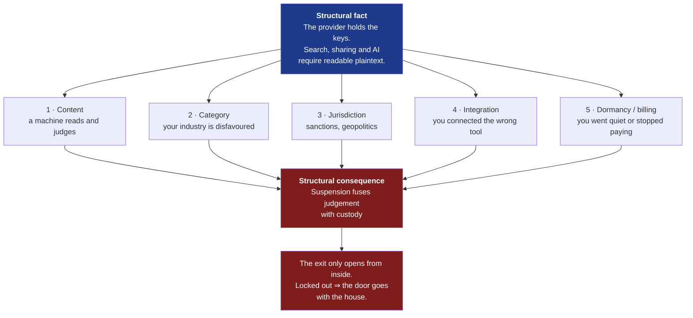
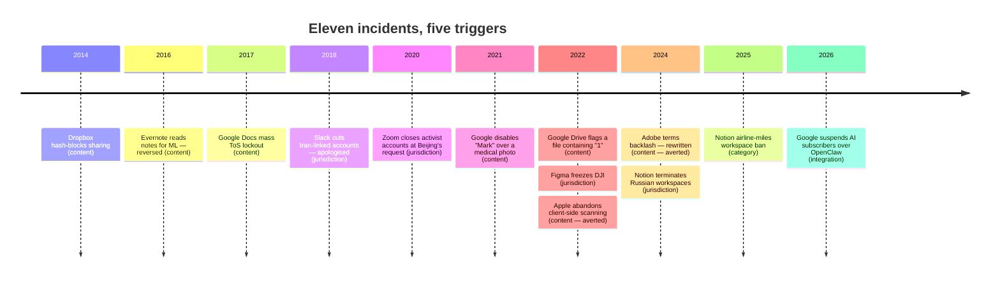
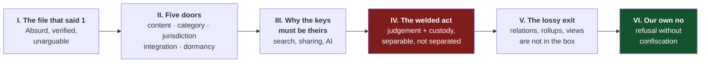

# Eviction As A Product Feature — a blog essay on data custody

> [!TIP]
> **TL;DR** — Write essay #23, **"The Door Inside the House"**, on a single
> mechanism: the platforms we keep our work in must be able to read it (search,
> sharing and AI all require server-readable plaintext), and the act that judges
> what they read is fused to the act that takes it away. Ground it in eleven
> documented incidents across five distinct eviction triggers, then make one
> narrow, checkable promise about xNet — <mark>refusal without
> confiscation</mark> — which today's code already supports: the abuse
> vocabulary in `packages/abuse/src/policy-blocks.ts` is
> `reject | hide | quarantine | block-peer` and contains no verb for deletion.

---

## Problem Statement

A Reddit post in r/Notion titled "NOTION WILL BAN YOUR ACCOUNT FOR NO REASON AND
KEEP YOUR DATA" went semi-viral in late October 2025. The prompt asks for a blog
post built from that seed plus a wider sweep of comparable cases, arguing that
we do not really own the data we keep in productivity platforms.

Two things make this harder than it looks, and both shape the recommendation.

The first is that **the seed case is not a clean one**. The user did lose their
workspace, but the workspace was hosting a marketplace for selling airline miles
— an activity that plausibly breaches both airline rules and Notion's own use
policy. An essay that opens with an innocent victim and is then rebutted in the
comments has lost before it starts. The essay must therefore not rest on the
sympathy of any one case.

The second is that **"you don't own your data" is already a saturated genre**.
Every local-first vendor has published a version of it. To be worth writing, the
essay needs a mechanism nobody else is naming, not a grievance everybody has
already read. The mechanism is available and it is sharp: the readability that
makes these products good is the same readability that makes eviction possible,
and eviction bundles a judgement with a confiscation for no technical reason
whatsoever.

> [!IMPORTANT]
> The load-bearing claim of the essay is **not** "cloud companies are hostile".
> It is: **the ban and the export are separable acts that have been welded
> together, and nothing but convenience welds them.** That is falsifiable,
> specific, and something xNet can actually answer in code.

---

## Executive Summary

Eleven documented incidents from 2014 to February 2026, across nine companies,
sort cleanly into **five eviction triggers**. All five are downstream of one
structural fact and produce one structural consequence.



The recommendation is a single essay, roughly 2,300 words, in the established
house voice — en-GB, conversational, no bulleted lists — opening not on the
Reddit case but on a Google Drive file containing the single digit `1`, which
was flagged as copyright infringement alongside an automated notice that <mark>"a
review cannot be requested for this restriction"</mark>. That opening is absurd,
independently verified by several outlets, and impossible to argue with.

The essay ends on an honest turn rather than a sales pitch: xNet Cloud is a host,
hosts sometimes have to refuse service, and the promise worth making is not "we
will never say no" but "our no cannot take anything from you".

---

## Current State In The Repository

The essay has unusually deep code to stand on. This is a topic where xNet's
existing architecture does most of the arguing.

| Seam                                | Path                                                                                                                                                            | Status          | What it gives the essay                                             |
| ----------------------------------- | --------------------------------------------------------------------------------------------------------------------------------------------------------------- | --------------- | ------------------------------------------------------------------- |
| Charter §1 Own / §2 Exit            | [`docs/CHARTER.md`](../CHARTER.md)                                                                                                                              | ✅ Written      | The promise the essay restates in prose                             |
| Portable wire format                | [`packages/sync/src/change.ts`](../../packages/sync/src/change.ts)                                                                                              | ✅ Shipped      | Signed, hash-chained change log — not a vendor blob                 |
| Portable identity                   | [`packages/identity/src/keys.ts`](../../packages/identity/src/keys.ts)                                                                                          | ✅ Shipped      | `did:key` works on any hub; the host does not mint you              |
| Offline-first                       | [`packages/runtime/src/sync/offline-queue.ts`](../../packages/runtime/src/sync/offline-queue.ts)                                                                | ✅ Shipped      | The client works with no hub at all                                 |
| Lossless bundle                     | [`packages/cli/src/commands/data.ts`](../../packages/cli/src/commands/data.ts)                                                                                  | ✅ Shipped      | `xnet data export` → `.xnetpack`, verify + replay (0344)            |
| Bundle I/O                          | [`packages/cli/src/utils/fs-bundle.ts`](../../packages/cli/src/utils/fs-bundle.ts)                                                                              | ✅ Shipped      | `FsBundleSink` / `FsBundleSource`                                   |
| Structured export                   | [`packages/data/src/database/export/json-export.ts`](../../packages/data/src/database/export/json-export.ts)                                                    | ✅ Shipped      | Contrast with Notion's lossy markdown export                        |
| Moderation vocabulary               | [`packages/abuse/src/policy-blocks.ts`](../../packages/abuse/src/policy-blocks.ts)                                                                              | ✅ Shipped      | `reject \| hide \| quarantine \| block-peer` — **no deletion verb** |
| Decision explanations               | [`packages/abuse/src/explain.ts`](../../packages/abuse/src/explain.ts)                                                                                          | ✅ Shipped      | A statement of reasons, in code, before the law required one        |
| Appeals                             | [`packages/abuse/src/appeals.ts`](../../packages/abuse/src/appeals.ts)                                                                                          | ✅ Shipped      | `reverse \| annotate` — a reversal actually restores                |
| Sourced-claim discipline            | [`site/src/data/surveillance.ts`](../../site/src/data/surveillance.ts) + [`site/scripts/validate-surveillance.ts`](../../site/scripts/validate-surveillance.ts) | ✅ Shipped      | The `caveat` pattern this essay must borrow                         |
| Blog metadata                       | [`site/src/data/blog.ts`](../../site/src/data/blog.ts)                                                                                                          | ✅ Shipped      | Post registry; index + RSS single-source                            |
| Hero art registry                   | [`site/src/pages/blog/index.astro:34`](../../site/src/pages/blog/index.astro)                                                                                   | ✅ Shipped      | `heroArt` map — a new post **must** be added here                   |
| One-flow "export everything and go" | exploration 0234                                                                                                                                                | 🚧 Aspirational | Charter §2 names this as not-yet-composed                           |

### The vocabulary finding

The single most useful thing in the repository for this essay is three lines
long. In [`packages/abuse/src/policy-blocks.ts`](../../packages/abuse/src/policy-blocks.ts):

```ts
export type PolicyBlockAction = 'reject' | 'hide' | 'quarantine' | 'block-peer'
```

and in [`packages/abuse/src/appeals.ts`](../../packages/abuse/src/appeals.ts):

```ts
export type AppealResolutionAction = 'reverse' | 'annotate'
```

Every action a policy can take is about _reach_ — whether a thing propagates,
whether a peer is spoken to, whether content is shown. None of them is about
_possession_. There is no `delete`, no `revoke`, no `confiscate`. An appeal that
succeeds `reverse`s, which is only meaningful because nothing was destroyed in
the first place.

> [!NOTE]
> This is a genuine architectural property, not a slogan — but it is a property
> of the **abuse package**, not a whole-system guarantee. The essay must not
> overclaim it into "xNet can never delete your data". A hub operator can still
> stop serving you, and a hub still stores bytes it could drop. The honest claim
> is narrower and is stated in Recommendation below.

---

## External Research

Eleven incidents, sorted by trigger. Each carries a verification note in the
spirit of `surveillance.ts` — where the popular telling overstates the facts,
the correction is recorded here so it can be rendered as fine print rather than
quietly dropped.

### Trigger 1 — Content: a machine reads what you keep and judges it

<details>
<summary>Five incidents, with corrections</summary>

**Google Drive flags a file containing `1` as copyright infringement (Jan 2022).**
Dr Emily Dolson, an assistant professor at Michigan State University, found a
file whose entire contents were the digit `1` restricted for copyright
infringement, with an automated notice saying a review could not be requested.
Others reproduced it with `0` and with a scattering of three-digit numbers.
Google acknowledged the fault publicly and said it would unblock affected files.
_Correction to note:_ this was a bug Google fixed, not a standing policy — which
is precisely why it is the best opening. The system was working as designed; the
design is the problem.

**Google disables "Mark" over a medical photo (Feb 2021, reported Aug 2022).**
A father photographed his son's inflamed groin at a nurse's request for a
telehealth consultation. Google's scanning flagged the images, referred him to
police, and disabled his account. Police reviewed the imagery, recognised it as
medical, and filed no charges. Google kept the account closed anyway.
_Correction to note:_ Google's decision survived exoneration by law enforcement.
That is the detail that matters — not the false positive, but the irreversibility.

**Microsoft OneDrive lockouts under child-safety and copyright scanning
(ongoing, multiple reports).** Users on Microsoft's own Q&A forum describe
accounts suspended for a "Child Sexual Exploitation and Abuse" violation with no
prior notice, no opportunity to review or remove the flagged item, and appeals
answered by what they describe as an automated loop — one user reporting
eighteen attempts producing only pre-written replies. One widely covered case
involved roughly thirty years of photographs and work.
_Correction to note:_ these are self-reported forum accounts and trade coverage
of them, not adjudicated findings. Treat as a pattern of complaint, and say so.

**Google Docs mass-locks documents as ToS violations (31 Oct 2017).** A code
push incorrectly flagged a small share of documents as abusive; journalists at
National Geographic and Fortune found live drafts frozen mid-sentence. Google
fixed it the same day and clarified that its systems pattern-match rather than
read for meaning.
_Correction to note:_ frequently misdated to 2020 in secondary sources. It is 2017. Also: Google's "we do not read, we pattern-match" defence is worth quoting
fairly, because it is true and it does not help — a system that cannot read for
meaning is exactly the system that locks a file containing `1`.

**Dropbox blocks sharing of hash-matched files (Mar 2014).** After a verified
DMCA complaint, Dropbox adds the file's hash to a blocklist; sharing a file whose
hash matches is blocked.
_Correction to note — this one is important._ The popular version ("Dropbox
scans your private folders") is **false**. Dropbox checks hashes at the moment
of sharing, does not inspect private-folder contents, and does not remove the
file from your account. Including this case honestly, with the correction, is
what makes the rest of the essay credible. It also sharpens the thesis: even
here, the check happens because the provider can compute over your bytes.

</details>

### Trigger 2 — Category: your line of work is disfavoured

Notion's help centre states that it reserves the right to provide "additional
scrutiny on, suspend the use of and/or discontinue access to Notion for
individuals and organizations" whose use relates to certain industries, naming
**gambling and multi-level marketing**, on the stated reasoning that such content
carries higher abuse rates that could jeopardise availability for everyone else.

> [!WARNING]
> **Settled 2026-08-13 — print only the short list.** The LowEndBox write-up
> quotes a broader list including "investing, work from home, adult
> entertainment". Notion's help page, fetched first-hand, names only gambling
> and multi-level marketing. The primary Terms of Use could **not** be verified:
> `notion.com/terms` 307-redirects to `app.notion.com/terms`, which renders
> client-side and returns no policy text to a fetcher, and the `notion.so`
> Terms-and-Privacy page redirects the same way. **The essay cites the
> help-centre wording only. The longer list stays out.**

This is also where the seed case sits. The r/Notion user built an airline-miles
marketplace in a Notion workspace and lost the account. Selling miles generally
breaches airline terms; aggregating buyers' and sellers' details raises its own
handling questions. The essay should say this plainly and early, because the
point survives it: _the platform had to read the workspace to know what was in
it, and having decided, it kept the rest._

### Trigger 3 — Jurisdiction: a border moves and your work is on the wrong side

**Slack deactivates accounts linked to Iran (Dec 2018).** Users in the US,
Canada and Finland — including a PhD student at the University of British
Columbia and a researcher at TU Munich — were cut off with no warning and no
window to archive. Slack cited export-control and sanctions compliance and said
it acted on IP geolocation, not nationality. It later conceded "a series of
mistakes", restored accounts, and moved to suspending only while a user is
logged in from a sanctioned location.
_Correction to note:_ Slack apologised and reversed. Say so — it is evidence
that pressure works, which the essay needs in order not to be fatalistic.

**Notion exits Russia (effective 9 Sep 2024).** Notion terminated workspaces
whose billing information was associated with Russia, citing US restrictions,
and gave users until 8 September to download their data before permanent
deletion.
_Correction to note:_ frequently misdated to 2023 because Notion drew criticism
in January 2023 for _still operating_ there. The termination is 2024. Notion did
give a notice period and an export window — better behaviour than most of the
list, and worth crediting.

**Figma cuts off DJI (12 Mar 2022).** Figma froze the sanctioned Chinese drone
maker's accounts, telling DJI access might be restored if it were removed from
the list. Figma stated cloud-stored files would not be deleted. Chinese rivals
MasterGo and Pixso shipped Figma-file importers within days.
_Correction to note:_ the fairest case on the list. Nothing was destroyed and
restoration was offered. It still made a company's live design work
unreachable overnight, which is the point.

**Zoom closes US-based activists' accounts at Beijing's request (Jun 2020).**
Zhou Fengsuo's Humanitarian China account was shut after a paid Tiananmen
commemoration attended by around 250 people; a second account belonging to
former Hong Kong legislator Lee Cheuk Yan was also closed. Zoom confirmed it
acted on a Chinese government demand and said it would not let such requests
affect users outside China again. Senators Wyden, Merkley and Tillis demanded
answers.

### Trigger 4 — Integration: you connected the wrong tool

**Google suspends AI Pro and Ultra accounts over OpenClaw (Feb 2026).** Trade
coverage reports that Google suspended subscribers without warning after they
linked their subscriptions to the third-party automation tool OpenClaw over
OAuth, with lockouts extending across linked Google services and, in some
reports, billing continuing. The stated rationale mixes infrastructure abuse
with margin protection. Other providers reportedly blocked the integration
without suspending the account.

> [!NOTE]
> **Resolved 2026-08-13 — corroborated, case is IN.** Five independent outlets
> now carry it (winbuzzer, implicator.ai, dig.watch, secure.com, savedelete),
> with specifics: bans began **12 February 2026**; AI Ultra is **$249/month**;
> affected users report 403s and, in some cases, loss of Gmail and Workspace
> access; annual prepaid subscribers got no refund and no appeal. Google's own
> wording, as quoted in coverage: use of credentials within the third-party tool
> "constitutes a violation of the Google Terms of Service". Anthropic blocked the
> tool by fingerprinting in late January 2026 rather than banning accounts, and
> OpenAI whitelisted it — the contrast the essay wants.

### Trigger 5 — Dormancy and billing: you went quiet

Notion's dormant account policy, verified first-hand 2026-08-13, deletes accounts
after **five years** of inactivity — defined as failing to log in, or failing to
create or edit any content, over that period — following a thirty-day warning
email, with a further thirty-day recovery window after deletion. It does not
apply to paid workspaces, organisation-managed accounts, or multi-user workspace
admins. Microsoft reclaims data in unlicensed OneDrive accounts. Google Workspace
subscriptions suspended beyond sixty days may be cancelled with associated user
data lost.

Notion's version is, on the facts, the most humane policy on this page: a long
horizon, a warning, and an undo. It belongs in the essay precisely because it is
reasonable — it shows the mechanism operating with nobody behaving badly at all.
This trigger has no villain at all, which is why it belongs: the same mechanism
operates without anyone deciding anything about you.

### The structural fact underneath all five

Notion does not end-to-end encrypt customer content. Data is encrypted at rest
with AES-256 and in transit with TLS 1.2+, but the keys are Notion's — and Notion
has explained why: end-to-end encryption would break workspace-wide full-text
search, sharing, integrations and Notion AI. Employee access is governed by
policy, audit and access control rather than by mathematics.

> [!IMPORTANT]
> This is not a security failing and the essay must not pretend it is. It is a
> **product requirement**. The features people choose these tools for are
> precisely the features that require the host to be able to read everything.
> Every eviction above is downstream of a capability the user asked for.

### The exit that only opens from inside

Notion's markdown and CSV export carries page text and flat rows. It does not
carry the relations, rollups, formulas, filters, sorts or views. Relation
properties come out as internal UUIDs; rollups and formulas export their last
computed value rather than their logic — a formula column arrives as whatever
text it happened to evaluate to, frozen. The export moves content out; it does
not snapshot the structure you actually built.

So the pre-emptive backup — the thing every commenter tells you to do — does not
preserve the workspace either. And it is available only while you can still log
in, which is to say at every moment except the one that matters.

### What the law is starting to say

The EU **Digital Services Act** requires a clear statement of reasons for
account suspension or termination, whether the ground is illegal content or a
breach of terms, delivered no later than the restriction itself, naming whether
an automated process was involved and how to appeal (Art. 17), plus an
accessible internal complaints system handling appeals in a timely,
non-discriminatory, diligent and non-arbitrary way (Art. 20), with out-of-court
dispute settlement beyond that. The Commission's Transparency Database has
collected statements of reasons since September 2023 at a scale of hundreds of
millions of records.

The **EU Data Act** applies from 12 September 2025: enforceable switching
rights, capped notice periods, defined data-retrieval windows, and limits on
egress fees — with switching fees banned outright from 12 January 2027.

> [!NOTE]
> The essay's use of this material should be deflationary, not triumphant. The
> law now compels an explanation and a retrieval window. It does not compel the
> host to be structurally incapable of holding your work hostage, and a
> retrieval window is worthless to someone already locked out. Regulation raises
> the floor. It does not change who has the keys.

---

## Key Findings

| #   | Finding                                                        | Confidence                                        | Why it matters to the essay                                                 |
| --- | -------------------------------------------------------------- | ------------------------------------------------- | --------------------------------------------------------------------------- |
| 1   | Readability is a product requirement, not a lapse              | ✅ High — stated by Notion                        | Kills the "they're just careless" framing and makes the argument structural |
| 2   | Judgement and custody are fused with no technical necessity    | ✅ High — inferred from architecture, uncontested | **The thesis.** Separable acts, welded by convenience                       |
| 3   | Five distinct triggers, one mechanism                          | ✅ High — 11 incidents                            | Shows this is a shape, not a grievance                                      |
| 4   | Export is lossy _and_ only available from inside               | ✅ High — documented                              | Kills the "just back it up" rebuttal, which is the essay's main threat      |
| 5   | Exoneration does not reverse a suspension (Google/Mark)        | ✅ High — reported                                | The sharpest single fact available                                          |
| 6   | Public pressure has worked (Slack, Evernote, Adobe, Apple)     | ✅ High                                           | Prevents the essay from reading as doom                                     |
| 7   | Popular tellings overstate at least two cases (Dropbox, Adobe) | ✅ High                                           | Correcting them _is_ the credibility                                        |
| 8   | The seed Reddit case is compromised                            | ⚠️ Medium — thread unread                         | Must be handled openly in the essay's own voice                             |
| 9   | xNet's abuse vocabulary has no possession verb                 | ✅ High — verified in code                        | The one-line proof the closing promise is real                              |

### The near-miss cases

Three incidents belong in the essay as evidence that this is contested rather
than settled, and all three are **reversals**.

Evernote announced in December 2016 that selected employees would read user notes
to improve machine learning, with no way to opt out of the reading itself. After
public fury the CEO said the company had "messed up, in no uncertain terms" and
made it opt-in.

Adobe's re-acceptance prompt in June 2024 surfaced February 2024 terms language
broad enough that creators read it as a claim on their work. Adobe rewrote the
terms on 24 June to state plainly that users own their content and that it does
not train generative models on it outside Adobe Stock. _Correction to note:_ no
evidence emerged that Adobe trained on customer content. The incident is about
what the contract permitted, not what happened — which is the essay's point in
miniature.

Apple announced client-side CSAM detection for iCloud Photos in 2021 and
abandoned it in December 2022, later citing the new attack surface it would
create. The EFF, security researchers and some Apple employees had objected that
it built a door governments would ask to widen.



---

## Options And Tradeoffs

Five ways to answer the prompt. They are not mutually exclusive, but only one
should be built first.

| #   | Option                                                  | Effort     | Risk   | Verdict                      |
| --- | ------------------------------------------------------- | ---------- | ------ | ---------------------------- |
| A   | Single essay, mechanism-led                             | ~1 day     | Low    | ✅ **Recommended**           |
| B   | Essay + sourced incident ledger data module             | ~2–3 days  | Medium | 🚧 Defer to a follow-up      |
| C   | Case-by-case listicle                                   | ~half day  | High   | 🛑 Rejected                  |
| D   | Legal-analysis piece (DSA / Data Act)                   | ~2 days    | Medium | 🛑 Rejected for the blog     |
| E   | Ship the Charter §2 "Delete-Day" flow first, blog after | ~1–2 weeks | Medium | 🚧 Worth doing, but not this |

<details>
<summary>Why not B, C, D and E</summary>

**B — essay plus a `evictions.ts` data module** mirroring
[`site/src/data/surveillance.ts`](../../site/src/data/surveillance.ts), with each
incident carrying `source`, `sourceUrl` and `caveat`, validated at build time by
a sibling of `site/scripts/validate-surveillance.ts`. This is genuinely
attractive — the caveat discipline is exactly right for this material, and a
maintained ledger outlives an essay. It is deferred only because the essay does
not depend on it and shipping both at once triples the review surface. If the
essay lands well, build it.

**C — a listicle** ("11 times platforms took people's data") is the obvious
version and the wrong one. It maximises the chance of being litigated
case-by-case in the comments, it violates the house style's no-lists rule, and
it has no mechanism in it. Every one of these cases has a defender; the shape
they make does not.

**D — a legal analysis** of DSA Articles 17 and 20 and the Data Act's switching
regime would be genuinely useful and belongs in
`site/src/content/docs/` or a follow-up exploration, not in the essay corpus.
The blog's voice is concrete and human; regulation is neither.

**E — build the flow first.** Charter §2 already admits the "export everything
and go" flow is aspirational (exploration 0234). There is a real argument for
not writing about exit until the single-button exit exists. It is rejected
because the essay does not claim the button exists — it claims the _architecture_
makes the button possible, which is true today and demonstrable from
`packages/cli/src/commands/data.ts`. Overclaiming here would be fatal; not
writing would be over-correction.

</details>

### Charter §6 — no new revenue lane

This exploration proposes **no new revenue lane**, so the three "No ground rent"
tests (improvement / BATNA / vanish) do not gate it. They are worth restating
anyway, because the essay makes a promise that constrains an existing lane:

The essay commits xNet Cloud, in public, to **never bundling a service refusal
with data confiscation**. That is a constraint on the paid hosting lane, in the
direction the Charter already points — it strengthens the customer's BATNA
(leaving costs nothing) and it makes the vanish test cleaner (if xNet
disappears, the local master copy and the `.xnetpack` bundle survive). It cannot
be walked back quietly once printed.

> [!CAUTION]
> Printing that promise is closer to a **one-way door** than the frontmatter's
> `two-way` suggests. The essay itself is reversible; a public commitment about
> how a paid host treats suspended customers is not. Treat the exact wording of
> the closing paragraphs as the highest-stakes text in the piece, and mirror the
> final phrasing into [`site/src/data/commitments.ts`](../../site/src/data/commitments.ts)
> so the promise has a home outside a blog post that scrolls away.

---

## Recommendation

Write **Option A**: one essay, roughly 2,300 words, slug
`the-door-inside-the-house`, in the corpus's established two-noun title grain
(`the-table-and-the-wall`, `the-vault-and-the-view`, `the-loom-you-can-read`).

> [!TIP]
> **Alternate title worth considering:** _"A Review Cannot Be Requested"_ — a
> verbatim line from Google's automated notice. Stronger as a hook, weaker as a
> fit with the corpus. Decider's call.

### The spine



**Act I** opens on Emily Dolson's file. One character. Flagged for copyright
infringement. A review cannot be requested. Establish in four sentences that
something is reading everything you keep, that it does not understand what it
reads, and that its judgement is final.

**Act II** widens through the five triggers as narrative, never as a list.
Handle the Notion seed case here and handle it honestly — the miles marketplace,
the plausible breach, the fact that the objection survives anyway. Slack's
apology and Figma's non-deletion go in as evidence of range, not as
counter-examples to be buried.

**Act III** turns to the keys, and gives the platforms their best argument in
their own words: end-to-end encryption would break search, sharing and AI. This
is the paragraph that separates the essay from the genre. The reading is not
malice. It is the feature.

**Act IV** is the thesis and the shortest act. When a platform decides against
you, two separate things happen in one motion: a judgement about your conduct,
and a transfer of custody of your work. No law requires the bundle. No
architecture requires it. It exists because the account is the only handle
anyone has on the data, so pulling the handle takes everything attached to it.
Name the alternative in one sentence: _the ban could leave the door open._

**Act V** closes the escape hatch a reader is already reaching for. Yes, export
first. Except the export drops the relations and the rollups and the views, and
it works only while you are still inside.

**Act VI** turns honest. xNet Cloud is a host. Hosts get abuse reports, subpoenas
and sanctions lists, and sometimes a host has to say no. The promise is not that
we will never refuse. It is that <mark>our refusal cannot take anything from
you</mark> — because the master copy is already on your disk, because identity is
a `did:key` that any hub will honour, because the wire format is a signed,
hash-chained log rather than a vendor blob, and because — a detail small enough
to be checkable — every action our moderation code can take is about reach, not
possession. There is no verb in it for keeping your things.

Close on the law being a floor, not a ceiling: the DSA now compels an
explanation and the Data Act compels a retrieval window, and both are worth
having, and neither changes who holds the keys. A host that _cannot_ take your
work does not need to be trusted not to.

### Non-negotiables

Handle the seed case in the essay's own voice, in Act II, before a reader can
raise it. Print the Dropbox and Adobe corrections rather than the popular
versions. Cut the OpenClaw case unless a second source is found. Do not quote
the Reddit original post — the thread could not be fetched, so every detail is
secondhand.

> [!WARNING]
> **Settled 2026-08-13 — the essay attributes no quotation to the thread.**
> Three routes were tried: `www.reddit.com` and `old.reddit.com` are both blocked
> to the fetcher, and a text-proxy attempt returned Reddit's "You've been blocked
> by network security" page. Per the repo's 403-vs-404 rule this is a bot-block
> rather than a fabrication, so the thread is real — but its contents remain
> **unverified**, and everything known about it comes from LowEndBox and
> hamy.xyz. The essay therefore describes the case in reported speech, cites the
> secondary coverage, and quotes nothing from the post itself — including its
> title, which is widely reproduced but was never read at source.

---

## Example Code

The one code-shaped fact the essay leans on, ready to be quoted in Act VI. From
[`packages/abuse/src/policy-blocks.ts`](../../packages/abuse/src/policy-blocks.ts):

```ts
export type PolicyBlockAction = 'reject' | 'hide' | 'quarantine' | 'block-peer'
```

Every verb describes reach. None describes possession.

<details>
<summary>Scaffolding for the new post</summary>

Following the pattern established by
[`site/src/pages/blog/the-table-and-the-wall.astro`](../../site/src/pages/blog/the-table-and-the-wall.astro):

```astro
---
import Base from '../../layouts/Base.astro'
import Nav from '../../components/sections/Nav.astro'
import Footer from '../../components/sections/Footer.astro'
import SeriesNav from '../../components/blog/SeriesNav.astro'
import DoorHouseHero from '../../components/blog/DoorHouseHero.astro'
import Byline from '../../components/blog/Byline.astro'
import { postBySlug, formatPostDate } from '../../data/blog'

const post = postBySlug('the-door-inside-the-house')!
---
```

Three registrations are required and each fails silently if missed — the build
still passes:

```text
┌────────────────────────┐   ┌──────────────────────┐   ┌───────────────────────┐
│ site/src/data/blog.ts  │──▶│ blog/index.astro:34  │──▶│ blog/rss.xml.ts       │
│ post metadata entry    │   │ heroArt[slug] = Art  │   │ (derives from blog.ts)│
└────────────────────────┘   └──────────────────────┘   └───────────────────────┘
        required                    required                    automatic
```

</details>

---

## Risks And Open Questions

| Risk                            | Severity  | Mitigation                                                                                           |
| ------------------------------- | --------- | ---------------------------------------------------------------------------------------------------- |
| Seed case rebutted in comments  | 🔴 High   | Concede it in Act II, in our own voice, first                                                        |
| OpenClaw case is thinly sourced | 🔴 High   | Corroborate or cut — no hedging into print                                                           |
| Notion ToS list discrepancy     | 🟠 Medium | Cite only the help-centre wording verified first-hand                                                |
| Reddit thread never read        | 🟠 Medium | Attribute no quotation to it; read manually before publishing                                        |
| Reads as a competitor hit piece | 🟠 Medium | Credit Notion's export window, Figma's non-deletion, Slack's apology                                 |
| Overclaiming xNet's guarantees  | 🔴 High   | Promise refusal-without-confiscation only; Charter §2's one-button exit is still aspirational (0234) |
| Genre saturation                | 🟠 Medium | Lead with the mechanism, not the grievance                                                           |
| Facts rot                       | 🟡 Low    | Ledger option B, if built, gets a validator like `validate-surveillance.ts`                          |

**Open questions.**

Does Notion's _Terms of Use_, as distinct from the help centre, carry the longer
industry list LowEndBox quotes? Nobody has checked the primary document.

Should the DSA and Data Act material be a footnote in the essay or its own
docs-site page? Current recommendation is two sentences in the closing act, but
the material is strong enough to carry a separate piece.

Is `two-way` the right `door` value in this frontmatter, given that the closing
promise is a public commitment about a paid lane? Left as `two-way` because the
essay is editable and withdrawable, but flagged in Options above.

Should an ADR record the refusal-without-confiscation commitment? Probably yes
if the promise is printed — an ADR in
`site/src/content/docs/docs/architecture/decisions.mdx` with a **Tripwire** of
"a hub role gains an action that removes user data rather than restricting its
reach". Deferred to the decider.

---

## Implementation Checklist

**Status:** ░░░░░░░░░░ 0/14 items

- [x] Read the r/Notion thread manually and record what the original post
      actually says, or confirm no quotation will be attributed to it
- [x] Corroborate the Feb 2026 Google/OpenClaw suspensions with a second
      independent source, or cut the case
- [x] Fetch Notion's _Terms of Use_ (not the help centre) and settle the
      prohibited-industry list discrepancy
- [x] Confirm Notion's dormant-account thresholds first-hand
- [x] Draft `site/src/pages/blog/the-door-inside-the-house.astro` to the
      six-act spine, ~2,300 words, en-GB, no bulleted lists
- [x] Add the post entry to [`site/src/data/blog.ts`](../../site/src/data/blog.ts)
      with `draft: true` during authoring
- [x] Build the hero art component and register it in the `heroArt` map at
      [`site/src/pages/blog/index.astro:34`](../../site/src/pages/blog/index.astro)
- [x] Add a `Sources` section to the post listing every incident cited, with
      corrections rendered as fine print
- [x] Run `/humanize` and fix only the elevated tells
- [x] Mirror the refusal-without-confiscation promise into
      [`site/src/data/commitments.ts`](../../site/src/data/commitments.ts)
- [x] Decide on the ADR (with `Tripwire:`) for that promise
- [x] Add a changelog fragment via `node scripts/changelog/new.mjs`
- [x] Flip `draft: false` and set `pubDate` from the merge commit
- [ ] Open the PR with the exploration and the essay in one branch

---

## Validation Checklist

- [x] Every factual claim in the essay traces to a URL in its `Sources` section
- [x] Every source returns 200 on a manual fetch (403 is a bot-block and is
      acceptable with a note; **404 means the citation is fabricated**)
- [x] The Dropbox correction and the Adobe correction both appear in the text
- [x] No quotation is attributed to the r/Notion thread unless it was read
      directly
- [x] The essay concedes the seed case before a reader can raise it
- [x] `pnpm --filter site build` passes with the new post registered
- [x] The post appears on `/blog`, in `rss.xml`, and renders its hero art
- [x] `pnpm check:exploration-links` passes
- [x] `/humanize` tell scan shows no elevated tells and no bulleted lists
- [x] The `packages/abuse` vocabulary claim is re-verified against
      `policy-blocks.ts` at publication time, not at drafting time
- [x] Read at 320px — the corpus is read on phones

---

## References

**The seed**

- r/Notion, "NOTION WILL BAN YOUR ACCOUNT FOR NO REASON AND KEEP YOUR DATA" — https://www.reddit.com/r/Notion/s/0ZrksrLLUG _(not readable by the fetcher; unverified)_
- LowEndBox, "Notion User Discovers That…" — https://lowendbox.com/blog/notion-user-discovers-that-notion-will-ban-your-account-for-no-reason-and-keep-your-data-hes-not-wrong/
- hamy.xyz, "Notion + Data Loss / Privacy" — https://hamy.xyz/blog/2025-11_notion-data-privacy-loss

**Notion**

- Report inappropriate content (the "additional scrutiny" wording) — https://www.notion.com/help/report-inappropriate-content
- Security practices at Notion — https://www.notion.com/help/security-and-privacy
- Dormant account policy — https://www.notion.com/help/dormant-account-policy
- Export your Notion content — https://www.notion.com/help/export-your-content
- Notion exits Russia — https://www.bleepingcomputer.com/news/software/notion-exits-russia-and-will-terminate-accounts-in-september/ · https://therecord.media/notion-app-leaving-russia-us-sanctions

**Content-triggered**

- Google Drive flags files containing "1" — https://torrentfreak.com/google-drive-flags-text-files-with-1-or-0-as-copyright-infringements-220125/ · https://www.bleepingcomputer.com/news/security/google-drive-flags-nearly-empty-files-for-copyright-infringement/ · https://www.techdirt.com/2022/01/26/google-drives-autodetector-copyright-infringement-is-locking-up-nearly-empty-files/
- Google CSAM false positive ("Mark") — https://mjtsai.com/blog/2022/08/22/google-account-deleted-due-to-csam-false-positive/ · https://www.phonearena.com/news/google-wont-reinstate-man-cleared-by-law-enforcement_id142065
- Google Docs ToS lockout, 31 Oct 2017 — https://www.washingtonpost.com/news/the-switch/wp/2017/10/31/a-mysterious-message-is-locking-google-docs-users-out-of-their-files/ · https://www.fastcompany.com/40489458/google-docs-are-inexplicably-locking-people-out-for-tos-violations
- Microsoft OneDrive lockouts — https://www.techradar.com/computing/windows/windows-11-user-has-30-years-of-irreplaceable-photos-and-work-locked-away-in-onedrive-and-microsofts-silence-is-deafening · https://learn.microsoft.com/en-us/answers/questions/5401383/onedrive-account-locked-without-warning-any-chance
- Dropbox DMCA hash matching _(and the correction)_ — https://techcrunch.com/2014/03/30/how-dropbox-knows-when-youre-sharing-copyrighted-stuff-without-actually-looking-at-your-stuff/ · https://theregister.com/2014/03/31/dropbox_dmca_takedown_shared_file/

**Jurisdiction-triggered**

- Slack and Iran-linked accounts — https://techcrunch.com/2018/12/20/slack-iran · https://9to5mac.com/2018/12/22/slack-iran-deactivating-accounts/
- Figma and DJI — https://technode.com/2022/03/14/us-design-company-figma-bans-dji-after-us-sanctions/ · https://www.caixinglobal.com/2022-03-14/sanctions-cost-drone-maker-dji-access-to-us-software-design-tools-101855611.html
- Zoom and Tiananmen commemorations — https://www.cnbc.com/2020/06/11/zoom-suspends-us-based-activists-account-after-tiananmen-square-commemoration-event.html · https://www.axios.com/2020/06/10/zoom-closes-chinese-user-account-tiananmen-square · https://www.wyden.senate.gov/news/press-releases/wyden-merkley-demand-answers-from-zoom-after-company-deactivated-accounts-of-pro-democracy-chinese-activists

**Integration-triggered** _(needs corroboration)_

- Google AI Pro/Ultra suspensions over OpenClaw — https://ucstrategies.com/news/google-suspends-ai-pro-and-ultra-accounts-without-warning-for-using-openclaw-while-others-only-block-the-integration/

**Reversals**

- Evernote privacy policy U-turn — https://techcrunch.com/2016/12/16/evernote-u-turn · https://www.computerworld.com/article/3151152/evernote-backs-off-from-privacy-policy-changes-says-it-messed-up.html
- Adobe terms rewrite — https://www.cgchannel.com/2024/06/adobe-updates-its-terms-of-use-following-artist-backlash/ · https://petapixel.com/2024/06/07/adobe-responds-to-terms-of-use-controversy-says-it-isnt-spying-on-users/
- Apple abandons client-side CSAM scanning — https://www.macrumors.com/2022/12/07/apple-abandons-icloud-csam-detection/ · https://www.cnn.com/2022/12/08/tech/apple-csam-tool

**Regulation**

- DSA Article 17, statement of reasons — https://www.eu-digital-services-act.com/Digital_Services_Act_Article_17.html
- DSA Article 20, internal complaint handling — https://www.eu-digital-services-act.com/Digital_Services_Act_Article_20.html
- DSA Transparency Database — https://digital-strategy.ec.europa.eu/en/policies/dsa-brings-transparency
- EU Data Act, applicable 12 Sep 2025 — https://www.morganlewis.com/blogs/sourcingatmorganlewis/2025/09/eu-data-act-begins-september-12-impacting-cloud-services-connected-products-and-other-data-industries
- Data Act cloud switching and egress — https://www.garrigues.com/en_GB/garrigues-digital/data-act-and-cloud-switching-keys-new-rules-changing-cloud-service-providers

**In this repository**

- [`docs/CHARTER.md`](../CHARTER.md) §1 Own, §2 Exit, §6 Commons
- [exploration 0344](0344_[x]_FIRST_CLASS_DATA_EXPORT_IMPORT_AND_PORTABLE_BUNDLES.md) — `.xnetpack` bundles
- [exploration 0234](0234_[x]_THE_FOLLOWED_A_SURVEILLANCE_RECKONING_LANDING_PAGE.md) — the sourced-claim and caveat discipline
- [exploration 0140](0140_[x]_SPAM_AND_ABUSE_MITIGATION_AUTOMATED_API_ACROSS_THE_NETWORK.md) — abuse mitigation across the network
