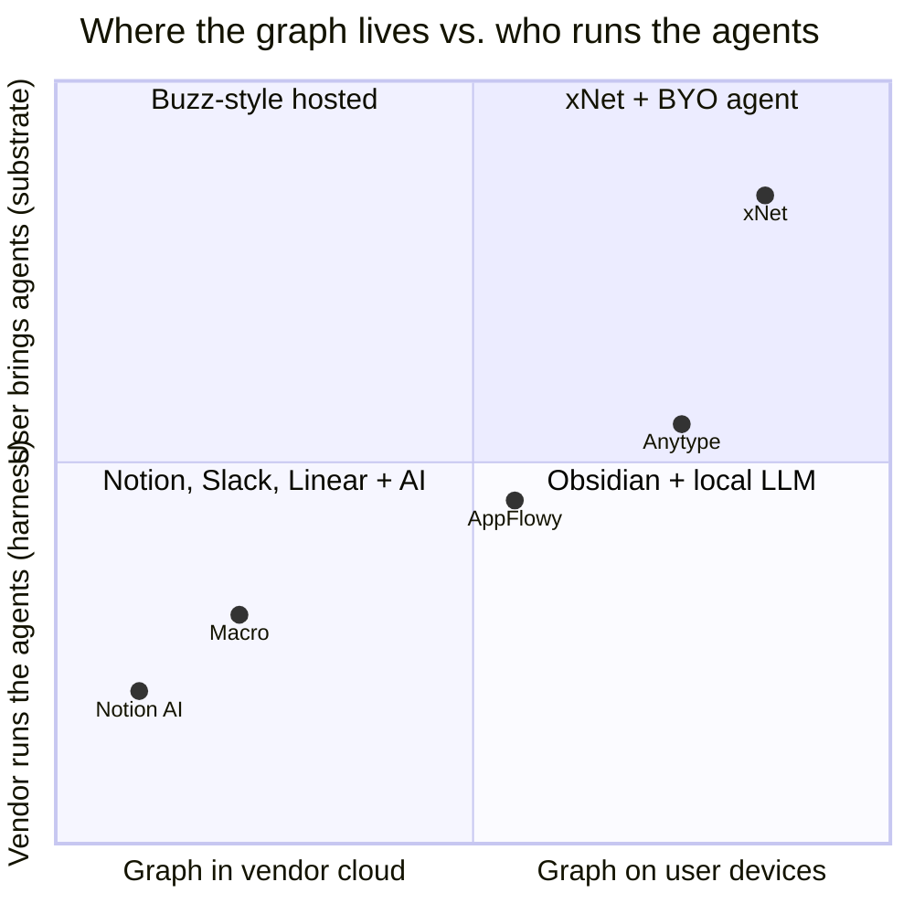
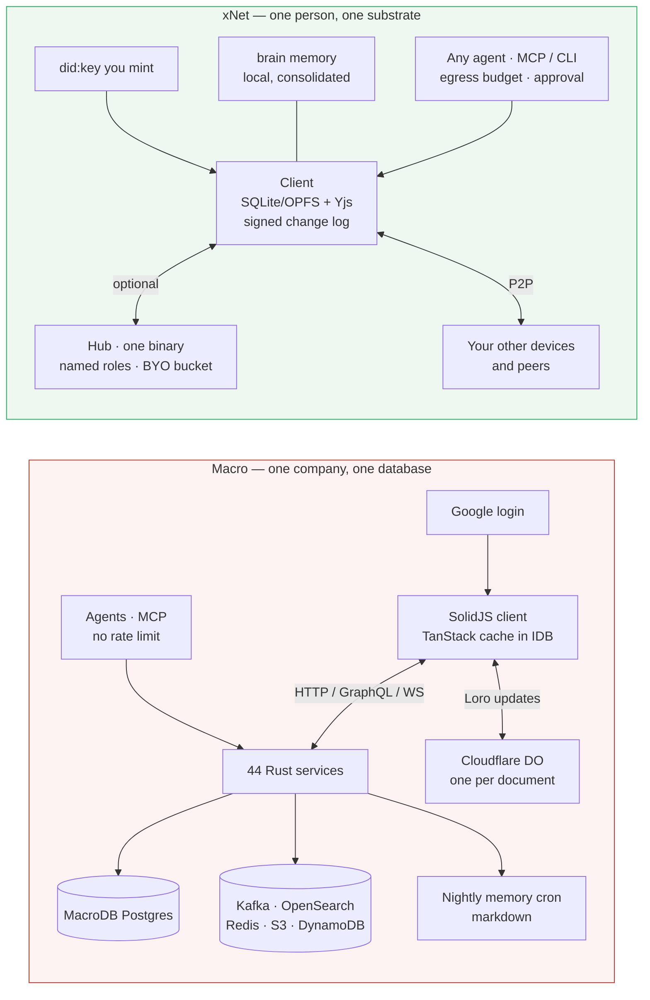
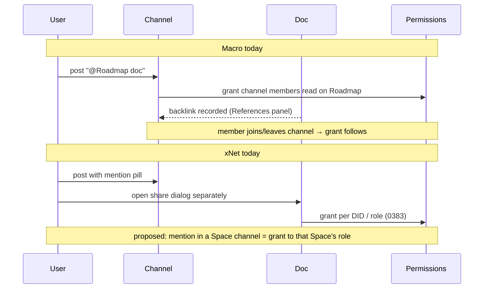

# xNet vs Macro — the computable company versus the owned substrate

> [!TIP]
> **TL;DR** — [Macro](https://github.com/macro-inc/macro) (AGPL, Rust + SolidJS,
> launched 1.0 in spring 2026) is the closest thing yet to xNet's product thesis
> built the _other way round_: same diagnosis ("the company was not
> computable" — every tool an island, held together by MCP and Zapier), same
> cure at the data-model level (one bidirectional graph, @-links everywhere,
> agents as first-class CRDT peers, one memory over everything), but the
> computable thing lives in **their** Postgres behind a **Google** login at
> **$40 per seat**, and only the documents are CRDT-offline. xNet puts the same
> graph on **your** devices under **your** key. Do not compete on "open
> source" — Macro is fully open and that card is gone. Compete on **exit,
> consent defaults, the floor and price shape**, import four specific ideas
> (mention-as-grant, one inbox with Signal/Noise, memory as plain markdown, a
> Macro importer), add Macro to the compare page, and treat Macro's production
> Loro deployment as a tripwire on 0330/0445.

## Problem Statement

A well-funded, dogfooded, fully open-source "single system for the whole
company" shipped this year and is trending. It says the sentence xNet has been
saying for two years — a workspace where email, chat, docs, tasks, CRM, calls
and agents share one graph and one memory — and it says it with a working
Gmail client, an iOS app, ISO 27001 and SOC 2. Anyone who reads xNet's
[compare page](../../site/src/pages/compare.astro) or the
[roadmap](../../site/src/pages/roadmap.astro) will ask "isn't that just Macro,
but less finished?" This exploration answers that question honestly: where
the two are the same, where they are opposites, what xNet should copy, and
what xNet must never copy.

## Executive Summary

| Question                              | Macro                                                                                                       | xNet                                                                                                                                       |
| ------------------------------------- | ----------------------------------------------------------------------------------------------------------- | ------------------------------------------------------------------------------------------------------------------------------------------ |
| Where does the graph live?            | One Postgres (`MacroDB`) plus S3, OpenSearch, Redis, DynamoDB, Kafka — in Macro's cloud                     | On every device: SQLite/OPFS local store, signed hash-chained change log, optional hub                                                       |
| Who holds the identity?               | Google account (Gmail / Workspace sign-in is mandatory for the hosted product)                              | A `did:key` you mint; works on any hub; nobody can revoke it                                                                                |
| What is CRDT / offline?               | Documents only (Loro via Cloudflare Durable Objects); everything else is a TanStack query cache in IndexedDB | Everything: rich text (Yjs), structured nodes (LWW change log), blobs; full offline with no hub at all                                       |
| Agents                                | First-class peers; MCP server with near-full UI coverage; **no rate limits**; nightly memory cron            | Substrate, not harness (ADR-29); MCP + `xnet connect`; signed audit, two-tier approval, **egress budget** (0442)                             |
| Memory                                | Personal + team memory synthesised nightly; calls and tasks flow into team memory **by default**             | `@xnetjs/brain` consolidation is local; transcripts are device-local, never hub (0419); Consent §4 says nothing leaves without permission |
| Licence                               | AGPLv3, "not open core"; commercial licence for enterprises that find AGPL inconvenient                      | MIT core, FSL on the cloud control plane (0345); no protocol tolls (Charter §6)                                                              |
| Price shape                           | $0 solo / $40 per person per month; **teams need a paid seat for every member**                              | Free forever on your devices; cloud billed on operations, **never per member on communities** (Charter §6)                                  |
| Self-host                             | Possible under AGPL, "not our primary focus yet", needs Nix + Docker + ~10 infra services                    | `xnet hub` is one binary with named roles (0382/0383); BYO bucket                                                                          |
| Exit                                  | Markdown bulk export for docs; memory stored as plaintext markdown; otherwise the API                        | `.xnetpack` verified bundles (0344), JSON export, portable identity; "Refusal is not confiscation" (§2, ADR-36)                            |

The two products agree about the **shape** of the answer and disagree about
its **location**. That is the whole comparison, and it is why xNet cannot win
by listing features — Macro has more of them today — and cannot win by being
"open" — Macro is at least as open. It wins, if it wins, on the things a
cloud-first architecture cannot retrofit: exit that loses nothing, consent as
the default, old hardware still working, and a price that does not scale with
headcount.

---

## Current State In The Repository

### What xNet already has that maps onto a Macro "block"

| Macro block     | xNet today                                                                                                                                                                              | Status                              |
| --------------- | --------------------------------------------------------------------------------------------------------------------------------------------------------------------------------------- | ----------------------------------- |
| Docs (markdown, CRDT) | TipTap/BlockNote on Yjs, `packages/editor`, `packages/history` (0376 history tab 80 % built)                                                                                        | ✅ Shipped                          |
| Tasks           | Task nodes + board/list lenses, `apps/web`, 0390 one-nav                                                                                                                                | ✅ Shipped                          |
| Messages / DMs  | `packages/comms/src/chat`, presence, notify inbox (0167/0168)                                                                                                                           | ✅ Shipped                          |
| Calls           | `packages/comms/src/calls`; botless transcription in `packages/meetings` (0279)                                                                                                         | ✅ Shipped (transcripts local-only) |
| Canvas          | `packages/canvas`, `packages/canvas-core`                                                                                                                                               | ✅ Shipped                          |
| CRM             | `packages/crm` (0188)                                                                                                                                                                   | ✅ Shipped, thin                    |
| File storage    | `packages/storage`, blob sync (⚠️ >1 MB blobs silently unsynced, 0385)                                                                                                                  | 🚧 Partial                          |
| Agents          | `packages/data/src/agent-audit`, `packages/cli/src/utils/agent-backend.ts`, `xnet connect claude-code\|codex` (0393), `/v1/agent/stream` (0392), in-chat approval ceremony (0394)         | ✅ Shipped as substrate             |
| Team memory     | `packages/brain/src/memory.ts`, `memory-from-traces.ts`, `memory-apply.ts` (0211, 0415) — **local**, no nightly cross-person synthesis                                                  | 🚧 Primitives only                  |
| Email           | Exploration 0308 (JMAP) — `[_]`, nothing shipped; no Gmail connector                                                                                                                    | ❌ Not started                      |
| Pull requests   | Nothing                                                                                                                                                                                 | ❌ Not started                      |
| Mobile          | `apps/expo` in development                                                                                                                                                              | 🚧 Partial                          |
| Bidirectional links | Node references + backlinks in `packages/data/src/external-references.ts`, mention pickers (four stacks, see `mention-handle-surfaces`)                                              | ✅ Shipped, four pickers to unify   |
| Export / exit   | `packages/data/src/portability/` (`.xnetpack`, verify + replay), `json-export.ts`, `did:key` in `packages/identity/src/keys.ts`                                                          | ✅ Shipped                          |
| Compare page    | `site/src/data/compare.ts` — Notion, Airtable, AppFlowy, AFFiNE, Anytype… **no Macro**                                                                                                  | ❌ Missing entry                    |

### What the Charter already decides

- **§2 Exit** — portable identity, open signed wire format, offline with no
  hub. Macro's export story is "docs are markdown, memory is markdown, and
  you can always self-host". That is a genuine exit, but it is an exit that
  requires standing up Postgres, Kafka, OpenSearch, Redis, LocalStack,
  FusionAuth and a Cloudflare Worker (`docs/RUNNING_LOCALLY.md`).
- **§4 Consent** — nothing leaves without permission. Macro's
  `unified-memory.mdx`: "Calls are recorded, transcribed, and shared to team
  memory by default. You can opt out per call." xNet went the other way in
  0419 (transcripts device-local, never hub) and 0426 (surrender as a design
  constraint). Same feature, opposite default.
- **§6 No ground rent** — no per-member pricing on communities, no protocol
  tolls. Macro's `billing.mdx`: "Teams require a paid seat for every member;
  there's no free plan for teams." Macro's `why-macro-is-open-source`
  explicitly expects AGPL compliance friction to push enterprises onto a
  commercial licence — the licence _is_ the toll booth, and it is honest
  about it.
- **ADR-29 xNet is not a harness** (0416). Macro _is_ a harness as well as a
  substrate: hosted agents, model picker, automations, nightly cron. xNet
  deliberately does not build that layer.

## External Research

### What Macro is (from the repo, `main` @ `4067868`, 14 Aug 2026)

- **Stack.** SolidJS client (browser, Tauri desktop, iOS via Tauri; Android in
  progress). 44 deployable services and Lambda handlers under `services/`,
  167 Rust crates. Hexagonal architecture per service. Nix dev shell, Bun,
  `just`, Pulumi. `VERSION` is `v2026.4.28.0`; the X launch post for 1.0 is
  from the same window; README says "dogfooded by ~15 people for two years".
- **Data.** `AGENTS.md` (their Claude guidance): "MacroDB: main PostgreSQL
  database for documents, users, projects, communication data … email
  threads … notification preferences", plus ContactsDB, S3, Redis,
  OpenSearch, DynamoDB, Kafka. The "bidirectional graph" is rows and
  backlinks in Postgres, surfaced as the References panel.
- **CRDT is documents only.** `packages/collaboration` = "Loro manager, sync
  engine, awareness, snapshots, and write-ahead log". `services/sync-service`
  is a Rust Cloudflare Worker: one Durable Object per document, in-memory
  `LoroDoc`, snapshot to DO storage on a 5 s heartbeat alarm, JWT in the
  WebSocket query string minted by `document_storage_service`. Their own
  README carries the TODO: "eventually we will want to validate … that the
  user only receives updates and does not push any updates" — read-only
  access is not yet enforced at the sync layer.
- **Offline for the rest** is `apps/web/src/lib/queries/persistence/per-query-idb.ts`
  — a TanStack Query cache persisted per-query to IndexedDB, plus a GraphQL
  cache worker. There is an OPFS wrapper (`lib/filesystem`) for file
  handling. Nothing structured survives without the server; there is no
  local write log for tasks, messages, CRM or email.
- **`packages/loro-mirror`** is their MIT-licensed schema-typed state layer
  over `loro-crdt` (an in-repo fork of `@loro-mirror/core`) — the one piece
  of Macro that xNet could legally read for ideas without AGPL contact.
- **Agents.** `mcp_service` (Rust) with an OAuth proxy; docs say near-100 %
  UI coverage and "no rate limits on MCP". Agents "inherit the permissions
  you have"; actions are "attributed to you". Coding agents attach with
  `claude mcp add --transport http macro https://mcp-server.macro.com/mcp`.
  Automations run on schedules; the daily "pool games" doc-updater is the
  showcase.
- **Memory.** `product/unified-memory.mdx`: nightly refresh over email,
  messages, tasks, docs, calls, connectors; personal memory per user plus a
  team memory; tasks and calls flow in by default; stored as plaintext
  markdown; "limited configurability".
- **Business.** Free tier (fast model only, limited tool calls, 5 GB) or
  Premium at $40/person/month (1 TB, all models, unlimited tool calls).
  Google sign-in only. Self-hosting is free under AGPL but "isn't our primary
  focus yet … we hope to turn our attention to this later this year (2026)";
  FedRAMP and on-prem via `self-host@macro.com`; commercial licence via
  `licensing@macro.com`. ISO 27001, SOC 2 Type II, EU hosting, BAAs.

### How Macro's founders frame it

From `why-macro-is-open-source`: "if I was not the founder of Macro, but
rather an arms-length user of Macro, I would want it to be open source" —
licensing as a product feature; AGPL "provides some protection against large
companies and hyperscalers using Macro without contributing back"; the goal
is "the operating system for your company", "the workspace itself should be
programmable". From the README: "every team got their own tools and the
company was held together by MCP and Zapier. The company was not
computable."

> [!NOTE]
> That last sentence is exploration 0442's thesis in six words. Macro and
> xNet read the Zapier-MCP world identically. Macro's fix is to move the
> whole company into one database they run; xNet's fix is to move the whole
> workspace onto one substrate you run. This is the Freenet pattern again
> (0395): same diagnosis, opposite prescription.

<details>
<summary>Macro repository layout and services (raw notes)</summary>

```text
macro/
├── apps/web        SolidJS + Tauri; lexical editor; TanStack Query; urql
├── apps/docs       docs.macro.com (Mintlify-style mdx)
├── services/       44: authentication_service, connection_gateway, contacts_service,
│                   document_storage_service, document_cognition_service, email_service,
│                   lexical-service, mcp_service, mcp_auth_proxy, notification_service,
│                   search_processing_service, sync-service (CF Worker, Loro DOs),
│                   websocket-service, transcription, ai-editing-worker,
│                   coding-agent-worker, scheduled_action, dataloss_prevention_handler,
│                   organization_retention_*, email_* lambdas …
├── crates/         167 Rust libs, sqlx, macro_db_client migrations
├── packages/       collaboration, lexical-core, loro-mirror (MIT), observability, sdk
├── infra/          Pulumi
├── docker/         Postgres, Redis, LocalStack, OpenSearch, Kafka, FusionAuth, Mailpit
└── nix/            pinned dev shell
```

Local run: `nix develop` → `just run_local --no-doppler` → seed with
`just seed-scenario apply --file seed/scenarios/team-perms.json`. Third-party
integrations (Google, GitHub, Stripe, CloudFront) are stubbed locally, so
the email block — the centrepiece — does not work against a real inbox
without keys.

</details>

## Key Findings

1. **Same graph, different address.** Both products model the workspace as
   typed entities with bidirectional references and put agents inside the
   graph. Macro stores it in Postgres it operates; xNet stores it as a signed
   change log on the user's devices. Every downstream difference — exit,
   consent, price, floor — follows from that one choice.

2. **"Open source" is no longer a differentiator against this competitor.**
   Macro is AGPL end to end, not open core. xNet's advantage is _permissive_
   (MIT — you can build a business on it without a licence call) and
   _portable_ (the protocol is the product), not "open vs closed".

3. **Macro's offline is documents-only; xNet's is everything.** This is the
   technical fact behind the marketing. A Macro user on a plane can edit a
   doc but cannot create a task, send a message or update a deal and have it
   reconcile; the IDB cache is read-through. This matters less than
   local-first advocates think for a company tool, and more than Macro's copy
   admits for the "own your data" claim.

4. **Consent defaults are inverted.** Macro: calls into team memory by
   default, opt out per call; agents run with your full permissions;
   unlimited MCP. xNet: transcripts never leave the device, egress budget,
   two-tier approval. Macro optimises for the company's memory; xNet
   optimises for the person's consent. Both are coherent; a buyer picks.

5. **Price shape is opposite.** $40/seat with every team member paid is
   ground rent by Charter §6's definition — you pay for the door, not the
   improvement. Macro is candid that AGPL friction is a revenue lever. xNet
   cannot match Macro's polish at that price and should not try to match its
   price shape at all.

6. **Macro is a production, at-scale Loro deployment.** 0330 rejected
   adopting Loro partly on risk ("single-founder, no bindings"). A funded
   team shipping Loro in Rust Durable Objects to paying customers is exactly
   the observation 0330's and 0445's tripwires should watch. It does not
   flip the decision (Yjs 14 rc is the payoff), but the "nobody serious runs
   Loro" premise is now false.

7. **Email is Macro's centre of gravity and xNet's biggest hole.** Macro's
   inbox is Gmail-only, which is a real limitation, but xNet has no inbox at
   all (0308 unstarted). Macro's "one inbox" (email + messages + mentions +
   tasks + agent replies, Signal/Noise split, `j`/`k`/`e`) is the single most
   copyable UX idea in the product, and xNet already has three of the four
   feeds.

8. **Mention-as-grant is a better sharing primitive than xNet's.** In Macro,
   @-mentioning a doc in a channel shares it with the channel; membership
   changes flow permission through. xNet has four mention picker stacks and
   a separate share dialog. This is directly importable onto the hub roles
   model (0383) without touching the wire format.

9. **Macro's self-host story is real but heavy; xNet's is light but young.**
   Ten infra services and Nix versus one binary with named roles. This is
   the axis where xNet's "everything is a hub" (0382) actually pays off in a
   comparison — the small team that will not run Kafka.

## Options And Tradeoffs



| Option                                                    | What it means                                                                                             | Verdict          | Why                                                                                                                                             |
| --------------------------------------------------------- | --------------------------------------------------------------------------------------------------------- | ---------------- | ----------------------------------------------------------------------------------------------------------------------------------------------- |
| **A. Ignore Macro**                                       | No compare-page entry, no positioning change                                                              | 🛑 Rejected      | It is trending, open, and says our sentence; silence reads as not having an answer                                                              |
| **B. Chase feature parity**                               | Build Gmail sync, PR integration, nightly team memory, iOS, to match the block table                       | 🛑 Rejected      | Loses on polish, wins nothing; violates "don't add features beyond what was requested" and ADR-29 (harness)                                     |
| **C. Position on the axis Macro cannot move on**          | Compare-page entry + positioning copy: exit, consent defaults, floor, price shape; import 4 UX ideas       | ✅ Recommended   | Differences are architectural, not effort; Macro would have to rewrite 44 services to match them                                                |
| **D. Interop: import from Macro**                         | A `.xnetpack` importer for Macro's markdown docs export + memory markdown; later their SDK/API             | ✅ Recommended (small) | Charter §2 in reverse — make leaving Macro cheap; their docs are markdown-native, so this is a mapping not a parser                        |
| **E. Interop: xNet as an MCP client of Macro**            | Let an xNet agent read a Macro workspace via their MCP                                                     | 🟡 Later         | Cheap via `agentExtraTools` (0442 consume lane) once the perm-laundering fix (0440) lands; not a positioning move                                |
| **F. Adopt Loro because Macro proved it**                 | Re-open 0330                                                                                              | 🛑 Not now       | 0445 already renewed "stay on Yjs" with tripwires; log Macro as evidence, don't reopen                                                          |
| **G. Blog essay: "The Computable Company"**               | Essay #24 — same diagnosis, opposite prescription; why the address of the graph matters                    | 🟡 Optional      | Fits the essay run (Wall Faces Inward, Door Inside the House); do it only if the compare-page entry lands first                                 |

> [!IMPORTANT]
> Charter §6 tests do **not** apply here — this exploration proposes no
> revenue lane. But the comparison itself is a §6 receipt: Macro's per-seat
> pricing and AGPL-as-friction are the textbook "ground rent" xNet refuses.
> The compare-page copy should say so factually and without sneering; Macro
> is candid about it and it is a legitimate business.

### The one diagram that carries the argument



<details>
<summary>Detailed walkthrough</summary>

Read left to right in each box: the thing that authenticates you, the thing
that holds state, the thing that syncs. In Macro the durable state is the
Postgres row and the Loro snapshot in a Durable Object; the client is a cache.
Delete the client and nothing is lost; delete the account and everything is.
In xNet the durable state is the signed change log on the device; the hub is
a cache-plus-relay. Delete the hub and nothing is lost; the identity was
never the hub's to delete. Agents enter at the same point in both — the
graph — but Macro's enter with your full permissions and no meter, xNet's
enter through an approval ceremony and an egress budget.

</details>

### Mention-as-grant, side by side



## Recommendation

**Option C plus the small D**, in this order:

1. **Add Macro to `site/src/data/compare.ts`** in the Products layer, with
   the dimensions filled honestly: `localFirst: partial` (docs only),
   `offline: partial`, `collab: real-time (Loro DOs) + chat + calls`,
   `license: AGPL-3.0`, `ai: hosted agents + MCP + nightly memory`,
   `pricing: $0 / $40 per seat`, `Self-host: AGPL, heavy, not primary
   focus`. Footnote the sources (their `billing.mdx`, `faq.mdx`,
   `sync-service/README.md`). Add a decision-guide row: "Whole-company
   suite with email, hosted, today → **Macro**; the same graph on your own
   devices → xNet."
2. **Write positioning copy that names the axis**: not "we are open" but
   "your key, your device, your exit; nothing joins team memory without you
   saying so; no per-seat door charge; runs on the laptop you already own."
   One paragraph on `why.astro`, one row on `compare.astro`'s tradeoffs
   list. Point at Macro as the good hosted alternative.
3. **Import four ideas** (each its own small exploration or PR, none touching
   the wire format):
   - **One inbox** — merge chat, mentions, task assignments and agent replies
     into the existing notify inbox (`packages/comms/src/notify`) with a
     Signal/Noise split and `j`/`k`/`e`. Email joins it when 0308 ships.
   - **Mention-as-grant** — a mention inside a Space channel grants that
     Space's role on the target node; membership changes flow through.
     Builds on 0383 roles; collapses one of the four picker stacks.
   - **Memory as plain markdown** — `packages/brain` consolidation output
     should be a readable, exportable markdown node the user can edit,
     exactly as Macro does; keeps §2 and §4 honest and makes memory
     legible.
   - **`switch-from-macro`** — a `.xnetpack` importer for Macro's markdown
     bulk export and memory files. Their docs are markdown-native, so this
     is a mapping onto document nodes plus @-link rewriting.
4. **Log Macro as tripwire evidence** on 0330/0445 (production Loro at scale)
   and on 0442 (a second team stating "held together by MCP and Zapier" as
   the problem). Do not reopen either decision.
5. **Do not** build a hosted agent runner, a nightly cross-person memory
   cron, or Gmail sync _because_ Macro has them. Email is worth doing on its
   own merits (0308) and should be judged there.

> [!WARNING]
> AGPL contamination: nothing under `macro-inc/macro` except
> `packages/loro-mirror` (MIT) may be copied into xNet's MIT core. Read the
> ideas, not the code. The compare-page footnotes should link to their
> files, never quote more than a line.

## Example Code

The compare-page entry, shaped like its neighbours in
`site/src/data/compare.ts`:

```ts
{
  name: 'Macro',
  url: 'https://github.com/macro-inc/macro',
  maturity: 'production',
  license: 'AGPL-3.0',
  bestFor: 'A whole-company suite — email, chat, docs, tasks, CRM, calls, agents — hosted, with one team memory',
  dims: {
    localFirst: { v: 'partial', fn: 'macro-docs-only' },
    offline: { v: 'partial', fn: 'macro-docs-only' },
    collab: 'Real-time docs (Loro on Cloudflare DOs), channels, calls',
    ai: 'Hosted agents + MCP (full coverage) + nightly memory',
    pricing: 'Free / $40 per seat; teams all-paid'
  },
  details: {
    'Rich text': 'Lexical + Loro, markdown-native',
    Databases: 'CRM objects, custom properties, views',
    Canvas: 'Yes',
    Plugins: 'MCP server, SDK, automations',
    'Data ownership': 'Vendor cloud (Postgres); Google sign-in',
    Platforms: 'Web, Tauri desktop, iOS; Android in progress',
    'Self-host': 'AGPL; Nix + Docker, ~10 infra services; "not primary focus yet"'
  },
  footnotes: ['macro-docs-only', 'macro-selfhost', 'macro-pricing']
}
```

And the footnotes:

```ts
{
  id: 'macro-docs-only',
  text: 'Only documents are CRDT-synced and offline-editable (Loro, one Durable Object per doc). Tasks, messages, CRM and email are a TanStack Query cache persisted to IndexedDB.',
  source: 'https://github.com/macro-inc/macro/tree/main/services/sync-service',
  verified: 'Aug 2026'
},
{
  id: 'macro-selfhost',
  text: 'Self-hosting is free under AGPLv3 but "isn\'t our primary focus yet"; the team hopes to turn to it later in 2026.',
  source: 'https://docs.macro.com/faq',
  verified: 'Aug 2026'
},
{
  id: 'macro-pricing',
  text: '$0 solo (fast model, limited tool calls, 5 GB) or $40 per person per month; teams require a paid seat for every member.',
  source: 'https://docs.macro.com/account/billing',
  verified: 'Aug 2026'
}
```

## Risks And Open Questions

- **Macro self-hosting gets easy.** If a one-command self-host lands in late
  2026, the "heavy self-host" line on the compare page rots. That is the
  `review` date.
- **Macro goes local-first beyond docs.** `loro-mirror` is a schema-typed
  state layer over Loro; it would be a natural base for making tasks and
  messages CRDT too. Watch `packages/collaboration` for non-document
  managers. If that happens, the "docs-only" footnote must change and the
  differentiator narrows to identity, exit and price shape.
- **Fairness.** Everything above about defaults and pricing is drawn from
  Macro's own docs as of Aug 2026. Compare-page copy must footnote and date
  it; a stale unflattering claim is worse than none (0364, 0368).
- **Are we the same buyer?** Macro's buyer is a 5–50 person startup that
  wants Superhuman + Slack + Linear + Notion + HubSpot in one tab. xNet's
  buyer today is a person or small group that wants to own their workspace.
  Overlap is the small team that cares about ownership; that group is real
  but smaller than either marketing page implies.
- **Open question:** does mention-as-grant fit hub roles without a new rung?
  0304 found space-less channels resolve no create rungs; a mention grant
  is a read rung, which should be fine, but verify against
  `packages/hub/AGENTS.md` authorization before promising it.
- **Open question:** should memory-as-markdown be per-Space (shared) as well
  as personal? Charter §4 says the shared one must be opt-in per item, which
  is the exact inverse of Macro's default. Design that before building.

## Implementation Checklist

**Status:** ░░░░░░░░░░ 0/8 items

- [ ] Add Macro entry + three footnotes to `site/src/data/compare.ts` (Products layer) and bump `updated`
- [ ] Add a decision-guide row and a tradeoffs row on `site/src/pages/compare.astro` naming Macro as the hosted whole-company suite
- [ ] Add one paragraph to `site/src/pages/why.astro` positioning on exit / consent default / floor / price shape (no "we are open source" claim as the differentiator)
- [ ] Add a tripwire line to 0330 and 0445: "Macro ships Loro in production Durable Objects (Aug 2026)"
- [ ] Add a note to 0442 citing Macro's "held together by MCP and Zapier" as independent confirmation of the diagnosis
- [ ] Open a follow-up exploration: one inbox with Signal/Noise over `packages/comms/src/notify` (chat + mentions + tasks + agent replies)
- [ ] Open a follow-up exploration: mention-as-grant on hub roles (0383), verifying rung fit against 0304
- [ ] Open a follow-up exploration: `switch-from-macro` `.xnetpack` importer for markdown docs + memory files

## Validation Checklist

- [ ] `pnpm --filter site build` passes with the new compare entry and the page renders Macro in the Products table with footnotes resolving
- [ ] `pnpm check:exploration-links` passes (this doc's relative links to `../../site/...` and sibling explorations resolve)
- [ ] Every factual claim about Macro on the compare page carries a footnote with a URL into `macro-inc/macro` or `docs.macro.com` and a `verified` month
- [ ] 0330 / 0445 / 0442 diffs are additive tripwire or note lines only — no status or recommendation change
- [ ] No file from `macro-inc/macro` other than ideas is copied into the repo (grep for `macro-inc` outside `docs/` and `site/src/data/compare.ts` returns nothing)

## References

- Macro repo — https://github.com/macro-inc/macro (`main` @ `4067868`, 14 Aug 2026; `VERSION` `v2026.4.28.0`)
- Macro README (verbatim source of "the company was not computable") — https://github.com/macro-inc/macro/blob/main/README.md
- Macro sync service (Loro on Durable Objects) — https://github.com/macro-inc/macro/tree/main/services/sync-service
- Macro `packages/collaboration`, `packages/loro-mirror` (MIT) — https://github.com/macro-inc/macro/tree/main/packages
- Macro `docs/RUNNING_LOCALLY.md` — https://github.com/macro-inc/macro/blob/main/docs/RUNNING_LOCALLY.md
- Macro billing — https://docs.macro.com/account/billing ; FAQ (self-hosting) — https://docs.macro.com/faq ; unified memory — https://docs.macro.com/product/unified-memory ; mentions — https://docs.macro.com/concepts/mentions
- "Why Macro is open source" — https://macro.com/posts/why-macro-is-open-source
- Macro 1.0 launch post — https://x.com/macrodotcom/status/2086843485898887523
- xNet Charter — [`docs/CHARTER.md`](../CHARTER.md) §2 Exit, §4 Consent, §6 No ground rent
- Compare page — [`site/src/data/compare.ts`](../../site/src/data/compare.ts), [`site/src/pages/compare.astro`](../../site/src/pages/compare.astro)
- Related explorations: [0416 harness or substrate](./0416_[-]_AGENT_HARNESS_OR_AGENT_SUBSTRATE.md) (ADR-29), [0442 Zapier MCP](./0442_[_]_XNET_AND_ZAPIER_MCP_SUBSTRATE_VERSUS_AGGREGATOR.md), [0395 Freenet 2](./0395_[_]_FREENET_2_SERVICES_WITHOUT_SERVERS_AND_XNET.md), [0330 Automerge vs Yjs](./0330_[_]_CRDT_DEPTH_AUTOMERGE_VS_YJS.md), [0345 copyleft](./0345_[_]_COPYLEFT_LICENSING_GPL_AGPL_VS_MIT_PLUS_FSL.md), [0308 JMAP email](./0308_[_]_USING_JMAP_FOR_EMAIL_SYNC.md), [0211 second brain](./0211_[x]_AI_SECOND_BRAIN_GRAPHRAG_MEMORY_AND_TIERING.md), [0383 hub roles](./0383_[x]_TURNING_HUBS_INTO_EVERYTHING_THE_ROLE_IMPLEMENTATION_PLAN.md), [0382 everything is a hub](./0382_[_]_EVERYTHING_IS_A_HUB_ROLES_NOT_SERVICES_AND_THE_HUB_OF_HUBS.md), [0344 export/import](./0344_[x]_FIRST_CLASS_DATA_EXPORT_IMPORT_AND_PORTABLE_BUNDLES.md), [0236 compare-page placement](./0236_[x]_COMPARE_PAGE_XNET_PLACEMENT_IN_SYNC_AND_PROTOCOL_LAYERS.md)
