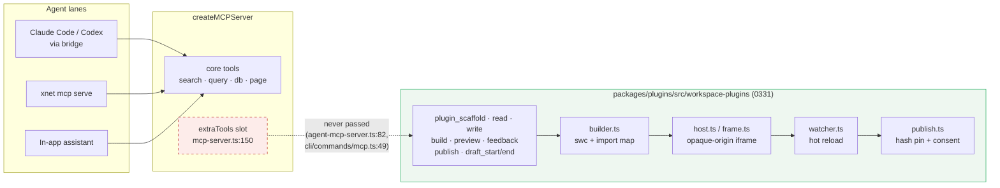

# Learning from Macro — wire the loop before widening the suite

> [!TIP]
> **TL;DR** — Macro's lesson is not "add email, PRs and calendar." It is that
> <mark>integration is a property of the data model and the mention primitive,
> not a count of blocks</mark> — and xNet already has the graph. What xNet lacks
> is the thing Macro cannot have: agents that build the blocks. That loop
> (0331: `plugin_scaffold` → build → sandboxed preview → feedback → publish)
> is **fully built, tested, and wired into nothing** — neither MCP server
> construction site passes `extraTools`, so Claude Code, Codex and the in-app
> assistant cannot see a single `plugin_*` or `lab_*` tool. Wire it first
> (Pillar 1). Then widen breadth **through** it: calendar as the first
> agent-assisted block (0160, ICS/CalDAV before Google), pull requests by
> finishing the one missing `apply` on the already-verified GitHub webhook
> (0213), email last and client-side (0308) after a background-sync rung
> exists for plugins. Adopt one rule for every new block: <mark>if an agent
> could not have built it as a workspace plugin, fix the plugin API before
> building the block</mark>. That is how fifteen-people-two-years breadth
> compounds instead of being hand-built.

## Problem Statement

[0446](./0446_[_]_XNET_VS_MACRO_COMPUTABLE_COMPANY_VERSUS_OWNED_SUBSTRATE.md)
established that Macro and xNet share a thesis and differ on where the graph
lives. This follow-up asks the practical question: what should xNet actually
_do_ about Macro? The pull is real and honest — Macro is integrated in a way
that makes you want email, pull requests, calendar and "everything a business
needs" in one place. The counter-pull is equally real: the
[three-pillar roadmap](../ROADMAP.md) says Pillar 1 is an **AI daily driver**
where agents generate docs, build databases and write sandboxed plugins, gated
by the user's own daily use, not by features. Every block added by hand is a
week not spent making that loop work.

The question is not breadth _or_ depth. It is: **in what order, and through
what mechanism, does breadth arrive so that it compounds instead of
accumulating?**

## Executive Summary

1. **The plugin-authoring loop is done and dark.**
   [0331](./0331_[x]_DEVELOPING_XNET_FROM_INSIDE_XNET_SPEC_TO_PLUGIN_LOOP.md)
   is `[x]` — nine `plugin_*` agent tools, swc-in-browser builder, opaque-origin
   iframe host, hot reload, hash-pinned publish, draft start/end — all in
   `packages/plugins/src/workspace-plugins/` with eight test files. But
   `git grep createWorkspacePluginAgentTools -- ':!packages/plugins/src'`
   returns only a CHANGELOG line. `apps/electron/src/main/agent-mcp-server.ts`
   and `packages/cli/src/commands/mcp.ts` both call `createMCPServer` without
   `extraTools`. The bridged coding agent, the CLI MCP server and the in-app
   assistant are all blind to it. This is the 0377 pattern again ("all built,
   unwired") and it is the highest-leverage fix in this document.
2. **Macro's integration comes from three primitives, all of which xNet
   has or nearly has:** a typed graph with backlinks, a mention that carries
   permission, and one inbox. Macro then hand-built ten blocks on top over two
   years with ~15 people. xNet should not replicate the hand-building; it
   should make the blocks agent-buildable and let the loop carry breadth.
3. **Three specific blocks are worth adding, in this order: calendar → pull
   requests → email.** Calendar because it is the cheapest genuinely new data
   class and the ideal first agent-assisted block (0160 already designed it,
   ICS/CalDAV need no OAuth). Pull requests because 0213 already verifies and
   normalises GitHub webhooks and is missing exactly one callback. Email last
   because it is the most sensitive data class, must be client-side (0308),
   and needs a background-sync rung the plugin runtime does not yet have.
4. **One rule governs breadth from here:** every new block enters as a
   workspace plugin (or a `FeatureModule` at first-party tier, 0205-A) that an
   agent could have scaffolded. Where the plugin API cannot express it —
   long-lived sync, credentials, main-process access — the gap in the API is
   the work item, not the block.
5. **Import four Macro UX ideas** already named in 0446: one inbox with
   Signal/Noise, mention-as-grant, memory as editable markdown, a
   `switch-from-macro` importer. They are polish, not breadth, and they make
   the daily driver better for the user who is the gate.

---

## Current State In The Repository

### The loop, segment by segment

| Segment                                  | Where                                                                                                                       | Built | Wired into an agent lane                                                          |
| ---------------------------------------- | --------------------------------------------------------------------------------------------------------------------------- | ----- | --------------------------------------------------------------------------------- |
| `PluginSource` node schema               | `packages/plugins/src/schemas/plugin-source.ts`                                                                             | ✅    | n/a (data)                                                                        |
| Builder (swc transpile + import map)     | `packages/plugins/src/workspace-plugins/builder.ts`, `import-map.ts`                                                        | ✅    | —                                                                                 |
| Sandboxed host + preview                 | `workspace-plugins/host.ts`, `frame.ts`, `preview.ts`, `store-rpc.ts`                                                       | ✅    | —                                                                                 |
| Hot reload watcher                       | `workspace-plugins/watcher.ts`                                                                                              | ✅    | —                                                                                 |
| Hash pin + publish                       | `workspace-plugins/hash.ts`, `publish.ts`                                                                                   | ✅    | —                                                                                 |
| Agent tools (`plugin_scaffold` … `plugin_draft_end`, 9 tools) | `workspace-plugins/agent-tools.ts` → `createWorkspacePluginAgentTools`                                        | ✅    | ❌ **no caller outside the package**                                              |
| MCP `extraTools` slot                    | `packages/plugins/src/services/mcp-server.ts:150` documents that `plugin_*` and `lab_*` "plug in here"                       | ✅    | ❌ never passed by `apps/electron/src/main/agent-mcp-server.ts:82` or `packages/cli/src/commands/mcp.ts:49` |
| Lab agent tools (`lab_*`)                | `packages/labs/src/agent-tools.ts`, `labAgentToolsToAiTools`                                                                | ✅    | ❌ same slot, same absence                                                        |
| `writing-xnet-plugins` skill export      | `packages/plugins/src/services/ai-workspace-exporter.ts`                                                                    | ✅    | 🚧 exported to the vault, but the tools it describes are unreachable              |
| Approval ceremony for plugin writes      | `packages/data/src/agent-audit`, `McpWriteGuardrail` (0337/0394)                                                            | ✅    | ✅ (would gate the tools once wired)                                              |
| Durable undo / mode dial                 | [0437](./0437_[_]_AGENT_AUTONOMY_MODES_ONE_DIAL_ACROSS_THREE_CONSENT_LANES.md) — `rollbackHandle` covers one tool            | ❌    | prerequisite for letting an agent iterate on a plugin draft without a click per file |

> [!IMPORTANT]
> The daily-driver pillar's headline capability — "agents write sandboxed
> plugins inside the workspace" — is one `extraTools:` argument away from
> being real in every lane, and today it is real in none of them. This is not
> a feature gap; it is a wiring gap, and it should be closed before any new
> block is started.

### The blocks Macro has, and what xNet's path to each is

| Macro block   | xNet today                                                                                                                                       | Path                                                                                                                                                                | Verdict          |
| ------------- | ------------------------------------------------------------------------------------------------------------------------------------------------ | ------------------------------------------------------------------------------------------------------------------------------------------------------------------- | ---------------- |
| Docs          | Yjs + BlockNote, `packages/editor`                                                                                                               | Polish (0376 history tab is 80 % built, 0 % surfaced)                                                                                                             | ✅ Have          |
| Tasks         | Task nodes, lenses, `TaskAutomationAction`                                                                                                       | Import Macro's "task from anything" — `/task` slash, checkbox→task, `@xNet` mention, agent chat                                                                     | ✅ Have, polish  |
| Messages      | `packages/comms/src/chat`                                                                                                                        | Import mention-as-grant (0446)                                                                                                                                      | ✅ Have, polish  |
| Calls         | `packages/comms/src/calls`, `packages/meetings`                                                                                                  | Keep transcripts device-local (0419); consent per item before anything joins shared memory                                                                         | ✅ Have          |
| Canvas        | `packages/canvas`                                                                                                                                | —                                                                                                                                                                  | ✅ Have          |
| CRM           | `packages/crm` (0188)                                                                                                                            | Macro's colocation idea — a company mention shows live status; notes-as-channel on a company                                                                       | ✅ Have, thin    |
| Files         | `packages/storage`                                                                                                                               | Fix >1 MB blob sync (0385) before "auto-import from email"                                                                                                         | 🚧 Partial       |
| Agents        | Substrate lanes (0392/0393/0394/0416)                                                                                                            | **Wire the plugin loop**; then 0437 mode dial                                                                                                                      | 🚧 Unwired       |
| Team memory   | `packages/brain` consolidation, local                                                                                                            | Memory as editable markdown node (0446); shared memory opt-in per item (Charter §4)                                                                                | 🚧 Primitives    |
| **Calendar**  | Calendar _view_ over databases (0339); no calendar data class; [0160](./0160_[_]_LOCAL_FIRST_GOOGLE_WORKSPACE_SYNC.md) designed Calendar → Gmail → Drive | **First agent-assisted block.** ICS import + CalDAV/ICS subscription as a workspace plugin; Google Calendar via 0160's Electron main-process adapter later | ❌ Build via loop |
| **Pull requests** | [0213](./0213_[x]_INTEGRATION_PLUGIN_CATALOG_WEBHOOKS_AND_CONNECTORS.md): hub verifies `X-Hub-Signature-256`, normalises to `TaskAutomationAction[]`, mounted **without `apply`** (`packages/hub/src/server.ts:704`) | Finish `apply` — but client-side or via a hub system identity (0189 deferred); PR node type + task backlink                             | ❌ One callback  |
| **Email**     | [0308](./0308_[_]_USING_JMAP_FOR_EMAIL_SYNC.md) `[_]`: JMAP client-side engine recommended; no Gmail                                             | Last. Needs a background-sync rung in the plugin/feature runtime; JMAP (Fastmail, Stalwart) first, Gmail via 0160 adapter later                                    | ❌ After rung    |
| iOS           | `apps/expo` in development                                                                                                                       | Roadmap-deferred (mobile parity)                                                                                                                                   | 🚧 Deferred      |

### What the roadmap already says

[`docs/ROADMAP.md`](../ROADMAP.md) (July 2026) orders the pillars: **AI daily
driver** first, gated by the author's own daily use; effortless cloud second;
Commons last. Verticals and mobile parity are explicitly deferred. Nothing in
this exploration re-orders that. It sharpens Pillar 1 to "wire the loop, then
grow breadth through it," and puts a small, ordered breadth list under it.

## External Research

- **Macro** (0446 has the detail): ten hand-built blocks, 44 services, 167
  crates, ~15 people, two years. Their integration primitives: Postgres
  backlinks (References panel), @mention that shares into a channel and
  follows membership, one inbox (email + messages + mentions + tasks + agent
  replies, Signal/Noise, `j`/`k`/`e`), a nightly memory cron writing markdown.
  Their agent story is _use_ (MCP with full UI coverage), not _build_ — agents
  edit docs and create tasks; they do not extend Macro. Their `README`
  explicitly says the "workspace itself should be programmable" and points at
  open source as the mechanism, i.e. fork-and-PR, not in-app.
- **Huly** ([hcengineering/platform](https://github.com/hcengineering/platform),
  EPL-2.0, ~24k stars) is the other open all-in-one: tasks, docs, chat, calls,
  team planner/calendar, bidirectional GitHub Issues sync. It shows the same
  shape as Macro (hand-built blocks over a shared platform) and the same
  self-host weight (2 vCPU / 8 GB minimum, Docker Compose). Its GitHub sync is
  the closest precedent for xNet's PR block: two-way, issue↔task.
- **BuilderIO/agent-native** ([0397](./0397_[_]_AGENT_NATIVE_FRAMEWORK_LESSONS.md),
  [0401](./0401_[_]_AGENT_NATIVE_SKILLS_AUDIT.md)): "one verb definition, seven
  callers." xNet has four parallel verb vocabularies and the agent sees one.
  Relevant here because every new block adds verbs; if they land in the wrong
  vocabulary the agent cannot use them and cannot build on them.
- **Patchwork / Ink & Switch** ([0327](./0327_[_]_PATCHWORK_VS_XNET_LEARNING_FROM_INK_AND_SWITCHS_CLOSEST_PARALLEL.md))
  remains the closest parallel for _agents-and-people writing the app from
  inside the app_; 0331 took its bundleless, source-in-the-document design.
  Nobody in the Macro/Huly class does this. It is the thing xNet is
  differentiated on and it is currently dark.
- **Email protocols** (0308): JMAP reaches Fastmail and self-hosted Stalwart;
  Gmail, M365, iCloud do not speak JMAP. Any "email in xNet" is therefore
  two projects: JMAP client-side (clean, local-first, honest) and a Gmail
  adapter (OAuth, main-process, 0160). Macro chose Gmail-only; xNet should
  choose JMAP-first for the same reason it chose `did:key` over Google
  sign-in.

## Key Findings

1. **The differentiator is dark.** The one capability the Macro/Huly class
   structurally lacks — agents extending the workspace from inside it, under
   glass — is built, tested and unreachable. Every block added before wiring
   it widens the gap between what xNet claims and what an agent can do.
2. **Breadth added by hand does not compound; breadth added through the loop
   does.** A hand-built calendar block is one block. A calendar block built
   as a workspace plugin by an agent, from a spec page, proves the loop and
   leaves behind a template, a skill and a test fixture the next block reuses.
3. **Calendar is the right first block.** New data class (events with
   recurrence and time zones), no OAuth needed for ICS/CalDAV, a view already
   exists (0339 calendar lens), 0160 already designed the Google adapter for
   later, and it is something the daily-driver user actually opens every
   morning.
4. **Pull requests are the cheapest block.** 0213 shipped everything except
   `apply`. The remaining decision is _where_ apply runs. The hub cannot write
   nodes without a system identity (0189 deferred, and it should stay
   deferred — the hub is not supposed to be an author). The client can: a
   `pr` connector on the Electron main process pulling normalised actions and
   writing PR nodes + task backlinks under the user's key.
5. **Email exposes a real gap in the plugin model.** Plugins run in an
   opaque-origin iframe with a `network` allowlist. A mail sync engine needs a
   long-lived background process, credentials in the OS keychain, and
   main-process I/O. Neither the iframe rung nor the hub connector (`pull` on
   the hub — exactly what 0308 rejects for mail) fits. Before email, the
   plugin/feature runtime needs a **background-sync rung**: a main-process
   `FeatureModule` slot with capability grants, keychain access and a health
   surface. Calendar (Google) and email both land on it; ICS/CalDAV calendar
   can ship without it.
6. **The mode dial (0437) is the second-biggest lever for the loop.** An
   agent iterating on a plugin draft touches many files; today each write is
   a click, or the agent runs ungated. `plugin_draft_start`/`plugin_draft_end`
   already exist; the missing piece is durable undo so "accept edits" is
   safe. Wire the tools first (Phase 1 of 0437 adds no autonomy), then make
   undo durable.
7. **Macro's UX ideas are polish for the gate, not breadth.** One inbox,
   mention-as-grant, editable memory, task-from-anything. These make the
   daily driver better for the one user whose use is the metric. They should
   be interleaved with the loop work, not queued behind the blocks.

## Options And Tradeoffs

| Option                                            | What it means                                                                                                            | Verdict         | Why                                                                                                                                              |
| ------------------------------------------------- | ------------------------------------------------------------------------------------------------------------------------ | --------------- | ------------------------------------------------------------------------------------------------------------------------------------------------ |
| **A. Build the suite by hand (Macro's way)**      | Email + PRs + calendar + Drive as first-party packages, sequenced by demand                                              | 🛑 Rejected     | Fifteen-people-two-years work for a solo team; loses on polish to Macro/Huly; leaves the differentiator dark; violates the roadmap's gate         |
| **B. Pure polish, no new blocks**                 | Wire the loop, 0437, one inbox, mention-as-grant; refuse breadth until "later"                                            | 🟡 Defensible   | Cleanest for Pillar 1, but "later" for calendar/PR/email is how blocks never arrive; and the loop needs a real block to prove it on               |
| **C. Wire the loop, then widen through it**       | Wire `extraTools` in all lanes; calendar as the first agent-built plugin; PRs by finishing `apply` client-side; background-sync rung; email last | ✅ Recommended | Each block proves and improves the loop; breadth compounds; ordering matches sensitivity and cost                                                |
| **D. Interop instead of blocks**                  | Consume Gmail/Calendar/GitHub through remote MCP (0442 consume lane) and never hold the data                              | 🟡 Partial      | Fine for the agent's _hands_; does not give the workspace the nodes, backlinks and offline that make integration real. Use as a stopgap, not the answer |
| **E. Fork the loop's scope: agents build features, not plugins** | Let the bridged agent edit `apps/web` directly and hot-reload the app (0190's vibe-coding)                | 🛑 Rejected     | That is Claude Code, which exists; the differentiator is _under glass_ (sandboxed, signed, consented), which is plugins, not app source           |

> [!NOTE]
> No revenue lane is proposed; Charter §6 tests do not apply. ADR-29 (xNet is
> not a harness) holds throughout: everything here makes the substrate more
> buildable by _any_ agent, and nothing here runs a model loop of xNet's own.

### The loop as it exists vs as it should



<details>
<summary>Detailed walkthrough</summary>

Every arrow on the left is live today: the bridged agent, the CLI server and
the in-app assistant all reach the core tools, the 0337 audit and the 0394
approval ceremony. The dashed arrow is the whole finding. `createMCPServer`
accepts `extraTools?: AiExtraTool[]` and its own comment names
`createWorkspacePluginAgentTools` and `labAgentToolsToAiTools` as the intended
occupants. Neither construction site supplies them. Once they do, the entire
green box becomes reachable, and the existing guardrail already classifies
`plugin_write_file` as a write that lands as an `AgentAction` and parks
behind approval at the appropriate tier — nothing new is needed on the safety
side to switch it on.

</details>

### What "widen through the loop" looks like for calendar

```mermaid
sequenceDiagram
  participant U as User
  participant A as Agent (any lane)
  participant M as MCP extraTools
  participant S as PluginSource node
  participant H as Sandboxed host
  U->>A: "Build me a calendar that subscribes to my .ics feeds and shows a week view"
  A->>M: plugin_scaffold(spec page → files)
  M->>S: create PluginSource (draft_start)
  loop until preview is clean
    A->>M: plugin_write_file / plugin_build
    M->>H: hot reload preview
    H-->>A: plugin_preview_feedback (console, errors, screenshot)
  end
  A->>M: plugin_publish_request
  M-->>U: consent card: provenance, capabilities (network: allowlisted ICS hosts), hash
  U->>M: approve
  M->>S: draft_end, publishedHash pinned
  Note over U,H: Event nodes land in the store; 0339 calendar lens renders them; backlinks work like any node
```

### Sequencing

```mermaid
gantt
  title Wire the loop, then widen through it (weeks, not dates)
  dateFormat X
  axisFormat %s
  section Loop
  extraTools in 3 lanes (plugin_* + lab_*)     :a1, 0, 1
  Skill + vault export verified end to end     :a2, after a1, 1
  0437 Phase 1 — one AgentMode, no new autonomy :a3, after a1, 2
  0437 Phase 2 — durable undo for drafts        :a4, after a3, 2
  section Polish (gate)
  One inbox with Signal/Noise                   :b1, 1, 2
  Mention-as-grant on hub roles                 :b2, after b1, 2
  Memory as editable markdown node              :b3, after b2, 1
  section Breadth (through the loop)
  Calendar — ICS/CalDAV plugin, agent-built     :c1, after a2, 2
  Pull requests — client-side apply + PR nodes  :c2, after c1, 2
  Background-sync rung (main-process module)    :c3, after c2, 2
  Calendar — Google adapter on the rung (0160)  :c4, after c3, 2
  Email — JMAP client-side on the rung (0308)   :c5, after c4, 4
```



## Recommendation

**Option C.** Concretely:

1. **Wire the loop this week.** Pass
   `extraTools: [...createWorkspacePluginAgentTools(deps), ...labAgentToolsToAiTools(...)]`
   into `createMCPServer` in `apps/electron/src/main/agent-mcp-server.ts` and
   `packages/cli/src/commands/mcp.ts`, and into the in-app `AiSurfaceService`
   construction. Confirm `tools/list` from a real Claude Code session shows
   `plugin_scaffold`. Confirm the `writing-xnet-plugins` skill the vault
   exporter emits matches the tools that are actually reachable. This is the
   whole of Pillar 1's headline and it is a small PR.
2. **Prove it on calendar.** Write a spec Page ("subscribe to these `.ics`
   URLs, store events as nodes, week view") and have the bridged agent build
   the plugin with no human code edits — the 0331 3c demo, but on a block the
   user opens every day. Ship the result as a first-party plugin. What breaks
   in the loop while doing this is the next work item.
3. **Finish pull requests.** Add a `pr` node schema and a client-side apply
   for the hub's already-normalised `TaskAutomationAction[]` (Electron main
   process, user's key), backlinked to tasks. Do **not** give the hub a system
   identity to write nodes; the hub is a relay, not an author.
4. **Add the background-sync rung.** A main-process `FeatureModule` slot with
   capability grants (`network` allowlist, `credential` scope via
   `safeStorage`), a health/last-sync surface, and the same consent card as
   plugins. This is the piece both Google Calendar (0160) and JMAP email
   (0308) need and neither can ship without.
5. **Then email, JMAP-first, client-side**, exactly as 0308 recommends. Gmail
   via the 0160 adapter afterwards. Email joins the one inbox when it lands.
6. **Interleave the polish** — one inbox, mention-as-grant, editable memory,
   task-from-anything — because those are what the gate (daily use) feels.
7. **Adopt the rule** in `AGENTS.md`'s "Key constraints": _a new data block
   enters as a workspace plugin or first-party `FeatureModule` an agent could
   have scaffolded; if the plugin API cannot express it, the API gap is the
   ticket._

> [!WARNING]
> The temptation after wiring the loop will be to let the agent build
> _everything_ — email, Drive, Slack import — because it suddenly can. Hold
> the order. Email is the most sensitive class xNet will ever ingest (0308),
> and it must not arrive as an unsupervised plugin with a broad `network`
> allowlist. The background-sync rung with keychain scoping exists precisely
> so that email is a governed feature, not a clever plugin.

## Example Code

The wiring, in `apps/electron/src/main/agent-mcp-server.ts` (shape only — the
`deps` for the plugin tools come from the same store/schemas proxies the
server already builds):

```ts
import {
  createMCPServer,
  createWorkspacePluginAgentTools
} from '@xnetjs/plugins'
import { labAgentToolsToAiTools, createLabAgentTools } from '@xnetjs/labs'

const pluginTools = createWorkspacePluginAgentTools({
  store,
  schemas,
  // preview + feedback need a renderer; the manager is created lazily and
  // proxied over IPC like the store is, so a headless bridge start still binds.
  preview: createRendererPreviewProxy()
})

const server = createMCPServer({
  store,
  schemas,
  retrieval,
  extraTools: [...pluginTools, ...labAgentToolsToAiTools(createLabAgentTools({ store }))],
  agentAudit: { agentDID: 'bridge:agent', sessionKey, channel: 'cli' }
})
```

The rule, as it would read in [`AGENTS.md`](../../AGENTS.md):

```markdown
**Do:** … add a new data block as a workspace plugin or first-party
`FeatureModule` an agent could have scaffolded — if the plugin API cannot
express it, the API gap is the ticket, not the block.
```

## Risks And Open Questions

- **Preview needs a renderer.** `plugin_preview` / `plugin_preview_feedback`
  render in an iframe; the bridge starts before `createWindow()`. The store
  proxy already handles "renderer not ready" — the preview manager needs the
  same lazy-proxy treatment or the CLI lane gets build-only tools. Acceptable
  for v1 (CLI: scaffold/build/publish; Electron: full loop), but say so in
  the skill.
- **Approval fatigue during iteration.** Until 0437 Phase 2 lands, an agent
  writing ten files parks ten approvals or runs at a tier that does not park.
  `plugin_draft_start`/`draft_end` bound the blast radius (edits target a
  draft of the source node), so the pragmatic answer is: draft-scoped writes
  are low risk and do not park; `publish_request` is medium and does. Verify
  the guardrail already classifies them that way.
- **The background-sync rung is a new trust surface.** A main-process module
  with network and keychain access is the most powerful thing a plugin could
  become. It should be first-party-tier only at first, with the same manifest
  + consent card, and revisit third-party access only with an explicit
  exploration.
- **Calendar recurrence is a tar pit.** RRULE, exceptions, time zones, floating
  times. Use `rrule` + `ical.js` inside the plugin and store expanded
  instances as nodes over a rolling window rather than trying to model RRULE
  natively in the schema on day one.
- **Pull requests: which direction?** Huly syncs issues both ways. xNet's
  0213 path is inbound webhook → task actions. Outbound (create an issue from
  a task) is a `defineAction` outbound webhook (0397's fourth vocabulary).
  Start inbound-only; the two-way case needs the verb unification first.
- **Does "prove it on calendar" actually gate on the user?** The roadmap says
  the gate is the author's own daily use. If the agent-built calendar is not
  what they open in the morning, it proved the loop but not the pillar. Pick
  the first block by what the user actually opens; calendar is the guess.
- **Open question:** should the in-app assistant lane get the plugin tools at
  the same time as the bridge, or after 0437? The bridge is where the user
  builds today (Claude Code); the in-app lane is where a non-developer would.
  Recommendation: bridge first, in-app after 0437 Phase 1.

## Implementation Checklist

**Status:** ░░░░░░░░░░ 0/12 items

- [ ] Wire `extraTools` (`createWorkspacePluginAgentTools` + `labAgentToolsToAiTools`) into `apps/electron/src/main/agent-mcp-server.ts`
- [ ] Wire the same into `packages/cli/src/commands/mcp.ts` (build-only where no renderer is present; document in the skill)
- [ ] Wire the same into the in-app `AiSurfaceService` construction (after 0437 Phase 1)
- [ ] Verify the `writing-xnet-plugins` skill emitted by `ai-workspace-exporter.ts` matches the reachable tool set; fix drift
- [ ] Add the "new block = agent-scaffoldable plugin or `FeatureModule`" rule to `AGENTS.md` Key constraints (via `writing-agent-instructions`)
- [ ] Calendar v1: spec Page → agent-built ICS/CalDAV subscription plugin → event nodes → 0339 calendar lens; ship as first-party plugin
- [ ] Pull requests: `pr` node schema + client-side apply of `TaskAutomationAction[]` from the hub's GitHub webhook, task backlinks; hub stays without a system identity
- [ ] Background-sync rung: main-process `FeatureModule` slot with `network` + `credential` capability grants, `safeStorage` keychain, last-sync health surface, consent card
- [ ] Calendar v2: Google Calendar adapter on the rung per 0160 (`syncToken` polling)
- [ ] Email v1: JMAP client-side engine on the rung per 0308; joins the one inbox
- [ ] Interleave: one inbox with Signal/Noise; mention-as-grant; memory as editable markdown; task-from-anything (each its own small PR or exploration; see 0446)
- [ ] Cross-link from 0331 (note: tools were unwired until this), 0437, 0160, 0308, 0213

## Validation Checklist

- [ ] A real Claude Code session attached via `xnet connect claude-code` lists `plugin_scaffold` … `plugin_publish_request` in `tools/list` and can complete scaffold → build → preview → feedback → publish on a trivial view plugin without human code edits
- [ ] `xnet mcp serve` lists the same tools; build/publish succeed headless; preview returns a typed "no renderer" error, not a silent no-op
- [ ] `plugin_write_file` inside a draft records an `AgentAction` and does not park; `plugin_publish_request` parks at medium and releases via the approval ceremony
- [ ] Calendar plugin: two `.ics` feeds subscribed, events appear as nodes with correct time zones across a DST boundary, week view renders, a task can backlink an event
- [ ] Pull requests: a signed GitHub webhook delivery to a local hub results in a PR node and a task status change on the client, under the user's DID, with the change visible in the signed log
- [ ] Background-sync rung: a first-party module with a `credential` grant reads a keychain secret; a plugin without the grant cannot; the health surface shows last-sync and error state
- [ ] `pnpm typecheck && pnpm test`, `check:cloud-boundary`, `check:electron-parity`, `check:exploration-links` green

## References

- [0446 xNet vs Macro](./0446_[_]_XNET_VS_MACRO_COMPUTABLE_COMPANY_VERSUS_OWNED_SUBSTRATE.md) — the comparison this follows
- [0331 Developing xNet from inside xNet](./0331_[x]_DEVELOPING_XNET_FROM_INSIDE_XNET_SPEC_TO_PLUGIN_LOOP.md) — the loop; `packages/plugins/src/workspace-plugins/`
- [0437 Agent autonomy modes](./0437_[_]_AGENT_AUTONOMY_MODES_ONE_DIAL_ACROSS_THREE_CONSENT_LANES.md) — mode dial and durable undo
- [0416 Harness or substrate](./0416_[-]_AGENT_HARNESS_OR_AGENT_SUBSTRATE.md) — ADR-29
- [0393 xNet from inside the coding agent](./0393_[_]_XNET_FROM_INSIDE_THE_CODING_AGENT.md), [0394 AI integration and quality](./0394_[-]_AI_INTEGRATION_AND_QUALITY_TECHNIQUES.md), [0415 coding agent lane](./0415_[x]_THE_CODING_AGENT_LANE_RETRIEVAL_MEMORY_AND_SELF_IMPROVEMENT.md)
- [0160 Local-first Google Workspace sync](./0160_[_]_LOCAL_FIRST_GOOGLE_WORKSPACE_SYNC.md) — calendar → Gmail → Drive design
- [0308 JMAP for email](./0308_[_]_USING_JMAP_FOR_EMAIL_SYNC.md) — client-side engine, JMAP-first
- [0213 Integration plugin catalog, webhooks and connectors](./0213_[x]_INTEGRATION_PLUGIN_CATALOG_WEBHOOKS_AND_CONNECTORS.md) — GitHub webhook without `apply`; `packages/hub/src/server.ts:704`
- [0205 Decomposing the app into plugins](./0205_[_]_DECOMPOSING_THE_APP_INTO_PLUGINS.md), [0206 Why so few first-party plugins](./0206_[_]_WHY_SO_FEW_FIRST_PARTY_PLUGINS.md), [0189 Everything as plugins](./0189_[_]_EVERYTHING_AS_PLUGINS_FEATURE_MODULE_PLATFORM.md)
- [0397 agent-native lessons](./0397_[_]_AGENT_NATIVE_FRAMEWORK_LESSONS.md) — one verb, seven callers
- [0339 Database views](./0339_[x]_DATABASE_VIEWS_KANBAN_CALENDAR_ROADMAP_GALLERY_MAP.md) — calendar lens
- [`docs/ROADMAP.md`](../ROADMAP.md) — three pillars; [`docs/CHARTER.md`](../CHARTER.md) §4 Consent
- Macro — https://github.com/macro-inc/macro ; docs — https://docs.macro.com
- Huly — https://github.com/hcengineering/platform
