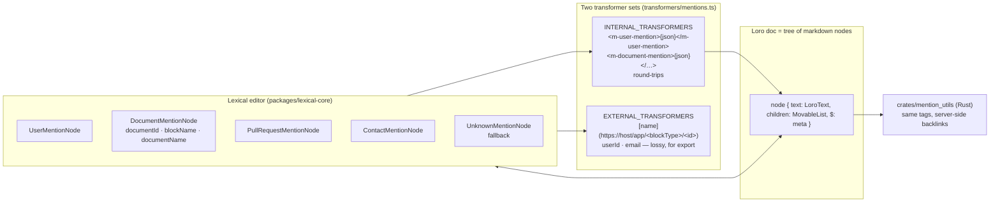
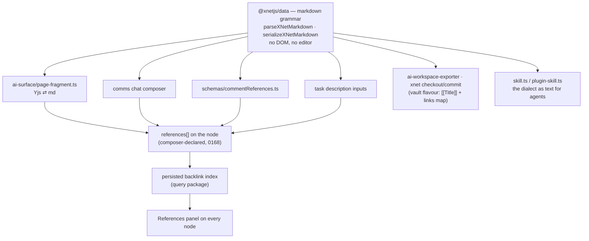
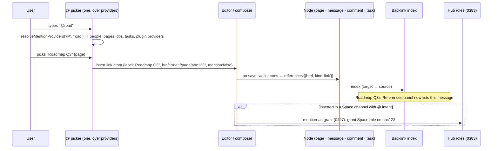
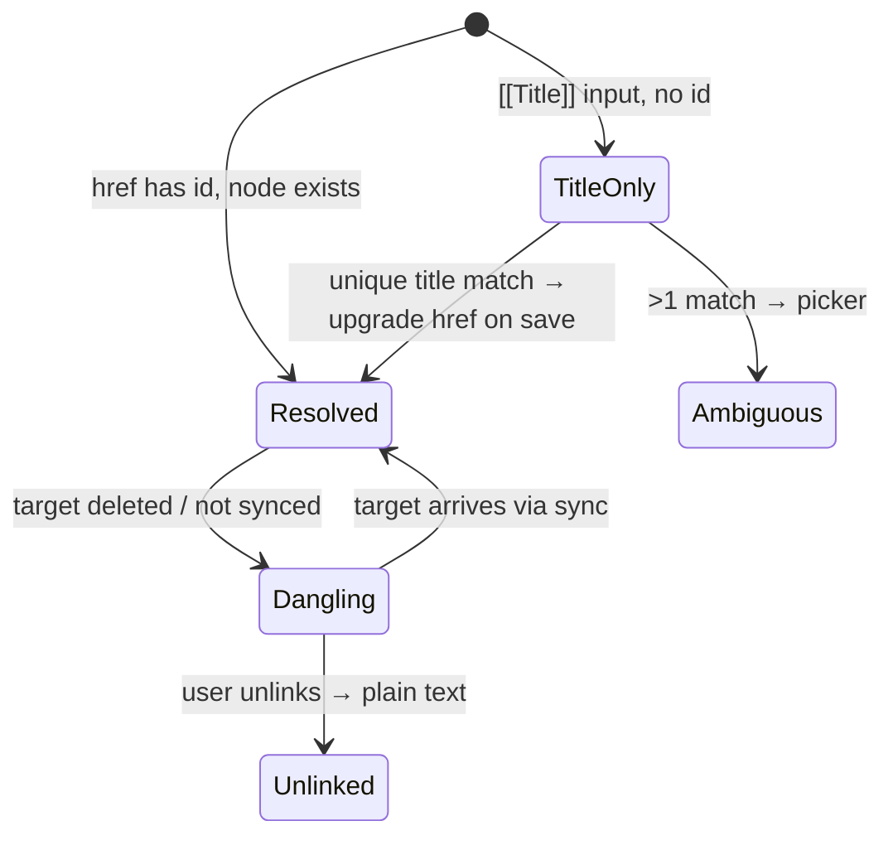

# One markdown dialect — id-bearing mentions and deep links for every node

> [!TIP]
> **TL;DR** — Macro round-trips @mentions because its Loro document _is_ a
> tree of markdown nodes and every mention serialises to an **id-carrying
> tag** (`<m-document-mention>{json}</m-document-mention>`), with a second,
> deliberately lossy "external" export (`[name](https://macro.com/app/md/id)`).
> xNet's markdown projection today is lossy in exactly the wrong places:
> `@label` drops the DID, `[[Title]]` drops the node id (write-back sets
> `href: ''`), page embeds and database references collapse to titles — and
> the vault, `xnet checkout`, and every `xnet_*_page_markdown` tool ride that
> same projection. Recommend <mark>one id-bearing dialect</mark>: plain
> CommonMark links with `xnet://<type>/<id>` URIs
> (`[@Alice](xnet://person/did:key:z6Mk…)`, `[Roadmap](xnet://page/abc)`,
> `[[Title]]` accepted on input only), fenced `xnet-*` directives for embeds,
> implemented **once** as a grammar module in `@xnetjs/data` and used by the
> page projection, comments, chat, task descriptions and the vault. Then
> generalise "mention" to any node: one `@` picker over
> `MentionProviderContribution`s, a composer-declared `references` property
> so a persisted backlink index covers every surface (Macro's References
> panel), hover previews via 0295, and an `xnet://node/<id>` router fallback.
> Yes, documents and messages can be perfectly represented in markdown;
> databases and canvases stay records with their own files, as Macro's CRM
> and tasks do.

## Problem Statement

Three questions, in the order asked:

1. **How does Macro support arbitrary @mentions and deep links in any
   markdown document?** Answered from their code below: a mention is an
   inline node whose markdown form carries the target's id and cached
   display data, parsed by one transformer set on the client and a matching
   Rust crate on the server; deep links are `https://<host>/app/<blockType>/<id>`.
2. **Can xNet standardise on markdown so all documents are perfectly
   represented by their export?** Today, no — the projection loses identity.
   With an id-bearing dialect and one shared grammar, yes for everything that
   is prose (pages, comments, messages, task descriptions). Not for tables
   and canvases, which are not prose and already have their own portable
   forms.
3. **Can we support intelligent deep linking and mentioning of people, docs,
   databases, tasks — any node?** The pieces exist (four `@` pickers, a
   `[[` picker, a plugin `MentionProviderContribution` point, an
   `xnet://<type>/<id>` router in `PageView`, an on-demand wikilink backlink
   index) but they are per-surface, person-or-page only, and unpersisted.

## Executive Summary

| Concern                     | Macro                                                                                                     | xNet today                                                                                                       | xNet proposed                                                                                     |
| --------------------------- | --------------------------------------------------------------------------------------------------------- | ---------------------------------------------------------------------------------------------------------------- | ------------------------------------------------------------------------------------------------- |
| Document storage            | Loro tree of markdown nodes (`packages/lexical-core/markdown-loro-schema.ts`); text is markdown            | Yjs `content-v4` XmlFragment (BlockNote ProseMirror schema); markdown is a projection                            | Unchanged                                                                                         |
| Mention in markdown         | `<m-user-mention>{"userId","email","displayName"}</m-user-mention>` (internal); `userId` or email (external) | `@label` — **DID lost**                                                                                          | `[@Alice](xnet://person/did:key:…)`                                                              |
| Doc/entity link in markdown | `<m-document-mention>{"documentId","blockName","documentName",…}</m-document-mention>`; external `[name](https://macro.com/app/<blockType>/<id>)` | `[[Title]]` — **id lost**; write-back `href: ''`                                                                 | `[Title](xnet://page/<id>)`; `[[Title]]` accepted on input, resolved by title, upgraded on save |
| Embeds                      | `<m-document-card>{json}</m-document-card>`                                                               | pageEmbed → `[[title]]`; databaseEmbed → title/url; `xnet-*` fenced directives **declared but never emitted**     | ` ```xnet-database {json}``` ` etc., emitted and parsed                                          |
| Unknown / broken mention    | `UnknownMentionNode` fallback ("Unknown Item")                                                            | Silent text                                                                                                      | `[label](xnet://node/<id>)` + dangling-link state in the chip                                     |
| Parser locations            | One TS transformer set + `crates/mention_utils` (kept in sync by a code comment)                           | `page-fragment.ts`, `commentReferences.ts`, chat composer, task inputs — four vocabularies                        | One grammar module, four callers                                                                  |
| Backlinks                   | References panel on every block, from every surface, server-computed                                      | `BacklinksPanel` — pages→pages via wikilinks, computed on demand by scanning fragments                            | Composer-declared `references` on any node → persisted index → panel on every node                |
| Deep link                   | `https://<host>/app/<blockType>/<id>`                                                                     | `xnet://<type>/<id>` in-app; Electron protocol only handles `connect`/`share`                                    | `xnet://<type>/<id>` + `xnet://node/<id>` fallback + `#block=<id>`; Electron protocol routes them |

> [!IMPORTANT]
> The single decision here is the **shape of the mention in markdown**. Every
> other item — pickers, backlinks, previews, deep links — is a consumer of
> that shape. Choose plain CommonMark links with `xnet://` URIs: they render
> as links in every markdown tool on earth, carry identity, stay readable, and
> need no custom parser to survive a round trip through an agent that only
> knows standard markdown.

---

## Current State In The Repository

### The projection is lossy where identity lives

`packages/plugins/src/ai-surface/page-fragment.ts` walks the Yjs fragment
directly (no editor, no DOM — a good design) and renders inline atoms:

```ts
// page-fragment.ts — atomToMarkdown
case 'mention': case 'personMention': case 'taskMention':
  return `@${attrString(attrs, 'label', 'id')}`          // DID dropped
case 'wikilink':
  return `[[${attrString(attrs, 'title', 'href')}]]`     // href/node id dropped
case 'smartReference': case 'databaseReference':
  return attrString(attrs, 'title', 'url', 'databaseId') // id dropped
// blockContentToMarkdown
case 'pageEmbed':
  return `[[${attrString(attrs, 'title', 'nodeId')}]]`   // becomes a wikilink
```

and on the way back (`inlineNodesForText`) only `[[…]]` is recognised, and
it is created with `href: ''`. `@Alice` becomes plain text. So an agent that
does `xnet_read_page_markdown` → edits a paragraph → `xnet_apply_page_markdown`
**destroys every mention on the page** and turns every id-linked wikilink into
a title-resolved one.

Everything downstream shares this projection:

| Consumer                                                                                             | Path                                                          |
| ---------------------------------------------------------------------------------------------------- | ------------------------------------------------------------- |
| `xnet_read_page_markdown` / `xnet_plan_page_patch` / `xnet_apply_page_markdown`                      | `packages/plugins/src/ai-surface/service.ts:800`, `renderPageMarkdown` at `:2272` |
| Vault export/import (`ai-workspace-exporter.ts`, `xnet checkout` / `xnet commit`, 0161/0393)         | `planChangedFile` calls `xnet_plan_page_patch` at `:767`      |
| MCP resources `xnet://page/<id>.md`                                                                  | `service.ts:803`                                              |
| The `writing-xnet-plugins` / `XNET_AGENT_SKILL_MD` skill text that describes the dialect to agents   | `packages/plugins/src/ai-surface/skill.ts`, `plugin-skill.ts` |

### The dialect spec and the serialiser have drifted

`packages/plugins/src/ai-surface/page-markdown.ts` declares
`XNET_MARKDOWN_DIRECTIVE_SPECS` — `xnet-database`, `xnet-page`, `xnet-embed`
(block), `xnet-ref`, `xnet-db-ref` (inline), `wikilink` — and names their
`editorExtension` as `DatabaseEmbedExtension`, `SmartReferenceExtension`,
`Wikilink` … the **TipTap** names from before the BlockNote migration (0312).
`page-fragment.ts` never emits any of them. `validateXNetPageMarkdown` will
happily validate a directive the serialiser cannot produce and the parser
cannot consume.

### Four mention vocabularies

- **Page editor** — `packages/editor/src/blocknote/specs/mention.tsx`
  (`MentionInlineSpec`, props `id,label,subtitle,color`, click →
  `host.onNavigate('xnet://person/<id>')`) and `specs/wikilink.tsx`
  (`WikilinkInlineSpec`, `href` = page id or `xnet://<type>/<id>`, `title`).
  Mentions are **people only**; wikilinks are pages/databases by title.
- **Chat composer** — `apps/web/src/comms/mention-composer.ts`, people only.
- **Comments** — `packages/data/src/schema/schemas/commentReferences.ts`
  regex-extracts `@mentions`, `#comment` refs and `[[node]]` links from a
  plain string.
- **Task inputs** — `MentionTextInput` + `filterTaskPeople`, people only.

The plugin contribution point that would unify them already exists and is
generic over node type: `packages/plugins/src/mention-providers.ts`
(`MentionProviderContribution { trigger, getSuggestions }`,
`resolveMentionProviders` with per-provider timeout, 0194 Phase 4) — but the
BlockNote editor's `@` picker does not consult it.

### Deep links and backlinks

- `xnet://<type>/<id>` is the in-app convention:
  `apps/web/src/components/PageView.tsx:535` `handleNavigate` matches
  `/^xnet:\/\/([a-z]+)\/(.+)$/` and calls `navigateToNode(navigate, type, id)`;
  `DatabaseEmbed.tsx` emits `xnet://database/<id>`; the AI exporter emits
  `xnet://page/<id>.md`, `xnet://database/<id>/schema`. The Electron protocol
  handler (`apps/electron/src/main/deep-link.ts`) parses only
  `xnet://connect` and `xnet://share` — an `xnet://page/<id>` link from
  outside the app goes nowhere.
- Backlinks: `apps/web/src/components/BacklinksPanel.tsx` →
  `usePageSearchSurface().getBacklinks` → `packages/query/src/search/document.ts`
  scans page fragments for `wikilink` atoms; when `href` is empty it
  **guesses** `generatePageId(title)` = `default/<slug>`. Pages only, from
  pages only, rebuilt on demand.
- The composer-declares-mentions rule (0168) is right and already applied
  for people in chat: "hosts walk the document for `mention` inline content
  and write the structured `mentions` property; body text is never parsed
  for `@`". It has not been generalised to other node types or surfaces.

### Prior explorations that touch this

[0170](./0170_[x]_UNIVERSAL_TYPEAHEAD_AUTOCOMPLETE.md) (one typeahead),
[0171](./0171_[x]_AUTOMATIC_LINK_ENRICHMENT.md) (link enrichment),
[0172](./0172_[_]_KEYBOARD_NAVIGABLE_AUTOCOMPLETE_AND_MENTION_LINKING.md)
(`[_]` — mention linking lifecycle), [0161](./0161_[x]_TOKEN_EFFICIENT_AGENT_INTERFACES.md)
and [0393](./0393_[_]_XNET_FROM_INSIDE_THE_CODING_AGENT.md) (vault projection
with "wikilinks + `xnet` frontmatter identity"), [0295](./0295_[x]_URL_UPRES_RICH_LINK_PREVIEWS_IN_CHAT_AND_COMMENTS.md)
(rich link previews), [0346](./0346_[x]_COMPOSABLE_UI_FRAMES_AND_THE_UNIVERSAL_PAGE_SUBSTRATE.md)
(drop-to-relate reference chip, entangle bus), [0380](./0380_[_]_NODES_AND_RECORDS_PROJECTION_INCARNATION_AND_SCOPING_A_NODE_TO_A_LEXICON.md)
(the lesson that a lens which cannot round-trip is a trap),
[0397](./0397_[_]_AGENT_NATIVE_FRAMEWORK_LESSONS.md) (one definition, many
callers), [0446](./0446_[_]_XNET_VS_MACRO_COMPUTABLE_COMPANY_VERSUS_OWNED_SUBSTRATE.md)
/ [0447](./0447_[_]_LEARNING_FROM_MACRO_WIRE_THE_LOOP_BEFORE_WIDENING_THE_SUITE.md)
(mention-as-grant, one inbox).

## External Research

### How Macro does it (from `macro-inc/macro` @ `4067868`)



<details>
<summary>Detailed walkthrough</summary>

- **Storage.** `packages/lexical-core/markdown-loro-schema.ts` defines a
  recursive `LoroMap { $, text: LoroText, ids, children: LoroMovableList }`.
  A document is a tree of markdown blocks whose `text` is markdown source;
  Lexical is the editor over it. Their `mentions.test.ts`,
  `xml-serialize.test.ts` and `internal-transformer-fallbacks.test.ts` test
  the round trip.
- **Internal form.** `I_USER_MENTION`, `I_DOCUMENT_MENTION`, `I_PR_MENTION`,
  `I_CONTACT_MENTION`, `I_GROUP_MENTION`, `I_DATE_MENTION`, `I_TAG`,
  `I_THEME_MENTION`, `I_DOCUMENT_CARD` are `TextMatchTransformer`s over
  `<m-…>(.*?)</m-…>` whose payload is JSON carrying the id plus cached
  display data (`displayName`, `documentName`, `blockName` = entity type,
  `blockParams`, `collapsed`). Missing required fields → `UnknownMentionNode`
  ("Unknown User", "Unknown Item"), never silent text.
- **External form.** `E_DOCUMENT_MENTION` exports
  `` `[${documentName}](https://${hostname}/app/${blockType}/${documentId})` ``;
  `E_USER_MENTION` exports the bare `userId`; `E_CONTACT_MENTION` the
  email/domain. `replace` returns `false` — external is one-way, for
  copy/export.
- **Server parity.** The file's header: "If you are changing this file, you
  may need to update `crates/mention_utils` as well." The Rust side parses
  the same tags to build the References panel and to auto-share into
  channels (docs: `concepts/mentions.mdx`).
- **Deep link.** `https://<host>/app/<blockType>/<id>`; `blockType` is one
  of `md email channel chat automation project contact company call canvas
  code image video pdf unknown` (`concepts/blocks.mdx`). Hover previews for
  most types; embeds are read-only cards; mentions in channels grant
  access, mentions in docs do not.

</details>

### The wider field

- **Obsidian** resolves `[[Title]]` by filename and `^block-id` by an
  in-file suffix; portable across editors, fragile across renames
  ([comparison](https://itsfoss.com/comparison/obsidian-vs-logseq/)).
- **Logseq** uses `((uuid))` block references — stable, but the files stop
  being ordinary markdown; a third-party Obsidian plugin exists purely to
  bridge the two syntaxes ([block-reference-enhancer](https://github.com/msjsc001/obsidian-block-reference-enhancer)).
- **Notion** exports `Title <hex id>.md` and rewrites internal links to those
  file names — identity survives export by living in the filename.
- **AT Protocol** rich text is plain text plus byte-range **facets** that
  point at DIDs and URIs — the same "id beside the label" idea, out of band;
  xNet already emits facets for Bluesky (0432).
- **CommonMark** already gives a portable id-beside-label form:
  `[label](scheme://id)`. Every renderer shows the label; every parser keeps
  the URI. It needs no plugin to survive a hop through a generic agent.

## Key Findings

1. **Macro's round trip works because the id is in the text.** Not because
   of Loro, not because of Lexical — because the serialised form carries
   `documentId`. xNet's does not, and the "commit ≠ revision" lesson (0364)
   applies: a projection that cannot round-trip is a read-only view
   pretending to be an edit surface.
2. **xNet already chose the URI.** `xnet://<type>/<id>` is emitted by the
   editor, `DatabaseEmbed`, the exporter and routed by `PageView`. Putting
   that URI inside a standard link is the smallest possible change with the
   largest reach.
3. **Plain links beat custom tags for xNet's situation.** Macro's
   `<m-…>{json}</m-…>` is fine when one company owns both parsers. xNet's
   markdown is read by Claude Code, Codex, Obsidian (the vault), GitHub, and
   any plugin. `[@Alice](xnet://person/did:key:…)` renders and survives
   everywhere; `<m-user-mention>{"userId":…}</m-user-mention>` renders as
   raw JSON in half of them.
4. **Cached display data belongs in the label, not a payload.** Macro caches
   `displayName`/`documentName` in the JSON so a mention renders before the
   target loads. The link label does the same job (`[Roadmap Q3](xnet://page/…)`),
   and a title change is a re-render, not a stale cache.
5. **The dialect must be defined once.** Four surfaces parse mentions four
   ways today. 0397's lesson ("one verb definition, seven callers") is the
   same lesson for grammar: one `parseXNetMarkdown` / `serializeXNetMarkdown`
   in `@xnetjs/data`, no DOM, no editor, used by page-fragment, comments,
   chat, tasks, vault, and the skill text.
6. **Any-node mentions need three things, and two exist.** A picker that
   fans out to providers (`resolveMentionProviders` — exists, unwired), a
   URI per node type (exists), and a composer-declared `references`
   property so backlinks are persisted rather than rescanned (exists for
   people in chat, not generalised).
7. **"Perfect markdown" is true for prose, false for tables, and that is
   fine.** Macro's CRM records and tasks are not markdown either; their docs
   are. xNet's databases already export as `.rows.jsonl` and canvases as
   `.canvas` (0393); pages, comments, messages and task descriptions can be
   perfect markdown. Frontmatter carries identity and a `dialect` version.

## Options And Tradeoffs

| Option                                                    | Form                                                                                     | Renders in generic md | Survives generic-agent round trip | Human-readable | Verdict         |
| --------------------------------------------------------- | ---------------------------------------------------------------------------------------- | --------------------- | --------------------------------- | -------------- | --------------- |
| **A. Macro-style HTML tag + JSON**                        | `<x-mention type="person" id="did:key:…">Alice</x-mention>`                             | Label only if HTML allowed; JSON leaks otherwise | Yes if untouched; agents rewrite tags | Poor           | 🛑 Rejected     |
| **B. CommonMark link + `xnet://` URI**                    | `[@Alice](xnet://person/did:key:…)`, `[Roadmap](xnet://page/abc)`                       | ✅ as a link          | ✅ (agents preserve links)        | ✅             | ✅ Recommended  |
| **C. remark-directive**                                   | `:mention[Alice]{type=person id=did:key:…}`                                              | ❌ raw text           | Fragile                           | OK             | 🛑 Rejected     |
| **D. Obsidian wikilink + id sidecar**                     | `[[Roadmap]]` + frontmatter `links: {Roadmap: xnet://page/abc}`                          | ✅                    | Sidecar drifts                    | ✅             | 🟡 Vault flavour only |
| **E. Keep lossy, trust frontmatter + title resolution**   | status quo                                                                               | ✅                    | ❌ (today's bug)                  | ✅             | 🛑 Rejected     |

> [!NOTE]
> Option D survives as a **render flavour** of B for the Obsidian vault
> (0393): the canonical dialect is B; the vault writer may emit `[[Title]]`
> for page links _and_ a `links:` map in frontmatter so Obsidian graph view
> works, and the vault reader upgrades `[[Title]]` back to `xnet://page/<id>`
> using the map, then title. That keeps one grammar and two renderers, which
> is exactly Macro's internal/external split with the roles inverted:
> xNet's canonical form is the portable one.

### The dialect, concretely

```text
Mentions (inline)      [@Alice](xnet://person/did:key:z6Mk…)          person, DID
                       [@#general](xnet://channel/default/general)    any node — the @ in the label marks "notify/grant" intent
Links (inline)         [Roadmap Q3](xnet://page/abc123)               page
                       [Deals](xnet://database/def456)                database
                       [Acme row](xnet://row/def456/r789)             database row
                       [Fix login](xnet://task/t42)                   task
                       [Sprint board](xnet://canvas/c9)               canvas
                       [anything](xnet://node/<id>)                   fallback — router resolves type from the store
Block anchor           [see §2](xnet://page/abc123#block=blk_7f)      BlockNote block id, already unique
Wikilink (input only)  [[Roadmap Q3]]  [[Roadmap Q3|alias]]           accepted; resolved by title; upgraded to a link on save
Hashtag                #topic                                         unchanged
Embeds (block)         ```xnet-page {"id":"abc123","preview":"summary"}```
                       ```xnet-database {"id":"def456","view":"v1"}```
                       ```xnet-embed {"url":"https://…","provider":"youtube"}```
Frontmatter            xnet: { id, schemaId, revision, exportedAt, dialect: 2 }
```

Rules: labels are cached display text and never authoritative; a link whose
target is missing renders as a dangling chip, not text; `@` in a label is
what makes a link a _mention_ (notify + grant intent, 0168/0447) versus a
_reference_ (backlink only).

### Architecture: one grammar, many callers



### Compose → reference → backlink → grant



### Link resolution states



## Recommendation

1. **Ship the grammar module** in `@xnetjs/data` (`markdown/` sub-entry:
   `parseXNetMarkdown`, `serializeXNetMarkdown`, `XNET_MARKDOWN_DIALECT = 2`,
   the URI helpers `parseXnetUri` / `formatXnetUri` for
   `person|page|database|row|task|channel|message|canvas|plugin|file|node`).
   Property test: fragment → md → fragment → md is a fixed point for every
   inline and block spec in `createXNetSchema()`.
2. **Rewrite `page-fragment.ts` on it.** Mention → `[@label](xnet://person/id)`,
   wikilink → `[title](xnet://page/id)` (or `[[title]]` only when `href` is
   empty), `pageEmbed`/`databaseEmbed`/`embed`/`richLink` → fenced `xnet-*`
   directives, `smartReference`/`databaseReference` → links. On the write
   path, parse links with `xnet://` hrefs back into the right atoms; `@` in
   the label selects `mention`; `[[…]]` still accepted. Fix
   `page-markdown.ts` specs to name BlockNote specs and derive the spec list
   from the grammar so they cannot drift again.
3. **Bump the projection dialect** — frontmatter `dialect: 2`; the AI
   surface accepts 1 (lossy) on input for one release and always emits 2.
   Update the skill text and `writing-xnet-plugins` so agents see the real
   forms.
4. **One `@` picker over providers.** Wire BlockNote's `@` and `[[`
   suggestion menus to `resolveMentionProviders`, with built-in providers
   for people (existing four stacks' data), pages, databases, rows, tasks,
   channels, canvases, and the plugin-contributed ones. Then point the chat
   composer, comments and task inputs at the same providers (0172's
   unfinished half; retire the four stacks over time).
5. **Persist references.** Generalise 0168: every composer writes
   `references: [{href, kind:'mention'|'link', label}]` on the node it
   saves; a small index in `packages/query` (target → sources) replaces the
   on-demand fragment scan; `BacklinksPanel` becomes a References panel
   mounted for pages, databases, tasks, people and channels.
6. **Deep links.** Add `xnet://node/<id>` to `navigateToNode` (resolve
   `schemaId` from the store → `TabNodeType`); support `#block=<id>` scroll;
   teach `apps/electron/src/main/deep-link.ts` to route `xnet://<type>/<id>`
   from outside the app through the same validation posture it applies to
   `connect` (open-redirect caution stays); web gets `/n/<id>` as the http
   twin so links pasted into Slack resolve.
7. **Hover previews** — reuse the 0295 upres card for `xnet://` targets in
   editor, chat and comments; Macro's "most blocks have hover previews" is
   the cheap half of "intelligent."
8. **Vault flavour** — the exporter emits `[[Title]]` for page links plus a
   frontmatter `links:` map so Obsidian's graph works; the importer upgrades
   through the map, then title, then leaves a `[[Title]]` for the picker.

> [!WARNING]
> Do **not** parse body text for `@` on read (Macro doesn't either — its
> tags are explicit). Two things go wrong otherwise: prompt-injection
> amplification (0408's lesson — screen text is not intent) and false grants
> (0447's mention-as-grant must fire only on composer-declared mentions).
> The `@` in a link label is a serialisation of a declared mention, not a
> trigger.

## Example Code

Grammar surface (shape only):

```ts
// packages/data/src/markdown/index.ts
export type XnetUri =
  | { kind: 'person'; did: string }
  | { kind: 'page' | 'database' | 'task' | 'channel' | 'canvas' | 'plugin' | 'file' | 'node'; id: string; block?: string }
  | { kind: 'row'; databaseId: string; rowId: string }
  | { kind: 'message'; channelId: string; messageId: string }

export function parseXnetUri(href: string): XnetUri | null
export function formatXnetUri(uri: XnetUri): string   // `xnet://page/abc123#block=blk_7f`

export type XnetInline =
  | { type: 'text'; text: string }
  | { type: 'link'; label: string; uri: XnetUri; mention: boolean }   // mention ⇔ label starts with '@'
  | { type: 'wikilink'; title: string; alias?: string }               // input-only, unresolved
  | { type: 'hashtag'; name: string }
  | { type: 'externalLink'; label: string; url: string }

export function parseXNetMarkdown(md: string): { frontmatter: XNetPageMarkdownFrontmatter | null; blocks: XnetBlock[] }
export function serializeXNetMarkdown(doc: { frontmatter?: …; blocks: XnetBlock[] }, flavour: 'canonical' | 'vault'): string
```

What the projection of a paragraph looks like, before and after:

```markdown
<!-- today (dialect 1) — identity lost -->
Ping @Alice about [[Roadmap Q3]] and the Deals table.

<!-- proposed (dialect 2) -->
Ping [@Alice](xnet://person/did:key:z6MkhaXgBZDvotDkL5257faiztiGiC2QtKLGpbnnEGta2doK) about [Roadmap Q3](xnet://page/abc123) and the [Deals](xnet://database/def456) table.
```

Composer-declared references (generalising the chat `mentions` property):

```ts
// on save, every composer:
node.properties.references = collectReferences(blocks) // [{ href:'xnet://person/did:…', kind:'mention', label:'Alice' }, { href:'xnet://page/abc123', kind:'link', label:'Roadmap Q3' }]
```

## Risks And Open Questions

- **Label drift.** A cached label (`[Roadmap Q3](…)`) goes stale when the
  page is renamed. Render from the live node when present; keep the label
  as fallback text only. Same as Macro's `documentName`.
- **DIDs are long.** `xnet://person/did:key:z6Mk…` is 60+ characters in the
  markdown. Acceptable — it is behind a label — but the vault flavour may
  prefer `xnet://person/@handle` when a handle exists (0172), resolved
  through the profile index, with the DID as the canonical form.
- **Migration of existing pages.** No storage change; the projection just
  gets richer. Existing `[[Title]]` atoms with empty `href` stay title-resolved
  until someone saves the page; a one-off `xnet doctor --upgrade-links` can
  resolve unique titles in bulk.
- **Two flavours is a maintenance tax.** Keep it to two (canonical, vault),
  generated from one AST, with a golden-file test per flavour. Macro pays
  the same tax (internal/external) plus a Rust twin; xNet should not add a
  third.
- **`xnet://node/<id>` needs the store to route.** A cold client that has
  not synced the target cannot resolve its type. Render dangling, resolve on
  arrival — the state diagram above. Do not guess.
- **Does `#block=` survive block splits/merges?** BlockNote block ids are
  stable across edits but a paragraph split creates a new id for the second
  half. Good enough; Obsidian's `^id` has the same property.
- **Open question:** should `references` be a property on the source node
  (simple, syncs with the node, composer-owned) or separate `Reference`
  nodes (queryable, but doubles writes)? Recommend property first — it is
  what chat already does — and index in `packages/query`.
- **Open question:** hub-side extraction for search/federation? Macro's
  `mention_utils` crate exists because their server owns the graph. xNet's
  hub is a relay; the composer's declared `references` travel in the signed
  change, so the hub can index without parsing. Keep it that way.

## Implementation Checklist

**Status:** ░░░░░░░░░░ 0/13 items

- [ ] `packages/data/src/markdown/`: `parseXnetUri` / `formatXnetUri` for all node kinds incl. `node` fallback, `row`, `message`, `#block=`
- [ ] `parseXNetMarkdown` / `serializeXNetMarkdown` (canonical + vault flavours), `XNET_MARKDOWN_DIALECT = 2`; sub-entry exported per `packages/AGENTS.md` (exports + tsup + barrel + `api:update`)
- [ ] Property test: fragment → md → fragment → md fixed point over every spec in `createXNetSchema()`; golden files per flavour
- [ ] Rewrite `page-fragment.ts` atoms/blocks on the grammar; `@`-label → `mention`, `xnet://` links → `wikilink`/reference atoms, fenced `xnet-*` → embed blocks
- [ ] Rebuild `page-markdown.ts` `XNET_MARKDOWN_DIRECTIVE_SPECS` from the grammar (BlockNote spec names), so spec and serialiser cannot drift
- [ ] Frontmatter `dialect: 2`; accept 1 on input for one release; update `skill.ts`, `plugin-skill.ts`, `XNET_AGENT_SKILL_MD`, `writing-xnet-plugins`
- [ ] Wire BlockNote `@` and `[[` menus to `resolveMentionProviders`; built-in providers for people, pages, databases, rows, tasks, channels, canvases
- [ ] Point chat composer, comments (`commentReferences.ts`) and task inputs at the same providers + grammar; retire the four stacks
- [ ] Generalise composer-declared `references` (0168) to every surface and node kind; persisted index in `packages/query`; `BacklinksPanel` → References panel on page, database, task, person, channel
- [ ] `navigateToNode`: `xnet://node/<id>` via store `schemaId`; `#block=` scroll; web `/n/<id>` twin
- [ ] `apps/electron/src/main/deep-link.ts`: route `xnet://<type>/<id>` from outside with the same validation posture as `connect`
- [ ] Hover previews for `xnet://` targets via the 0295 upres card in editor, chat, comments
- [ ] Vault flavour in `ai-workspace-exporter.ts` / `xnet checkout`: `[[Title]]` + frontmatter `links:` map; importer upgrades map → title → picker

## Validation Checklist

- [ ] An agent round trip (`xnet_read_page_markdown` → edit one paragraph → `xnet_apply_page_markdown`) on a page with a person mention, an id-linked wikilink, a page embed and a database embed leaves all four intact (ids equal before/after)
- [ ] `xnet checkout` → edit in Obsidian (rename nothing) → `xnet commit` preserves every link id; Obsidian graph view shows the page links
- [ ] Typing `@` in the page editor, chat, a comment and a task offers people **and** pages/databases/tasks from one provider set; a plugin-contributed provider appears in all four
- [ ] Mentioning a task in a chat message makes the message appear in the task's References panel without any rescan; deleting the message removes it
- [ ] `xnet://page/<id>#block=<blockId>` opened from outside the app (Electron) lands on the block; `xnet://node/<id>` resolves a task, a database and a person
- [ ] A link to a not-yet-synced node renders as a dangling chip and resolves when the node arrives (no `default/<slug>` guessing)
- [ ] `check:api-report` (after `pnpm build`), typecheck, lint, tests, `check:exploration-links` green

## References

- Macro `packages/lexical-core/transformers/mentions.ts`, `unknownFallback.ts`, `markdown-loro-schema.ts`, `nodes/*MentionNode.ts` — https://github.com/macro-inc/macro/tree/main/packages/lexical-core
- Macro docs — mentions https://docs.macro.com/concepts/mentions ; blocks https://docs.macro.com/concepts/blocks
- xNet projection — [`packages/plugins/src/ai-surface/page-fragment.ts`](../../packages/plugins/src/ai-surface/page-fragment.ts), [`page-markdown.ts`](../../packages/plugins/src/ai-surface/page-markdown.ts), [`service.ts`](../../packages/plugins/src/ai-surface/service.ts)
- xNet editor specs — [`packages/editor/src/blocknote/specs/mention.tsx`](../../packages/editor/src/blocknote/specs/mention.tsx), [`wikilink.tsx`](../../packages/editor/src/blocknote/specs/wikilink.tsx), [`schema.ts`](../../packages/editor/src/blocknote/schema.ts)
- xNet providers/routing/backlinks — [`packages/plugins/src/mention-providers.ts`](../../packages/plugins/src/mention-providers.ts), [`apps/web/src/components/PageView.tsx`](../../apps/web/src/components/PageView.tsx), [`BacklinksPanel.tsx`](../../apps/web/src/components/BacklinksPanel.tsx), [`packages/query/src/search/document.ts`](../../packages/query/src/search/document.ts), [`packages/data/src/schema/schemas/commentReferences.ts`](../../packages/data/src/schema/schemas/commentReferences.ts), [`apps/electron/src/main/deep-link.ts`](../../apps/electron/src/main/deep-link.ts)
- Obsidian vs Logseq block references — https://itsfoss.com/comparison/obsidian-vs-logseq/ ; https://github.com/msjsc001/obsidian-block-reference-enhancer
- Related explorations: 0168, [0170](./0170_[x]_UNIVERSAL_TYPEAHEAD_AUTOCOMPLETE.md), [0171](./0171_[x]_AUTOMATIC_LINK_ENRICHMENT.md), [0172](./0172_[_]_KEYBOARD_NAVIGABLE_AUTOCOMPLETE_AND_MENTION_LINKING.md), [0161](./0161_[x]_TOKEN_EFFICIENT_AGENT_INTERFACES.md), [0295](./0295_[x]_URL_UPRES_RICH_LINK_PREVIEWS_IN_CHAT_AND_COMMENTS.md), [0312](./0312_[x]_TIPTAP_TO_BLOCKNOTE_EDITOR_MIGRATION.md), [0346](./0346_[x]_COMPOSABLE_UI_FRAMES_AND_THE_UNIVERSAL_PAGE_SUBSTRATE.md), [0364](./0364_[_]_BLOG_POST_REVISION_TRANSPARENCY.md), [0380](./0380_[_]_NODES_AND_RECORDS_PROJECTION_INCARNATION_AND_SCOPING_A_NODE_TO_A_LEXICON.md), [0393](./0393_[_]_XNET_FROM_INSIDE_THE_CODING_AGENT.md), [0397](./0397_[_]_AGENT_NATIVE_FRAMEWORK_LESSONS.md), [0408](./0408_[_]_TALKING_TO_XNET_VOICE_AS_AN_AGENT_INGRESS.md), [0446](./0446_[_]_XNET_VS_MACRO_COMPUTABLE_COMPANY_VERSUS_OWNED_SUBSTRATE.md), [0447](./0447_[_]_LEARNING_FROM_MACRO_WIRE_THE_LOOP_BEFORE_WIDENING_THE_SUITE.md)
