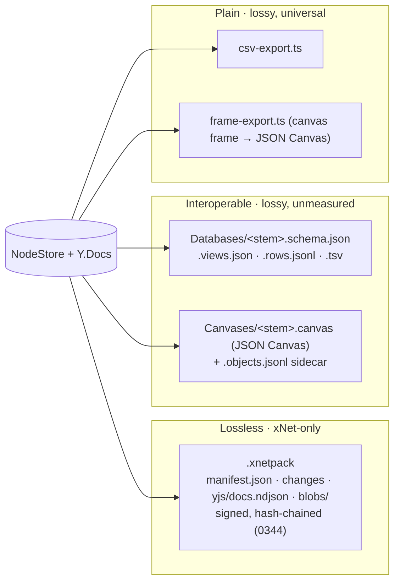
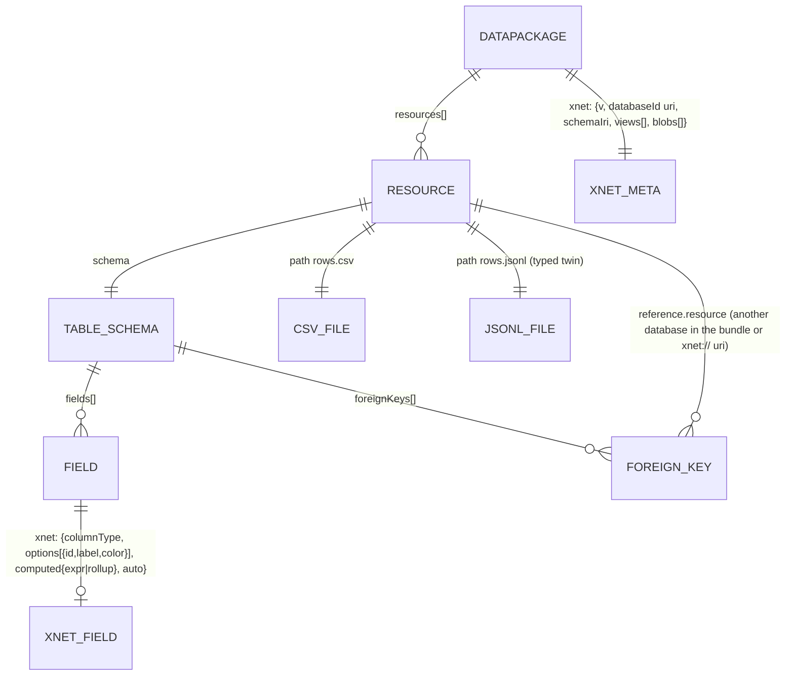
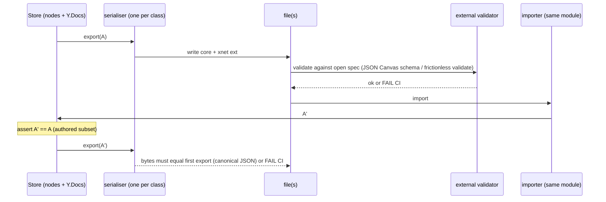

# Lossless, interoperable table and canvas exports — core plus extension

> [!TIP]
> **TL;DR** — "Lossless" and "interoperable" pull in opposite directions, and
> the only shape that gets both is the one xNet already half-uses for canvas:
> <mark>a file that is valid in a widely-read open format, plus a versioned
> `xnet` extension carrying exactly what that format cannot express</mark>,
> with a property test that xNet → file → xNet is a fixed point. Define
> lossless as _authored state and identity_ (every cell, column, view, object,
> edge, stroke; every id as an `xnet://` URI per 0448) — computed values are
> reproduced from their formulas, history and signatures stay in `.xnetpack`
> (0344), which is already the lossless-but-xNet-only tier. Then: **canvas** —
> make `packages/canvas/src/interop/json-canvas.ts` the _only_ JSON Canvas
> serialiser (the vault exporter currently bypasses it with an ad-hoc mapper
> that dumps raw objects), widen its extension to strokes, z-order, `task`/`widget`
> kinds and `xnet://` file targets, and add SVG/PNG as the plain tier.
> **Tables** — replace `.schema.json` + `.rows.jsonl` with a
> [Frictionless Data Package](https://datapackage.org) (`datapackage.json`
> Table Schema with typed fields, `primaryKey`, `foreignKeys` for relations,
> `xnet:` per-field extension for select options, formulas, rollups) over
> `rows.csv` **and** `rows.jsonl`, blobs by content hash, rich-text cells in
> the 0448 dialect; SQLite as a second interoperable-lossless target later;
> Obsidian Bases as a vault flavour. One serialiser per data class, one
> extension namespace, one round-trip gate in CI.

## Problem Statement

[0448](./0448_[_]_ONE_MARKDOWN_DIALECT_ID_BEARING_MENTIONS_AND_DEEP_LINKS_FOR_EVERY_NODE.md)
answered "can documents be perfectly represented in markdown" with yes, and
drew the line at tables and canvases: "records with their own files." This
exploration is about those files. A user, an agent, or a Delete-Day flow
(Charter §2, exploration 0234) exports a database or a canvas and should get
something that (a) reopens in xNet with nothing lost, and (b) opens in
Obsidian, a spreadsheet, a data tool, tldraw, or a Python script and means
something. Today xNet has two tiers that each do one of those and neither
does both:

- `.xnetpack` ([0344](./0344_[x]_FIRST_CLASS_DATA_EXPORT_IMPORT_AND_PORTABLE_BUNDLES.md)):
  signed change log + Yjs states + blobs. Lossless including history. Opens
  nowhere but xNet.
- Vault projections (0161/0393, `packages/plugins/src/services/ai-workspace-exporter.ts`):
  `Databases/<stem>.schema.json` + `.views.json` + `.rows.jsonl` (+ read-only
  `.tsv` sidecar), `Canvases/<stem>.canvas` (JSON Canvas) + `.objects.jsonl`.
  Interoperable-ish. Lossy in ways nobody has measured, because there is no
  round-trip test.

## Executive Summary

| Question                                     | Answer                                                                                                                                                              |
| -------------------------------------------- | ------------------------------------------------------------------------------------------------------------------------------------------------------------------- |
| What does "lossless" mean here?              | Authored state + identity round-trips to equality. Computed values (formula, rollup, created/updated) are regenerated. History/signatures are `.xnetpack`'s job.       |
| What does "interoperable" mean here?         | A file that a tool which has never heard of xNet opens and reads correctly, ignoring the `xnet` extension.                                                            |
| How can one file be both?                    | Core + extension: authoritative data in the open format's own fields; the `xnet` namespace carries only what the format cannot express, versioned, never a raw dump. |
| Canvas core format                           | JSON Canvas 1.0 (Obsidian's open spec, "add your own fields — other apps ignore unknown fields"). Already implemented in `packages/canvas/src/interop/json-canvas.ts`. |
| Table core format                            | Frictionless Data Package: `datapackage.json` (Table Schema) + CSV. Typed fields, `primaryKey`, `foreignKeys` (relations), `constraints.enum` (select). Plus JSONL. |
| Plain tier (lossy, universal)                | Canvas: SVG + PNG. Table: CSV alone. Both already partly exist (`csv-export.ts`, canvas frame export).                                                                |
| Where does the drift come from today?        | Two serialisers per class: `interop/json-canvas.ts` vs `ai-workspace-exporter.ts:toJsonCanvasNode`; `database/export/json-export.ts` vs the exporter's `.rows.jsonl`. |
| The gate                                     | A property test per class: export → import → export is byte-identical (canonical JSON), run in CI, plus schema validation of the core file against the external spec. |

> [!IMPORTANT]
> The pattern is the decision. Every specific format below is replaceable;
> what must not change is: **one serialiser per data class**, **core fields
> authoritative**, **extension versioned and minimal**, **fixed-point test in
> CI**. 0380 (a lens that cannot round-trip is a trap) and 0448 (spec and
> serialiser drifted apart) are the same lesson twice.

---

## Current State In The Repository

### The export ladder as it exists



### Tables

| Piece                                   | Where                                                                                                        | Status                                                                                       |
| --------------------------------------- | ------------------------------------------------------------------------------------------------------------ | -------------------------------------------------------------------------------------------- |
| Column model (24 types)                 | `packages/data/src/database/column-types.ts` — text, number, checkbox, date, dateRange, geo, select, multiSelect, person, url, email, phone, file, relation, tasks, rollup, formula, richText, created/By, updated/By | ✅                                                                                           |
| Storage                                 | Rows are nodes (0159); columns/views/meta in a Y.Doc (`database-doc.ts`); richText cells in Y.Doc (`rich-text-cell.ts`); formula/rollup computed at read (`formula-service.ts`, `rollup-engine.ts`, `computed-cache.ts`) | ✅                                                                                           |
| Schema IRI                              | `xnet://xnet.fyi/db/<id>@<version>` (`schema-utils.ts`, `schema-from-fields.ts`)                             | ✅                                                                                           |
| JSON / CSV export                       | `packages/data/src/database/export/{json,csv}-export.ts` — column names or ids, optional schema, ids optional | ✅ but its own shape                                                                          |
| CSV / JSON import                       | `packages/data/src/database/import/{csv,json}-parser.ts`                                                     | ✅                                                                                           |
| Vault projection                        | `ai-workspace-exporter.ts:exportDatabase` — `schema` + `views` MCP resources, rows from `xnet_database_query`, TSV sidecar ≥50 rows | 🚧 no relation/file/person typing contract; no round-trip test                             |
| Files in cells                          | Blob refs; ⚠️ >1 MB blobs silently unsynced ([0385](./0385_[x]_FILE_ATTACHMENTS_IN_DATABASE_CELLS.md))         | 🚧 export must be loud about missing blobs                                                   |
| "Your database, literally" (SQLite)     | Mentioned in 0344 as a fast path; not built                                                                  | ❌                                                                                           |

### Canvas

| Piece                                   | Where                                                                                                        | Status                                                                                       |
| --------------------------------------- | ------------------------------------------------------------------------------------------------------------ | -------------------------------------------------------------------------------------------- |
| Object kinds                            | `packages/canvas-core/src/types.ts` — page, database, external-reference, media, shape, note, task, group, widget | ✅                                                                                           |
| Freehand drawing                        | `packages/canvas/src/drawing/` — pressure, Catmull-Rom smoothing                                              | ✅ stored; ❌ not in any export                                                                |
| JSON Canvas interop                     | `packages/canvas/src/interop/json-canvas.ts` — typed `JsonCanvasXNetNodeMetadata { kind, sourceNodeId, sourceSchemaId, alias, locked, display, properties }`, edge `{ relationship, style }`; export sorts by zIndex; import warns on unknown types/duplicate ids/missing edge ends | ✅ the right pattern                                                                          |
| Vault projection                        | `ai-workspace-exporter.ts:exportCanvas` → `toJsonCanvasNode` (its own mapper: `xnet: object` raw dump; page/database/media → `file` **without a `file` path**) + `.objects.jsonl` | 🛑 bypasses the interop module; likely emits spec-invalid `file` nodes                       |
| Import                                  | `xnet_canvas_plan_json_canvas_import` → `jsonCanvasDocumentToCanvasOperations`; sidecar → `replaceObjectsSidecarProjection` | ✅ plan-only, audited                                                                        |
| Not covered by the extension            | strokes, z-order on import (`zIndex: 0` in `readPosition`), `task`/`widget` kinds (not in `CANVAS_SCENE_NODE_KINDS`), camera/viewport, group membership beyond geometry, port/anchor placement | ❌                                                                                           |
| Frame export                            | `packages/canvas/src/frames/frame-export.ts` uses the interop module                                          | ✅                                                                                           |

> [!WARNING]
> Two serialisers per data class already exist and disagree. The vault's
> `toJsonCanvasNode` will emit `{ type: 'file' }` for a page object with no
> `file` attribute — invalid JSON Canvas — while `interop/json-canvas.ts`
> would have produced a valid node with `xnet.sourceNodeId`. Nothing catches
> it because nothing round-trips.

## External Research

- **JSON Canvas 1.0** ([spec](https://jsoncanvas.org/spec/1.0/), Obsidian,
  2024): nodes `text | file | link | group`, edges with sides/ends/color/label,
  z-order by array position, `color` as preset `1–6` or hex. Extensibility is
  by design — unknown fields are ignored. Adopted by Obsidian, Kinopio,
  several MCP servers. Text nodes are markdown — which is where 0448's
  dialect goes.
- **Frictionless Data Package / Table Schema** ([datapackage.org](https://datapackage.org)):
  `datapackage.json` describing resources (CSV/JSON), each with a
  `schema.fields[]` (`string number integer boolean date datetime duration
  geopoint object array any`, `format`, `constraints.{required,unique,enum,pattern,min,max}`),
  `primaryKey`, `foreignKeys` (→ relations), `missingValues`. Custom
  properties are allowed and conventionally namespaced. Tooling in Python,
  R, JS; validators exist. This is the only open spec built precisely for
  "CSV plus types plus keys."
- **SQLite as an export format** — universally readable, typed, relations as
  FKs, views as SQL, richText as text; the Library of Congress lists it as a
  recommended preservation format. Not human-diffable; not for the vault,
  fine as a download.
- **Obsidian Bases** (2025–26): `.base` YAML files defining table/card/list/map
  views, filters, formulas and summaries over note frontmatter properties.
  A database whose rows are markdown files with frontmatter is directly a
  Base — a natural vault flavour for small tables and any table with
  richText rows.
- **Notion / Airtable CSV export**: relations become comma-joined titles,
  selects lose colours, files become URLs that expire, formulas become
  values. The canonical "interoperable but lossy" baseline to beat.
- **Anytype / AFFiNE**: protobuf/JSON snapshot exports — lossless for
  themselves, opaque to everyone else — the `.xnetpack` tier.
- **tldraw `.tldr` / Excalidraw JSON**: rich, app-specific; useful as
  optional import adapters, not as xNet's canonical format. JSON Canvas is
  the neutral ground both can be lowered to.

## Key Findings

1. **The pattern is already in the repo, once, for canvas.**
   `interop/json-canvas.ts` is core + typed extension + warnings on lossy
   import. It just is not the serialiser the vault uses.
2. **Tables have no core format at all.** `.schema.json` is xNet's own
   `StoredColumn[]`; `.rows.jsonl` is whatever `xnet_database_query`
   returns. Nothing external can type a `relation` or `select` from it.
   Table Schema gives every one of the 24 column types a home: most map to
   `type` + `format`; `select`/`multiSelect` → `constraints.enum` (+ colours
   in `xnet:`); `relation`/`tasks` → `foreignKeys` to another resource;
   `person` → `string` with `format: 'uri'` (`xnet://person/did:…`); `file` →
   `string` URI into `blobs/<algo>/<hex>` (+ mime, name in `xnet:`);
   `formula`/`rollup` → field with `xnet:computed` (expression, config) whose
   CSV column is a snapshot; `richText` → `string` in the 0448 dialect;
   `created*`/`updated*` → `datetime` / person, `xnet:auto: true`.
3. **Losslessness needs a definition or it is unfalsifiable.** Fix it as: for
   the authored subset $A$ of a node's state, $\text{import}(\text{export}(A)) = A$
   and $\text{export}(\text{import}(\text{export}(A))) = \text{export}(A)$
   byte-for-byte on canonical JSON. Computed and auto fields are excluded
   from $A$ and re-derived. This is a property test, not a claim.
4. **Blobs are the honest exception.** A cell's file may be missing locally
   (0385). The export must write the hash and a `missing: true` marker in
   the extension and return a non-zero "incomplete" status — never a
   plausible-looking complete bundle (AGENTS.md "Errors").
5. **Identity is the same problem as 0448.** Every id in an exported table or
   canvas — row ids, relation targets, person cells, canvas `sourceNodeId`,
   file targets — should be an `xnet://` URI so that a link from a page into
   a row, or a canvas node onto a page, resolves the same way in every file.
6. **Strokes need the render + source trick.** JSON Canvas has no strokes.
   Emit each drawing as a `file` node pointing at
   `Canvases/<stem>.drawings/<id>.svg` (interoperable render) with
   `xnet.stroke: { points:[[x,y,p]…], color, width, tool }` (lossless
   source). Same trick for anything with a visual but no core type
   (`widget`, `task` card).
7. **The vault should stay human-diffable; downloads need not.** JSONL/CSV/JSON
   in the vault; SQLite and `.xnetpack` as downloads. Do not try to make one
   file serve both.

## Options And Tradeoffs

### Tables — core format

| Option                                    | Types | Relations | Select | Formula source | Human-diffable | Reads in Excel / pandas | Verdict          |
| ----------------------------------------- | ----- | --------- | ------ | -------------- | -------------- | ----------------------- | ---------------- |
| **A. Frictionless Data Package (CSV + JSONL)** | ✅ Table Schema | ✅ `foreignKeys` | ✅ `enum` | via `xnet:` | ✅ | ✅ (CSV) / ✅ (`frictionless-py`) | ✅ Recommended core |
| B. SQLite file                            | ✅    | ✅ FK     | 🟡 CHECK | via `xnet_meta` table | ❌ | ✅ / ✅            | ✅ Second target (download) |
| C. Parquet / Arrow                        | ✅    | ❌        | ❌     | ❌             | ❌             | 🟡 / ✅                | 🟡 Optional plain tier for big tables |
| D. Obsidian Bases (`.md` rows + `.base`)  | 🟡 YAML | 🟡 wikilinks | ❌  | 🟡 Bases formulas | ✅          | ❌ / ❌                | 🟡 Vault flavour |
| E. Keep `.schema.json` + `.rows.jsonl`    | xNet-only | xNet-only | xNet-only | ✅       | ✅             | ❌ / 🟡                | 🛑 Status quo    |
| F. JSON Schema only                       | ✅    | ❌        | ✅     | ❌             | ✅             | ❌ / 🟡                | 🛑 No rows format |

### Canvas — core format

| Option                              | Objects | Edges | Strokes | Embeds pages/dbs | Read by others | Verdict          |
| ----------------------------------- | ------- | ----- | ------- | ---------------- | -------------- | ---------------- |
| **A. JSON Canvas 1.0 + `xnet` ext** | ✅      | ✅    | via file+ext | `file` → vault path + `xnet://` | Obsidian, Kinopio, MCP servers | ✅ Recommended (exists) |
| B. tldraw `.tldr`                   | ✅      | ✅    | ✅      | ❌               | tldraw         | 🟡 Import adapter only |
| C. Excalidraw JSON                  | ✅      | ✅    | ✅      | ❌               | Excalidraw     | 🟡 Import adapter only |
| D. SVG only                         | render  | render| ✅      | render           | everything     | ✅ Plain tier    |
| E. Own JSON (`.objects.jsonl`)      | ✅      | ✅    | ✅      | ✅               | nobody         | 🛑 Retire once A is lossless |

> [!NOTE]
> No revenue lane; Charter §6 does not apply. Charter §6's "No egress or
> export fees" receipt (`commons-no-ground-rent-export`) is what this work
> makes _worth_ having: a free export that loses your relations is a receipt
> for a hollow promise.

### The core + extension shape

```text
┌───────────────────────────────────────────────────────────────┐
│  file valid in the OPEN FORMAT                                 │
│  ┌──────────────────────┐   ┌───────────────────────────────┐ │
│  │ core fields          │   │ "xnet": { "v": 1, ... }        │ │
│  │ authoritative:       │   │ ONLY what core cannot say:     │ │
│  │ x y w h text color   │   │ kind, xnet:// uri, stroke pts, │ │
│  │ fields, types, keys  │   │ select colours, formula src,   │ │
│  │ rows                 │   │ view config, missing-blob flag │ │
│  └──────────────────────┘   └───────────────────────────────┘ │
│  other tools read the left box and ignore the right            │
│  xNet reads both; import(export(A)) == A                        │
└───────────────────────────────────────────────────────────────┘
```

### Proposed table bundle



```text
Databases/<stem>/
├── datapackage.json      # Frictionless; resources: rows (csv), rows-typed (jsonl); xnet: {…views…}
├── rows.csv              # plain tier — opens in Excel/Numbers/pandas
├── rows.jsonl            # typed twin — one row per line, uris for person/relation/file, richText in dialect 2
└── blobs/<algo>/<hex>    # only for `file` cells present locally; missing ones flagged in xnet
```

### Round-trip gate



## Recommendation

1. **Write the definition down and test it.** `packages/data/src/portability/roundtrip.ts`:
   `authoredSubset(node)` per data class (what counts), and a Vitest property
   test per class using the seed workspace plus fuzzed schemas. Fails CI on
   inequality. This is the gate; everything else is making it pass.
2. **Canvas: one serialiser.** Delete `toJsonCanvasNode` / `toJsonCanvasEdge`
   from `ai-workspace-exporter.ts`; call `exportCanvasToJsonCanvas({ includeXNetMetadata: true })`
   and `importCanvasFromJsonCanvas`. Extend `JsonCanvasXNetNodeMetadata` with
   `v`, `uri` (`xnet://page/<id>` etc. — the `file` core field points at the
   vault path `Pages/<stem>.md` so Obsidian opens it, `xnet.uri` carries the
   id), `zIndex` (and honour it on import), `kind: 'task' | 'widget'`,
   `stroke` (points/pressure/tool/colour) with the SVG-render `file` trick,
   `anchor`/port placement, `camera` on the document. Retire
   `.objects.jsonl` once the fixed-point test passes without it.
3. **Tables: adopt Frictionless as the core.** New
   `packages/data/src/database/export/datapackage.ts` +
   `import/datapackage.ts` (same module, both directions), mapping the 24
   column types as in Key Finding 2; the vault exporter and the DataExplorer
   download both call it. Keep `csv-export.ts` as the plain tier and make it
   a thin call into the same mapping. Text cells that are richText or contain
   mentions use the 0448 dialect so ids survive.
4. **Blobs honestly.** `file` cells export by content hash into `blobs/`;
   absent blobs are recorded with `xnet.missing: true` and the export result
   is `incomplete` (typed, loud) — never `ok`.
5. **SQLite as the second lossless-interoperable target**, download-only:
   one table per database, FKs for relations, a `xnet_meta` table for
   schema IRI, views and the extension JSON. Build after Frictionless; reuse
   its mapping.
6. **Vault flavours, later:** Obsidian Bases (`rows/*.md` + `<stem>.base`)
   for tables where rows have richText or ≤ ~500 rows; tldraw/Excalidraw
   import adapters lowered to JSON Canvas. Neither is canonical.
7. **Plain tier:** canvas SVG + PNG (render, no extension) beside the
   `.canvas`; CSV beside the `datapackage.json`. Already the direction of
   `frame-export.ts` and `csv-export.ts`.
8. **Document the ladder** in the exporter's generated README and the agent
   skill: `.xnetpack` (everything, xNet-only) → interoperable-with-extension
   (authored state, opens anywhere) → plain (lossy). Agents should be told
   which file to edit for which effect — the exporter already does this for
   `.rows.jsonl` vs `.tsv`.

## Example Code

A field with a relation and a select, in `datapackage.json`:

```json
{
  "name": "deals",
  "resources": [
    {
      "name": "rows",
      "path": "rows.csv",
      "profile": "tabular-data-resource",
      "schema": {
        "primaryKey": "id",
        "fields": [
          { "name": "id", "type": "string", "format": "uri", "constraints": { "required": true, "unique": true },
            "xnet": { "columnType": "id" } },
          { "name": "Stage", "type": "string", "constraints": { "enum": ["Lead", "Won", "Lost"] },
            "xnet": { "columnType": "select", "columnId": "col_stage",
                      "options": [{ "id": "o1", "label": "Lead", "color": "amber" }, { "id": "o2", "label": "Won", "color": "green" }] } },
          { "name": "Company", "type": "string", "format": "uri",
            "xnet": { "columnType": "relation", "columnId": "col_company", "targetDatabase": "xnet://database/db_companies" } },
          { "name": "Owner", "type": "string", "format": "uri",
            "xnet": { "columnType": "person" } },
          { "name": "Weighted", "type": "number",
            "xnet": { "columnType": "formula", "computed": { "expression": "prop(\"Amount\") * prop(\"Probability\")" }, "snapshot": true } },
          { "name": "Notes", "type": "string",
            "xnet": { "columnType": "richText", "dialect": 2 } }
        ],
        "foreignKeys": [
          { "fields": "Company", "reference": { "resource": "companies", "fields": "id" } }
        ]
      }
    },
    { "name": "rows-typed", "path": "rows.jsonl", "format": "ndjson", "xnet": { "typedTwinOf": "rows" } }
  ],
  "xnet": {
    "v": 1,
    "uri": "xnet://database/db_deals",
    "schemaIri": "xnet://xnet.fyi/db/db_deals@1.2.0",
    "views": [ { "id": "v1", "type": "board", "groupBy": "col_stage" } ],
    "blobs": [ { "hash": "blake3:…", "path": "blobs/blake3/…", "missing": false } ]
  }
}
```

A stroke in JSON Canvas (render + source):

```json
{
  "id": "stroke_7f",
  "type": "file",
  "file": "Canvases/board.drawings/stroke_7f.svg",
  "x": 120, "y": 80, "width": 300, "height": 140,
  "xnet": { "v": 1, "kind": "stroke",
            "stroke": { "tool": "pen", "color": "#222", "width": 3,
                        "points": [[0,0,0.4],[4,2,0.6],[9,7,0.7]] } }
}
```

The gate, in shape:

```ts
test.prop([arbitraryDatabase()])('database export is a fixed point', async (db) => {
  const a = authoredSubset(db)
  const files1 = exportDatabaseBundle(db)
  expect(await frictionlessValidate(files1['datapackage.json'])).toEqual({ valid: true })
  const back = importDatabaseBundle(files1)
  expect(authoredSubset(back)).toEqual(a)
  expect(canonical(exportDatabaseBundle(back))).toEqual(canonical(files1))
})
```

## Risks And Open Questions

- **CSV is lossy by nature** (no types, locale-dependent numbers/dates). That
  is why the typed JSONL twin exists and is the file the importer prefers;
  CSV is the file humans open. Table Schema types make the CSV _re-typeable_
  but the twin is authoritative on the way back in.
- **Formula language portability.** The expression is xNet's; other tools get
  the snapshot column. Consider emitting an Obsidian-Bases-compatible
  formula where the subset allows, later.
- **Row-as-node identity vs Table Schema `primaryKey`.** Row ids are node ids;
  exporting them as `xnet://row/<db>/<id>` keeps 0448's URI story but is long
  in a CSV. Accept it; the id column is for machines.
- **Canvas `file` targets in a partial export.** A canvas node pointing at a
  page not included in the bundle gets a `file` path that does not exist. Emit
  the path anyway (Obsidian shows a broken-file node) plus `xnet.uri`; the
  importer resolves by URI first.
- **Extension creep.** The moment `xnet` carries something core could have,
  the file stops being interoperable in practice. Rule: a field goes in the
  extension only after the core has been checked; the fixed-point test does
  not care, so this needs review discipline (a lint that flags core-expressible
  keys inside `xnet` is possible and cheap).
- **Big tables.** JSONL + CSV twins double the bytes; for tables over ~10⁵ rows
  the plain tier could be Parquet. Not now.
- **Open question:** should `.xnetpack` embed the interoperable bundle (so one
  download has both tiers) or stay separate? Recommend separate — 0344's
  bundle is signed and verified; mixing derived files into it muddies what
  the signature covers.
- **Open question:** does the DataExplorer download (0344 checklist) become
  the Frictionless bundle or the SQLite file? Recommend: offer both, same
  mapping.

## Implementation Checklist

**Status:** ░░░░░░░░░░ 0/12 items

- [ ] `packages/data/src/portability/roundtrip.ts`: `authoredSubset()` per data class + property tests (database, canvas) wired into CI; canonical-JSON comparison
- [ ] Canvas: replace `toJsonCanvasNode`/`toJsonCanvasEdge` in `ai-workspace-exporter.ts` with `exportCanvasToJsonCanvas`/`importCanvasFromJsonCanvas`
- [ ] Canvas: extend `JsonCanvasXNetNodeMetadata` (`v`, `uri`, `zIndex` honoured on import, `task`/`widget` kinds, `stroke`, anchors) and document-level `camera`; validate output against the JSON Canvas 1.0 schema in tests
- [ ] Canvas: strokes as `file` nodes → `Canvases/<stem>.drawings/<id>.svg` + `xnet.stroke`; SVG/PNG plain tier beside `.canvas`
- [ ] Canvas: retire `.objects.jsonl` once the fixed-point test passes without it (keep the `replaceObjectsSidecarProjection` op for one release)
- [ ] Tables: `database/export/datapackage.ts` + `database/import/datapackage.ts` — 24-type mapping, `foreignKeys` for relations, `enum` for selects, `xnet:` per-field extension, `views` in `xnet`, `rows.csv` + `rows.jsonl`
- [ ] Tables: `frictionless` validation in tests (`frictionless-js` or a vendored schema check); richText and mention-bearing text cells serialised in the 0448 dialect
- [ ] Tables: blobs by content hash into `blobs/`; missing blob → `xnet.missing: true` + typed `incomplete` result
- [ ] Vault exporter and DataExplorer download call the same table serialiser; `csv-export.ts` becomes the plain tier over the same mapping
- [ ] SQLite export (download-only): tables + FKs + `xnet_meta`; reuse the mapping
- [ ] Exporter README + agent skill: document the three-tier ladder and which file to edit for which effect
- [ ] Cross-link from 0344 (tiers), 0393 (vault), 0448 (dialect in cells / canvas text), 0385 (blob honesty)

## Validation Checklist

- [ ] Property test: 1,000 fuzzed databases (all 24 column types, relations across two databases, missing blobs) round-trip to equality on the authored subset; second export byte-identical
- [ ] Property test: fuzzed canvases (every `CanvasObjectKind`, strokes, groups, edges with sides/ends, z-order) round-trip to equality; `.canvas` validates against JSON Canvas 1.0
- [ ] `datapackage.json` from the seed CRM validates with `frictionless validate`; `rows.csv` opens in Numbers/Excel with correct headers; `pandas.read_csv` types match the schema
- [ ] The seed canvas `.canvas` opens in Obsidian: text nodes render, page nodes show as file nodes pointing at `Pages/*.md`, stroke nodes render their SVG
- [ ] Export of a database with one unsynced >1 MB blob returns `incomplete` and the bundle marks the blob `missing: true`; nothing reports success
- [ ] Vault `xnet checkout` → edit `rows.jsonl` and `.canvas` in a text editor → `xnet commit` applies without warnings for unchanged fields
- [ ] `check:api-report` (after `pnpm build`), typecheck, lint, tests, `check:exploration-links` green

## References

- JSON Canvas 1.0 — https://jsoncanvas.org/spec/1.0/ ; https://github.com/obsidianmd/jsoncanvas/blob/main/spec/1.0.md
- Frictionless Data Package / Table Schema — https://datapackage.org ; https://specs.frictionlessdata.io/table-schema/
- Obsidian Bases — https://github.com/kepano/obsidian-skills/blob/main/skills/obsidian-bases/SKILL.md ; https://got.md/obsidian-bases/
- xNet canvas interop — [`packages/canvas/src/interop/json-canvas.ts`](../../packages/canvas/src/interop/json-canvas.ts), [`frames/frame-export.ts`](../../packages/canvas/src/frames/frame-export.ts), [`packages/canvas-core/src/types.ts`](../../packages/canvas-core/src/types.ts)
- xNet database — [`packages/data/src/database/column-types.ts`](../../packages/data/src/database/column-types.ts), [`export/json-export.ts`](../../packages/data/src/database/export/json-export.ts), [`export/csv-export.ts`](../../packages/data/src/database/export/csv-export.ts), [`import/`](../../packages/data/src/database/import/), [`schema-utils.ts`](../../packages/data/src/database/schema-utils.ts)
- xNet vault exporter — [`packages/plugins/src/services/ai-workspace-exporter.ts`](../../packages/plugins/src/services/ai-workspace-exporter.ts) (`exportDatabase`, `exportCanvas`, `toJsonCanvasNode`)
- xNet portability — [`packages/data/src/portability/types.ts`](../../packages/data/src/portability/types.ts)
- Related explorations: [0344](./0344_[x]_FIRST_CLASS_DATA_EXPORT_IMPORT_AND_PORTABLE_BUNDLES.md), [0385](./0385_[x]_FILE_ATTACHMENTS_IN_DATABASE_CELLS.md), [0380](./0380_[_]_NODES_AND_RECORDS_PROJECTION_INCARNATION_AND_SCOPING_A_NODE_TO_A_LEXICON.md), [0393](./0393_[_]_XNET_FROM_INSIDE_THE_CODING_AGENT.md), [0161](./0161_[x]_TOKEN_EFFICIENT_AGENT_INTERFACES.md), [0339](./0339_[x]_DATABASE_VIEWS_KANBAN_CALENDAR_ROADMAP_GALLERY_MAP.md), [0448](./0448_[_]_ONE_MARKDOWN_DIALECT_ID_BEARING_MENTIONS_AND_DEEP_LINKS_FOR_EVERY_NODE.md), [0446](./0446_[_]_XNET_VS_MACRO_COMPUTABLE_COMPANY_VERSUS_OWNED_SUBSTRATE.md)
