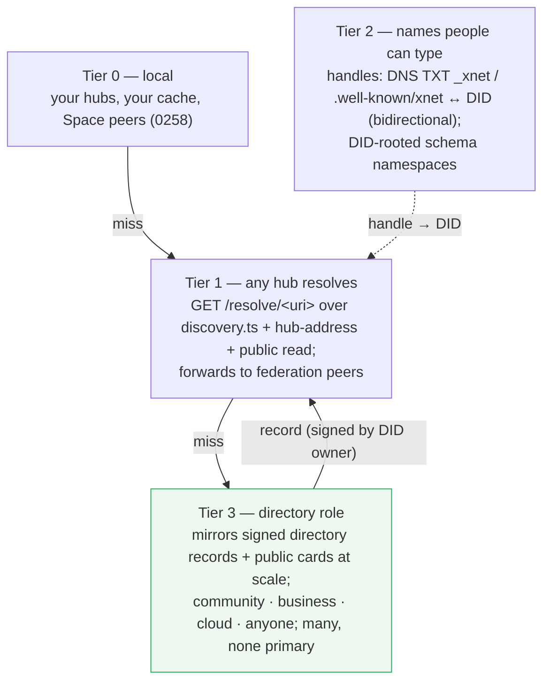
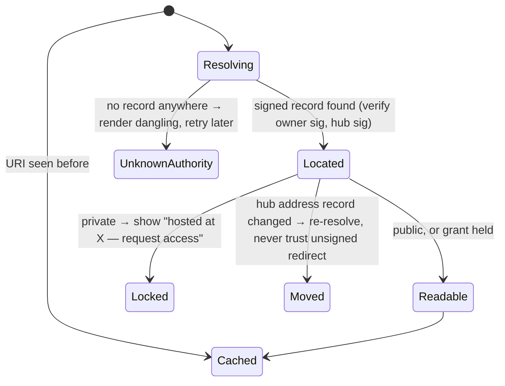
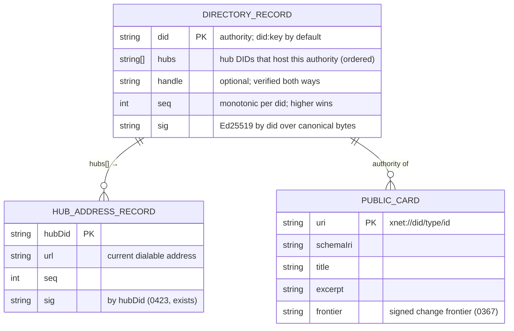

# Global names for any node — URIs, custom types, and the directory ladder

> [!TIP]
> **TL;DR** — Give every node an **absolute name that exists before any
> server sees it**: <mark>`xnet://<authority>/<type>/<id>`</mark> where the
> authority is a DID the user minted (`did:key` today; `did:web`/handle as
> sugar), the type is a schema IRI whose namespace can itself be a DID (so
> anyone mints node types without DNS), and the id is the client-minted
> nanoid the store already uses. 0448's short `xnet://page/<id>` becomes the
> relative form of this. Give it an **HTTP twin** every hub already almost
> serves (`https://<hub>/n/<did>/<type>/<id>`, plus `/.well-known/xnet` for
> handles) so links work on today's web. Then resolve names with a
> <mark>ladder, not a root</mark>: (0) your own hubs and cache; (1) **any hub
> as resolver** — the DID→address directory (`discovery.ts`), the signed hub
> address record (0423) and public read (0179) already exist, they only need a
> `GET /resolve/<uri>` in front; (2) **handles** via DNS TXT / well-known and
> DID-rooted schema namespaces; (3) a **`directory` hub role** that mirrors
> signed address records and public cards at scale, run by communities,
> businesses, or xNet Cloud, and — by construction — cannot rewrite what it
> mirrors. Reject a single PLC-style authority run by xNet (Charter §6 "no
> global chokepoint tier"); accept many mirrors of the same signed log. Clients
> route through peers only inside a Space they already share (0258); they are
> never the directory.

## Problem Statement

[0448](./0448_[_]_ONE_MARKDOWN_DIALECT_ID_BEARING_MENTIONS_AND_DEEP_LINKS_FOR_EVERY_NODE.md)
gave every node an id-bearing link inside a workspace. This exploration asks
what happens when the link leaves the workspace:

1. **Custom types.** Anyone can define a node type (a plugin schema, a
   database, a lexicon). Can anyone else link to an instance of that type,
   render it sensibly without having the plugin, and know what it is?
2. **Links that go somewhere.** A link in markdown, on a web page, in an
   email. Clicking it should reach the node — if it is public, or if the
   reader has access — whether the node lives on xNet Cloud, a self-hosted
   hub, a community hub, or (later) a peer.
3. **Both internets.** The link must work over HTTP today and over the xNet
   network as it federates, without the hub having to mint a special id for
   the URL. The name should come from the data, not the host.
4. **The directory.** What is the DNS of this? A lookup any hub can answer,
   possibly assisted by clients, possibly by specialty directory servers the
   way ATProto has relays and PLC — explored from "everything baked into
   every hub" to "communities run big lookup tables."

## Executive Summary

| Layer                       | Today                                                                                                     | Proposed                                                                                                                       |
| --------------------------- | --------------------------------------------------------------------------------------------------------- | ------------------------------------------------------------------------------------------------------------------------------ |
| Node id                     | `nanoid` minted on the client (`createNodeId`, `packages/data/src/schema/node.ts:200`); unique, unscoped   | Unchanged. It is the `rkey`.                                                                                                   |
| Authority                   | Implicit (the workspace); hub stores `ownerDid` on `doc_meta` (never authorized on it)                     | Explicit in the absolute URI: the owner's DID (`did:key`), or a DID-bound handle.                                              |
| Type                        | `SchemaIRI` = `xnet://<dns-namespace>/<Name>@<ver>` (`xnet.fyi/Task`); hub registry `/schemas/resolve/*`  | Same shape; **namespace may be a DID** (`xnet://did:key:z6Mk…/RecipeCard@1.0.0`) — mint a type with no DNS.                    |
| Absolute URI                | None; `store-auth.ts:497` already builds `xnet://<actorDid>/node/<resource>` for grants                    | `xnet://<authority>/<type>/<id>[#block=…]`; relative `xnet://<type>/<id>` (0448) = "authority is my workspace"                  |
| HTTP twin                   | Hub `GET /node/:id` for public nodes (0179); share `/s/:linkId`                                            | `https://<hub-or-handle>/n/<did>/<type>/<id>` (302 to the hosting hub, or serves the card); `/.well-known/xnet` for handles     |
| DID → where                 | `DiscoveryService` (`dids.ts`: register/resolve peers, 7-day TTL, 10k cap); `/.well-known/xnet-hub-address` signed by hub DID (0423); cloud mirror | Same records, promoted to the **directory record**; any hub answers `GET /resolve/<uri>` from its own tables → then asks peers/directories |
| Handles                     | `handle` on Profile (0172), local only                                                                     | DNS TXT `_xnet.<handle>` / `https://<handle>/.well-known/xnet` → DID (+ hub hint), bidirectionally verified                    |
| Directory at scale          | Cloud control plane `TenantRecord.hubUrl` (private)                                                       | `directory` **hub role** mirroring signed address records + public cards; many operators; mirrors cannot rewrite                |
| Client routing              | Multi-hub sync inside a Space (0258), WebRTC peers                                                         | Peers answer resolution only for authorities they share a Space with; never a public directory                                 |

> [!IMPORTANT]
> The design constraint that makes this coherent is already in the Charter:
> **no global chokepoint tier**, and **no identity ransom**. So the name must
> not depend on any server (it doesn't — DID + nanoid), and resolution must
> degrade gracefully (cache → any hub → directory) rather than fail closed
> when one operator disappears. ATProto's `did:plc` is a single strongly
> consistent log with community read-replicas; xNet's directory is the same
> *records* with **no primary** — every hub is a writer for the DIDs it
> hosts, every mirror re-serves signatures it cannot forge (the 0423 rule).

---

## Current State In The Repository

### What already exists, and where it stops

| Piece                                    | Where                                                                                                                                | What it does today                                                                                   | Gap                                                                    |
| ---------------------------------------- | ------------------------------------------------------------------------------------------------------------------------------------ | ---------------------------------------------------------------------------------------------------- | ---------------------------------------------------------------------- |
| Client-minted ids                        | `packages/data/src/schema/node.ts` `createNodeId()` (nanoid); temp ids `store/tempids.ts`                                            | Unique per creation, no server                                                                       | Not scoped to an authority in any URI                                  |
| Self-minted identity                     | `packages/identity/src/keys.ts` (`did:key`, Ed25519)                                                                                 | Works on any hub; no resolvable document (by design, Charter §2)                                     | Cannot carry "where I live" — 0423 Key Finding 3                       |
| Schema IRIs                              | `packages/data/src/schema/node.ts` `parseSchemaIRI` / `buildSchemaIRI` — `xnet://<ns>/<Name>@<ver>`; `schema/registry.ts`, `lexicons/`, `record-lens.ts` (0380/0389), `atmosphere-publish.ts` | Versioned, namespaced types; hub `routes/schemas.ts` publishes/resolves; plugin schemas sync as nodes (0189) | Namespace is DNS-shaped by convention; nothing says a DID may be one   |
| DID-authority URI form                   | `packages/data/src/auth/store-auth.ts:497` `xnet://${actorDid}/node/${resource}`; `auth/grants.ts` `xnet://xnet.fyi/Grant`            | Used for capability targets                                                                          | Not the same grammar as the editor's `xnet://<type>/<id>`             |
| Relative node URIs                       | `packages/editor/src/blocknote/specs/{mention,wikilink}.tsx`, `apps/web/src/components/PageView.tsx:535`, `DatabaseEmbed.tsx`, exporter | `xnet://person/<did>`, `xnet://page/<id>`, `xnet://database/<id>`; routed by `navigateToNode`        | Authority implied; unresolvable outside the workspace                  |
| Peer/DID directory                       | `packages/hub/src/services/discovery.ts`, `routes/dids.ts` (`POST /register`, `GET /:did`), `packages/network/src/resolution/did.ts` (`DIDResolver.publish/resolve`, `PeerLocation` multiaddr) | DID → endpoints + `hubUrl`, 7-day TTL, 10 000 cap                                                    | Per-hub, unfederated, unsigned by the DID owner                        |
| Hub address record                       | `packages/hub/src/routes/hub-address.ts` (`/.well-known/xnet-hub-address`, signed by hub DID), `packages/runtime/src/sync/hub-address-client.ts`, `apps/cloud/src/address-mirror.ts` (0423) | Stable name → current URL; mirror re-serves signature; resolver never in data path                   | Names hubs, not people or nodes                                        |
| Public read                              | `packages/hub/src/routes/public.ts` `GET /node/:id` (0179) — effective visibility via Space chain                                     | Unauthenticated read of public nodes the hub holds                                                   | Keyed by bare id; no authority; no redirect to the hosting hub         |
| Share links                              | `server.ts` `/shares/issue|redeem`, `routes/share-interstitial.ts` `/s/:linkId`, `apps/web/src/lib/share-links.ts`, `xnet://share?link=&hub=#s=` | Hub-minted capability links                                                                          | Exactly the "hub mints an id for the URL" the question wants to avoid  |
| Federation / crawl / shards              | `routes/federation.ts` (`FederationPeer { url, hubDid }`), `routes/crawl.ts`, `routes/shards.ts` (0382 W2)                             | Peer hub lists; crawl coordinator; shard router (never wired, 0423)                                  | No resolution protocol between hubs                                    |
| Roles                                    | `packages/hub/src/roles.ts` — `personal | demo | community | index | registry | gateway`                                              | Presets, never runtime branches (0383)                                                              | No `directory` preset                                                  |
| ATProto DID/handle resolution            | `packages/hub/src/services/atproto-binding.ts` (`did:plc` via plc.directory, `did:web` via well-known)                                | Resolves *their* identities                                                                          | The same code shape, pointed at xNet's own records, is Tier 2          |
| Prior thinking                           | [0078](./0078_[_]_TRULY_P2P_DISCOVERY_AND_ROUTING.md) (DHT vs relays), [0082](./0082_[_]_GLOBAL_NAMESPACE_AUTHORIZATION.md), [0091](./0091_[_]_GLOBAL_SCHEMA_FEDERATION_MODEL.md)/[0093](./0093_[_]_NODE_NATIVE_GLOBAL_SCHEMA_FEDERATION_MODEL.md) (schema federation), [0258](./0258_[_]_MULTI_HOME_SYNC_FEDERATED_HUBS_PEERS_AND_THE_REPLICATION_MANIFEST.md) (Space = replication unit), [0301](./0301_[_]_ATPROTO_INTEGRATION_IDENTITY_SYNC_AND_HUB_AS_PDS.md), [0367](./0367_[_]_THE_XNET_INDEX_THE_PROJECTION_MODEL_THE_CARD_AND_THE_BODY.md) (card on PDS / body on hub), [0372](./0372_[_]_JOINING_THE_ATMOSPHERE_ADOPT_EXTEND_MINT_AND_THE_HUB_AS_A_KNOT.md) (NSIDs are DNS-rooted; adopt > extend > mint), [0382](./0382_[_]_EVERYTHING_IS_A_HUB_ROLES_NOT_SERVICES_AND_THE_HUB_OF_HUBS.md), [0423](./0423_[x]_MAKING_768_HUBS_LOOK_LIKE_ONE_THE_SHARD_KEY_IS_THE_PERSON.md) | — | This document composes them |

## External Research

- **AT Protocol** — `at://<authority>/<collection NSID>/<rkey>`; authority is a
  DID or a handle. Handles resolve to DIDs by DNS TXT `_atproto.<handle>` or
  `https://<handle>/.well-known/atproto-did`, and must be **bidirectionally**
  verified (the DID document must claim the handle back)
  ([spec](https://atproto.com/specs/handle)). The DID document (`did:plc`
  from a single strongly-consistent directory with community read-replicas
  and an `/export` firehose ([PLC replicas](https://atproto.com/blog/plc-replicas));
  or `did:web`) carries `#atproto_pds` → service endpoint. Relays crawl PDSes
  and re-serve; AppViews index. NSIDs are DNS-rooted, so a user cannot mint a
  collection type without a domain (0372).
- **Nostr NIP-65** — a signed, replaceable "relay list" event (`kind:10002`)
  says where a pubkey writes and reads; clients follow the outbox
  ([NIP-65](https://nips.nostr.com/65)). No directory: the record lives on
  any relay, discovered by asking relays you know. Closest to "every hub is a
  writer for the DIDs it hosts."
- **DNS itself** — hierarchical, cached, no root dependency at query time
  once cached; the model for "resolver never in the data path" that 0423
  already borrowed.
- **IPFS/IPNS, Handle System (DOI), PURL** — name → current location
  indirection with a mutable pointer signed by the owner; IPNS shows the
  cost of DHT resolution latency for interactive use — the reason 0078 and
  0310 keep DHTs out of the browser path.
- **Matrix / Solid** — server discovery via `/.well-known/matrix/server`;
  WebID as an HTTPS-dereferenceable identity — the "HTTP twin" idea, proven.

## Key Findings

1. **The name already exists; it just is not written down.** Owner DID +
   nanoid + schema IRI are all client-minted, signed into every change, and
   already used in the auth layer as `xnet://<did>/node/<id>`. Writing the
   absolute grammar is a formalisation, not an invention.
2. **Custom types are a namespace rule, not a registry.** Let the schema
   namespace be a DID. `xnet://did:key:z6Mk…/RecipeCard@1.0.0` is globally
   unique, needs no DNS, resolves through the same directory as the nodes
   (ask the DID's hub for `/schemas/resolve/…`), and renders through
   `RecordLens` (0389) as a generic card when the reader lacks the plugin —
   Macro's `UnknownMentionNode`, done properly. DNS namespaces stay for
   first-party (`xnet.fyi`) and for anything that must become an ATProto NSID
   (0372: adopt > extend > mint).
3. **`did:key` cannot carry the address, so the directory record must live
   beside it — and it already does, twice.** `discovery.ts` (DID → endpoints,
   hubUrl) and the hub address record (hub DID → URL). Promote them into one
   signed **directory record** `{ did, hubs: [hubDid…], handle?, seq, sig }`
   signed by the DID owner, with each hub's own address record signed by the
   hub. Two signatures, two authorities, no root.
4. **Any hub can be a resolver today with one route.** `GET /resolve/<uri>`:
   parse → if authority hosted here, answer (card or 302 to `/n/…`); else
   consult local directory records → else ask configured directories /
   federation peers → else 404 with "unknown authority." Public read (0179)
   already decides what may be shown unauthenticated; grants decide the rest.
5. **The HTTP twin is nearly free.** `https://<hub>/n/<did>/<type>/<id>` is
   `GET /node/:id` plus authority. A link pasted into Slack resolves at any
   hub the reader trusts; the hub redirects to the hosting hub if it isn't
   the host. `https://<handle>/n/…` works when the handle domain fronts the
   hub, exactly as ATProto's `.well-known` handles.
6. **Clients are caches and Space-local relays, not the directory.** Inside
   a shared Space (0258) a peer already knows the members' hubs; it may
   answer for them. Making clients a public directory reintroduces the
   0078/0310 DHT problems (latency, browser transport, churn) for no gain.
7. **Specialty directories are a hub role, and the role is bounded by
   signatures.** A `directory` preset in `roles.ts` that (a) accepts pushed
   directory records, (b) mirrors peers' records, (c) serves `/resolve` and
   public cards fast, (d) may keep a large table — but every answer is a
   record someone else signed. That is what keeps a big directory from
   becoming a chokepoint: it can be slow or absent, never wrong on purpose.
   ATProto relays and PLC mirrors are the same shape.
8. **Privacy is a property of the tiers.** Resolving a private node returns
   "hosted at hub X, authenticate there" — the directory sees a lookup, never
   a body. Public cards (0367) are the only content a directory ever holds.
   Handles are opt-in; a `did:key` with no handle and no directory record is
   simply unlisted (resolvable only by people who already know its hub).

## Options And Tradeoffs

### The URI grammar

```text
absolute   xnet://<authority>/<type>/<id>[@<rev>][#block=<blockId>]
           authority := did:key:… | did:web:… | did:plc:… | <handle>      (handle → DID, verified both ways)
           type      := page | database | row/<dbId> | task | channel | person | canvas | plugin | file | node
                      | <schema-iri-path>   e.g. xnet.fyi/Task@2   or   did:key:z6Mk…/RecipeCard@1
           id        := nanoid (or DID for person)
relative   xnet://<type>/<id>              (0448) — authority = the current workspace / Space
schema     xnet://<namespace>/<Name>@<ver> (existing SchemaIRI; namespace may be a DID)
http twin  https://<hub-or-handle>/n/<authority>/<type>/<id>
           https://<hub>/.well-known/xnet            → { did, hubs[] }  (handle → DID)
           https://<hub>/.well-known/xnet-hub-address (0423, exists)
```

Examples:

```text
xnet://did:key:z6MkhaXg…/page/V1StGXR8_Z5jdHi6B-myT
xnet://alice.example.com/task/9y1Kq                        (handle authority)
xnet://did:key:z6MkhaXg…/did:key:z6MkhaXg…/RecipeCard@1/r_42   (custom type instance)
https://hub.alice.example.com/n/did:key:z6MkhaXg…/page/V1StGXR8_Z5jdHi6B-myT
```

### The directory ladder — from "baked into every hub" to "specialty servers"



| Tier | Who answers                                     | What they hold                                                | Trust                                        | Cost / risk                                                     | Verdict                       |
| ---- | ----------------------------------------------- | ------------------------------------------------------------- | -------------------------------------------- | --------------------------------------------------------------- | ----------------------------- |
| 0    | Client cache; hubs I'm on; Space peers          | Everything for my Spaces                                      | Already trusted                              | None; already exists                                            | ✅ Baseline                   |
| 1    | Every hub                                       | Its own DIDs' records; peers it knows; public cards it holds  | Hub-signed address, owner-signed record      | One route + a forwarding rule; recursion bounded by hop count   | ✅ Build first                |
| 2    | DNS + web servers of handle owners              | `_xnet` TXT / `.well-known/xnet` → DID (+ hub hint)           | DNS + bidirectional check                    | Opt-in; users need a domain (or a hosted subdomain — a Cloud improvement) | ✅ Build second          |
| 3a   | `directory` role hubs                           | Large mirrored tables of records + cards; `/resolve` fast     | Re-serves signatures; cannot forge           | Ops; must stay many-operator                                    | ✅ Build third                |
| 3b   | A single xNet-run PLC-style log                 | Authoritative DID → hub log                                   | Strongly consistent                          | **Chokepoint** (Charter §6); recoverability needs governance    | 🛑 Rejected as primary; acceptable only as one mirror among many |
| 3c   | Global DHT (Kademlia / iroh)                    | DID → provider records                                        | Content-addressed                            | Latency, browser transport, churn (0078/0310)                   | 🟡 Native peers later, never the browser path |
| 3d   | Clients as public directory                     | Gossip tables                                                 | Weak                                         | Battery, churn, privacy (reveals who looks up whom)             | 🛑 Rejected                   |

> [!NOTE]
> **Charter §6 tests for a hosted directory (a plausible Cloud lane).**
> *Improvement?* Yes — running a fast, replicated mirror is operations.
> *BATNA?* Any hub resolves; anyone runs the same role; DNS handles work
> without us. *Vanish?* Records are signed by their owners and cached
> everywhere they were used; the mirror disappearing degrades to "ask another
> hub." Passes. Charging for a **handle under a Cloud domain**
> (`alice.xnet.fyi`) is also an improvement — but a user must be able to
> take their DID to their own domain at any time, or it becomes identity
> ransom.

### Resolution, end to end

```mermaid
sequenceDiagram
  participant U as Reader (any client)
  participant H as Hub the reader trusts
  participant D as Directory role (any of several)
  participant X as Hosting hub of the authority DID
  U->>U: parse xnet://did:key:A/page/N; cache hit?
  U->>H: GET /resolve/xnet://did:key:A/page/N
  alt A hosted here
    H-->>U: card or 302 /n/did:key:A/page/N (grants apply)
  else A in local directory
    H-->>U: { hubs:[X], record(sig A) , hubAddress(sig X) }
  else
    H->>D: GET /resolve/… (bounded fan-out to configured directories / federation peers)
    D-->>H: signed record for A → X
    H-->>U: forward, cache
  end
  U->>X: GET /n/did:key:A/page/N (or open xnet:// in the app → sync/subscribe)
  X-->>U: public: card + body; private: 401 → authenticate / redeem grant
```

### Resolution outcomes



### The directory record



## Recommendation

**Phase 1 — the grammar and the route (Tier 1).**

1. Extend 0448's grammar module (`packages/data/src/markdown/` URI helpers)
   with the absolute form: `parseXnetUri` accepts an authority (DID or
   handle) and a schema-IRI type; `formatXnetUri` emits relative or absolute;
   `resolveRelative(uri, workspaceAuthority)`. Freeze it and record the ADR
   (this is the one-way door).
2. Let a schema namespace be a DID: `parseSchemaIRI` accepts
   `xnet://did:key:…/Name@ver`; the hub schema registry resolves it by
   asking the DID's hub; `RecordLens` renders unknown types as a generic
   card. Document "adopt > extend > mint" for when to use `xnet.fyi/*` vs a
   DID namespace vs an ATProto NSID (0372).
3. Promote `discovery.ts` records into the **directory record** signed by
   the DID owner (`seq`, `hubs[]`, optional `handle`); publish on login /
   hub join; keep the hub address record as is. `packages/network`'s
   `DIDResolver.publish/resolve` is the client API.
4. Add `GET /resolve/<uri>` and `GET /n/<authority>/<type>/<id>` to the hub
   (Hono routes beside `public.ts`), with bounded forwarding to
   `FederationPeer`s and configured directories, and `xnet://` handling in
   `apps/electron/src/main/deep-link.ts` + web `/n/` so links open the app
   when installed and the hub page when not.
5. Vault and publish flavours emit **absolute** URIs (a link that leaves the
   workspace must carry its authority); in-workspace editing keeps relative.

**Phase 2 — names people can type (Tier 2).**

6. Handles: `_xnet.<handle>` TXT and `https://<handle>/.well-known/xnet` →
   `{ did, hubs[] }`, verified bidirectionally against the directory record;
   Cloud offers `<name>.xnet.fyi` as an improvement with a documented
   "take your DID elsewhere" path.

**Phase 3 — scale (Tier 3).**

7. `directory` role in `roles.ts`: accepts pushed records, mirrors peers,
   serves `/resolve` and public cards from a large table, exposes an
   `/export` cursor so others can mirror it. Run one in Cloud; document how
   a community runs one; never make any of them required.
8. Native peers (Electron/iroh, 0310) may gossip directory records inside
   Spaces; the browser never depends on it.

> [!CAUTION]
> Freezing the absolute URI grammar and the signed directory record is the
> one-way door here. Everything after Phase 1 step 1 assumes those bytes.
> Take the time to get the canonical serialisation, versioning (`v` in the
> record) and the handle-verification rule right, and write the ADR with a
> tripwire ("re-open if a second DID method becomes primary" or "if
> resolution p95 exceeds 300 ms via Tier 1 alone").

## Example Code

```ts
// packages/data/src/markdown/uri.ts — extended (0448 → 0450)
export type XnetAuthority = { kind: 'did'; did: string } | { kind: 'handle'; handle: string }
export type XnetUri = {
  authority?: XnetAuthority          // absent ⇒ relative (0448)
  type: string                       // 'page' | … | schema IRI path 'did:key:…/RecipeCard@1'
  id: string
  rev?: string
  block?: string
}
export function parseXnetUri(s: string): XnetUri | null
export function formatXnetUri(u: XnetUri): string
export function toHttpTwin(u: XnetUri, hubBase: string): string   // `${hubBase}/n/${authority}/${type}/${id}`
```

```ts
// packages/hub/src/routes/resolve.ts (new)
app.get('/resolve/*', async (c) => {
  const uri = parseXnetUri(decodeURIComponent(c.req.path.slice('/resolve/'.length)))
  if (!uri?.authority) return c.json({ error: 'relative uri' }, 400)
  const did = await resolveAuthority(uri.authority)              // handle → did (verified) or did
  if (await hostsAuthority(did)) return c.redirect(toHttpTwin(uri, self.url), 302)
  const local = await directory.get(did)                          // owner-signed record
  if (local) return c.json({ record: local, hubs: await hubAddresses(local.hubs) })
  const found = await forward(uri, { maxHops: 2, targets: [...directories, ...federationPeers] })
  return found ? c.json(found) : c.json({ error: 'unknown authority' }, 404)
})
```

```ts
// directory record (canonical, signed by the DID owner)
{ v: 1, did: 'did:key:z6Mk…', hubs: ['did:key:z6MkHubA…', 'did:key:z6MkHubB…'],
  handle: 'alice.example.com', seq: 7, sig: '…' }
```

## Risks And Open Questions

- **The relative/absolute split can leak.** A relative link copied out of a
  workspace is unresolvable elsewhere. Rule: any serialisation that leaves the
  workspace (vault, publish, share, clipboard "copy link") emits absolute.
- **Handles are DNS; DNS is not the Charter's friend.** A handle is sugar
  over a DID and must be reversible; a lost domain must not lose the
  identity. Bidirectional verification and "DID is canonical, handle is a
  claim" keep it honest (ATProto's rule).
- **Directory record conflicts.** Owner-signed `seq` wins; two records with
  the same `seq` and different `hubs` are a client-side fork (lost key or
  compromised device) → surface it, do not pick silently (0306's arbitration
  lesson applies).
- **Forwarding loops and amplification.** Bound hops (2), rate-limit
  `/resolve`, never forward to a target that told us to ask it (no
  Slowloris-by-directory).
- **Private nodes and metadata leakage.** `/resolve` reveals that a DID
  exists and where it lives. Publishing a directory record must be a
  user-visible choice; a DID with no record is unlisted by default (Charter
  §4 Consent).
- **`did:key` rotation.** A rotated key is a new DID; the directory record
  of the old DID can point at the new one (`succeededBy`) signed by the old
  key — the recovery story from 0243 should own this.
- **Open question:** should public cards be pushed to directories or pulled
  (crawled)? 0374's index pipeline is pull; ATProto relays are push via
  firehose. Recommend pull first (`/export` cursor on every hub), push later.
- **Open question:** does `type` in the URI carry the schema *version*?
  Recommend the URI carries the base IRI; the node's own `schemaId` says the
  version — links should not break on a minor bump.
- **Open question:** how does this interact with `xnet://share?…` capability
  links? They stay: a share link is a *grant*, a node URI is a *name*. A share
  link may embed the node URI so the redeemer lands on the right node.

## Implementation Checklist

**Status:** ░░░░░░░░░░ 0/13 items

- [ ] Grammar: absolute `xnet://<authority>/<type>/<id>` in the 0448 URI module (`parseXnetUri` / `formatXnetUri` / `resolveRelative` / `toHttpTwin`); golden tests; ADR with tripwire
- [ ] Schema namespaces may be DIDs: `parseSchemaIRI` / `buildSchemaIRI` accept `xnet://did:…/Name@ver`; hub registry resolves via the DID's hub; `RecordLens` generic card for unknown types
- [ ] Directory record: owner-signed `{ v, did, hubs[], handle?, seq, sig }` — canonical serializer shared by hub and client (pinned byte fixture, as 0423 did); publish on hub join; store in `discovery.ts` beside peer endpoints
- [ ] Hub `GET /resolve/<uri>`: local authority → 302 `/n/…`; local record → JSON; bounded forward to directories + federation peers; rate-limited
- [ ] Hub `GET /n/<authority>/<type>/<id>`: public → card/body via `public.ts` visibility rules; private → 401 with hub identity; handles resolved and verified
- [ ] Clients: `navigateToNode` accepts absolute URIs (own authority → local; foreign → resolve → open remote / subscribe if granted); Electron `deep-link.ts` routes `xnet://` absolute; web `/n/` twin
- [ ] Vault / publish / "copy link" emit absolute URIs; in-workspace stays relative (0448 flavours)
- [ ] Handles: `_xnet` TXT + `/.well-known/xnet` resolver in `packages/network`, bidirectional check against the directory record; Profile `handle` (0172) can be a domain
- [ ] `directory` role preset in `roles.ts`: record intake, peer mirroring, `/resolve`, public-card table, `/export` cursor; documented for community operators
- [ ] Cloud: run one `directory` role; `<name>.xnet.fyi` handles as an improvement with a "move your DID" path (Charter §6 receipt in the claims ledger)
- [ ] Space-peer resolution (0258): peers answer `/resolve` for co-members' authorities over the existing transport; never for strangers
- [ ] Docs: `docs/CHARTER.md` §2/§6 receipts updated; `AGENTS.md`/skill text tells agents which URI form to emit where
- [ ] Cross-link 0448, 0423, 0382, 0372, 0367, 0258, 0078

## Validation Checklist

- [ ] A page link copied from workspace A (`xnet://did:key:A/page/N`) pasted into workspace B on a different hub opens the page when public, and shows "hosted at hub X — request access" when private; the same link as `https://hubB/n/…` opens in a browser with no app installed
- [ ] A custom type minted by DID A (`xnet://did:key:A/RecipeCard@1`) instantiated as `xnet://did:key:A/did:key:A/RecipeCard@1/r_1` renders as a generic card in workspace B without the plugin, with the correct title and schema name
- [ ] Kill the directory role: resolution of an already-seen authority still succeeds from cache; a never-seen authority resolves via a federation peer that hosts it; a truly unknown authority renders dangling and retries
- [ ] Tamper test: a directory that rewrites `hubs[]` in a record fails signature verification on the client and is ignored; a mirror that rewrites a hub address record likewise (0423 test extended)
- [ ] Handle round trip: `alice.example.com` → DID via TXT and via well-known; a handle whose DID record does not claim it back fails resolution
- [ ] Forwarding bounded: a resolve chain across three hubs stops at two hops and returns 404 with the hops tried
- [ ] Privacy: resolving a private node never returns title/excerpt/body from any tier; only the hosting hub, after auth
- [ ] `check:api-report`, typecheck, lint, tests, `check:exploration-links` green

## References

- AT Protocol handles — https://atproto.com/specs/handle ; DID resolution — https://docs.bsky.app/docs/advanced-guides/resolving-identities ; PLC read replicas — https://atproto.com/blog/plc-replicas ; did:plc spec — https://web.plc.directory/spec/v0.1/did-plc
- Nostr NIP-65 relay lists — https://nips.nostr.com/65
- xNet: [`packages/data/src/schema/node.ts`](../../packages/data/src/schema/node.ts) (SchemaIRI, `createNodeId`), [`packages/data/src/auth/store-auth.ts`](../../packages/data/src/auth/store-auth.ts), [`packages/hub/src/services/discovery.ts`](../../packages/hub/src/services/discovery.ts), [`packages/hub/src/routes/dids.ts`](../../packages/hub/src/routes/dids.ts), [`packages/hub/src/routes/hub-address.ts`](../../packages/hub/src/routes/hub-address.ts), [`packages/runtime/src/sync/hub-address-client.ts`](../../packages/runtime/src/sync/hub-address-client.ts), [`apps/cloud/src/address-mirror.ts`](../../apps/cloud/src/address-mirror.ts), [`packages/hub/src/routes/public.ts`](../../packages/hub/src/routes/public.ts), [`packages/hub/src/routes/schemas.ts`](../../packages/hub/src/routes/schemas.ts), [`packages/hub/src/routes/federation.ts`](../../packages/hub/src/routes/federation.ts), [`packages/hub/src/roles.ts`](../../packages/hub/src/roles.ts), [`packages/hub/src/services/atproto-binding.ts`](../../packages/hub/src/services/atproto-binding.ts), [`packages/network/src/resolution/did.ts`](../../packages/network/src/resolution/did.ts), [`apps/electron/src/main/deep-link.ts`](../../apps/electron/src/main/deep-link.ts)
- Charter — [`docs/CHARTER.md`](../CHARTER.md) §2 Exit (no identity ransom), §4 Consent, §6 No global chokepoint tier
- Related explorations: [0448](./0448_[_]_ONE_MARKDOWN_DIALECT_ID_BEARING_MENTIONS_AND_DEEP_LINKS_FOR_EVERY_NODE.md), [0423](./0423_[x]_MAKING_768_HUBS_LOOK_LIKE_ONE_THE_SHARD_KEY_IS_THE_PERSON.md), [0382](./0382_[_]_EVERYTHING_IS_A_HUB_ROLES_NOT_SERVICES_AND_THE_HUB_OF_HUBS.md), [0383](./0383_[x]_TURNING_HUBS_INTO_EVERYTHING_THE_ROLE_IMPLEMENTATION_PLAN.md), [0372](./0372_[_]_JOINING_THE_ATMOSPHERE_ADOPT_EXTEND_MINT_AND_THE_HUB_AS_A_KNOT.md), [0367](./0367_[_]_THE_XNET_INDEX_THE_PROJECTION_MODEL_THE_CARD_AND_THE_BODY.md), [0374](./0374_[_]_THE_XNET_INDEX_ONE_EXECUTABLE_PLAN_THE_PIPELINE_THE_SITE_AND_THE_SHIPPING_ORDER.md), [0258](./0258_[_]_MULTI_HOME_SYNC_FEDERATED_HUBS_PEERS_AND_THE_REPLICATION_MANIFEST.md), [0301](./0301_[_]_ATPROTO_INTEGRATION_IDENTITY_SYNC_AND_HUB_AS_PDS.md), [0306](./0306_[_]_EPOCH_RESOLVED_HUB_ARBITRATION.md), [0310](./0310_[_]_IROH_INTEGRATION_FOR_P2P_AND_FEDERATION.md), [0078](./0078_[_]_TRULY_P2P_DISCOVERY_AND_ROUTING.md), [0082](./0082_[_]_GLOBAL_NAMESPACE_AUTHORIZATION.md), [0091](./0091_[_]_GLOBAL_SCHEMA_FEDERATION_MODEL.md), [0093](./0093_[_]_NODE_NATIVE_GLOBAL_SCHEMA_FEDERATION_MODEL.md), [0179](./0179_[_]_SPACES_GROUPS_AND_UNIFIED_SHARING.md), [0243](./0243_[x]_ACCOUNT_VALIDATION_AND_RECOVERY_BINDING_THE_PAYER_TO_THE_PASSKEY.md), [0389](./0389_[_]_XNET_AND_ATPROTO_COSTS_COMPLEMENTS_CONFLICTS_AND_PLAYING_WELL.md)
