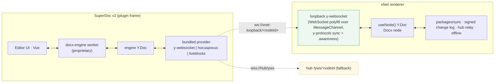

# SuperDoc — DOCX documents as an opt-in plugin over xNet's Yjs and change log

> [!TIP]
> **TL;DR** — Yes, and only as an **opt-in plugin**, never in the MIT core.
> SuperDoc v2 is the one browser-native, OOXML-fidelity DOCX editor with Yjs
> collaboration, comments and track changes, and its Document API (queries,
> mutation plans, receipts, `expectedRevision`, `projectMarkdown()`) mirrors
> xNet's AI surface almost one-to-one. But two facts shape everything: (1) the
> v2 engine (`@superdoc/docx-engine`) is <mark>proprietary and obfuscated</mark>
> — usable free only "as a dependency of SuperDoc… for uses permitted under
> AGPLv3", with a "Prohibited AI Use" clause — and the editor around it is
> AGPL, so per 0342's precedent it lives in a dynamically loaded, AGPL-labelled
> plugin bundle, never in publishable MIT packages or the FSL cloud without a
> commercial licence; (2) v2 collaboration <mark>owns its Y.Doc</mark> and
> speaks only y-websocket / Hocuspocus / Liveblocks — the v1 `{ ydoc, provider }`
> seam is gone. So the data model is simple (a `Docx` node = xNet Y.Doc per
> node + canonical `.docx` blob + cached markdown projection), but the collab
> wiring needs a bridge: a **loopback y-websocket provider** in the renderer
> that speaks the y-websocket protocol to SuperDoc's bundled provider and
> mirrors updates into xNet's own `useNode` Y.Doc (offline, signed change log,
> hub relay all for free), with a hub-hosted y-websocket room as the fallback
> and an upstream issue asking v2 for an external-doc option as the real fix.
> Keep BlockNote + markdown as the default page; DOCX is a second document
> kind for contracts and business paper, with docx-native comments and
> tracked changes as source of truth mirrored into xNet's inbox, References
> and agent audit — and every agent edit to a DOCX made as a **tracked
> change** the human accepts in the editor.

## Problem Statement

xNet's document is a BlockNote page on a Yjs fragment with a markdown
projection (0312, 0448). That is right for notes, specs and knowledge. It is
wrong for a contract, an NDA, an offer letter, an RFP response — documents
that arrive as `.docx`, must leave as `.docx` with headers, footers,
numbering, tables and tracked changes intact, and are reviewed by people who
will open them in Word. Converting them to markdown loses the parts that
matter legally. The question is whether SuperDoc v2 can be the DOCX surface
inside xNet without breaking three things: the MIT core and its licensing
story, the local-first Yjs-per-node data model with the signed change log, and
the comments/agent/approval machinery xNet already has.

## Executive Summary

| Question                                | Answer                                                                                                                                                                                       |
| --------------------------------------- | -------------------------------------------------------------------------------------------------------------------------------------------------------------------------------------------- |
| Should xNet integrate SuperDoc?         | Yes, as an opt-in `docx` plugin (0447's rule: a new block enters as a plugin), not as a core dependency.                                                                                     |
| Which version?                          | v2 (`superdoc@2.x`, currently `2.7.0-next.*`; engine `@superdoc/docx-engine@0.6.0-next.*`). v1's ProseMirror model is archived and its collab seam is deprecated.                             |
| Licence reality                         | Editor: AGPL-3.0 (dual, commercial available). Engine: **proprietary**, obfuscated, "Authorized Use = as a dependency of SuperDoc under AGPLv3"; commercial for production/proprietary; explicit no-reverse-engineering and no-AI-analysis clauses. |
| Where does it live?                     | Dynamically loaded plugin bundle labelled AGPL (0342 precedent). Never in `packages/*` MIT publishables, never in `packages/cloud`/`apps/cloud` (FSL) without the commercial licence.       |
| Data model                              | New `Docx` node schema: `document: 'yjs'` (the engine's Y.Doc, opaque, synced by xNet), `blob` = canonical `.docx` bytes (import on first open, export on save/interval), `markdown` cache from `projectMarkdown()`, `title`, `revision`. |
| Sync                                    | Preferred: loopback y-websocket provider → xNet Y.Doc (offline + change log + hub relay unchanged). Fallback: hub-hosted y-websocket room per node. Real fix: upstream external-Y.Doc option. |
| Comments                                | DOCX-native comments (Document API `comments.*`) are the source of truth — they travel with the file. Mirror thread list into xNet Comment nodes/notify inbox with a `docx:<threadId>` anchor. |
| Track changes                           | DOCX-native (`changeMode: 'tracked'`). Agent edits are always tracked; humans accept/reject in SuperDoc's review UI; xNet's audit records the AgentAction, the DOCX records the redline.        |
| Agents                                  | SuperDoc Document API / `@superdoc/mcp` in the plugin's agent tools (0331/0447 slot), gated by xNet's approval ceremony; `getMarkdown()` feeds search, RAG and the 0448 projection.           |
| Default experience                      | Unchanged: BlockNote + markdown. DOCX is a second kind, chosen at create/import time.                                                                                                        |

> [!IMPORTANT]
> The decision that matters is **boundary, not capability**. SuperDoc can do
> everything asked. What must be decided is that it does it from a plugin that
> the MIT app loads on demand, that its Y.Doc is *our* Y.Doc (or is mirrored
> into it), and that its comments and redlines are the truth for DOCX while
> xNet's own systems are the mirror — not the other way round.

---

## Current State In The Repository

| Piece                          | Where                                                                                                                                                              | Relevance                                                                                            |
| ------------------------------ | ------------------------------------------------------------------------------------------------------------------------------------------------------------------ | ---------------------------------------------------------------------------------------------------- |
| Yjs per node                   | Schemas with `document: 'yjs'` (`canvas.ts`, `database.ts`, `course.ts`, `crm.ts` …); `packages/react/src/hooks/useNode.ts` returns `doc: Y.Doc` synced by `packages/sync` / hub relay | A `Docx` schema gets a synced Y.Doc for free — if SuperDoc will write into it                        |
| Page editor                    | `packages/editor/src/blocknote/XNetEditor.tsx` on `content-v4` fragment; markdown projection `packages/plugins/src/ai-surface/page-fragment.ts` (0448)              | Stays the default; DOCX is a sibling, not a replacement                                              |
| Blobs                          | `packages/data/src/blob/blob-service.ts` (default `maxSize` 100 MB), `packages/storage` chunking ≥ 1 MB; ⚠️ 0385: >1 MB blobs silently unsynced                     | `.docx` files are routinely 1–20 MB — the 0385 fix is a prerequisite, not a nice-to-have             |
| Comments                       | `Comment` nodes with `anchorData` (`packages/data/src/schema/schemas/commentAnchors.ts`); `CommentIsland` (0375); BlockNote thread store `packages/editor/src/blocknote/comments/xnet-thread-store.ts` | Add a `docx` anchor kind; mirror, don't replace                                                      |
| Notify / inbox                 | `packages/comms/src/notify`                                                                                                                                        | DOCX comment mentions must land here                                                                 |
| AI surface                     | `packages/plugins/src/ai-surface/` — plans, receipts, `baseRevision`, `renderPageMarkdown` reads a `markdown` property first (`service.ts:2286`), approval ceremony (0337/0394) | SuperDoc's Document API has the same shape; `markdown` property cache slots straight in              |
| Plugin loop                    | `packages/plugins/src/workspace-plugins/` (0331), `extraTools` slot (0447), sandboxed iframe host, `network` allowlist                                              | The `docx` plugin registers a view + agent tools; the engine's worker runs inside the plugin frame   |
| Licensing precedent            | [0342](./0342_[_]_BLOCKNOTE_XL_LICENSING_AND_INTEGRATION.md) (GPL-3 XL kept out of MIT core; opt-in labelled lab bundle; never FSL cloud), [0345](./0345_[_]_COPYLEFT_LICENSING_GPL_AGPL_VS_MIT_PLUS_FSL.md), `scripts/check-plugin-licenses.mjs` | The rule already exists; AGPL + proprietary engine is a stricter case of it                          |
| DOCX today                     | Nothing. 0342 noted "PDF/DOCX/ODT export — we currently have none"; `ExternalItem` (0213) could hold a `.docx` as an opaque file                                    | Greenfield                                                                                           |
| Import lane                    | `packages/data/src/database/import/`, `legacy-import.ts` for editor; no docx→page importer                                                                        | Optional: docx → BlockNote page via `getMarkdown()` for people who want a note, not a contract       |

## External Research

### SuperDoc v2, from the repo (`Harbour-Enterprises/SuperDoc` @ main, Aug 2026)

- **What it is.** "The document engine for DOCX files. Render and edit DOCX
  files in the browser… Built directly on OOXML. Edits write back to the XML
  without an HTML conversion step." V2 "uses an OOXML-backed document model.
  It reads progressively, renders bounded windows, runs without a browser
  DOM, and synchronizes document content and package state through one
  collaboration model." V1 (ProseMirror-authoritative) is archived
  (`apps/docs/V1-ARCHIVE.md`).
- **Packages.** `superdoc` (browser, Vue 3 inside, mounts into your DOM),
  `@superdoc/sdk` (Node), `@superdoc/cli`, `@superdoc/mcp`, Python SDK,
  `@superdoc/document-api` (0.1.0-alpha, AGPL). `superdoc` depends on
  `@superdoc/docx-engine` — the engine that "runs without a browser DOM" — plus
  `yjs`, `y-websocket`, `@hocuspocus/provider`, `jszip`, `vue`.
- **Licence.** Editor AGPL-3.0, commercial via SuperDoc Portal. Engine:
  `apps/docs/content/docs/resources/docx-engine-license.mdx` (v2026-07-14):
  "DOCX Engine, published as @superdoc/docx-engine, is proprietary software
  and is not open source"; "Authorized Use means installing and using DOCX
  Engine solely as a dependency of SuperDoc… for uses permitted under the
  AGPLv3 license"; production/commercial use per a Base Agreement; explicit
  prohibitions on reverse engineering, benchmarking to build a substitute,
  and "Prohibited AI Use" (analysing the engine with LLMs to reimplement it).
- **Collaboration (v2).** `apps/docs/content/docs/editor/collaboration.mdx`:
  "The browser editor owns the provider and Y.Doc lifecycle after your
  application supplies a `v2Collaboration` target" — `providerType:
  'y-websocket' | 'hocuspocus' | 'liveblocks'`, `documentId`, `serverUrl`,
  `roomMode: 'create' | 'join'` (explicit; no join-or-create). The resolver
  (`packages/superdoc/src/core/collaboration/resolve-v2-collaboration-target.ts`)
  says the three families are "implemented inside the bundled v2 runtime" and
  rejects `unsupported-legacy-provider`. The v1 path (`collaboration.js`)
  is marked `@deprecated Use external provider instead. Pass { ydoc, provider }
  to modules.collaboration` — i.e. v1 accepted an external Y.Doc, v2 does not
  (yet). A `memory` provider family appears in tests only.
- **Comments.** `document-api/comments.mdx`: "Comments are document content."
  `comments.create()` anchored to a `SelectionTarget` from a query,
  `parentCommentId` for replies, `comments.patch({status})`, `includeResolved`;
  markdown/HTML projections carry one annotation record per comment with
  `sourceTarget` and `evaluatedRevision`. Built-in and custom comment UIs.
- **Tracked changes.** `document-api/tracked-changes.mdx`: any mutation with
  `{ changeMode: 'tracked', expectedRevision }` produces a reviewable change;
  the review API lists/accepts/rejects. Receipts carry success and revision.
- **Projections.** `projectMarkdown()` / `projectHtml()` with `reviewMode:
  'original' | 'final'`, source maps, diagnostics; `getMarkdown()` compact.
- **Agents.** `@superdoc/mcp` and the SDK expose the same Document API
  ("Agents use supported document operations instead of manipulating raw
  XML").

### Alternatives considered

| Option                                   | Fidelity | Collab | Comments/redline | Licence           | Verdict                                        |
| ---------------------------------------- | -------- | ------ | ---------------- | ----------------- | ---------------------------------------------- |
| SuperDoc v2                              | OOXML-native | Yjs (owned) | Native       | AGPL + proprietary engine | ✅ Only browser-native option with all three   |
| OnlyOffice / Collabora Online            | High     | Yes    | Yes              | AGPL / MPL, **server-rendered** | 🛑 Needs a document server; not local-first    |
| `docx` (MIT) export + `mammoth` (MIT) import from BlockNote | Low (round trip loses layout, numbering, tracked changes) | via page | xNet's own | MIT | 🟡 Keep as the "make a note from a docx" lane |
| Nutrient / TinyMCE / Syncfusion Word     | High     | Some   | Yes              | Commercial only   | 🛑 No open tier                                |
| Do nothing (`.docx` as opaque file)      | —        | —      | —                | —                 | 🟡 Status quo; contracts stay in Word          |

## Key Findings

1. **SuperDoc fits xNet's shape unusually well.** Query → target → mutation
   plan → receipt with `expectedRevision`, markdown projection with source
   map, MCP server — this is `packages/plugins/src/ai-surface` with a
   different document model. The agent lane can be wired without inventing
   a new ceremony: SuperDoc's `expectedRevision` is xNet's `baseRevision`.
2. **The engine licence, not the AGPL, is the real boundary.** AGPL alone
   would already keep it out of the MIT publishables (0342). The proprietary
   engine adds: no bundling into anything we redistribute under other terms,
   no server-side use in FSL cloud without a commercial agreement, and a
   contractual "Prohibited AI Use" that our agent tooling must respect
   (agents may *use* the engine through its API; the plugin sandbox must
   never expose the engine bundle as something to read or analyse). All
   satisfiable by a dynamically loaded plugin — and by writing the boundary
   into `check-plugin-licenses.mjs`.
3. **v2 owns the Y.Doc; xNet needs to own it too.** xNet's guarantees —
   offline with no hub, signed hash-chained change log, multi-hub sync,
   `.xnetpack` export — all attach to a Y.Doc the runtime holds. If SuperDoc's
   Y.Doc lives only inside its worker with a y-websocket provider pointed at
   a server, the DOCX is a cloud document. The fix is a bridge, in order of
   preference: (a) upstream: ask for `v2Collaboration: { providerType:
   'external', ydoc, provider }` — v1 had it, the resolver already has the
   enum slot; (b) a **loopback y-websocket provider**: `y-websocket`'s
   `WebsocketProvider` accepts a `WebSocketPolyfill`; if the bundled runtime
   forwards it (or a `serverUrl` scheme it hands to a polyfill), a
   `MessageChannel`-backed fake socket runs the y-websocket sync/awareness
   protocol (`y-protocols`) against xNet's `useNode` Y.Doc in the same
   renderer — every update lands in our doc, offline works, the change log
   signs it; (c) a **hub room**: mount a y-websocket-compatible endpoint on the
   hub (`/yws/:nodeId?token=`) that maps a room to the node's Yjs state — collab
   works through the hub but offline editing depends on the worker's in-memory
   doc until reconnect. Ship (c) only if (b) is impossible; pursue (a)
   regardless.
4. **The `.docx` blob is the canonical portable form; the Y.Doc is the live
   form.** On first open with an empty Y.Doc: seed from the blob (`roomMode:
   'create'` semantics). On save / debounce / close: export `.docx` back to
   the blob. Export (0344/0449) ships the blob; the Y.Doc is engine-internal
   and travels in `.xnetpack` only. This mirrors how SuperDoc itself treats
   `data: docxBlob` + a room.
5. **Comments must be docx-native or the contract lies.** A comment that
   lives in xNet but not in the file disappears when opposing counsel opens
   it in Word. So DOCX comments are created through the Document API and
   stored in the OOXML; xNet mirrors the thread list (id, author, status,
   excerpt, `sourceTarget`) into Comment nodes with a `docx` anchor so the
   inbox, mentions, References (0448) and notify rules see them. Authorship:
   SuperDoc comments carry a user; map DID ↔ display name at the plugin
   boundary.
6. **Track changes give the agent lane a better UX than pages have.** An
   agent editing a page applies markdown; a human sees a diff card. An agent
   editing a DOCX with `changeMode: 'tracked'` produces a redline the human
   accepts or rejects inside the document — the approval ceremony (0394)
   still parks the *action*; the redline is the *review surface*. Recommend:
   agent DOCX mutations are always tracked, never direct.
7. **Blob size is the first bug you will hit.** 0385's silent-unsynced >1 MB
   blob is fatal for DOCX. Fix it (loud failure, chunked transfer through
   `blob-transfer-queue.ts`) before shipping the plugin.

## Options And Tradeoffs

### Where the code lives

| Option                                        | MIT core intact | Cloud can ship it | Complexity | Verdict          |
| --------------------------------------------- | --------------- | ----------------- | ---------- | ---------------- |
| A. Core dependency of `packages/editor`       | ❌ (AGPL + proprietary contaminate publishables) | ❌ | Low | 🛑 Rejected |
| **B. Opt-in workspace/lab plugin, dynamically imported, AGPL-labelled bundle** | ✅ | Only with commercial licence | Medium | ✅ Recommended |
| C. Separate Electron-only "xNet Docs" app     | ✅              | n/a               | High       | 🛑 Fragmentation |

### How the Y.Doc is wired



| Option                                              | Offline | Change log signs updates | Needs server | Depends on SuperDoc exposing | Verdict          |
| --------------------------------------------------- | ------- | ------------------------ | ------------ | ---------------------------- | ---------------- |
| A. Upstream `providerType: 'external'` `{ydoc, provider}` | ✅   | ✅                       | ❌           | A new option (v1 had it)     | ✅ Ask for it now |
| **B. Loopback y-websocket provider in the renderer** | ✅     | ✅                       | ❌           | `WebSocketPolyfill` or URL hook reaching the bundled provider | ✅ Build if reachable |
| C. Hub y-websocket room per node                    | 🟡 (worker doc until reconnect) | ✅ (hub writes into node Yjs) | ✅ hub | Nothing | 🟡 Fallback |
| D. No collab: blob in/out only                      | ✅      | ✅ (blob changes)        | ❌           | Nothing                      | ✅ Phase 0        |
| E. Liveblocks / Hocuspocus SaaS                     | ❌      | ❌                       | ✅ third party | Nothing                    | 🛑 Not xNet       |

### Comments and track changes — who is the truth

| Concern           | Truth                         | Mirror                                                              | Why                                                                                     |
| ----------------- | ----------------------------- | ------------------------------------------------------------------- | --------------------------------------------------------------------------------------- |
| Comment threads   | DOCX (OOXML comments part)    | xNet `Comment` nodes with `anchor: { kind: 'docx', threadId }`      | Travels with the file; Word users see it                                                |
| Mentions in comments | DOCX text                  | xNet notify + References (0448) via composer-declared `references`  | Inbox and backlinks work; no body parsing on read                                       |
| Tracked changes   | DOCX (`w:ins`/`w:del`)        | xNet AgentAction / change log (who, when, which node)               | Redline is the review surface; audit is xNet's                                          |
| Authorship        | SuperDoc `user`               | DID ↔ display name map at plugin boundary                           | Word shows names; xNet keeps DIDs                                                       |
| Version history   | xNet Yjs history (0376) + blob snapshots | SuperDoc revision counter                                 | One timeline; DOCX revisions are points on it                                           |

> [!NOTE]
> No revenue lane is proposed. If xNet Cloud later offers DOCX editing it will
> need a SuperDoc commercial licence; that cost is an *improvement* charge in
> Charter §6 terms (we run and pay for the engine), and the BATNA (self-host
> the AGPL plugin) and Vanish (the `.docx` blob is always exportable) tests
> pass by construction of this design.

## Recommendation

**Phase 0 — prerequisites and boundary (no SuperDoc yet).**

1. Fix 0385: blobs > 1 MB fail loudly and sync through the chunked transfer
   queue; verify with a 15 MB file.
2. Add the licence boundary to `scripts/check-plugin-licenses.mjs`: any
   bundle containing `superdoc` or `@superdoc/*` must be a plugin/lab bundle
   labelled AGPL, must not be imported by `packages/*` publishables, and must
   not appear in `packages/cloud` / `apps/cloud`. Negative-control fixture
   in memory (AGENTS.md gate rule).
3. File the upstream issue: "v2 `v2Collaboration.providerType: 'external'`
   with `{ ydoc, provider }`" (v1 parity), and confirm whether the bundled
   y-websocket family forwards `WebSocketPolyfill`.

**Phase 1 — the `docx` plugin, single-user.**

4. `Docx` schema (`packages/data`): `document: 'yjs'`, `blob` (docx bytes),
   `title`, `markdown` (cache), `docxRevision`, `sourceFileName`.
5. Plugin bundle (workspace plugin or first-party lab, dynamically imported):
   view contribution mounting `new SuperDoc({ document: { data: blob } })`,
   save-back on `documentMode: 'editing'` idle/close via `export()` → blob;
   `getMarkdown()` → `markdown` property so search, RAG and
   `renderPageMarkdown` work unchanged; open `.docx` from file drop / import.
6. Comments and track changes on: SuperDoc built-in UI; mirror thread list
   into Comment nodes (`docx` anchor) on each change event.

**Phase 2 — collaboration on xNet's Y.Doc.**

7. Loopback y-websocket provider (Option B) if the polyfill is reachable;
   otherwise hub `/yws/:nodeId` room (Option C) with token auth via existing
   grants; either way the Docx node's `useNode` Y.Doc is the persisted truth
   and `.docx` export runs from it.
8. Presence: map SuperDoc awareness ↔ xNet presence (`packages/comms/src/presence`).

**Phase 3 — agents.**

9. Register SuperDoc Document API tools in the plugin's agent tools
   (`extraTools`, 0447): `docx_query`, `docx_replace`, `docx_comment`,
   `docx_project_markdown` — every mutation `changeMode: 'tracked'` and
   audited as an AgentAction; approval ceremony parks medium+ actions; the
   redline is reviewed in SuperDoc. Optionally expose `@superdoc/mcp` via
   `xnet connect` for external agents, behind the same guardrail.

> [!WARNING]
> Never import `superdoc` from `packages/editor`, `packages/plugins` or any
> other MIT publishable, and never load it in the FSL cloud without a
> commercial licence. And do not let the plugin sandbox or any agent tool
> expose the engine bundle's internals — the engine licence's AI clause is
> about analysing the engine, not about using it, and the line is easy to
> keep if the plugin only ever calls the Document API.

## Example Code

```ts
// packages/data/src/schema/schemas/docx.ts (shape)
export const DocxSchema = defineSchema({
  id: 'xnet://xnet.fyi/Docx@1.0.0',
  document: 'yjs',                       // engine Y.Doc, mirrored via loopback provider
  properties: {
    title: { type: 'string' },
    blob: { type: 'blob', mime: 'application/vnd.openxmlformats-officedocument.wordprocessingml.document' },
    markdown: { type: 'string' },        // projectMarkdown() cache — renderPageMarkdown reads it first
    docxRevision: { type: 'number' },
    sourceFileName: { type: 'string' }
  }
})
```

```ts
// plugin view (dynamically imported bundle, AGPL-labelled)
const { SuperDoc } = await import('superdoc')            // never a static import in MIT packages
const superdoc = new SuperDoc({
  selector: host.mount, toolbar: host.toolbar,
  documentMode: 'editing',
  document: {
    id: node.id, type: DOCX_MIME, data: await host.readBlob(node.properties.blob),
    v2Collaboration: {
      providerType: 'y-websocket',
      documentId: node.id,
      serverUrl: 'ws://xnet-loopback',                    // intercepted by the loopback polyfill
      roomMode: ydocIsEmpty ? 'create' : 'join'
    }
  },
  onCollaborationReady: () => host.enableToolbar(),
  onCommentsUpdate: async () => host.mirrorThreads(await superdoc.document.comments.list({ includeResolved: true })),
  onEditorUpdate: debounce(async () => {
    host.writeProperty('markdown', await superdoc.document.getMarkdown())
    host.writeBlob(node.properties.blob, await superdoc.export())
  }, 5_000)
})
```

```ts
// agent tool: tracked edit
const q = await doc.query.match({ select: { type: 'text', pattern: args.find }, require: 'exactlyOne' })
const receipt = await doc.replace(
  { target: q.items[0].target, text: args.replace },
  { changeMode: 'tracked', expectedRevision: q.evaluatedRevision }   // ⇐ xNet baseRevision
)
```

## Risks And Open Questions

- **The engine is a black box we cannot fix.** A rendering or fidelity bug is
  a vendor ticket, not a PR. Acceptable for an opt-in plugin; unacceptable
  for the default page — which is why BlockNote stays.
- **`-next` prereleases.** 2.7.0-next.8 today; the collab surface may move.
  Pin, and re-decide at `review`.
- **Loopback may not be reachable.** If the bundled runtime constructs
  `WebsocketProvider` without a polyfill hook, Option B is dead and Option C
  (hub room) is the interim, with offline editing degraded until upstream
  ships an external-doc option. This is the single biggest technical
  unknown; spike it first.
- **Two Y.Docs during Option C.** Engine doc in the worker + node doc on the
  hub, reconciled by the room. Conflict-free by Yjs, but the client's local
  store only holds what the hub relayed — export/`.xnetpack` on an offline
  client could lag. Document it; prefer B.
- **Comment mirror drift.** Mirrors are eventually consistent with the OOXML;
  a Comment node deleted in xNet must not delete the DOCX comment (truth is
  the file). One-way mirror with an explicit "resolve in document" action.
- **AGPL network clause on the hub room.** Option C's y-websocket endpoint
  is xNet code (MIT); SuperDoc code never runs on the hub. Fine. Running
  `@superdoc/sdk` on the hub for server-side projection would not be — keep
  projections client-side.
- **Fonts and pagination fidelity** depend on `@superdoc/fonts` shipping in the
  plugin bundle (size) — measure.
- **Open question:** should agents' DOCX edits require the SuperDoc review UI
  to accept, or may the approval card accept the redline? Recommend the
  former for contracts (the redline is legally meaningful) — the card releases
  the *action*, the human accepts the *change* in the document.

## Implementation Checklist

**Status:** ░░░░░░░░░░ 0/13 items

- [ ] 0385 fix: >1 MB blobs fail loudly and sync via chunked transfer; 15 MB `.docx` round-trips between two devices
- [ ] `check-plugin-licenses.mjs`: `superdoc` / `@superdoc/*` allowed only in AGPL-labelled plugin/lab bundles; forbidden in `packages/*` publishables and `packages/cloud`/`apps/cloud`; in-memory negative control
- [ ] Upstream issue filed: v2 external `{ ydoc, provider }` provider family; confirm `WebSocketPolyfill` reachability; record answer here
- [ ] Spike: loopback y-websocket provider (MessageChannel socket + `y-protocols` sync/awareness against a `useNode` Y.Doc) with SuperDoc 2.x — pass/fail decides Option B vs C
- [ ] `Docx` schema in `packages/data` (`document: 'yjs'`, `blob`, `markdown`, `docxRevision`, `sourceFileName`) + `api:update`
- [ ] `docx` plugin bundle: view contribution, dynamic import, blob seed on first open, export-to-blob on idle/close, `getMarkdown()` → `markdown`
- [ ] Import lane: `.docx` drop/upload creates a `Docx` node; optional "convert to page" via `getMarkdown()` (lossy, labelled)
- [ ] Comments: mirror Document API threads → Comment nodes with `docx` anchor; mentions → notify + References; one-way with "resolve in document"
- [ ] Track changes on by default for the plugin; review UI enabled
- [ ] Collaboration: Option B loopback (or C hub `/yws/:nodeId` with grant-token auth); presence mapping
- [ ] Agent tools (`extraTools`): query / tracked replace / comment / project-markdown, audited, approval-gated; optional `@superdoc/mcp` via `xnet connect`
- [ ] Vault/export (0449): `Docx` exports as the `.docx` blob + `markdown` sidecar; `.xnetpack` carries the Y.Doc
- [ ] Docs: plugin README states AGPL + engine terms, Cloud needs commercial licence; cross-link 0342, 0345, 0385, 0447, 0448, 0449

## Validation Checklist

- [ ] Open a 12-page contract with headers, footers, numbered lists, tables and existing tracked changes; edit; export; reopen in Word — layout, numbering and redlines intact
- [ ] Two devices edit the same `Docx` node concurrently; both converge; the change log on each holds signed updates for the node's Y.Doc; one device offline for 10 minutes then reconnects without loss (Option B) — or documented degradation (Option C)
- [ ] A comment made in SuperDoc appears in xNet's inbox for the mentioned DID and in the References panel; resolving it in SuperDoc updates the Comment node; deleting the Comment node does not touch the DOCX
- [ ] An agent `docx_replace` parks an approval, produces a tracked change, and the human accepts it in the SuperDoc review UI; the AgentAction is in the audit log with the receipt revision
- [ ] `pnpm build` of `packages/*` contains no `superdoc` bytes; `apps/cloud` bundle contains none; the plugin bundle is labelled AGPL in its manifest; the licence gate's negative control reds
- [ ] `.xnetpack` export/import of a `Docx` node restores the blob and the Y.Doc; vault export writes `Docx/<stem>.docx` + `.md`
- [ ] Typecheck, lint, tests, `check:api-report`, `check:exploration-links` green

## References

- SuperDoc repo — https://github.com/Harbour-Enterprises/SuperDoc ; site — https://superdoc.dev ; docs — https://docs.superdoc.dev
- SuperDoc v2 collaboration — https://docs.superdoc.dev/editor/collaboration ; comments — https://docs.superdoc.dev/document-api/comments ; tracked changes — https://docs.superdoc.dev/document-api/tracked-changes ; projections — https://docs.superdoc.dev/document-api/output-projections
- Licences — https://docs.superdoc.dev/resources/license ; DOCX Engine proprietary licence — https://docs.superdoc.dev/resources/docx-engine-license
- Repo files read: `packages/superdoc/src/core/collaboration/resolve-v2-collaboration-target.ts`, `packages/superdoc/src/core/collaboration/collaboration.js` (v1 external `{ ydoc, provider }`), `packages/superdoc/package.json` (`@superdoc/docx-engine`, `yjs`, `y-websocket`, `@hocuspocus/provider`, `vue`)
- xNet: [`packages/react/src/hooks/useNode.ts`](../../packages/react/src/hooks/useNode.ts), [`packages/data/src/blob/blob-service.ts`](../../packages/data/src/blob/blob-service.ts), [`packages/data/src/schema/schemas/commentAnchors.ts`](../../packages/data/src/schema/schemas/commentAnchors.ts), [`packages/editor/src/blocknote/comments/xnet-thread-store.ts`](../../packages/editor/src/blocknote/comments/xnet-thread-store.ts), [`packages/plugins/src/ai-surface/service.ts`](../../packages/plugins/src/ai-surface/service.ts), [`scripts/check-plugin-licenses.mjs`](../../scripts/check-plugin-licenses.mjs)
- Related explorations: [0342](./0342_[_]_BLOCKNOTE_XL_LICENSING_AND_INTEGRATION.md), [0345](./0345_[_]_COPYLEFT_LICENSING_GPL_AGPL_VS_MIT_PLUS_FSL.md), [0312](./0312_[x]_TIPTAP_TO_BLOCKNOTE_EDITOR_MIGRATION.md), [0375](./0375_[x]_INLINE_COMMENT_UI_AS_AN_ISLAND.md), [0376](./0376_[_]_TWO_HISTORIES_ONE_TIMELINE_YJS_DOCUMENT_HISTORY_AND_THE_NODE_CHANGE_LOG.md), [0385](./0385_[x]_FILE_ATTACHMENTS_IN_DATABASE_CELLS.md), [0394](./0394_[-]_AI_INTEGRATION_AND_QUALITY_TECHNIQUES.md), [0331](./0331_[x]_DEVELOPING_XNET_FROM_INSIDE_XNET_SPEC_TO_PLUGIN_LOOP.md), [0447](./0447_[_]_LEARNING_FROM_MACRO_WIRE_THE_LOOP_BEFORE_WIDENING_THE_SUITE.md), [0448](./0448_[_]_ONE_MARKDOWN_DIALECT_ID_BEARING_MENTIONS_AND_DEEP_LINKS_FOR_EVERY_NODE.md), [0449](./0449_[_]_LOSSLESS_INTEROPERABLE_TABLE_AND_CANVAS_EXPORTS_CORE_PLUS_EXTENSION.md), [0213](./0213_[x]_INTEGRATION_PLUGIN_CATALOG_WEBHOOKS_AND_CONNECTORS.md)
