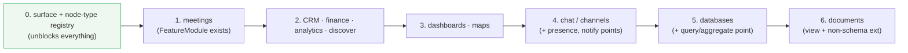

# How far to pluginize — the kernel, the shell, and the lift-out ladder

> [!TIP]
> **TL;DR** — Convert first-party features into plugins **only where the
> conversion forces a missing capability into the public plugin API** — and
> measure it with 0206's <mark>lift-out test</mark> (could this feature ship
> as an external package with zero API changes?), not with a count of
> manifests. Today the answer for documents, databases, chat, tasks and CRM is
> "no", and the reason is one thing: <mark>`TAB_NODE_TYPES` is a closed enum
> in `packages/workbench/src/state.ts` and `SURFACES` is a hard-coded list</mark>;
> `registerHostedViews` demands the complete map at boot. Every other seam
> (22 contribution points, `FeatureModule`, sandbox tiers, the 0331 workspace
> plugin runtime) is already there. Build the **surface + node-type registry**
> first, then walk the ladder from the leaf outward — meetings (already a
> `FeatureModule`), CRM/finance/analytics routes, dashboards/maps, chat and
> channels, databases, and documents last. Four things are **never** plugins,
> because plugins are their *subjects*: the kernel (store, signed change log,
> sync, identity, auth guard), the shell (workbench frame, tab state, slot and
> view registries), the plugin system itself (contribution registries, trust
> derivation, sandbox), and the protocol schemas other peers must understand
> (Space, Grant, Profile, Comment anchors, Node). Making the referee a player
> breaks the guarantees the Charter makes.

## Problem Statement

Three explorations already circled this: [0189](./0189_[_]_EVERYTHING_AS_PLUGINS_FEATURE_MODULE_PLATFORM.md)
(one `FeatureModule` abstraction), [0205](./0205_[_]_DECOMPOSING_THE_APP_INTO_PLUGINS.md)
("as many plugins as is healthy, not as many as possible", with a Tier 0
that is never pluginized), and [0206](./0206_[_]_WHY_SO_FEW_FIRST_PARTY_PLUGINS.md)
("reframe, don't extract" — the manifest count is a measurement artifact; the
real gap is a route/workspace contribution API). Since then the workspace
plugin runtime shipped ([0331](./0331_[x]_DEVELOPING_XNET_FROM_INSIDE_XNET_SPEC_TO_PLUGIN_LOOP.md)),
the workbench became the only shell ([0406](./0406_[x]_ONE_SHELL_TWO_SURFACES_ENDING_THE_DESKTOP_WEB_UI_FORK.md)),
0447 wrote the rule "a new block enters as a plugin an agent could have
scaffolded", and 0451 applied it to DOCX. The question now is sharper: **if
the goal is a robust, battle-hardened plugin ecosystem, should the existing
features become plugins — how far, in what order, and what is exempt?**

## Executive Summary

| Question                                   | Answer                                                                                                                                                                                                                                                                                                                                                                                             |
| ------------------------------------------ | -------------------------------------------------------------------------------------------------------------------------------------------------------------------------------------------------------------------------------------------------------------------------------------------------------------------------------------------------------------------------------------------------- |
| Should we convert existing features?       | Yes, **selectively and in an order that hardens the API** — each conversion must add at least one contribution capability third parties then get. Conversion for its own sake is ceremony (0206).                                                                                                                                                                                                  |
| What is the metric?                        | The lift-out test per feature, tracked in a table in this doc; not the number of manifests in `BUNDLED_PLUGINS` (four today: Mermaid, ChartsExtra, WorkbenchSlash, WorkspaceAgent).                                                                                                                                                                                                             |
| What blocks it today?                      | One closed enum and one hard-coded list: `TAB_NODE_TYPES` (20 values) in `packages/workbench/src/state.ts`, `SURFACES` in `packages/workbench/src/surfaces.ts`, and `registerHostedViews(views: Record<TabNodeType, HostedView>)` requiring the complete map at boot (`view-registry.ts:23`). No plugin can add a top-level node kind or a sidebar surface.                                          |
| How far?                                   | Everything **above** the kernel and the shell: documents, databases, canvas, chat/channels, tasks, CRM, meetings, dashboards, maps, finance, analytics, experiments, labs, importers, connectors — as first-party `FeatureModule`s at `first-party` trust (0205-A), lazy-loaded, registered through the same interfaces community plugins use.                                                    |
| What is not a plugin, and why?             | The **kernel** (NodeStore, signed change log, Yjs doc lifecycle, sync, identity, auth guard), the **shell** (workbench frame, tab state, slot/view/surface registries), the **plugin system** (contribution registries, trust derivation, sandbox tiers, capability guard), and the **protocol schemas** (Node, Space, Grant, Profile, Comment anchors, Task/Page/Database *schema* definitions). Plugins are subjects of these; a pluggable referee is no referee. |
| Order                                      | (1) surface + node-type registry → (2) meetings (already `FeatureModule`) → (3) CRM, finance, analytics, discover routes → (4) dashboards, maps → (5) chat/channels → (6) databases → (7) documents (view only; BlockNote schema nodes stay bundled).                                                                                                                                                 |
| Cost / risk                                | Bundle splitting and boot ordering; schema nodes must never lazy-load across collaborators (0205); a "plugin" that only first-party code can write is not a plugin — the honesty test is that a *workspace* plugin (0331) can register the same contribution.                                                                                                                                       |

> [!IMPORTANT]
> The load-bearing distinction from 0205 stands: **(A) authoring first-party
> features *through* the plugin API** is dogfooding with almost no downside;
> **(B) shipping them *as* installable third-party plugins** is a distribution
> decision with real costs. This exploration recommends (A) all the way up the
> ladder, and (B) only for things that are genuinely optional (SuperDoc, Unreal,
> Slack import, chart packs).

---

## Current State In The Repository

### The plugin surface today

| Layer                         | Where                                                                                                                                                                                                                                                                                                                                                                                                                                             | Status                                              |
| ----------------------------- | ------------------------------------------------------------------------------------------------------------------------------------------------------------------------------------------------------------------------------------------------------------------------------------------------------------------------------------------------------------------------------------------------------------------------------------------------- | --------------------------------------------------- |
| Contribution points           | `packages/plugins/src/manifest.ts` `PluginContributions`: `schemas views widgets editorExtensions propertyHandlers blocks commands settings sidebarItems slashCommands importers mentionProviders agentTools slots` + 7 `canvas*` + `frameRenderers`/`statusBar` in `contributions.ts` — **~22 points**                                                                                                                                             | ✅ Broad                                            |
| `FeatureModule`               | `packages/plugins/src/feature-module.ts` — `XNetExtension` + `capabilities` + `hub?: { featureId }`; consumers: `packages/meetings/src/module.ts`, `apps/web/src/plugins/workspace-agent-module.ts`, `packages/hub/src/features/types.ts`, define-action / define-connector                                                                                                                                                                       | ✅ Exists; **one** shipped feature uses it          |
| Hub features                  | `packages/hub/src/features/first-party.ts` (billing, tasks/GitHub webhook, unfurl…), feature registry with env-scoped secrets (0189 item 2 done)                                                                                                                                                                                                                                                                                                 | ✅                                                  |
| Sandbox tiers                 | `packages/plugins/src/sandbox/`, `packages/labs`, `packages/dashboard/src/sandbox`, opaque-origin iframe host for workspace plugins (0331) — `first-party → host`, `user → SES/worker`, `marketplace → iframe`                                                                                                                                                                                                                                       | ✅                                                  |
| Workspace plugin runtime      | `packages/plugins/src/workspace-plugins/` (0331): source-as-nodes, swc build, hot reload, publish, 9 agent tools — **unwired into any agent lane** (0447)                                                                                                                                                                                                                                                                                         | 🚧 Built, dark                                      |
| Bundled first-party manifests | `apps/web/src/plugins/index.ts` `BUNDLED_PLUGINS`: Mermaid, ChartsExtra, WorkbenchSlash, WorkspaceAgentModule; `first-party-catalog.ts`                                                                                                                                                                                                                                                                                                          | 4                                                   |
| Registries used by first-party code | `WidgetRegistry` (11 widgets), `ViewRegistry` (6 view types), chart kinds, basemaps, canvas shapes, slot views (`registerBuiltinSlotViews`: context, inspector, status), panel views, sidebar sources, surface dock                                                                                                                                                                             | ✅ ~20+ contributions through public interfaces (0206) |
| **Top-level surfaces**        | `packages/workbench/src/state.ts` `TAB_NODE_TYPES` = `page post database canvas dashboard map savedview tasks meetings data experiments crm finance channel tag person lab space settings frame` (closed); `surfaces.ts` `SURFACES` = explorer, requests, tasks, chats, today, data, ai, crm, discover, meetings, finance, analytics (hard-coded); `view-registry.ts` `registerHostedViews(Record<TabNodeType, HostedView>)` — complete map at boot; `apps/web/src/platform/hosted-views.tsx` supplies 20 | ❌ **The gap** — no `surfaces` / `nodeTypes` contribution point |
| Route contribution            | 0189's proposed `/x/$pluginId/$rest` catch-all + registry                                                                                                                                                                                                                                                                                                                                                                                         | ❌ Not built                                        |

### The lift-out table (0206's metric, filled in)

| Feature            | Lives in                                   | Registers via public interfaces?                        | Passes lift-out today? | What it would need                                                          |
| ------------------ | ------------------------------------------ | ------------------------------------------------------- | ---------------------- | --------------------------------------------------------------------------- |
| Mermaid, ChartsExtra | `apps/web/src/plugins/*`                 | ✅ manifest                                             | ✅                     | —                                                                           |
| Meetings           | `packages/meetings/src/module.ts`          | ✅ `FeatureModule`                                      | 🟡                     | a `surfaces`/`nodeTypes` point for its route + tab type                     |
| Dashboards, maps   | `packages/dashboard`, `packages/maps`      | 🟡 widgets/basemaps via registries; surface hard-coded  | ❌                     | surface + node-type registration                                            |
| CRM, finance, analytics, discover, experiments | `apps/web`, `packages/crm`… | ❌ routes and tab types hard-coded                       | ❌                     | surface + node-type registration                                            |
| Tasks              | `apps/web`, task nodes, lenses             | 🟡 views/commands via registries; `tasks` surface hard-coded | ❌                 | surface point; task-specific slot views                                     |
| Chat / channels    | `packages/comms`, `apps/web/src/comms`     | ❌ `channel` tab type, `chats` surface, presence, notify hard-wired | ❌          | surface point + `presence` and `notify` contribution points                 |
| Databases          | `packages/data/src/database`, `apps/web` views | 🟡 property handlers, views via registries; `database` tab type hard-coded | ❌     | surface point; query/aggregate contribution point                           |
| Documents (pages)  | `packages/editor` BlockNote                | 🟡 editor extensions via `editorExtensions`; `page` tab type hard-coded | ❌         | surface point; keep schema nodes bundled (0205)                             |
| Canvas             | `packages/canvas`                          | ✅ 7 canvas contribution points; `canvas` tab hard-coded | 🟡                    | surface point                                                               |

## External Research

- **VS Code** — "many core features of VS Code are built as extensions and use
  the same Extension API" (built-ins live in `extensions/`, e.g. git,
  markdown, emmet). But the workbench, editor core, extension host and the
  contribution-point machinery are **not** extensions; they are what
  extensions contribute into. Exactly the kernel/shell exemption proposed here
  ([Extension API](https://code.visualstudio.com/api)).
- **Obsidian** — core plugins toggle like community plugins and share the
  Plugin API, but ship with the app and update with it; some core plugins
  reach internal APIs community plugins cannot — the honesty risk this doc
  guards against with the workspace-plugin test
  ([The future of Obsidian plugins](https://obsidian.md/blog/future-of-plugins/)).
- **Eclipse** — the maximalist: even the workbench is a plugin over OSGi.
  The cost is boot complexity and a platform nobody could reason about; the
  lesson is that "everything" has a price paid at every startup.
- **Grafana / GStreamer** — first-party panels and elements register through
  the same registries as third-party ones; the count of "plugins" is not the
  KPI, the identical registration path is (0206 already drew this).

## Key Findings

1. **The plugin system is not the bottleneck; the shell's closed lists are.**
   Twenty-two contribution points, a `FeatureModule` type, three sandbox
   tiers and a hot-reloading workspace-plugin runtime exist. What no plugin
   can do is add a *kind of thing* to the workbench: `TAB_NODE_TYPES` is an
   enum, `SURFACES` is a literal, and `registerHostedViews` requires
   exhaustiveness at boot. Documents, databases, chat, tasks and CRM all fail
   lift-out on that single seam.
2. **"Battle-hardening" comes from forcing the API, not from counting
   manifests.** The 0206 finding stands: manifests for first-party code are
   ceremony unless the conversion exposes a capability third parties lack.
   So the rule for each conversion is: *name the contribution point it adds
   or widens; if none, don't convert.*
3. **The honesty test is a workspace plugin.** A first-party feature "is a
   plugin" only if a 0331 workspace plugin, at `user` trust, could register
   the same contributions (view, surface, node type, tools). If first-party
   code needs an internal import to do it, it is not lifted out — it is
   Obsidian's core-plugin situation.
4. **Four things are exempt on principle, not convenience.**
   - *Kernel* — the store, the signed change log, sync, identity, the auth
     guard: plugins are *governed by* these (capability guard, trust tiers,
     Charter §4/§5). A pluggable guard is no guard.
   - *Shell* — the workbench frame, tab state, slot/view/surface registries:
     they are the sockets. Registries can be *extended*, never *replaced*.
   - *Plugin system* — contribution registries, trust derivation
     (`packages/trust`), sandbox: the referee.
   - *Protocol schemas* — Node, Space, Grant, Profile, Comment anchors, and
     the schema *definitions* of Page/Database/Task/Channel that other peers
     must understand to render or authorize your data. 0205: "don't lazy-load
     schema across collaborators." Their *UI* can be a module; their *schema*
     is protocol.
5. **The ladder is leaf-first.** Convert what nothing else depends on
   (meetings, CRM, finance) to prove the surface registry; then things others
   compose with (dashboards, maps, chat); then the substrates that many
   features build on (databases, documents) last, because a regression there
   is a regression everywhere.
6. **Documents are the special case.** The BlockNote editor is itself a
   contribution host (`editorExtensions`, slash commands, blocks). Its
   *schema-defining* specs stay bundled; its *view* and non-schema extensions
   can be a module; SuperDoc (0451) proves a second document kind can arrive
   as a plugin once the surface point exists.

## Options And Tradeoffs

| Option                                            | What it means                                                                                                          | Verdict         | Why                                                                                                             |
| ------------------------------------------------- | ---------------------------------------------------------------------------------------------------------------------- | --------------- | --------------------------------------------------------------------------------------------------------------- |
| **A. Everything is a plugin (Eclipse)**           | Kernel, shell and features all behind one plugin loader                                                                | 🛑 Rejected     | Referee-as-player; boot complexity; nothing to guarantee against (Charter §4/§5)                                 |
| **B. Nothing more; status quo**                   | Keep registries, keep hard-coded surfaces                                                                              | 🛑 Rejected     | Fails lift-out for every major feature; 0451-style additions have nowhere to mount                              |
| **C. Convert leaf-first through the public API, kernel/shell exempt (0205-A, sharpened)** | Surface/node-type registry, then walk the ladder; each step must widen the API; workspace-plugin honesty test | ✅ Recommended | Hardens the API where it is actually weak; measurable; reversible                                                |
| **D. Extract into installable third-party packages (0205-B)**                              | First-party features as marketplace plugins users install                                             | 🟡 Case by case | Right for optional/heavy/licence-bound things (SuperDoc, Unreal, Slack import); wrong for pages/databases       |

### The exemption line, drawn

```mermaid
flowchart TB
  subgraph K["KERNEL — never a plugin"]
    ST[NodeStore · SQLite/OPFS]
    CL[signed change log · sync · Yjs lifecycle]
    ID[identity · auth guard · capability guard]
  end
  subgraph S["SHELL — never a plugin (sockets)"]
    WB[workbench frame · tab state]
    RG[slot / view / surface / node-type registries]
  end
  subgraph P["PLUGIN SYSTEM — never a plugin (referee)"]
    CR[contribution registries · manifest]
    TR[trust derivation · sandbox tiers]
    WP[workspace-plugin runtime]
  end
  subgraph PS["PROTOCOL SCHEMAS — bundled, versioned"]
    SC[Node · Space · Grant · Profile · Comment anchors<br/>Page/Database/Task/Channel schema defs]
  end
  subgraph F["FEATURE MODULES — first-party, through the public API"]
    F1[meetings ✅ · CRM · finance · analytics · discover]
    F2[dashboards · maps · experiments · labs]
    F3[chat / channels · tasks]
    F4[databases (UI, views, handlers) · documents (view, non-schema ext)]
  end
  subgraph X["OPTIONAL PLUGINS — installable"]
    X1[SuperDoc DOCX · Unreal · Slack import · chart packs · community]
  end
  K --> S --> P
  PS --> F
  P --> F --> X
  style K fill:#fdecea,stroke:#c0392b
  style S fill:#fdecea,stroke:#c0392b
  style P fill:#fdecea,stroke:#c0392b
  style PS fill:#fff8e6,stroke:#d4a017
  style F fill:#eef7f0,stroke:#27ae60
```

### The ladder



### The gate for each rung

```mermaid
stateDiagram-v2
  [*] --> Candidate
  Candidate --> Named: names the contribution point it adds/widens
  Candidate --> Skip: adds none → do not convert (0206)
  Named --> Lifted: first-party code registers only via public interfaces
  Lifted --> Honest: a workspace plugin at user trust can register the same
  Honest --> Done: lazy-loaded; boot unaffected; lift-out table updated
  Lifted --> Fix: needs an internal import → widen the API first
  Fix --> Lifted
```

## Recommendation

**Option C.** Concretely:

1. **Build the surface + node-type registry** (the 0189/0205/0206 follow-up,
   now unavoidable): `contributes.nodeTypes[]` (id, hosted view, icon,
   route prefix, create action) and `contributes.surfaces[]` (id, kind
   `panel|route`, slot view or route, pin defaults) in
   `packages/plugins/src/manifest.ts`; `TAB_NODE_TYPES` becomes a runtime
   registry seeded by the app's bundled modules; `registerHostedViews`
   becomes additive with a compile-time check that first-party seeds are
   complete; tab-state migration tolerates unknown types (render "install
   plugin X" instead of crashing).
2. **Adopt the rule** in `AGENTS.md` (beside 0447's): *converting a
   first-party feature into a module is allowed only if it names the
   contribution point it adds or widens; a feature counts as a plugin only if
   a workspace plugin at `user` trust could register the same contributions.*
3. **Walk the ladder** in the order above, one rung per PR, updating the
   lift-out table here. Meetings first — it is already a `FeatureModule`, so
   the first PR is almost purely the registry.
4. **Chat/channels adds `presence` and `notify` contribution points**;
   **databases adds a `queries`/aggregate point** (so a plugin can add a
   rollup kind or a view over a query); **documents converts the page view
   and lazy non-schema editor extensions only** — the schema specs in
   `createXNetSchema()` stay bundled.
5. **Keep the four exemptions explicit** in `packages/AGENTS.md`: kernel,
   shell, plugin system, protocol schemas — with the one-line reason each.
6. **Wire the workspace-plugin tools (0447) before rung 4** so the honesty
   test can actually be run by an agent building a plugin against the new
   points.

> [!WARNING]
> Do not lazy-load or pluginize **schema-defining** code that a collaborator's
> client must have to render or authorize your data — a peer without the
> plugin would see garbage or, worse, an authorization gap. Page/Database/
> Task/Channel schema definitions and comment anchors are protocol. Their
> views are not.

## Example Code

```ts
// packages/plugins/src/manifest.ts — new contribution points (shape)
export interface NodeTypeContribution {
  id: string                          // 'meeting'
  view: ComponentType<HostedViewProps>
  icon?: string
  routePrefix: string                 // '/meetings/'
  create?: CommandContribution['id']  // wired into the consolidated New button (0387)
  supportedSchemas: string[]          // 'xnet://xnet.fyi/Meeting@1'
}
export interface SurfaceContribution {
  id: string                          // 'meetings'
  kind: 'panel' | 'route'
  label: string
  icon?: string
  slotView?: string                   // for panels
  nodeType?: string                   // for routes
  navPinnedByDefault?: boolean
}
// PluginContributions gains: nodeTypes?: NodeTypeContribution[]; surfaces?: SurfaceContribution[]
```

```ts
// packages/meetings/src/module.ts — the first rung, after the registry
export const MeetingsModule = defineFeatureModule({
  id: 'fyi.xnet.meetings',
  contributes: {
    schemas: [MeetingSchema],                                   // already
    nodeTypes: [{ id: 'meetings', view: MeetingsView, routePrefix: '/meetings/', supportedSchemas: [MeetingSchema.id] }],
    surfaces: [{ id: 'meetings', kind: 'route', label: 'Meetings', nodeType: 'meetings' }],
    commands: [...], slots: [...], agentTools: [...]
  }
})
```

## Risks And Open Questions

- **Boot ordering and bundle splitting.** Lazy modules must register before
  the first route resolves; use the existing `BUNDLED_PLUGINS` boot to seed
  registries synchronously and lazy-load *views*, not registrations.
- **Tab-state migration.** Persisted tabs referencing a node type whose
  module is absent must degrade to a placeholder, not crash the shell.
- **Two registration paths for a while.** Until every rung is walked,
  first-party surfaces exist both as literals and as contributions; the
  compile-time exhaustiveness check should shrink rung by rung and be gone
  at the end.
- **Honesty drift.** First-party modules will be tempted to import internals.
  Enforce with a lint: `packages/<feature>` may import `@xnetjs/plugins`
  public surface but not `packages/workbench/src/state.ts` internals.
- **Open question:** should surfaces be user-installable from the
  marketplace (0205-B) or only module-provided? Recommend module-provided
  first; installable when a real optional surface (SuperDoc) needs it.
- **Open question:** what does the electron parity gate (`check-electron-parity`)
  need when surfaces come from modules? Probably a registry-driven parity
  check rather than a hand-listed one.

## Implementation Checklist

**Status:** ░░░░░░░░░░ 0/12 items

- [ ] `contributes.nodeTypes` + `contributes.surfaces` in `packages/plugins/src/manifest.ts` (+ validation, api-report)
- [ ] `TAB_NODE_TYPES` → runtime registry seeded from bundled modules; `SURFACES` → registry; `registerHostedViews` additive with a first-party completeness check; unknown-type placeholder in tab migration
- [ ] `AGENTS.md`: the conversion rule (names a point; workspace-plugin honesty test) and the four exemptions with reasons (via `writing-agent-instructions`)
- [ ] Rung 1: meetings registers its node type + surface through the module; hard-coded entries removed
- [ ] Rung 2: CRM, finance, analytics, discover routes as feature modules
- [ ] Rung 3: dashboards, maps
- [ ] Rung 4: chat/channels module + `presence` and `notify` contribution points
- [ ] Rung 5: databases UI module + `queries`/aggregate contribution point (schema defs stay bundled)
- [ ] Rung 6: documents — page view module + lazy non-schema editor extensions (schema specs bundled)
- [ ] Lint: feature packages may not import workbench/state internals; parity gate reads registries
- [ ] Lift-out table in this doc updated per rung; `first-party-catalog.ts` honesty fixes from 0206
- [ ] Cross-link 0189, 0205, 0206, 0331, 0447, 0451

## Validation Checklist

- [ ] A workspace plugin (0331) at `user` trust registers a new node type + surface and it appears in the sidebar and opens in a tab with no first-party code change
- [ ] Removing the meetings module from `BUNDLED_PLUGINS` removes its surface, tab type and commands; a persisted tab for a meeting renders the placeholder, not a crash
- [ ] Boot time and first-paint unchanged within noise after rungs 1–3 (measure with the existing perf telemetry)
- [ ] Two collaborators, one without a converted *view* module, still render and authorize each other's pages/databases correctly (schema stays bundled)
- [ ] `check-electron-parity`, `check:api-report`, typecheck, lint, tests, `check:exploration-links` green

## References

- Prior explorations: [0189](./0189_[_]_EVERYTHING_AS_PLUGINS_FEATURE_MODULE_PLATFORM.md), [0205](./0205_[_]_DECOMPOSING_THE_APP_INTO_PLUGINS.md), [0206](./0206_[_]_WHY_SO_FEW_FIRST_PARTY_PLUGINS.md), [0331](./0331_[x]_DEVELOPING_XNET_FROM_INSIDE_XNET_SPEC_TO_PLUGIN_LOOP.md), [0406](./0406_[x]_ONE_SHELL_TWO_SURFACES_ENDING_THE_DESKTOP_WEB_UI_FORK.md), [0447](./0447_[_]_LEARNING_FROM_MACRO_WIRE_THE_LOOP_BEFORE_WIDENING_THE_SUITE.md), [0451](./0451_[_]_SUPERDOC_DOCX_INTEGRATION_AS_AN_OPT_IN_PLUGIN.md), [0387](./0387_[x]_CONSOLIDATED_NEW_BUTTON.md)
- Code: [`packages/plugins/src/manifest.ts`](../../packages/plugins/src/manifest.ts), [`contributions.ts`](../../packages/plugins/src/contributions.ts), [`feature-module.ts`](../../packages/plugins/src/feature-module.ts), [`packages/workbench/src/state.ts`](../../packages/workbench/src/state.ts), [`surfaces.ts`](../../packages/workbench/src/surfaces.ts), [`view-registry.ts`](../../packages/workbench/src/view-registry.ts), [`apps/web/src/platform/hosted-views.tsx`](../../apps/web/src/platform/hosted-views.tsx), [`apps/web/src/plugins/index.ts`](../../apps/web/src/plugins/index.ts), [`packages/meetings/src/module.ts`](../../packages/meetings/src/module.ts)
- VS Code Extension API — https://code.visualstudio.com/api ; Obsidian, "The future of plugins" — https://obsidian.md/blog/future-of-plugins/
