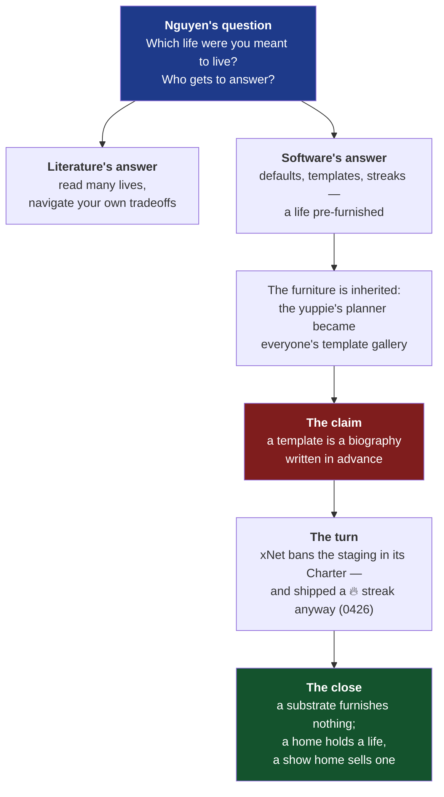
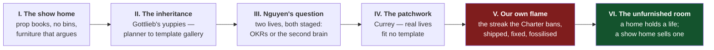

# The Show Home — software and the life you were meant to live

> [!TIP]
> **TL;DR** — Write essay #24, **"The Show Home"**, as a response to Celine
> Nguyen's _the life you were meant to live_ (personal canon, 11 Aug 2026).
> Nguyen argues there is no single right life, only tradeoffs navigated with
> integrity. The essay's addition: <mark>your software answered the question
> before you asked it</mark>. Productivity tools arrive furnished like a show
> home — templates, dashboards, streaks — each one a staged biography. The
> honest turn is that xNet shipped the 🔥 streak counter its own Charter bans
> (exploration 0426), and the essay tells that story straight: the pull to
> furnish someone's life for them is strong enough that it got past the people
> who wrote the rule against it.

---

## Problem Statement

The prompt asks for a blog post on
[Celine Nguyen's essay](https://www.personalcanon.com/p/the-life-you-were-meant-to-live),
a books-newsletter piece that reads ten or so recent titles against one
question: is there a right way to live — the achieving professional life or the
artistic one — and what do you owe the road not taken? Her answer is that the
binary is false, that every path has hidden costs, and that maturity is
continuous navigation rather than arriving at a permanent resolution.

Two things make a response essay harder than it looks.

The first is that **xNet's blog is not a books newsletter**. A straight
appreciation of Nguyen's piece would be off-corpus — the twenty-three existing
essays each argue one mechanism about software, data or economics, grounded in
something checkable. The response has to find the mechanism in her question,
not merely admire the question.

The second is that **the mechanism must not be a stretch**. The connective
tissue is real but it has to be named precisely: tools embed a picture of the
life their user is supposed to be living, and that picture is inherited — from
the professional class Dylan Gottlieb's _Yuppies_ describes, through the
Filofax and the day planner, into the template gallery and the habit tracker.
Nguyen asks who gets to say what a good life looks like. Software answers
daily, in defaults, and mostly nobody notices that an answer was given.

> [!IMPORTANT]
> The load-bearing claim of the essay is **not** "productivity culture is
> bad", which is a saturated genre (Burkeman and others have that ground). It
> is: **a template is a biography written in advance, and the tool that ships
> it has taken a position on Nguyen's question — usually the yuppie's
> position — without ever stating it.** That is specific, observable in any
> onboarding flow, and something xNet can answer in code and has partly
> failed to answer in code, which is what makes the essay honest.

---

## Executive Summary

The essay's controlling image is the **show home**: the staged house on a new
estate, furnished to sell a life. The furniture is arranged so one biography
looks inevitable — and you cannot live there; it exists to be moved through,
admired, and paid for. Productivity software is the show home of a working
life. The template gallery is the staging. The streak counter is the estate
agent following you from room to room.



The recommendation is a single essay, roughly 2,200 words, in the established
house voice — en-GB, conversational, no bulleted lists — that opens inside an
actual show home (prop books, no bins, no cables, furniture chosen to make the
rooms feel larger), walks through the inheritance from the 1980s professional
class to the modern template gallery, meets Nguyen's argument on its own
ground, and then confesses xNet's own streak counter before praising xNet's
Charter. The confession is what earns the close.

---

## Current State In The Repository

This essay stands on the Calm section of the Charter and on the enforcement
story around it — including the enforcement failure, which is documented in
unusual detail.

| Seam                        | Path                                                                                                                                     | Status      | What it gives the essay                                                                       |
| --------------------------- | ---------------------------------------------------------------------------------------------------------------------------------------- | ----------- | --------------------------------------------------------------------------------------------- |
| Charter §3 Calm             | [`docs/CHARTER.md`](../CHARTER.md)                                                                                                       | ✅ Written  | "We compete for your wellbeing, not your time" — the position the essay restates              |
| Humane-patterns gate        | [`scripts/check-humane-patterns.mjs`](../../scripts/check-humane-patterns.mjs)                                                           | ✅ Shipped  | Bans infinite scroll, streak counters, confirmshaming — with a self-aware comment (see below) |
| Motion vocabulary gate      | [`scripts/check-motion-vocab.mjs`](../../scripts/check-motion-vocab.mjs)                                                                 | ✅ Shipped  | Manipulative animation banned at CI (exploration 0199)                                        |
| The streak that shipped     | [`packages/dashboard/src/widgets/streak-heatmap-widget.tsx`](../../packages/dashboard/src/widgets/streak-heatmap-widget.tsx)             | ✅ Fixed    | The 🔥 flame is gone; the widget keeps its historical type name — the fossil                  |
| The streak math             | [`packages/experiments/src/streak.ts`](../../packages/experiments/src/streak.ts)                                                         | ✅ Softened | `computeStreak` no longer breaks the chain on an unlogged today                                |
| Chronological feeds         | [`packages/social/src/feeds/defaults.ts`](../../packages/social/src/feeds/defaults.ts)                                                   | ✅ Shipped  | No engagement ranking — architectural, not policy                                             |
| Rule-based notifications    | [`packages/comms/src/notify/rules.ts`](../../packages/comms/src/notify/rules.ts)                                                         | ✅ Shipped  | Watermark + snooze, hard cap — the opposite of red-dot anxiety                                |
| Surrender exploration       | [exploration 0426](0426_[-]_SHOULD_THE_USER_BE_IN_CHARGE_SURRENDER_AS_A_DESIGN_CONSTRAINT.md)                                            | ✅ Written  | The full record of the violation and the fix — the essay's confession is pre-documented       |
| Malleable workbench         | [exploration 0280](0280_[x]_MALLEABLE_WORKBENCH_COMPOSABLE_WORKSPACE.md)                                                                 | ✅ Shipped  | The user arranges the furniture — composition over prescription                               |
| Blog metadata               | [`site/src/data/blog.ts`](../../site/src/data/blog.ts)                                                                                   | ✅ Shipped  | Post registry; index + RSS single-source                                                      |
| Hero art registry           | [`site/src/pages/blog/index.astro`](../../site/src/pages/blog/index.astro)                                                               | ✅ Shipped  | `heroArt` map — a new post **must** be added here; the build passes silently if missed        |

### The two artefacts the essay quotes

The humane-patterns gate contains a comment that is the essay's thesis in
miniature. From
[`scripts/check-humane-patterns.mjs`](../../scripts/check-humane-patterns.mjs):

> The identifier rule above only catches a streak that admits its name. The
> one we shipped was a local called `streak` fed by `computeStreak()`.

And the widget that once rendered the flame now carries this, at
[`streak-heatmap-widget.tsx:124`](../../packages/dashboard/src/widgets/streak-heatmap-widget.tsx):

> the historical `streak-heatmap` spelling even though nothing streaks now.

A rule against staging, a staging that shipped anyway under a different name,
a fix, and a fossil left in the type name on purpose. That is the whole essay
in four artefacts, and every one of them is in the repository today.

> [!NOTE]
> Exploration 0426 records that the streak rules now "match the underlying
> math reaching a render path, not just identifier spellings" — the Charter's
> own wording. The essay should quote the Charter's enforcement paragraph
> rather than paraphrase it, because the paragraph itself admits the gap that
> let the counter ship.

---

## External Research

### The seed essay

Celine Nguyen, _the life you were meant to live_, personal canon (Substack),
11 August 2026. A reading of roughly ten recent books against the question of
whether the high-achieving professional life or the artistic one is the right
one. Structure: Richard Yates's _Revolutionary Road_ and Andrew Martin's
_Early Work_ on suburban and artistic compromise; Dylan Gottlieb's _Yuppies_
and Mason Currey's _Making Art and Making a Living_ on the economics; Andrea
Bajani and Nelio Biedermann on inherited constraint; Yi-Ling Liu's _The Wall
Dancers_ on ambition under adversity; Gwendoline Riley and Nancy Lemann on
midlife uncertainty. Her conclusion: no destined path exists; integrity means
committing to choices while accepting their tradeoffs, and maturity is
navigation, not resolution.

> [!WARNING]
> The summary above derives from a machine fetch of the essay, not a manual
> read. **Every quotation and attribution must be re-verified against the
> essay itself before drafting** — including the Yates line ("a succession of
> things he hadn't really wanted to do"), which is widely quoted from
> _Revolutionary Road_ but must be confirmed as appearing in Nguyen's piece
> before the essay attributes it to her reading. The same applies to the
> Emily Cooke and Merve Emre attributions. Nothing goes to print on the
> strength of the fetch summary.

### The books the essay leans on

**Dylan Gottlieb, _Yuppies_.** A history of the young urban professional of
the 1980s — the class that made self-management an aesthetic and reshaped
American culture around professional ambition. This is the essay's
inheritance argument: the yuppie's Filofax and Franklin Planner are the
direct ancestors of the template gallery. Publisher and publication date need
first-hand verification before citation.

**Mason Currey, _Making Art and Making a Living_ (Celadon, 31 March 2026).**
Currey's survey of how artists actually fund creative lives: day jobs,
grants, hackwork, patchwork compromise. The essay's use: real lives — even
the artistic ones software romanticises into a "second brain" template — are
patchworks that fit no template at all
([Goodreads](https://www.goodreads.com/en/book/show/231127219-making-art-and-making-a-living),
[Celadon](https://celadonbooks.com/book/making-art-and-making-a-living/)).

**Yi-Ling Liu, _The Wall Dancers: Searching for Freedom and Connection on the
Chinese Internet_ (Knopf, February 2026).** Liu's subjects flourish inside a
bounded, adversarial system — "wall dancers" who find room to move inside
constraint
([Penguin Random House](https://www.penguinrandomhouse.com/books/708614/the-wall-dancers-by-yi-ling-liu/),
[Asian Review of Books](https://asianreviewofbooks.com/the-wall-dancers-by-yi-ling-liu/)).
The essay should use this **once and carefully**: the corpus already has a
walled-garden essay (_The Workshop and the Walled Garden_, about game
modding), so the image is spent as a title but available as a contrast — Liu's
walls are imposed by a state; the show home's walls are bought voluntarily,
which is the more unsettling fact.

### Prior art the essay must not merely repeat

**Oliver Burkeman, _Four Thousand Weeks_ (2021).** The definitive trade
statement that productivity culture sells an impossible mastery and makes
life worse by promising it
([Macmillan](https://us.macmillan.com/books/9780374159122/fourthousandweeks/)).
Burkeman's target is the promise of *getting everything done*. This essay's
target is adjacent but distinct: not the promise of mastery but the **staged
biography** — the tool's silent opinion about which life you are optimising
toward. Burkeman gets one sentence of credit and then the essay moves to
ground he does not occupy: the defaults themselves, and what a tool looks
like when it declines to have an opinion.

**The "tools for thought" genre.** Digital gardens, second brains, Zettelkasten
evangelism — the artistic mirror image of the OKR dashboard. The essay should
notice that the market segmented itself along exactly Nguyen's false binary:
achievement software for the banker, contemplation software for the writer,
and both of them show homes. This observation appears to be genuinely
unclaimed territory.

### The staging details (for the opening)

Show homes are staged with furniture deliberately smaller than standard so
rooms read larger, prop books, no bins, no cables, no televisions that work.
These are widely reported staging-industry practices, but the essay opens on
them as fact, so **at least two citable sources on undersized show-home
furniture must be found before drafting** — a consumer-press investigation or
an industry style guide. If verification fails, the opening degrades
gracefully to the props that are beyond dispute (staged books, absent bins).

---

## Key Findings

| #   | Finding                                                                                | Confidence                              | Why it matters to the essay                                     |
| --- | -------------------------------------------------------------------------------------- | --------------------------------------- | ---------------------------------------------------------------- |
| 1   | Nguyen's thesis: no single right life; navigation over resolution                      | ✅ High — fetched, needs manual re-read | The essay agrees and extends; it never argues with her           |
| 2   | The template gallery is a staged biography — software takes a position on her question | ✅ High — observable in any onboarding  | **The thesis.** Nobody else appears to name it this way          |
| 3   | The achiever/artist binary is mirrored in tool market segmentation                     | ✅ High — observable                    | Connects her literary argument to software without a stretch     |
| 4   | Charter §3 bans the staging machinery explicitly                                       | ✅ High — verified in `CHARTER.md`      | The position the essay represents                                |
| 5   | xNet shipped the 🔥 streak its Charter bans; fixed; gate hardened; fossil kept         | ✅ High — verified in code and 0426     | The confession that earns the close                              |
| 6   | The humane gate's own comment admits the evasion ("a streak that admits its name")     | ✅ High — verified in the script        | The single best quotable artefact                                |
| 7   | Show-home staging details (undersized furniture)                                       | ⚠️ Medium — unverified                  | Opening image; verify or degrade to the undisputed props         |
| 8   | Gottlieb _Yuppies_ publication details                                                 | ⚠️ Medium — unverified                  | Cite precisely or describe loosely                               |

---

## Options And Tradeoffs

| #   | Option                                                          | Effort    | Risk   | Verdict                  |
| --- | ---------------------------------------------------------------- | --------- | ------ | ------------------------ |
| A   | Single essay, mechanism-led (the show home)                     | ~1 day    | Low    | ✅ **Recommended**       |
| B   | Straight response/appreciation of Nguyen's essay                | ~half day | High   | 🛑 Rejected              |
| C   | Essay + docs-site page on the humane gates                      | ~2 days   | Medium | 🚧 Defer the docs page   |
| D   | Broader "ideology of productivity software" survey              | ~2 days   | High   | 🛑 Rejected              |

<details>
<summary>Why not B, C and D</summary>

**B — a response post** ("we read this lovely essay, here are thoughts") is
off-corpus. Every existing essay argues one mechanism grounded in something
checkable; a book-club post has no mechanism and invites comparison with
Nguyen's own prose, which the corpus should not volunteer for.

**C — essay plus a docs page** documenting `check-humane-patterns.mjs` and
`check-motion-vocab.mjs` as a designed system. Genuinely worth doing — the
gates are undocumented outside the Charter's enforcement bullets — but it
triples the review surface and the essay does not depend on it. If the essay
lands, the docs page is a natural follow-up.

**D — the survey** ("how productivity software encodes ideology") is the
version a thousand newsletters have written. It has no seed, no confession
and no code. The show-home essay beats it by being about one image, one
inheritance and one documented failure.

</details>

### Charter §6 — no new revenue lane

This exploration proposes **no new revenue lane**, so the three "No ground
rent" tests (improvement / BATNA / vanish) do not gate it. The essay makes no
new commitment either — Charter §3 already commits to calm, and the essay
reports an existing violation already documented in exploration 0426 and
fixed. Publishing the confession does raise the reputational cost of a future
regression, which is the point: the CI gate defends the code; the essay
defends the gate.

---

## Recommendation

Write **Option A**: one essay, roughly 2,200 words, slug `the-show-home`,
title **"The Show Home"** — in the corpus's short-concrete-noun grain
(_Tree Rings_, _Clutch Power_, _Timeout_, _Palimpsest_).

> [!TIP]
> **Alternate title worth considering:** _"The House Comes Furnished"_ —
> stronger as an argument, weaker as an object. The corpus grain favours the
> object. Decider's call.

### The spine



**Act I** opens inside the show home itself — the staged house on the new
estate. Prop books. No bins, no cables. Furniture arranged so one particular
life looks inevitable. Four sentences, then the pivot: you walked through one
this morning, on your phone, when you opened your productivity app.

**Act II** runs the inheritance. Gottlieb's yuppies made self-management an
aesthetic; the Filofax was its furniture. The planner became the day-planner
app became the template gallery, and the gallery's staged rooms — the OKR
tracker, the habit tracker, the weekly review — are the yuppie's furniture,
still arranged, fifty years on, in software used by people who never chose
that life and were never asked.

**Act III** brings in Nguyen directly and fairly: her essay, her books, her
conclusion that the achiever/artist binary is false. Then the extension she
does not make: the software market took her false binary and segmented itself
along it. Dashboards for the banker; digital gardens for the writer. Both
show homes. The person who has not decided which life to live — Nguyen's
actual reader — is offered no tool at all, only two costumes.

**Act IV** is Currey and the patchwork. Real creative lives are funded by day
jobs and compromise; real working lives are interrupted, seasonal, plural.
The template's biography has no room for a patchwork, and the patchwork is
what an honest tool would have to hold. This is where the essay names the
alternative: a substrate with no opinion — furniture you arrange yourself.
One paragraph on xNet's shape (composable workbench, chronological feeds,
rule-based notifications), no more; the essay is not a product tour.

**Act V** is the confession, and it must not be softened. The Charter bans
streaks engineered around loss aversion. A 🔥 counter shipped anyway — the
gate only caught streaks that admitted their name, and ours was a local
called `streak`. Exploration 0426 found it; the fix removed the flame,
softened the math so an unlogged today no longer breaks the chain, hardened
the gate to match math reaching a render path, and left the old type name in
place — `streak-heatmap`, "even though nothing streaks now" — as a fossil.
The staging instinct is strong enough that it got past the people who wrote
the rule. That is exactly why the rule has to live in CI and not in good
intentions.

**Act VI** returns to Nguyen's close and agrees with it: there is no life you
were meant to live, and anything that tells you otherwise — a novel's
suburbia, a parent's plot, a template gallery — is staging. A show home
sells a life. A home holds one. The difference is who arranges the furniture,
and the only tool worth keeping is one that leaves the vans at the kerb and
lets you carry things in yourself.

### Non-negotiables

Re-read Nguyen's essay manually before drafting and attribute nothing from
the fetch summary alone. Credit Burkeman in one sentence so the essay cannot
be read as reinventing him. Handle the confession in xNet's own voice before
any reader can raise it — the essay praises the Charter only after admitting
the violation. Do not use "walled garden" as a load-bearing image; the corpus
has spent it.

---

## Example Code

The artefact the essay quotes in Act V. From
[`scripts/check-humane-patterns.mjs`](../../scripts/check-humane-patterns.mjs):

```js
{
  name: 'streak counter',
  re: /\b(streakCount|streakCounter|streakDays|dailyStreak|loginStreak|currentStreak)\b/,
  fix: 'streaks weaponize loss aversion; track progress without a punishable chain'
},
{
  // The identifier rule above only catches a streak that admits its name. The
  // one we shipped was a local called `streak` fed by computeStreak(), which
  // ...
  name: 'streak chain in a render path',
```

A rule, its evasion, and the rule that closed the evasion — in one file, in
order, like sediment.

<details>
<summary>Scaffolding for the new post</summary>

Following the pattern established by
[`site/src/pages/blog/the-door-inside-the-house.astro`](../../site/src/pages/blog/the-door-inside-the-house.astro):

```astro
---
import Base from '../../layouts/Base.astro'
import Nav from '../../components/sections/Nav.astro'
import Footer from '../../components/sections/Footer.astro'
import SeriesNav from '../../components/blog/SeriesNav.astro'
import ShowHomeHero from '../../components/blog/ShowHomeHero.astro'
import Byline from '../../components/blog/Byline.astro'
import { postBySlug, formatPostDate } from '../../data/blog'

const post = postBySlug('the-show-home')!
---
```

Three registrations are required and each fails silently if missed — the
build still passes:

```text
┌────────────────────────┐   ┌──────────────────────┐   ┌───────────────────────┐
│ site/src/data/blog.ts  │──▶│ blog/index.astro     │──▶│ blog/rss.xml.ts       │
│ post metadata entry    │   │ heroArt[slug] = Art  │   │ (derives from blog.ts)│
└────────────────────────┘   └──────────────────────┘   └───────────────────────┘
        required                    required                    automatic
```

</details>

---

## Risks And Open Questions

| Risk                                                        | Severity  | Mitigation                                                                                    |
| ----------------------------------------------------------- | --------- | ---------------------------------------------------------------------------------------------- |
| Quotes attributed to Nguyen from the fetch summary          | 🔴 High   | Manual re-read before drafting; attribute nothing unverified                                   |
| Reads as a review of a better writer's essay                | 🟠 Medium | The essay argues its own mechanism; Nguyen appears in one act, credited and extended           |
| Reads as Burkeman warmed over                               | 🟠 Medium | One sentence of credit, then defaults-and-staging ground he does not occupy                    |
| Show-home staging details unverifiable                      | 🟡 Low    | Degrade to undisputed props (staged books, absent bins)                                        |
| Confession invites "so your gates don't work"               | 🟠 Medium | The gate caught nothing; a human did (0426) — say so, then explain why the gate now would      |
| Overclaiming calm as a whole-product property               | 🔴 High   | Claim only what is enforced: the two gates, the feeds file, the notify rules — cite each       |
| "Walled garden" collision with existing essay               | 🟡 Low    | Image banned as load-bearing; Liu appears for contrast only                                    |
| Gottlieb citation imprecise                                 | 🟡 Low    | Verify publisher/date or describe the book loosely without bibliographic claims                |

**Open questions.**

Should Liu's _Wall Dancers_ appear at all, given the corpus's existing
walled-garden essay? Current recommendation: one contrast sentence in Act III
(imposed walls versus purchased ones), no more. Cuttable without damage.

Does the essay mention that the fossil type name was kept deliberately for
data compatibility, or does it let the fossil speak for itself? Current
recommendation: one clause. The fossil is better shown than explained.

Should the deferred docs page on the humane gates (Option C) be its own
exploration? Probably, if the essay lands. Not this one's problem.

---

## Implementation Checklist

**Status:** ░░░░░░░░░░ 0/13 items

- [ ] Read Nguyen's essay manually end-to-end; record which quotations and
      attributions survive verification
- [ ] Verify Gottlieb's _Yuppies_ publisher and publication date first-hand,
      or strip bibliographic specifics
- [ ] Find two citable sources for undersized show-home furniture, or degrade
      the opening to the undisputed props
- [ ] Re-verify the streak story against current code at drafting time:
      the widget, `computeStreak`, and both gate rules
- [ ] Draft `site/src/pages/blog/the-show-home.astro` to the six-act spine,
      ~2,200 words, en-GB, no bulleted lists
- [ ] Add the post entry to [`site/src/data/blog.ts`](../../site/src/data/blog.ts)
      with `draft: true` during authoring
- [ ] Build the hero art component and register it in the `heroArt` map in
      [`site/src/pages/blog/index.astro`](../../site/src/pages/blog/index.astro)
- [ ] Add a `Sources` section to the post listing Nguyen's essay, each book
      cited, and the repo artefacts quoted
- [ ] Run `/humanize` and fix only the elevated tells
- [ ] Add a changelog fragment via `node scripts/changelog/new.mjs`
- [ ] Flip `draft: false` and set `pubDate` from the merge commit
- [ ] `pnpm --filter site build` passes with the new post registered
- [ ] Open the PR with the exploration and the essay in one branch

## Validation Checklist

- [ ] Every factual claim in the essay traces to a URL or repo path in its
      `Sources` section
- [ ] Every external source returns 200 on a manual fetch (403 is a bot-block
      and acceptable with a note; **404 means the citation is fabricated**)
- [ ] No quotation is attributed to Nguyen's essay that was not read in it
      directly
- [ ] The confession (Act V) states the violation before the Charter is
      praised anywhere in the essay
- [ ] The streak claims match the code at publication time, not at
      exploration time
- [ ] The post appears on `/blog`, in `rss.xml`, and renders its hero art
- [ ] `pnpm check:exploration-links` passes
- [ ] `/humanize` tell scan shows no elevated tells and no bulleted lists
- [ ] Read at 320px — the corpus is read on phones

---

## References

**The seed**

- Celine Nguyen, _the life you were meant to live_, personal canon, 11 Aug 2026 — https://www.personalcanon.com/p/the-life-you-were-meant-to-live

**Books cited in the seed** _(verify against the essay before attributing)_

- Mason Currey, _Making Art and Making a Living_ (Celadon, 31 Mar 2026) — https://celadonbooks.com/book/making-art-and-making-a-living/ · https://www.goodreads.com/en/book/show/231127219-making-art-and-making-a-living · https://masoncurrey.substack.com/p/making-art-and-making-a-living
- Yi-Ling Liu, _The Wall Dancers_ (Knopf, Feb 2026) — https://www.penguinrandomhouse.com/books/708614/the-wall-dancers-by-yi-ling-liu/ · https://asianreviewofbooks.com/the-wall-dancers-by-yi-ling-liu/ · https://restofworld.org/2026/wall-dancers-china-internet-book/
- Dylan Gottlieb, _Yuppies_ — _publisher and date unverified; confirm before citing_

**Prior art**

- Oliver Burkeman, _Four Thousand Weeks_ (FSG, 2021) — https://us.macmillan.com/books/9780374159122/fourthousandweeks/ · https://www.oliverburkeman.com/fourthousandweeks

**In this repository**

- [`docs/CHARTER.md`](../CHARTER.md) §3 Calm
- [exploration 0426](0426_[-]_SHOULD_THE_USER_BE_IN_CHARGE_SURRENDER_AS_A_DESIGN_CONSTRAINT.md) — the streak violation, the fix, the hardened gate
- [exploration 0280](0280_[x]_MALLEABLE_WORKBENCH_COMPOSABLE_WORKSPACE.md) — composition over prescription
- [`scripts/check-humane-patterns.mjs`](../../scripts/check-humane-patterns.mjs) · [`scripts/check-motion-vocab.mjs`](../../scripts/check-motion-vocab.mjs)
- [`packages/dashboard/src/widgets/streak-heatmap-widget.tsx`](../../packages/dashboard/src/widgets/streak-heatmap-widget.tsx) · [`packages/experiments/src/streak.ts`](../../packages/experiments/src/streak.ts)
