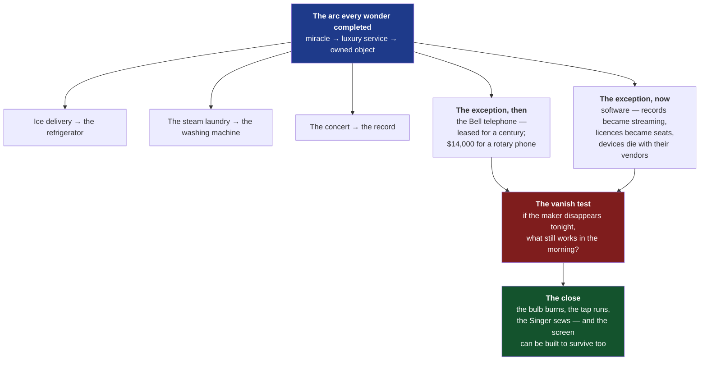
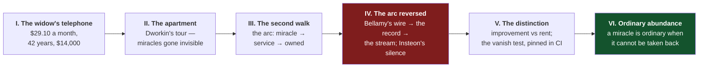

# The Hundred-Year Machine — ordinary abundance and the vanish test

> [!TIP]
> **TL;DR** — Write essay #25, **"The Hundred-Year Machine"**, as a response
> to Jordan Dworkin's [Ordinary Abundance](https://ordinaryabundance.com), the
> interactive apartment tour of once-miraculous everyday technologies. The
> essay's mechanism: every wonder in that apartment matured **toward
> ownership** — the fridge ended the ice subscription, the washing machine
> ended the laundry service, and the one household object that stayed rented
> (the Bell telephone) we now remember as a scandal. <mark>Software is the
> first technology to mature in the other direction</mark> — owned records
> became streaming, owned licences became seats — and the measurable
> difference is the Charter's **vanish test**: walk Dworkin's apartment and
> ask of each object, does it keep working if its maker disappears tonight?

---

## Problem Statement

The prompt asks for a blog post on
[ordinaryabundance.com](https://ordinaryabundance.com), Jordan Dworkin's
site: a quiet walk through a modern apartment where each ordinary object —
the LED bulb, the tap, the fridge, the speaker playing music — opens a
quotation from someone in history for whom that object was unimaginable. The
site's argument is gratitude: these things were miracles, familiarity has
made them invisible, and it "serves us, and honors them" to recapture the awe.

Two things make a response essay harder than it looks.

The first is that **agreement is not an essay**. The site is charming and its
thesis is right, and the corpus does not publish book reports. The response
has to find a mechanism inside the tour that Dworkin does not name — and
there is one: the tour is a catalogue of technologies that completed a
specific economic arc, and the reader's own screen, the thing they are taking
the tour on, has not.

The second is that **the corpus is already dense here**. _Weights You Can
Hold_ covers the generational turn from rented everything to ownable things;
_The Vault and the View_ covers the export brick; _The Door Inside the House_
covers eviction. This essay must claim ground none of them holds: the
**direction of technological maturation** — miracle → luxury service → owned
object — and the observation that software runs that arc backwards. The
instrument that makes the claim checkable is already written down in
[`docs/CHARTER.md`](../CHARTER.md) §6: the vanish test.

> [!IMPORTANT]
> The load-bearing claim of the essay is **not** "subscriptions are bad" —
> xNet Cloud is itself a subscription, and the essay must say so. It is:
> **household technologies matured toward ownership, and the ones that
> didn't — the leased Bell telephone then, the cloud-tethered device now — we
> recognise as failures the moment we see them clearly.** The vanish test is
> how you see them clearly: if the maker disappeared tonight, what still
> works in the morning?

---

## Executive Summary

The essay walks Dworkin's apartment twice. The first walk is his: every
object a miracle, every miracle now invisible. The second walk asks one
question of each object — <mark>does it survive its maker?</mark> — and the
apartment splits cleanly in two.



The recommendation is a single essay, roughly 2,300 words, in the established
house voice — en-GB, conversational, no bulleted lists — opening on Ester
Strogen, the Ohio widow who leased two black rotary telephones from the 1960s
and was still paying $29.10 a month in 2006, more than $14,000 over four
decades, because for most of the twentieth century an American could not own
their telephone. The essay ends on the honest turn: xNet Cloud charges a
subscription too, and the difference worth defending in print is what the
subscription buys — operations, never access — enforced by tests that are
pinned in CI, not promised in prose.

---

## Current State In The Repository

The essay's instrument is written down in the Charter, and unusually for a
blog seed, both halves of it are enforced by named receipts.

| Seam                           | Path                                                                                                                                                        | Status     | What it gives the essay                                                                    |
| ------------------------------ | ----------------------------------------------------------------------------------------------------------------------------------------------------------- | ---------- | ------------------------------------------------------------------------------------------ |
| The vanish test                | [`docs/CHARTER.md`](../CHARTER.md) §6                                                                                                                       | ✅ Written | "If xNet-the-company disappeared tomorrow, what the customer paid for survives" — verbatim |
| No ground rent (five refusals) | [`docs/CHARTER.md`](../CHARTER.md) §6                                                                                                                       | ✅ Written | Each refused rent carries a receipt: export, identity, protocol, storage, per-member       |
| Charter §7 Floor               | [`docs/CHARTER.md`](../CHARTER.md) §7                                                                                                                       | ✅ Written | "Your old hardware keeps working" — the hundred-year-machine promise, with its own honesty |
| Footprint ratchet              | [`scripts/check-footprint-budget.mjs`](../../scripts/check-footprint-budget.mjs) + [`footprint-baseline.json`](../../footprint-baseline.json)               | ✅ Shipped | A CI gate that fails a change which raises the floor — the promise is falsifiable          |
| Claims ledger                  | [`packages/telemetry/test/charter-claims-ledger.test.ts`](../../packages/telemetry/test/charter-claims-ledger.test.ts)                                      | ✅ Shipped | `floor-old-hardware-keeps-working`, `commons-no-ground-rent-export` — receipts by name     |
| Offline-first client           | [`packages/runtime/src/sync/offline-queue.ts`](../../packages/runtime/src/sync/offline-queue.ts)                                                            | ✅ Shipped | The client works with no hub at all — the vanish test's architectural half                 |
| Hub death survivable           | [`packages/runtime/src/sync/MultiHubSyncManager.ts`](../../packages/runtime/src/sync/MultiHubSyncManager.ts)                                                | ✅ Shipped | One hub dying is routine, not an outage                                                    |
| Old protocols keep working     | [`packages/sync/src/negotiation.ts`](../../packages/sync/src/negotiation.ts) · [`packages/sync/src/deprecation.ts`](../../packages/sync/src/deprecation.ts) | ✅ Shipped | Versions deprecate; they are not cut off — the anti-Revolv property                        |
| Portable bundles               | [`packages/data/src/portability/`](../../packages/data/src/portability/)                                                                                    | ✅ Shipped | `.xnetpack` export, verified, free (exploration 0344)                                      |
| Blog metadata                  | [`site/src/data/blog.ts`](../../site/src/data/blog.ts)                                                                                                      | ✅ Shipped | Post registry; index + RSS single-source                                                   |
| Hero art registry              | [`site/src/pages/blog/index.astro`](../../site/src/pages/blog/index.astro)                                                                                  | ✅ Shipped | `heroArt` map — a new post **must** be added here; the build passes silently if missed     |

### The two Charter passages the essay quotes

The vanish test, from §6, is the essay's instrument and should be quoted
rather than paraphrased:

> **Vanish test** — if xNet-the-company disappeared tomorrow, what the
> customer paid for (their data, their audience, their workflows) survives.

And §7's floor gives the essay its title's warrant and its guard against
overclaiming in one paragraph — the Charter itself refuses the green halo:

> Local-first is not obviously greener than a well-run data centre … "Greener"
> would be marketing. "Your old laptop keeps working" is measurable, so that
> is the only claim we make.

> [!NOTE]
> §7 also names the mechanism by which software un-owns hardware: the fastest
> way for an application to do environmental harm is to **make a working
> machine feel broken**. That sentence is the bridge between Dworkin's
> apartment and the repo — the Singer never got an update that made it feel
> broken.

---

## External Research

### The seed site

[Ordinary Abundance](https://ordinaryabundance.com), built by Jordan Dworkin.
An interactive walk through a modern apartment — sitting room, kitchen, back
room — pausing at roughly twenty innovations (streaming music, electric
light, running water, refrigeration, vaccination, the bicycle, the washing
machine, the sewing machine, central heating, flight) to surface historical
quotations of the awe each once drew. Dworkin's companion post explains the
motivation: whether historical expressions of "hope, relief, and joy" for
now-commonplace things can help people access those feelings again
([abundanceandgrowth.org](https://www.abundanceandgrowth.org/p/ordinary-abundance)).
Coverage: [MetaFilter](https://www.metafilter.com/214157/Simultaneously-Miraculous-and-Mundane),
[Straight Arrow News](https://san.com/cc/feeling-overwhelmed-online-this-website-offers-a-dose-of-gratitude/).

The site surfaces Edward Bellamy's 1888 line that music on demand at home
would be "the limit of human felicity" — worth using precisely, because
Bellamy imagined music piped into homes by wire from central halls: the
miracle arrived first as a **service**, then matured into the record you
owned, and has now returned to being a service that stops when you stop
paying. Music is the one object in the apartment that has run the full arc in
both directions, which makes it the essay's hinge.

> [!WARNING]
> The site inventory above derives from a machine fetch plus press coverage.
> **Take the tour manually before drafting** — the essay describes specific
> rooms and objects, and every object it names must actually be in the tour.
> Verify the Bellamy quotation at source (_Looking Backward_, 1888) rather
> than from the site's rendering of it.

### The exception, then: the telephone you could not own

For most of the twentieth century, AT&T customers did not own their
telephones — handsets were Western Electric property, leased with the line.
The Carterfone decision (FCC, 1968) opened the network to customer-owned
equipment, yet the leases outlived the reasoning: Ester Strogen, an Ohio
widow, leased two black rotary phones from the 1960s and was still paying
$29.10 a month in 2006 — over $14,000 across roughly 42 years
([NBC News](https://www.nbcnews.com/id/wbna14838642),
[Computerworld](https://www.computerworld.com/article/1522250/at-t-charges-elderly-widow-14-000-in-rent-for-rotary-phone.html)).
As late as 2007, some 580,000 customers were still leasing telephones through
QLT Consumer Lease Services, mostly holdovers from before the 1984 breakup
([Wikipedia](https://en.wikipedia.org/wiki/QLT_Consumer_Lease_Services)).

This is the essay's fulcrum. The rented telephone reads as a scandal — a
widow paying ten times over for a device she could have owned — **because
every other object in the apartment matured properly**. Nobody rents their
kettle. The scandal is only visible against the arc.

### The exceptions, now: devices that died with their vendors

**Revolv (2016).** A smart-home hub sold with a "lifetime subscription";
after Nest (Google) acquired the company, the servers were switched off —
"As of May 15, 2016, your Revolv hub and app will no longer work"
([Techdirt](https://www.techdirt.com/2016/04/05/you-dont-actually-own-what-you-buy-volume-2203-google-bricking-revolv-smart-home-hardware/),
[CBC](https://www.cbc.ca/news/science/revolv-bricked-1.3521927)). The
lifetime turned out to be the product's, not the customer's.

**Insteon (2022).** The company ceased operations abruptly; hubs could not
connect and were functionally inoperable, because the system was not designed
to work locally without the cloud
([Hackaday](https://hackaday.com/2022/04/25/insteon-abruptly-shuts-down-users-left-smart-home-less/),
[Forrester](https://www.forrester.com/blogs/insteon-and-the-internet-of-bricks/)).
No villain, no policy, no ban — just a vendor vanishing, which is the purest
form of the test.

**Spotify Car Thing (2024).** Discontinued and remotely deactivated; refunds
came only after complaint and legal pressure
([PhoneArena](https://www.phonearena.com/news/spotify-to-refund-users-for-discontinued-car-thing-device_id158900)).

The essay should use Insteon as the clean case: Revolv involves an
acquisition and Car Thing a discontinuation decision, but Insteon is simply
what happens to a cloud-tethered object when its maker runs out of money —
the exact scenario the vanish test names.

### Prior art the essay must credit and move past

**Aaron Perzanowski & Jason Schultz, _The End of Ownership_ (MIT Press,
2016).** The legal statement of the problem: digital goods stripped first-sale
rights and replaced owning with licensing. One sentence of credit. The essay's
ground is different — not the legal category but the **maturation arc** and
the apartment as its exhibit.

**The corpus's own neighbours.** _Weights You Can Hold_ (the generational
exit from rent), _The Vault and the View_ (the export brick), _The Door
Inside the House_ (eviction bundles judgement with custody). Each gets at
most a glancing internal link. This essay's unclaimed ground: the direction
of the arc, the household evidence for it, and the vanish test as the
one-question instrument.

### Details needing verification before print

The service-to-ownership arcs are historically real but the essay states them
as fact, so each needs a citable source: the iceman's delivery route ending
with the household refrigerator; commercial steam laundries predating the
household washing machine; Bell handset ownership rules pre-Carterfone. All
three are standard history, but the repo's rule stands — **403 is a
bot-block, 404 is a fabrication** — and each claim in the printed essay
traces to a URL in its Sources section.

---

## Key Findings

| #   | Finding                                                                              | Confidence                         | Why it matters to the essay                                      |
| --- | ------------------------------------------------------------------------------------ | ---------------------------------- | ---------------------------------------------------------------- |
| 1   | Dworkin's apartment is a catalogue of miracles that became invisible                 | ✅ High — site + press             | The seed; the essay agrees and walks it a second time            |
| 2   | Household technologies matured miracle → service → owned object                      | ✅ High — needs per-arc citations  | **The thesis's first half**                                      |
| 3   | The Bell telephone is the exception that reads as scandal ($14k rotary lease)        | ✅ High — NBC, Computerworld, QLT  | The fulcrum; proves the arc by violating it                      |
| 4   | Software runs the arc backwards (records→streaming; licences→seats)                  | ✅ High — observable               | **The thesis's second half**                                     |
| 5   | Cloud-tethered devices fail the vanish test (Revolv, Insteon, Car Thing)             | ✅ High — multiple outlets         | The modern rented-telephone cases                                |
| 6   | The vanish test is written in the Charter verbatim, with CI-pinned receipts          | ✅ High — verified in `CHARTER.md` | The instrument; makes the essay checkable rather than rhetorical |
| 7   | Charter §7 refuses the green claim and promises only "your old laptop keeps working" | ✅ High — verified                 | Guards the essay against its own overclaim                       |
| 8   | Bellamy's music-by-wire was a service that matured into ownership and back           | ⚠️ Medium — verify at source       | The hinge object; music ran the arc both ways                    |
| 9   | xNet Cloud is itself a subscription                                                  | ✅ High                            | The honest turn — the essay must draw the improvement/rent line  |

---

## Options And Tradeoffs

| #   | Option                                                     | Effort    | Risk   | Verdict                |
| --- | ---------------------------------------------------------- | --------- | ------ | ---------------------- |
| A   | Single essay, arc-led (the hundred-year machine)           | ~1 day    | Low    | ✅ **Recommended**     |
| B   | Gratitude-led appreciation of the site                     | ~half day | High   | 🛑 Rejected            |
| C   | Essay + a public "vanish test" checklist page for software | ~2 days   | Medium | 🚧 Defer the checklist |
| D   | Subscription-economy polemic                               | ~1 day    | High   | 🛑 Rejected            |

<details>
<summary>Why not B, C and D</summary>

**B — an appreciation** repeats the site more weakly than the site says it.
No mechanism, no code, nothing checkable. The corpus does not publish book
reports.

**C — essay plus a standalone "does it vanish?" checklist** (a page scoring
common tools against the vanish test) is attractive and shareable, but it is
a maintenance commitment and a litigation magnet — every vendor scored would
contest the scoring. If the essay lands, revisit with the surveillance-ledger
discipline (`caveat` fields, build-time validation) from exploration 0234.

**D — the polemic** ("everything is a subscription now") is the saturated
version. It has no apartment, no widow, no arc — and it would be dishonest
here anyway, because xNet Cloud charges monthly. The essay's strength is that
it defends a _distinction_ (improvement versus rent), not a _side_
(ownership versus subscription).

</details>

### Charter §6 — no new revenue lane

This exploration proposes **no new revenue lane**, so the three "No ground
rent" tests (improvement / BATNA / vanish) do not gate it — but the essay is
_about_ the third test, and restating them in print constrains the existing
lanes further. Improvement: xNet Cloud's fee pays for operations we run.
BATNA: self-hosting stays real and undegraded. Vanish: the local master copy,
the `.xnetpack` bundle, and the MIT protocol survive the company. The essay
commits nothing new; it explains, in household terms, what is already
committed — which still raises the cost of ever quietly walking it back.

---

## Recommendation

Write **Option A**: one essay, roughly 2,300 words, slug
`the-hundred-year-machine`, title **"The Hundred-Year Machine"** — in the
corpus's concrete-object grain (_Tree Rings_, _Clutch Power_, _The Loom You
Can Read_).

> [!TIP]
> **Alternate title worth considering:** _"The Widow's Telephone"_ — the
> stronger hook, but it leads with the scandal rather than the machine, and
> the essay's warmth (it is, after all, a gratitude essay) sits better under
> the Singer than under the lease. Decider's call.

### The spine



**Act I** opens on Ester Strogen: two black rotary telephones, leased since
the 1960s, $29.10 a month in 2006. Not a swindle by the standards of its
time — for most of a century, renting was simply what a telephone _was_. Four
sentences, then the question: why does this story read as absurd now?

**Act II** answers with Dworkin's apartment, presented generously and in its
own spirit: the tour, the rooms, the historical awe — Bellamy in 1888 calling
music at home the limit of human felicity. The site's thesis lands intact:
these are miracles, and familiarity has hidden them.

**Act III** is the second walk and the essay's own claim. Familiarity is not
the only thing that happened to these objects; they also completed an arc.
The miracle arrives as a service for the rich — the iceman, the steam
laundry, the telephone exchange — and matures into an object anyone owns
outright: the fridge, the washing machine, the kettle. The widow's telephone
is the control case: the one object held back from the arc by a monopoly, and
we recognise the holding-back as the scandal it was.

**Act IV** reverses the film. Music ran the arc forward — Bellamy's wire
became the record you owned — and has now run it back: the stream stops when
the payment stops. Adobe's perpetual licences became seats. And the
apartment's newest objects fail the widow's test outright: Revolv's
"lifetime" ended when Google turned the servers off; Insteon's hubs went dark
the week the company ran out of money; Spotify deactivated Car Thing by
remote. Walk the apartment once more and ask what still works if every maker
vanished tonight. The bulb burns. The tap runs. The bicycle rolls. The
treadle Singer sews. The screens go dark.

**Act V** draws the distinction the essay defends, and turns the mirror on
xNet first: xNet Cloud is a subscription too. The line worth holding is not
owned-versus-rented but improvement-versus-rent — a fee for operations
someone actually runs, never for access to what you would own anyway. Quote
the vanish test verbatim from the Charter, then give its receipts in one
breath each: the local store is the master copy, the client runs with no hub
at all, the export is free and verified, the protocol is MIT, and §7 pins
"your old laptop keeps working" to a CI gate that fails a change which raises
the floor — with the Charter's own refusal of the green halo quoted so the
essay cannot be read as marketing.

**Act VI** returns the site its thesis, upgraded. Dworkin is right that the
miracle deserves awe, and the essay adds the condition under which awe can
safely fade: <mark>a miracle becomes ordinary abundance only when it cannot
be taken back</mark>. Nobody checks the tap before trusting it. That
unthinking trust is the finish line of the arc — and the software on the
table can still get there, but only if it is built to survive its maker. The
hundred-year machine is not nostalgia; it is a spec.

### Non-negotiables

Take the tour manually before drafting; name only objects actually in it.
Verify Bellamy at source. State plainly that xNet Cloud is a subscription
before defending the distinction — the essay's credibility is the mirror
turned on ourselves first. Use Insteon, not Revolv, as the load-bearing
modern case (no villain, pure vanish). Credit Perzanowski & Schultz in one
sentence. Do not claim local-first is greener; §7 explicitly refuses that
claim and the essay must too.

---

## Example Code

The receipt the essay cites in Act V. From
[`packages/telemetry/test/charter-claims-ledger.test.ts`](../../packages/telemetry/test/charter-claims-ledger.test.ts),
the pinned claim ids:

```text
commons-no-ground-rent-export        → portability regression suite
commons-storage-is-an-improvement-charge → entitlements plan math
floor-old-hardware-keeps-working     → footprint ratchet vs baseline
floor-no-sustainability-upcharge     → 'unbacked green claim' rule
```

A promise in prose, each pinned to a test that fails in CI when the promise
slips. The essay's one-line gloss: the widow had no receipt; our reader does.

<details>
<summary>Scaffolding for the new post</summary>

Following the pattern established by
[`site/src/pages/blog/the-door-inside-the-house.astro`](../../site/src/pages/blog/the-door-inside-the-house.astro):

```astro
---
import Base from '../../layouts/Base.astro'
import Nav from '../../components/sections/Nav.astro'
import Footer from '../../components/sections/Footer.astro'
import SeriesNav from '../../components/blog/SeriesNav.astro'
import HundredYearHero from '../../components/blog/HundredYearHero.astro'
import Byline from '../../components/blog/Byline.astro'
import { postBySlug, formatPostDate } from '../../data/blog'

const post = postBySlug('the-hundred-year-machine')!
---
```

Three registrations are required and each fails silently if missed — the
build still passes:

```text
┌────────────────────────┐   ┌──────────────────────┐   ┌───────────────────────┐
│ site/src/data/blog.ts  │──▶│ blog/index.astro     │──▶│ blog/rss.xml.ts       │
│ post metadata entry    │   │ heroArt[slug] = Art  │   │ (derives from blog.ts)│
└────────────────────────┘   └──────────────────────┘   └───────────────────────┘
        required                    required                    automatic
```

</details>

---

## Risks And Open Questions

| Risk                                                           | Severity  | Mitigation                                                                              |
| -------------------------------------------------------------- | --------- | --------------------------------------------------------------------------------------- |
| Objects named that are not in the tour                         | 🔴 High   | Take the tour manually; name only what is there                                         |
| Reads as anti-subscription while charging a subscription       | 🔴 High   | Act V turns the mirror on xNet first; defend the distinction, not a side                |
| Overlap with _Weights You Can Hold_ / _The Vault and the View_ | 🟠 Medium | Claim only the arc + vanish-test ground; one glancing link each                         |
| Household arcs stated without citation (iceman, steam laundry) | 🟠 Medium | Source each arc or soften to "grew from" phrasing without dates                         |
| Bellamy quote wrong at source                                  | 🟠 Medium | Verify in _Looking Backward_ directly; the site's rendering is not the source           |
| Implied green claim                                            | 🔴 High   | Quote §7's refusal verbatim; the humane-patterns gate bans unbacked green claims anyway |
| Strogen case details drift (amounts, years vary by outlet)     | 🟡 Low    | Use NBC's figures; note the range if outlets disagree                                   |
| Reads as a takedown of a gratitude site                        | 🟡 Low    | The essay agrees with Dworkin throughout and extends; Act II is generous and unironic   |

**Open questions.**

Does the tour actually include smart-home devices, or is the apartment
deliberately timeless? If no connected object appears in the tour, Act IV's
"walk the apartment once more" framing needs adjusting — the screens the
essay refers to may be the reader's own rather than exhibits. Settle on the
manual walkthrough.

> [!NOTE]
> **Settled 2026-08-19 — walkthrough done.** The tour has no IoT exhibits;
> the apartment's own narrative supplies the connected objects: the sitting
> room opens on "a playlist your friend made for you years ago" playing over
> the speaker, "you send them a text", and the outro says "silence your
> phone". Act IV uses those, not invented exhibits. Two corrections from the
> walkthrough: the washing exhibit quotes **Anna Laetitia Barbauld's
> 'Washing-Day' (1797)** (Godey's 1860 belongs to the sewing machine), and
> the fruit-bowl exhibit notes that eighteenth-century hostesses **rented
> pineapples** rather than eat them — independently sourced
> ([Mental Floss](https://www.mentalfloss.com/article/65506/super-luxe-history-pineapples-and-why-they-used-cost-8000)),
> and a far better rented-object opening rhyme than expected. The iceman arc
> is sourced via the
> [Smithsonian](https://americanhistory.si.edu/explore/stories/keeping-your-food-cool-ice-harvesting-electric-refrigeration)
> and [Wikipedia's iceman entry](<https://en.wikipedia.org/wiki/Iceman_(occupation)>);
> the steam-laundry claim is **dropped** — the tour's own washing exhibit is
> about household hand-washing, and the essay does not need it.

Should the essay name Adobe's 2013 licence-to-seat turn, or is one dated
example enough alongside music? Current lean: one clause, no section.

Is there a place for §7's floor spec (2017-class laptop, 8 GB RAM) as a
concrete number in the essay, or does hardware detail break the household
register? Current lean: one sentence, numbers included — the corpus rewards
checkable specifics.

---

## Implementation Checklist

**Status:** ░░░░░░░░░░ 0/13 items

- [x] Take the Ordinary Abundance tour manually end-to-end; inventory the
      rooms and objects the essay may name
- [x] Verify the Bellamy quotation in _Looking Backward_ (1888) at source
- [x] Source the household arcs (ice delivery → refrigerator; steam laundry →
      washing machine; Bell handset lease rules pre-Carterfone)
- [x] Confirm the Strogen figures against NBC and note any outlet variance
- [x] Draft `site/src/pages/blog/the-hundred-year-machine.astro` to the
      six-act spine, ~2,300 words, en-GB, no bulleted lists
- [x] Add the post entry to [`site/src/data/blog.ts`](../../site/src/data/blog.ts)
      with `draft: true` during authoring
- [x] Build the hero art component and register it in the `heroArt` map in
      [`site/src/pages/blog/index.astro`](../../site/src/pages/blog/index.astro)
- [x] Add a `Sources` section listing the site, every incident, every arc
      claim, and the repo artefacts quoted
- [x] Run `/humanize` and fix only the elevated tells
- [ ] Add a changelog fragment via `node scripts/changelog/new.mjs`
- [ ] Flip `draft: false` and set `pubDate` from the merge commit
- [ ] `pnpm --filter site build` passes with the new post registered
- [ ] Open the PR with the exploration and the essay in one branch

## Validation Checklist

- [ ] Every factual claim in the essay traces to a URL or repo path in its
      `Sources` section
- [ ] Every external source returns 200 on a manual fetch (403 is a bot-block
      and acceptable with a note; **404 means the citation is fabricated**)
- [ ] Every object attributed to the tour was seen in the tour
- [ ] The essay states xNet Cloud is a subscription before defending the
      improvement/rent distinction
- [ ] No green or sustainability claim appears (the `unbacked green claim`
      rule in `check-humane-patterns.mjs` would also catch one in UI copy)
- [ ] The vanish-test quotation matches `docs/CHARTER.md` §6 verbatim at
      publication time
- [ ] The post appears on `/blog`, in `rss.xml`, and renders its hero art
- [ ] `pnpm check:exploration-links` passes
- [ ] `/humanize` tell scan shows no elevated tells and no bulleted lists
- [ ] Read at 320px — the corpus is read on phones

---

## References

**The seed**

- Ordinary Abundance — https://ordinaryabundance.com
- Jordan Dworkin, "Ordinary abundance" (companion post) — https://www.abundanceandgrowth.org/p/ordinary-abundance
- MetaFilter, "Simultaneously Miraculous and Mundane" — https://www.metafilter.com/214157/Simultaneously-Miraculous-and-Mundane
- Straight Arrow News coverage — https://san.com/cc/feeling-overwhelmed-online-this-website-offers-a-dose-of-gratitude/

**The rented telephone**

- NBC News, "$14,000 spent on rented rotary phone" — https://www.nbcnews.com/id/wbna14838642
- Computerworld, "AT&T charges elderly widow $14,000 in 'rent' for rotary phone" — https://www.computerworld.com/article/1522250/at-t-charges-elderly-widow-14-000-in-rent-for-rotary-phone.html
- QLT Consumer Lease Services — https://en.wikipedia.org/wiki/QLT_Consumer_Lease_Services
- TIME, "To Buy or Rent" — https://time.com/archive/6700719/to-buy-or-rent/

**Devices that died with their vendors**

- Techdirt on Revolv — https://www.techdirt.com/2016/04/05/you-dont-actually-own-what-you-buy-volume-2203-google-bricking-revolv-smart-home-hardware/
- CBC on Revolv — https://www.cbc.ca/news/science/revolv-bricked-1.3521927
- Hackaday on Insteon — https://hackaday.com/2022/04/25/insteon-abruptly-shuts-down-users-left-smart-home-less/
- Forrester, "Insteon and the Internet of Bricks" — https://www.forrester.com/blogs/insteon-and-the-internet-of-bricks/
- PhoneArena on Spotify Car Thing refunds — https://www.phonearena.com/news/spotify-to-refund-users-for-discontinued-car-thing-device_id158900

**Prior art**

- Aaron Perzanowski & Jason Schultz, _The End of Ownership_ (MIT Press, 2016)
- Edward Bellamy, _Looking Backward_ (1888) — verify the felicity passage at source

**In this repository**

- [`docs/CHARTER.md`](../CHARTER.md) §6 (No ground rent; the five tests), §7 (Floor)
- [exploration 0351](0351_[x]_FRONTIER_ECONOMICS_WITHOUT_ENCLOSURE_RAILROADS_AIRLINES_AND_THE_COMMONS.md) — the tests' origin
- [exploration 0344](0344_[x]_FIRST_CLASS_DATA_EXPORT_IMPORT_AND_PORTABLE_BUNDLES.md) — `.xnetpack` bundles
- [`scripts/check-footprint-budget.mjs`](../../scripts/check-footprint-budget.mjs) · [`footprint-baseline.json`](../../footprint-baseline.json)
- [`packages/telemetry/test/charter-claims-ledger.test.ts`](../../packages/telemetry/test/charter-claims-ledger.test.ts)
