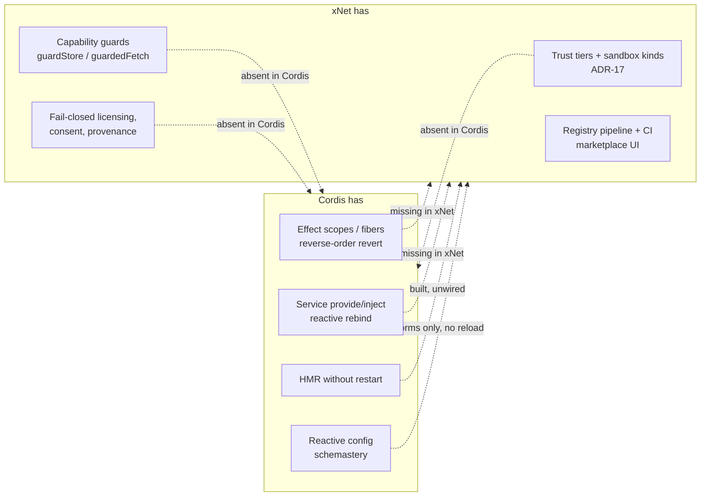
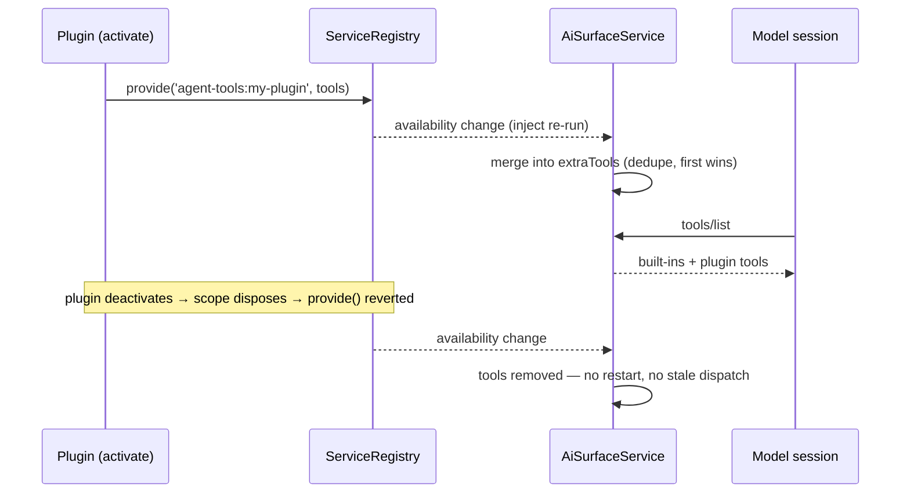

# Cordis lessons for xNet plugin composition

> [!TIP]
> **TL;DR** — Do **not** adopt Cordis as a dependency (bus factor 1, unstable
> API, in-process good-faith trust model that ADR-17 exists to refuse). Do
> import its three load-bearing ideas, which are exactly what xNet's plugin
> system is missing: <mark>effect scopes</mark> (nested, reverse-order,
> awaited disposal instead of today's flat `ctx.subscriptions` array),
> <mark>a service layer with inject semantics</mark> (plugins _provide_ and
> _consume_ named services; the container re-resolves on swap — the unwired
> `extraTools` merge point is the one-line proof we need this), and
> <mark>reactive reload</mark> (the already-built, already-tested,
> zero-caller `createWorkspacePluginHotReloader` is Cordis's HMR sitting on
> our shelf). Cordis answers "how do plugins compose"; ADR-17 answers "how
> much do we trust them." The two are orthogonal, and xNet only has the
> second.

## Problem Statement

[Cordis](https://github.com/cordiverse/cordis) — the "Meta-Framework of
Spatiotemporal Composability" (its README's phrase) extracted from the Koishi
chatbot framework — just became the most-watched plugin architecture in the
industry: DeepSeek Harness ("Everything is a Plugin.", ~181k stars, open-sourced
2026-08-13) vendors it as its plugin kernel, and a companion preprint
formalises its model. Koishi has grown **4,551 community plugins** on it
(registry.koishi.chat, measured 2026-08-21) with essentially one maintainer.

xNet's stated ambition is the same shape: "everything is a plugin" governed by
a trust fabric (ADR-17), a lift-out ladder for first-party features
([0452](./0452_[_]_HOW_FAR_TO_PLUGINIZE_THE_KERNEL_THE_SHELL_AND_THE_LIFT_OUT_LADDER.md)),
and an agent that builds plugins from inside the workspace
([0331](./0331_[x]_DEVELOPING_XNET_FROM_INSIDE_XNET_SPEC_TO_PLUGIN_LOOP.md)).
Yet `registry/community.json` is `[]`, exactly one first-party feature ships
through the plugin door end-to-end, and every plugin-contributed agent tool is
stranded behind a merge point no host passes. What does Cordis know about
plugin composition that we don't — and which parts of it are poison for a
local-first, sandboxed, CRDT-backed system?

## Executive Summary

| Question                                     | Answer                                                                                                                                                                                                                                                                                                                                   |
| -------------------------------------------- | ---------------------------------------------------------------------------------------------------------------------------------------------------------------------------------------------------------------------------------------------------------------------------------------------------------------------------------------- |
| What is Cordis, in one line?                 | A context tree where plugins are `(ctx, config)` functions whose every side effect is collected on a disposable scope, and where services are reactively injected — unload on disappear, reload on swap.                                                                                                                                 |
| Should xNet depend on it?                    | **No.** MIT-licensed but bus factor ≈ 1 (sole npm maintainer), README warns the API "may change without notice", v3→v4 renamed the entire scope layer, and its trust model is in-process good faith — the opposite of ADR-17.                                                                                                            |
| What do we take?                             | Three mechanisms: (1) effect **scopes** replacing the flat `Disposable[]`; (2) a **service registry** with `provide`/`inject` and availability semantics; (3) **reactive reload** — wire the existing workspace-plugin hot reloader and give config edits partial-reload semantics.                                                      |
| What do we already have that Cordis doesn't? | The entire trust half: provenance→tier→sandbox mapping, capability guards (`guardStore`, `guardedFetch`), fail-closed paid licensing, consent dialogs, a registry pipeline with CI. Cordis plugins run with full process privileges on good faith.                                                                                       |
| Sharpest evidence we need the service idea?  | `AiSurfaceService` has one `extraTools` merge point; all three hosts (`agent-mcp-server.ts`, `cli mcp.ts`, `AiChatPanel.tsx`) construct it without passing the argument, stranding `plugin_*`, `lab_*`, and every plugin-contributed agent tool. With resolution instead of hand-threading, all three sites are correct by construction. |
| Relationship to 0452                         | Complementary, not competing. 0452 opens the missing contribution **doors** (node types, surfaces). This doc fixes the **runtime** behind all doors: scoped disposal, service edges between plugins, reload. Both walk through `packages/plugins`.                                                                                       |

---

## Current State In The Repository

The full survey is long; this section keeps only what the comparison needs.

### What exists and is real

- **Manifest + 21 contribution kinds** — `packages/plugins/src/manifest.ts`
  (`XNetExtension`, `PluginContributions`); `ContributionRegistry` in
  `packages/plugins/src/contributions.ts` holds 22 `TypedRegistry` fields
  (`statusBar` and `frameRenderers` are runtime-only, no manifest path).
- **Lifecycle with trust gates** — `PluginRegistry`
  (`packages/plugins/src/registry.ts`): `install()` runs 9 ordered gates
  (validation → platform → duplicate → host-compat → dependencies → consent →
  fail-closed license → persist as node → activate). This half is genuinely
  ahead of Cordis, which has none of it.
- **Per-plugin context** — `createExtensionContext`
  (`packages/plugins/src/context.ts`): 21 `register*` methods, each returning
  a `Disposable`, all collected in a flat `ctx.subscriptions` array walked at
  `deactivate()`.
- **One end-to-end dogfood** — `charts-extra-plugin.ts` registering donut and
  horizontal-bar chart types into `chartTypeRegistry` and disposing cleanly.
- **The 0331 workspace-plugin runtime** —
  `packages/plugins/src/workspace-plugins/` (~1,700 lines, 7 test files):
  opaque-origin iframe host, per-file SWC build, typed postMessage protocol,
  denylist-wins store RPC, **and a hot reloader**
  (`watcher.ts: createWorkspacePluginHotReloader` — 250 ms debounce, rebuild,
  hot-swap, crash → auto-disable with last-good hash pinned). **Zero non-test
  callers.**

### What is missing, and where it bites

| Gap                           | Where                                                                                                                                                                                                         | Consequence                                                                                                                                                                                                               |
| ----------------------------- | ------------------------------------------------------------------------------------------------------------------------------------------------------------------------------------------------------------- | ------------------------------------------------------------------------------------------------------------------------------------------------------------------------------------------------------------------------- |
| No scope tree                 | `context.ts` — flat `Disposable[]`, disposed in registration order, unawaited                                                                                                                                 | A plugin cannot open a sub-scope for a feature it toggles; teardown order is accidental; async `deactivate` races the next mount (`packages/react/src/context.ts:427-457` fires deactivations without awaiting)           |
| Three disposal conventions    | `Disposable` in `plugins/src/types.ts`, a second copy in `views/src/types.ts`, bare `() => void` in `slot-registry.tsx` / `TypedRegistry.onChange`                                                            | Every consumer handles cleanup differently; composition helpers can't exist                                                                                                                                               |
| No plugin→plugin service edge | `ecosystem/dependencies.ts` resolves **versions**, never objects                                                                                                                                              | `dependencies` gates install order but grants no API access; a plugin cannot consume what another provides                                                                                                                |
| No inject semantics           | —                                                                                                                                                                                                             | A plugin needing the AI surface, a connector, or another plugin's API has no way to say so, wait for it, or be unloaded when it disappears                                                                                |
| `extraTools` never passed     | `packages/plugins/src/ai-surface/service.ts:210` merge point; omitted by `apps/electron/src/main/agent-mcp-server.ts`, `packages/cli/src/commands/mcp.ts`, `packages/workbench/src/views/AiChatPanel.tsx:215` | `plugin_*` (9 tools, 0331), `lab_*`, all connector `agentTools`, and the auto-installed `WorkspaceAgentModule`'s tools reach **no model**. `ContributionRegistry.agentTools` is written by three files and read by nobody |
| Hot reload unwired            | `workspace-plugins/watcher.ts`                                                                                                                                                                                | The only code-as-data plugin path (source stored as `PluginSourceSchema` nodes) has no host mounting it                                                                                                                   |
| `registerSchema` stub         | `context.ts:225` — empty `dispose()`, `// schemaRegistry.unregister would go here`                                                                                                                            | `contributes.schemas` is a no-op (0452 tracks the registry-side fix)                                                                                                                                                      |
| Config is static              | `first-party-catalog.ts` config forms → `PluginConfigDialog`                                                                                                                                                  | A config edit has no partial-reload path; nothing like `scope.accept(keys)` exists                                                                                                                                        |

> [!NOTE]
> The gaps are all in one layer. Trust, gating, marketplace, contribution
> _collection_ — solid. What happens _between_ activation and deactivation —
> scopes, services, reload — is where xNet is a flat, static approximation of
> what Cordis makes dynamic.

---

## External Research

### The Cordis model, precisely

Facts verified against the repo (`cordiverse/cordis`, MIT, 6,953★, created
2022-05-17), npm (latest `4.0.0-rc.8`, 2026-08-10, ~20k downloads/wk), the
v3-era README, and koishi.chat docs.

**Context tree.** `new Context()` is the root; `ctx.extend()` creates children
via the JS prototype chain plus per-context metadata. Koishi builds filtered
contexts on top (`ctx.platform('discord').user('112233')`, plus
`intersect`/`union`/`exclude`); anything registered through a filtered context
— plugins, commands, listeners — is scoped to the filter.

**Plugins as scopes.** A plugin is a function/class/`{ apply }` taking
`(ctx, config)`. `ctx.plugin(p, config)` returns a fork scope;
`fork.dispose()` reverts **every** collected effect. v4 renames the scope
machinery `Fiber` and makes effects explicit: `ctx.effect(runner)` registers a
revertible effect; disposers replay in **reverse order**; child fibers are
themselves effects on the parent, so disposing a context tears down its whole
subtree. A `dispose` event covers effects the framework can't auto-track
(the README's example: close the port you opened in `ready`). Plugins can be
**forked** — applied multiple times with per-fork config and per-fork
disposal (`export const reusable = true`).

**Services with inject semantics.** A plugin declares
`export const inject = ['database']`. The contract (v3 README, verbatim
semantics): the plugin _"will not be loaded until the service becomes
truthy"_, is _"unloaded as soon as the service changes"_, and reloaded if the
new value is truthy. Services are provided by other plugins (v4:
`ctx.provide(name, value)` returns a disposer; a `Reflect` service throws
typed errors on undeclared access — `cannot get property "X" without
inject`). `ctx.isolate(name)` splits a service per subtree, so two instances
of the same service can coexist. Swapping a service implementation
automatically bounces every dependent plugin.

**Reactive config.** `schemastery` (~89k downloads/wk — Cordis's most-adopted
piece) is a chainable schema that both validates config and auto-generates
config UIs. The loader calls `fork.update(config)`; a plugin can
`scope.accept(keys, cb)` to patch accepted keys in place instead of
restarting. Result: a config edit reloads only the plugins whose changed keys
demand it.

**HMR.** `@cordisjs/plugin-hmr` watches files with chokidar, walks the module
dependency graph, disposes the affected plugins' fibers, and re-applies them
with fresh exports — the process never restarts for plugin code changes.
(It needs Node internals via `--expose-internals`; Koishi ships the same idea
as its "watcher".)

<details>
<summary>The paper's framing: temporal and spatial composability</summary>

The companion preprint (`cordiverse/paper`, 2,610★, draft 2026-08-13, PDF
only, **no named authors** — the "DeepSeek wrote it" framing in press coverage
is unverified) names the two halves:

- **Temporal composability** — a removed component's side effects can be
  fully reverted ("revertible effects"). This is the fiber/scope machinery.
- **Spatial composability** — dependencies between components are declared
  and reactively managed ("reactive coeffects"). This is `inject`/`provide`.

The mapping to xNet: we have a weak form of the first (flat disposables) and
none of the second. The vocabulary is useful even if the paper's provenance
is murky.

</details>

### Ecosystem reality check

| Signal                   | Value                                                                                                      | Read                                               |
| ------------------------ | ---------------------------------------------------------------------------------------------------------- | -------------------------------------------------- |
| Koishi community plugins | **4,551** (registry.koishi.chat, 2026-08-21)                                                               | The model scales to real ecosystems                |
| `cordis` npm downloads   | ~20k/wk                                                                                                    | Small direct adoption outside Koishi/dsh           |
| `schemastery` downloads  | ~89k/wk                                                                                                    | The config-schema piece travels furthest           |
| DeepSeek Harness         | vendors Cordis (219 `package.json` matches: `ui-cordis`, `tool-cordis`, `cordis-host-runner`…)             | The star spike is dsh's, not organic Cordis growth |
| Maintainer               | `shigma`, sole npm publisher across cordis/koishi/schemastery                                              | Bus factor ≈ 1                                     |
| API stability            | README: API "may change without notice"; v3→v4 renamed EffectScope→Fiber, changed `isolate` signature      | Real churn, mid-rc                                 |
| Docs                     | Standalone docs site dead; deep material zh-CN; best English API guide lives in a historical README commit | High adoption friction                             |

### Criticisms that matter for us

- **Trust model**: plugins run in-process with full reach — "good faith
  rather than sandboxing" (Justin3go's dsh review, 2026-08-15). For a chatbot
  framework that's tolerable; for a workspace holding a user's life it is
  disqualifying. This is precisely the gap ADR-17 closes, and why "adopt
  Cordis" and "keep our sandbox" cannot both be true for untrusted tiers.
- **Magic**: prototype-chain contexts, Proxy interception,
  `this[Context.current]` caller tracking, TS declaration merging for typing.
  Costs readability; pre-v4, an unavailable service silently read as
  `undefined` (v4's typed reflect errors are the admission).
- **Over-engineering critique** (from dsh beta feedback): hot-reload
  composability "benefits only edge cases"; agents that couldn't drive a
  plugin correctly "just edit their own code instead". A useful caution for
  0331's agent-builds-plugins loop: the plugin API has to be _easier_ than
  forking the app, or agents will route around it.

---

## Key Findings

### 1. Contributions vs services — the two halves of a plugin system

xNet's model is VS Code's, and says so
(`packages/workbench/src/contributions.tsx`: "Containers vs items, the VS
Code model"): plugins **declare contributions into fixed host registries**.
Cordis's model is a service container: plugins **provide and consume named
capabilities**, and the container re-resolves when providers change. These
are not rivals — VS Code itself has both (contribution points _and_ an
exported-API/service layer). xNet has only the first. There is no way for
plugin B to use what plugin A provides; `dependencies` in the manifest
resolves version constraints, never objects.

### 2. Disposables without scopes

xNet has the leaf of Cordis's temporal model (everything returns a
`Disposable`; `ctx.subscriptions` auto-disposes on deactivate) and none of
the tree: no nested scopes, no reverse-order guarantee, no awaited teardown,
no fork (a plugin instantiated twice with different config), and three
inconsistent disposal conventions across packages. This is the smallest
change with the largest payoff, and it is invisible until you need it — hot
reload, per-feature toggles, and service bouncing all _require_ scoped
disposal to be correct.

### 3. The `extraTools` omission is the DI argument in one line

```text
                        ┌──────────────────────────────┐
  plugin_* (9, built)──▶│                              │
  lab_* (built)────────▶│  AiSurfaceService.extraTools │──▶ tools/list, dispatch
  connector agentTools─▶│  (one merge point, service.ts│
  WorkspaceAgentModule─▶│   line 210)                  │
                        └──────────────▲───────────────┘
                                       │ never passed by:
                  agent-mcp-server.ts ─┤  (Electron bridge)
                  cli mcp.ts ──────────┤  (xnet mcp serve)
                  AiChatPanel.tsx ─────┘  (in-app assistant)
```

One merge point, three construction sites, three independent omissions, and
every downstream tool family stranded — including the auto-installed
`WorkspaceAgentModule`, whose entire design is tools driving the shell. With
hand-threading, every new host must remember every provider. With a service
registry, `AiSurfaceService` _resolves_ tool providers at construction and
re-resolves when a plugin activates or deactivates; all three sites become
correct by construction, and a newly activated plugin's tools appear in a
running session without restart — which is Cordis's `inject` reload semantics,
needed here for a concrete shipped feature.

### 4. Hot reload exists here and is disconnected

`createWorkspacePluginHotReloader` already does what Cordis HMR does —
rebuild on change, hot-swap the frame, crash → auto-disable with the
last-good hash pinned. The reason it's unwired is structural, not accidental:
Model A plugins (in-bundle, host realm) can't reload because their code isn't
data, and Model C (source-as-`PluginSourceSchema`-node, which can) has no UI
host. Wiring it is a 0452-ladder item (rung 4 prerequisite: "wire the
workspace-plugin tools before rung 4") — this doc adds the _why now_: it is
the temporal-composability half we already paid for.

### 5. What Cordis validates about paths we already chose

- **Registry-as-repo scales.** Koishi's 4,551 plugins ride an npm-scan
  registry with marketplace metadata in `package.json` — structurally our
  `registry/` + CI pipeline (0201, 0374) at larger scale. The pipeline shape
  is right; our zero community plugins is a demand/capability problem, not an
  infrastructure one.
- **Schema-driven config UIs.** schemastery's config forms are our
  `first-party-catalog.ts` config specs + `PluginConfigDialog`. Same idea;
  ours lacks the reload wire (a config save should `update(config)` the
  plugin, not require toggle-off-on).
- **Everything-is-a-plugin needs a non-plugin referee.** Cordis's kernel
  (Context/Fiber/Registry) is not itself a plugin. 0452's four exemptions
  (kernel, shell, plugin system, protocol schemas) are the same line drawn
  for the same reason.



---

## Options And Tradeoffs

### Option A — Adopt Cordis as a dependency

Replace `PluginRegistry`/`ExtensionContext` internals with `cordis` contexts;
xNet plugins become Cordis plugins.

- ✅ Battle-tested scope/service machinery for free; HMR for free.
- ❌ **Trust mismatch is fatal**: Cordis composes objects in one realm.
  xNet's `user` and `marketplace` tiers run behind an iframe/SES boundary
  where only JSON-pure RPC crosses (`workspace-plugins/protocol.ts`). A
  Cordis service edge cannot cross that boundary; we'd be adopting the
  framework precisely where it can't reach.
- ❌ Bus factor 1, API mid-rc and churning (EffectScope→Fiber), docs
  effectively zh-CN only.
- ❌ Proxy/prototype/declaration-merging magic contradicts the repo's
  fail-loud, grep-able style ("a silently absent host is indistinguishable
  from a broken shell" — `workbench/src/host.ts`).

### Option B — Import the mechanisms, not the framework ⭐

Build three small, typed, boring pieces inside `packages/plugins`, behind the
seams that already exist: an effect-scope primitive, a service registry with
inject semantics, and the reload wiring. Host-realm (first-party) plugins get
direct service objects; sandboxed tiers get the same contract tunneled over
the existing RPC — the service _names and availability semantics_ are shared,
the transport differs by trust tier. This keeps ADR-17 as the outer law and
Cordis's composition as the inner mechanics.

- ✅ Fixes the `extraTools` class of bug structurally; unblocks agent tools
  (0331/0447), lab tools, connector tools in one move.
- ✅ Unifies three disposal conventions; makes hot reload and per-feature
  toggles correct instead of racy.
- ✅ Zero new dependencies; every piece is ~100–300 lines with tests.
- ❌ Real design work (service availability across async activation; the
  RPC-tunneled variant for sandboxed tiers can ship later).

### Option C — Status quo (VS Code contributions are enough)

- ✅ No work.
- ❌ The `extraTools` gap stays a whack-a-mole: every future host of every
  future service repeats the omission. 0452's ladder lands on a runtime with
  unordered teardown and no plugin→plugin edges, and 0331's loop stays
  shelf-ware.

> [!IMPORTANT]
> This proposes no revenue lane, so Charter §6's three tests are not in
> play. It changes no wire format and no public manifest field — `inject`
> and `provides` enter the manifest as _optional_ additions, which is why the
> door is two-way.

---

## Recommendation

**Option B**, in three steps ordered so each one ships value alone, aligned
with 0452's ladder (its step 1 registry work and this doc's step 2 service
work both live in `packages/plugins/src/`):

1. **Effect scopes** (`packages/plugins/src/scope.ts`). One `EffectScope`
   class: `use(disposable)`, `child()`, `dispose()` — reverse-order, awaited,
   idempotent, re-entrancy-safe. `ExtensionContext.subscriptions` becomes a
   scope; `PluginRegistry.deactivate` awaits it;
   `packages/react/src/context.ts` awaits teardown before remount. Adopt one
   `Disposable` type repo-wide (`() => void | Promise<void>` accepted at the
   boundary, normalized inside).

2. **Service registry with inject semantics**
   (`packages/plugins/src/services.ts`). `provide(name, value): Disposable`
   and `inject(names, (services) => scopeBody)` where the body runs when all
   names are available, is disposed when any disappears, and re-runs on swap
   — Cordis's contract, minus proxies: explicit registration, typed lookup,
   loud `ServiceUnavailableError`. First consumer: `AiSurfaceService`
   resolves `agent-tools` providers from the registry, and
   `ContributionRegistry.agentTools` gets its first reader. Wire all three
   hosts through it; delete the three hand-threaded omissions. Manifest gains
   optional `provides?: string[]` / `inject?: string[]` (validated, unlike
   most contribution kinds today).

3. **Reload wiring.** Mount the 0331 workspace-plugin host + hot reloader in
   the workbench dev surface (the 0452 gate: "the honesty test can actually
   be run by an agent"); route `PluginConfigDialog` saves through a
   `registry.update(pluginId, config)` that bounces only the plugin's scope
   (partial-accept à la `scope.accept` can come later; full bounce is
   correct-if-slower first).



Explicitly **not** recommended: forked/multi-instance plugins (no current
need; revisit if a connector wants two accounts of one service), context
filtering (Koishi's session selectors have no xNet analogue), schemastery
(our config specs already exist), and any Proxy-based context sugar.

## Example Code

```ts
// packages/plugins/src/scope.ts — the temporal half (sketch)
export type Effect = { dispose(): void | Promise<void> } | (() => void | Promise<void>)

export class EffectScope {
  private effects: Effect[] = []
  private children = new Set<EffectScope>()
  private state: 'active' | 'disposing' | 'disposed' = 'active'

  use<T extends Effect>(effect: T): T {
    if (this.state !== 'active') throw new ScopeDisposedError()
    this.effects.push(effect)
    return effect
  }

  child(): EffectScope {
    const scope = new EffectScope()
    this.children.add(scope)
    this.use(() => scope.dispose())
    return scope
  }

  async dispose(): Promise<void> {
    if (this.state !== 'active') return
    this.state = 'disposing'
    // reverse order — later effects may depend on earlier ones
    for (const effect of this.effects.reverse()) {
      try {
        await (typeof effect === 'function' ? effect() : effect.dispose())
      } catch (error) {
        // loud, but one failed disposer must not strand the rest
        console.error('[plugins] effect dispose failed', error)
      }
    }
    this.effects = []
    this.state = 'disposed'
  }
}
```

```ts
// packages/plugins/src/services.ts — the spatial half (sketch)
export class ServiceRegistry {
  provide<T>(name: string, value: T): Disposable
  get<T>(name: string): T // throws ServiceUnavailableError — never undefined
  /** body runs when all names resolve; its scope is disposed when any
   *  provider goes away; re-runs if a provider is swapped. */
  inject(names: string[], body: (scope: EffectScope) => void | Promise<void>): Disposable
}

// The first consumer — AiSurfaceService resolves instead of being handed:
const surface = createAiSurfaceService({ store, schemas, retrieveContext, services })
// inside: services.inject(['agent-tools'], (scope) => this.mergeExtraTools(...))
// — agent-mcp-server.ts, cli mcp.ts, AiChatPanel.tsx no longer each
//   need to remember; a plugin activating mid-session adds its tools live.
```

## Risks And Open Questions

- **Scope creep into a framework.** The failure mode is rebuilding Cordis.
  Guard: each piece needs a named first consumer before it merges (scopes →
  registry teardown; services → `extraTools`; reload → 0331 host). No
  speculative features.
- **Service edges across the sandbox boundary.** A `user`-tier iframe plugin
  cannot receive a live object. The contract: sandboxed plugins see services
  only as RPC-tunneled, JSON-pure facades, and _providing_ a service from a
  sandboxed plugin is out of scope until a real case exists. The registry
  must refuse (loudly) to hand a host-realm object across the boundary —
  this is where ADR-17's line must hold against convenience.
- **Availability semantics vs async activation.** `PluginRegistry.activate`
  is async; inject bodies must not observe half-activated providers. Cordis
  gates non-immediate services on `ready`; we need an equivalent rule
  (provide only at the end of `activate`, enforced or linted).
- **Unload semantics for live sessions.** When a provider disappears
  mid-conversation, in-flight tool calls need a defined failure (typed error
  to the model, not a hang). The scope model makes this expressible; it
  still has to be decided.
- **Does the agent actually want plugins?** dsh's beta feedback (agents
  editing their own code rather than driving plugins) is a live risk for
  0331's loop. Mitigation is DX, not architecture: the `plugin_*` tools must
  be cheaper for an agent than a source edit, and the preview/feedback loop
  (`preview.ts`) is the leverage.
- **Open question:** should `FeatureModule.capabilities` and
  `PluginPermissions` unify while we're in the file? (Today they're bridged
  by an untyped cast at `registry.ts:542`.) Probably yes, but it's severable
  and shouldn't ride this change.

## Implementation Checklist

**Status:** ░░░░░░░░░░ 0/10 items

- [x] `EffectScope` in `packages/plugins/src/scope.ts` with reverse-order,
      awaited, idempotent disposal + tests (incl. re-entrancy and a failing
      disposer not stranding the rest)
- [x] Unify the `Disposable` conventions: one exported type in
      `@xnetjs/plugins` (async-tolerant), `packages/views` re-exports it.
      _(Implementation note: `slot-registry`/`TypedRegistry.onChange` keep
      their bare-function returns — ~10 call sites invoke them directly, and
      `EffectScope.use` accepts both forms, which is the unification that
      actually enables composition.)_
- [x] `ExtensionContext.subscriptions` backed by an `EffectScope`;
      `PluginRegistry.deactivate` awaits scope disposal;
      `packages/react/src/context.ts` awaits teardown before remount
- [x] `ServiceRegistry` in `packages/plugins/src/services.ts` —
      `provide`/`get`/`inject`, loud `ServiceUnavailableError`, availability
      re-resolution on provide/dispose, + tests
- [x] Optional `provides` / `inject` manifest fields with real validation
      (unlike the 14 unvalidated contribution kinds — don't add a 15th)
- [x] `AiSurfaceService` resolves agent-tool providers from the registry;
      `agentToolsAsExtraTools` bridge registered as a provider reading
      `ContributionRegistry.agentTools` (its first reader)
- [x] Wire all three hosts (`apps/electron/src/main/agent-mcp-server.ts`,
      `packages/cli/src/commands/mcp.ts`,
      `packages/workbench/src/views/AiChatPanel.tsx`) through the resolved
      surface; verify `plugin_*` and `WorkspaceAgentModule` tools reach a
      live session on each
- [x] Register `createWorkspacePluginAgentTools()` output as an
      `agent-tools` provider (closes the 0331/0447 "built but unwired" gap)
- [x] Mount the workspace-plugin frame host + `createWorkspacePluginHotReloader`
      behind a dev-surface entry point (coordinate with 0452 rung
      prerequisites)
- [x] `PluginRegistry.update(pluginId, config)`: full scope bounce on config
      save from `PluginConfigDialog`

## Validation Checklist

- [x] Unit: disposing a parent scope disposes children first-in-reverse and
      awaits async disposers; a throwing disposer doesn't strand later ones
- [x] Unit: `inject` body re-runs on provider swap and is disposed when a
      provider goes away; `get` on a missing service throws typed
- [x] Integration: activate a plugin contributing `agentTools` mid-session →
      `tools/list` over the MCP server includes it without restart;
      deactivate → it disappears and an in-flight call fails typed
- [ ] Integration: all three hosts pass the same test above (no
      per-host omission possible — the test constructs each host)
- [ ] E2E-ish: edit a `PluginSource` node → hot reloader rebuilds and swaps
      the frame; a crashing build auto-disables with last-good pinned
      (existing `workspace-plugins-watcher.test.ts` promoted to a wired host)
- [x] `pnpm build && pnpm typecheck && pnpm test` green; api-report updated
      for `@xnetjs/plugins` new exports; changeset written

## References

- [cordiverse/cordis](https://github.com/cordiverse/cordis) — repo; v3 README
  (historical commit `261ee6be`) has the best English API guide
- [cordiverse/paper](https://github.com/cordiverse/paper) — "A Programming
  Paradigm for Spatiotemporal Composability" (draft 2026-08-13; no named
  authors)
- [Koishi plugin docs](https://koishi.chat/en-US/guide/plugin/) — plugin,
  [service](https://koishi.chat/en-US/guide/plugin/service.html), and
  [filter](https://koishi.chat/en-US/guide/plugin/filter.html) guides
- [registry.koishi.chat/index.json](https://registry.koishi.chat/index.json)
  — 4,551 plugins (2026-08-21)
- [DeepSeek Harness cordis primer](https://deepseek-harness.github.io/deepseek-harness/reference/cordis-primer)
- [Justin3go's dsh review](https://justin3go.com/en/posts/2026/08/15-deepseek-harness-review)
- Repo: [0452](./0452_[_]_HOW_FAR_TO_PLUGINIZE_THE_KERNEL_THE_SHELL_AND_THE_LIFT_OUT_LADDER.md)
  (lift-out ladder), [0331](./0331_[x]_DEVELOPING_XNET_FROM_INSIDE_XNET_SPEC_TO_PLUGIN_LOOP.md)
  (workspace-plugin runtime), [0206](./0206_[_]_WHY_SO_FEW_FIRST_PARTY_PLUGINS.md)
  (lift-out test), [0205](./0205_[_]_DECOMPOSING_THE_APP_INTO_PLUGINS.md),
  [0194](./0194_[_]_EXTENSIBILITY_FABRIC_PLUGINS_LABS_AI_EDITOR.md) (unify the
  four extensibility systems), [0397](./0397_[_]_AGENT_NATIVE_FRAMEWORK_LESSONS.md)
  (prior framework-comparison doc), ADR-17 in
  `site/src/content/docs/docs/architecture/decisions.mdx`
