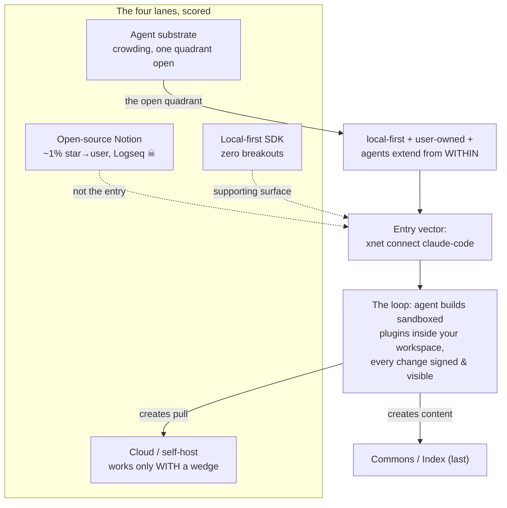
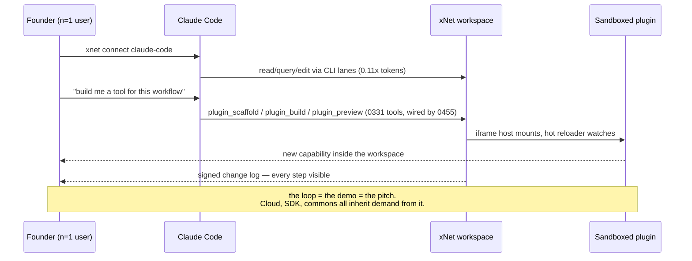

# Entry vector — the agent door first

> [!TIP]
> **TL;DR** — Pick <mark>one door</mark>: **the agent door**. The entry
> vector is `xnet connect claude-code` — "give your coding agent a workspace
> you own" — because it is the only surface in the repo that is already a
> single command, already on npm, already differentiated (0.11x MCP token
> benchmark), and sits in the one quadrant of the agent-workspace lane
> (local-first + agents extend the workspace _from within_) that Notion,
> Cowork, Buzz, and DeepSeek Harness have not taken. "Self-improving xNet"
> is not pie in the sky — 0331 already built the runtime and 0455 showed the
> loop is roughly three wiring PRs from closed. The open-source-Notion lane
> (~1% star→user conversion, Logseq dead of a rewrite) and the local-first
> SDK lane (zero breakouts) are not entry vectors; cloud becomes one only
> after something pulls people toward it. This doc adds **no new program**
> — it sequences four existing checklists (0335 → 0455 → 0447 → positioning)
> into one focus stack and names what is explicitly parked.

## Problem Statement

The founder's own words, condensed: _I want xNet to be self-improving —
agents integrate seamlessly and extend it from within — but that feels far
away. I want to ship something people actually use, but I don't know if
that's an open-source Notion, the framework/React hooks, xNet Cloud and easy
self-hosting, or the plugin substrate. I want Lego bricks: build once, every
developer and user after that is more productive. What's the first entry
vector?_

This is not a new question for the repo. `docs/ROADMAP.md` (July 2026)
already bet on three pillars in dependency order — AI daily driver, then
effortless cloud, then the commons — gated on the founder's own daily use.
The overwhelm is real anyway, for three reasons this doc addresses head-on:

1. **The site still offers every door at once.** The hero renders App / SDK /
   Protocol as three equal doors (`site/src/components/sections/Hero.astro`);
   `GetStarted.astro` lists three unranked paths. A stranger cannot tell what
   xNet is _first_.
2. **The "self-improving" goal feels distant** — but the feeling is
   miscalibrated. The audit in
   [0455](./0455_[_]_CORDIS_LESSONS_FOR_XNET_PLUGIN_COMPOSITION.md) found the
   agent-builds-plugins runtime (0331) fully built and tested with zero
   callers, stranded behind one unpassed constructor argument.
3. **Intent accumulates without closing.**
   [0421](./0421_[-]_FAST_WHAT_COLLISONS_LIST_MEASURES_AND_WHAT_XNET_LACKS.md)
   measured it: +85 unstarted explorations/month, 524 docs, and "xNet's
   problem is not that work moves slowly, it is that intent accumulates
   without ever being closed" (0421's own words). The cure for overwhelm is
   not another program; it is sequencing what exists.

## Executive Summary

| Question                                 | Answer                                                                                                                                                                                                                                                                                                                                                                                                                                    |
| ---------------------------------------- | ----------------------------------------------------------------------------------------------------------------------------------------------------------------------------------------------------------------------------------------------------------------------------------------------------------------------------------------------------------------------------------------------------------------------------------------- |
| What is the entry vector?                | **The agent door**: `xnet connect claude-code` — one command that gives a coding agent a workspace the user owns. Everything else (SDK, cloud, app) becomes a _second_ step people take after that door works for them.                                                                                                                                                                                                                   |
| Is "self-improving xNet" pie in the sky? | No — it's mislabeled near-done work. The 0331 iframe plugin runtime + hot reloader exist with 7 test files and zero callers; 0455's checklist closes the loop in ~3 PRs (service registry → `extraTools` wired → `plugin_*` tools live → host mounted).                                                                                                                                                                                   |
| Why not open-source Notion?              | The lane converts stars to daily users at roughly 1% (AppFlowy ~70k★ / ~46k MAU), its most famous member (Logseq) stalled fatally mid-rewrite, and winners there won by _narrowing_ (Outline = team wiki). Head-on Notion marketing is the weakest use of a solo founder's quarter.                                                                                                                                                       |
| Why not the SDK/framework?               | No local-first framework has broken out (Electric pivoted to Postgres reads, Liveblocks open-sourced defensively, Jazz still pre-traction); even sympathetic engineers warn "local-first… is not a default." Keep the SDK shipped and honest; don't lead with it.                                                                                                                                                                         |
| Why not cloud first?                     | Supabase/n8n prove self-host wedges work — but each rode a one-sentence job people already wanted. Cloud amplifies demand; it doesn't create it. xNet Cloud's deploy workflow is literally inert today (`deploy-cloud.yml`: "INERT BY DEFAULT"). Turn it on when the agent door creates pull.                                                                                                                                             |
| Is the agent lane still open?            | The lane is crowding (Notion agent hub May 2026, Anthropic Cowork Feb 2026, Block's Buzz July 2026, DeepSeek Harness Aug 2026) — but the specific quadrant **local-first, user-owned substrate where agents extend the workspace from within** is unclaimed. Buzz is the nearest neighbor (0416's thesis competitor, confirmed) and it is Nostr-relay-centric, not local-first, with a harness-out rather than workspace-in plugin story. |
| What about the Lego bricks?              | The bricks the founder wants to build ARE pillar 1 — but the cold-start evidence (VS Code, Obsidian, Raycast vs ChatGPT plugins) says ecosystems thrive only on an existing devoted user base. At n≈1, that user base is **the founder plus their agents**. Build the bricks your own agents snap together this quarter; the community comes after the demo is undeniable.                                                                |
| What closes this doc?                    | The focus stack shipped (checklist below) and the roadmap's own gate: consecutive weeks of the founder's real work done inside xNet.                                                                                                                                                                                                                                                                                                      |

---

## Current State In The Repository

The full shippability audit is summarized here; the load-bearing facts each
carry a path.

### What is genuinely shippable today

| Surface                           | Evidence                                                                                                                                                                                                    | Verdict                                                        |
| --------------------------------- | ----------------------------------------------------------------------------------------------------------------------------------------------------------------------------------------------------------- | -------------------------------------------------------------- |
| `xnet connect claude-code\|codex` | `packages/cli/src/commands/connect.ts` — idempotent, fenced CLAUDE.md edits, MCP registration, `xnet doctor --agent-access` self-check; read-only by default, `--writes` opt-in; `@xnetjs/cli@0.4.0` on npm | ✅ **The one single-command entry vector that already exists** |
| Agent lanes                       | `site/src/content/docs/docs/guides/agent-interfaces.mdx` — CLI verbs → vault checkout → MCP fallback; benchmark: **0.11x the tokens of an MCP toolset at equal success on 15 tasks**                        | ✅ Differentiated and measured                                 |
| Web demo                          | `apps/web/src/boot/` + `/app?demo=1` — 2 steps, ~10–20 s cold start (SQLite WASM + OPFS), auto-seeded, never overwrites user content (`demo-seed.ts`)                                                       | ✅ Good                                                        |
| npm data layer                    | 18 public packages at 3.0.0 (`core, data, react, sync, sqlite, …`), OIDC + provenance releases (`.github/workflows/npm-release.yml`)                                                                        | ✅ Real                                                        |
| React SDK standalone              | `examples/minimal-app/` — outside the workspace, works against published npm, syncs via `wss://hub.xnet.fyi`                                                                                                | ✅ Under-marketed                                              |
| Self-host hub                     | `packages/hub/Dockerfile`, `docker-compose.hub.yml`, root `railway.toml`, multi-arch ghcr image                                                                                                             | ✅ Strongest distribution story                                |

### What is not, despite appearances

| Surface          | Evidence                                                                                                                                                                                                                                                                                                                                                           | Verdict                                                 |
| ---------------- | ------------------------------------------------------------------------------------------------------------------------------------------------------------------------------------------------------------------------------------------------------------------------------------------------------------------------------------------------------------------ | ------------------------------------------------------- |
| xNet Cloud       | `apps/cloud/src/server.ts` is a real Hono control plane with ~30 test files — but `.github/workflows/deploy-cloud.yml` is **"INERT BY DEFAULT"**, defaults are in-memory providers, billing gateway 503s unset, and `site/src/data/status.json` is a two-month-stale snapshot while `site/src/data/pricing.ts` deep-links every CTA to `cloud.xnet.fyi/auth/start` | ❌ Largest claim/state gap in the repo                  |
| UI layer on npm  | `ui, editor, views, canvas, workbench, dashboard, charts` all private/changeset-ignored                                                                                                                                                                                                                                                                            | ❌ Devs can't install the components in the screenshots |
| Mobile           | Expo Go demo only; `site/src/pages/mobile.astro` says so honestly                                                                                                                                                                                                                                                                                                  | ❌ Deliberately deferred (roadmap)                      |
| Traction signal  | `site/src/data/metrics.json` has `"sample": true`; `cloud-metrics.yml` inert; no waitlist, no testimonials, no user count anywhere; telemetry charter-banned                                                                                                                                                                                                       | — Zero external signal exists, by design and by stage   |
| Agent tools loop | `AiSurfaceService.extraTools` never passed by any of the three hosts; `plugin_*` (9 tools), `lab_*`, `WorkspaceAgentModule` tools all stranded (0455)                                                                                                                                                                                                              | 🚧 Built, unwired                                       |
| npm-facing story | `packages/cli/README.md` still describes schema-migration tooling; **does not mention `connect`, `checkout`, `commit`, or `mcp`**                                                                                                                                                                                                                                  | 🚧 The best feature is unmarketed                       |

> [!WARNING]
> One real hazard rides the current download page:
> `apps/electron/src/renderer/main.tsx:181` still defines `makeTestKey`
> (deterministic, source-derivable signing key; "DO NOT use in production!")
> and line 887 still calls it, while `secure-seed.ts` sits uncalled. This is
> release-blocker #1 from the
> [0335 audit](./0335_[_]_RELEASE_READINESS_AUDIT_WHAT_STANDS_BETWEEN_XNET_AND_A_WELL_RECEIVED_LAUNCH.md),
> unfixed, on a binary `site/src/pages/download.astro` distributes today. A
> product whose pitch is _you own your keys_ cannot lead with a key any
> reader of the repo can reconstruct. It is first in the focus stack for
> that reason.

### What the roadmap already decided

`docs/ROADMAP.md` (July 2026): the bet is _"deep AI integration with total
visibility, on top of a malleable, sandboxed workspace"_ — three assets
nobody else has (signed change log per node, workspace-as-Lego, plugins as
sandboxed xNet artifacts). Pillar order: AI daily driver → effortless cloud
→ commons. Principle 5: **"Dogfood is the metric"** — the gate is
consecutive weeks of the author's real work inside xNet. Deliberately
ignored: verticals, mobile parity, OS-level, marketplace-scale distribution.

This exploration's job is to test that bet against August 2026 evidence and
convert it into a single entry vector with a closable checklist. Spoiler:
the bet survives, strengthened.

---

## External Research

Full sourcing in the research notes; the decision-relevant findings:

### Lane 1 — "Open-source Notion": stars ≠ users

- AppFlowy: ~70k stars, **~46k MAU** per third-party trackers (~0.66 MAU per
  star). AFFiNE: ~60k stars, and its growth team publishes literal
  how-to-get-stars playbooks — stars are a marketing KPI there, not a user
  metric. Anytype: ~$13.5M raised, niche.
- **Logseq is the cautionary tale**: a database rewrite begun in 2022
  consumed the project; last stable release April 2024; by 2026 the
  community writes migration guides away from it.
- The lane's survivors narrowed: Outline won "team wiki with Docker deploy,"
  not "all of Notion."

### Lane 2 — Local-first frameworks: no breakout, ever

- npm reality (2026): Convex ~100k weekly downloads (and it sells a
  _backend_, not local-first), InstantDB ~20k, ElectricSQL ~15k after
  pivoting to narrow Postgres read-path sync. Liveblocks open-sourced its
  engine in Feb 2026 — a defensive move. Jazz remains pre-traction.
- The movement's own engineers say it: local-first "is not a default"
  (Supabase engineer critique of teams adopting sync engines for 50-user
  apps). Linear sold the _pattern_, not any framework — and built in-house.

### Lane 3 — Self-host wedges: naming is the multiplier

- Supabase went **8 → 800 hosted databases in three days** by renaming
  itself "the open-source Firebase alternative" — same product. Now $170M
  ARR / $10.5B (June 2026), lifted by AI-coding demand. n8n: $5.2B after SAP
  (May 2026) as the default self-hosted agent-workflow layer. Cal.com rode
  "open-source Calendly" — then went closed-source April 2026.
- The pattern: a one-sentence wedge naming a job people already want, plus a
  one-click deploy. The deploy xNet has (`railway.toml`, ghcr image); the
  sentence it doesn't.

### Lane 4 — The agent-workspace lane: crowding, with one quadrant open

- **Notion** turned its workspace into "a hub for AI agents" (developer
  platform, May 13 2026) — top-down, cloud, 100M users. **Anthropic Cowork**
  (Feb 2026): enterprise agent plugins/marketplaces. **Block's Buzz**
  (July 21 2026, Apache 2.0, ~15–25k stars in weeks): self-hostable
  workspace where agents are full members with cryptographic identity —
  xNet's quadrant neighbor and 0416's predicted thesis competitor, **but**
  Nostr-relay-centric (not local-first CRDT) and harness-out (ACP drives
  Goose/Codex/Claude Code at the workspace) rather than workspace-in
  (agents building sandboxed plugins _inside_ it). **DeepSeek Harness**
  (Aug 2026): "everything is a plugin," commoditizing plugin architecture
  for harnesses — a harness, not a workspace (and per ADR-29 / 0416, xNet
  is deliberately not a harness).
- Open as of today: **local-first, user-owned data as the agent substrate**
  and **the agent extending the workspace by writing sandboxed plugins into
  it**. Nobody has shipped that loop as a product.

### The plugin cold-start table

| Platform        | Users first?                | Plugin launch gap | Outcome                                                  |
| --------------- | --------------------------- | ----------------- | -------------------------------------------------------- |
| VS Code         | Preview Apr 2015            | +7 mo             | 500k MAU + 1,000 extensions at 1.0                       |
| Obsidian        | May 2020, small rabid base  | +~6 mo            | 6.8k plugins, 120M downloads, ~1.5M MAU                  |
| Raycast         | Oct 2020                    | +13 mo            | 100+ community extensions in a month                     |
| Figma           | 2016, $25M revenue first    | +3 yr             | Plugins became the PLG flywheel                          |
| ChatGPT plugins | **Plugins were the launch** | 0                 | **Killed Apr 2024** — "most users never enabled plugins" |

> [!IMPORTANT]
> The ecosystem the founder wants ("once I build it, every developer after
> me is more productive") historically only ignites on top of an existing
> devoted user base — even a tiny one. The corollary is not "abandon the
> plugin model"; it is **build the plugin loop for the user base you already
> have: yourself and your agents.** That is also exactly what the roadmap's
> dogfood gate demands. DeepSeek Harness is the apparent counterexample
> (plugins-first, exploding) — but its users _are_ developers and the plugin
> _is_ the product, which is precisely the agent-door framing, not the
> marketplace framing.

### Solo-founder focus wisdom, the two load-bearing points

- Paul Graham, _Do Things That Don't Scale_: recruit users manually; build
  for one user at a time; growth rate on a tiny base beats a launch.
- Nadia Eghbal, _Working in Public_: for a solo maintainer, a big undirected
  community is a **cost**; the failure mode is attention-consuming
  low-value participation, not obscurity. Optimize for users, not
  contributors — which cuts against investing in marketplace/community
  mechanics before demand exists.

---

## Key Findings

1. **The decision was already made; the evidence now confirms it.** July's
   pillar order (daily driver → cloud → commons) matches what the lane
   research independently concludes: product-with-devoted-users before
   ecosystem, demand before cloud, content before commons. The overwhelm is
   a positioning and sequencing problem, not a strategy vacuum.

2. **The entry vector already exists and is unmarketed.** `xnet connect
claude-code` is one command, on npm, benchmarked, differentiated, safe by
   default (read-only until `--writes`), and aligned with every current
   trend (agents everywhere, MCP fatigue, token cost pressure). Its own
   README doesn't mention it. The Supabase lesson says fixing _that_ — the
   sentence and the door — is the highest-leverage cheap work in the repo.

3. **"Self-improving xNet" is three PRs away, not a moonshot.** The
   pie-in-the-sky feeling comes from mislabeling: 0331 built the sandboxed
   plugin runtime (iframe host, builder, store RPC, hot reloader — 7 test
   files); 0455 diagnosed the single missing wire (`extraTools` never
   passed) and wrote the checklist (effect scopes → service registry →
   wire three hosts → mount the dev surface). Hot module reloading isn't
   the far future — it's the shelf.

4. **The Lego-brick instinct is right; the audience is wrong-sized.** Bricks
   compound only when someone is building. This quarter the builders are the
   founder and their agents. Every brick should be judged by one test: _does
   it make my own agent measurably better at doing my real work inside xNet
   this week?_ That test kills marketplace mechanics, community
   infrastructure, and SDK marketing for now — and green-lights exactly the
   0455/0447 wiring.

5. **Buzz's existence is clarifying, not threatening.** It validates the
   quadrant (someone at Block believed enough to ship it) and leaves xNet's
   two differentiators intact: local-first CRDT ownership (Buzz is
   relay-centric) and the in-workspace plugin loop with a signed audit
   trail (Buzz drives external harnesses). But it moves faster than a solo
   founder on breadth — which argues for depth on the loop no one else has,
   not breadth-matching.

6. **One honest-to-goodness blocker gates all marketing:** the deterministic
   Electron signing key (0335 #1). "Own your keys" cannot be the pitch while
   the shipped desktop key is derivable from source.

---

## Options And Tradeoffs

### Option A — Open-source Notion: market the app to end users

Polish the web/desktop app, launch on HN/Product Hunt as the local-first
Notion alternative.

- ✅ The demo is genuinely good (2 steps, auto-seeded); the lane has proven
  _star_ demand.
- ❌ ~1% star→daily-user conversion; crowded (AppFlowy, AFFiNE, Anytype all
  better-funded); a solo founder competing on end-user polish against teams
  loses on breadth; and stars would flood a solo maintainer with exactly the
  low-value participation Eghbal warns about.
- ❌ Desktop can't be marketed at all until the 0335 key blocker is fixed.

### Option B — The framework: market the React SDK

Lead with `@xnetjs/react`, publish the UI packages, build `create-xnet`.

- ✅ `examples/minimal-app` is real; hooks are stable at 3.0.0.
- ❌ The lane has produced zero breakouts in five years; the UI layer is
  private so the differentiating half isn't installable; "local-first
  framework" is an architecture pitch, and architecture pitches don't
  convert (Electric's pivot is the proof).

### Option C — Cloud first: finish and launch xNet Cloud

Turn on `deploy-cloud.yml`, swap in real providers, launch pricing.

- ✅ The code is closer to done than it looks; Supabase/n8n prove the
  self-host+cloud model.
- ❌ Wrong order: every self-host winner rode existing demand for a named
  job. Standing up billing/provisioning/support for zero pulled users is
  pure operational drag on a solo founder. Cloud is pillar 2 for a reason —
  _"cloud = amplifier not landlord"_ and amplifiers need a signal.

### Option D — The agent door ⭐

One entry vector: **connect your coding agent to a workspace you own.**
Close the self-improving loop for an audience of one (founder + agents),
fix the key blocker, then say one sentence loudly.

- ✅ Ships this quarter from existing checklists (0335, 0455, 0447); the
  only lane quadrant still open; the only surface already reduced to one
  command; matches the dogfood gate exactly; produces the demo no one else
  can record (agent builds a sandboxed plugin inside the workspace, every
  change signed, hot-reloaded live).
- ✅ Pulls the other lanes behind it: agent users need sync → cloud demand;
  agent-built plugins need publishing → commons content; devs who see the
  loop want the SDK.
- ❌ n=1 risk: the gate is subjective (the founder's own weeks-of-use) and
  there is deliberately no telemetry to contradict self-report. Mitigation:
  the validation checklist requires at least one outside person completing
  the flow, recruited manually, PG-style.
- ❌ Lane risk: Notion/Buzz could ship the in-workspace loop. Watch, don't
  match — depth on ownership + visibility is the moat they'd have to
  rebuild their foundations to copy.

### Option E — Status quo: keep all three doors open

- ✅ No decision required.
- ❌ This _is_ the overwhelm. Three unranked doors on the hero, a stale CLI
  README, an inert cloud, and +85 unstarted docs/month is what "no entry
  vector" looks like from the inside.

> [!NOTE]
> No new revenue lane is proposed (existing cloud pricing stands), so the
> Charter §6 ground-rent tests are not triggered. The focus choice is
> two-way: if the quarter disproves the agent door, options A–C remain
> exactly where they are, minus nothing.

---

## Recommendation

**Option D — the agent door, as a strict sequence.** The quarter's rule:
every week's work must serve the sentence _"point your coding agent at a
workspace you own, and watch it build you tools inside it."_

**The focus stack** (order matters; each unblocks the next):

1. **Safety before speech** — fix 0335 blocker #1: Electron boots on
   `secure-seed.ts` (safeStorage-backed), `makeTestKey` dies or becomes
   test-only. Nothing gets marketed while the key story is false.
2. **Close the loop** — execute the 0455 checklist (effect scopes → service
   registry → `extraTools` wired in all three hosts → `plugin_*` +
   `WorkspaceAgentModule` tools live → workspace-plugin host and hot
   reloader mounted behind a dev surface). This is 0447's "wire the loop,"
   now with a mechanism-level plan. Exit criterion: _from a Claude Code
   session, an agent scaffolds, previews, and installs a sandboxed plugin
   into the founder's real workspace, and the change log shows every step._
3. **Dogfood ruthlessly** — the roadmap gate, made legible: a running
   dogfood ledger (a page _in xNet_) logging each week the founder's real
   work happened inside it, and what forced a fallback to other tools. Each
   fallback is the next week's highest-priority fix. This is the
   self-improvement flywheel at n=1 — the system improving because its user
   lives in it, before any HMR mysticism.
4. **Say one sentence, everywhere** — reposition around the door:
   `packages/cli/README.md` rewritten around `connect`/`checkout`/`mcp`
   (it currently sells 2024's schema tooling); the hero's primary CTA
   becomes the agent quickstart with app/SDK demoted to secondary doors;
   one launch-register blog post (the corpus has 24 essays and zero
   launches) with the recorded loop demo; the 0.11x-tokens benchmark made
   reproducible (script + methodology in-repo) since it will be challenged
   the moment it's quoted.
5. **Recruit manually** — PG-style: personally onboard 3–10 people who
   already live in Claude Code/Codex, watch them run `xnet connect`, fix
   what snags them. No waitlist, no community infrastructure, no Discord
   moderation surface. (Eghbal: contributors are a cost; users are the
   asset.)

**Explicitly parked this quarter** (each keeps its exploration; none is
withdrawn): cloud GTM (tripwire to un-park: an outside user asks for hosted
sync twice), UI packages on npm, `create-xnet`, marketplace/community
mechanics, Index/commons build-out, mobile, matching Buzz features,
open-source-Notion positioning.

## Risks And Open Questions

- **The n=1 gate can self-deceive.** With telemetry charter-banned, "I used
  it all week" is unauditable. Mitigation: the dogfood ledger lives in the
  workspace itself (its change log is signed and dated), and validation
  requires outside humans completing the flow.
- **Incumbent speed.** Notion's agent hub or Buzz could ship an
  in-workspace plugin loop. The response is written into the choice: depth
  on the two things structurally hard for them (local-first ownership;
  signed total visibility), not breadth. Revisit at review if either ships
  the loop.
- **The agent door might onboard users into a thin room.** Someone arrives
  via `xnet connect` with no existing xNet content — what does their agent
  act _on_? The demo-seed path (`demo-seed.ts`) and vault checkout of
  existing files partially answer this; the manual-onboarding step (5) is
  where the real answer gets discovered. Open question to resolve during
  the quarter.
- **Benchmark fragility.** The 0.11x claim rides 15 tasks; once public it
  invites adversarial replication. Publishing methodology (step 4) converts
  the risk into credibility.
- **Focus decay.** The repo's measured failure mode is accumulation
  (0421). This doc itself must not become doc #525-that-nothing-closes: it
  has a 90-day review, one decider, and a checklist whose items are
  pointers into four existing checklists rather than new scope.

## Implementation Checklist

**Status:** ░░░░░░░░░░ 0/9 items

- [x] **0335 #1**: Electron uses `secure-seed.ts`; `makeTestKey` removed
      from the production boot path (`apps/electron/src/renderer/main.tsx:887`)
- [x] **0455 items 1–7**: effect scopes + service registry landed;
      `extraTools` resolved (not hand-threaded) in all three hosts
- [x] **0455 items 8–9 / 0447**: `plugin_*` tools + `WorkspaceAgentModule`
      tools reach live sessions; workspace-plugin host + hot reloader
      mounted behind a dev surface
- [ ] **Loop demo recorded**: one take, unedited — agent scaffolds → builds
      → previews → installs a plugin in the founder's real workspace;
      change-log view shown
- [ ] **Dogfood ledger** created _as an xNet page_; weekly entries; every
      fallback-to-other-tools logged with a cause
- [x] **`packages/cli/README.md` rewritten** around
      `connect`/`checkout`/`commit`/`mcp` (npm-facing)
- [x] **Hero repositioned**: one primary CTA (agent quickstart);
      App/SDK demoted to secondary (`site/src/components/sections/Hero.astro`,
      `GetStarted.astro`)
- [ ] **Launch post** published (first launch-register post in the blog) +
      benchmark methodology committed and reproducible
- [ ] **3+ manual onboardings** of outside Claude Code/Codex users
      completed, snags filed as issues/explorations

## Validation Checklist

- [ ] The recorded loop demo exists and required no code outside `main`
- [ ] Roadmap gate: ≥4 consecutive ledger weeks of the founder's real work
      in xNet, with fallback count trending down
- [ ] At least one outside person completes `xnet connect` → agent reads
      and writes their workspace, without founder intervention mid-flow
- [ ] `npm view @xnetjs/cli` README mentions `connect`; site hero has
      exactly one primary door
- [ ] At review (2026-11-19): re-score the four lanes; if the agent door
      produced zero outside pull after honest execution, re-open Options
      A–C with this doc's evidence tables as the baseline

## References

- Repo: `docs/ROADMAP.md` (the three pillars, dogfood gate),
  `docs/CHARTER.md`,
  [0455](./0455_[_]_CORDIS_LESSONS_FOR_XNET_PLUGIN_COMPOSITION.md) (the
  loop's mechanism-level plan),
  [0447](./0447_[_]_LEARNING_FROM_MACRO_WIRE_THE_LOOP_BEFORE_WIDENING_THE_SUITE.md),
  [0452](./0452_[_]_HOW_FAR_TO_PLUGINIZE_THE_KERNEL_THE_SHELL_AND_THE_LIFT_OUT_LADDER.md),
  [0331](./0331_[x]_DEVELOPING_XNET_FROM_INSIDE_XNET_SPEC_TO_PLUGIN_LOOP.md),
  [0416](./0416_[-]_AGENT_HARNESS_OR_AGENT_SUBSTRATE.md) (ADR-29;
  Buzz prediction),
  [0421](./0421_[-]_FAST_WHAT_COLLISONS_LIST_MEASURES_AND_WHAT_XNET_LACKS.md)
  (accumulation metrics),
  [0335](./0335_[_]_RELEASE_READINESS_AUDIT_WHAT_STANDS_BETWEEN_XNET_AND_A_WELL_RECEIVED_LAUNCH.md)
  (key blocker), [0391](./0391_[x]_XNET_AS_THE_DAILY_DRIVER_AI_INTERFACE.md),
  [0393](./0393_[_]_XNET_FROM_INSIDE_THE_CODING_AGENT.md) (`xnet connect`)
- External (as-of dates in text): Supabase origin story
  (stacksync.com) + Series F (CNBC, 2026-06); n8n/SAP (Bloomberg, 2026-05);
  Obsidian stats (obsidianstats.com); AppFlowy/AFFiNE/Anytype trackers
  (third-party, soft numbers, flagged in research); Logseq stall coverage;
  Notion agent hub (TechCrunch, 2026-05-13); Anthropic Cowork (Forbes,
  2026-02-25); Block's Buzz (opensourceforu.com, digitalapplied.com,
  2026-07); DeepSeek Harness (The Register, 2026-08-14); ChatGPT plugins
  shutdown retrospectives; Paul Graham, _Do Things That Don't Scale_;
  Nadia Eghbal, _Working in Public_
