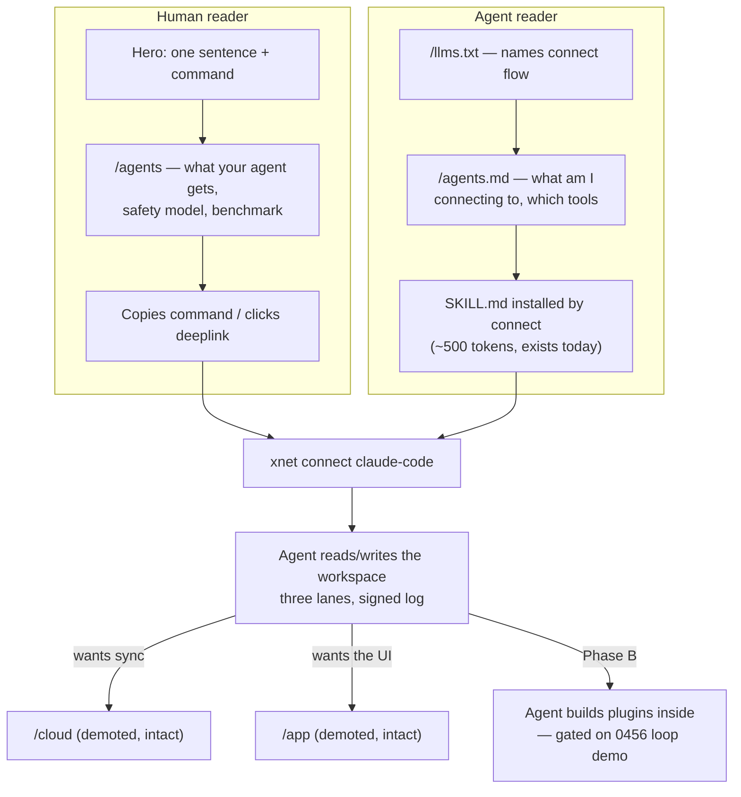

# Agent-first site re-architecture — every page converts one door

> [!TIP]
> **TL;DR** — Rebuild the site's conversion spine around one action:
> <mark>`xnet connect claude-code`</mark>. Hero becomes a copyable command
> with per-agent tabs (the Bun / Claude Code pattern), a new `/agents` page
> becomes the conversion hub (per-client installs, safety model, the 0.11x
> benchmark), "Connect your agent" becomes the header button, the
> coding-agents guide moves from _item 9 of a collapsed accordion_ into
> **Start Here**, and llms.txt finally mentions `xnet connect` — today the
> string appears in exactly **one** file on the whole site
> (`coding-agents.mdx`) and in none of: nav, footer, hero, GetStarted,
> README, llms.txt. Nothing is deleted: App, SDK, Cloud, Why all keep their
> URLs and their depth pages, demoted one rank. Ship in two phases —
> **Phase A now** (repositioning what already works: connect, checkout,
> MCP, the benchmark), **Phase B when 0456's loop demo exists** (the
> agent-builds-plugins section). Everything a human reads gets a twin the
> _agent_ reads, because for this product the agent is present at the
> moment of conversion.

## Problem Statement

[0456](./0456_[_]_ENTRY_VECTOR_THE_AGENT_DOOR_FIRST.md) chose the entry
vector: the agent door, `xnet connect claude-code|codex`. Its step 4 said
"say one sentence, everywhere" and reserved one checklist line for the
hero. This exploration is that step, fully specified: what does the landing
page, the site IA, the docs, the README, and the agent-readable layer look
like when **everything converts toward the agent connection** — while the
app, the React SDK, xNet Cloud, and the movement pages all remain, one rank
down?

The gap is stark. The site survey found:

- `xnet connect` appears in **one** source file
  (`site/src/content/docs/docs/guides/coding-agents.mdx`) — nowhere in
  `Nav.astro`, `Footer.astro`, `Hero.astro`, `GetStarted.astro`, or the
  root `README.md`.
- `public/llms.txt` — the file coding agents actually fetch — **omits the
  coding-agents guide entirely** while listing 40+ other docs.
- The landing's agent section (`BuiltForAgents.astro`) is 4th of 7,
  ~6 viewports down, and demos `xnet checkout` / `xnet query` — not the
  one command we want typed.
- The docs landing (`docs/index.mdx`) opens "xNet is a local-first React
  framework" and never links either agent guide.
- There is no `/agents` route, no agent data file, no OG images, no
  sitemap, no site-wide robots.txt.

The site is not wrong — it is even-handed. Even-handed is the problem
(0456, Option E).

## Executive Summary

| Question                           | Answer                                                                                                                                                                                                                                     |
| ---------------------------------- | ------------------------------------------------------------------------------------------------------------------------------------------------------------------------------------------------------------------------------------------ |
| The one sentence                   | **"Give your coding agent a workspace you own."** Sub-sentence: docs, databases, and canvases your agent can read, query, and build in — every change signed, synced, and yours.                                                           |
| The one action                     | A copy-button command in the hero, per-agent tabs: Claude Code · Codex · Cursor · VS Code · anything (MCP). Primary everywhere: header button, hero, GetStarted path 1, README section 1, docs Start Here.                                 |
| What happens to the app/SDK/cloud? | Kept, demoted one rank. App = "the workspace behind the agent" (section + `/app` untouched); SDK = the developer depth pages (`/react`, `/build-with`); Cloud = a whisper ("Free to start · Pricing") per the Ollama pattern. No URL dies. |
| What's new?                        | One route: **`/agents`** (conversion hub + `src/data/agents.ts`); an agent-readable layer (llms.txt fix, `/agents.md`, install snippets/deeplinks); OG meta while we're in `Base.astro`.                                                   |
| What's honest to ship _today_?     | Phase A: connect, three lanes, read-only default, agent passports, the 0.11x benchmark (with methodology published — a 0456 item). All shipped and true now.                                                                               |
| What waits?                        | Phase B: the "agent builds tools inside your workspace" section and demo — gated on 0456's loop wiring (0455 checklist). The site must not market the loop before it's recordable.                                                         |
| Biggest execution risk             | Build gates: `build-llms-full.ts` fails if a docs page isn't in `sidebar.mjs`; `validate-dist.ts` asserts route outputs (read before renaming anything); `pricing-claims.test.ts` regex-reads `pricing.ts` as text — don't reformat it.    |

---

## Current State In The Repository

### The conversion spine today

```text
Nav:    [xNet] App Developers Open | Why Build Demos Blog   [Docs] [Try the App]
                                                                        │
Hero:   "Your data. Your devices. Your rules."                          ▼
        [Try the app — free, no account]  [Read the docs]            /app
        doors: App(emerald) · SDK(indigo) · Protocol(purple)
        "The app is built on the SDK. The SDK implements the protocol.
         Start anywhere."                                  ← three equal doors

Sections: Hero → TheApp → ForDevelopers → BuiltForAgents → NoBlackBoxes
          → HumaneByDesign → GetStarted (App / SDK / Movement — no agent path)
```

Everything routes to `/app?demo=1` or `/docs/quickstart/` (SDK). The agent
story is mid-scroll (`BuiltForAgents.astro`, showing `checkout`/`query`),
and its docs are behind a collapsed accordion: `coding-agents` is item 9 of
15 in **Guides**, three levels below Start Here.

### Assets the restructure can reuse (no new machinery needed)

| Asset                     | Path                                                                                                                                                             | Why it matters                                                    |
| ------------------------- | ---------------------------------------------------------------------------------------------------------------------------------------------------------------- | ----------------------------------------------------------------- |
| Terminal chrome component | `site/src/components/ui/CodeBlock.astro` — macOS traffic lights, `filename="terminal"`, hover copy button                                                        | The hero command block already exists as a component              |
| Tab strip component       | `site/src/components/ui/CodeTabs.astro` — dependency-free, group-synced, localStorage-persisted, no-JS fallback                                                  | Per-agent tabs (Claude Code/Codex/Cursor/VS Code) for free        |
| The content itself        | `docs/guides/coding-agents.mdx` (the `xnet connect` guide), `docs/guides/agent-interfaces.mdx` (three lanes + 0.11x benchmark), `docs/ai/understanding-xnet.mdx` | The `/agents` page is 80% assembly of existing prose              |
| Changelog receipts        | 12+ agent fragments in `site/src/data/changelog/` (e.g. `2026-07-24-use-xnet-from-claude-code-and-codex.json`, `2026-08-01-verify-what-your-agent-did.json`)     | Social-proof strip: real dated receipts, no invented testimonials |
| llms-full pipeline        | `site/scripts/build-llms-full.ts` + `site/src/sidebar.mjs` (single source of truth for docs order **and** llms-full order)                                       | Reordering the sidebar reorders the agent-readable corpus too     |
| Data-file pattern         | `site/src/data/*.ts` driving every page                                                                                                                          | `agents.ts` slots in beside `pricing.ts`/`compare.ts`             |

### Constraints that will bite (from the survey)

> [!WARNING]
> Four build gates constrain this work. (1) `build-llms-full.ts` **fails
> the build** if a docs content file is in neither `sidebar.mjs` nor its
> exclusion list — every new docs page needs a sidebar entry in the same
> PR. (2) `scripts/validate-dist.ts` was added after a half-built deploy
> wiped the homepage for ~30 min (2026-07-18); **read it before renaming
> or deleting any route** — it asserts route outputs exist. (3)
> `apps/cloud/src/pricing-claims.test.ts` reads `site/src/data/pricing.ts`
> as **text with a whitespace-sensitive regex** — do not reformat that file
> while touching Cloud copy. (4) `validate-metrics.ts` fails on overstated
> or >25%-stale figures — any new stat on the hero must come from
> `siteMetrics.ts`'s conservative-floor pattern.

Also: `site/` installs `--ignore-workspace` and cannot import `@xnetjs/*`
(root `AGENTS.md`); the established workarounds are repo-root JSON imports
(`plugins.ts` → `registry/registry.json`) and committed snapshots — an
`agents.ts` data file follows the same pattern. Deploys ride
`deploy-site.yml` (site + `/app` + `/play` assembled onto `gh-pages`; the
"~9 min to live" figure from memory is not written anywhere in-repo —
verify empirically before quoting it in launch-day plans).

---

## External Research

### The command-first hero is a solved pattern

From the 2026 survey of dev-tool landers:

- **Bun**: headline + copyable `curl … | bash` with OS tabs + versioned
  install button + a _replayable_ benchmark race above the fold. Its trophy
  logos are agent products (Claude Code, Cursor, Midjourney, Railway).
- **Claude Code itself**: name + "Work with Claude directly in your
  codebase…" + download button **and** install one-liner. MCP integrations
  are a late section — the mirror image of xNet, which _is_ the
  integration and should lead with the connect command.
- **Homebrew**: the page essentially is the command. **Ollama**: one
  action; cloud reduced to "Free to start. See pricing."
- **Aider**: proof by quantified usage ("88% of new code in the latest
  release written by Aider itself") — the dogfood-metric pattern 0456's
  ledger can eventually feed.
- **Evil Martians' 100-lander study**: exactly **two** CTAs (one dominant,
  one subordinate); specific verb copy over "Get started"; for
  libraries/infra a code snippet _is_ the right hero visual; pricing on
  its own page.

### The "add to your agent" affordance stack (mid-2026 table stakes)

- Per-client tab strip with copy buttons: `claude mcp add …` (Claude Code
  convention — the snippet is the affordance), `~/.codex/config.toml` TOML
  block (Codex), **Cursor deeplink** (`cursor://anysphere.cursor-deeplink/mcp/install?name=…&config=<base64>`,
  official button assets; pair with a JSON fallback — deeplinks are
  reported flaky), **VS Code badge** (`vscode:mcp/install?<json>`).
- Directory distribution (Smithery ~16.8k MCPs listed; mcp.so ~20k
  secondhand) is marketing reach, not a substitute for the page.
- Docs sites are now expected to _be_ agent-consumable: Mintlify ships
  `/llms.txt`, `/llms-full.txt`, per-page "copy as Markdown"; GitBook
  auto-exposes an MCP endpoint per docs site.

### Marketing to the agent, not just the human

Netlify named the category — "Agent Experience (AX)" — and in April 2026
launched **netlify.ai, a site built for agents rather than humans**
(onboarding and build context for the agent itself). The nuance from the
llms.txt adoption data: no major AI vendor commits to llms.txt for
_search/training_, but **coding agents do fetch `/llms.txt` when pointed
at a docs site** — which is precisely xNet's conversion moment: an agent
is _running_ `xnet connect` while its human watches. xNet's llms.txt
currently forgets to mention the connect flow at all.

One more external fact that shapes copy: **Continue.dev's lander is now an
acquisition notice and Goose's is a redirect stub.** Harness brands churn.
The site should anchor on "your coding agent" generically, with named
clients as tabs — never as the headline.

---

## Key Findings

1. **This is a repositioning, not a rebuild.** The components (terminal
   chrome, tab strip), the content (two mature agent guides), and the
   receipts (12 dated changelog fragments) all exist. What's missing is
   rank: the agent story is mid-scroll on the homepage, item 9 of a
   collapsed accordion in docs, and absent from nav, README, and llms.txt.

2. **The conversion moment is a two-reader moment.** Uniquely for this
   product, at the instant of conversion there are two readers: the human
   deciding, and the agent about to execute `xnet connect` (and likely
   fetching `/llms.txt` mid-run). Every conversion surface therefore needs
   a human face and an agent twin. No competitor in the workspace lane
   does this; Netlify proved the pattern in the deploy lane.

3. **Honesty gates the section order.** The three lanes, read-only
   default, passports, signed log, and the benchmark are shipped and true
   — Phase A can say them loudly today. The loop ("your agent builds tools
   _inside_ the workspace") is 0455/0456 wiring away; the site must not
   promise it before the demo records. The Charter's own rule (every
   promise ships with a receipt or is labeled not-yet) applies to
   marketing exactly as to docs.

4. **The benchmark is the single most quotable asset and the most
   fragile.** "~9x cheaper than MCP tools" already appears on the landing
   page; the hero will amplify it. 0456 already requires the methodology
   to be published and reproducible — that item becomes a _prerequisite_
   of Phase A launch, not a follow-up.

5. **Demotion must be visible-but-cheap.** The lesson from Ollama ("Free
   to start. See pricing") and Evil Martians (pricing on its own page):
   the app and cloud don't vanish — they compress to one honest line each
   with a route. That satisfies "keep all the other features" without
   re-splitting the funnel.



---

## Options And Tradeoffs

### Option A — Copy-only touch-up

Rewrite `Hero.astro` copy and promote `BuiltForAgents` to section 2; change
nothing else.

- ✅ One PR, zero risk to build gates.
- ❌ Leaves the funnel broken where it actually converts: no `/agents`
  page to send traffic to, docs still SDK-first, llms.txt still silent on
  connect, README untouched. The header button still says "Try the App."
  Half a repositioning reads as indecision — the current site's disease.

### Option B — Full-stack repositioning in two phases ⭐

Phase A (now): hero + nav + `/agents` route + GetStarted + docs IA +
llms.txt/agents.md + README, all around what ships today. Phase B (gated
on 0456's loop demo): the plugin-loop section, the recorded demo, and the
dogfood-metric proof strip.

- ✅ Converts the whole spine while every claim stays true; the two-phase
  gate keeps marketing behind reality; touches no revenue mechanics.
- ✅ Each Phase A item is small and independently shippable (see
  checklist) — no big-bang redesign, `--delete` rsync deploys stay safe.
- ❌ ~8–10 PRs across site, docs, README; sidebar/llms-full/validate-dist
  gates need care; OG/meta work tempts scope creep (kept optional).

### Option C — Separate agent microsite (agents.xnet.fyi or netlify.ai-style twin)

- ✅ Maximum focus; the main site stays even-handed.
- ❌ Splits authority and maintenance for a solo founder; the survey shows
  the main site's traffic surfaces (README, llms.txt, docs) are exactly
  where the fix is needed; a microsite duplicates the Starlight/llms
  pipeline. The agent-twin _pages_ (Option B) capture the netlify.ai idea
  without a second property.

### Option D — Docs-as-landing (Tailwind posture)

Make `/docs` the homepage; kill the marketing site's hero.

- ❌ Throws away the `/why`/Charter/blog narrative layer that is xNet's
  actual differentiation vs Buzz/Notion, and the 25-essay corpus that
  earns trust. Rejected without much agony.

> [!NOTE]
> No revenue lane changes: Cloud pricing, plans, and CTAs are untouched
> except in rank. Charter §6 tests not triggered.

---

## Recommendation

**Option B.** The spec, surface by surface:

### 1. Hero (`site/src/components/sections/Hero.astro`)

```text
┌────────────────────────────────────────────────────────────────────┐
│            [Alpha — shipping, and still moving fast]               │
│                                                                    │
│         Give your coding agent a workspace you own.                │
│                                                                    │
│   Documents, databases, and canvases your agent can read, query,   │
│   and build in — local-first, synced, every change signed.         │
│                                                                    │
│  ┌ Claude Code ┊ Codex ┊ Cursor ┊ VS Code ┊ Any agent ─────────┐   │
│  │ ● ● ●  terminal                                    [copy]   │   │
│  │ $ npx @xnetjs/cli connect claude-code                       │   │
│  │ ✓ skill installed · mcp registered · read-only by default   │   │
│  └─────────────────────────────────────────────────────────────┘   │
│                                                                    │
│   [What your agent gets →  /agents]      [Try the app]  (2nd CTA)  │
│                                                                    │
│   ~9x cheaper than MCP toolsets* · read-only until you say so ·    │
│   works offline · MIT                    *methodology → /agents    │
└────────────────────────────────────────────────────────────────────┘
```

- Tabs via existing `CodeTabs.astro`; terminal via existing
  `CodeBlock.astro` (`filename="terminal"`). Claude Code/Codex tabs show
  `xnet connect …`; Cursor/VS Code tabs show the MCP deeplink button +
  copyable JSON fallback; "Any agent" shows `xnet mcp serve`.
- Exactly two CTAs (Evil Martians): primary → `/agents`, secondary →
  `/app?demo=1`. The three equal doors **go away**; the closing line
  becomes "There's a full workspace app behind this — and an SDK under
  both. [App] · [SDK] · [Protocol]" as small links.
- Verify the exact zero-install one-liner before shipping (`npx
@xnetjs/cli …` vs `npm i -g` — whichever `packages/cli` actually
  supports; the checklist carries this).
- Static command block first; a typed-replay animation is a Phase B
  nicety, not a blocker (Deno converts with no animation at all).

### 2. New route: `/agents` (+ `site/src/data/agents.ts`)

The conversion hub, assembled from existing content:

1. Per-client install (the hero tabs, expanded — including
   `claude mcp add` and Codex TOML for people who prefer raw MCP).
2. **What your agent gets**: the three lanes from `agent-interfaces.mdx`
   (CLI verbs → vault checkout → MCP fallback), with the token benchmark
   and a link to the published methodology.
3. **The safety model**: read-only by default, `--writes` opt-in, agent
   passports, every change signed into the log — "verify what your agent
   did" (reuse the changelog fragment's framing).
4. **Receipts strip**: the dated agent changelog fragments as cards (real
   receipts instead of invented testimonials).
5. One-line demotions: "Prefer a UI? [Try the app]. Building your own?
   [React SDK]. Want managed sync? [Cloud — free to start]."
6. Phase B slot: the recorded loop demo replaces a "what's next" teaser.

`agents.ts` holds the per-client commands/deeplinks/labels so the hero
tabs, `/agents`, README snippets, and docs quickstart all render from one
source (same pattern as `pricing.ts`).

### 3. Nav + footer (`Nav.astro`, `Footer.astro`)

- Header: add **Agents** as the first page link; the filled conversion
  button becomes **"Connect your agent" → `/agents`**; "Try the App"
  moves to a plain link. Everything else stays.
- Footer: new first column **Agents** (Connect guide, Agent interfaces,
  /agents, llms.txt, MCP/registry listings), then Product/Cloud/Develop/
  Resources/Community as today.

### 4. Docs IA (`site/src/sidebar.mjs`, `docs/index.mdx`)

- **Start Here** becomes: Introduction → **Connect your agent**
  (`coding-agents.mdx`, retitled) → Quickstart (SDK) → Core Concepts.
  `agent-interfaces` moves up alongside it or into a new "Agents" group
  right under Start Here — either way, out of the collapsed accordion.
- `docs/index.mdx` opens with two cards — "Connect your coding agent" and
  "Build with React" — replacing the SDK-only lede.
- Sidebar reorder automatically reorders `llms-full.txt` (same source of
  truth); regenerate and commit in the same PR (`pnpm check:llms-full`).

### 5. The agent-readable layer

- `public/llms.txt`: add the connect flow at the **top** ("If you are a
  coding agent: your human can connect you with `xnet connect <you>`;
  after connect you get these tools/lanes…"), plus the missing
  coding-agents entry.
- New `public/agents.md` (the netlify.ai move, one page not a microsite):
  what xNet is _to an agent_, the three lanes, tool list, safety
  contract, where the SKILL.md comes from. Linked from llms.txt and
  `/agents`.
- Optional same-PR cheap wins while in `Base.astro`: `og:title`/
  `og:description`/`twitter:card` (site has **zero** OG meta today),
  `@astrojs/sitemap`, site-wide `robots.txt`.

### 6. README (root)

Mirror the site's new order: after the one-liner and screenshot, **Try it**
gains "Connect your coding agent" as the _first_ bullet (`npx @xnetjs/cli
connect claude-code`), before demo/download/hub; a short "Your agent,
your workspace" section (three lanes + benchmark + safety line) lands
above "Build with it". Zero agent mentions today → the second landing
surface gets the same spine.

### 7. Explicitly unchanged

`/why`, `/commitments`, `/blog`, `/compare`, `/open`, `/status`,
`/roadmap`, all legal pages, `/cloud` + pricing (rank only), `/plugins`,
`/download`, `/mobile`, `/demos`, `/react`, `/build-with`, `/devtool` —
URLs, content, and validators untouched.

### Phase gate

> [!IMPORTANT]
> **Phase A ships now** — every claim above is true of today's shipped
> `@xnetjs/cli@0.4.0`. **Phase B** (the loop section: "ask your agent for
> a tool; it builds a sandboxed plugin inside your workspace; watch every
> change in the signed log" + recorded demo + Aider-style dogfood metric)
> **is gated on 0456's checklist item "loop demo recorded"** — the site
> never gets ahead of the repo. The 0.11x benchmark methodology
> publication (a 0456 item) is a **Phase A prerequisite**, because the
> hero quotes it.

## Risks And Open Questions

- **The command must work flawlessly for strangers.** The hero promotes a
  path so far run mostly by its author. 0456's manual-onboarding item is
  the mitigation; sequence at least one outside run before the hero
  flips. Also confirm `npx @xnetjs/cli connect` works without global
  install (and without a pre-existing workspace — the "thin room" question
  from 0456: what does a fresh agent connect _to_? The `/agents` page
  should answer with the demo-seed or `xnet vault init` story).
- **Cursor/VS Code deeplinks are flaky** (documented forum failures) —
  always render the copyable JSON beside the button; treat the deeplink as
  progressive enhancement.
- **Benchmark exposure.** Quoting 0.11x in the hero invites replication
  attempts; methodology must be in-repo and reproducible first
  (prerequisite above).
- **validate-dist and route assembly.** Read `scripts/validate-dist.ts`
  before the nav/route PR; add `/agents` to whatever it asserts. The
  gh-pages rsync `--delete` means a bad build can blank pages — the
  validator exists because it already happened once; keep it updated rather
  than bypassed.
- **Alpha honesty vs conversion.** The alpha badge stays in the hero. The
  0335 key blocker (0456 item 1) must land before any launch push drives
  desktop downloads.
- **Open question — the name of the door.** "Agents" vs "AI" vs "Connect"
  in nav copy; "Agents" is assumed here (matches `/agents`,
  survives harness churn), but test on the manual onboardings.
- **Open question — Plausible goals.** Cookieless Plausible is already
  gated in; whether to define custom events (copy-click, tab-select) or
  keep zero-measurement is a Charter-flavored decision left to the
  decider.

## Implementation Checklist

**Status:** ░░░░░░░░░░ 0/12 items (Phase A: 1–10; Phase B: 11–12)

- [x] Verify + document the canonical zero-install command (`npx
@xnetjs/cli connect claude-code` or equivalent) against
      `packages/cli` as published; fix `packages/cli` if npx flow has
      gaps
- [x] Publish the 0.11x benchmark methodology in-repo (0456 item, now a
      Phase A prerequisite) and link target for the hero footnote
- [x] `site/src/data/agents.ts` — per-client commands, deeplinks, labels
      (single source for hero tabs, `/agents`, README, docs)
- [x] `Hero.astro` rewrite: new headline/sub, `CodeTabs` + `CodeBlock`
      command block, two CTAs, doors → small links
- [x] New `site/src/pages/agents.astro` per the section spec; update
      `scripts/validate-dist.ts` expectations if route-asserting
- [x] `Nav.astro` (+Agents link; button → "Connect your agent") and
      `Footer.astro` (+Agents column)
- [x] `GetStarted.astro`: path 1 becomes "Connect your agent" (command
      block), App and SDK follow
- [ ] Docs IA: `sidebar.mjs` — coding-agents into Start Here (retitled
      "Connect your agent"), agent-interfaces promoted; `docs/index.mdx`
      two-card lede; regenerate `llms-full.txt` (`pnpm check:llms-full`)
- [ ] Agent-readable layer: `public/llms.txt` top section + coding-agents
      entry; new `public/agents.md`; (optional, same PR: OG meta in
      `Base.astro`, `@astrojs/sitemap`, `robots.txt`)
- [ ] Root `README.md`: connect-first Try-it bullet + "Your agent, your
      workspace" section above Build-with
- [ ] **Phase B**: loop demo section on `/` and `/agents` once 0456's
      "loop demo recorded" item is checked; typed-replay animation of the
      connect+session terminal
- [ ] **Phase B**: dogfood proof strip (ledger-derived metric, Aider
      pattern) once the 0456 ledger has ≥4 weeks of data

## Validation Checklist

- [ ] `cd site && pnpm build` green (all validators incl. llms-full check
      and validate-dist) with the new route and reordered sidebar
- [ ] A fresh machine + `npx` run of the hero command succeeds verbatim
      as printed, against the published npm package (not the repo)
- [ ] An agent given only `https://xnet.fyi` (via llms.txt/agents.md) can
      explain what `xnet connect` will do and which tools it gets —
      tested by actually asking Claude Code with a clean context
- [ ] Cursor deeplink and VS Code badge each install the MCP server on a
      clean profile; JSON fallback verified when the deeplink fails
- [ ] Every demoted page still reachable within two clicks of `/`
      (nav or footer); no URL removed (`check:exploration-links`-style
      manual sweep of site nav)
- [ ] At least one 0456 manual onboarding completed **through the new
      site** without founder intervention — the site was the only guide
- [ ] Phase B additions appear only after the referenced 0456 items are
      verifiably checked

## References

- Repo: [0456](./0456_[_]_ENTRY_VECTOR_THE_AGENT_DOOR_FIRST.md) (the
  strategy this specifies),
  [0455](./0455_[_]_CORDIS_LESSONS_FOR_XNET_PLUGIN_COMPOSITION.md) (loop
  wiring behind Phase B),
  [0384](./0384_[x]_TIGHTENING_THE_LANDING_PAGE_FROM_28_VIEWPORTS_TO_A_FOCUSED_FUNNEL.md) (the
  teaser→route rule this doc obeys: teasers link depth pages, never
  re-argue them), `site/src/components/sections/Hero.astro`,
  `site/src/sidebar.mjs`, `site/scripts/build-llms-full.ts`,
  `scripts/validate-dist.ts` (via `site/package.json` build),
  `apps/cloud/src/pricing-claims.test.ts`,
  `site/src/content/docs/docs/guides/coding-agents.mdx`,
  `public/llms.txt`
- External: Bun (bun.sh) hero pattern; Claude Code product page
  (claude.com/product/claude-code); Ollama (ollama.com) one-action page;
  Aider (aider.chat) dogfood metric; Evil Martians "We studied 100 dev
  tool landing pages" (2025) + LaunchKit; Cursor MCP install-links docs
  (deeplink + button assets); VS Code "Agent mode meets MCP" (May 2025,
  `vscode:mcp/install` badges); modelcontextprotocol/mcpb bundles;
  Mintlify contextual menu / llms.txt tooling; GitBook docs-MCP
  endpoints; Netlify Agent Experience + netlify.ai (Apr 2026); Smithery
  (smithery.ai); llms.txt adoption surveys (secondary sources, directional
  only); Continue.dev acquisition page + Goose redirect (harness churn)
