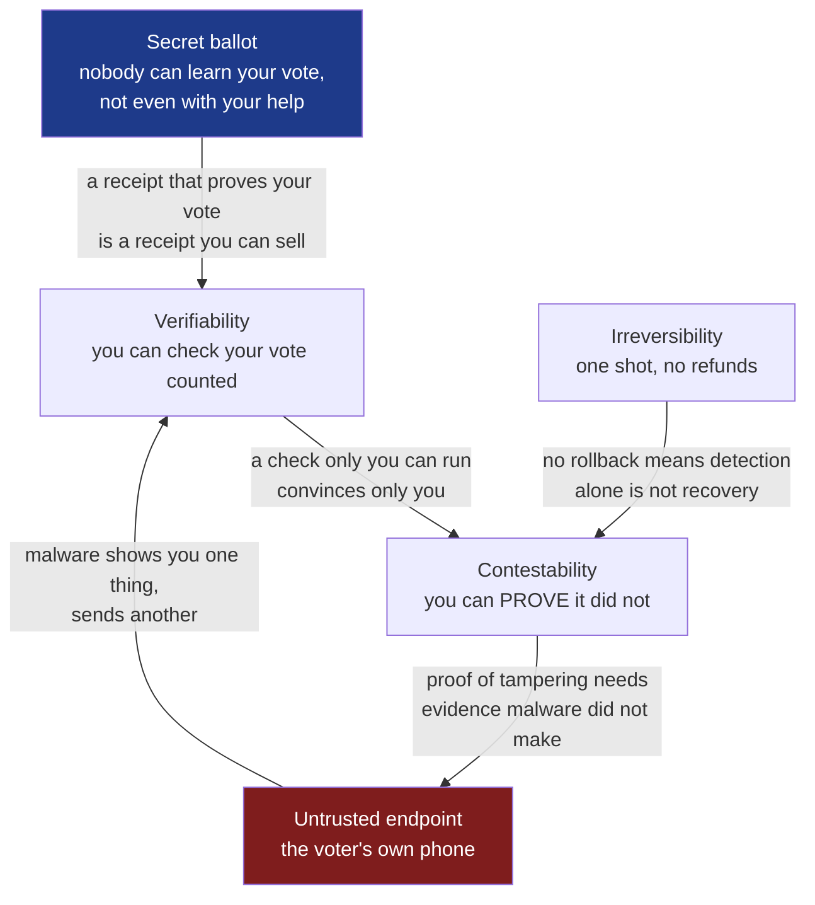
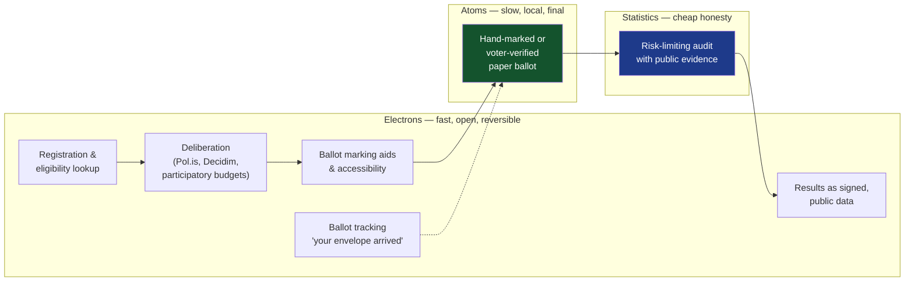
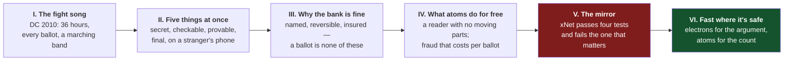
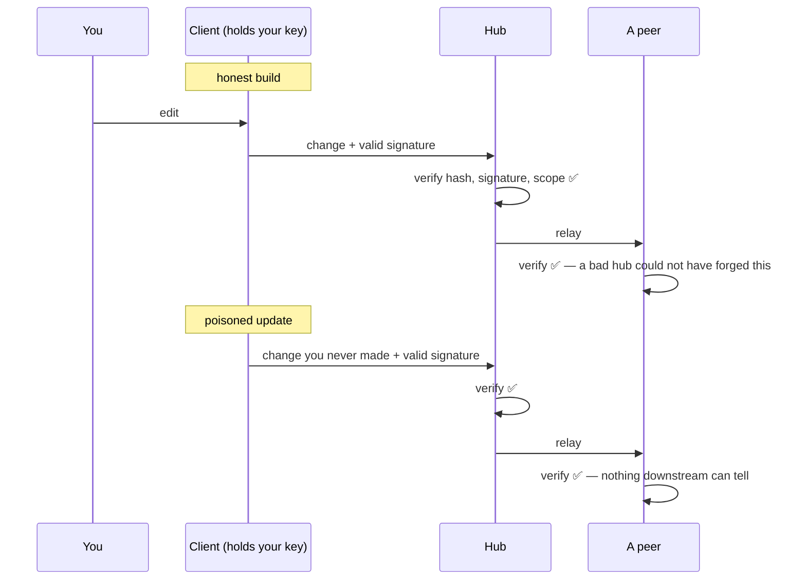

# Atoms for the Ballot — why digital voting stays unsolved, and what that says about open, federated software

> [!TIP]
> **TL;DR** — Write one essay, working title **"Atoms for the Ballot"**, that
> takes the strongest case against internet voting seriously and then turns
> the same five tests on xNet. The finding is not "computers are insecure".
> It is narrower and more useful: <mark>voting is the one job that demands
> secrecy, verifiability, irreversibility and an untrusted endpoint all at
> once, and paper is the only record a human can read without trusting
> software</mark>. xNet escapes that trap because its actions are signed,
> attributed and reversible — a bank's shape, not a ballot's. But it fails
> one test in exactly the way a voting app does: **the client you run is the
> thing that holds your key**, and the update channel is a wholesale attack.
> The essay should say so, and three cheap repo gaps (no `SECURITY.md`, no
> dependency-update bot, no audit gate) should close before it prints.

## Problem Statement

The prompt asks for a deep blog post on a claim most engineers have heard
and few can defend in detail: that a secure digital voting system is close
to impossible, and that paper ballots remain the right answer in 2026. It
then asks the harder, more personal question. xNet wants to move a large
share of everyday software into a federated commons, owned and governed by
the people who use it. If the best-funded, most-scrutinised attempt at
"important civic thing, done over the internet" keeps failing, what does that
say about us?

The prompt also raises three doubts that deserve a straight answer rather
than a slogan:

1. **Obscurity.** Some things really are safer when attackers cannot read
   them. xNet is fully open source; nobody needs a decompiler.
2. **Surface area.** Some things are safer when they are small. xNet is not
   small.
3. **Symmetry.** Open code lets defenders find bugs and patch them. It lets
   attackers find the same bugs and use them. Who wins that race?

And it ends on a bigger question: how do democracies move forward in a world
that wants everything at the speed of light, when electrons are so much less
robust than atoms?

> [!IMPORTANT]
> The essay only works if it is harder on xNet than a critic would be. Every
> corpus essay that lands does this (_The Hundred-Year Machine_ opens its
> defence by admitting xNet Cloud is a subscription). Here the mirror is the
> repo survey below: the architecture is strong where voting is weak, and
> the housekeeping is weak where any serious project should be strong.

## Executive Summary

**Why voting is hard.** Park, Specter, Narula and Rivest reduce election
security to five minimal requirements: ballot secrecy, software
independence, voter-verifiable ballots, contestability and auditing. Each is
achievable alone. Together, over the internet, from a phone nobody controls,
no known technology delivers them — a position restated in January 2026 by
21 computer scientists including Rivest, Schneier, Halderman, Appel, Stark
and Teague. The record agrees: Washington DC's 2010 pilot fell in about 36
hours; Voatz, sVote, Moscow's blockchain system and NSW's iVote each failed
in a different way.

**Why paper wins.** Not nostalgia. A hand-marked paper ballot is
write-once, human-readable with no hardware, and costly to alter at scale.
Changing a million paper ballots needs a conspiracy; changing a million
electronic ones needs a line of code. Paper turns fraud from _wholesale_
into _retail_. A risk-limiting audit can then confirm an election of tens of
millions from a sample of a few hundred ballots.

**Why banking works and voting does not.** Banks know who you are, can
reverse a bad transaction, and insure the loss. A secret ballot forbids the
first, an election forbids the second, and nothing can do the third.

**What this says about xNet.** xNet's data model has the bank's shape. Every
change is signed by an author DID, hashed into a chain, verified at the hub
gate, and re-verifiable offline. It needs no secret ballot, so the
impossible combination never arises. The hub is trusted for availability,
not integrity. That is real software independence _with respect to the
server_.

It is not software independence with respect to the **client**. The app
holds your key; a malicious update can sign anything in your name, and the
signature will verify. That is the voter's-phone problem, unsolved for us as
for everyone. The web app is the sharpest case: whoever serves the
JavaScript can change it for everyone tonight.

**On obscurity.** It is a legitimate layer and a terrible foundation. Voatz
was closed and was reverse-engineered anyway. The sVote flaw was found
_because_ the source was published. xz shows open code is not automatically
_read_ code. And AI-assisted bug-finding is shrinking whatever discount
obscurity still bought. The variable that matters now is time-to-patch —
which routes straight back through the update channel.

**The recommendation.** One essay, six acts, about 2,600 words. Alongside
it, a short honesty pass on the repo so the essay does not write cheques the
code cannot cash.

---

## Current State In The Repository

The survey read the code, not the docs. There was no `graphify-out/` in
this worktree, so findings are grep-and-read derived.

### Scorecard: the five election requirements, translated to xNet

| Requirement (Park et al.) | What it means for xNet                                       | Status               | Evidence                                                                                                                                             |
| ------------------------- | ------------------------------------------------------------ | -------------------- | ---------------------------------------------------------------------------------------------------------------------------------------------------- |
| 1. Secret ballot          | Do we need anonymity _and_ verifiability on the same record? | ✅ Not required      | Every `Change<T>` carries `authorDID` + `signature` — [`packages/sync/src/change.ts`](../../packages/sync/src/change.ts)                             |
| 2. Software independence  | Can a bad **hub** change your data undetectably?             | ✅ No                | Hub ingest gate verifies hash then signature — [`packages/hub/src/services/node-relay.ts`](../../packages/hub/src/services/node-relay.ts) (L267–300) |
| 2′. Software independence | Can a bad **client build** change your data undetectably?    | ❌ Yes               | The client holds the key; nothing outside it attests what it signed                                                                                  |
| 3. Verifiable record      | Can you check your own record without trusting us?           | 🚧 Partial           | `xnet audit verify <bundle>` runs offline — [`packages/cli/src/commands/audit.ts`](../../packages/cli/src/commands/audit.ts); needs a CLI, not eyes  |
| 4. Contestability         | Can you prove tampering to a third party?                    | 🚧 One direction     | A forged change fails verification for anyone. "My device was compromised" is unprovable — the signature is valid                                    |
| 5. Auditing               | Is the evidence actually checked, not just checkable?        | 🚧 Data yes, deps no | [`packages/sync/src/integrity-monitor.ts`](../../packages/sync/src/integrity-monitor.ts) re-verifies; no `pnpm audit`, CodeQL or update bot in CI    |

### What is strong

- **Signed, chained changes.** `signChange`, `verifyChange`,
  `computeChangeHash`, `verifyChangeHash` in
  [`packages/sync/src/change.ts`](../../packages/sync/src/change.ts); fork
  detection and chain validation in
  [`packages/sync/src/chain.ts`](../../packages/sync/src/chain.ts).
- **An adversarial tiebreak.** [`packages/core/src/lww.ts`](../../packages/core/src/lww.ts)
  replaced "higher DID wins" with `blake3(author ‖ property ‖ value)`
  because a `did:key` is attacker-chosen and could be ground into a vanity
  DID that wins every tie forever (exploration 0305, shipped). The hub also
  bounds `wallTime` skew for the same reason. This is the repo's best
  example of thinking like the attacker, and the essay should use it.
- **First-writer-wins ownership, no update path.**
  [`packages/hub/src/storage/interface.ts`](../../packages/hub/src/storage/interface.ts)
  (L425–441): a DID that merely learns a node id cannot seize it.
- **Trust follows provenance, never self-declaration.**
  [`packages/trust/src/index.ts`](../../packages/trust/src/index.ts): on
  sync the receiver re-derives the tier from its own install action and
  ignores the tier in the payload. The ballot does not get to vouch for
  itself.
- **"The model authored it" is not a credential.**
  [`packages/plugins/src/connectors/install-gate.ts`](../../packages/plugins/src/connectors/install-gate.ts):
  an AI-generated connector that wants secrets needs a human promotion.
- **Human-in-the-loop for agent writes.**
  [`packages/plugins/src/ai-surface/approval-broker.ts`](../../packages/plugins/src/ai-surface/approval-broker.ts).
- **Implementation diversity.** A Rust mirror in `rust/xnet-core` plus
  golden vectors in `conformance/vectors/`, with drift caught by
  `packages/sync/src/protocol-version-parity.test.ts`. Two independent
  implementations that must agree is the software cousin of an independent
  recount.
- **Updates are consented, not silent.**
  [`apps/electron/src/main/updater.ts`](../../apps/electron/src/main/updater.ts)
  sets `autoUpdater.autoDownload = false`.
- **npm provenance is on** (`"provenance": true` across the published
  packages), logged to Sigstore's public transparency log.

### What is absent

> [!WARNING]
> Each item below was confirmed by `git ls-files` or a direct read on
> 2026-09-18. None is exotic. An essay about security that ships from a repo
> missing them invites the obvious reply.

| Gap                                              | Status                 | Note                                                                                                                                       |
| ------------------------------------------------ | ---------------------- | ------------------------------------------------------------------------------------------------------------------------------------------ |
| `SECURITY.md` / disclosure policy                | ❌ Missing             | Only `security@xnet.fyi`, one line in [`site/src/pages/acceptable-use.astro`](../../site/src/pages/acceptable-use.astro) (L98)             |
| Dependency update bot (`.github/dependabot.yml`) | ❌ Missing             | 194 unique direct dependencies across the workspace                                                                                        |
| `pnpm audit` in CI                               | ❌ Missing             | An unchecked item in exploration 0120                                                                                                      |
| CodeQL / static security analysis                | ❌ Missing             | Prose only, in explorations 0134 and 0141                                                                                                  |
| Threat model                                     | ❌ Unfinished          | Exploration 0134 is `[_]`; 0307 (change-flow security) is `[_]`                                                                            |
| Reproducible builds                              | ❌ No claim anywhere   | So nobody can check that a shipped binary matches the public source                                                                        |
| SBOM                                             | 🚧 Hub container only  | A workflow artifact, not published or attested                                                                                             |
| macOS signing                                    | 🚧 Conditional         | Falls back to self-signed, un-notarised when Apple secrets are absent — `.github/workflows/electron-release.yml`                           |
| Post-quantum signatures on changes               | 🚧 Built, unwired      | `change.ts` L18–24 says so plainly                                                                                                         |
| Prompt-injection defence                         | 🚧 Scattered           | No dedicated module                                                                                                                        |
| Seed at rest                                     | 🚧 Plaintext fallback  | [`apps/electron/src/main/identity-seed.ts`](../../apps/electron/src/main/identity-seed.ts) when `safeStorage` is unavailable               |
| Metadata                                         | 🚧 Cleartext by design | `publicProps` + `recipients` in [`packages/crypto/src/envelope.ts`](../../packages/crypto/src/envelope.ts) stay readable for hub filtering |

One pattern is worth a sentence in the essay. CI runs roughly 25 custom
gates on _architecture_ — licence boundaries, capability surfaces, humane
patterns, footprint — and none on _dependency vulnerabilities_. We guard the
invariants we invented and not the ones everybody has.

### Surface area, counted

52 packages, 6 apps, 3,840 tracked TypeScript files, about 721,000 lines,
194 unique direct dependencies, plus Rust and Swift kernels. The prompt is
right: this is a large surface.

The honest response is not to deny it but to name the **trusted computing
base** — the small part that must be right for nobody to forge your data:

```text
┌────────────────────────── must be right ──────────────────────────┐
│ packages/crypto   packages/identity   packages/sync (change,chain)│
│ packages/core/lww packages/hub ingest gate   packages/trust       │
└───────────────────────────────────────────────────────────────────┘
        everything else can be wrong without forging a signature
        (it can still leak, crash, or mislead — but not impersonate)
```

### Voting in the repo today

Nothing. No ballots, no quorum, no tally, no anonymity layer. The word
"vote" appears as a social reaction type and as multi-tab leader election.
Governance is deliberately _not_ a ballot: `GOVERNANCE.md` is BDFL plus a
Rule Change Proposal process with a public written answer in 30 days
(exploration 0361), and
`packages/telemetry/test/charter-claims-ledger.test.ts` records that
"Ostrom principle 3 needs a _path_, not a vote". That absence is a finding,
and the recommendation is to keep it.

---

## External Research

### The five requirements

Park, Specter, Narula and Rivest, _Going from Bad to Worse: From Internet
Voting to Blockchain Voting_ (Journal of Cybersecurity, 2021), give the
cleanest frame. Read at source for this exploration (pp. 1–6).

1. **Secret ballot.** If nobody can learn how you voted, nobody can pay or
   threaten you to vote their way. Before it, bribery was the main threat to
   elections.
2. **Software independence** (Rivest and Wack). An undetected change or
   error in software cannot cause an undetectable change in the outcome.
   It does not ban software; it demands that software's work be checkable
   by other means.
3. **Voter-verifiable ballots.** The voter can see that the record matches
   their intent before casting.
4. **Contestability.** Whoever detects an error can convince others it
   happened.
5. **Auditing.** The evidence is actually checked. "Auditability without
   auditing is like collecting receipts … then never checking."

Their four-way table is the essay's first picture:

| &nbsp;                     | In person          | Remote                            |
| -------------------------- | ------------------ | --------------------------------- |
| **Voter-verifiable paper** | ✅ Precinct voting | ✅ Mail-in ballots                |
| **Electronic-only record** | ❌ DRE machines    | 🛑 Internet / mobile / blockchain |

### Why the requirements collide



The tensions in plain words:

- **Secrecy against verifiability.** Any receipt that lets you prove how you
  voted also lets a buyer or a bully demand to see it. Cryptographers call
  the fix _receipt-freeness_ (Benaloh and Tuinstra). It exists on paper, in
  both senses. In unsupervised remote voting, the 2026 letter notes, the
  mechanisms remain complex and counterintuitive for voters.
- **Verifiability against contestability.** Suppose your verifier says your
  vote was changed. You cannot show anyone without revealing your vote, and
  officials cannot cancel an election on unproven claims. The 2026 letter's
  line: verification becomes theatre if a voter cannot prove the cheating
  they detect.
- **The endpoint.** The voter's device is the polling booth, and nobody
  inspects it. Malware can display your choice and transmit another, and can
  lie to the verification app too.
- **One shot.** A bank that detects fraud reverses it. An election that
  detects fraud can only rerun, and a rerun is a different election.
- **Scale.** "A remote programmer changing a line of code could in principle
  change millions of electronic ballots in milliseconds, whereas changing
  millions of paper ballots requires physical access and one-by-one
  handling" (Park et al., §1.1 — paraphrase in the essay, do not quote at
  length).
- **The adversary.** Banks face thieves. Elections face states, whose aim
  may be only to make the loser disbelieve the result. An attack that
  changes nothing but cannot be _ruled out_ succeeds.

That last point is the quiet centre of the whole field. An election has to
produce a winner **and** evidence that persuades the loser's supporters —
ordinary people, not cryptographers. A proof only a specialist can check
moves trust from the count to the specialist.

### Banking is the wrong analogy

| Property               | Online banking                 | Online voting                           |
| ---------------------- | ------------------------------ | --------------------------------------- |
| Identity on the record | Required                       | Forbidden                               |
| Reversible             | Yes — chargebacks, corrections | No                                      |
| Loss absorbed by       | Bank, merchant, insurer        | Nobody; "no means to make voters whole" |
| Tolerated failure rate | Non-zero, priced in            | Must be below the margin                |
| Customer can audit     | Yes — read your statement      | Not without breaking secrecy            |
| Typical adversary      | Criminals seeking money        | Nation states seeking doubt             |

Sources: Verified Voting, _If I Can Shop and Bank Online, Why Can't I Vote
Online?_; Park et al. §1; Schneier, _On Blockchain Voting_ (2020).

### The record

| Year    | System                          | Open source?              | What happened                                                                                                                                                          |
| ------- | ------------------------------- | ------------------------- | ---------------------------------------------------------------------------------------------------------------------------------------------------------------------- |
| 2010    | Washington DC pilot             | Yes, public test          | Halderman's Michigan team took full control within ~36 hours, changed every ballot, made the site play the Michigan fight song; saw probes from China and Iran         |
| 2014    | Estonia i-voting                | Partly                    | Springall et al.: serious architectural limits; the system "blindly trusts the election servers and the voters' computers"                                             |
| 2019    | Swiss Post / Scytl sVote        | Source published for test | Lewis, Pereira and Teague found a flaw allowing undetectable vote manipulation in the "universally verifiable" mixnet; the same code ran in New South Wales            |
| 2019    | Moscow blockchain voting        | Partly                    | Gaudry recovered private keys in minutes (key sizes too small); broken again after the fix                                                                             |
| 2020    | Voatz (West Virginia, others)   | **Closed**                | Specter, Koppel and Weitzner reverse-engineered the Android app; attackers could alter, stop or expose a vote. The title: _The Ballot is Busted Before the Blockchain_ |
| 2021    | NSW iVote                       | Closed                    | Overload left voters without credentials; the Supreme Court voided three council elections. No attacker required                                                       |
| 2023    | Estonia                         | —                         | 51% of votes cast online, a first; no proven compromise; in 2024 the Academy of Sciences commission found no significant risks                                         |
| 2023    | Swiss Post relaunch             | Public source, bug bounty | Approved for limited trials with full verifiability and independent examination                                                                                        |
| 2025–26 | VoteSecure (Tusk / Free & Fair) | **Open**, on GitHub       | 21 scientists respond: it cannot protect against endpoint malware, concedes no receipt-freeness, and leaves dispute resolution unspecified                             |

Two lessons the essay needs from this table.

**Obscurity bought Voatz nothing.** A graduate student with the APK rebuilt
enough of the server to analyse it. Closed source delayed the finding and
made the vendor's first response a complaint about the researchers.

**Openness found the sVote flaw before an election rather than after.** The
bug lived in the part sold as the verifiability guarantee. Publishing the
code is what let three outsiders find it. That is the open model working —
and it still was not enough to make the system safe to deploy.

> [!NOTE]
> **Estonia is the honest counter-example** and the essay must not dodge it.
> Twenty years, a national ID card with a hardware key, revoting to blunt
> coercion, a majority of votes online, no demonstrated fraud. The critics'
> reply is not "it was hacked" but "it cannot prove it was not". A small,
> high-trust state has chosen to accept that. Whether a large, low-trust one
> can is the real question.

### Why paper

Not because it is old. Because of what atoms do for free.

| Property                  | Paper ballot                          | Electronic record                     |
| ------------------------- | ------------------------------------- | ------------------------------------- |
| Read by                   | Eyes                                  | Software, which is the thing in doubt |
| Copy cost                 | High, and copies are distinguishable  | Zero, and copies are identical        |
| Edit at a distance        | Impossible                            | The default                           |
| Cost to alter _n_ records | Grows with _n_ — people, time, access | Roughly constant in _n_               |
| Who can observe handling  | Anyone in the room                    | Whoever has root                      |
| Failure mode              | Local, visible, slow                  | Global, silent, instant               |

Stated as cost, where $n$ is the number of votes changed:

$$C_{\text{paper}}(n) \approx c \cdot n \qquad\qquad C_{\text{digital}}(n) \approx C_0$$

Paper's security _is_ its inconvenience. The slowness that makes it
annoying is the same property that makes fraud labour-intensive and
therefore leaky: a conspiracy of a thousand people does not keep secrets.

Then the clever part. A **risk-limiting audit** draws a random sample of
paper ballots and checks them against the reported result. If the margin is
healthy, a few hundred ballots can confirm a contest of tens of millions
with a stated, small chance of being wrong; if the sample disagrees, the
audit escalates toward a full hand count. The machines do the fast count,
the paper keeps them honest, and statistics makes checking cheap. This is
the National Academies' 2018 recommendation: human-readable paper for all US
elections, risk-limiting audits within a decade, and no internet return of
marked ballots.

> [!IMPORTANT]
> The frame the essay should steal: **paper is the only data format with a
> hardware-free reader.** Every electronic record needs software to be seen,
> and that software is what is in question. Cryptography is the long project
> of giving electrons the properties of atoms — signatures for
> unforgeability, hash chains for write-once. It succeeds for integrity
> between honest endpoints. It cannot lend a human eyes.

### Open source, obscurity and the many-eyes question

**Kerckhoffs's principle (1883).** A system should stay secure when
everything about it except the key is public. Shannon's version: the enemy
knows the system. The principle does not say obscurity is worthless. It
says do not _depend_ on it.

**What the evidence says.** Schryen's comparisons of published
vulnerabilities found no significant difference between open and closed
source in severity or patching; the development community's policy mattered
more than the licence, and open development at least ruled out "extremely
bad" patching behaviour. Other studies found open-source flaws are
exploited faster once disclosed. Both are true and they do not conflict:
open code shortens the time from _known_ to _exploited_, and also from
_known_ to _fixed_.

**Many eyes is a condition, not a guarantee.** Heartbleed sat in OpenSSL for
two years while the project ran on roughly one full-time developer. The xz
backdoor (CVE-2024-3094) was a multi-year social-engineering campaign
against a single exhausted maintainer, hidden in test files and the build
system so that it appeared in release tarballs but not in the plain source
repository — and it was caught by one engineer who noticed SSH logins had
got half a second slower. Open source made that catch _possible_. Luck made
it _happen_.

**AI is collapsing the obscurity discount.** DARPA's AIxCC finals (August 2025) showed autonomous find-and-patch on real infrastructure code. Google's
Big Sleep caught a SQLite zero-day before it was used. One firm's system
reportedly found all twelve vulnerabilities in OpenSSL's January 2026
release, some more than 25 years old. The same tools read decompiled
binaries. Hiding source used to buy months; it now buys less each year,
while still costing every benefit of outside review. What remains decisive
is how fast a fix reaches users.

> [!WARNING]
> That last sentence has a sting. Fast patching means a fast update channel,
> and a fast update channel is the most wholesale attack surface a project
> owns. The remedy for one risk is the vector for the other. The essay
> should name this rather than resolve it with a flourish.

**Where obscurity is legitimate.** Keys. Operator configuration and network
layout. Detection rules. And the details of an unpatched bug for the length
of a disclosure window — coordinated disclosure is obscurity with an expiry
date, which is the good kind. What should never be obscure is the
_mechanism_.

**Proving the binary matches the source.** Open source only helps if the
thing you run is the thing that was read. xz lived in exactly that gap.
The layers, each proving one thing: signed commits and review (intent),
provenance attestations such as npm provenance and SLSA via Sigstore
(origin), reproducible builds (the artefact matches the source), and a
public transparency log (nobody got a special build). Signal publishes
reproducible Android builds for this reason.

### How democracies go digital without digitising the ballot

Park et al. are explicit that they do _not_ oppose technology around a paper
ballot. The ballot is the commit; nearly everything else can move at the
speed of light.



A rule of thumb the essay can offer: how much you can digitise depends on
three dials.

| Dial             | Low → digital is fine            | High → keep atoms in the loop     |
| ---------------- | -------------------------------- | --------------------------------- |
| Stakes           | Club committee, feature poll     | Control of a state                |
| Need for secrecy | Open show of hands is acceptable | Coercion and vote-buying are real |
| Adversary        | A bored member                   | A foreign intelligence service    |

Most collective decisions people actually make — co-ops, unions, open-source
projects, housing associations, a hub's membership — sit at the low end on
all three. They can use open, signed, attributable votes, which is a solved
problem. It is only the top corner that is unsolved, and the top corner is
where paper lives.

### Details needing verification before print

- The DC pilot timing: sources say "within 36 hours" and "48 hours"; use the
  paper (Wolchok, Wustrow, Isabel, Halderman, FC 2012).
- Voatz author list and venue (USENIX Security 2020): Specter, Koppel,
  Weitzner.
- Swiss trial caps on the share of the electorate allowed to vote online —
  recalled as 30% cantonal / 10% national; **unverified**, confirm at the
  Federal Chancellery or drop.
- "All twelve OpenSSL vulnerabilities" is a vendor claim (AISLE) relayed by
  a secondary source; attribute it or cut it.
- The "500 zero-days" figure is likewise a vendor claim; attribute.
- Heartbleed staffing ("one full-time developer") — cite the OpenSSL
  Software Foundation's own 2014 statement.
- Pol.is / vTaiwan and Decidim are named from general knowledge, not fetched
  in this pass. Source them or soften.
- Kerckhoffs 1883 and Shannon's maxim: cite primary or a reliable history.

---

## Key Findings

1. **The impossibility is specific, not general.** It is the conjunction of
   secrecy, verifiability, contestability, irreversibility and an untrusted
   endpoint. Remove any one and the problem becomes ordinary engineering.
2. **xNet removes two by design.** Actions are attributed (no secret
   ballot) and history is append-only with restore (reversible). That is
   why "decentralise everyday software" is not the same bet as "vote on
   your phone".
3. **xNet is software-independent against its servers and not against
   itself.** Hubs cannot forge; clients can. The client is our voter's
   phone.
4. **Federation changes the attack's shape from wholesale to retail** — for
   hubs. One compromised hub is one community, and it still cannot forge
   signatures. Centralised SaaS is wholesale by construction: one breach,
   every customer.
5. **But xNet keeps four wholesale channels:** the npm registry, the
   Electron release feed, the hosted web app, and the plugin marketplace.
   The web app is the worst, because the server chooses the code on every
   page load.
6. **Open source is the right call and not a free one.** It is the only way
   anyone but us can check the mechanism, and the record shows obscurity
   fails against motivated attackers anyway. Its price is that review must
   actually happen and patches must actually ship.
7. **Local-first is the nearest an electron gets to an atom.** A full,
   verifiable copy on a disk you hold is evidence no server can quietly
   revise. It is not paper — you still need software to read it — but
   multiple independent readers (TypeScript, Rust, a CLI verifier) narrow
   the gap.
8. **The repo's housekeeping trails its architecture.** No `SECURITY.md`,
   no update bot, no audit gate, no finished threat model.
9. **xNet should never host a binding secret ballot.** Open, signed,
   advisory or small-group votes: fine, and useful for commons governance.
   Anything anonymous and binding inherits the whole unsolved problem.

## Options And Tradeoffs

### The essay

| Option | Shape                                                                                 | For                                                        | Against                                                   | Verdict                             |
| ------ | ------------------------------------------------------------------------------------- | ---------------------------------------------------------- | --------------------------------------------------------- | ----------------------------------- |
| **A**  | One essay: voting as the hard case, then the mirror on xNet, then atoms and electrons | Matches the prompt; the mirror is what makes it credible   | Long; three subjects to hold in one arc                   | ✅ Recommended                      |
| B      | Two essays: _why paper_ (civic) and _open source under fire_ (xNet)                   | Each is tighter; the civic one travels beyond our audience | Splits the insight — the mirror only lands after the case | 🟡 Fallback if A passes 3,000 words |
| C      | A docs page ("Security model") instead of an essay                                    | Durable, linkable, scannable                               | Not what was asked; no room for the voting argument       | 🟡 Do as well, later                |
| D      | A defence piece: "why open, federated software is _more_ secure"                      | Easy to write                                              | Untrue as stated, and the repo gaps would sink it         | 🛑 Rejected                         |

### The repo honesty pass

| Option | What                                                                                                     | Cost   | Verdict                                                             |
| ------ | -------------------------------------------------------------------------------------------------------- | ------ | ------------------------------------------------------------------- |
| **1**  | Close the three cheap gaps first (`SECURITY.md`, update bot, audit ratchet), admit the rest in the essay | ~1 day | ✅ Recommended                                                      |
| 2      | Publish now, admit everything                                                                            | 0      | 🟡 Honest, but "we know and have not spent a day on it" reads badly |
| 3      | Fix everything (reproducible builds, threat model, SBOMs) before publishing                              | Weeks  | 🛑 The essay never ships; open follow-up explorations instead       |

The audit gate must follow the repo's own rule: **ratchet against a
committed baseline, with a negative control**. An absolute "zero advisories"
gate cannot go green on a 194-dependency workspace and would teach everyone
to ignore red.

### Charter §6 — no new revenue lane

This exploration proposes none. The three "no ground rent" tests do not
apply. One adjacent note for the record: a paid "security tier" that
withheld verification tools from free users would fail the improvement test
outright; `packages/data/src/agent-audit/build.ts` already states that audit
export is "free and unconditional by charter §6", and that should stay true
of every verifier.

---

## Recommendation

Write **Option A** with **honesty pass 1**. Slug `atoms-for-the-ballot`,
title **"Atoms for the Ballot"**, about 2,600 words, en-GB, in the corpus's
concrete-object grain.

> [!TIP]
> **Alternate titles:** _"The Fight Song"_ (leads with the DC hack — a better
> hook, a narrower essay) and _"A Reader With No Moving Parts"_ (the paper
> thesis in six words, but abstract). Decider's call.

### The spine



**Act I** opens in October 2010. Washington DC invites the public to test
its new internet voting system. A professor and three colleagues from
Michigan own the server inside two days, rewrite every ballot, and leave a
calling card: after you vote, your browser plays the Michigan fight song.
Officials take two days to notice, and only because of the music. In the
logs, the team finds they were not alone. Five sentences, then the question:
sixteen years and a great deal of cryptography later, why is the expert
consensus _unchanged_?

**Act II** sets out the five requirements in plain words and lets them
collide. The receipt you can check is a receipt you can sell. The error only
you can see is an error you cannot prove. The booth is a phone nobody has
inspected. And the adversary does not need to change the result, only to
make it impossible to rule out that someone did. An election's real product
is the loser's consent.

**Act III** takes the objection everyone raises — _I bank on my phone_ —
and answers it with the table: the bank knows your name, can reverse the
payment, and eats the loss. It tolerates fraud as a line item. Then the
turn the essay needs later: most software is bank-shaped. Voting is the
exception, not the rule.

**Act IV** is the paper section, and it should be warm. Paper is not
winning on sentiment. It is the one record a person can read with no
software in between; it cannot be edited from another continent; and
altering a million takes a million acts, in rooms, with witnesses. Its
slowness is its security. Then the risk-limiting audit: machines for speed,
paper for truth, a few hundred ballots to check tens of millions. Estonia
gets its fair paragraph here — twenty years, a majority online, nothing
proven wrong, and nothing provable right.

**Act V** turns the mirror, and turns it hard. State the prompt's three
doubts as a critic would. Then answer each.

_Obscurity:_ Voatz hid its code and a student read it anyway; Swiss Post
published its code and outsiders found the flaw before an election instead
of after. Obscurity is a fine lock on a key and a poor lock on a mechanism —
and machine readers are making it worth less each year. But "many eyes" is
a condition, not a guarantee: xz was caught by one man and half a second.

_Surface area:_ admit the number — seven hundred thousand lines, nearly two
hundred dependencies. Then draw the box around the small part that must be
right, and show one thing from inside it: the tiebreak that was rewritten
because an attacker could mint an identity that wins every argument forever.

_Symmetry:_ xNet's records are signed and chained, so a hub can refuse your
data or lose it but cannot forge it. That is software independence — from
the server. Then the sentence the essay exists for: **it is not
independence from the app itself.** The client holds the key. A poisoned
update signs whatever it likes in your name and every check passes. That is
the voter's phone, and nobody has solved it. Name the four wholesale
channels. Name what is in place (signed provenance, a second implementation
that must agree, updates that ask first) and what is not (no reproducible
builds; until this month, no security policy at all).

**Act VI** answers the last question. The impatience is legitimate; the
target is wrong. Digitise the argument, the register, the tracking, the
publication, the audit data — everything that is attributable and can be
corrected. Keep atoms for the single step that must be anonymous and final.
Most collective decisions — a co-op, a union branch, a project, a hub's
members — need neither secrecy nor finality at that level, and an open,
signed show of hands does them well. For xNet that becomes a rule: signed
polls, yes; a binding secret ballot, never. Close on the image: light for
everything that can be taken back, paper for the one thing that cannot.

### Non-negotiables

Read the DC paper and the Voatz paper at source before drafting Act I and
the table. Give Estonia a fair paragraph. Never write "open source is more
secure" as a bare claim — the evidence says _no worse, and checkable_. State
the client-trust failure in the essay's own voice, not as a footnote. Do not
claim xNet is suitable for elections, medical records, or any other
high-stakes domain. Attribute every AI bug-finding figure to the vendor
that made it. List the repo gaps that remain open on publication day, with
links. Credit Park, Specter, Narula and Rivest for the five-requirement
frame in the body, not only in Sources.

### The honesty pass

Small, before publication, each independently mergeable:

1. `SECURITY.md` at the root: how to report, a response-time promise we can
   keep, a safe-harbour sentence, supported versions. Link it from the site
   footer and from `acceptable-use.astro`.
2. `.github/dependabot.yml` (or Renovate) for npm and GitHub Actions,
   grouped, weekly.
3. `pnpm audit --prod` as a **ratchet**: a committed baseline of known
   advisories, red only on a new high or critical, with a `--selftest` that
   plants a fake advisory in memory and proves the gate can fail.
4. One sentence in `GOVERNANCE.md`: xNet does not host binding secret
   ballots; collective decisions use open, signed, attributable votes or the
   Rule Change Proposal path.

Everything larger becomes its own exploration, not a blocker: reproducible
Electron builds and a binary-transparency story; a web-app integrity story
(the hardest — the honest interim answer is "prefer the desktop app for
anything sensitive"); finishing threat-model exploration 0134; wiring
hybrid signatures into `Change<T>` (0307).

---

## Example Code

The receipt Act V points at — the tiebreak comment in
[`packages/core/src/lww.ts`](../../packages/core/src/lww.ts), paraphrased:

```text
before  ties broken by "higher author DID wins"
attack  a did:key is chosen by its owner → grind a vanity DID → win every
        concurrent write, forever, with valid signatures
after   tie key = blake3(author ‖ property ‖ value)   (LWW_TIEBREAK_KEY_VERSION = 4)
        and the hub bounds wallTime skew, the cheaper grind
```

The shape of the client-trust gap, for the essay's one diagram:



<details>
<summary>The audit-ratchet gate, sketched</summary>

```js
// scripts/check-dependency-audit.mjs — sketch only
// Ratchet: fail on advisories NOT in the committed baseline, high+ only.
import { readFileSync } from 'node:fs'

const baseline = new Set(JSON.parse(readFileSync('scripts/audit-baseline.json', 'utf8')))

export function newFindings(advisories) {
  return advisories.filter((a) => ['high', 'critical'].includes(a.severity) && !baseline.has(a.id))
}

// --selftest: fixtures live in memory, never on disk, so a planted
// violation can never leak into the real scan (exploration 0430).
if (process.argv.includes('--selftest')) {
  const planted = [{ id: 'GHSA-selftest-0000', severity: 'critical' }]
  if (newFindings(planted).length !== 1) {
    console.error('selftest: gate failed to flag a planted advisory')
    process.exit(1)
  }
}
```

An unreadable `pnpm audit` result must exit non-zero. A registry timeout is
not a clean bill of health.

</details>

<details>
<summary>Scaffolding for the new post</summary>

Same three registrations as every post, each of which fails silently if
missed:

```text
┌────────────────────────┐   ┌──────────────────────────┐   ┌───────────────────────┐
│ site/src/data/blog.ts  │──▶│ blog/index.astro         │──▶│ blog/rss.xml.ts       │
│ post metadata entry    │   │ heroArt[slug] = BallotArt│   │ (derives from blog.ts)│
└────────────────────────┘   └──────────────────────────┘   └───────────────────────┘
```

Hero art idea: a single paper ballot with one pencilled cross, drawn in the
corpus's flat inline-SVG style, its lower edge dissolving into a row of
bits. `BallotArt.astro` + `BallotHero.astro` under
`site/src/components/blog/`.

</details>

---

## Risks And Open Questions

| Risk                                                                                      | Severity  | Mitigation                                                                                                                                                                    |
| ----------------------------------------------------------------------------------------- | --------- | ----------------------------------------------------------------------------------------------------------------------------------------------------------------------------- |
| Reads as "xNet is secure" marketing                                                       | 🔴 High   | Act V's failing test is stated in the body; open gaps are listed with links on publication day                                                                                |
| Publishing the gap list hands attackers a map                                             | 🟠 Medium | Every listed gap is an _absence of process_ visible in the public repo already; no unpatched bug is described. Anything exploitable goes through `security@` first            |
| Drifts into US election politics                                                          | 🔴 High   | Cite computer scientists and national academies only; no parties, no named contests, no fraud claims about real elections. Paper is the consensus of the field, not of a side |
| Estonia handled unfairly in either direction                                              | 🟠 Medium | One fair paragraph: what it achieved, what it cannot prove, why a small high-trust state may reasonably choose it                                                             |
| Overclaiming from vendor AI figures                                                       | 🟠 Medium | Attribute or cut; AIxCC and Big Sleep are the primary-sourced examples                                                                                                        |
| "Software independence against the hub" overstated — does every client verify on receipt? | 🟠 Medium | Confirm in `packages/sync/src/integrity.ts` and the receive path before drafting; exploration 0307 is still open                                                              |
| Overlap with _Weights You Can Hold_ and _The Vault and the View_                          | 🟡 Low    | One glancing link each; this essay owns the evidence-and-audit ground                                                                                                         |
| Length                                                                                    | 🟡 Low    | If the draft passes 3,000 words, split per Option B at the Act IV/V seam                                                                                                      |

> [!NOTE]
> **Settled 2026-09-18 — clients verify on receipt, not only hubs on ingest.**
> Structured changes: `NodeStore.applyRemoteChange` and the batched
> `verifyRemoteChanges` in
> [`packages/data/src/store/store.ts`](../../packages/data/src/store/store.ts)
> run `verifyChangeHash` then a signature check against the key parsed from
> `authorDID`, and report a high-severity security event on failure. Rich
> text: [`packages/runtime/src/sync/WebSocketSyncProvider.ts`](../../packages/runtime/src/sync/WebSocketSyncProvider.ts)
> signs outgoing Yjs updates and runs `verifyYjsEnvelopeV1` on incoming
> ones. One caveat the essay must keep: the replication policy has an
> `allowUnsignedReplication` switch, so "a hub cannot forge" holds under the
> signed policy, not unconditionally. Exploration 0307 remains the place for
> the full end-to-end walk.

**Open questions.**

Should the essay name the hosted web app as the weakest channel and
recommend the desktop app for sensitive use? Current lean: yes, in one
sentence. It is true, and a reader who works it out alone will trust
nothing else in the piece.

Is a signed, open poll a feature xNet should build, or only a line it
should hold? This exploration takes no position beyond the `GOVERNANCE.md`
sentence. A poll primitive would be its own exploration, and it would need
to show why a Database with a signed row per member is not already enough.

Does the four-cell voting table need permission to reproduce? Rebuild it in
our own words and credit it.

Should `review` be longer than 90 days? No. The essay is a two-way door and
the honesty pass is a day's work; if neither has moved by mid-December the
claim on attention should lapse.

---

## Implementation Checklist

**Status:** ░░░░░░░░░░ 0/17 items

_Honesty pass — before the essay publishes_

- [x] Add a root `SECURITY.md` (reporting address, response-time promise,
      safe harbour, supported versions) and link it from the site footer
      and [`acceptable-use.astro`](../../site/src/pages/acceptable-use.astro)
- [x] Add `.github/dependabot.yml` (or Renovate) for npm and GitHub
      Actions, grouped weekly
- [x] Add `scripts/check-dependency-audit.mjs` as a ratchet against a
      committed baseline, with an in-memory `--selftest`, wired into
      `.github/workflows/ci.yml` beside the real scan
- [x] Add the no-binding-secret-ballots sentence to `GOVERNANCE.md`
- [x] Confirm whether clients verify signatures on receipt, not only hubs on
      ingest; record the answer here and in exploration 0307

_The essay_

- [ ] Read at source: Wolchok et al. (DC, FC 2012); Specter, Koppel,
      Weitzner (Voatz, USENIX Security 2020); Springall et al. (Estonia,
      CCS 2014); Park et al. (2021); the January 2026 CITP letter
- [ ] Resolve every item under "Details needing verification before print"
      — source it, soften it, or cut it
- [ ] Draft `site/src/pages/blog/atoms-for-the-ballot.astro` to the six-act
      spine, ~2,600 words, en-GB, no bulleted lists
- [ ] Add the post entry to [`site/src/data/blog.ts`](../../site/src/data/blog.ts)
      with `draft: true` during authoring
- [ ] Build `BallotArt.astro` + `BallotHero.astro` and register the art in
      the `heroArt` map in [`site/src/pages/blog/index.astro`](../../site/src/pages/blog/index.astro)
- [ ] Add a `Sources` section in the house style: one prose `<li>` per topic
      cluster, saying what was taken and how reliable it is
- [ ] List the repo gaps still open on publication day, each linked to its
      tracking exploration or issue
- [ ] Run `/humanize`; fix only elevated tells, leave facts, quotes and
      casing alone
- [ ] Add a changelog fragment via `node scripts/changelog/new.mjs`
- [ ] Flip `draft: false` and set `pubDate` from the merge commit
- [ ] `pnpm --filter site build` passes with the post registered
- [ ] Open follow-up explorations (do not block on them): reproducible
      Electron builds and binary transparency; web-app code integrity;
      finishing threat model 0134

## Validation Checklist

- [ ] Every factual claim in the essay traces to a URL or repo path in its
      `Sources` section
- [ ] Every external source returns 200 on a manual fetch (403 is a
      bot-block and acceptable with a note; **404 means the citation is
      fabricated**)
- [ ] No quotation exceeds a sentence; Park et al.'s frame is credited in
      the body
- [ ] The essay states, in its own voice, that a compromised client can
      sign anything and nothing downstream can tell
- [ ] The essay makes no claim that xNet is fit for elections or any other
      high-stakes regulated use
- [ ] No political party, candidate or disputed real-world contest is named
- [ ] Every AI bug-finding figure carries its source's name
- [ ] The audit gate's `--selftest` fails when its planted advisory is
      removed from the check (proof it can go red), and an unreachable
      registry exits non-zero
- [ ] `SECURITY.md` is reachable in two clicks from the site home page
- [ ] The post appears on `/blog`, in `rss.xml`, and renders its hero art
- [ ] `pnpm check:exploration-links` passes
- [ ] Read at 320px

---

## References

**The frame**

- Park, Specter, Narula, Rivest — [_Going from Bad to Worse: From Internet Voting to Blockchain Voting_](https://people.csail.mit.edu/rivest/pubs/PSNR20.pdf) (Journal of Cybersecurity, 2021; draft of 6 Nov 2020 read here)
- Rivest and Wack — [_On the notion of "software independence" in voting systems_](https://royalsocietypublishing.org/doi/abs/10.1098/rsta.2008.0149) (Phil. Trans. R. Soc. A, 2008); [Wikipedia summary](https://en.wikipedia.org/wiki/Software_independence)
- Benaloh, Rivest, Ryan, Stark, Teague, Vora — [_End-to-end verifiability_](https://arxiv.org/abs/1504.03778) (2015)
- Bernhard et al. — [_Public Evidence from Secret Ballots_](https://arxiv.org/pdf/1707.08619) (2017)
- National Academies — [_Securing the Vote: Protecting American Democracy_](https://www.nationalacademies.org/read/25120/chapter/7) (2018); [CITP summary](https://blog.citp.princeton.edu/2018/09/11/securing-the-vote-national-academies-report/)
- Appel, Rivest, Schneier, Halderman, Stark, Teague and 15 others — [_Internet voting is insecure and should not be used in public elections_](https://blog.citp.princeton.edu/2026/01/16/internet-voting-is-insecure-and-should-not-be-used-in-public-elections/) (CITP, 16 Jan 2026)
- AAAS — [_Internet or Online Voting Remains Insecure_](https://www.aaas.org/epi-center/internet-online-voting)

**The record**

- Washington DC 2010 — [Wolchok, Wustrow, Isabel, Halderman, _Attacking the Washington, D.C. Internet Voting System_](https://www.researchgate.net/publication/267985534_Attacking_the_Washington_DC_Internet_Voting_System); [Stateline](https://stateline.org/2010/10/22/d-c-hacking-raises-questions-about-future-of-online-voting/)
- Estonia — [Springall et al., _Security Analysis of the Estonian Internet Voting System_](https://jhalderm.com/pub/papers/ivoting-ccs14.pdf) (CCS 2014); [2023 i-voting majority](https://investinestonia.com/estonia-makes-history-with-i-voting-majority-and-record-female-presence-in-new-parliament/); [BTI 2026 country report](https://bti-project.org/en/reports/country-report/EST)
- Swiss Post / sVote — [Open Privacy disclosure](https://openprivacy.ca/work/swisspost-scytl-evoting/); [The Register](https://www.theregister.com/security/2019/03/12/swiss-electronic-voting-system-like-wait-for-it-wait-for-it-swiss-cheese-hole-found-amid-public-source-code-audit/966737); [Federal Chancellery e-voting](https://www.bk.admin.ch/bk/en/home/politische-rechte/e-voting.html); [Swiss Post bug bounty](https://yeswehack.com/programs/swiss-post-evoting)
- Moscow — [Gaudry and Golovnev, _Breaking the Encryption Scheme of the Moscow Internet Voting System_](https://arxiv.org/pdf/1908.05127)
- Voatz — [Specter, Koppel, Weitzner, _The Ballot is Busted Before the Blockchain_](https://www.usenix.org/conference/usenixsecurity20/presentation/specter) (USENIX Security 2020); [MIT News](https://news.mit.edu/2020/voting-voatz-app-hack-issues-0213)
- NSW iVote — [NSW Electoral Commission statement](https://elections.nsw.gov.au/about-us/media-centre/news-and-media-releases/statement-supreme-court-judgement-on-ivote); [AUSPUBLAW analysis](https://www.auspublaw.org/blog/2022/06/ivote-the-2021-nsw-government-elections-and-the-future-of-internet-voting)
- VoteSecure — [Free & Fair](https://freeandfair.us/votesecure/); [GitHub](https://github.com/FreeAndFair/VoteSecure); [StateScoop](https://statescoop.com/votesecure-bradley-tusk-mobile-voting/); [Free Speech For People response](https://freespeechforpeople.org/computer-security-experts-clap-back-at-mobile-votings-bradley-tusk-claims-he-can-provide-secure-mobile-voting-via-the-votesecure-software-kit/)

**Banking is not voting**

- Verified Voting — [_If I Can Shop and Bank Online, Why Can't I Vote Online?_](https://verifiedvoting.org/publication/if-i-can-shop-and-bank-online-why-cant-i-vote-online/)
- Schneier — [_On Blockchain Voting_](https://www.schneier.com/blog/archives/2020/11/on-blockchain-voting.html) (2020)
- CITP — [_Yet again, why banking online .NE. voting online_](https://blog.citp.princeton.edu/2011/07/06/yet-again-why-banking-online-ne-voting-online/)

**Open source, obscurity, supply chain**

- Schryen — [_Security of Open Source and Closed Source Software: An Empirical Comparison of Published Vulnerabilities_](https://www.researchgate.net/publication/220891308_Security_of_Open_Source_and_Closed_Source_Software_An_Empirical_Comparison_of_Published_Vulnerabilities); Schryen and Rich — [_Increasing software security through open source or closed source development?_](https://epub.uni-regensburg.de/21293/1/Schryen_Rich_-_Increasing_software_security_through_open_source_or_closed_source_development_-_HICSS_43.pdf)
- xz — [OpenSSF advisory](https://openssf.org/blog/2024/03/30/xz-backdoor-cve-2024-3094/); [Datadog Security Labs](https://securitylabs.datadoghq.com/articles/xz-backdoor-cve-2024-3094/); [Wikipedia](https://en.wikipedia.org/wiki/XZ_Utils_backdoor)
- AI bug-finding — [Project Zero, _From Naptime to Big Sleep_](https://projectzero.google/2024/10/from-naptime-to-big-sleep.html); [Atlantic Council](https://www.atlanticcouncil.org/dispatches/new-ai-models-are-pushing-open-source-security-to-its-limits-their-developers-must-step-up/); [Unit 42](https://unit42.paloaltonetworks.com/frontier-ai-vulnerability-burst/); [CSA Labs](https://labs.cloudsecurityalliance.org/research/ai-accelerated-exploitation-systemic-risk-v1-csa-styled/)
- Provenance — [npm package provenance](https://github.blog/security/supply-chain-security/introducing-npm-package-provenance/); [Reproducible builds](https://en.wikipedia.org/wiki/Reproducible_builds)

**In this repository**

- [`packages/sync/src/change.ts`](../../packages/sync/src/change.ts), [`chain.ts`](../../packages/sync/src/chain.ts), [`integrity.ts`](../../packages/sync/src/integrity.ts), [`integrity-monitor.ts`](../../packages/sync/src/integrity-monitor.ts)
- [`packages/core/src/lww.ts`](../../packages/core/src/lww.ts)
- [`packages/hub/src/services/node-relay.ts`](../../packages/hub/src/services/node-relay.ts), [`packages/hub/src/storage/interface.ts`](../../packages/hub/src/storage/interface.ts), [`packages/hub/src/roles.ts`](../../packages/hub/src/roles.ts)
- [`packages/trust/src/index.ts`](../../packages/trust/src/index.ts), [`packages/plugins/src/connectors/install-gate.ts`](../../packages/plugins/src/connectors/install-gate.ts), [`packages/plugins/src/ai-surface/approval-broker.ts`](../../packages/plugins/src/ai-surface/approval-broker.ts)
- [`packages/cli/src/commands/audit.ts`](../../packages/cli/src/commands/audit.ts), [`packages/crypto/src/envelope.ts`](../../packages/crypto/src/envelope.ts)
- [`apps/electron/src/main/updater.ts`](../../apps/electron/src/main/updater.ts), [`apps/electron/src/main/identity-seed.ts`](../../apps/electron/src/main/identity-seed.ts)
- [`docs/CHARTER.md`](../CHARTER.md) §6 "Who can change this section"; `GOVERNANCE.md`
- Explorations 0120 (package security), 0134 (threat model), 0305 (hash grinding), 0307 (change-flow security), 0337 (signed agent audit trails), 0361 (voice and exit), 0430 (negative controls)
