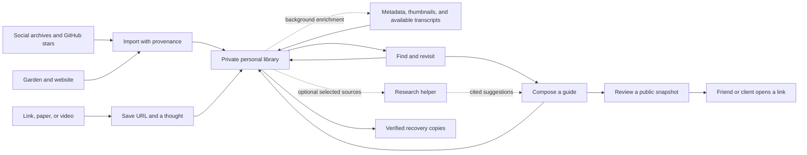
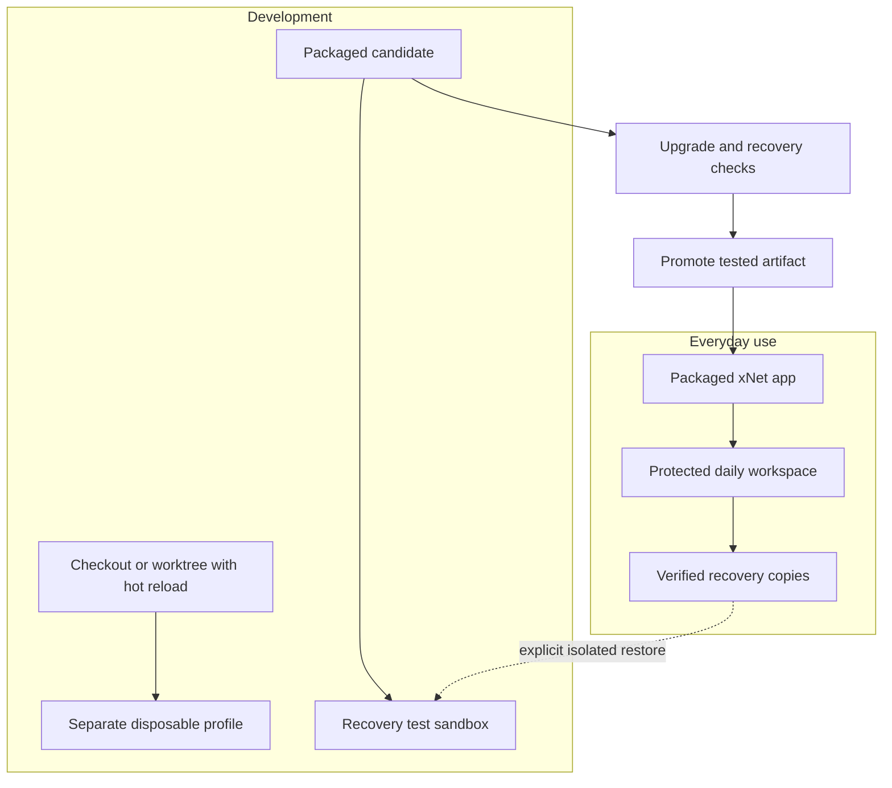
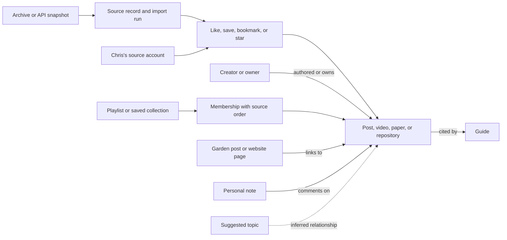
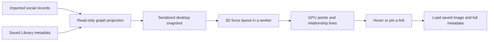
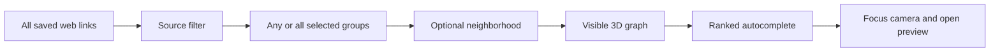

# A personal library for learning and sharing, safe enough to use every day

> [!TIP]
> Build Chris's library from the garden, website, Twitter/X and Instagram exports, YouTube playlists, and GitHub stars. Enrich every imported link with useful metadata and a local thumbnail, and obtain video transcripts wherever possible. Preserve how those things connect, then make them easy to find, annotate, and turn into useful guides. Start with a packaged Mac app whose data survives development and updates.

## Implementation status

A development preview now runs in Electron. It includes native recovery copies, encrypted native export/restore, resumable retained-source imports, a persistent enrichment queue, local thumbnails and retrieved captions, offline Library search, and editable URL-plus-note capture. [Try the preview](../reference/personal-library.md) and review the [storage coverage](../reference/desktop-storage.md) before relying on it.

This is partially implemented. A Developer ID signing certificate is unavailable in this environment, the installed signed-upgrade test is open, and complete settings/key coverage and off-device retention are not verified. Selected real exports are now imported into the development profile. This remains separate from the signed daily-use app and complete enrichment coverage. Successful live managed-helper installation, local transcription, full collection/creator navigation, complete website and overlapping-export reconciliation, guides, publishing, and the human trial remain work. The checklists below distinguish these gaps from the narrower proofs already obtained.

## The job to earn

Chris already collects ideas, builds things, and shares resources. Much of that work has accumulated in social bookmarks, likes, saved videos, playlists, and starred repositories. The first library should bring that existing collection home, alongside the garden and website. A paper saved years ago should help answer a question next month. Notes from several sources should become a guide for a friend, a public page, or an optional resource for a coaching client.

The starting loop is **import → enrich → connect → rediscover**. The daily loop is **save → find → compose → share**. Each step must be useful on its own. Import should preserve the evidence and organization already present. Enrichment should recover the titles, descriptions, images, and spoken content that make a saved link useful. Finding should work with a half-remembered phrase, a creator, or a playlist. Writing should start with notes already at hand. Sharing should give someone a readable link they can open without installing xNet.

There is a prerequisite: Chris must be able to trust the app while changing its code. If using xNet means rebuilding a checkout, watching migrations, or wondering whether an update will erase notes, the library will stay empty. The first milestone is a safe daily desktop installation with a simple update and recovery path.

This exploration records the direction chosen in conversation, the durability concern, and the decision to start with enriched social exports and GitHub stars. Metadata and thumbnails for every link, plus transcripts where obtainable, are core import work. It proposes work; it does not certify the current app as safe for irreplaceable data.

| Choice                    | Direction                                                                                                                                       |
| ------------------------- | ----------------------------------------------------------------------------------------------------------------------------------------------- |
| First personal value      | Learning and sharing                                                                                                                            |
| Starting material         | Garden and website content; Twitter/X likes and bookmarks; YouTube playlists; Instagram saves, collections, and likes; GitHub stars             |
| Existing collection       | Import the available corpus in resumable batches; use a small sample to prove fidelity, not to cap the library                                  |
| Enrichment                | Automatic metadata and local thumbnails for every link; caption retrieval and accessible-media transcription for videos, with measured coverage |
| Primary authoring surface | Packaged Mac desktop app                                                                                                                        |
| First reader experience   | A public page, with no account or installation                                                                                                  |
| AI's role                 | Optional help over deliberately selected sources                                                                                                |
| First trust requirement   | Keep real data safe while the app and its data model evolve                                                                                     |
| Publication destination   | Proposed default: `crs.garden/guides/`; configurable, not a confirmed hosting decision                                                          |

The review date leaves roughly six weeks for initial work and a four-week usage trial. It is a date to reconsider this direction, not a promised delivery date. Chris decides whether to continue, narrow, or stop. Choosing this workflow is reversible. A new persistent format or public compatibility promise needs a separate ADR under the repository's decision policy before implementation.



## Why this fits Chris's work

[crs.land](https://crs.land) connects coaching, software, simulations, body-related resources, food forests, housing, and other experiments. The common activity is making something interesting easier for another person to approach. xNet can support the collection and writing behind those projects without absorbing each project's interface.

[crs.garden](https://crs.garden) already pairs links with personal commentary. Its software and body-related reading shows the shape of a useful source note: a source, a reason to care, and enough context to return later. The garden's existing Bluesky collection flow should keep working. A guide can draw from that material without making xNet the source of every garden post.

[crs.coach](https://crs.coach) describes a practice built around presence and working with the person in front of Chris. That favors a small resource offered at the right moment. It gives little reason to begin with a client dashboard, a habit score, or a prescribed sequence of worksheets. The [nervous-system resource site](https://crs48.github.io/nervous-system-healing/) is another useful precedent: resources have context, and personal experience is distinguished from evidence. A guide should preserve that distinction. This proposal makes no clinical claims about the material.

The adjacent repositories also suggest a clear division of work:

| Existing project                                                        | Keep its job                                       | What xNet contributes                                   |
| ----------------------------------------------------------------------- | -------------------------------------------------- | ------------------------------------------------------- |
| `digitalgarden` / [crs.garden](https://crs.garden)                      | Public browsing and the Bluesky-to-garden pipeline | Draft and export longer guides                          |
| `whole-body-cookbook`                                                   | A purpose-built interactive body atlas             | Notes and source collections that can link to the atlas |
| `feedme`                                                                | Creator support and its own funding model          | Links and context where useful; no new payment system   |
| Simulations and small websites linked from [crs.land](https://crs.land) | Their own visual and interactive experiences       | Research notes and companion reading                    |
| Coaching                                                                | A human relationship and live practice             | Optional, carefully chosen public resources             |

These are observations from public pages and selected local project documents, not evidence that clients want a new app. Friends and clients are initially readers. Test another person's authoring needs separately before treating this as a product for coaches.

## The seed corpus is already here

Chris identified `.exports/` as the local archive directory. A read-only inspection on 2026-09-29 found the three requested social archives below. The directory is Git-ignored. Only archive metadata, selected saved/liked records, playlist CSVs, and structural field shapes were inspected. Nothing was imported, extracted onto disk, sent for enrichment, or changed. Private messages and account-security records were not opened.

| Source                   | Observed local material                                                                                                                      | What the first import must preserve                                                                                                    |
| ------------------------ | -------------------------------------------------------------------------------------------------------------------------------------------- | -------------------------------------------------------------------------------------------------------------------------------------- |
| Garden and website       | Existing public pages and the local `digitalgarden` project                                                                                  | Chris's commentary, original URLs, tags, dates where available, and links to source resources                                          |
| `.exports/twitter.zip`   | 106.7 MiB; 10,028 records in `like.js`; no bookmark-named archive member detected                                                            | Tweet IDs, exported text and links, and the fact these are likes. Bookmark coverage remains unverified                                 |
| `.exports/youtube.zip`   | 5.0 MiB; 33 playlist catalog rows; 32 playlist-video CSVs containing 11,259 membership rows and 9,273 distinct video IDs                     | Playlist identities and names, every membership, row order as exported, and timestamps with their original meaning                     |
| `.exports/instagram.zip` | 423.1 MiB; 7,230 saved-post records, 8,827 liked-post records, 15 saved-collection records; also 74 saved-music and 25 liked-comment records | Separate saves and likes, named collections, nested item relationships, source URLs, captions, and available timestamps                |
| GitHub stars             | Later captured in `.exports/github-stars.json`: 1,514 repositories with native star times                                                    | Repository identity and URL, owner, description, available topics/language, and the star relationship with its timestamp when supplied |

These counts describe the source files. They do not establish how many unique resources will import successfully. For example, one YouTube video can belong to several playlists. The difference between 33 catalog entries and 32 membership files needs a reconciliation report; it must not be guessed away as either data loss or empty playlists.

The YouTube membership CSVs contain video IDs and playlist-video timestamps, without video titles or descriptions. The Twitter likes contain `tweetId`, `fullText`, and `expandedUrl`, without a like timestamp. Preserve those limits. Import time is not save time, and a video's presence in a playlist is not evidence that Chris watched it.

Other archives are present for TikTok, Reddit, and AI chat services. Keep them intact and available for later selected imports through existing adapters. The first acceptance run covers the garden, website, Twitter/X, YouTube, Instagram, and GitHub. It does not silently ingest every category in every archive.

> [!IMPORTANT]
> The full saved-resource corpus is now core scope. The earlier suggestion of about 25 hand-picked resources becomes a small validation sample from the real archives. It is not a substitute for importing the rest.

## What the repository says, and what the code says

The research inventoried 525 numbered exploration documents, then followed the roadmap, graph queries, relevant explorations, and their implementation paths. It did not read every document line by line. Code observations below refer to commit `fbedf30e7`, inspected on 2026-09-29. Filename checkboxes were treated as leads, not proof of a finished experience. This pass changed documentation only. The desktop recovery and update paths were inspected, not exercised end to end.

The [roadmap](../ROADMAP.md) already makes founder daily use the near-term test. Its emphasis is the agent-assisted workspace. This proposal gives that platform a concrete daily job and puts local recovery before reliance on it. It fits the ownership commitments in the [charter](../CHARTER.md) and the quiet product experience in [VIBE](../VIBE.md). The website's [roadmap data](../../site/src/data/roadmap.ts) and the repository roadmap should be reconciled after this direction earns acceptance through use.

| Area                 | Status from inspection                                                                                                                                                                          | Consequence for this plan                                                              |
| -------------------- | ----------------------------------------------------------------------------------------------------------------------------------------------------------------------------------------------- | -------------------------------------------------------------------------------------- |
| Pages, folders, tags | ✅ Existing [Page schema](../../packages/data/src/schema/schemas/page.ts) and organization work                                                                                                 | Start with ordinary Pages; avoid a new knowledge model                                 |
| Capture              | 🚧 The [quick-capture tray](../../packages/workbench/src/views/tray.tsx) is oriented around tasks and page navigation                                                                           | Add a small, durable resource capture flow                                             |
| URL handling         | ✅ [External-reference helpers](../../packages/data/src/external-references.ts) exist                                                                                                           | Reuse URL handling; keep personal commentary in a Page                                 |
| Search               | 🚧 [Page search](../../packages/workbench/src/hooks/usePageSearchSurface.ts) reads document bodies; [store FTS extraction](../../packages/data/src/store/indexing/full-text.ts) uses properties | Verify the actual capture-to-search path; do not assume all retrieval sees note bodies |
| AI                   | 🚧 [Graph retriever](../../packages/workbench/src/views/ai-graph-retriever.ts) and agent tools exist                                                                                            | Start with explicit selected Page bodies and visible citations                         |
| Static publication   | 🚧 [Renderer and site builder](../../packages/publish/src/site.ts) exist                                                                                                                        | Finish the author-to-export flow and its privacy boundary                              |
| Portable data        | 🚧 [Bundle format and ports](../../packages/data/src/portability/types.ts) cover signed changes, optional blobs, and optional Yjs documents                                                     | Existing export code needs complete desktop wiring and a restore proof                 |
| SQLite snapshots     | ✅ [`xnet data snapshot`](../../packages/cli/src/commands/data.ts) uses `VACUUM INTO`                                                                                                           | Reuse the snapshot capability inside a complete backup flow                            |
| Desktop updates      | 🚧 [Updater](../../apps/electron/src/main/updater.ts) downloads and installs releases                                                                                                           | Add a verified data checkpoint and coordinated shutdown before installation            |
| Development profiles | 🚧 [Worktree scoping](../../apps/electron/scripts/dev-scope.mjs) exists; the main checkout keeps `default`                                                                                      | Protect daily data from every development launch, including the main checkout          |
| Startup recovery     | 🛑 [Data-service initialization](../../apps/electron/src/data-process/data-service.ts) deletes an unversioned database, or deletes after an inspection exception                                | Remove this behavior before moving irreplaceable notes into the app                    |

> [!WARNING]
> The startup deletion path is a concrete blocker. An old format, an unreadable database, and a new empty workspace must produce different outcomes. None is permission to delete the user's files.

The social imports have a substantial foundation, but the actual archive shapes reveal gaps:

| Existing code                                                                                                                            | Evidence and remaining work                                                                                                                                                                                                                                                                                |
| ---------------------------------------------------------------------------------------------------------------------------------------- | ---------------------------------------------------------------------------------------------------------------------------------------------------------------------------------------------------------------------------------------------------------------------------------------------------------- |
| [Importer registry](../../packages/social/src/importers/registry.ts)                                                                     | Twitter/X, YouTube, and Instagram adapters are registered. GitHub stars are absent                                                                                                                                                                                                                         |
| [Twitter adapter](../../packages/social/src/importers/x.ts)                                                                              | Maps likes and several other archive categories; no bookmark bucket is defined. Add bookmark support against a supplied format rather than relabeling likes                                                                                                                                                |
| [YouTube adapter](../../packages/social/src/importers/youtube.ts)                                                                        | Maps playlist catalogs and memberships. Reconcile the real files, preserve repeated memberships, and make sparse video records useful                                                                                                                                                                      |
| [Instagram adapter](../../packages/social/src/importers/instagram.ts)                                                                    | Creates a collection per saved file and reads shallow labels. The real collection records contain nested item-shaped `dict` arrays; these need proper named-collection and membership mapping. The real liked-comments file is wrapped in `likes_comment_likes`, while the current mapper expects an array |
| [Social schemas](../../packages/social/src/schemas/index.ts)                                                                             | Already model content, actors, interactions, collections, membership, import runs, and source records. Reuse them                                                                                                                                                                                          |
| [IDs](../../packages/social/src/import/ids.ts) and [commit policy](../../packages/social/src/import/policy.ts)                           | Deterministic IDs and batched commits exist. Some IDs depend on paths, positions, or interaction kinds; cross-export reconciliation still needs proof. Default source-record mode is `sidecar`; verify actual retention, not only its count                                                                |
| [Import jobs](../../packages/social/src/import/jobs.ts) and [desktop import IPC](../../apps/electron/src/main/social-import-ipc.ts)      | Progress, cancellation, and checkpoint records exist. Prove restart/resume and complete backup coverage with these archives                                                                                                                                                                                |
| [Graph lenses](../../packages/social/src/lenses/graph-lenses.ts) and [canvas projection](../../packages/social/src/projection/canvas.ts) | Saved-content-by-creator and bounded graph projection primitives exist. Wire useful Library views rather than building a separate graph store                                                                                                                                                              |

The GitHub addition can reuse [ExternalItem](../../packages/data/src/schema/schemas/external-item.ts) for a repository's stable external identity and payload. The social vocabulary currently lacks a GitHub platform entry. Choose one canonical repository representation and connect the star activity to it; avoid creating disconnected repository copies in two schema families.

This extends [0152: social importer](./0152_%5Bx%5D_ACTUAL_SOCIAL_GRAPH_IMPORTER.md), [0153: social workspace](./0153_%5Bx%5D_SOCIAL_DATA_WORKSPACE_UI.md), and [0419: social graph atlas](./0419_%5B-%5D_SOCIAL_GRAPH_ATLAS.md). Their primitives are useful; their filename status does not establish fidelity for these specific archives.

<details>
<summary>Durability findings and the files behind them</summary>

The desktop opens two database paths. [Main-process setup](../../apps/electron/src/main/index.ts) sends `xnet-data/data.db` to the data utility process. [Storage IPC](../../apps/electron/src/main/ipc.ts) also opens `xnet-data/xnet.db` through a [blob storage adapter](../../apps/electron/src/main/storage.ts). A backup of one SQLite file is not yet proof of a complete desktop backup. Trace all live writers before deciding which paths are authoritative.

In `data-service.ts`, an existing database is opened to inspect its schema version. Version zero causes deletion of the database, WAL, and SHM files. The surrounding catch also attempts deletion. In the [Electron SQLite adapter](../../packages/sqlite/src/adapters/electron.ts), `getSchemaVersion()` maps any query error to zero. This compounds the problem: an inspection failure can look like an obsolete format.

The adapter sets `synchronous = NORMAL`. Its `applySchema()` returns without applying DDL when the existing version is greater than or equal to the requested version. That is not a refusal to write a database from a newer app. The factory applies the current DDL; the presence of [migration SQL helpers](../../packages/sqlite/src/schema.ts) alone does not establish a tested desktop upgrade chain.

The [updater](../../apps/electron/src/main/updater.ts) sets `autoDownload = false` and `autoInstallOnAppQuit = true`. Its install paths call `quitAndInstall()`. [Main-process shutdown](../../apps/electron/src/main/index.ts) has asynchronous cleanup in a `before-quit` listener, but that listener does not prevent quit and explicitly resume it after an acknowledged flush. [Data-process shutdown](../../apps/electron/src/main/data-process-manager.ts) requests shutdown and can then kill the process. These paths need a tested barrier that waits for the renderer's final edits, persistence, and backup completion.

The [identity seed](../../apps/electron/src/main/identity-seed.ts) is now random and stored per profile, using platform encryption when available. Invalid stored seeds fail loudly. Older exploration 0335's deterministic-key finding is therefore stale. A machine-bound encrypted seed file still needs a separate recovery design for restoring onto a new Mac.

The [portable bundle API](../../packages/data/src/portability/types.ts) makes blob and Yjs ports optional. A valid signed bundle can contain no document bodies when its caller omitted that port. The [store Yjs port](../../packages/data/src/portability/store-yjs-port.ts) also needs comparison with the desktop's actual document/update persistence path. Manifest verification and complete workspace recovery are different checks.

The [release workflow](../../.github/workflows/electron-release.yml) already builds desktop artifacts, checks native packaging, and has a nightly packaging run. Nightly runs do not publish updates. The workflow supports Developer ID signing and notarization when configured, and a self-signed fallback. This research did not inspect release secrets or prove that two installed releases update smoothly on Chris's Mac.

</details>

<details>
<summary>Explorations to reuse, and scope to defer</summary>

| Existing exploration                                                                                                                                                                                                                   | Use here                                                                                                         |
| -------------------------------------------------------------------------------------------------------------------------------------------------------------------------------------------------------------------------------------- | ---------------------------------------------------------------------------------------------------------------- |
| [0105: what to work on next](./0105_%5B_%5D_WHAT_TO_WORK_ON_NEXT_AFTER_OPEN_SOURCE_LAUNCH.md)                                                                                                                                          | The daily-use question has recurred; settle it with a small real trial                                           |
| [0112: universal clipper](./0112_%5B_%5D_UNIVERSAL_CLIPPER_AND_AI_KNOWLEDGE_GRAPH_INGESTION.md)                                                                                                                                        | Reuse capture intent; include metadata, thumbnails, and obtainable transcripts; defer automatic entity inference |
| [0169: folders and tags](./0169_%5Bx%5D_CONTENT_ORGANIZATION_FOLDERS_TAGS_AND_CHANNELS.md)                                                                                                                                             | Reuse organization already present                                                                               |
| [0179: spaces and sharing](./0179_%5B_%5D_SPACES_GROUPS_AND_UNIFIED_SHARING.md)                                                                                                                                                        | Revisit for private collaboration after public reader value is proven                                            |
| [0180: experiment journal](./0180_%5B_%5D_EXPERIMENT_JOURNAL_AND_HABIT_TRACKER.md)                                                                                                                                                     | Keep available; it is not the selected daily job                                                                 |
| [0344: portability](./0344_%5Bx%5D_FIRST_CLASS_DATA_EXPORT_IMPORT_AND_PORTABLE_BUNDLES.md)                                                                                                                                             | Use the export/import primitives, then prove desktop completeness                                                |
| [0362: publishing](./0362_%5B_%5D_PUBLISHING_ON_XNET_GHOST_SUBSTACK_AND_THE_OWNED_AUDIENCE.md)                                                                                                                                         | Finish one small route to a public guide                                                                         |
| [0379: knowledge base](./0379_%5B_%5D_A_KNOWLEDGE_BASE_ON_XNET_PRIMITIVES_DISTILLATION_BURSTS_AND_THE_GOVERNED_CORPUS.md) and [0391: daily AI interface](./0391_%5Bx%5D_XNET_AS_THE_DAILY_DRIVER_AI_INTERFACE.md)                      | Reuse retrieval work; check later implementation before repeating old gaps                                       |
| [0406: shared shell](./0406_%5Bx%5D_ONE_SHELL_TWO_SURFACES_ENDING_THE_DESKTOP_WEB_UI_FORK.md)                                                                                                                                          | Put the Library experience in the shared workbench                                                               |
| [0413: worktree desktop development](./0413_%5B-%5D_PLURAL_ELECTRON_WORKTREE_SCOPED_DESKTOP_DEV.md)                                                                                                                                    | Extend profile isolation to a protected daily installation                                                       |
| [0430: risk-adjusted engineering](./0430_%5B-%5D_RISK_ADJUSTED_ENGINEERING_READING_ASTERISK_14.md)                                                                                                                                     | Give upgrade checks a consumer, a pass condition, and proof they can fail                                        |
| [0455: plugin composition](./0455_%5B-%5D_CORDIS_LESSONS_FOR_XNET_PLUGIN_COMPOSITION.md), [0456: agent door](./0456_%5B-%5D_ENTRY_VECTOR_THE_AGENT_DOOR_FIRST.md), and [0457: site](./0457_%5B-%5D_AGENT_FIRST_SITE_REARCHITECTURE.md) | Preserve completed agent work; use this library as a concrete human workflow to validate                         |

</details>

## Choose a desktop home for the library

| Option                                          | Useful property                                       | Cost for this use case                                                      | Decision                               |
| ----------------------------------------------- | ----------------------------------------------------- | --------------------------------------------------------------------------- | -------------------------------------- |
| Packaged Electron app with protected daily data | Local files, OS integration, existing release updater | Must finish recovery and prove upgrades                                     | **Primary path**                       |
| Run the library from a development checkout     | Fast iteration with hot reload                        | Branch changes and experiments become data risks; too much daily ceremony   | Use for development with separate data |
| Browser app / PWA                               | Easy access and web delivery                          | Browser storage policy and recovery add uncertainty for the only local copy | Keep as a later authoring option       |
| Markdown files as the primary store             | Easy to inspect and copy                              | Would require a new editing/sync contract and abandon useful existing work  | Offer readable export as an exit path  |

[MDN's persistent-storage API](https://developer.mozilla.org/en-US/docs/Web/API/StorageManager/persist) lets a browser request protection from automatic eviction; the browser may refuse. That is useful for a future web authoring surface, but it does not replace a backup. A public guide can be an ordinary website regardless of where it was authored.

For Chris, the normal experience should be: open xNet from Applications, save something, close it when done. A release can arrive in the background. Installing it should require at most a short restart, with notes and identity intact. No terminal, package install, checkout selection, or manual data conversion should be part of using the library.

## A durability promise with clear limits

“Local-first” describes where work happens. Trust also requires a clear answer to what survives a crash, a bad release, a mistaken deletion, and the loss of the Mac.

The following is the proposed contract to implement and test. It is not a guarantee the current build already makes.

| Failure                               | Intended protection                                                                                          | Honest boundary                                                                                |
| ------------------------------------- | ------------------------------------------------------------------------------------------------------------ | ---------------------------------------------------------------------------------------------- |
| App crash or forced quit              | Every edit acknowledged as **Saved on this Mac** has reached durable storage, including its document content | Text still marked **Saving…** may be lost                                                      |
| Power loss                            | Durable transactions and flushed data before the saved acknowledgement                                       | Subject to filesystem and hardware guarantees; prove the configured path and test interruption |
| Bad app update or migration           | A complete verified checkpoint of the old workspace and a retained compatible app version                    | Recovery must preserve any edits made after the update too                                     |
| Accidental deletion or bad agent edit | Retained recovery points, plus existing history where applicable                                             | History and sync can carry mistakes; neither replaces independent copies                       |
| Failed disk or lost Mac               | A completed encrypted backup on another device or storage service, with usable recovery material             | A second folder on the same disk does not cover this failure                                   |
| xNet development stops                | Portable bundle plus a readable Markdown/assets export                                                       | A readable export can omit protocol history; say exactly what each export contains             |

The saved acknowledgement needs a path from the editor through Yjs persistence and the data process to the completed transaction. Updating React state or sending an IPC message is too early. If writing fails, retain the unsaved text, show the failure, and allow a copy/export.

[SQLite's WAL documentation](https://sqlite.org/wal.html) distinguishes integrity from power-loss durability: `NORMAL` omits a sync on each commit, while `FULL` syncs the WAL at commit. Use `FULL` as the starting point for the daily desktop store and measure its cost. Batch edits where appropriate, keeping **Saving…** visible until the batch commits. Do not promise that every keystroke has reached disk before it has.

### Three useful forms of recovery

| Form                                              | Main job                                                | Required proof                                                                   |
| ------------------------------------------------- | ------------------------------------------------------- | -------------------------------------------------------------------------------- |
| Native workspace checkpoint                       | Recover quickly from a bad desktop update               | Reopen with the compatible app, with notes, blobs, and identity intact           |
| Full `.xnetpack` plus encrypted recovery material | Move or recover data independently of one SQLite layout | Restore into an empty isolated workspace with all expected content and ownership |
| Markdown, source URLs, and assets                 | Read and reuse the collection without xNet              | Open outside xNet; list anything omitted                                         |

Reuse the existing bundle and snapshot machinery. The missing product is automatic creation, a complete content inventory, verification, retention, and a usable Restore action.

A native checkpoint must cover the workspace consistently: both live database stores where applicable, document states and pending updates, referenced blobs, custom schema definitions, and the identity/encryption material needed to open them. Include app and storage versions in its manifest. Distinguish required data from rebuildable search indexes, caches, and window preferences. Account for data outside `xnet-data` before claiming the inventory is complete.

At checkpoint time, pause new writes, drain every writer, and capture a consistent set. SQLite's [Online Backup API](https://www.sqlite.org/backup.html) can make a consistent database copy; the existing `VACUUM INTO` path is another available primitive. Copying only a live main database file can omit committed WAL content. Keep the live database on a local filesystem. Send completed immutable archives to a backup destination after they are closed and verified.

For a full portable backup, require the desktop blob and Yjs ports. Compare its manifest against the frozen workspace inventory. Missing bodies or attachments must fail completeness validation even if the bundle's signatures are valid. Verify checksums and restore into a temporary workspace with network access disabled. Delete no previous good backup until the replacement is complete.

Platform-encrypted keys are useful on the current Mac. Recovery on a new Mac must also work without the old Keychain. Design an encrypted recovery kit that covers the actual signing and content keys, with a recovery secret Chris can store separately. Never put plaintext keys in an ordinary cloud-synced export. A wrong secret, missing key, or unreadable seed must stop recovery without silently making a new identity.

### Small, visible backup policy

Proposed initial defaults: make a local checkpoint every 15 minutes while data has changed, on the next launch when overdue, and before each update or storage migration. These are targets for a healthy running app, not a claimed loss bound after failed backups. Keep recent points for a day, daily points for a week, and weekly points for a month. Pin the last good pre-migration checkpoint and its app-version reference until the replacement has been verified and retained long enough to recover.

Bound disk use, deduplicate immutable blobs where practical, and report lack of space. Pruning must never erase the last verified recovery point to make room for an unverified one. Start with full recoverable points; incremental chains add another recovery dependency and can wait.

Let Chris choose an off-device destination once. Show local recovery and off-device backup as separate facts: **Recovery copy: 3 minutes ago** and **External backup: yesterday**. Without a completed external copy, say **Backed up on this Mac only**. Do not require a hosted xNet account for local use. An existing backup service can carry closed archives; the app must distinguish writing an archive locally from confirmed off-device protection.

## Updates that preserve the work

The app binary and the workspace have separate lifetimes. An update can replace the app without moving or replacing the user's home for data. Data conversion happens only when the storage format actually needs it.

```mermaid
sequenceDiagram
    actor Chris
    participant App as Daily app
    participant Data as Workspace writers
    participant Backup as Recovery manager
    participant Next as Updated app
    Chris->>App: Restart to update
    App->>Data: Pause writes and flush all edits
    Data-->>App: Durable flush acknowledged
    App->>Backup: Create and verify complete checkpoint
    Backup-->>App: Recovery point ready
    App->>App: Hand control to installer
    Next->>Backup: Inspect versions before opening writable stores
    alt Format unchanged
        Next->>Data: Open existing workspace
    else Supported migration
        Next->>Backup: Migrate a candidate copy and validate
        Backup-->>Next: Candidate passed
        Next->>Data: Atomically select candidate generation
    else Unknown format or verification failure
        Next-->>Chris: Recovery view; original files preserved
    end
```

The updater should download while Chris works and offer a calm restart action. Every install path, including install-on-quit, must use the same safety barrier. If a fresh checkpoint cannot complete, postpone installation and leave the current app usable. Do not reinterpret a failed update check as “up to date.” Use explicit outcomes for offline, unavailable, failed, available, and current.

The shutdown barrier belongs before the installer closes the renderer. Awaiting an async event listener alone is insufficient. The app must hold the quit event, drain writes, verify the checkpoint, and then resume the one approved installation or quit. Test an edit made immediately before that action.

On startup, first probe compatibility without migrating or opening the store for writes. A supported old workspace goes through an explicit migration chain on a candidate copy. Check integrity, content counts, attachment hashes, representative document rendering, and identity continuity. Switch a small active-generation pointer only after the candidate passes. Make that switch crash-safe and resumable. Retain the untouched source generation. An unversioned workspace enters an import/recovery path; an unreadable one is preserved for diagnosis.

Do not run the new app's normal writable database factory just to inspect compatibility. The version check must precede DDL, write pragmas, and any cleanup that changes the source.

### Format changes should be uncommon and explicit

| Versioned thing            | What it means                         | Policy                                                                                |
| -------------------------- | ------------------------------------- | ------------------------------------------------------------------------------------- |
| App release                | UI and behavior                       | Most releases should open the same data unchanged                                     |
| SQLite storage layout      | Tables, columns, indexes              | Ordered, transactional migrations on a candidate copy                                 |
| Node schema                | Meaning of stored fields              | Additive changes first; explicit conversion or read adapters for old data             |
| Yjs/editor document format | Rich-text content and embedded blocks | Preserve unknown content; never discard an old block while loading                    |
| Bundle and sync protocol   | Data exchange and portable recovery   | Follow [compatibility policy](../COMPATIBILITY.md); reject unsupported writes clearly |

Preserve original signed records. Schema evolution can add a conversion or a new view of old content without rewriting history as if it always had the new meaning. Unknown schema data should remain recoverable, even if the current UI can only show a read-only fallback. Avoid a new source-note schema in the first place: ordinary Pages lower the migration burden for this workflow.

### Rollback must not erase newer notes

Rolling back the binary is safe only when the older app can read the current workspace. Otherwise the recovery unit is the old app plus its compatible checkpoint. The failed candidate and any later edits remain preserved.

If Chris has added notes since updating, never silently point the old app at yesterday's data. Show the recovery point's time and the later work at risk. Offer a supported replay/export of that work, or keep it in a separate recoverable generation until a fix is available. Restoring a checkpoint is not an inverse migration. Keep network sync disabled during validation and recovery; reconnect deliberately after resolving the current state so stale restored data does not surprise other peers.

The recovery view must open before normal workspace startup, so a broken migration cannot hide the Restore action. If the new app binary itself cannot launch, provide a way to reinstall the last compatible signed build without a terminal. Reinstalling that build must still preserve all workspace generations and leave any data rollback explicit.

## Using and developing xNet at the same time



Use one packaged daily app with a stable data path independent of repository location, branch, and build version. Every development launch gets separate storage, including launches from the main checkout. Worktree scoping already handles much of this; close the default-profile gap and refuse accidental development access to the protected workspace. Verify actual resolved paths rather than assuming a profile name proves isolation.

Adopting an existing profile needs a one-time, backed-up transition that preserves its identity and data. Do not change a path and quietly show an empty library. Make the selected workspace clear, and never merge profiles merely because their names look similar.

Develop UI changes with the existing Electron hot-reload and cached-build workflow. Build a packaged candidate only when validating a release. Use the existing release pipeline to produce daily-app updates, then promote a tested artifact without asking Chris to rebuild it locally. If faster access is useful, offer an explicit early-release channel using the same recovery checks. There is no need for a second installer system.

A test copy of real data must start with network sync, background agents, and public serving disabled before any document opens. Keep identity keys inside the isolated recovery test when continuity must be verified; do not let a duplicated identity act as a second live client. Ordinary development should use synthetic data and a separate identity.

Stable signing is part of convenience. Electron documents that [code signing](https://github.com/electron/electron/blob/main/docs/tutorial/code-signing.md) matters for macOS updating and Keychain behavior. Test the installed release-to-release path, including access to existing encrypted identity material. The repository currently declares electron-updater 6.x and electron-builder 25.x; current [builder documentation](https://www.electron.build/docs/features/auto-update/) describes newer APIs too. Match implementation to the locked versions rather than copying a current example blindly.

## The library: useful in the first minute

After the recovery milestone, import the saved-resource corpus from `.exports/`, the garden and website, and a GitHub star snapshot. First validate a small sample that includes each platform and its awkward cases, then process the full selected categories in bounded batches. Create two guide drafts from rediscovered sources. Success includes making past collecting useful immediately.

The Library entry point offers **Inbox**, **Resources**, **Collections**, and **Guides**. Use existing folders and tags for Pages, and project imported social content and collections into the same Library. Do not turn every like into a blank Page. Inbox means “saved for later”; it is not a queue that demands completion. An imported resource can remain a source record until Chris wants to add a note.

### Import the history without flattening it

Keep the original archives unchanged. Record an archive hash, account identity, export date when supplied, parser version, selected categories, and the source file and record for each imported fact. Preserve raw selected records and nested fields so better parsers can recover more later. Unknown shapes must appear in the report as unsupported or quarantined, with their source bytes retained.

The import preview should answer: what is here, what will become searchable, what could not be read, and how much space the import and its backup need. Select saved resources, likes, stars, and collections for this workflow. Direct messages, account-security data, ad records, and watch/search history remain separate choices. Public source content does not make Chris's saving activity public.

Reuse the existing import stream and write records in batches. Commit bounded chunks and persist the last committed checkpoint, tied to archive hash, parser version, and selection. A restart must resume safely or offer an explicit replay. Cancellation reports what was committed; it is not completion. The report must account for every selected input record: created, updated, duplicate, skipped with a reason, or failed. Unsupported and missing categories must never look like an empty successful import.

Treat archive content as data. Parse Twitter's JavaScript assignment wrapper without executing it, and apply size and path limits when reading ZIP entries. Keep personal archive contents out of Git, fixture files, and routine logs. Commit only sanitized structural fixtures; detailed local reconciliation reports remain private.

Reimporting the same archive must add no duplicate resources, activity, or collection memberships. A later export should add new observations without overwriting personal notes or discarding old evidence. Reordered files and repeated playlist entries are real cases. Do not assume a deterministic ID based on row position solves them. A resource absent from a later partial export must not be treated as deleted, unliked, or unstarred.

The garden and website need their own source mapping. Preserve Chris's authored commentary as Pages, and link its source URLs to imported resources. Preserve stable post IDs where available, otherwise retain URL aliases and snapshot provenance. Keep a third-party resource's content separate from Chris's writing about it. The existing garden pipeline keeps its own source of truth.

### Add GitHub stars through the same import boundary

GitHub is a first-class seed source. Since there is no local star export yet, provide a one-time read-only fetch for the selected account or accept a saved JSON snapshot. GitHub's [starring API](https://docs.github.com/en/rest/activity/starring) lists starred repositories and offers a custom media type containing the star timestamp. Fetch every response page. If permissions or rate limits stop the fetch, mark the snapshot incomplete.

Save the response as a local import source with fetch time and coverage information, excluding credentials. The rest of ingestion uses the same preview, provenance, deduplication, and recovery path as ZIP exports. No continuous sync or repository cloning is required for the seed import.

Use stable repository IDs when supplied, keeping owner/name and old URLs as aliases across renames. Preserve `star` as the native action, distinct from a social like or follow. Reuse the existing content/external-item and interaction schemas with an explicit GitHub mapping; review any vocabulary extension for compatibility. If star lists or categories are supplied, preserve them as collections; the basic REST star list does not by itself prove that grouping was captured.

The description, topics, language, owner, and URL make a star useful immediately. Fetch README text and an available social preview as part of enrichment; repository cloning is unnecessary. Match accounts before a fetch; an inaccessible or private profile must not be reported as having no stars.

### The graph should explain why things belong together

Use the existing social graph as the durable source of imported facts, with ordinary Pages for notes and guides. A resource is the thing Chris saved; a like, save, star, or playlist membership is a separate observation about it. Keep every observation when matching the same resource across collections or platforms.



Start with relationships the source actually supplies: saved by, liked by, starred by, belongs to collection, authored by, and links to. Keep a post that links to a paper separate from the paper itself. Match platform items by stable platform IDs; use conservative URL aliases to connect references. Shared titles or similar creator names are not enough to merge identities.

The same Instagram post can be both liked and saved. The current mapper includes the interaction kind in the content ID, so this needs an explicit resolution layer. Preserve old IDs and signed history while connecting equivalent resources; do not rewrite past records to manufacture a clean graph. Human notes remain separate from imported fields so later imports cannot overwrite them.

Concepts and related-topic edges can grow over time through Chris's tags and optional enrichment. Each inferred relationship carries its evidence, method/model, and review state. Show it as a suggestion that can be rejected. A liked post, watched video, or starred repository does not establish a belief, an endorsement, or use of that software.

Offer useful entry points before a whole-library graph: collections, saved items by creator, repositories by topic, and a small neighborhood around the open resource. Reuse the [saved views](../../packages/social/src/views/defaults.ts), graph lenses, and bounded canvas projection. Show when a result is paginated or truncated. A large map is optional; browsing relationships and answering a real question are required.

Initial questions to make possible include “What did I save about this topic across platforms?”, “Which playlists contain this video?”, and “Which starred repos relate to this garden post?” An answer must open the underlying resource and show where the connection came from. If there is not enough text or evidence, say so.

### Enrichment is part of importing

Every unique imported link enters an enrichment job. This applies to the full corpus and to new captures, including ordinary web links. Chris should not have to open each card or select thousands of items to get useful titles and images. Saving the source record remains immediate and works offline; queued enrichment continues when the network returns. A durable import and a fully enriched library are separate milestones shown in the UI.

| Resource                         | Metadata to seek                                                                            | Visual preview                                                                 | Searchable content                                                                        |
| -------------------------------- | ------------------------------------------------------------------------------------------- | ------------------------------------------------------------------------------ | ----------------------------------------------------------------------------------------- |
| YouTube video                    | Full title and description, channel, publication date, duration, language, canonical ID/URL | Best usable source thumbnail, cached locally                                   | Description plus available captions or generated transcript                               |
| Instagram post or reel           | Written caption, creator, permalink, post date, media type and carousel structure           | Source image or video poster; a local frame if needed and media is available   | Written caption plus speech transcript for accessible video/audio                         |
| Twitter/X post                   | Full available post text, author, date, and outbound links                                  | Attached image or video poster when available                                  | Post text and metadata for linked resources                                               |
| GitHub repository                | Name, owner, description, topics, language, canonical ID/URL                                | Repository social preview when obtainable; otherwise a labeled repository card | Description and fetched README text                                                       |
| Garden, website, and other links | Page title, description, author/date where supplied, canonical URL and site                 | Source preview image, then a site icon or labeled card                         | Existing authored text and available page metadata; extracted article text when supported |

“All links” is the coverage target. It cannot mean that every provider will return every field. Each applicable field needs a value, an explicit pending/retry state, or a recorded reason it could not be obtained. An Instagram written caption is distinct from its video's spoken transcript. A synthetic card title derived from a caption must be labeled as derived, not presented as an original video title.

#### Provider strategy

For YouTube metadata, use the [Data API's `videos.list`](https://developers.google.com/youtube/v3/docs/videos/list) with video IDs and the relevant parts. It returns titles and descriptions and supports multiple IDs per request. Reconcile every requested ID against the response. An omitted video needs an unresolved/unavailable outcome, not an empty success. Use a managed provider credential when required; the desktop setup should not require a terminal. oEmbed or public page metadata can provide a limited fallback, but a title and thumbnail alone do not satisfy description coverage.

For transcripts, prefer an existing caption track, including automatic captions when that is all the source offers. Preserve track language, timing, and whether the text was human-authored or machine-generated. YouTube's official [caption download API](https://developers.google.com/youtube/v3/docs/captions/download) requires permission to edit the video, so it cannot be the general solution for Chris's saved third-party videos.

Evaluate a maintained local extractor such as [yt-dlp](https://github.com/yt-dlp/yt-dlp/blob/master/README.md) behind a replaceable provider adapter. It supports subtitle discovery and fetching without downloading the video. Prove its behavior on a representative sample before a large run; pin the tested helper version and report provider failures. The existing guessed-language timed-text fetcher is a starting seam, not a proven archive-wide caption service. Discover available tracks rather than treating a failed English request as proof that no captions exist.

For Instagram, preserve the exported captions and nested metadata first, then resolve missing public metadata and posters through a tested provider. The upstream [Instagram extractor](https://github.com/yt-dlp/yt-dlp/blob/master/yt_dlp/extractor/instagram.py) is one candidate for a local adapter, not a guarantee that every saved reel is accessible. Meta's current documentation endpoints returned HTTP 429 during this research; exact official API coverage still needs verification against the chosen account and content types. Do not assume an embed response contains full text, speech captions, or downloadable media.

If no usable caption track exists, offer automatic speech recognition over media already in the archive or otherwise accessible through the configured provider. Prefer the existing local engines, reusing [recording transcription](../../packages/recordings/src/transcribe/transcribe.ts) where its audio-processing contract fits. This fallback belongs in the first enrichment implementation for both YouTube and Instagram. A remote transcription provider is optional and needs an explicit budget/data-sharing choice. If the media cannot be accessed, retain an honest unavailable transcript state. Do not bypass private-content restrictions or silently extract browser credentials.

Metadata lookup for the selected import is enabled by default under this requested workflow. Show the provider choices once, allow pause and retry, and keep paid services or account access explicit. No prompt is needed for every public link. Full article parsing can expand by provider; embeddings and model-generated topic clusters can wait. Captions, descriptions, and local thumbnails cannot.

#### Thumbnails that remain useful

Store thumbnail bytes in the managed blob store. An expiring CDN URL is provenance, not an offline image. Prefer a clear source thumbnail or poster with enough resolution for a large card, within a fixed byte and dimension budget. Keep its aspect ratio and offer sensible crops in the UI. For a carousel, retain the lead image and references to the other supplied media. If accessible local video has no poster, derive one and label its origin.

When no image is available, show a deliberate resource card using a title, source identity, and icon. Record this as a fallback so it does not inflate fetched-thumbnail coverage. Do not generate an invented image that might be mistaken for the source. Distinguish absent images from a failed or interrupted image download.

Validate content type, size, and decoded dimensions before accepting a fetched image. Reuse URL validation for redirects and avoid treating archived URLs as permission to fetch arbitrary local-network resources. Deduplicate by content hash, keep the last good preview when refresh fails, and retry expired source URLs through their provider. Cache small display variants if needed for fast grids. Backups must include the image blobs, not just their URLs. Publishing only includes the images selected in the guide preview.

#### A persistent queue for the whole corpus

The current [enrichment queue](../../packages/social/src/enrichment/queue.ts) is scoped to a session. The [shared feed hook](../../packages/views/src/social-enrichment/useSocialFeedEnrichment.ts) requests previews visible on screen and loads a limited set of enrichment rows. The [fetch path](../../packages/social/src/enrichment/fetch.ts) depends on a hub for platforms without its direct oEmbed path. These pieces do not yet meet full-corpus, restart-safe desktop enrichment.

Add durable work items keyed by resource identity, capability, provider version, and language where relevant. Capabilities include metadata, thumbnail bytes, caption discovery, transcript fetch, local transcription, and indexing. Deduplicate work across likes, saves, and playlists; the observed 11,259 YouTube memberships should not fetch the same 9,273 video IDs repeatedly. Cover the entire corpus through paginated queries, not the first screen or the first 2,000 rows.

Use bounded concurrency per provider, backoff, `Retry-After` where supplied, and persisted retry times. Pause across sleep, offline periods, app quit, or a run of refusals. Resume without redoing completed work. An unavailable credential or blocked provider should leave actionable queued work; it must not classify thousands of videos as having no captions. Prioritize recently opened resources while the rest of the corpus continues in the background.

Run network work in a desktop background process so a purely local workspace can enrich without hosting a hub. Keep provider helpers separate from storage migration. Store attempt history and last successful results, and make changed extractor versions eligible for controlled retry. Installing a new app version should preserve queue progress and previously indexed material.

Budget the expensive fallback separately. Discover metadata and existing captions before downloading audio. Estimate remaining audio duration and storage from a sample, limit local transcription concurrency, and keep the app responsive while work runs. Temporary media can be discarded after verified transcription under the chosen retention policy; the full transcript and its provenance stay in the library. Do not promise that thousands of videos will finish in one import session.

Track metadata, thumbnail, and transcript outcomes independently. Use states such as queued, running, complete, partial, retryable failure, needs credentials, unavailable, and not applicable. A successfully fetched title must not mark its missing description or transcript complete. Report totals by platform and capability, with denominators based on distinct resources. Use **Finished with gaps** when work is blocked, unavailable, or deferred. Reserve complete field coverage for actual retrieved content; a stopped worker is not evidence of completeness.

#### Index the recovered content, not just the card

Fetched metadata already has a separate [SocialEnrichment schema](../../packages/social/src/schemas/enrichment.ts). Keep that separation from archive facts and personal notes, and record source URL, fetch time, language, provider version, content hash, and field-level completeness. Preserve full text outside bounded preview fields when necessary. Refresh failures must not erase an earlier successful result.

The existing [transcript node builder](../../packages/social/src/transcripts/nodes.ts) creates searchable segments linked to their source video. Reuse that model, with explicit transcript version and track identity. Retain the full raw caption/transcript and cue timing so indexing can be rebuilt. Distinguish source captions, platform-generated captions, and local speech recognition. Translations and summaries remain separate derived records.

Wire metadata and every transcript segment into the same search and retrieval path used by the Library and helper. Group results by resource, show the matching passage, and open the video at its timestamp where supported. A phrase late in a long transcript must be findable after restart with no network. Do not silently truncate at `textPreview` or `searchText` limits. An oversized cue, interrupted transcription, or incomplete segment write needs an explicit partial/error result.

The current [YouTube fetcher](../../packages/social/src/transcripts/youtube.ts) and [scheduler](../../packages/social/src/transcripts/schedule.ts) have parsers and pacing, but this review found no application call site for running them. The fetcher also turns some read/parse failures into empty caption results. Close those gaps before claiming transcript coverage: failed reads, malformed payloads, login pages, and an exhausted language guess must not become “no captions.”

Enrichment is complete as a product capability when every imported link is scheduled, progress survives restarts, recovered text is searchable, cached images render offline, and gaps are visible. Actual availability will vary. Measure metadata, image, and transcript coverage on the real corpus before deciding whether another provider is needed.

### The seed data belongs in the durability contract

Back up the imported graph, personal notes, collection memberships, job checkpoints, and retained source evidence together. Include fetched descriptions, full transcripts and timing, thumbnail blobs, and enrichment provenance. Derived search indexes can be rebuilt from that content. The current [large-archive storage policy](../../packages/social/src/import/storage.ts) can split archive storage; default source-record handling can also use sidecars. A backup of canonical node rows alone may therefore be incomplete.

Manage a durable copy of each archive or all required source entries with hashes and an inventory, and include it in recovery. A path back to `.exports/` is useful provenance, but it is not a backup. Avoid duplicating hundreds of MiB at every 15-minute checkpoint: store immutable source blobs once and reference them from complete recovery manifests. A missing sidecar or source blob must fail the restore's completeness check.

After importing, restore into an isolated workspace with the original `.exports/` directory unavailable. Verify that the imported collection, its evidence, and Chris's new notes still work. This also tests whether parser improvements can reprocess retained sources without asking Chris to download the original platform exports again.

### Capture a URL and a thought

Extend the shared workbench's capture flow. Pasting a URL opens a small form with title, optional selected excerpt, and “Why I saved this.” Save locally before fetching metadata. Offline capture succeeds with the URL as its initial label. Failed writes preserve the text. Repeated URLs offer the existing note or an explicit second note; URL normalization must not remove meaningful query parameters.

For desktop convenience, add one explicit global shortcut that opens this form and returns focus to the prior app after saving. Read the clipboard only when invoked or pasted. A browser share target or extension can follow if the shortcut proves awkward. New URLs join the same metadata, thumbnail, and transcript pipeline as imported links. Bulk full-text PDF extraction can follow; the structural graph and video enrichment are part of the first pass.

Use a normal Page whose document contains the source URL, excerpt, and commentary. Reuse the [URL utilities](../../packages/data/src/external-references.ts). Do not overload the Page's `canonicalUrl`, which belongs to publication identity. If the URL already belongs to an imported resource, offer to attach this note to it. The [ExternalReference schema](../../packages/data/src/schema/schemas/external-reference.ts) supports resource links; a standalone thought should still save without a new schema or a required import record.

The notes are the value Chris owns. The linked site may disappear. Clearly distinguish a saved link from a saved copy of its content. Back up notes and every fetched description, transcript, and image. Keeping a full original video or a complete offline copy of every linked page is a separate storage choice.

### Find something you only half remember

Search imported and enriched titles, captions, descriptions, transcripts, source URLs, collection names, and personal note bodies. An exact URL should find its resource and linked notes. A phrase present only in a note body should work after the app restarts, with no network. Filter by source, creator, collection, and known dates. Show missing dates honestly and distinguish save time from import time. Each result should open the resource or Page with its source context.

The current global Page search already loads document content. Reuse it for personal notes and combine results with indexed social fields. Measure search on the full imported corpus before adding another index. The AI retriever's property-based text path needs separate attention. “Search exists” does not prove a helper can see the same content the human finds.

### Make the next useful resource

A guide is another Page. Put source notes beside it, link back to sources, and write the missing context: who might find this useful, why these few links belong together, and where Chris's own experience ends. Possible first drafts include a reading path through local-first software or an introduction to resources Chris already shares in conversation. Chris chooses the topics; the app does not infer a client's needs.

The optional helper operates on selected imported resources, linked notes, and the current draft. It can compare sources, suggest an outline, or identify an unsupported claim. It must cite the Page or source record behind a suggestion and admit when the selection lacks evidence. A video title is not a transcript. The import-level enrichment choice covers external metadata and caption fetching. Sending material to a remote model remains an explicit action with clear scope. No background rewriting, automatic publication, or unstated access to private notes.

## Share a guide without sharing the workspace

The first publishing path should produce a static page. The recipient needs neither an xNet account nor a running desktop app. Chris sees an exact preview, selects what to include, and exports a named snapshot.

The existing [publication pipeline](../../packages/publish/src/pipeline.ts) provides useful parts. Two seams need special care. [Published-document resolution](../../packages/publish/src/published-doc.ts) can fall back to the live document when a pinned snapshot is unavailable; public export must refuse that fallback. The [CLI publisher](../../packages/cli/src/commands/publish.ts) takes a pre-rendered `PublicationFile` JSON input. It is not already a one-command export of a live workspace.

Build the live-workspace adapter with an explicit allowlist of guide Pages and selected assets. No transitive export of private backlinks, notes, tags, client names, or imported saving activity. Linking to a public repo or video does not approve publication of Chris's star date, collection membership, or other saved items. Even a private link's visible label can leak context, so preview the final rendered page and handle unresolved links deliberately. Republishing updates the public snapshot only after another explicit action.

The proposed destination is `digitalgarden/public/guides/`. Its existing [build script](https://github.com/crs48/digitalgarden/blob/main/scripts/build.mjs) copies `public/` into the generated site, and its [Pages workflow](https://github.com/crs48/digitalgarden/blob/main/.github/workflows/pages.yml) already deploys it. That keeps the garden's existing content flow intact. Make the output directory configurable.

Export through a staging directory, then replace only the managed guide directory after validation. Remove obsolete generated pages inside that boundary; never clean the rest of the garden. In the first iteration, Chris commits and pushes the generated output through the existing site workflow. The desktop says **Exported**, then **Published** only after deployment is confirmed. Automating this last step can follow once the export earns use.

Deleting a local draft does not retract a public page. Offer an explicit unpublish/export operation and explain that copies and caches may remain. Sensitive session notes and client records are outside this public-guide workflow. Private client spaces need a separate review of authorization, revocation, and recovery before relying on them.

## Implementation checklist: five bounded passes

Unchecked items are proposed work. Checked items carry implementation evidence below. Each pass should end with a useful, inspectable result; do not reopen the entire platform backlog.

### A. Make the daily desktop safe to trust

- [x] Remove database deletion on old schema, inspection error, or failed startup. Preserve originals and expose a recovery state.
- [x] Add a read-only compatibility probe with distinct missing, supported, old, future, and unreadable outcomes before any writable open.
- [ ] Inventory all desktop data and key locations; define a complete checkpoint manifest and fail if required content is missing.
- [ ] Protect the daily profile from every development launch; migrate existing profile selection without losing data or identity.
- [x] Wire acknowledged text saves and a coordinated renderer/data-process flush; retain failed document writes for retry.
- [ ] Extend acknowledgement to all mutation paths and measure `FULL` transaction durability on the daily workload.
- [x] Create verified local checkpoints on quit and before updates, keep a bounded history, surface failures, and provide Restore in Settings and startup recovery.
- [x] Add changed-data periodic checkpoints, recent/daily/weekly retention, pinned pre-upgrade copies, and visible failure status.
- [ ] Complete recovery coverage for non-reconstructible settings and keys beyond native workspace files.
- [ ] Wire complete portable export, encrypted cross-Mac key recovery, and one off-device backup destination; show its actual protection status.
- [x] Implement ordered migration on a candidate copy, validated promotion, and a recovery path that preserves post-update edits.
- [x] Route every updater install path through the flush/checkpoint barrier; keep normal no-format-change updates simple.
- [ ] Extend the existing release checks with a real installed Mac upgrade and restore exercise; prove signing and Keychain continuity across releases.

**Implementation evidence (2026-09-29):** startup now probes a disposable database/WAL copy before either desktop store opens for writes, preserves unknown and damaged originals, and exposes a native recovery dialog before the renderer starts. Targeted SQLite, compatibility, and profile tests passed (74 tests); `pnpm turbo run typecheck` passed (101 tasks). The real Electron smoke checks passed for clean boot and restart persistence (2 tests). A separate isolated Electron recovery run observed the unversioned warning, zero normal windows, unchanged source bytes, and no newly created blob database. Desktop Node typechecking also exposed two missing import-preview coverage fields; both now reach the caller. Source-launch profile isolation is implemented, but profile transition and full recovery remain unchecked until the rest of pass A is proven.

**Atomic record-save evidence (2026-09-30):** the desktop IPC adapter now uses
`applyNodeBatch` for ordinary structured edits and explicit transactions. Native
SQLite commits records, indexes, signed history, and the clock together; failed
batches emit no success notification. Desktop history reads now decode the
shared envelope used by imports, preserving signed change IDs and batch positions.
Five backend integration tests cover restart, rollback/retry, deleted-record
restore, imported-record edits, and closed-storage failures. The real Electron
app also passed injected-write failure and retry, direct-exit restart, and an
acknowledged last-moment edit before normal quit with a verified recovery copy.
A synthetic 100-create/100-update sample measured median 4.3/5.3 ms and p95
8.6/10.0 ms with `FULL` durability. The broader mutation-acknowledgement item stays
open: pending work before IPC, separate mutation paths, overlapping writers, and
the full daily workload are not covered by this proof.

**Recovery implementation evidence (2026-09-29):** document writes now serialize by store and document, retain failed snapshots, and retry before reopening. Desktop SQLite uses `synchronous=FULL`. A native checkpoint covers both databases and files under `xnet-data`, verifies each file and database, and retains twenty copies. Restore uses a durable rename journal and keeps the replaced workspace separately. Restored workspaces pause automatic sync, the local API, and the agent bridge until an explicit reconnect. This scope excludes Chromium settings and sign-in sessions; it is not portable encrypted or off-device protection.

Focused verification passed: 29 compatibility/checkpoint/restore tests, six document-barrier tests, two quit-barrier tests, 32 SQLite adapter tests, and 22 existing data-process/sync checks. Workspace typechecking passed (101 tasks), desktop Node typechecking passed, and two existing real Electron smoke tests passed. In isolated desktop runs, text typed immediately before quit survived relaunch; Settings created a verified copy; restoring an older node recovered its original value while keeping newer work; and the restored app reported recovery mode with sync paused. The direct desktop renderer typecheck also exposed existing unrelated errors in its composite file list, form props, effect cleanup signatures, and sync interfaces; it is not reported as passing. Signed installed-app upgrades, Keychain continuity, periodic scheduling, and full protection remain unproven.

**Scheduled recovery and migration evidence (2026-09-29):** the scheduler now checks once a minute and copies changed native data when fifteen minutes overdue. Retention keeps recent, daily, and weekly points, the latest two, and pinned pre-upgrade points. An isolated Electron run observed its first scheduled copy, a visible failure when the destination was unavailable, and successful retry after restoring that destination. Identity initialization now happens before store writes; a separate native run with a missing identity observed zero normal windows, unchanged database bytes, and no newly created blob database. A packaged profile cannot use the reserved development prefix.

Candidate upgrades currently support storage version 8 to 9, using a historical version-8 schema fixture from `6650c1f39^`. The original is pinned before ordered SQL runs on a separate copy. Column contracts, row counts, foreign keys, and database integrity must pass before journaled promotion. Six migration tests cover successful preservation, failed SQL, malformed schemas, unsupported versions, and locked identity. An isolated Electron run recovered exact note text after the upgrade, retained the original database bytes, and opened with networking paused for review. Earlier schemas still stop in recovery. The [storage inventory](../reference/desktop-storage.md) records remaining gaps; browser state, portable encrypted recovery, off-device protection, and signed release continuity are not complete. The Mac has an Apple Development identity, but no Developer ID release certificate was found locally and the repository's release-signing secrets are absent.

**Damaged recovery catalog evidence:** three additional failure tests distinguish missing recovery storage from unreadable points, preserve damaged manifests and symlinks without pruning them, and allow new verified copies. The 22 checkpoint, retention, and migration tests passed. A real isolated Electron run displayed the damaged-point warning, made fresh copies, quit, and reopened while preserving the damaged bytes. A source that changes during a copy still fails explicitly and can be retried.

**Exit:** Chris can save notes, quit, reopen, install an update, and recover an earlier copy without a terminal. Development uses a different workspace. No valuable collection moves in before this exit is demonstrated.

The encrypted native export now has desktop controls and seven failure/recovery
tests. A real Electron run exported through Settings, removed the entire test
profile, restored from the encrypted folder alone, and recovered the item and
retained source file while preserving the replacement generation. Different
mock key stores verify seed rewrapping independently of the source key store.
This does not complete the portable-backup checkbox: non-native settings and
keys, a retained off-device destination, and a second physical Mac remain
unproven. The format and explicit limits are recorded in ADR-40.

**Logical settings recovery evidence (2026-09-30):** new recovery points include
an encrypted snapshot of the known desktop settings, AI provider key, workspace
layout, consent choices, and unfinished capture draft. Restore applies it before
settings consumers load, and a per-restore receipt preserves later changes on
ordinary restarts. Portable format 2 rewraps the snapshot with the destination
key store; the reader still accepts format 1. The 70 storage tests passed,
including corrupted settings, locked keys, interrupted application, distinct
source/destination key stores, and a legacy-format fixture.

A real Electron run exported through Settings, deleted the entire test profile,
restored the encrypted folder, and displayed the exact unfinished capture in the
form with the recovered theme. It also recovered the test provider key, omitted
temporary authorization tokens, kept the original identity and note, and
preserved a later settings change across another restart. A separate damaged-settings launch opened no normal windows, preserved the
original database and damaged settings bytes, and showed native recovery before
creating the blob database. Parser errors omit credential content. The production
build and desktop main-process typecheck passed. The separate renderer typecheck still
has the six previously recorded errors. ADR-45 and the storage reference define
the new coverage. Device-bound sessions and unlisted browser state remain
excluded; the real daily-profile inventory and off-device/physical-Mac proof
remain open, so the broader recovery checkboxes stay unchecked.

**Existing-profile observation (2026-09-30):** the local `xnet-desktop` directory
contains version-9 storage, 207 nodes, and 20 saved Yjs states, but no native
identity-seed file. Chromium storage is also present. No migration or identity
replacement was attempted. This profile would stop at the missing-identity
guard; it is not a passed upgrade fixture. Preserve it while tracing legacy
ownership rather than enabling the test identity or writing a replacement seed.
The [storage inventory](../reference/desktop-storage.md) records this remaining
pass-A prerequisite.

### B. Seed the library from the existing corpus

- [x] Add a read-only inventory and preview for `.exports/`; reconcile selected categories and unknown formats against the observed source counts.
- [x] Fix the Twitter/X, YouTube, and Instagram adapter gaps using sanitized fixtures from the actual archive shapes, including nested Instagram collections. Report unavailable bookmark data explicitly.
- [x] Add GitHub stars as a seed source via saved JSON or a complete paginated read-only snapshot, preserving repository IDs, native star activity, and timestamp/coverage limits.
- [ ] Import garden and website material with authored commentary, source URLs, and stable provenance; connect it to matching imported resources.
- [ ] Prove faithful import on a small representative sample, then import the full selected corpus in resumable batches with an honest reconciliation report.
- [ ] Preserve raw source evidence and sidecars in managed storage and backup; restore the corpus without access to the original `.exports/` directory.
- [ ] Verify same-archive and overlapping-export reimports, preserving distinct save/like/star actions, repeated memberships, and Chris's notes without duplicating resources.
- [ ] Wire Library collections, source filters, creator views, and bounded graph neighborhoods through existing social schemas, saved views, and graph lenses.
- [ ] Schedule every unique imported link and new capture in a persistent desktop enrichment queue, with provider-specific pacing, retry, pause/resume, and separate capability coverage.
- [ ] Fetch complete available titles/descriptions and source metadata for YouTube, Instagram, Twitter/X, GitHub, and ordinary web links; keep unavailable fields explicit and support desktop use without a hub.
- [ ] Fetch and cache source thumbnails/posters in the managed blob store, generate labeled local posters only from accessible media, and provide honest fallback cards.
- [ ] Discover and import available video caption tracks; implement local transcription of accessible media for YouTube and Instagram when captions are unavailable, with language, timing, and partial-result handling.
- [x] Index full enriched descriptions and all transcript segments, join results to source resources and notes, and verify late-transcript search after restart without a network.
- [ ] Validate enrichment on a representative real sample, then run it across the whole corpus; report field, image, and transcript coverage with unresolved reasons, storage use, and remaining work.

**Exit:** Chris can rediscover an old save by enriched metadata or a phrase in an available transcript, see a useful local preview, inspect its collection, and follow a source-backed connection. Every selected record and enrichment job has an explained outcome. The corpus and its fetched content can be recovered and repeated safely. Any unavailable transcripts or metadata remain visible in the coverage report.

**Seed preview evidence (2026-09-29):** `pnpm exec tsx scripts/inventory-personal-library.ts --output /tmp/xnet-seed-inventory.json` reads the selected archive categories without opening a workspace database. It records archive hashes, adapter versions, excluded buckets, unclassified entry counts, emitted and unique record counts, and unresolved warnings. The parsed YouTube count corrects the earlier estimate to 33 catalog rows and 11,259 memberships across 32 files. All 11,259 memberships now retain distinct IDs, covering 9,273 videos. One ambiguous catalog-title match is kept as a separate collection with a warning, producing 34 collection nodes rather than guessing a join.

Instagram now maps all 25 liked comments and 15 named collections, alongside the saved-post and music collections. The preview accounts for 14,763 memberships and 9,599 unique content nodes. One repeated interaction resolves to an existing deterministic interaction ID; every source record remains accounted for. Twitter contributes 10,028 likes and explicitly reports absent bookmark data and missing native like timestamps. The social package's 231 tests and its typecheck passed for these adapters. These are read-only previews; no personal archive has been committed to a workspace. Existing imports from adapter 0.1 still need an ID-consolidation migration before claiming cross-version reimport fidelity.

**GitHub and source retention evidence (2026-09-29):** the authenticated account's snapshot contains 1,514 unique repositories from 16 completed pages, each with a native star timestamp. It lives in the ignored `.exports/github-stars.json` with private file permissions. The repeatable capture command is `node scripts/snapshot-github-stars.mjs <new-output.json>`. It refuses to replace an existing file and promotes output only after every page succeeds. This is a current-stars snapshot, not deleted-star history or an atomic view of a changing account.

The desktop picker now accepts saved JSON as well as ZIP exports. GitHub repository IDs survive renames; stars remain separate dated interactions; imported visibility stays private. Before writing nodes, the desktop retains the exact reviewed source bytes under `xnet-data/import-sources/<sha256>/`. A mismatch fails before node writes. The screen explains that this private recovery copy includes unselected archive categories. Five custody tests cover changed input, damaged copies, concurrent retention, missing originals, and invalid paths. All 237 social tests and workspace typechecking passed. An isolated real Electron run used the command palette and import controls, imported a synthetic snapshot, removed its original file, restored a recovery point, and found both the repository and its retained source after restart. Persistent import-job resume, the full personal import, and enrichment remain unchecked.

Desktop import progress now survives restart under `xnet-data/import-jobs`.
Five journal tests cover interrupted state, atomic publication, invalid progress,
relocated sources, and private-key exclusion. A real Electron exercise imported
1,500 synthetic GitHub repositories (6,004 draft records), paused after 5,000
acknowledged records, quit, removed the original export, and resumed to 6,004.
The resulting store contained exactly 1,500 resource nodes. Its recovery point
included the job journal. This is resume evidence, not the still-pending faithful
full-corpus acceptance run. ADR-41 records replay semantics and version limits.

**Desktop Library evidence (2026-09-29):** the app now has a Library entry
point, source filters, bounded card pages, source details, and separate capability
coverage. A private, versioned SQLite queue in the existing data process retains
pause/retry state and full source text. Imported resources are scheduled after
commit; the Library can also scan existing imports. Recovery pauses this writer
and includes its database. Source thumbnails are saved in the managed blob store.

A live read-only sample fetched two exported YouTube links with descriptions of
2,901 and 3,063 characters and 2,557 and 2,649 caption cues. A public GitHub
fixture returned a full README. In an isolated Electron profile, the first video
completed all four capabilities. After quitting and restarting with the renderer
offline, its 157,779-byte thumbnail decoded from local storage and a caption at
2,402,320 ms was searchable. The recovery manifest included `library.db`.

This is a narrow working sample. Instagram/Twitter coverage, local ASR, a managed
helper setup, garden ingestion, full-corpus reconciliation, and the installed
release exercise remain unproven. No full personal corpus has been imported into
a daily workspace. ADR-42 records the local storage boundary.

**Garden evidence (2026-09-29):** the standalone JSON picker now accepts the
garden's version-1 format. Its read-only inventory found eight resources, eight
authored commentary records, eleven category/tag collections, and twenty-seven
memberships. Known YouTube, Instagram, and Twitter URL aliases use the same
resource IDs as their archive importers. Distinct source posts keep distinct
notes and memberships. The retained JSON carries the original profile, media,
mentions, and source-post evidence.

All 242 social tests and eight Library storage tests passed. In an isolated
Electron exercise, a synthetic garden entry appeared in Library search through
its authored note, with a link to the original post. After removing the input
file and restoring a recovery point, both the note and retained JSON survived.
This does not check off the broader garden-and-website item: website material
and URL reconciliation for renamed GitHub repositories remain outstanding.

The final offline Library check retrieved a stored 2,901-character description, 2,557 caption cues, and a 157,779-byte cached thumbnail. After restart, the image decoded without a network and the cue at 2,402,320 ms was searchable. Selecting that result displayed its matching passage and a YouTube link with the corresponding timestamp. This proves the local index and result path for the sample; whole-corpus coverage and local ASR remain unchecked.

**Managed helper evidence:** Coverage & gaps now offers installation, cancellation,
and repair of the pinned macOS yt-dlp release. The native process checks its
expected byte count, SHA-256, and executable version before atomic promotion.
It does not start enrichment or read browser cookies. Ten installer tests cover
multi-chunk downloads, damaged bytes, failed repair, cancellation, and symlink
refusal; seven HTTP tests cover public-address validation, redirects, fallback,
byte limits, deadlines, and cancellation. Six provider tests also pass.

A real isolated Electron run cancelled a download, observed no partial files,
kept enrichment paused, and restarted cleanly. A second attempt displayed a
retryable timeout. This Mac could reach the same official GitHub asset from
Node and curl, but not from Electron’s Node or Chromium networking. Little Snitch
is running; a blocking rule has not been confirmed. No firewall setting was
changed. Successful live installation remains unchecked, and a source-app test
would still not prove signed-release helper behavior.

**YouTube enrichment repair (2026-10-02):** the founder's development workspace
now contains 9,274 imported resources. Clicking Start enrichment previously put
every local index job ahead of every network job, at one job per second. That
could delay the first title for more than two hours. The YouTube provider also
required a helper that was absent on this Mac. A failure on one video could put
all YouTube work into backoff.

The queue now drains local indexing alongside bounded network workers. Metadata,
images, and captions have separate pacing; only a provider-wide rate limit pauses
the provider. Pausing cancels active requests and keeps their retry budget.
Restart preserves completed jobs and retry deadlines. Parallel results merge
with the latest saved resource, and native graph writes stay serialized.

YouTube metadata now comes from the public watch page, with a public oEmbed
fallback that records partial coverage. This needs no helper or browser cookies.
Full descriptions and provider evidence stay in the local Library. The progress
strip shows completed and pending metadata, saved thumbnails, active requests,
and the next retry time. Empty caption responses become explicit access gaps.
They do not count as absent tracks or retrieved transcripts.

The first live pass saved 120 full metadata records, one partial preview, and
121 thumbnails in the actual imported workspace. Two videos had explicit
metadata access/unavailability gaps. Cached images decoded from local blobs,
including resources beyond the first forty cards. A verified recovery copy was
made before the repair and another after this pass. The batch remains pending;
these counts do not establish whole-corpus coverage or caption availability.
After restarting with enrichment paused, all 121 images and completed metadata
jobs remained saved. Forty cards decoded their local images with the renderer
offline. Starting enrichment resumed the remaining queue.
The next pass reached 218 full metadata records, one partial preview, and 218
saved thumbnails. Six metadata gaps remained explicit. Empty caption responses
were recorded as blocked jobs, with no repeated JSON-error retries. The batch
will continue from its saved position while the app is running.

The focused Library suite passed 54 tests. New cases cover a large index backlog,
a hung request, a restricted video, cancellation, provider-version upgrades,
out-of-order image/caption completion, empty captions, and all 250 videos in a
fixture batch across rate limiting and restart. Native-process typechecking,
changed-file lint, and the desktop build also passed. Full-corpus enrichment and
the broader acceptance checklist remain open.

**Instagram import and enrichment repair (2026-10-02):** the actual archive
completed in the founder's development workspace: 58,293 source records across
24 batches, with 44,262 created and 14,031 updated records. Native graph reads
confirmed 17 collections and all 14,763 memberships. There are 9,661 Instagram
content nodes, of which 9,525 have links that can enter the Library queue. The
136 records without web links remain in the graph. Recovery copies were verified
before and after the import.

The first native enrichment run found a mismatch the synthetic samples had
missed. Some exported content IDs are numeric Facebook record IDs; the post URL
contains a different Instagram shortcode. The provider now reads that shortcode
from the saved URL while preserving the imported identity and its relationships.
Public post embeds supply written captions, authors, and posters without the
optional video helper. A public-page fallback keeps its preview coverage partial.
Neither path executes source scripts or reads browser credentials.

The parser keeps the full written caption, including line breaks, entities, and
hashtags, and excludes the author label and comment links. A card's short label
is derived from that caption. Spoken transcripts remain a separate, explicit gap:
public embeds do not expose those tracks, and local transcription has not run.
Private, removed, or login-limited posts record a gap without stalling other posts.
The provider upgrade preserves existing YouTube results and retry deadlines.

In the native app, four saved posts returned searchable captions of 83, 800,
409, and 372 characters, with cached image blobs of 603,415, 197,024, 89,446,
and 194,673 bytes. Both the embed and public-page fallback produced real cards.
After a verified recovery copy and restart, the queue stayed paused and all
18,799 Library resources remained. With the development modules loaded and the
renderer set offline, 37 Instagram thumbnails decoded from local blobs. The four
sample captions were still searchable after restart. This checks saved data in
the native development app; packaged offline startup is a separate acceptance test.
The focused Library suite passed 64 tests, including numeric export IDs, full
captions, partial previews, rejected login pages, rate limits, and preservation
of YouTube work across restart. The live pass reached 44 enriched posts and 44 saved thumbnails, with four
metadata access gaps and 9,477 posts still queued. Native-process typechecking,
changed-file lint, and the desktop build also passed. These samples do not
establish whole-corpus coverage or spoken transcript support.

**More importers and source captions (2026-10-02):** The remaining export
adapters were exercised through the native import screen. The selected
scope includes social activity and AI conversations; direct messages, billing,
and account/security categories are excluded. Complete exports remain in the
local recovery copy, including excluded categories. The earlier YouTube playlist
and Instagram saves/likes selection is unchanged.

GitHub, TikTok, Reddit, X, Claude, ChatGPT, Grok, and garden imports completed. Every expected stable
record ID was found in the native database, and every nonempty text field matched
an observed export value. The comparison covers full text, not card previews.
Six AI messages exceed 20,000 characters. A 157,679-character Claude conversation
was found by words at its end. Its card stays bounded to 600 characters, and its
private conversation text needs no network fetch.

The Reddit pass found a real loss of text: later saved/voted references could
clear or shorten a post body imported earlier in the same archive. Adapter 0.1.2
merges those observations and emits each content item once before writing. It preserves the higher-confidence
body, or the longer body when confidence is equal. A regression fixture covers
this overlap. The native reimport also resolved all 11 field mismatches caused by repeated
content in the same write batch. The full reconciliation follows below.

Enrichment now routes cited links by their URL while retaining their archive
provenance. TikTok public data supplies posters and available subtitle tracks.
GitHub pages supply repository details and their rendered README. Reddit embeds
supply partial previews. Ordinary pages can supply embedded subtitle tracks.
Caption retrieval tries alternate tracks and formats; YouTube can refresh signed
tracks through the tested local helper. Empty caption responses stay gaps.

In the native queue, one YouTube video returned 125 timed English cues through
the helper fallback. A TikTok video returned four English subtitle cues from its
public page. Both transcripts were searchable, and both thumbnails were read
from saved blobs. Instagram written captions remain separate from spoken audio;
local transcription has not run.

Large imports also exposed a slow final Library scan. The data service now
hydrates each page in one batch instead of reading every record separately.
The native regression checks order, document bytes, and one batch read.
New caption indexing and selected-item retries take priority over the bulk
backlog, while provider rate limits still apply.

The focused native batch and Library run passed 87 tests across 12 files. The
full social package run passed 244 tests across 22 files. Desktop main-process
typechecking and the production build passed. The full pre-push run passed
12,677 tests with four skipped, and all 101 workspace typecheck tasks passed.
Repository ESLint reported no errors and 469 existing warnings. The separate
renderer typecheck still reports six existing issues. The exploration-link scan
also finds 200 stale references in ignored worktrees and local agent memory,
with none in these edited documents. These checks do not complete the
whole-corpus enrichment or signed-app acceptance items above. Hosted checks at
`dd8ae0489` still fail the existing exploration-age gate (51 overdue documents
against a baseline of 41) and dependency audit (five high-severity advisories).
Neither baseline was raised.

The native imports completed for all eight additional sources. A separate
read-only pass restaged the selected exports and compared every expected graph
record ID, schema, and nonempty text hash against the workspace database.

| Source    | Expected graph records | Source material                            |
| --------- | ---------------------: | ------------------------------------------ |
| GitHub    |                  5,768 | 1,514 starred repositories                 |
| TikTok    |                 14,122 | 5,055 content records; 38 collection names |
| Reddit    |                  8,006 | 3,734 posts and comments                   |
| X/Twitter |                 32,098 | 12,632 content records; 8 AI conversations |
| Claude    |                  2,302 | 130 conversations and 1,762 messages       |
| ChatGPT   |                 35,069 | 676 conversations and 7,419 messages       |
| Grok      |                 23,565 | 766 conversations and 11,370 messages      |
| Garden    |                     55 | 8 sources and 8 linked notes               |

The 120,985 records include archive records and source relationships, but exclude
per-run job records and raw source sidecars. All IDs and schemas matched, and all
37,518 nonempty text comparisons passed. No shorter text variant remained.
The checked visibility fields were private. TikTok's export names collections
without assigning saved videos to them; those missing memberships stay missing.
The garden reused two existing source records.

The Library contains 55,973 resources. An explicit scan took 7,976 ms after the
batch-read fix. At the paused snapshot, metadata work had 5,213 complete results
and 721 partial results, with 48,037 queued or retrying. There were 5,834 saved
thumbnails and 25 retrieved transcripts, including video links cited in AI
conversations. Another 53,998 caption jobs were queued or retrying. These are
capability counts, not a claim that every link is enriched. The structured
database occupied about 3.9 GiB and the Library database about 448 MiB;
retained archives, blobs, and recovery copies use additional space.

The native GitHub check recovered a 7,802-character repository description and
README, found its ending in search, and read a 106,016-byte cached image. Another
GitHub image request returned HTTP 429 and retained its cooldown. X returned
metadata through the local helper. A garden source returned a searchable public
page description while retaining its authored note. Reddit's public embed check
returned a partial preview, not a full post body or spoken transcript.

With the renderer offline, the reopened TikTok details loaded their saved
540-pixel-wide image from a local blob and displayed the transcript. The app
returned online afterward. After the final restart on `dd8ae0489`, the same YouTube and TikTok transcripts
remained searchable and their saved image bytes were readable. A verified native
recovery copy, `1790990379981-e87f7137-4d58-4652-a025-287d71af6c5e`, covers 28
workspace files. Enrichment was then resumed. This is an on-disk copy; restoring
this complete enlarged corpus on another Mac has not been tested.

### 3D link graph evidence (2026-10-02)

Library now opens a full-window 3D graph of saved web links. The native run used
all 54,233 links in the 55,973-resource Library. It found 95,367 connections through
60 collections, 6,451 creator-name groups, 15,144 tags, and 80 categories. All
30,764 links without known connections stayed visible. The projection reported
no unreadable metadata and no edges pointing to missing nodes. The remaining
1,740 local text resources and conversations stay in Resources.

Connections come from imported memberships, explicit topics and tags, source
hashtags, categories, and creator names scoped to a platform. Matching names do
not merge identities. Missing memberships are not invented. AI-generated
categories remain open work; the UI says so.



The overview sends compact labels and relationships, then loads source details
on demand. Its native boundary carries serialized JSON to avoid copying and
freezing tens of thousands of objects through Electron's context bridge. The
view uses [Three.js points](https://threejs.org/docs/pages/Points.html) and
[OrbitControls](https://threejs.org/docs/pages/OrbitControls.html), with
[d3-force-3d](https://github.com/vasturiano/d3-force-3d) in a disposable worker.
It adds no database schema or persisted relationship type.

In the real Electron development profile, search focused an enriched YouTube
link, loaded its saved 1280-pixel thumbnail, and opened a 45-link neighborhood.
Hover picking showed the same title, image, and connections. The metadata
expander included source fields and enrichment provenance. The GitHub filter
included all 1,514 repositories and reached a settled layout. Orbit, zoom,
relationship filters, and keyboard search are available. Escape closed the view,
removed its canvas, and restored focus access to the rest of the app. Reopening
returned to all links. A 90-frame sample during the full layout measured 8 ms
median and 9 ms at the 95th percentile between animation callbacks on this Mac;
this is a local responsiveness observation, not a hardware-independent benchmark.

The focused Library and graph checks passed: 92 tests across 13 files, including
complete pagination, duplicate memberships, isolated links, platform filtering,
malformed metadata, deterministic 3D seeds, and the recovery read barrier. The
main-process typecheck passed. The standalone renderer check still reports the
six pre-existing errors recorded above, with no new graph diagnostics.

- [x] Add a desktop 3D view of all saved web links with source relationships,
      hover metadata, source filters, and selectable neighborhoods.
- [x] Add keyboard autocomplete and browsable category, tag, playlist, and
      creator filters with any/all membership matching.
- [ ] Add reviewed AI topic suggestions with visible evidence and provenance.

**Graph navigation follow-up (2026-10-02):** Search now suggests ranked links
and groups below the input. Arrow keys and Enter navigate to a preview, including
when the inspector was hidden. Escape dismisses suggestions before closing the
graph. Matching supports separate title words, URLs, and accent-insensitive
labels. Suggestions stay within the current view and render at most twelve
matches, with the full match count shown.

The group browser lists saved categories, tags, playlists, and creators by
unique link count. Counts reflect the source filter. Multiple selections use
either a union or intersection; hiding relationship lines does not remove
membership constraints. Filter chips are removable, and clearing filters restores
isolated links too. Neighborhoods stay within the active filters.



Native verification used 54,233 links and 96,285 connections. Selecting JavaScript
and Ruby categories showed 661 links with **any**, and zero with **all**. A tag
selection showed seven links; a playlist selection showed 7,230. Keyboard preview,
no-result feedback, source filtering, relationship visibility, chip removal,
and clearing back to all 54,233 links were exercised in Electron. Eleven focused
model/navigation tests passed, including duplicate memberships, missing groups,
edge remapping, search ranking, Unicode, and source-scoped counts. Changed-file
lint passed. The standalone renderer typecheck still reports the same six
pre-existing diagnostics, with none in these changes.

The final restart exposed a separate size-related failure: the data process's
whole-database inspection exceeded its ordinary 30-second request timeout twice.
Initialization now has a two-minute deadline, and the development launch probe
allows three minutes. Ordinary requests keep their 30-second deadline. The actual
manager test failed with the old timeout and passes with the longer startup
budget; it also verifies that integrity errors propagate and an unresponsive
initialization still times out. The native app reached its ready state with this
change. Startup recovery checks remain enabled. Recovery-copy work can still
block the main thread on this corpus; making that work responsive remains open.

### C. Keep the library useful as new things arrive

**Collection browsing evidence (2026-09-30):** Library now has Resources and
Collections entry points. The collection view uses the existing social schemas
and local query hook, keeps each membership separate, and opens the same cached
source cards and details as resource search. Both lists paginate at forty rows.
Unindexed members remain visible. Source-reported counts and actual local
membership counts have separate labels.

In an isolated Electron development profile, a manual run paged through 41
collections and a 42-entry playlist, searched for a collection, retained a
missing-source placeholder, preserved repeated entries, and opened resource
details. The fixture inserted memberships in reverse order; the final view
followed their archived sort keys. Nine Library storage tests passed, including
bounded card requests, missing entries, and omission of full transcripts and
notes from card responses. The broader collection/creator/neighborhood item
stays open; this does not prove full-corpus import or sharing.

- [ ] Add Library entry points for Inbox, Resources, Collections, and Guides using existing social records and Pages, without making a blank Page for every import.
- [x] Add URL-plus-note capture in the shared workbench, with optional excerpt, duplicate handling, and failure-safe input retention.
- [ ] Add the explicit desktop capture shortcut; confirm focus returns and saving works offline.
- [ ] Link new captures to existing imported resources when they match, preserving independent personal notes and source provenance.
- [ ] Create two guide drafts from rediscovered sources; keep citations connected to the imported resource and its original URL.
- [ ] Verify search over new captures, imported/enriched text, transcripts, URLs, and Page bodies after restart; make each result open the intended item or timestamp.

**Implementation evidence (2026-09-29):** The shared workbench now has a Save a link form with a URL, title, personal note, and optional excerpt. A native capture intent is persisted before source/Page writes. Retrying the same request reuses those records and preserves any later Page edits. The note is an ordinary private Page whose optional `sourceResources` relation cites the source. Known YouTube, Instagram, and Twitter/X aliases use the import adapters’ resource IDs; an existing Library URL can also resolve a saved GitHub source. Garden/GitHub overlap before Library scanning still needs the broader reconciliation check above.

Seven capture tests cover retry identity, a failed body write and reopen, interrupted completion, preservation of later edits, reuse without changing source evidence, and refusal to index an unsupported body format as an empty note. Together with Library store/provider, Page schema, and navigation checks, the focused run passed 28 tests. A real Electron run in an isolated profile saved while offline, rendered the original URL, note, and excerpt in the Page editor, quit, reopened offline, found the source by a phrase in its note, and recognized a second capture of the same video. A subsequent run edited both the Page title and body, quit, reopened offline, and found the later body text; the edited title also persisted. It exposed and fixed a stale Lamport clock when the renderer edits a record written by the native importer. Local change allocation now reads the persisted clock, and native notifications refresh renderer subscribers. A focused data/storage/Library run passed 1,915 tests with one opt-in benchmark skipped; a separate commit check passed 2,962 tests with one skipped. The run also confirmed shortcut registration. Actual switching from another app and returning focus remains unverified, so that checkbox stays open. At that capture validation stage, unsaved form drafts remained outside native checkpoints; the later logical settings recovery evidence above extends coverage to drafts at completed checkpoints. A submitted capture’s durable intent and saved Page are covered. The two-guide and publication checks remain open.

**Exit:** Chris saves a resource during normal browsing and later finds it using a phrase from the note.

### D. Share something useful

- [ ] Wire selected guide snapshots and selected assets into the existing static renderer; reject missing snapshots and private dependencies.
- [ ] Add preview and configurable export into a managed directory, with atomic replacement and stale-page cleanup limited to that directory.
- [ ] Try the proposed garden destination through its existing deployment pipeline; make export and publication status accurate.
- [ ] Share two reviewed guides and collect feedback on whether each reader understood why the resource was useful.

**Exit:** A friend or client opens a useful guide on a phone without logging in. The page contains only what Chris approved.

### E. Let use decide what comes next

- [ ] Trial an optional selected-source helper with citations and a no-answer case; leave manual writing fully useful without it.
- [ ] Run a four-week founder trial after passes A through C; keep a short friction log without adding in-app streaks or scores.
- [ ] Ask two other people who collect and share resources to save, find, and share their own material; record where they need help.
- [ ] At review, decide whether to improve this loop, add a proven missing capability, or withdraw the direction; reconcile the roadmaps if continuing.

**Exit:** There is evidence of voluntary use and useful output, or a clear reason to change course.

## Validation checklist: proof that matters

Recovery and usefulness need different evidence. The first requires controlled failures. The second requires real work. Passing a unit test cannot certify either whole experience.

The release consumer is the existing Electron release workflow and the person promoting its artifact. Its pass condition is concrete: the same workspace content and identity survive a supported upgrade, and every failed migration preserves a recoverable original. Exercise the installed Mac app as well as pure storage tests. Keep deterministic failure fixtures isolated; any new scanner or gate script must include the repository's required in-memory negative-control selftest.

| Validation                                 | Required observation                                                                      |
| ------------------------------------------ | ----------------------------------------------------------------------------------------- |
| Restart with real note content             | Titles, URLs, body text, attachments, and identity match                                  |
| Last-moment edit before update             | An acknowledged saved edit exists after restart                                           |
| Legacy and unknown database versions       | No deletion; known old versions migrate; future formats refuse writes                     |
| Corrupt database or unavailable key        | Original bytes remain; explicit recovery state; no fresh identity masquerading as success |
| Disk full during save or backup            | No false saved/backup success; previous good recovery point retained                      |
| Kill during migration or promotion         | Startup selects a complete generation or recovery state, never a half-migrated store      |
| Incomplete export                          | Omitted blob/Yjs port or missing attachment fails completeness checks                     |
| Restore on a clean profile or another Mac  | Notes and ownership recover with the recovery kit, without the original Keychain          |
| Failed update followed by new notes        | Recovery keeps those notes or clearly preserves them for later replay                     |
| Development alongside daily use            | Distinct resolved data paths; sandbox cannot sync or publish                              |
| Body-only search after restart             | Correct source note found without opening every Page by hand                              |
| Public snapshot missing                    | Export refuses rather than publishing the live draft                                      |
| Private link and unselected asset in draft | Nothing private crosses the export boundary; preview explains omissions                   |
| Second export after unpublish              | Managed output removes the page; unrelated garden files stay intact                       |

Import validation must use the shapes in `.exports/` as well as small synthetic edge cases:

| Import case                                     | Required observation                                                                                                           |
| ----------------------------------------------- | ------------------------------------------------------------------------------------------------------------------------------ |
| Known archive counts                            | Every selected source record reconciles; raw record counts, unique resources, and memberships remain separate measures         |
| Instagram nested collections                    | Named collections and all available nested memberships survive; collection metadata is not turned into fake saved posts        |
| Wrapped Instagram likes                         | The parser accepts the observed wrapper or reports it unsupported; it never reports zero successful records for an unread file |
| YouTube catalog and membership files            | All 33 catalog rows and 32 membership files are accounted for, including repeated videos and unexplained gaps                  |
| Twitter likes without bookmarks or dates        | Likes remain likes; missing bookmark coverage and save timestamps are visible                                                  |
| Same resource saved and liked                   | One resolved resource exposes both actions and all source records; notes remain intact                                         |
| Reimport, changed ordering, overlapping exports | Stable items and memberships do not multiply; fresh observations retain provenance; no inferred deletions                      |
| GitHub repository rename or unavailable repo    | Stable IDs preserve identity and URL history; missing metadata remains explicit                                                |
| Interrupted or rate-limited GitHub fetch        | The snapshot remains partial, resumes or retries safely, and never clears unseen stars                                         |
| Restart or cancellation during import           | Only committed chunks advance the checkpoint; progress never claims an incomplete run finished                                 |
| Restore without `.exports/`                     | Imported data, retained evidence, memberships, checkpoints, and personal notes remain available                                |
| Cross-source question                           | The answer names the evidence for each connection; sparse titles never stand in for unseen video or article content            |

Enrichment must pass its own checks before the Library claims useful coverage:

| Enrichment case                                                        | Required observation                                                                                    |
| ---------------------------------------------------------------------- | ------------------------------------------------------------------------------------------------------- |
| Never-opened resource beyond the first query page                      | Metadata, thumbnail, and applicable transcript jobs run without scrolling its card into view            |
| Title succeeds, description fails                                      | Field coverage remains partial; a resolved title does not hide the missing description                  |
| Provider throttling, missing credentials, or malformed caption payload | Retry/actionable failure, never a false no-captions or all-done result                                  |
| Non-English or automatic caption track                                 | Correct language and generation source retained; an English miss does not end discovery                 |
| Video without usable captions but with accessible audio                | Local transcription yields indexed text and timestamps, or reports an explicit failure/partial result   |
| Instagram written caption and speech differ                            | Both remain separate and searchable; neither is substituted for the other                               |
| Long transcript or a single oversized cue                              | Text beyond preview/index-field limits remains searchable; no dropped tail or duplicated stale segments |
| Expired thumbnail URL or offline restart                               | Cached image still renders; a missing image displays a labeled fallback and accurate coverage           |
| Invalid image response or oversized asset                              | Download is rejected safely; the prior good image remains available                                     |
| App update during enrichment                                           | Completed work survives; pending jobs resume without repeating every provider request                   |
| Restore without provider credentials or network                        | Stored descriptions, complete transcripts, and thumbnail blobs remain usable                            |
| Full-corpus report                                                     | Unique-resource totals reconcile by capability, including incomplete, deferred, and unsupported work    |

- [ ] Use fixtures from the previous installed release and the oldest supported storage version, plus unversioned and future-version fixtures.
- [ ] Add sanitized fixtures for the observed social archive shapes and GitHub star snapshots; prove fidelity, source reconciliation, idempotence, cancellation/resume, and private defaults.
- [ ] Run a read-only dry run against the actual selected archives, followed by a recoverable full import after pass A; record counts, time, storage growth, and every unsupported category locally.
- [ ] Test metadata, thumbnail, and transcript providers with deterministic failure fixtures, then verify live behavior on a representative sample of Chris's links; separate network limits from parser defects.
- [ ] Prove full-corpus scheduling, field-level coverage, durable retry, offline thumbnail rendering, transcript retrieval, and backup/restore of fetched content in the real desktop app.
- [ ] Run storage and bundle tests that exercise the failure cases above, including a deliberately incomplete backup that the verifier rejects.
- [ ] Drive the real packaged Mac app through archive import, graph browsing, capture, restart, upgrade, rollback/recovery, and external-backup restore.
- [ ] Verify the complete publishing path in a clean browser session and at a phone viewport.
- [x] Record actual command results and manual observations alongside completed checklist items; leave unknowns unchecked.

For the founder trial, look for use on at least eight of ten days when Chris naturally does relevant reading or sharing. This is a research measure, not a demand to manufacture daily activity. Ask Chris to find five saved resources from remembered context, including an old social save and a starred repository, aiming for under 30 seconds each. Trace three useful connections between imported resources and garden notes, with source evidence. Produce and share two useful guides. Record each update that requires a terminal, loses context, or creates doubt about stored data; those failures outrank adding features.

For the two outside authors, success means completing save → find → share with their own material and little assistance. Reader feedback alone cannot establish demand for an authoring app. If Chris still prefers existing tools after the trial, inspect which step failed before adding more AI or a larger import pipeline.

### Final preview checks (2026-09-29)

| Check                                                                                                                                                                                    | Observed result                                                                                                              |
| ---------------------------------------------------------------------------------------------------------------------------------------------------------------------------------------- | ---------------------------------------------------------------------------------------------------------------------------- |
| `pnpm exec vitest run --project unit packages/data/src --project electron apps/electron/src/storage apps/electron/src/library apps/electron/src/renderer/shell/desktop-platform.test.ts` | 1,915 passed; one opt-in benchmark skipped                                                                                   |
| `pnpm turbo run typecheck`                                                                                                                                                               | 101 tasks successful                                                                                                         |
| `pnpm exec tsc -p apps/electron/tsconfig.node.json --noEmit`                                                                                                                             | Passed                                                                                                                       |
| `pnpm --filter xnet-desktop build`                                                                                                                                                       | Passed                                                                                                                       |
| Changed-file ESLint                                                                                                                                                                      | No errors                                                                                                                    |
| Source Electron capture and offline Library runs                                                                                                                                         | Passed as described above; isolated temporary profiles, not the signed installed application                                 |
| Standalone `tsconfig.web.json` check                                                                                                                                                     | Still fails on existing deep-link, FormView, header ref, plugin cleanup, and IPC interface typing; not covered by root Turbo |

## Risks and decisions still open

The largest risk is spending months on a general backup platform before saving a useful note. Keep pass A focused on the desktop paths that already exist, with one complete checkpoint format, one portable recovery path, and one installed upgrade test. These are justified by observed failure paths. A new multi-device service, background research fleet, or universal ingestion system is outside scope.

Storage cost may make the proposed checkpoint cadence too expensive if unchanged archive blobs are copied repeatedly. Measure the actual seed corpus and its imported graph, and share immutable blobs across recovery points. A cap can change retention, but it must not quietly weaken the displayed recovery promise. The requested social corpus and its source evidence are core backup scope. Larger media categories need an explicit inclusion decision and a clear coverage report.

The export shapes will change. Preserve the archive fingerprint and parser version so later repairs can reprocess retained records. The observed Twitter archive does not establish bookmark coverage, and sparse YouTube records cannot supply absent content. The GitHub snapshot covers the authenticated account's currently accessible stars. Report each gap without inventing relationships or asking Chris to reorganize the collection by hand.

The signing configuration, supported historical database versions, and complete key inventory need implementation-time confirmation. Resolve them at the start of pass A. Do not paper over uncertainty with “backup successful.” An off-device destination and recovery-secret storage also require Chris's choice during setup; no service is chosen or provisioned here.

The garden export destination remains a proposed default. The library and public renderer should work if Chris chooses a different site. Private collaboration, a coaching portal, full-content clipping, mobile authoring, automatic topic inference, and a new business model wait for evidence from this loop. The source-backed graph of saved items, collections, creators, and notes is part of the first library.

**Recommended next work:** verify an installed upgrade and restore the enlarged corpus before relying on it for irreplaceable notes. Let the existing enrichment queue run, review its recorded gaps, and close the caption and navigation checks in pass B. Full website import and overlapping-export reconciliation remain open. Use the library in ordinary work before expanding publishing or AI.
