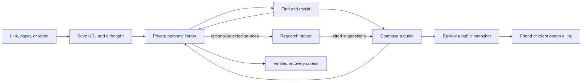
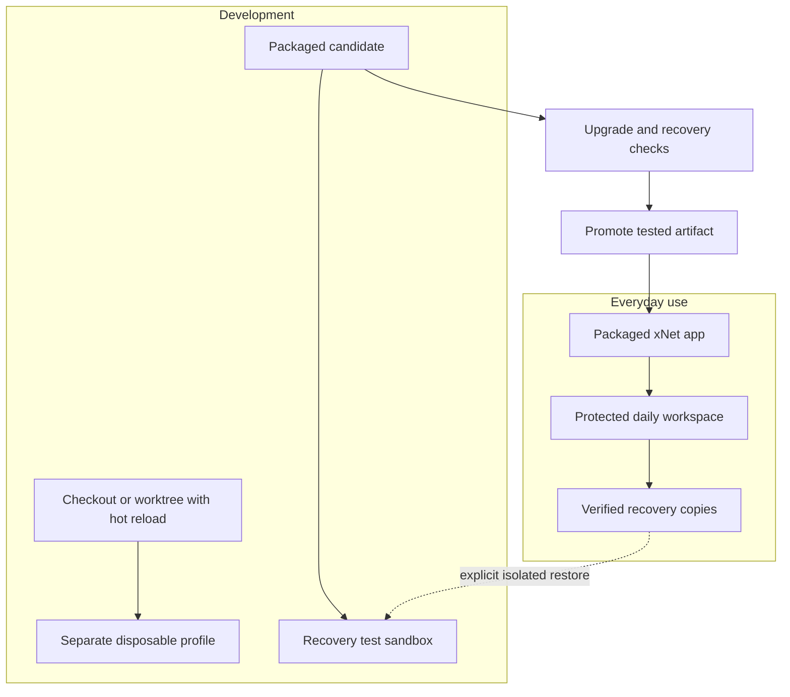

# A personal library for learning and sharing, safe enough to use every day

> [!TIP]
> Make xNet the place Chris saves a useful link, adds a thought, finds it again, and turns a few sources into something worth sharing. Start with a packaged Mac app whose data survives development and updates. That trust is part of the product.

## The job to earn

Chris already collects ideas, builds things, and shares resources. The missing piece is a comfortable place to let that work accumulate. A paper saved today should help answer a question next month. Notes from several sources should become a guide for a friend, a public page, or an optional resource for a coaching client.

The daily loop is **save → find → compose → share**. Each step must be useful on its own. Saving should take seconds. Finding should work with a half-remembered phrase. Writing should start with notes already at hand. Sharing should give someone a readable link they can open without installing xNet.

There is a prerequisite: Chris must be able to trust the app while changing its code. If using xNet means rebuilding a checkout, watching migrations, or wondering whether an update will erase notes, the library will stay empty. The first milestone is a safe daily desktop installation with a simple update and recovery path.

This exploration records the direction chosen in conversation, plus the durability concern raised afterward. It proposes work; it does not certify the current app as safe for irreplaceable data.

| Choice                    | Direction                                                                              |
| ------------------------- | -------------------------------------------------------------------------------------- |
| First personal value      | Learning and sharing                                                                   |
| Starting material         | Links, papers, videos, selected excerpts, and Chris's own notes                        |
| Existing collection       | Scattered across tools; bring a small useful set across first                          |
| Primary authoring surface | Packaged Mac desktop app                                                               |
| First reader experience   | A public page, with no account or installation                                         |
| AI's role                 | Optional help over deliberately selected sources                                       |
| First trust requirement   | Keep real data safe while the app and its data model evolve                            |
| Publication destination   | Proposed default: `crs.garden/guides/`; configurable, not a confirmed hosting decision |

The review date leaves roughly six weeks for initial work and a four-week usage trial. It is a date to reconsider this direction, not a promised delivery date. Chris decides whether to continue, narrow, or stop. Choosing this workflow is reversible. A new persistent format or public compatibility promise needs a separate ADR under the repository's decision policy before implementation.



## Why this fits Chris's work

[crs.land](https://crs.land) connects coaching, software, simulations, body-related resources, food forests, housing, and other experiments. The common activity is making something interesting easier for another person to approach. xNet can support the collection and writing behind those projects without absorbing each project's interface.

[crs.garden](https://crs.garden) already pairs links with personal commentary. Its software and body-related reading shows the shape of a useful source note: a source, a reason to care, and enough context to return later. The garden's existing Bluesky collection flow should keep working. A guide can draw from that material without making xNet the source of every garden post.

[crs.coach](https://crs.coach) describes a practice built around presence and working with the person in front of Chris. That favors a small resource offered at the right moment. It gives little reason to begin with a client dashboard, a habit score, or a prescribed sequence of worksheets. The [nervous-system resource site](https://crs48.github.io/nervous-system-healing/) is another useful precedent: resources have context, and personal experience is distinguished from evidence. A guide should preserve that distinction. This proposal makes no clinical claims about the material.

The adjacent repositories also suggest a clear division of work:

| Existing project                                                        | Keep its job                                       | What xNet contributes                                   |
| ----------------------------------------------------------------------- | -------------------------------------------------- | ------------------------------------------------------- |
| `digitalgarden` / [crs.garden](https://crs.garden)                      | Public browsing and the Bluesky-to-garden pipeline | Draft and export longer guides                          |
| `whole-body-cookbook`                                                   | A purpose-built interactive body atlas             | Notes and source collections that can link to the atlas |
| `feedme`                                                                | Creator support and its own funding model          | Links and context where useful; no new payment system   |
| Simulations and small websites linked from [crs.land](https://crs.land) | Their own visual and interactive experiences       | Research notes and companion reading                    |
| Coaching                                                                | A human relationship and live practice             | Optional, carefully chosen public resources             |

These are observations from public pages and selected local project documents, not evidence that clients want a new app. Friends and clients are initially readers. Test another person's authoring needs separately before treating this as a product for coaches.

## What the repository says, and what the code says

The research inventoried 525 numbered exploration documents, then followed the roadmap, graph queries, relevant explorations, and their implementation paths. It did not read every document line by line. Code observations below refer to commit `fbedf30e7`, inspected on 2026-09-29. Filename checkboxes were treated as leads, not proof of a finished experience. This pass changed documentation only. The desktop recovery and update paths were inspected, not exercised end to end.

The [roadmap](../ROADMAP.md) already makes founder daily use the near-term test. Its emphasis is the agent-assisted workspace. This proposal gives that platform a concrete daily job and puts local recovery before reliance on it. It fits the ownership commitments in the [charter](../CHARTER.md) and the quiet product experience in [VIBE](../VIBE.md). The website's [roadmap data](../../site/src/data/roadmap.ts) and the repository roadmap should be reconciled after this direction earns acceptance through use.

| Area                 | Status from inspection                                                                                                                                                                          | Consequence for this plan                                                              |
| -------------------- | ----------------------------------------------------------------------------------------------------------------------------------------------------------------------------------------------- | -------------------------------------------------------------------------------------- |
| Pages, folders, tags | ✅ Existing [Page schema](../../packages/data/src/schema/schemas/page.ts) and organization work                                                                                                 | Start with ordinary Pages; avoid a new knowledge model                                 |
| Capture              | 🚧 The [quick-capture tray](../../packages/workbench/src/views/tray.tsx) is oriented around tasks and page navigation                                                                           | Add a small, durable resource capture flow                                             |
| URL handling         | ✅ [External-reference helpers](../../packages/data/src/external-references.ts) exist                                                                                                           | Reuse URL handling; keep personal commentary in a Page                                 |
| Search               | 🚧 [Page search](../../packages/workbench/src/hooks/usePageSearchSurface.ts) reads document bodies; [store FTS extraction](../../packages/data/src/store/indexing/full-text.ts) uses properties | Verify the actual capture-to-search path; do not assume all retrieval sees note bodies |
| AI                   | 🚧 [Graph retriever](../../packages/workbench/src/views/ai-graph-retriever.ts) and agent tools exist                                                                                            | Start with explicit selected Page bodies and visible citations                         |
| Static publication   | 🚧 [Renderer and site builder](../../packages/publish/src/site.ts) exist                                                                                                                        | Finish the author-to-export flow and its privacy boundary                              |
| Portable data        | 🚧 [Bundle format and ports](../../packages/data/src/portability/types.ts) cover signed changes, optional blobs, and optional Yjs documents                                                     | Existing export code needs complete desktop wiring and a restore proof                 |
| SQLite snapshots     | ✅ [`xnet data snapshot`](../../packages/cli/src/commands/data.ts) uses `VACUUM INTO`                                                                                                           | Reuse the snapshot capability inside a complete backup flow                            |
| Desktop updates      | 🚧 [Updater](../../apps/electron/src/main/updater.ts) downloads and installs releases                                                                                                           | Add a verified data checkpoint and coordinated shutdown before installation            |
| Development profiles | 🚧 [Worktree scoping](../../apps/electron/scripts/dev-scope.mjs) exists; the main checkout keeps `default`                                                                                      | Protect daily data from every development launch, including the main checkout          |
| Startup recovery     | 🛑 [Data-service initialization](../../apps/electron/src/data-process/data-service.ts) deletes an unversioned database, or deletes after an inspection exception                                | Remove this behavior before moving irreplaceable notes into the app                    |

> [!WARNING]
> The startup deletion path is a concrete blocker. An old format, an unreadable database, and a new empty workspace must produce different outcomes. None is permission to delete the user's files.

<details>
<summary>Durability findings and the files behind them</summary>

The desktop opens two database paths. [Main-process setup](../../apps/electron/src/main/index.ts) sends `xnet-data/data.db` to the data utility process. [Storage IPC](../../apps/electron/src/main/ipc.ts) also opens `xnet-data/xnet.db` through a [blob storage adapter](../../apps/electron/src/main/storage.ts). A backup of one SQLite file is not yet proof of a complete desktop backup. Trace all live writers before deciding which paths are authoritative.

In `data-service.ts`, an existing database is opened to inspect its schema version. Version zero causes deletion of the database, WAL, and SHM files. The surrounding catch also attempts deletion. In the [Electron SQLite adapter](../../packages/sqlite/src/adapters/electron.ts), `getSchemaVersion()` maps any query error to zero. This compounds the problem: an inspection failure can look like an obsolete format.

The adapter sets `synchronous = NORMAL`. Its `applySchema()` returns without applying DDL when the existing version is greater than or equal to the requested version. That is not a refusal to write a database from a newer app. The factory applies the current DDL; the presence of [migration SQL helpers](../../packages/sqlite/src/schema.ts) alone does not establish a tested desktop upgrade chain.

The [updater](../../apps/electron/src/main/updater.ts) sets `autoDownload = false` and `autoInstallOnAppQuit = true`. Its install paths call `quitAndInstall()`. [Main-process shutdown](../../apps/electron/src/main/index.ts) has asynchronous cleanup in a `before-quit` listener, but that listener does not prevent quit and explicitly resume it after an acknowledged flush. [Data-process shutdown](../../apps/electron/src/main/data-process-manager.ts) requests shutdown and can then kill the process. These paths need a tested barrier that waits for the renderer's final edits, persistence, and backup completion.

The [identity seed](../../apps/electron/src/main/identity-seed.ts) is now random and stored per profile, using platform encryption when available. Invalid stored seeds fail loudly. Older exploration 0335's deterministic-key finding is therefore stale. A machine-bound encrypted seed file still needs a separate recovery design for restoring onto a new Mac.

The [portable bundle API](../../packages/data/src/portability/types.ts) makes blob and Yjs ports optional. A valid signed bundle can contain no document bodies when its caller omitted that port. The [store Yjs port](../../packages/data/src/portability/store-yjs-port.ts) also needs comparison with the desktop's actual document/update persistence path. Manifest verification and complete workspace recovery are different checks.

The [release workflow](../../.github/workflows/electron-release.yml) already builds desktop artifacts, checks native packaging, and has a nightly packaging run. Nightly runs do not publish updates. The workflow supports Developer ID signing and notarization when configured, and a self-signed fallback. This research did not inspect release secrets or prove that two installed releases update smoothly on Chris's Mac.

</details>

<details>
<summary>Explorations to reuse, and scope to defer</summary>

| Existing exploration                                                                                                                                                                                                                   | Use here                                                                                 |
| -------------------------------------------------------------------------------------------------------------------------------------------------------------------------------------------------------------------------------------- | ---------------------------------------------------------------------------------------- |
| [0105: what to work on next](./0105_%5B_%5D_WHAT_TO_WORK_ON_NEXT_AFTER_OPEN_SOURCE_LAUNCH.md)                                                                                                                                          | The daily-use question has recurred; settle it with a small real trial                   |
| [0112: universal clipper](./0112_%5B_%5D_UNIVERSAL_CLIPPER_AND_AI_KNOWLEDGE_GRAPH_INGESTION.md)                                                                                                                                        | Borrow capture intent; defer full extraction, entity ingestion, and video transcripts    |
| [0169: folders and tags](./0169_%5Bx%5D_CONTENT_ORGANIZATION_FOLDERS_TAGS_AND_CHANNELS.md)                                                                                                                                             | Reuse organization already present                                                       |
| [0179: spaces and sharing](./0179_%5B_%5D_SPACES_GROUPS_AND_UNIFIED_SHARING.md)                                                                                                                                                        | Revisit for private collaboration after public reader value is proven                    |
| [0180: experiment journal](./0180_%5B_%5D_EXPERIMENT_JOURNAL_AND_HABIT_TRACKER.md)                                                                                                                                                     | Keep available; it is not the selected daily job                                         |
| [0344: portability](./0344_%5Bx%5D_FIRST_CLASS_DATA_EXPORT_IMPORT_AND_PORTABLE_BUNDLES.md)                                                                                                                                             | Use the export/import primitives, then prove desktop completeness                        |
| [0362: publishing](./0362_%5B_%5D_PUBLISHING_ON_XNET_GHOST_SUBSTACK_AND_THE_OWNED_AUDIENCE.md)                                                                                                                                         | Finish one small route to a public guide                                                 |
| [0379: knowledge base](./0379_%5B_%5D_A_KNOWLEDGE_BASE_ON_XNET_PRIMITIVES_DISTILLATION_BURSTS_AND_THE_GOVERNED_CORPUS.md) and [0391: daily AI interface](./0391_%5Bx%5D_XNET_AS_THE_DAILY_DRIVER_AI_INTERFACE.md)                      | Reuse retrieval work; check later implementation before repeating old gaps               |
| [0406: shared shell](./0406_%5Bx%5D_ONE_SHELL_TWO_SURFACES_ENDING_THE_DESKTOP_WEB_UI_FORK.md)                                                                                                                                          | Put the Library experience in the shared workbench                                       |
| [0413: worktree desktop development](./0413_%5B-%5D_PLURAL_ELECTRON_WORKTREE_SCOPED_DESKTOP_DEV.md)                                                                                                                                    | Extend profile isolation to a protected daily installation                               |
| [0430: risk-adjusted engineering](./0430_%5B-%5D_RISK_ADJUSTED_ENGINEERING_READING_ASTERISK_14.md)                                                                                                                                     | Give upgrade checks a consumer, a pass condition, and proof they can fail                |
| [0455: plugin composition](./0455_%5B-%5D_CORDIS_LESSONS_FOR_XNET_PLUGIN_COMPOSITION.md), [0456: agent door](./0456_%5B-%5D_ENTRY_VECTOR_THE_AGENT_DOOR_FIRST.md), and [0457: site](./0457_%5B-%5D_AGENT_FIRST_SITE_REARCHITECTURE.md) | Preserve completed agent work; use this library as a concrete human workflow to validate |

</details>

## Choose a desktop home for the library

| Option                                          | Useful property                                       | Cost for this use case                                                      | Decision                               |
| ----------------------------------------------- | ----------------------------------------------------- | --------------------------------------------------------------------------- | -------------------------------------- |
| Packaged Electron app with protected daily data | Local files, OS integration, existing release updater | Must finish recovery and prove upgrades                                     | **Primary path**                       |
| Run the library from a development checkout     | Fast iteration with hot reload                        | Branch changes and experiments become data risks; too much daily ceremony   | Use for development with separate data |
| Browser app / PWA                               | Easy access and web delivery                          | Browser storage policy and recovery add uncertainty for the only local copy | Keep as a later authoring option       |
| Markdown files as the primary store             | Easy to inspect and copy                              | Would require a new editing/sync contract and abandon useful existing work  | Offer readable export as an exit path  |

[MDN's persistent-storage API](https://developer.mozilla.org/en-US/docs/Web/API/StorageManager/persist) lets a browser request protection from automatic eviction; the browser may refuse. That is useful for a future web authoring surface, but it does not replace a backup. A public guide can be an ordinary website regardless of where it was authored.

For Chris, the normal experience should be: open xNet from Applications, save something, close it when done. A release can arrive in the background. Installing it should require at most a short restart, with notes and identity intact. No terminal, package install, checkout selection, or manual data conversion should be part of using the library.

## A durability promise with clear limits

“Local-first” describes where work happens. Trust also requires a clear answer to what survives a crash, a bad release, a mistaken deletion, and the loss of the Mac.

The following is the proposed contract to implement and test. It is not a guarantee the current build already makes.

| Failure                               | Intended protection                                                                                          | Honest boundary                                                                                |
| ------------------------------------- | ------------------------------------------------------------------------------------------------------------ | ---------------------------------------------------------------------------------------------- |
| App crash or forced quit              | Every edit acknowledged as **Saved on this Mac** has reached durable storage, including its document content | Text still marked **Saving…** may be lost                                                      |
| Power loss                            | Durable transactions and flushed data before the saved acknowledgement                                       | Subject to filesystem and hardware guarantees; prove the configured path and test interruption |
| Bad app update or migration           | A complete verified checkpoint of the old workspace and a retained compatible app version                    | Recovery must preserve any edits made after the update too                                     |
| Accidental deletion or bad agent edit | Retained recovery points, plus existing history where applicable                                             | History and sync can carry mistakes; neither replaces independent copies                       |
| Failed disk or lost Mac               | A completed encrypted backup on another device or storage service, with usable recovery material             | A second folder on the same disk does not cover this failure                                   |
| xNet development stops                | Portable bundle plus a readable Markdown/assets export                                                       | A readable export can omit protocol history; say exactly what each export contains             |

The saved acknowledgement needs a path from the editor through Yjs persistence and the data process to the completed transaction. Updating React state or sending an IPC message is too early. If writing fails, retain the unsaved text, show the failure, and allow a copy/export.

[SQLite's WAL documentation](https://sqlite.org/wal.html) distinguishes integrity from power-loss durability: `NORMAL` omits a sync on each commit, while `FULL` syncs the WAL at commit. Use `FULL` as the starting point for the daily desktop store and measure its cost. Batch edits where appropriate, keeping **Saving…** visible until the batch commits. Do not promise that every keystroke has reached disk before it has.

### Three useful forms of recovery

| Form                                              | Main job                                                | Required proof                                                                   |
| ------------------------------------------------- | ------------------------------------------------------- | -------------------------------------------------------------------------------- |
| Native workspace checkpoint                       | Recover quickly from a bad desktop update               | Reopen with the compatible app, with notes, blobs, and identity intact           |
| Full `.xnetpack` plus encrypted recovery material | Move or recover data independently of one SQLite layout | Restore into an empty isolated workspace with all expected content and ownership |
| Markdown, source URLs, and assets                 | Read and reuse the collection without xNet              | Open outside xNet; list anything omitted                                         |

Reuse the existing bundle and snapshot machinery. The missing product is automatic creation, a complete content inventory, verification, retention, and a usable Restore action.

A native checkpoint must cover the workspace consistently: both live database stores where applicable, document states and pending updates, referenced blobs, custom schema definitions, and the identity/encryption material needed to open them. Include app and storage versions in its manifest. Distinguish required data from rebuildable search indexes, caches, and window preferences. Account for data outside `xnet-data` before claiming the inventory is complete.

At checkpoint time, pause new writes, drain every writer, and capture a consistent set. SQLite's [Online Backup API](https://www.sqlite.org/backup.html) can make a consistent database copy; the existing `VACUUM INTO` path is another available primitive. Copying only a live main database file can omit committed WAL content. Keep the live database on a local filesystem. Send completed immutable archives to a backup destination after they are closed and verified.

For a full portable backup, require the desktop blob and Yjs ports. Compare its manifest against the frozen workspace inventory. Missing bodies or attachments must fail completeness validation even if the bundle's signatures are valid. Verify checksums and restore into a temporary workspace with network access disabled. Delete no previous good backup until the replacement is complete.

Platform-encrypted keys are useful on the current Mac. Recovery on a new Mac must also work without the old Keychain. Design an encrypted recovery kit that covers the actual signing and content keys, with a recovery secret Chris can store separately. Never put plaintext keys in an ordinary cloud-synced export. A wrong secret, missing key, or unreadable seed must stop recovery without silently making a new identity.

### Small, visible backup policy

Proposed initial defaults: make a local checkpoint every 15 minutes while data has changed, on the next launch when overdue, and before each update or storage migration. These are targets for a healthy running app, not a claimed loss bound after failed backups. Keep recent points for a day, daily points for a week, and weekly points for a month. Pin the last good pre-migration checkpoint and its app-version reference until the replacement has been verified and retained long enough to recover.

Bound disk use, deduplicate immutable blobs where practical, and report lack of space. Pruning must never erase the last verified recovery point to make room for an unverified one. Start with full recoverable points; incremental chains add another recovery dependency and can wait.

Let Chris choose an off-device destination once. Show local recovery and off-device backup as separate facts: **Recovery copy: 3 minutes ago** and **External backup: yesterday**. Without a completed external copy, say **Backed up on this Mac only**. Do not require a hosted xNet account for local use. An existing backup service can carry closed archives; the app must distinguish writing an archive locally from confirmed off-device protection.

## Updates that preserve the work

The app binary and the workspace have separate lifetimes. An update can replace the app without moving or replacing the user's home for data. Data conversion happens only when the storage format actually needs it.

```mermaid
sequenceDiagram
    actor Chris
    participant App as Daily app
    participant Data as Workspace writers
    participant Backup as Recovery manager
    participant Next as Updated app
    Chris->>App: Restart to update
    App->>Data: Pause writes and flush all edits
    Data-->>App: Durable flush acknowledged
    App->>Backup: Create and verify complete checkpoint
    Backup-->>App: Recovery point ready
    App->>App: Hand control to installer
    Next->>Backup: Inspect versions before opening writable stores
    alt Format unchanged
        Next->>Data: Open existing workspace
    else Supported migration
        Next->>Backup: Migrate a candidate copy and validate
        Backup-->>Next: Candidate passed
        Next->>Data: Atomically select candidate generation
    else Unknown format or verification failure
        Next-->>Chris: Recovery view; original files preserved
    end
```

The updater should download while Chris works and offer a calm restart action. Every install path, including install-on-quit, must use the same safety barrier. If a fresh checkpoint cannot complete, postpone installation and leave the current app usable. Do not reinterpret a failed update check as “up to date.” Use explicit outcomes for offline, unavailable, failed, available, and current.

The shutdown barrier belongs before the installer closes the renderer. Awaiting an async event listener alone is insufficient. The app must hold the quit event, drain writes, verify the checkpoint, and then resume the one approved installation or quit. Test an edit made immediately before that action.

On startup, first probe compatibility without migrating or opening the store for writes. A supported old workspace goes through an explicit migration chain on a candidate copy. Check integrity, content counts, attachment hashes, representative document rendering, and identity continuity. Switch a small active-generation pointer only after the candidate passes. Make that switch crash-safe and resumable. Retain the untouched source generation. An unversioned workspace enters an import/recovery path; an unreadable one is preserved for diagnosis.

Do not run the new app's normal writable database factory just to inspect compatibility. The version check must precede DDL, write pragmas, and any cleanup that changes the source.

### Format changes should be uncommon and explicit

| Versioned thing            | What it means                         | Policy                                                                                |
| -------------------------- | ------------------------------------- | ------------------------------------------------------------------------------------- |
| App release                | UI and behavior                       | Most releases should open the same data unchanged                                     |
| SQLite storage layout      | Tables, columns, indexes              | Ordered, transactional migrations on a candidate copy                                 |
| Node schema                | Meaning of stored fields              | Additive changes first; explicit conversion or read adapters for old data             |
| Yjs/editor document format | Rich-text content and embedded blocks | Preserve unknown content; never discard an old block while loading                    |
| Bundle and sync protocol   | Data exchange and portable recovery   | Follow [compatibility policy](../COMPATIBILITY.md); reject unsupported writes clearly |

Preserve original signed records. Schema evolution can add a conversion or a new view of old content without rewriting history as if it always had the new meaning. Unknown schema data should remain recoverable, even if the current UI can only show a read-only fallback. Avoid a new source-note schema in the first place: ordinary Pages lower the migration burden for this workflow.

### Rollback must not erase newer notes

Rolling back the binary is safe only when the older app can read the current workspace. Otherwise the recovery unit is the old app plus its compatible checkpoint. The failed candidate and any later edits remain preserved.

If Chris has added notes since updating, never silently point the old app at yesterday's data. Show the recovery point's time and the later work at risk. Offer a supported replay/export of that work, or keep it in a separate recoverable generation until a fix is available. Restoring a checkpoint is not an inverse migration. Keep network sync disabled during validation and recovery; reconnect deliberately after resolving the current state so stale restored data does not surprise other peers.

The recovery view must open before normal workspace startup, so a broken migration cannot hide the Restore action. If the new app binary itself cannot launch, provide a way to reinstall the last compatible signed build without a terminal. Reinstalling that build must still preserve all workspace generations and leave any data rollback explicit.

## Using and developing xNet at the same time



Use one packaged daily app with a stable data path independent of repository location, branch, and build version. Every development launch gets separate storage, including launches from the main checkout. Worktree scoping already handles much of this; close the default-profile gap and refuse accidental development access to the protected workspace. Verify actual resolved paths rather than assuming a profile name proves isolation.

Adopting an existing profile needs a one-time, backed-up transition that preserves its identity and data. Do not change a path and quietly show an empty library. Make the selected workspace clear, and never merge profiles merely because their names look similar.

Develop UI changes with the existing Electron hot-reload and cached-build workflow. Build a packaged candidate only when validating a release. Use the existing release pipeline to produce daily-app updates, then promote a tested artifact without asking Chris to rebuild it locally. If faster access is useful, offer an explicit early-release channel using the same recovery checks. There is no need for a second installer system.

A test copy of real data must start with network sync, background agents, and public serving disabled before any document opens. Keep identity keys inside the isolated recovery test when continuity must be verified; do not let a duplicated identity act as a second live client. Ordinary development should use synthetic data and a separate identity.

Stable signing is part of convenience. Electron documents that [code signing](https://github.com/electron/electron/blob/main/docs/tutorial/code-signing.md) matters for macOS updating and Keychain behavior. Test the installed release-to-release path, including access to existing encrypted identity material. The repository currently declares electron-updater 6.x and electron-builder 25.x; current [builder documentation](https://www.electron.build/docs/features/auto-update/) describes newer APIs too. Match implementation to the locked versions rather than copying a current example blindly.

## The library: useful in the first minute

After the recovery milestone, start with roughly 25 real resources Chris chooses from existing collections. Do not bulk-import years of material before the app has earned trust. Create two guide drafts from a few of those sources so the first session includes both collecting and making something useful.

The Library entry point offers **Inbox**, **Resources**, and **Guides** through existing folders and tags. Inbox means “saved for later”; it is not a queue that demands completion. A resource can remain a URL and one sentence indefinitely.

### Capture a URL and a thought

Extend the shared workbench's capture flow. Pasting a URL opens a small form with title, optional selected excerpt, and “Why I saved this.” Save locally before fetching metadata. Offline capture succeeds with the URL as its initial label. Failed writes preserve the text. Repeated URLs offer the existing note or an explicit second note; URL normalization must not remove meaningful query parameters.

For desktop convenience, add one explicit global shortcut that opens this form and returns focus to the prior app after saving. Read the clipboard only when invoked or pasted. A browser share target or extension can follow if the shortcut proves awkward. Full article extraction, PDF parsing, transcripts, and automatic entity graphs remain outside this first pass.

Use a normal Page whose document contains the source URL, excerpt, and commentary. Reuse the [URL utilities](../../packages/data/src/external-references.ts). Do not overload the Page's `canonicalUrl`, which belongs to publication identity. The [ExternalReference schema](../../packages/data/src/schema/schemas/external-reference.ts) can support later structured links; it should not force a second record or a new schema just to save a thought.

The notes are the value Chris owns. The linked site may disappear. Clearly distinguish a saved link from a saved copy of its content. Selected excerpts and notes are backed up; full source preservation is a separate future feature.

### Find something you only half remember

Search titles, source URLs, and note bodies. An exact URL should find its note. A phrase present only in the note body should work after the app restarts, with no network. Show enough context to identify the result, and open the right Page.

The current global Page search already loads document content. Reuse it, measure it with the starter collection, and avoid a second index unless the existing path cannot meet the task. The AI retriever's property-based text path needs separate attention. “Search exists” does not prove a helper can see the same content the human finds.

### Make the next useful resource

A guide is another Page. Put source notes beside it, link back to sources, and write the missing context: who might find this useful, why these few links belong together, and where Chris's own experience ends. Possible first drafts include a reading path through local-first software or an introduction to resources Chris already shares in conversation. Chris chooses the topics; the app does not infer a client's needs.

The optional helper operates on selected resources and the current draft. It can compare sources, suggest an outline, or identify an unsupported claim. It must cite the Page or source behind a suggestion and admit when the selection lacks evidence. Fetching external content and using a remote model are explicit actions with clear scope. No background rewriting, automatic publication, or unstated access to private notes.

## Share a guide without sharing the workspace

The first publishing path should produce a static page. The recipient needs neither an xNet account nor a running desktop app. Chris sees an exact preview, selects what to include, and exports a named snapshot.

The existing [publication pipeline](../../packages/publish/src/pipeline.ts) provides useful parts. Two seams need special care. [Published-document resolution](../../packages/publish/src/published-doc.ts) can fall back to the live document when a pinned snapshot is unavailable; public export must refuse that fallback. The [CLI publisher](../../packages/cli/src/commands/publish.ts) takes a pre-rendered `PublicationFile` JSON input. It is not already a one-command export of a live workspace.

Build the live-workspace adapter with an explicit allowlist of guide Pages and selected assets. No transitive export of private backlinks, notes, tags, or client names. Even a private link's visible label can leak context, so preview the final rendered page and handle unresolved links deliberately. Republishing updates the public snapshot only after another explicit action.

The proposed destination is `digitalgarden/public/guides/`. Its existing [build script](https://github.com/crs48/digitalgarden/blob/main/scripts/build.mjs) copies `public/` into the generated site, and its [Pages workflow](https://github.com/crs48/digitalgarden/blob/main/.github/workflows/pages.yml) already deploys it. That keeps the garden's existing content flow intact. Make the output directory configurable.

Export through a staging directory, then replace only the managed guide directory after validation. Remove obsolete generated pages inside that boundary; never clean the rest of the garden. In the first iteration, Chris commits and pushes the generated output through the existing site workflow. The desktop says **Exported**, then **Published** only after deployment is confirmed. Automating this last step can follow once the export earns use.

Deleting a local draft does not retract a public page. Offer an explicit unpublish/export operation and explain that copies and caches may remain. Sensitive session notes and client records are outside this public-guide workflow. Private client spaces need a separate review of authorization, revocation, and recovery before relying on them.

## Work in four bounded passes

All items below are proposed work. None is checked off by writing this exploration. Each pass should end with a useful, inspectable result; do not reopen the entire platform backlog.

### A. Make the daily desktop safe to trust

- [ ] Remove database deletion on old schema, inspection error, or failed startup. Preserve originals and expose a recovery state.
- [ ] Add a read-only compatibility probe with distinct missing, supported, old, future, and unreadable outcomes before any writable open.
- [ ] Inventory all desktop data and key locations; define a complete checkpoint manifest and fail if required content is missing.
- [ ] Protect the daily profile from every development launch; migrate existing profile selection without losing data or identity.
- [ ] Wire a durable saved acknowledgement and coordinated renderer/data-process flush. Measure `FULL` transaction durability on the daily workload.
- [ ] Create and verify automatic local checkpoints with bounded retention, visible failure, and a Restore action.
- [ ] Wire complete portable export, encrypted cross-Mac key recovery, and one off-device backup destination; show its actual protection status.
- [ ] Implement ordered migration on a candidate copy, validated promotion, and a recovery path that preserves post-update edits.
- [ ] Route every updater install path through the flush/checkpoint barrier; keep normal no-format-change updates simple.
- [ ] Extend the existing release checks with a real installed Mac upgrade and restore exercise; prove signing and Keychain continuity across releases.

**Exit:** Chris can save notes, quit, reopen, install an update, and recover an earlier copy without a terminal. Development uses a different workspace. No valuable collection moves in before this exit is demonstrated.

### B. Earn the save-and-find loop

- [ ] Add Library entry points for Inbox, Resources, and Guides using existing Pages, folders, and tags.
- [ ] Add URL-plus-note capture in the shared workbench, with optional excerpt, duplicate handling, and failure-safe input retention.
- [ ] Add the explicit desktop capture shortcut; confirm focus returns and saving works offline.
- [ ] Bring in about 25 chosen resources and create two guide drafts; record source URLs and preserve personal notes.
- [ ] Verify search over titles, URLs, and Page bodies after restart; make each result open the intended note.

**Exit:** Chris saves a resource during normal browsing and later finds it using a phrase from the note.

### C. Share something useful

- [ ] Wire selected guide snapshots and selected assets into the existing static renderer; reject missing snapshots and private dependencies.
- [ ] Add preview and configurable export into a managed directory, with atomic replacement and stale-page cleanup limited to that directory.
- [ ] Try the proposed garden destination through its existing deployment pipeline; make export and publication status accurate.
- [ ] Share two reviewed guides and collect feedback on whether each reader understood why the resource was useful.

**Exit:** A friend or client opens a useful guide on a phone without logging in. The page contains only what Chris approved.

### D. Let use decide what comes next

- [ ] Trial an optional selected-source helper with citations and a no-answer case; leave manual writing fully useful without it.
- [ ] Run a four-week founder trial after passes A and B; keep a short friction log without adding in-app streaks or scores.
- [ ] Ask two other people who collect and share resources to save, find, and share their own material; record where they need help.
- [ ] At review, decide whether to improve this loop, add a proven missing capability, or withdraw the direction; reconcile the roadmaps if continuing.

**Exit:** There is evidence of voluntary use and useful output, or a clear reason to change course.

## Proof that matters

Recovery and usefulness need different evidence. The first requires controlled failures. The second requires real work. Passing a unit test cannot certify either whole experience.

The release consumer is the existing Electron release workflow and the person promoting its artifact. Its pass condition is concrete: the same workspace content and identity survive a supported upgrade, and every failed migration preserves a recoverable original. Exercise the installed Mac app as well as pure storage tests. Keep deterministic failure fixtures isolated; any new scanner or gate script must include the repository's required in-memory negative-control selftest.

| Validation                                 | Required observation                                                                      |
| ------------------------------------------ | ----------------------------------------------------------------------------------------- |
| Restart with real note content             | Titles, URLs, body text, attachments, and identity match                                  |
| Last-moment edit before update             | An acknowledged saved edit exists after restart                                           |
| Legacy and unknown database versions       | No deletion; known old versions migrate; future formats refuse writes                     |
| Corrupt database or unavailable key        | Original bytes remain; explicit recovery state; no fresh identity masquerading as success |
| Disk full during save or backup            | No false saved/backup success; previous good recovery point retained                      |
| Kill during migration or promotion         | Startup selects a complete generation or recovery state, never a half-migrated store      |
| Incomplete export                          | Omitted blob/Yjs port or missing attachment fails completeness checks                     |
| Restore on a clean profile or another Mac  | Notes and ownership recover with the recovery kit, without the original Keychain          |
| Failed update followed by new notes        | Recovery keeps those notes or clearly preserves them for later replay                     |
| Development alongside daily use            | Distinct resolved data paths; sandbox cannot sync or publish                              |
| Body-only search after restart             | Correct source note found without opening every Page by hand                              |
| Public snapshot missing                    | Export refuses rather than publishing the live draft                                      |
| Private link and unselected asset in draft | Nothing private crosses the export boundary; preview explains omissions                   |
| Second export after unpublish              | Managed output removes the page; unrelated garden files stay intact                       |

- [ ] Use fixtures from the previous installed release and the oldest supported storage version, plus unversioned and future-version fixtures.
- [ ] Run storage and bundle tests that exercise the failure cases above, including a deliberately incomplete backup that the verifier rejects.
- [ ] Drive the real packaged Mac app through capture, restart, upgrade, rollback/recovery, and external-backup restore.
- [ ] Verify the complete publishing path in a clean browser session and at a phone viewport.
- [ ] Record actual command results and manual observations alongside completed checklist items; leave unknowns unchecked.

For the founder trial, look for use on at least eight of ten days when Chris naturally does relevant reading or sharing. This is a research measure, not a demand to manufacture daily activity. Ask Chris to find five saved resources from remembered context, aiming for under 30 seconds each. Produce and share two useful guides. Record each update that requires a terminal, loses context, or creates doubt about stored data; those failures outrank adding features.

For the two outside authors, success means completing save → find → share with their own material and little assistance. Reader feedback alone cannot establish demand for an authoring app. If Chris still prefers existing tools after the trial, inspect which step failed before adding more AI or a larger import pipeline.

## Risks and decisions still open

The largest risk is spending months on a general backup platform before saving a useful note. Keep pass A focused on the desktop paths that already exist, with one complete checkpoint format, one portable recovery path, and one installed upgrade test. These are justified by observed failure paths. A new multi-device service, background research fleet, or universal ingestion system is outside scope.

Storage cost may make the proposed checkpoint cadence too expensive for large media libraries. Measure the small source-note workload first. A cap can change retention, but it must not quietly weaken the displayed recovery promise. Large recordings and bulk social imports need explicit inclusion or an honest unsupported result from the completeness check.

The signing configuration, supported historical database versions, and complete key inventory need implementation-time confirmation. Resolve them at the start of pass A. Do not paper over uncertainty with “backup successful.” An off-device destination and recovery-secret storage also require Chris's choice during setup; no service is chosen or provisioned here.

The garden export destination remains a proposed default. The library and public renderer should work if Chris chooses a different site. Private collaboration, a coaching portal, full-content clipping, mobile authoring, automatic topic graphs, and a new business model wait for evidence from this loop.

**Recommended next work:** finish pass A as the first implementation slice, starting with the destructive startup path and a verified recovery point. Then build the smallest capture-and-find loop around real sources. Let a month of using that library determine how much publishing and AI it needs.
