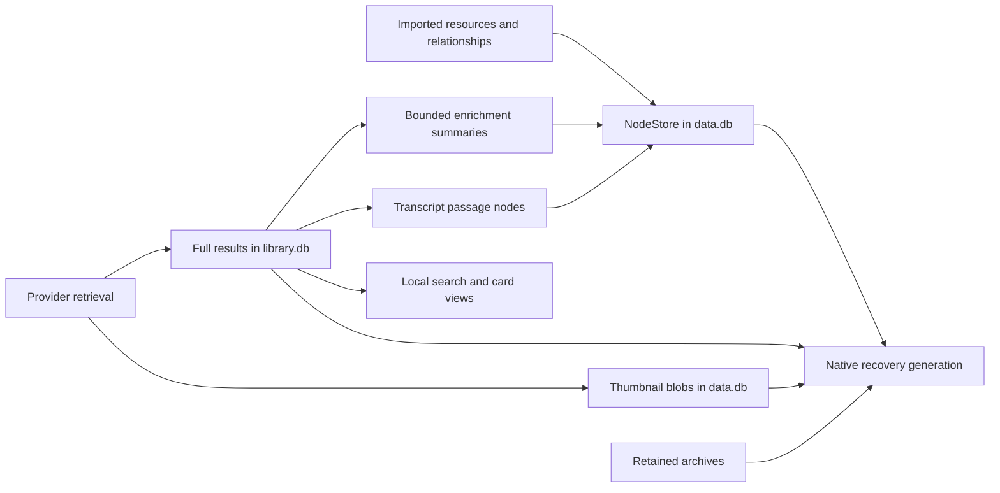
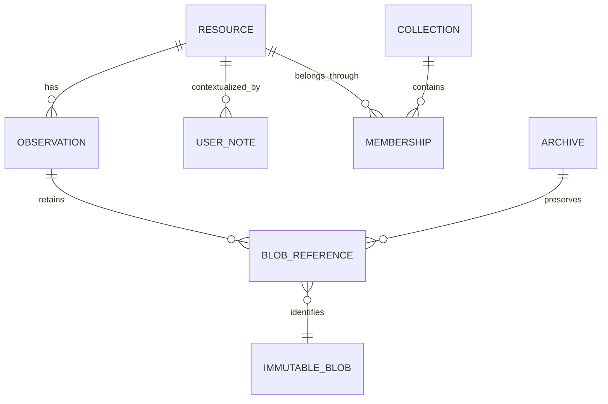
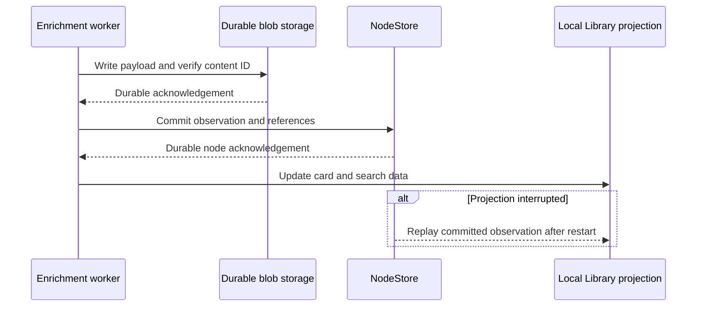
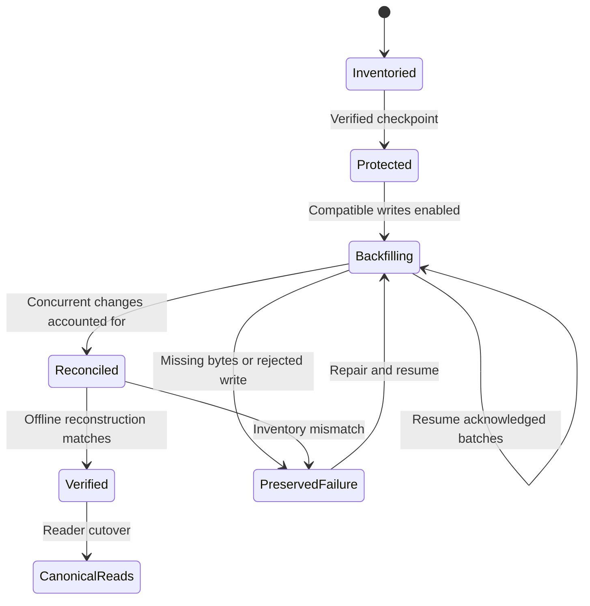

# Durable Library content as xNet nodes and referenced blobs

> [!TIP]
> Make every saved Library result recoverable from xNet nodes and their referenced blobs. Keep fast local indexes and the durable enrichment queue, but remove their role as the only home for collected content. Prove this by rebuilding the Library offline in a fresh profile without the original `library.db`.

## Problem statement

The personal Library in [exploration 0466](./0466_[-]_PERSONAL_LIBRARY_FOR_LEARNING_AND_SHARING.md) is collecting titles, descriptions, GitHub READMEs, thumbnails, and available captions from imported links. Chris wants to use that collection every day while continuing to develop xNet. A rebuild, database change, or move to another device should preserve the work already invested in fetching and organizing it.

Imported resources and relationships are already xNet nodes. Enrichment is only partly represented there: bounded display metadata and transcript passages reach NodeStore, while full provider results remain in a desktop SQLite database. Native recovery includes that database, but nodes alone cannot reconstruct the enriched Library.

The question is therefore about **which records own the content**, not replacing SQLite. xNet nodes and blobs already use SQLite on desktop. The goal is one durable content model, with local tables for efficient browsing and background work.

## Executive summary

The recommended design has three parts:

1. **Nodes describe resources and observations:** identities, relationships, titles, authors, coverage, provenance, and references to saved content.
2. **Immutable blobs preserve larger payloads:** full text, README bodies, normalized and original captions, provider evidence, images, and retained archives.
3. **Device-local tables serve the app:** search, card projections, graph caches, leases, retries, and scheduling. Content projections can be rebuilt. Operational queue state remains durable and must survive updates.

Existing resources keep their IDs. User writing stays separate from provider output. Backfill uses already saved bytes; it does not refetch the internet. The old Library database and backups remain intact until reconstruction has been proven.

**Status:** proposal only. No storage migration is performed by this exploration. The ongoing enrichment pass can continue on the existing implementation.

The review date allows three weeks to decide on the first migration slice and its evidence. It is not a delivery promise. `door: one-way` reflects the persistent schema and payload-format commitments involved. Before implementing those commitments, record an ADR with a `Tripwire:` in the [canonical decision log](../../site/src/content/docs/docs/architecture/decisions.mdx). Names and example formats below remain provisional until that decision.

## Current state in the repository

The development workspace lives under the Electron profile's `xnet-data` directory, separate from the checkout and application build. Recovery generations live beside it in `xnet-recovery`. The source-build profile is distinct from the installed application's profile; opening a different profile does not migrate data between them.

| Data                                                                   | Current home                                                        | Status                               | Consequence                                                                                                           |
| ---------------------------------------------------------------------- | ------------------------------------------------------------------- | ------------------------------------ | --------------------------------------------------------------------------------------------------------------------- |
| Imported links, posts, collections, memberships, and notes             | NodeStore in `data.db`                                              | ✅ Canonical nodes                   | Preserve existing IDs and source relationships.                                                                       |
| Display enrichment                                                     | `SocialEnrichment` nodes                                            | 🚧 Bounded projection                | Title is capped at 1,000 characters and description at 5,000. Full results cannot be reconstructed from these fields. |
| Full metadata, README text, provider evidence, caption tracks and cues | JSON resource payloads in `library.db`                              | 🚧 Desktop-owned content             | Valuable content currently depends on this additional database.                                                       |
| Transcript passages                                                    | `SocialContent` nodes plus full caption payload in Library          | 🚧 Both representations exist        | Preserve timing, language, raw evidence, and passage relationships through migration.                                 |
| Downloaded thumbnails                                                  | Content-addressed bytes in the data-process blob table in `data.db` | ✅ Local bytes saved                 | A CID reference still needs proven transfer, authorization, and retention behavior.                                   |
| Other editor attachments                                               | Main-process blob store in `xnet.db`                                | ✅ Separate existing store           | A recovery manifest must cover both stores; this proposal does not assume they are interchangeable.                   |
| Original ZIP/JSON exports                                              | Retained, hash-verified files in `import-sources/`                  | ✅ Exact local copies                | Include all retained bytes in recovery, even when only some archive categories were imported.                         |
| Search and card data                                                   | FTS5 and resource tables in `library.db`                            | 🚧 Mixed with authoritative payloads | Separate rebuildable views from content ownership.                                                                    |
| Work attempts, cooldowns, capture intents                              | `library.db`                                                        | ✅ Durable local state               | Preserve restart behavior and unfinished user saves during migration.                                                 |
| Native recovery                                                        | Verified copies of `xnet-data`                                      | ✅ Local coverage                    | Includes Library and archives; remains on the same disk.                                                              |

An aggregate observation on 2026-10-03 found 55,973 Library resources. The primary database was about 7.8 GiB, Library about 3.6 GiB, and ten retained archives about 0.63 GiB. These are changing file sizes, not a permanent capacity estimate or a claim that all resources are fully enriched. No archive contents or private conversations are reproduced here.

Code paths inspected for this proposal

- [Library service](../../apps/electron/src/library/service.ts): `project` writes bounded node fields; `retain` saves full results locally; `execute` handles metadata, blobs, captions, and attempts. Successful projections use signed deterministic node imports.
- [Library store](../../apps/electron/src/library/store.ts): resource JSON, FTS5, versioned work records, persistent provider pauses, and capture intents. It uses WAL and `synchronous=FULL`; interrupted jobs reopen queued.
- [Shared Library types](../../apps/electron/src/shared/library.ts): metadata evidence, per-field coverage, caption cues, language, and provider provenance.
- [Enrichment schema](../../packages/social/src/schemas/enrichment.ts): stable platform/content identity and bounded fields, including a thumbnail CID stored as text.
- [Transcript node construction](../../packages/social/src/transcripts/nodes.ts): passage representation and source relationships.
- [Data service](../../apps/electron/src/data-process/data-service.ts): node persistence, blob reads/writes, and existing peer blob exchange.
- [File properties](../../packages/data/src/schema/properties/file.ts): existing typed file references with CID, MIME type, byte size, and optional thumbnail reference.
- [Archive storage policy](../../packages/social/src/import/storage.ts): existing single-archive, selected-entry, and manifest-only modes. These modes are not proof of byte-for-byte archive recovery.
- [Retained sources](../../apps/electron/src/storage/import-sources.ts) and [import journals](../../apps/electron/src/storage/import-journal.ts): exact input preservation and acknowledged progress.
- [Native recovery](../../apps/electron/src/main/recovery.ts), [checkpoints](../../apps/electron/src/storage/checkpoints.ts), and [migration staging](../../apps/electron/src/storage/migrations.ts): writer barriers, database normalization, verification, and preserved originals.
- [Storage inventory](../reference/desktop-storage.md): current coverage, identity requirements, portable exports, and known exclusions.

## External research

SQLite's online backup API supports consistent database snapshots and incremental copying. This is useful for a migration snapshot, but a snapshot of one database does not establish consistency across several stores and files. xNet still needs its workspace-wide writer barrier and manifest verification. [SQLite backup API](https://www.sqlite.org/backup.html).

SQLite WAL durability depends on the journal and synchronization settings; the main database file alone may not contain the latest committed state. Preserve the existing recovery path instead of copying a live `.db` file with an ordinary file-copy command. [SQLite WAL documentation](https://www.sqlite.org/wal.html).

IPFS distinguishes identifying content from retaining it. Its pinning model illustrates why a content address by itself is insufficient: collection rules and retained roots determine whether bytes remain available. The relevant lesson for xNet is explicit ownership and reachability. This is not a proposal to introduce IPFS or a paid pinning service. [IPFS persistence documentation](https://docs.ipfs.tech/concepts/persistence/).

## Options and tradeoffs

| Option                                                                | Strength                                                                 | Cost                                                                                       | Decision                      |
| --------------------------------------------------------------------- | ------------------------------------------------------------------------ | ------------------------------------------------------------------------------------------ | ----------------------------- |
| Keep full results only in Library and back up both databases          | Smallest immediate change; works locally today                           | Desktop-specific content ownership; nodes cannot restore the collection                    | 🟡 Transitional only          |
| Put complete payloads directly in node properties                     | One obvious record model                                                 | Large changes, repeated payloads in history, existing field limits, expensive common reads | 🔴 Avoid for large payloads   |
| Store each provider result as a versioned blob referenced by a node   | Complete evidence, small node updates, byte deduplication, bounded reads | Requires reliable reference enumeration, retention, transfer, and migration                | 🟢 Recommended                |
| Keep full results in an unrelated file directory or external database | Flexible payload storage                                                 | Another independent recovery and sharing contract                                          | 🔴 No additional store needed |

The node-and-blob option still needs a local SQL projection for large collections. The recent browsing fix added ordered indexes and stopped overlapping polling; moving ownership must preserve those gains. A Library card request should not parse every README or caption track.

## Proposed content model

### Nodes carry meaning and provenance

Keep the existing imported resource and collection nodes. Extend the enrichment model additively, or introduce a closely related observation schema if its versioning and authorization fit better. Choose between those alternatives in the ADR; do not silently replace existing schema IDs.

An observation identifies its resource, provider and extractor version, retrieval time, format version, per-field coverage, and typed content references. It distinguishes full text, previews, authored captions, retrieved spoken caption tracks, and future local transcription. A failed retrieval may create an explicit outcome record; it must not overwrite a successful payload or pretend that unavailable text was collected.

User titles, notes, annotations, and tags have separate ownership. A refresh cannot replace them. Provider-generated labels remain distinguishable from an authored video title. The effective display value can be computed from an explicit user override and the selected source observation.

### Blobs hold complete payloads

| Blob role         | Required content                                                                              |
| ----------------- | --------------------------------------------------------------------------------------------- |
| Normalized text   | Complete description, README, or article text; format and encoding                            |
| Provider evidence | Saved response or extracted evidence actually available, with its fidelity labeled            |
| Caption track     | Every cue with timing, language, automatic-caption flag, and original response where retained |
| Thumbnail         | Original verified raster bytes and content type                                               |
| Source archive    | Exact retained archive bytes, hash, and import provenance                                     |

Use xNet's existing content-ID implementation. Do not invent a competing CID or infer that an archive's existing SHA-256 fingerprint is already an xNet CID. Prefer the typed file-reference mechanism where suitable. References hidden only inside arbitrary JSON will not be enough unless backup, transfer, authorization, and garbage collection can enumerate them.

For large archives, define a bounded chunk manifest if existing transport and memory limits require one. A manifest must account for every retained byte, preserve order and lengths, and verify the reconstructed archive hash. Keep the current retained file until that round trip is proven. Do not load a large ZIP into one node property or assume the existing selected-entry policy preserves the whole ZIP.

Payload identity should exclude incidental retry counters and scheduling data. Re-fetching identical content should reuse its blob and semantic revision. Retrieval observations can record that it was seen again without manufacturing another full content copy.

### Local tables remain useful

Search indexes, bounded cards, graph layouts, and parsed payload caches can be reconstructed from nodes and blobs. The 3D graph remains a derived view of stored relationships and metadata; it does not require a separate graph database.

Queue leases, retries, attempt logs, and provider cooldowns remain local operational state. They must survive normal restarts and upgrades, even though they do not define the saved collection. Losing a cache must not reset a live queue or trigger a flood of provider requests. A fresh profile should rebuild from saved observations first; any later network scheduling must respect known outcomes and apply conservative pacing.

Unfinished captures need separate treatment: their original text and write intents are not disposable. Preserve and reconcile them before describing any portion of `library.db` as safe to remove.

## Write, refresh, and read behavior

The durability acknowledgement is after both bytes and their owning record exist. A crash after the blob write can leave an unreferenced object; a crash after the node commit can leave an outdated index. Both are repairable. A referenced but missing blob is an explicit incomplete result, never an empty successful description.

Use an observation or manifest reference to select a coherent result. Avoid independently updating several payload CIDs in a way that can merge into a mixture of two revisions. Concurrent device fetches should preserve their provenance, deduplicate identical bytes, and follow a documented selection rule. A stale backfill must not win merely because its migration write has a later Lamport time. Fetch time alone also does not make a truncated preview better than an existing complete result.

Readers fetch bounded node/card data for browsing and load large payloads for details or background indexing. Missing remote blobs need a visible availability state and resumable transfer. Node sync, local blob availability, remote retention, and off-device backup are separate facts.

### Sharing and retention

An imported archive may contain private conversations and unselected categories. Sharing a single link must not grant access to its entire archive or raw private evidence. Blob delivery must enforce the owning record's authorization; possession of a CID is not a permission check. Shared views should reference only the selected content the recipient is allowed to receive.

Retained roots include live nodes, retained revisions, in-progress commits, and retained recovery generations. Deleting a current observation must not make a still-restorable checkpoint lose its bytes. Existing peer blob exchange is a seam to audit, not proof that the proposed authorization and retention contract already holds.

The first migration can keep existing native checkpoints unchanged. Moving blobs out of monolithic databases to reduce backup duplication is a separate storage decision. Content addressing alone will not stop full SQLite snapshots from consuming disk. Measure actual disk growth, preserve retention, and require a separate verified change before introducing shared backup object storage.

## Migration without losing the current collection

> [!IMPORTANT]
> Backfill from the saved Library and retained archives. Preserve successful retrieval, incomplete results, private records, capture intents, source bytes, identity, and recovery generations. No bulk refetch and no reset of all partial jobs.

1. **Inventory and checkpoint.** Wait for active recovery to finish. Use the native barrier and verified checkpoint path. Record counts and content hashes by role, existing node IDs, unresolved references, and disk headroom. Keep private inventories out of Git.
2. **Add compatible readers and writers.** New enrichment commits canonical observations and blobs, then updates local projections. Keep legacy reads available until their rows are verified. Unsupported formats fail visibly and preserve the bytes.
3. **Backfill in bounded batches.** Assign deterministic migration identities based on the resource, provider, format, and content digest. Reuse thumbnail blobs and existing transcript passages where possible. Persist a migration cursor only after acknowledged writes. Preserve exact stored evidence rather than claiming it is a raw response when it is not.
4. **Reconcile concurrent work.** Begin from a consistent snapshot, track row content digests, and catch results written during the backfill. Do not rely on an offset through mutable rows as the sole completion proof. Use a short final writer barrier for reconciliation; never freeze the app for the whole corpus. Old app versions that cannot respect the transition must be detected rather than silently continuing legacy writes after cutover.
5. **Compare representations.** Verify every migrated field, payload digest, thumbnail reference, caption cue and relationship. Report mismatches and explicit source gaps separately. A nonempty title is not evidence that the full description or transcript survived.
6. **Prove reconstruction.** Use a separate profile with an authorized copy of the same workspace identity, no legacy Library content database, no access to the original archive paths, and source-network access disabled. Build views entirely from canonical records and referenced bytes.
7. **Switch the content reader.** Promote the verified canonical path. Preserve rollback data. Removing duplicate legacy payloads, deleting archives, or changing backup retention is outside the initial migration.

## Recovery contract and limits

The acceptance claim is **content completeness from nodes plus all referenced bytes**. It includes source evidence and user writing, not just a similar-looking list of cards. It does not imply recovery of OS-bound sign-in sessions, arbitrary plugin state, or settings outside the desktop recovery contract.

Native backups already include `library.db`; keep that protection during transition. Local copies remain on the same disk. Portable encrypted exports exist, but this proposal neither configures an off-device destination nor claims that node sync is a backup. Local application data and native recovery copies are not application-encrypted; changing their encryption model is separate work.

Local ASR remains unconnected. Preserving written Instagram captions or provider previews does not create spoken transcripts. Existing unavailable, blocked, and partial outcomes must remain distinguishable after migration.

## Risks and open questions

| Question                                                  | Recommended starting position                                                    | Evidence needed                                                 |
| --------------------------------------------------------- | -------------------------------------------------------------------------------- | --------------------------------------------------------------- |
| Extend enrichment nodes or add observation nodes?         | Keep existing summaries compatible; prototype immutable observations             | Concurrent refresh and old-client fixtures                      |
| One payload blob or separate text/evidence/caption blobs? | Separate large roles when it permits bounded retrieval; keep a coherent manifest | Size, transfer, and reindex measurements                        |
| How much source history should be retained?               | Preserve everything already collected during this migration                      | Later explicit retention policy with checkpoint reachability    |
| Can existing blob transport handle all roles?             | Reuse it only after auditing limits and authorization                            | Cross-profile transfer, missing-object and denied-access checks |
| Will the migration fit on disk?                           | Budget source, new blobs, journals, and recovery copies before starting          | Measured peak growth on a representative copied workspace       |
| What does a downgrade do?                                 | Preserve originals and reject incompatible writes explicitly                     | Supported-version and unsupported-version restart exercises     |
| Should full archives sync to every device?                | Preserve them as private owned objects; make download policy explicit            | Offline restoration and selective-sharing evidence              |

## Implementation checklist

All items are proposed work; no migration is marked complete here.

- [ ] Write the ADR for observation identity, payload formats, reference ownership, compatibility, and a `Tripwire:` that reopens the design if reconstruction, privacy, or measured sync costs fail its contract.
- [ ] Define additive schemas and strict versioned payload validators, reusing existing file references where appropriate; update seeds and package changesets when implementing.
- [ ] Implement complete reference enumeration, durable blob acknowledgement, hash verification, and ownership/retention roots.
- [ ] Audit and wire authorized, bounded, resumable blob transfer for Library content and archive manifests.
- [ ] Write canonical observations before updating local views; preserve user edits and make concurrent observation selection explicit.
- [ ] Build the idempotent backfill journal and dry-run inventory, including capture intents, private records, and retained archive bytes.
- [ ] Add reconciliation for results arriving during backfill and a compatible recovery/downgrade path.
- [ ] Rebuild card, search, transcript, and graph projections from canonical content without network requests.
- [ ] Expose separate content, local-availability, migration, and retrieval-coverage states without labeling missing content complete.
- [ ] Update storage and recovery documentation with measured coverage; retain legacy payloads through verified cutover.

## Validation checklist

- [ ] A fresh isolated profile reconstructs the full saved Library from nodes and blobs with provider networking disabled and the old Library database unavailable.
- [ ] Every payload and retained archive matches its inventory hash; caption timing/language, relationships, notes, and coverage states match, not only total counts.
- [ ] Repeating backfill adds no duplicate semantic observations, transcript passages, blobs, or collection memberships.
- [ ] Crash injection before/after blob commit, node commit, cursor acknowledgement, and projection write preserves data and resumes deterministically.
- [ ] Refresh and migration races preserve newer complete results and all user edits; simultaneous device observations cannot assemble mixed manifests.
- [ ] Missing/corrupted payloads, unknown versions, denied access, and disk exhaustion produce explicit incomplete/error states while preserving originals.
- [ ] A selective share can fetch its authorized payloads but cannot fetch a private archive or unrelated evidence, even when its CID is known.
- [ ] Retained recovery points restore their referenced blobs after later edits/deletions; successful node synchronization alone is never reported as complete backup coverage.
- [ ] Compare large-library card/search latency, memory, signed-history growth, sync bytes, and peak disk use against a recorded baseline before cutover.
- [ ] Verify restart, offline details, thumbnail decoding, and timed-caption search in the real Electron app using an isolated profile; never replace the user's identity or enable test bypass in the real profile.
- [ ] A documented reconstruction gate has a named consumer and decisive result: the Library migration release check passes only on full inventory equality. Its in-memory negative controls omit a blob, truncate a caption, and drop a membership; each must fail the check.

## Recommendation

Implement a small vertical slice first: one GitHub README, one YouTube caption track, one Instagram written caption, one thumbnail, and one retained archive, each with its resource relationships and explicit coverage. Prove offline reconstruction, interruption recovery, and selective access before backfilling the full collection.

Keep the current enrichment work and recovery protection operating while preparing that change. Completion means the collected content can outlive the desktop Library implementation: a fresh profile can recover it from xNet nodes and their referenced blobs without depending on the original websites still being available.
