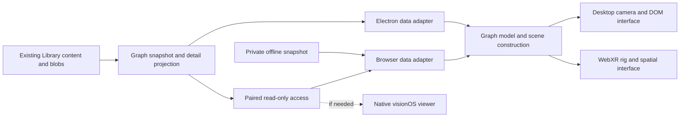
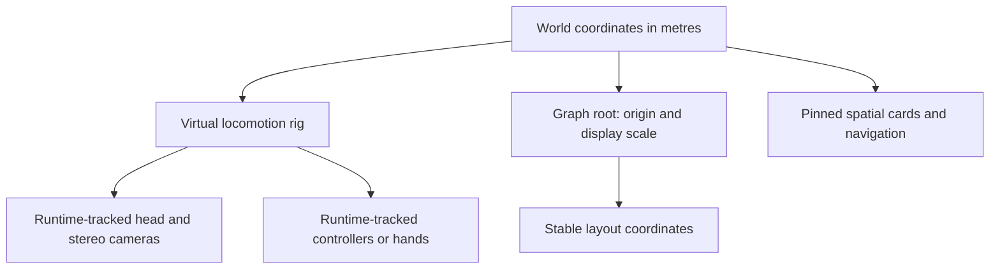
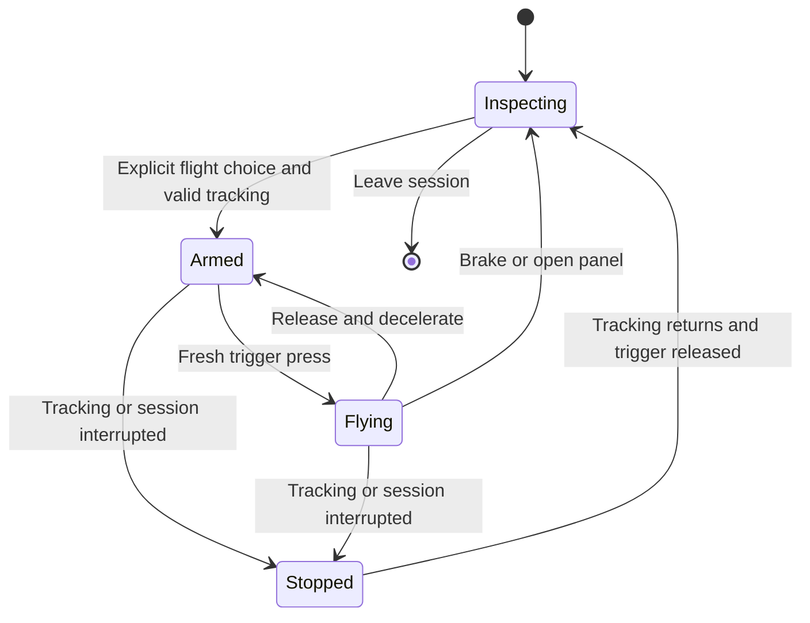

# Exploring the Library graph on Apple Vision Pro

> [!TIP]
> Start with a WebXR experiment using the existing Three.js graph. Prove headset rendering and PlayStation VR2 Sense input separately, then add controller-directed flight. If Safari cannot supply tracked controller poses and analog triggers, use a small native visionOS viewer for that experience.

## What we want to do

Chris wants to stand inside the Library's three-dimensional link graph, explore its neighborhoods, and inspect the things saved there. A controller becomes a flight instrument: point it through space, squeeze the trigger to accelerate, and look around independently while moving. Search and filters should make a collection of roughly 54,000 links navigable rather than merely impressive to look at.

Useful moments include finding a saved video, seeing its title and thumbnail, following a playlist into related resources, and discovering an unexpected connection between topics. The graph should explain whether an edge comes from a playlist, creator, hashtag, or another source. Future AI suggestions need their own evidence label; spatial proximity alone must not imply a factual relationship.

This builds on the [personal Library](./0466_[-]_PERSONAL_LIBRARY_FOR_LEARNING_AND_SHARING.md), the [durable content proposal](./0467_[_]_DURABLE_LIBRARY_CONTENT_AS_XNET_NODES.md), and the earlier [immersive recommendation space exploration](./0151_[_]_SELF_ORGANIZING_SOCIAL_GRAPH_IMMERSIVE_RECOMMENDATION_SPACE.md). The earlier immersive proposal supplies product ideas; the code inventory below describes today's implementation.

**Status: software experiment implemented; physical review pending.** The standalone browser viewer now shares graph filtering, search and initial layout with the desktop app. It includes a WebXR probe, stationary overview, explicit destination travel, guarded controller flight and an expiring read-only HTTPS pairing bridge. No physical Vision Pro or Sense controller result has been recorded. Full-pose flight, the native fallback decision and headset performance budgets remain gated on that review.

The [runbook](../../apps/electron/src/spatial/README.md) explains how to build the viewer, establish trusted HTTPS and record device evidence. The implementation is stacked on the unfinished Library work in PR #721; it is not a production release claim.

### Implementation evidence — 2026-10-06

| Area                             | Evidence                                                                                                                                                                                                                 | Limit                                                                                                  |
| -------------------------------- | ------------------------------------------------------------------------------------------------------------------------------------------------------------------------------------------------------------------------ | ------------------------------------------------------------------------------------------------------ |
| Pure logic and access boundaries | 66 focused tests pass: deterministic flight, matched snapshot revisions, filtering, graph privacy, capability scope, expiry/revocation and verified TLS transport. The full suite passes 12,749 tests with four skipped. | Synthetic inputs do not prove physical controller behavior.                                            |
| Browser viewer                   | Drove 1,000 and 56,000 synthetic link fixtures; searched the last link, inspected evidence and coverage, and applied platform/group/neighborhood filters with visible counts. No browser errors observed.                | Desktop rendering does not establish stereo timing, readability or comfort.                            |
| Native desktop entry             | Drove the real Electron Library graph and Spatial viewer control in an isolated profile; verified preload status and rejection of insecure HTTP.                                                                         | No personal identity was replaced, no test-auth bypass was enabled, and no real Library was exposed.   |
| Build and types                  | Spatial production bundle and Electron main/spatial typechecks pass.                                                                                                                                                     | Five existing renderer type errors reproduce at the base commit; headset execution remains unverified. |
| Rendering limits                 | One image/card, eight labels, 20,000 background edges, 200 selected edges; picking only on intentional selection.                                                                                                        | Provisional limits. Cluster summaries, picking acceleration and resolution tuning await measurements.  |

Unchecked combined implementation/validation items below retain their physical-device requirements even where the software exists. The release review must decide whether the web path is viable before full-pose flight or a native client is implemented.

The review date gives three weeks to decide whether the hardware experiment justifies further work. It is a decision checkpoint, not a delivery promise. The initial read-only viewer is reversible, so this exploration is `two-way`. A durable public pairing protocol or schema commitment would need an ADR with a `Tripwire:` in the [decision log](../../site/src/content/docs/docs/architecture/decisions.mdx) before implementation.

## Current state in the repository

We already own a Three.js renderer. We are not using `3d-force-graph` or `react-force-graph`, and a library replacement is not a prerequisite for XR.

| Part                      | Status                 | Current implementation and implication                                                                                                                                                                                 |
| ------------------------- | ---------------------- | ---------------------------------------------------------------------------------------------------------------------------------------------------------------------------------------------------------------------- |
| Rendering                 | ✅ Existing            | [scene.ts](../../apps/electron/src/renderer/components/library-graph/scene.ts) batches nodes into `Points` and edges into `LineSegments`. It uses a custom point shader, a perspective camera, and `OrbitControls`.    |
| Layout                    | ✅ Existing            | [layout.worker.ts](../../apps/electron/src/renderer/components/library-graph/layout.worker.ts) runs `d3-force-3d` off the main thread and transfers position buffers. The layout can be paused.                        |
| Scene lifecycle           | 🚧 Desktop assumptions | [GraphCanvas.tsx](../../apps/electron/src/renderer/components/library-graph/GraphCanvas.tsx) owns the worker and scene, including automatic framing when layout finishes. XR needs a separate framing policy.          |
| Search, groups, details   | 🚧 DOM interface       | [LibraryGraphView.tsx](../../apps/electron/src/renderer/components/LibraryGraphView.tsx) supplies search, filters, selection, and details. These controls do not automatically become visible in an immersive session. |
| Graph data                | ✅ Reusable shape      | [library-graph.ts](../../apps/electron/src/shared/library-graph.ts) defines nodes, indexed edges, relationship evidence, counts, and warnings. Positions are not currently part of that snapshot.                      |
| Data access               | 🚧 Electron dependency | The view calls `window.xnet.libraryGraph()` and related native APIs. [library-ipc.ts](../../apps/electron/src/main/library-ipc.ts) wires desktop access; Safari cannot use Electron's preload.                         |
| Relationship construction | ✅ Source evidence     | [graph.ts](../../apps/electron/src/library/graph.ts) derives the graph from Library records. Preserve resource identities and evidence when presenting it elsewhere.                                                   |
| XR input and presentation | 🚧 Experimental        | A separate [browser scene](../../apps/electron/src/spatial/scene.ts) provides WebXR lifecycle, spatial panels and guarded flight. Hardware validation and a native visionOS target remain pending.                     |

The desktop [package manifest](../../apps/electron/package.json) pins Three.js `0.186.1` and `d3-force-3d` `3.0.6`. Test changes against those versions before assuming an upgrade is necessary.

There are several concrete desktop assumptions to remove. Rendering is currently invalidation-driven through ordinary `requestAnimationFrame`; labels are twelve projected HTML elements; picking uses a screen-space pointer; and camera distances are arbitrary graph units. Both points and lines disable frustum culling. These choices can work on a monitor without establishing acceptable headset behavior.

## What the platforms actually support

The following separates documented platform capabilities from combinations that still need a device test. Research was checked on **2026-10-03**.

| Capability                                      | Evidence                                                                                                                                                                                  | Consequence for xNet                                                                                                                     |
| ----------------------------------------------- | ----------------------------------------------------------------------------------------------------------------------------------------------------------------------------------------- | ---------------------------------------------------------------------------------------------------------------------------------------- |
| Immersive WebXR in Safari on Vision Pro         | ✅ WebKit documented `immersive-vr` with visionOS 2. [Safari 18 announcement](https://webkit.org/blog/15443/news-from-wwdc24-webkit-in-safari-18-beta/)                                   | A browser-based headset renderer is a credible first experiment. Query session support on the actual device.                             |
| Look-and-pinch input                            | ✅ WebKit documents transient pointer input and optional hand tracking. [Natural input for WebXR](https://webkit.org/blog/15162/introducing-natural-input-for-webxr-in-apple-vision-pro/) | Support pinch selection. Do not assume persistent mouse hover or access to a continuous eye-gaze stream.                                 |
| Newer WebXR rendering features                  | ✅ Safari 27 documents texture-array projection layers. [Safari 27 release notes](https://webkit.org/blog/18325/webkit-features-for-safari-27-0/)                                         | Feature-detect improvements later; they do not remove the need to measure our shaders and scene.                                         |
| Native PS VR2 Sense tracking                    | ✅ Apple documents spatial accessories in visionOS 26, including PlayStation VR2 Sense controllers. [WWDC25 spatial accessories](https://developer.apple.com/videos/play/wwdc2025/289/)   | Native visionOS has a documented route to tracked spatial controllers.                                                                   |
| Sense poses and analog triggers in Safari WebXR | ❓ Unverified                                                                                                                                                                             | Native support does not establish browser exposure. This is the first hardware gate, not a promise.                                      |
| WebXR controller button values                  | ✅ The Gamepads Module defines an optional gamepad on an XR input source. [W3C module](https://www.w3.org/TR/webxr-gamepads-module-1/)                                                    | Inspect mapping and capabilities at runtime. A standard's existence does not prove a particular browser/controller combination ships it. |
| Passthrough, immersive AR, and DOM overlays     | ❓ Separate probes                                                                                                                                                                        | Do not derive support from `immersive-vr`. Keep the first web design usable without them.                                                |
| Mac-to-headset spatial preview                  | ✅ Apple documents USD-based Spatial Preview in its 2026 material. [WWDC26 Spatial Preview](https://developer.apple.com/videos/play/wwdc2026/282/)                                        | An alternative for inspecting a graph exported as a scene, not an automatic bridge for this interactive Three.js canvas.                 |

Use the precise controller name: **PlayStation VR2 Sense**. An ordinary DualSense gamepad is a different input device and should not be presented as an equivalent tracked flight controller.

Native support uses Game Controller for device/input integration and spatial tracking APIs for poses. Apple documents the spatial gamepad declaration and accessory tracking usage description in its [Game Controller updates](https://developer.apple.com/documentation/updates/gamecontroller). A native implementation must handle the corresponding permission and disconnect states, rather than treating a connected button device as a tracked pose source.

## Options and tradeoffs

| Option                                                                           | Reuse                                                                    | Main cost or uncertainty                                                                                              | Decision                                                                    |
| -------------------------------------------------------------------------------- | ------------------------------------------------------------------------ | --------------------------------------------------------------------------------------------------------------------- | --------------------------------------------------------------------------- |
| **Safari + Three.js WebXR**                                                      | Graph model, layout, geometry, filtering logic, much of rendering        | Spatial interface, browser data access, and unverified Sense exposure                                                 | 🟢 First experiment                                                         |
| **Native visionOS viewer** using SwiftUI, RealityKit, Game Controller, and ARKit | Graph snapshots, IDs, layout results, content, interaction specification | A second renderer and client; native build/distribution workflow                                                      | 🟡 Preferred fallback when tracked controller flight cannot work on the web |
| **Spatial Preview from the Mac**                                                 | Graph data and exported positions                                        | Convert the scene to USD and integrate native Mac APIs; custom flight is not established by the preview documentation | 🟡 Useful separate tabletop inspection experiment                           |
| **Mac native rendering or streaming**                                            | Mac-side computation and data locality                                   | Metal/Compositor Services or an appropriate streaming pipeline, input return path, latency, and an awake Mac          | ⏸ Defer until measurements justify it                                       |
| **Mac Virtual Display alone**                                                    | Existing app unchanged                                                   | The graph remains inside a flat desktop window                                                                        | ✅ Convenient existing access, but does not satisfy immersive exploration   |

Apple also describes native and streamed rendering paths in its [visionOS 27 overview](https://developer.apple.com/videos/play/wwdc2026/287/) and a [RemoteImmersiveSpace](https://developer.apple.com/documentation/swiftui/remoteimmersivespace). These deserve a fresh implementation-specific investigation if we choose them. They are not evidence that Electron can send its existing canvas to the headset with a configuration switch.

For a native viewer, start with RealityKit and batched geometry. Do not create a heavyweight entity, label, and thumbnail for every saved link. Consider a custom Metal renderer only after proving that the simpler scene representation misses the measured budget. Adding Unity or Unreal would introduce a substantial dependency without resolving the initial input and data questions.

## Architecture: one Library, several ways to view it

The headset should read a projection of the existing Library. It should not become a second canonical database or run another bulk enrichment pass.



Extract a small data boundary around fetching a graph snapshot, looking up a resource, searching, and reading a thumbnail. This is a proposed boundary, not an existing browser API. Keep parsing, graph filtering, and flight state transitions as pure functions where practical; adapters own sessions, networking, and rendering effects.

Snapshots need a revision identifier, stable resource IDs, and a matching layout revision. Edges currently address node-array offsets: a client must never combine one snapshot's edges with another snapshot's positions. Cancel stale detail requests, retain the selected ID across refreshes, and install a new snapshot atomically. Keep saved viewpoints relative to a graph revision or a named resource neighborhood so they can be re-established after layout changes.

Start the rendering experiment with a small private fixture containing no personal data. Then prove read-only access to the real Library. On Vision Pro, `localhost` means the headset, not the Mac. WebXR requires a secure context, and a secure page cannot be assumed to fetch an arbitrary insecure LAN endpoint. Establish a trusted HTTPS path as part of the connection design. [WebXR Device API](https://www.w3.org/TR/webxr/).

The connection should use explicit pairing, a revocable read-only capability, and bounded endpoints for graph snapshots, details, and authorized blob reads. Restrict origins and resource scope. Do not expose the development debugger, test-auth bypass, arbitrary SQL, or identity keys. Merely changing a development server's bind address is not the proposed transport.

For an early offline trial, an explicitly selected private export is also viable. Keep it out of public static hosting and avoid bundling the entire archive corpus. Longer-term independent headset use should follow exploration 0467's node-and-blob ownership work, including actual blob availability. A viewer connected to a Mac is not yet an independently synced Library.

## Moving the existing scene into XR

Three.js documents enabling XR, entering a session, and using `setAnimationLoop` in its [VR guide](https://threejs.org/manual/pages/how-to-create-vr-content.html). Its [WebXRManager](https://threejs.org/docs/pages/WebXRManager.html) exposes the session, reference space, cameras, and controller objects. These are the rendering foundation, not the whole feature.

The renderer needs two explicit lifecycles:

- **Desktop:** preserve the current on-demand rendering, OrbitControls, DOM panels, and keyboard navigation.
- **Immersive:** run the XR animation loop, suspend OrbitControls, use spatial input and scene-resident labels, and restore desktop behavior cleanly when the session ends.

Place the XR camera and controller objects under a **locomotion rig**. The runtime still supplies the viewer's tracked head pose. Move the rig for virtual travel; do not overwrite the tracked camera with a controller quaternion. Head movement remains independent of steering.



Choose a graph-to-metre scale deliberately. Desktop camera distances and force-layout coordinates cannot be interpreted as metres unchanged. Separate graph scaling from locomotion speed. Keep coordinates near a local origin, and transform controller poses exactly once between reference space and world space.

Freeze the force layout during flight. A worker keeps computation off the render thread, but changing every node's position still causes buffer uploads and makes the world move around the viewer. Build or settle the layout before entry; offer an explicit refresh at rest. The existing automatic fit must never relocate the XR rig when a worker finishes.

DOM labels, autocomplete, and the detail inspector will not automatically appear inside the immersive render. Add a bounded set of spatial labels and cards. For the earliest experiment, search in the flat page before entry is acceptable, provided it is described as a temporary limitation. A useful follow-up needs an in-headset search panel or an explicit pause-to-search flow; do not assume DOM Overlay support. System text input or dictation is an optional platform integration, not a reason to invent a full virtual keyboard first.

## Controller flight

### Point, squeeze, and fly

The default mode should closely match Chris's request:

1. Choose a flight hand and enter flight mode explicitly.
2. Point the controller in the desired direction, including up, down, or backward.
3. Squeeze the analog trigger to apply acceleration along that direction.
4. Release it to decelerate; use a separate brake action for an immediate stop.
5. Look around freely while travelling. The other hand can select a link or open navigation.

**Acceleration is not speed.** Holding the trigger should increase velocity up to a configurable cap. Trigger release should apply drag by default, so letting go reliably brings the user to rest. An optional coast mode can come later. Tune the speed cap against the displayed graph scale, not the raw layout radius.

Keep the virtual horizon stable in this default mode. Pointing in a new direction changes thrust without forcing the viewer's head or rolling the entire world. Opening a menu or inspecting a result brakes flight. Selecting a card must never double as a throttle command.

### What full six-degree-of-freedom control means

Six degrees of freedom means **three axes of position and three axes of rotation**. Orientation alone has three rotational degrees of freedom. A tracked Sense controller can therefore support more than a forward pointing vector, if the client receives its full pose.

Offer an advanced **full-pose flight mode** as a separate, deliberate choice. A clutch captures a neutral hand pose. Relative hand translation commands sideways, vertical, and forward/backward movement; relative yaw, pitch, and roll command bounded angular rates. The trigger scales translational thrust. Releasing the clutch recenters the control reference so the user does not need to hold an awkward arm pose.

This makes roll and arbitrary vehicle orientation available without forcing them into the first experience. Rotating the locomotion rig is virtual vehicle motion; the headset's physical head tracking still composes with that rig. Specify the controller reference frame carefully so rotating the vehicle does not feed back into its own steering command.

| Input                     | Proposed behavior                                                      | Constraint                                                              |
| ------------------------- | ---------------------------------------------------------------------- | ----------------------------------------------------------------------- |
| Flight-hand pose          | Aim thrust; optionally control all six axes relative to a neutral pose | Full pose must actually be tracked; expose mode and handedness clearly. |
| Analog trigger            | Thrust with dead zone and adjustable response curve                    | Confirm analog range and input mapping on hardware.                     |
| Brake / clutch action     | Stop, or recapture neutral pose in advanced mode                       | Choose from available non-system controls after the probe.              |
| Other-hand ray and select | Inspect a link, pin a card, choose a destination                       | Use a dedicated interaction role; support swapping hands.               |
| Single-controller mode    | Explicit switch between navigation and inspection                      | No simultaneous ambiguous trigger action.                               |
| Hands only                | Pinch selection, graph manipulation, destination jumps                 | Remains useful without imitating a nonexistent analog trigger.          |

Do not reserve platform Home or other system gestures. Haptics may confirm selection if the chosen API supports them; adaptive trigger effects are not a requirement.

<details>
<summary>Frame-independent flight integration and coordinate rules</summary>

An illustrative default-mode model, with all quantities expressed in an agreed world frame:

```text
u       = responseCurve(deadZone(trigger))
forward = rotate(rigRotation * controllerReferenceRotation * aimCalibration, [0, 0, -1])
vNext   = clampLength((velocity + maxAcceleration * u * forward * dt) * exp(-drag * dt), maxSpeed)
pNext   = position + vNext * dt
headWorldPose = rigTransform * runtimeHeadPose
```

The controller quaternion above is in XR reference space. If an adapter has already supplied a world-space aim vector, do not multiply the rig transform again. Use the API's target ray for pointing and grip pose for a physical hand-relative flight instrument; calibrate their difference rather than assuming they are interchangeable.

Clamp elapsed time after a suspended frame and reset accumulated velocity on session interruption. Treat unavailable or non-finite poses as a stopped state, not a zero-position input. Advanced-mode angular rates need their own cap, damping, and neutral-pose transform; they are not implemented by this translational formula.

Keep the update function deterministic over state, sampled input, and `dt`. Test equivalent elapsed time at several frame rates, dead zones, braking, speed limits, coordinate conversion, and loss of tracking without needing a headset.

</details>

### Input loss and comfortable movement



On disconnect, lost tracking, hidden session, or an invalid pose, stop both translation and rotation immediately. Require trigger release and a fresh arming action before movement resumes. Avoid a sudden jump after reconnecting a controller or returning from a system panel.

Provide a stationary overview, a recoverable home viewpoint, and explicit destination jumps from the beginning. Smooth flight is optional. Advanced roll and pitch need separate opt-in, conservative limits, and an easy exit. The design follows Apple's emphasis on comfortable, user-controlled immersive motion; actual comfort still needs personal testing. [Immersive experiences](https://developer.apple.com/design/human-interface-guidelines/immersive-experiences/), [motion](https://developer.apple.com/design/human-interface-guidelines/motion).

## Finding things while inside the graph

Use three complementary views: a compact overview that can be rotated and scaled, a focused neighborhood around a selected resource, and flight through the larger graph. A virtual tabletop in WebXR is not a promise that it appears anchored to a real table through passthrough; a native shared-space presentation is a separate platform option.

Autocomplete should highlight a result and its neighborhood first. **Travel there** is a separate action, with a controlled transition and a return breadcrumb. The desktop's current select-and-focus behavior must not automatically become headset camera travel.

Filters should retain stable resource IDs, show matching counts, and explain collapsed neighborhoods. Category, platform, creator, playlist, and tag controls can all operate on the same graph projection. Keep the current view stable while choosing a filter, then make changes explicit. A cluster summary must disclose that it represents more links than are individually drawn.

For inspection, a tracked controller can provide a ray and intentional hover; pinch can select a result without requiring hover. WebKit's transient input sources can appear only during a gesture, and hand-tracking sources can coexist with them. Iterate and classify sources rather than hard-coding the first two array entries. [WebKit input model](https://webkit.org/blog/15162/introducing-natural-input-for-webxr-in-apple-vision-pro/).

Pin a small card near the selected resource with its thumbnail, title, description, source, tags, memberships, and relationship evidence. Offer longer README text or transcript content on demand. Show retrieval coverage: a preview is not full content, and a written caption is not a spoken transcript. Fetch thumbnail bytes through the authorized data adapter and retain useful placeholders when enrichment is unavailable. Avoid a wall of constantly head-locked panels.

## Rendering a large Library

The batched points and lines are a useful starting point. However, acceptable desktop performance is not evidence of acceptable stereo rendering, input latency, or thermal behavior.

Start at 1,000 synthetic links, move to 10,000, then test a representative graph near the Library's current size. Keep the whole collection addressable while drawing a useful subset of labels, detailed nodes, thumbnails, and edges. Render distant regions as cluster summaries, show nearby resources individually, and emphasize selected relationships. Every resource must remain reachable through search even when its region is collapsed.

| Cost                     | Proposed treatment                                                     | Evidence to collect                                                     |
| ------------------------ | ---------------------------------------------------------------------- | ----------------------------------------------------------------------- |
| Layout changes           | Settle or cache a versioned layout before flight                       | No continuous full-position uploads during a stable session.            |
| Geometry and overdraw    | Preserve batching; limit visible edge density; consider spatial chunks | Stereo frame timing and transparent fragment cost at each graph size.   |
| Labels and images        | A bounded label budget, a few pinned cards, demand-loaded thumbnails   | Texture memory and readability at actual viewing distances.             |
| Picking                  | Spatially indexed candidates or a measured GPU picking path            | No full 54,000-node raycast on every XR frame.                          |
| Shader sizing            | Review the current pixel-sized point shader against each XR view       | Nodes remain legible and targetable without filling the scene.          |
| Resolution and foveation | Feature-detect supported controls and tune after measurement           | Measured quality and frame-time tradeoff, not a desktop DPR assumption. |

Measure delivered session cadence, p95/p99 frame intervals, missed frames, memory, and sustained behavior. Use GPU timing only where the runtime exposes a suitable facility. Derive a frame budget from actual cadence: 90 Hz gives about 11.1 ms and 120 Hz about 8.3 ms. These are examples, not promises about a particular headset session.

Keep WebGL for the first experiment. A WebGPU migration or graph-library replacement adds scope before we know the bottleneck. If the large graph cannot meet the measured budget after bounded detail and stable layout, compare native rendering and Mac-assisted paths using the same fixture and interaction tasks.

## Risks and decisions still open

The largest uncertainty is Safari's exposure of the exact controller combination. Record headset model, visionOS version, Safari build, and controller firmware when testing. Documentation establishes native support; only a device result can settle the proposed web flight path.

Spatial browsing also changes what a good graph layout means. A useful monitor layout can be too dense to inhabit. We may need a room-sized overview and local neighborhoods even when rendering every point is technically affordable. Evaluate whether flight helps Chris find and connect resources, rather than treating time spent flying as the success metric.

The data connection is a separate deliverable. A headset that cannot read the Mac's authenticated Library will only show a demo. Mac sleep, revoked pairing, unavailable thumbnails, and interrupted requests must produce understandable states without losing the selected resource. Offline use needs a deliberate local content policy and must not be claimed from graph metadata alone.

Use the existing desktop interface as the accessible fallback. In-headset controls need adjustable text, handedness, and stationary alternatives; color alone should not distinguish edge evidence. Refer to Apple's [accessibility guidance](https://developer.apple.com/design/human-interface-guidelines/accessibility) when implementing the native or spatial interface.

## Implementation checklist

### 1. Establish the hardware facts

- [x] Build a minimal secure WebXR probe using synthetic geometry and explicit session entry/exit.
- [ ] Record actual device/software versions, `immersive-vr` support, granted features, and session cadence.
- [ ] Pair PS VR2 Sense controllers through the system and inspect input-source profiles, handedness, ray mode, grip pose, and gamepad mapping.
- [ ] Verify independent position and rotation tracking, analog trigger values across the squeeze range, and disconnect/reconnect behavior.
- [ ] Verify hands-only selection and coexistence of transient pointers with persistent input sources.
- [ ] Decide WebXR or native for controller flight from these results. A missing browser capability remains missing; do not silently substitute a button-only demo.

### 2. Make one small graph useful in the headset

- [x] Extract the graph data boundary and share model/layout logic without making the browser depend on Electron preload.
- [ ] Add XR session lifecycle, metre scaling, a locomotion rig, and stable precomputed positions; restore desktop controls on exit.
- [ ] Add stationary overview, selected-resource highlighting, spatial labels, one metadata card, and a home action.
- [x] Implement point-and-accelerate flight, configurable handedness, braking, and interruption handling as pure state transitions with tested math.
- [ ] Add explicit search destination travel and a return trail before enabling long-distance free flight.
- [ ] Prototype full-pose flight behind a separate opt-in only after the default flight interaction passes hardware review.

### 3. Connect the real Library and measure scale

- [ ] Design and verify trusted, paired read-only access for snapshots, search, details, and thumbnails; keep private data off public hosting.
- [x] Use stable IDs and revision-matched positions; handle stale responses, disconnection, and missing enrichment explicitly.
- [x] Add playlist, platform, tag, and category filtering with visible counts and evidence labels.
- [ ] Measure 1,000-link, 10,000-link, and representative full-Library fixtures on the headset; document the chosen frame and memory budgets.
- [ ] Add bounded labels, edge detail, thumbnail loading, and picking acceleration where measurements require them.
- [ ] Decide whether native visionOS or Mac-assisted rendering is justified by an observed capability or performance gap.

## Validation checklist

The named consumer of this validation is the **spatial Library release review**, owned by Chris. It can accept the browser viewer, require the native fallback, or stop the experiment. Physical-device results are required; a simulator or desktop browser is insufficient evidence for tracked flight or comfort.

- [ ] With real hardware, find three known resources by search and by navigating a neighborhood; inspect saved metadata and return to the previous location.
- [ ] Demonstrate that trigger pressure changes acceleration, the speed cap holds, the head remains independent, and braking does not require a precise gesture.
- [ ] Demonstrate full position/rotation input separately from ordinary gamepad button support; record which modes the tested platform supports.
- [ ] Exercise tracking loss, invalid poses, controller disconnect, session suspension, and re-entry with a held trigger; all must stop motion until explicitly rearmed.
- [x] Verify deterministic flight integration with in-memory inputs at several frame rates, including large time gaps and non-finite input. If a new automated gate is added, include negative controls that make it fail when braking or limits are broken.
- [ ] Confirm selection and card inspection never cause unintended acceleration or automatic viewpoint jumps.
- [ ] Complete a proposed 20-minute browsing trial, record Chris's comfort and task feedback, and verify the stationary mode remains useful. This is a product trial, not a universal comfort guarantee.
- [ ] Meet the declared frame-time and memory budgets on the full-size fixture, including selection and filtering; retain every resource's searchability under level-of-detail reduction.
- [ ] Revoke pairing and interrupt connectivity; prove unauthorized reads fail, UI errors are visible, and original Library content is unchanged.
- [ ] Verify exit restores the desktop graph without duplicate loops, stale input handlers, or a moved desktop camera caused by XR cleanup.

## Recommendation

Build the **hardware capability probe first**, then a small read-only WebXR graph. The existing Three.js scene makes that a focused experiment, but the browser's Sense support and access to real Library data must be proven before promising the complete experience.

If the browser supplies tracked poses and analog triggers, implement the requested flight model there and measure it with the real graph. If it does not, retain a useful hands-based browser viewer and choose a native visionOS client for full controller flight. Keep the graph model, saved content, relationship evidence, and interaction rules common across those paths.

The first milestone is simple: put on the headset, find a saved link, fly deliberately to its neighborhood, inspect its thumbnail and metadata, and return home comfortably. That proves more than a large cloud of points alone.
