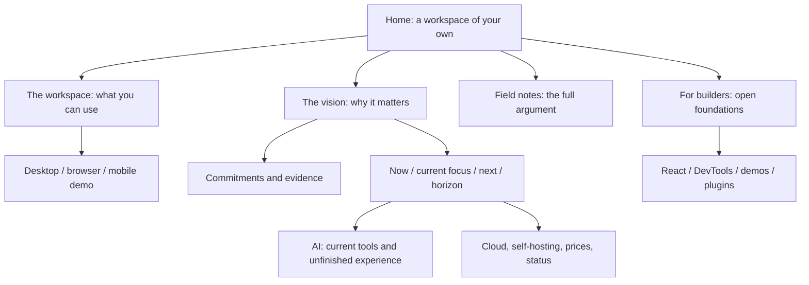

# A workspace of your own

> [!TIP]
> Lead with the workspace people can use, then explain the larger world it could grow into. Use the new mesh mark as a visual anchor, and the essays as the source of the argument.

> [!IMPORTANT]
> This is a local design preview. Chris requested a review before publication. Do not push a preview deployment, merge, or publish this redesign until that review happens. The previous approval to publish the brand assets does not apply to this work.

## Problem

The homepage sells an easy coding-agent integration as the main product. The owner’s current assessment is that this is ahead of the shipping experience. The repository supports a narrower claim: agent interfaces exist, while integrated daily work, clear in-product review, and consumer-friendly setup remain goals in `docs/ROADMAP.md`.

The site also has several competing visual treatments: gradient SaaS landing pages, illustrated long-form essays, developer documentation, a dense pricing grid, and a newly refined wordmark. The essays contain a richer account of why the project exists than the homepage does.

Chris selected **people who want a workspace they own** as the primary audience. Developers remain an important second route.

## Recommendation

A warm, editorial site, grounded in the app and linked to the essays. Paper and ink give the illustrations room to breathe. Deep green and a small amount of pale green connect to living systems without turning the project into an environmental claim. The mesh mark supplies the rounded geometry; large, plain headings and occasional serif emphasis provide a different rhythm from the old product grid.

The homepage’s main promise is “Your work. Your world. Yours to keep.” The next sentence names the actual category: an open workspace for notes, projects, and saved knowledge. It offers downloads first, then the vision. No command-line installation is required to understand the page.

The builders section explains the substrate through three reusable parts: nodes, schemas, and views. A compact diagram makes the building-brick idea tangible; a native disclosure adds local copies, signed changes, and the distinct document and structured-data merge rules. It links to “Clutch Power” and the data model, and distinguishes the alpha SDK from a future ecosystem of interchangeable tools.

The October 24 review date is a two-week design decision checkpoint. It is not a release commitment.

## What the repository actually supports

| Claim                                   | Evidence                                                                | Treatment                                                                                   |
| --------------------------------------- | ----------------------------------------------------------------------- | ------------------------------------------------------------------------------------------- |
| Documents, databases, and canvases      | `apps/electron/src/renderer/App.tsx`, workspace components; `README.md` | Available in alpha                                                                          |
| Personal library                        | `apps/electron/src/library/`, renderer library views                    | Explicitly desktop                                                                          |
| Browser demo                            | `README.md`, `apps/web/`                                                | Passkey; limited temporary hosted backups; export important work                            |
| Local data and workspace export         | `README.md`, storage/export implementation, `docs/CHARTER.md`           | Concrete ownership mechanisms                                                               |
| Agent connection tools                  | `packages/cli/src/commands/connect.ts`, `site/src/data/agents.ts`       | Developer setup; write permission explicit                                                  |
| Easy integrated AI daily driver         | `docs/ROADMAP.md`, owner correction                                     | Being built; never presented as the default experience                                      |
| Own hub and managed hosting foundations | `packages/hub/`, `apps/cloud/`, `site/src/data/pricing.ts`              | Explain choices and operator trust; preserve prices and limits                              |
| Full mobile workspace                   | `apps/expo/`, `site/src/pages/mobile.astro`                             | Developer demo; setup depends on whether a hosted build is configured                       |
| Broad discovery commons                 | `docs/ROADMAP.md`, `docs/VISION.md`                                     | Longer-term direction; distinguish publishing foundations from a finished community network |

The existing app screenshot is retained as an actual workspace illustration and labelled **example content**. Its sample document is not evidence of customer counts or completed features.

## The essays as the organising idea

The survey covered the headings, opening and closing arguments of all 25 published essays, plus the charter, roadmap, vision, and relevant code. Metaphors inform the design; their scientific or historical details do not become new product claims.

| Thread                        | Essays                                                                                                         | Where it enters the redesign                                                   |
| ----------------------------- | -------------------------------------------------------------------------------------------------------------- | ------------------------------------------------------------------------------ |
| Keep the thing you made       | The Hundred-Year Machine; Weights You Can Hold; The Door Inside the House; The Right to Say No                 | Ownership lead, downloads, backups, exit, hosting choices                      |
| Data is common ground         | Data Should Work Like Soil; The Forest and the Field; The Desert That Feeds the Forest; The Vault and the View | Main vision section: data persists while tools change; mesh garden drawing     |
| An open workshop              | The Workshop and the Walled Garden; Clutch Power; The Tip of the Hook; The Loom You Can Read                   | Developer route, open schemas, extension foundations, inspectable machinery    |
| Keep a legible history        | Tree Rings; Palimpsest; People in Disguise                                                                     | Provenance and agency, without promising a finished history-review UI          |
| Choose and correct the course | Hand on the Tiller; The Gentlest Furnace; Atoms for the Ballot                                                 | Permission, feedback, limits, a direction that stays open to revision          |
| A community can keep going    | A Great Pirate Age; The World’s Greatest Record Store; The Table and the Wall                                  | The commons horizon, voluntary connection, communities outlasting servers      |
| Respect a person’s life       | Timeout; The Matchmaker and the Meter; Rig the Game or Play; The Harvest You Can Count                         | Calm presentation, no urgency tricks or invented growth metrics; charter links |

The dedicated vision page walks through permanence, interdependence, creative agency, consent, the commons, and room to go quiet. Each chapter links to the essay behind it. The home page includes three selected essays. The journal preserves every published post and its metadata, adding topic and text filtering across all 25 essays, including the featured entry.

## Information architecture

The header has four destinations and one product action. Mobile uses a native disclosure menu, retaining access to the destinations rather than hiding the navigation. The footer keeps the detailed paths available without making the first screen a directory.

## Scope and implementation map

| Surface                                                                                                                   | Change                                                                                                                       |
| ------------------------------------------------------------------------------------------------------------------------- | ---------------------------------------------------------------------------------------------------------------------------- |
| `/`                                                                                                                       | Complete new narrative and layout; mesh illustration; real workspace image; product, vision, maturity, essays, builders      |
| `/workspace`                                                                                                              | New product tour, concrete features, alpha and platform questions                                                            |
| `/why`                                                                                                                    | New illustrated vision, connected directly to six essay themes                                                               |
| `/privacy-by-design`                                                                                                      | Preserves the former detailed privacy argument at a discoverable route                                                       |
| `/roadmap`                                                                                                                | New reader-oriented sequence, with present capability separated from goals                                                   |
| `/blog`                                                                                                                   | New editorial index, featured essay, collection grid and filters                                                             |
| `/agents`                                                                                                                 | New honest introduction and setup framing; retains working setup tabs, permission details, and receipts                      |
| `/download`                                                                                                               | Rebuilt platform chooser; preserves release asset discovery and describes unresolved lookup honestly                         |
| `/cloud`                                                                                                                  | Rewritten hosting story and operator choice; marks easier onboarding as a goal                                               |
| `/build-with`, `/devtool`                                                                                                 | New editorial introductions; existing technical examples and controls retained                                               |
| `/react`, `/mobile`, `/plugins`, `/cloud/pricing`, `/open`, `/compare`, `/commitments`, `/status`, `/changelog`, `/demos` | Shared visual overhaul and targeted copy/hierarchy corrections; underlying data, pricing, filters, and useful depth retained |
| Individual essays and legal pages                                                                                         | New shared navigation, footer, and palette; article arguments, artwork, citations, and legal text preserved                  |
| Documentation and application UI                                                                                          | Outside this redesign; existing destinations remain linked                                                                   |

Implementation lives in the real Astro pages and `site/src/components/marketing/`. This is a runnable visual companion rather than a Storybook sketch: Astro’s real routing, responsive layout, theme behavior, and data-driven controls are what the reviewer needs to see. The markdown remains the record of decisions.

## Options considered

| Option                                              | Strength                                 | Cost                                      | Decision                      |
| --------------------------------------------------- | ---------------------------------------- | ----------------------------------------- | ----------------------------- |
| Refine the current agent-first page                 | Small diff                               | Retains the central mismatch              | Rejected for this pass        |
| Lead with the entire decentralised-network vision   | Strong philosophy                        | Hard to tell what a visitor can use today | Vision becomes the second act |
| Lead with an owned workspace, then open the horizon | Useful entry point and room for ambition | Requires a genuine narrative rewrite      | Recommended                   |

## External reference points

[Ink & Switch’s local-first essay](https://www.inkandswitch.com/essay/local-first/) grounds ownership in practical properties: local copies, offline work, collaboration, and long-term access. This supports explaining mechanisms before making a broad claim about freedom.

[Linear’s current site](https://linear.app/) is a useful reference for deliberate hierarchy and a legible product route. This redesign keeps its own editorial and organic identity; it does not adopt Linear’s agent-led positioning.

The primary voice and visual material come from xNet’s own essays and illustrations, rather than a third-party template.

## Review questions and tradeoffs

- Does the warm paper / green direction feel like the right extension of the black-and-white mark?
- Is the ownership promise clear enough above the fold, or should the first sentence name documents and databases instead of broader uses?
- The vision page is deliberately slower and more essay-like. Is that the right amount of depth before linking into the blog?
- The public pricing catalog is retained. Operational readiness should be rechecked before publication; this preview does not certify the hosted signup experience.
- The charter page currently summarises six commitments while the source charter has a seventh Floor section. Expanding the receipt inventory is separate factual work; the redesign does not invent its enforcement status.
- This is alpha software. Marketing should continue to be reviewed against working user journeys, not just features found in source.

## Implementation checklist

- [x] Ground the claim map in source, roadmap, and owner correction.
- [x] Implement the shared shell and responsive visual system.
- [x] Build the homepage, workspace, vision, roadmap, and journal.
- [x] Rework supporting marketing routes while retaining working data and controls.
- [x] Preserve essay and legal prose, and make the previous privacy argument reachable.
- [x] Provide a local browser preview for Chris.
- [ ] Incorporate Chris’s design review before any publication.

## Validation checklist

- [x] Site production build and existing content/output validators pass.
- [x] Check desktop, tablet, and narrow phone layouts in light and dark themes.
- [x] Check menu, theme toggle, journal search/topics, developer tabs, and links.
- [x] Check internal route references and heading structure.
- [x] Verify nothing was pushed, merged, or deployed for this redesign.

## Preview and verification notes

The local review runs at `http://127.0.0.1:4330/` from a production Astro build with
`PUBLIC_DESIGN_PREVIEW=true`. That environment flag adds a review strip; it does
not change the production deployment configuration. The branch is
`codex/marketing-redesign-preview` in the managed `marketing-redesign-preview` worktree.

- The first browser sweep covered 20 routes at 1440, 768, 375, and 320 pixels. It found an agent-tab overflow at 320 pixels; the tab row now wraps, and the 320-pixel recheck passes.
- Journal title search, empty results, topic filters, and reset all worked. The reset restores all 25 essays.
- The mobile navigation opens and routes to the builder page. Developer language and agent-client tabs switch correctly; language selection and the theme persist after reload.
- An exact source comparison confirms the 25 essay bodies and six legal pages preserve their prose. Their only direct edit is the skip-link target on `main`.
- The local status page cannot fetch the Cloud status endpoint because that endpoint does not allow the localhost origin. Its existing dated snapshot fallback remains visible. This preview does not verify hosted service health, signup, or billing.
- The final production build passed: 136 pages built; the output validator verified 52 static routes. A static check followed 3,640 internal links across 71 marketing outputs with zero missing routes or anchors.
- Dark-theme checks covered eight routes at desktop, tablet, and phone widths with no overflow or page exceptions. The final homepage check also passed at 320 pixels. Reduced-motion scrolling is `auto`; the mobile menu and mechanics disclosure remain usable with JavaScript disabled.
- The full site build runs the existing comparison, changelog, plugin, surveillance, metrics, search, and output validators. No new UI test suite or CI gate is introduced.

## References

- `docs/VISION.md`, `docs/ROADMAP.md`, `docs/CHARTER.md`, `README.md`
- `site/src/data/blog.ts`, `site/src/data/blog-art.ts`, all `site/src/pages/blog/*.astro`
- `site/src/data/agents.ts`, `site/src/data/pricing.ts`, `site/src/data/commitments.ts`
- `apps/electron/src/renderer/App.tsx`, `apps/electron/src/library/`
- `packages/cli/src/commands/connect.ts`
- `site/src/styles/marketing.css`, `site/src/components/marketing/`, `site/src/layouts/Base.astro`
