# Commenting System Exploration

> Universal commenting: comment on anything, anywhere — text selections, database cells, canvas objects, or entire nodes.

**Status**: Design Exploration  
**Last Updated**: January 2026

---

## Vision

Comments in xNet should feel as natural as highlighting text in a book and writing in the margin. The system should support commenting on:

- **Text selections** in the rich text editor (inline/margin comments)
- **Database cells, rows, or columns** in table/board views
- **Canvas objects** (nodes, groups, images, videos)
- **Arbitrary canvas positions** (Figma-style "click to comment")
- **Entire Nodes** (page-level, database-level discussion)

All comments sync in real-time via the existing Node/Change infrastructure. Comments are themselves Nodes, which means they're queryable, syncable, and type-safe.

---

## Data Model

### Core Principle: Comments as Nodes

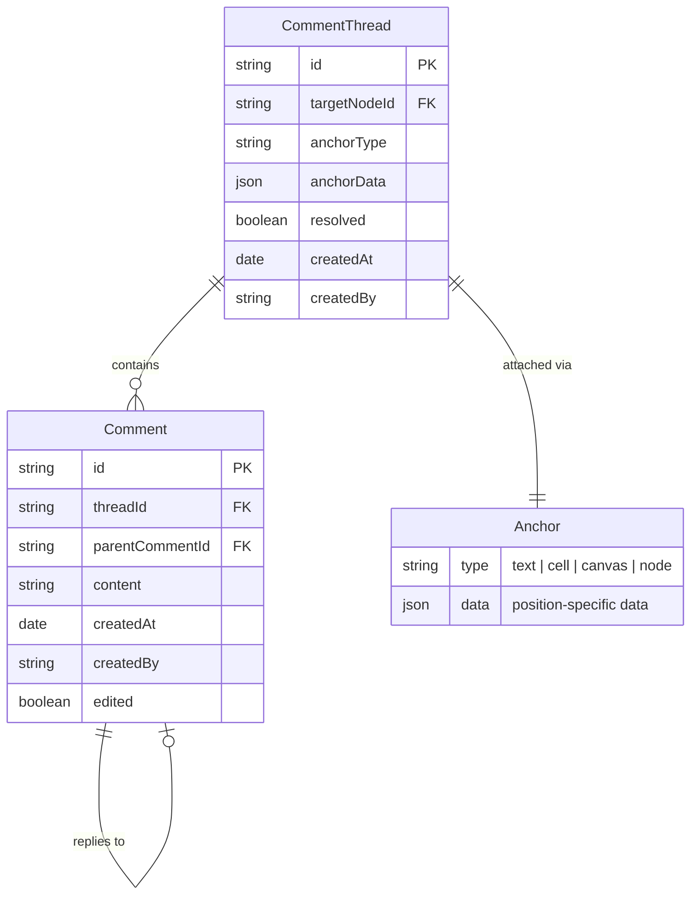

### Schema Definitions

```typescript
// packages/data/src/schema/schemas/comment.ts

export const CommentThreadSchema = defineSchema({
  name: 'CommentThread',
  namespace: 'xnet://xnet.dev/',

  properties: {
    // What this thread is attached to
    targetNodeId: relation({
      required: true,
      description: 'The Node this thread comments on (Page, Database, Canvas, etc.)'
    }),

    // How the thread is anchored to the target
    anchorType: select({
      options: [
        'text',
        'cell',
        'row',
        'column',
        'canvas-position',
        'canvas-object',
        'node'
      ] as const,
      required: true,
      description: 'Type of anchor point'
    }),

    // Anchor-specific positioning data (see Anchoring Strategies below)
    anchorData: text({
      required: true,
      description: 'JSON-encoded anchor position (type depends on anchorType)'
    }),

    // Thread state
    resolved: checkbox({
      default: false,
      description: 'Whether the thread has been resolved'
    }),
    resolvedBy: person({
      description: 'Who resolved the thread'
    }),
    resolvedAt: date({
      description: 'When the thread was resolved'
    }),

    // Metadata
    createdAt: created(),
    createdBy: createdBy()
  },

  hasContent: false,
  icon: 'message-circle'
})

export const CommentSchema = defineSchema({
  name: 'Comment',
  namespace: 'xnet://xnet.dev/',

  properties: {
    // Thread membership
    threadId: relation({
      required: true,
      description: 'Parent thread this comment belongs to'
    }),

    // Reply threading (flat or nested)
    parentCommentId: relation({
      description: 'If this is a reply, the parent comment ID'
    }),

    // Content (see Rich Text vs Plain Text section)
    content: text({
      required: true,
      description: 'Comment body text'
    }),

    // Edit state
    edited: checkbox({
      default: false
    }),
    editedAt: date(),

    // Metadata
    createdAt: created(),
    createdBy: createdBy()
  },

  // Whether comments have rich text content (Yjs doc) — see analysis below
  document: undefined, // Plain text by default; see "Rich Text Analysis"

  hasContent: false,
  icon: 'message-square'
})
```

---

## Anchoring Strategies

The key challenge is: how does a comment "attach" to a specific location across different content types, and how does that anchor survive edits?

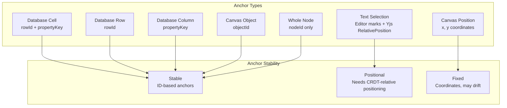

### 1. Text Selection Anchors (Editor)

This is the most complex case. Text positions shift as content is edited collaboratively.

**Approach: Yjs RelativePosition + TipTap Mark**

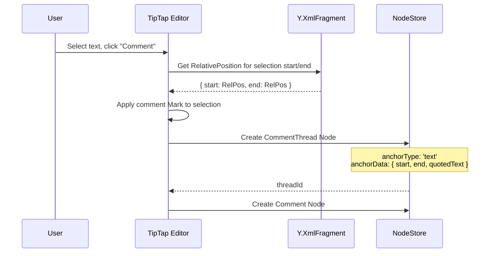

**How it works:**

1. User selects text and initiates a comment
2. We capture Yjs `RelativePosition` for both the start and end of the selection
3. A TipTap `Mark` is applied to the selected range (for highlighting)
4. The Mark stores the `threadId` as an attribute
5. As content changes, Yjs `RelativePosition` resolves to the correct absolute position

```typescript
// Anchor data for text selections
interface TextAnchor {
  // Yjs relative positions (survive concurrent edits)
  startRelative: Uint8Array // Y.encodeRelativePosition(...)
  endRelative: Uint8Array

  // Fallback: the quoted text at time of comment (for orphaned anchors)
  quotedText: string
}
```

**TipTap Mark for comment highlighting:**

```typescript
// packages/editor/src/extensions/comment-mark.ts

import { Mark, mergeAttributes } from '@tiptap/core'

export const CommentMark = Mark.create({
  name: 'comment',

  addAttributes() {
    return {
      threadId: { default: null },
      resolved: { default: false }
    }
  },

  parseHTML() {
    return [{ tag: 'span[data-comment]' }]
  },

  renderHTML({ HTMLAttributes }) {
    return [
      'span',
      mergeAttributes(HTMLAttributes, {
        'data-comment': '',
        class: HTMLAttributes.resolved ? 'comment-resolved' : 'comment-active'
      }),
      0
    ]
  }
})
```

**Styling (CSS):**

```css
/* Active comment highlight */
span[data-comment].comment-active {
  background-color: rgba(255, 212, 0, 0.25);
  border-bottom: 2px solid rgba(255, 212, 0, 0.8);
  cursor: pointer;
  transition: background-color 0.15s ease;
}

span[data-comment].comment-active:hover {
  background-color: rgba(255, 212, 0, 0.4);
}

/* Selected/focused comment */
span[data-comment].comment-active.comment-selected {
  background-color: rgba(255, 212, 0, 0.45);
  box-shadow: 0 0 0 2px rgba(255, 212, 0, 0.3);
}

/* Resolved comment (subtle) */
span[data-comment].comment-resolved {
  background-color: transparent;
  border-bottom: 1px dashed rgba(0, 0, 0, 0.15);
}

/* Overlapping comments (multiple marks on same text) */
span[data-comment] span[data-comment] {
  background-color: rgba(255, 180, 0, 0.35);
}
```

### 2. Database Cell/Row/Column Anchors

These are straightforward because databases use stable IDs.

```typescript
// Anchor data for database targets
interface CellAnchor {
  rowId: string // Node ID of the row
  propertyKey: string // Schema property key
}

interface RowAnchor {
  rowId: string
}

interface ColumnAnchor {
  propertyKey: string
}
```

### 3. Canvas Position Anchors (Figma-style)

Click anywhere on the canvas to drop a comment pin. The comment lives at fixed coordinates.

```typescript
// Anchor data for canvas position (Figma-style pin)
interface CanvasPositionAnchor {
  x: number // Canvas-space X coordinate
  y: number // Canvas-space Y coordinate
}

// Anchor data for canvas object
interface CanvasObjectAnchor {
  objectId: string // ID of the canvas object (shape, image, etc.)
  offsetX?: number // Optional offset from object center
  offsetY?: number
}
```

### 4. Whole-Node Anchors

Simplest case: the comment is about the entire Page, Database, or Canvas.

```typescript
// Anchor data for whole-node comments
interface NodeAnchor {
  // No additional data needed — targetNodeId is sufficient
}
```

---

## Real-Time Sync

Comments are Nodes, so they sync via the existing `Change<NodePayload>` mechanism with Lamport timestamps and LWW conflict resolution. This means:

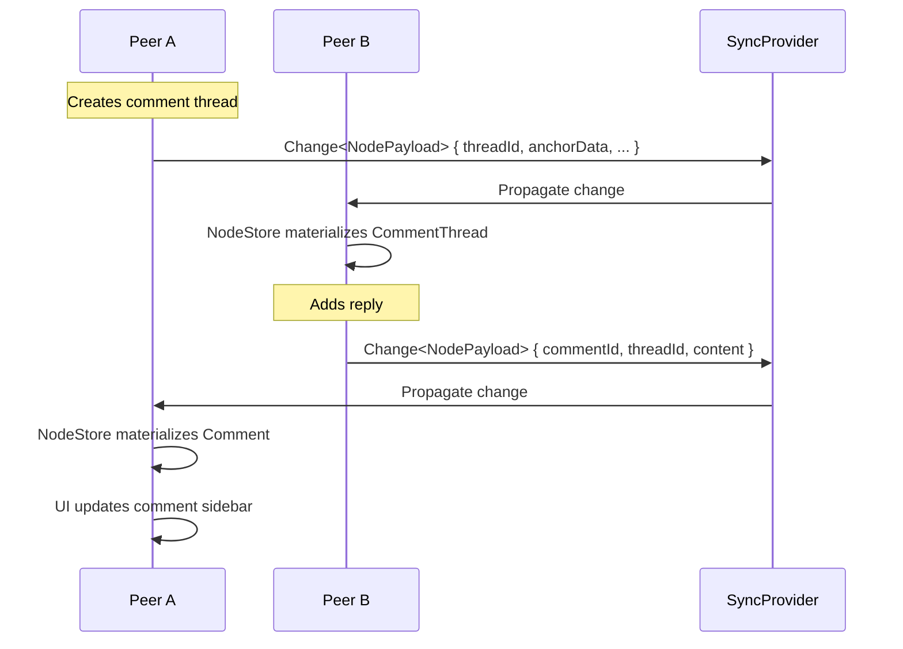

**Why this "just works":**

| Operation      | Mechanism                          | Conflict Resolution      |
| -------------- | ---------------------------------- | ------------------------ |
| Create thread  | New Node creation                  | No conflict (unique IDs) |
| Add reply      | New Comment Node                   | No conflict (unique IDs) |
| Edit comment   | Property update on Comment         | LWW per-property         |
| Resolve thread | Property update (`resolved: true`) | LWW — last resolver wins |
| Delete comment | Soft-delete Node                   | LWW on `deleted` flag    |

**Edge case — text anchor drift**: When the anchored text is edited collaboratively, the Yjs `RelativePosition` automatically resolves to the correct new absolute position. If the anchored text is entirely deleted, the thread becomes "orphaned" — we can show it in a sidebar with the `quotedText` as context.

---

## UI Patterns

### Editor Comments (Google Docs style)

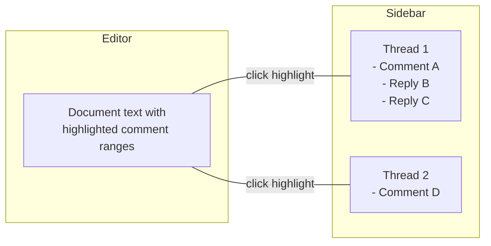

**Interaction flow:**

1. Select text → bubble menu shows "Comment" action
2. Click "Comment" → sidebar opens with new thread input
3. Highlighted text gets yellow background (comment Mark)
4. Clicking highlighted text scrolls sidebar to that thread
5. Clicking a sidebar thread scrolls editor to the highlighted text

### Canvas Comments (Figma/Miro style)

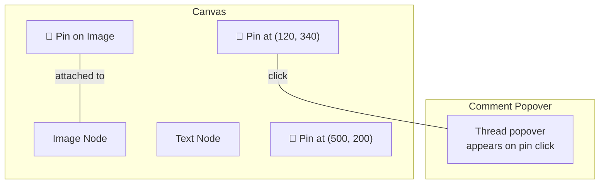

**Interaction flow:**

1. Enter "Comment mode" (shortcut or toolbar toggle)
2. Click anywhere on canvas → drops a pin, opens thread input
3. Click on an object → attaches comment to that object (follows it when moved)
4. Pins show author avatar or comment count badge
5. Click pin → popover with thread

### Database Comments

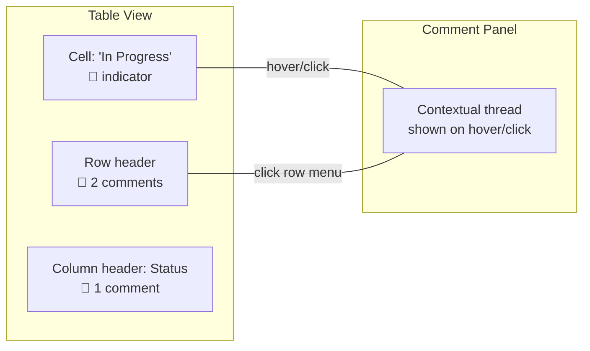

**Interaction flow:**

1. Right-click cell → "Comment on cell"
2. Comment indicator (speech bubble icon) appears in cell corner
3. Row comments accessible via row action menu
4. Column comments via column header menu

---

## Rich Text vs. Plain Text Comments

### Analysis

| Factor                    | Plain Text                                              | Rich Text (Yjs)                            |
| ------------------------- | ------------------------------------------------------- | ------------------------------------------ |
| **Complexity**            | Simple `text` property                                  | Full `Y.Doc` per comment                   |
| **Storage cost**          | ~100 bytes/comment                                      | ~500+ bytes/comment (Yjs overhead)         |
| **Sync**                  | LWW on content field                                    | Character-level CRDT merge                 |
| **Collaborative editing** | Last writer wins (conflicts possible)                   | Fine-grained merge                         |
| **Features**              | Text only                                               | Bold, italic, links, mentions, code, emoji |
| **Conflict scenario**     | Two people edit same comment simultaneously → one loses | Both edits merge correctly                 |
| **Performance**           | Negligible                                              | Yjs Doc init per comment                   |
| **Use case**              | Quick notes, short feedback                             | Detailed technical discussions             |

### How Others Handle This

| App              | Comment Format                | Notes                               |
| ---------------- | ----------------------------- | ----------------------------------- |
| **Google Docs**  | Plain text + mentions         | No formatting in comments           |
| **Figma**        | Plain text + mentions + emoji | Simple, fast                        |
| **Notion**       | Rich text (subset)            | Bold, italic, code, links, mentions |
| **Linear**       | Markdown-rendered             | Stored as markdown, rendered rich   |
| **GitHub**       | Markdown                      | Full markdown with code blocks      |
| **TipTap Cloud** | Rich text (TipTap JSON)       | Full editor capabilities            |

### Recommendation: Plain Text with Markdown Rendering

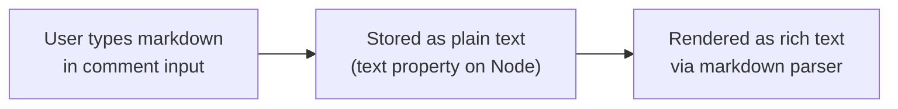

**Rationale:**

1. **Storage**: A plain `text` property is a single string. No Yjs Doc overhead per comment.
2. **Sync**: LWW is fine for comments. The scenario of two people editing the _same comment_ simultaneously is extremely rare (unlike the document itself). Comments are typically written by one person.
3. **Richness**: Markdown gives users bold, italic, code, links, and lists without needing a full CRDT document.
4. **Mentions**: `@mention` syntax can be parsed from the plain text (`@did:key:...` or `@DisplayName`).
5. **Simplicity**: No need to initialize a Yjs Doc for every comment. With hundreds of comments on a document, this matters.

**If we ever need full rich text**: We can upgrade individual comments to `document: 'yjs'` later. The schema system supports this — just add a `document` field to `CommentSchema`. But start simple.

```typescript
// Comment content: plain text with markdown
const comment = {
  content:
    'This **needs** to handle the edge case where `syncProvider` is null. See [RFC 42](link).'
}

// Rendered in UI via a lightweight markdown parser (e.g., marked, markdown-it)
// Mentions parsed: @alice → resolved via DID lookup
```

---

## Overlapping Comments

Multiple comments can highlight the same text range. This needs visual and interaction design.

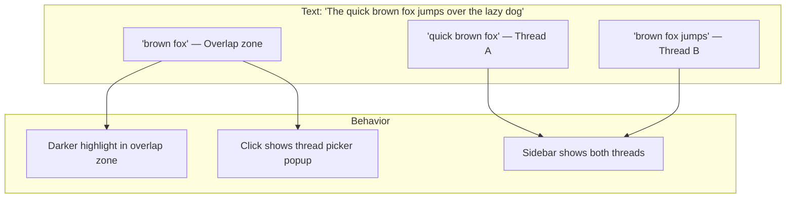

**Resolution strategy:**

- Overlapping marks produce a darker highlight (CSS handles this via nested spans)
- Clicking overlapping text shows a small popup: "2 comments — select which to view"
- The sidebar lists all threads, ordered by position in document

---

## Thread Lifecycle

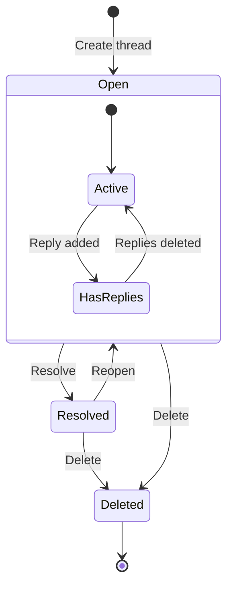

---

## Orphaned Anchors

When the target of a comment is deleted or the anchored text is fully removed:

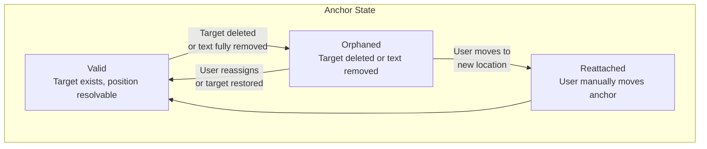

**Handling:**

- Orphaned threads move to a "Detached Comments" section in the sidebar
- Show the `quotedText` as context: _"Originally on: 'the quick brown fox...'"_
- User can drag/reassign to a new location, or dismiss
- If undo restores the deleted text, the anchor auto-reattaches (Yjs RelativePosition resolves again)

---

## Implementation Phases

### Phase 1: Document Comments (MVP)

```mermaid
gantt
    title Comment System Implementation
    dateFormat  X
    axisFormat %s

    section Phase 1 - Editor
    CommentThread/Comment schemas    :a1, 0, 2
    Comment Mark extension           :a2, 2, 3
    Yjs RelativePosition anchoring   :a3, 3, 5
    Comment sidebar UI               :a4, 3, 6
    Resolve/delete operations        :a5, 5, 7

    section Phase 2 - Database
    Cell/row/column anchors          :b1, 7, 9
    Database comment indicators      :b2, 8, 10

    section Phase 3 - Canvas
    Canvas position pins             :c1, 10, 12
    Canvas object attachment         :c2, 11, 13
    Comment mode UX                  :c3, 12, 14

    section Phase 4 - Polish
    Orphaned anchor handling         :d1, 14, 15
    Overlapping comment UX           :d2, 14, 16
    Notifications (mentions)         :d3, 15, 17
```

### Phase 1 Scope

1. `CommentThreadSchema` and `CommentSchema` definitions
2. `CommentMark` TipTap extension (highlight + threadId attribute)
3. Yjs `RelativePosition` capture for text anchors
4. React sidebar component showing threads for current document
5. Resolve/reopen thread actions
6. Whole-node comments (simplest anchor type)

### Phase 2 Scope

- Database cell/row/column anchor types
- Comment indicators in table view cells
- Context menu integration for "Comment on..."

### Phase 3 Scope

- Canvas position pins (Figma-style click-to-comment)
- Canvas object attachment (comment follows object movement)
- "Comment mode" toggle in canvas toolbar
- Pin rendering with avatar badges

### Phase 4 Scope

- Orphaned anchor detection and sidebar section
- Overlapping comment picker popup
- `@mention` parsing and notification integration
- Comment count badges on Nodes in navigation

---

## Open Questions

| Question                     | Options                                         | Leaning                                                                 |
| ---------------------------- | ----------------------------------------------- | ----------------------------------------------------------------------- |
| **Flat vs. nested replies?** | Flat (Linear/Figma) vs. threaded (GitHub/Slack) | Flat — simpler, works for focused discussions                           |
| **Max nesting depth?**       | 1 level (flat), 2 levels, unlimited             | 1 level (parent + replies)                                              |
| **Comment edit history?**    | Store previous versions vs. just "edited" flag  | Just "edited" flag to start                                             |
| **Reactions on comments?**   | Emoji reactions (like GitHub)                   | Yes, but Phase 4+                                                       |
| **Comment permissions?**     | Anyone can comment vs. ACL-gated                | Anyone with Node access can comment (matches Node permissions via UCAN) |
| **Notification system?**     | Push vs. poll vs. in-app only                   | In-app only to start (badge counts)                                     |
| **Markdown flavor?**         | CommonMark, GFM, custom subset                  | GFM subset (bold, italic, code, links, lists, mentions)                 |

---

## How TipTap Does It (Reference)

TipTap's paid Comments extension (`@tiptap-pro/extension-comments`) uses:

- **CommentsKit** — bundle of Mark + Node + Plugin extensions
- **Threads** as containers, **Comments** as individual messages within
- **Inline threads** (text marks) and **block threads** (node-level)
- **Provider-based sync** via their Collaboration system
- Rich text support within comments (TipTap JSON content)
- `setThread`, `createComment`, `resolveThread`, `selectThread` commands

Our approach takes inspiration but builds on xNet's Node-based architecture instead of their cloud-dependent system. Key differences:

| TipTap Cloud                  | xNet Comments                    |
| ----------------------------- | -------------------------------- |
| Proprietary cloud sync        | P2P via existing SyncProvider    |
| Yjs-based thread storage      | Node-based (Change<NodePayload>) |
| Paid extension                | Built-in                         |
| Their CollabProvider required | Works with xNet's Y.Doc binding  |

---

## How Figma/Miro Do Canvas Comments (Reference)

**Figma's approach:**

- Comments are independent of the design objects (stored separately)
- Pin-based: click anywhere to drop a comment at (x, y) coordinates
- Can pin to a specific frame/object — comment moves with the object
- Thread model: first comment + linear replies
- Reactions (emoji) on individual comments
- Resolve/delete lifecycle
- "Observer mode" shows all comments as pins on the canvas

**Miro's approach:**

- Similar pin-based model
- Comments can attach to sticky notes, shapes, frames
- Rich text in comments (basic formatting)
- Threaded replies
- "Comment mode" vs. normal edit mode

**Key takeaway for xNet canvas:**

- Comments on canvas positions = `{ x, y }` anchor
- Comments on canvas objects = `{ objectId }` anchor (follows object transform)
- Visual representation = small pin/badge rendered in canvas overlay layer
- Click pin → popover with thread

---

## Performance Considerations

| Concern                             | Mitigation                                                      |
| ----------------------------------- | --------------------------------------------------------------- |
| Many comments on one document       | Lazy-load comment Nodes (only fetch when sidebar opens)         |
| Yjs RelativePosition resolution     | Batch resolve on document open, cache results                   |
| Mark rendering with many highlights | ProseMirror decorations are efficient; CSS handles visual layer |
| Canvas pin rendering                | Render pins in overlay layer, not in object tree                |
| Comment count queries               | Maintain a derived count property (computed, not stored)        |

---

## Summary

The xNet commenting system builds on the core architecture (Nodes, Schemas, Yjs, SyncProvider) without introducing new infrastructure:

- **Comments are Nodes** — same sync, permissions, and query capabilities
- **Threads organize comments** — first-class CommentThread schema with typed anchors
- **Anchoring is polymorphic** — different strategies for text, database, canvas, and whole-node targets
- **Plain text + markdown** — simple storage, rich rendering, no Yjs overhead per comment
- **Real-time sync is free** — existing Change propagation handles everything
- **Figma-style canvas pins** — coordinate-based and object-based anchoring for the canvas surface

The main technical challenge is **text anchor stability** across concurrent edits, solved by Yjs `RelativePosition`. Everything else maps cleanly to the existing system.
