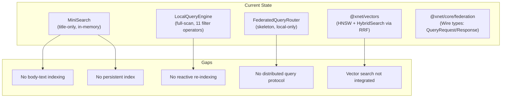
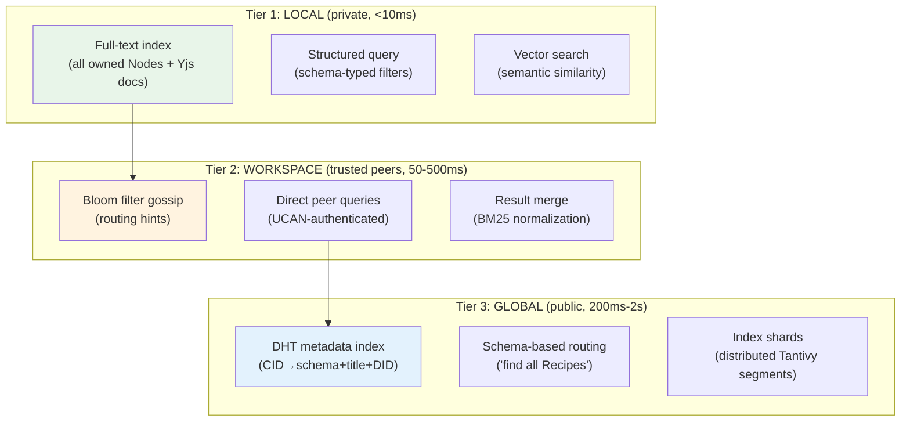
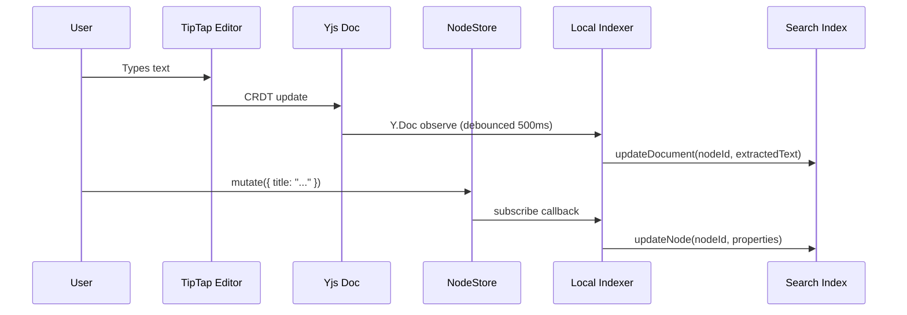
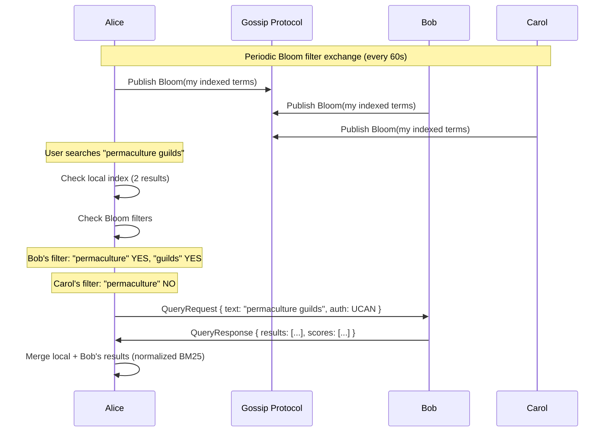
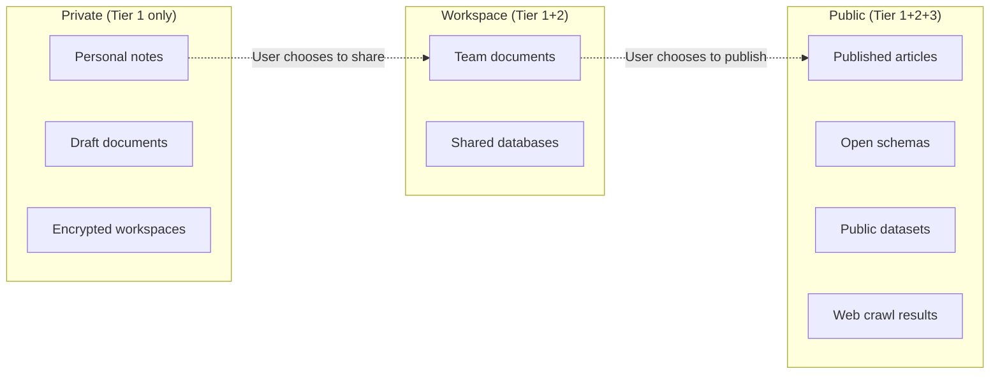
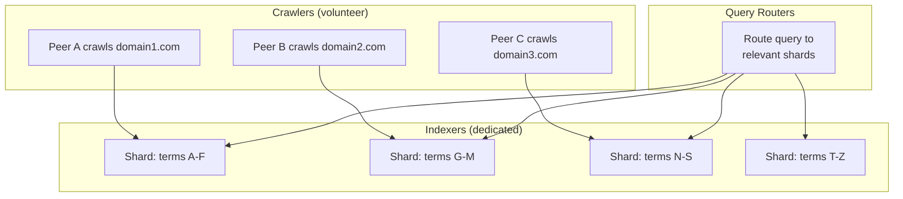
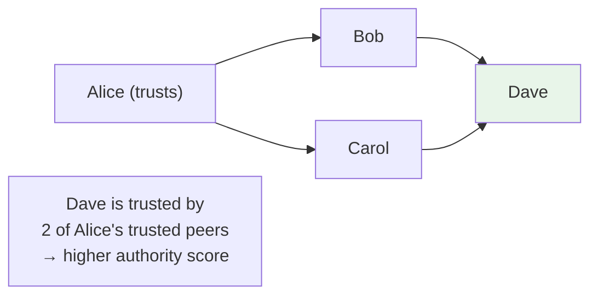
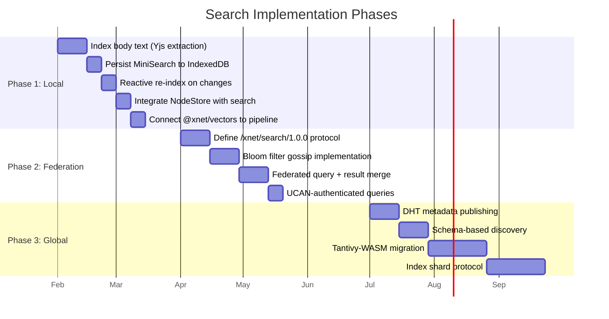

# Decentralized Search: Architecture Exploration

> How xNet nodes could contribute to, maintain, and query a distributed search index — from personal full-text to planetary-scale web search.

**Date**: January 2026

---

## The Problem

Centralized search (Google, Bing) controls what you find, tracks what you seek, and creates a single point of censorship. But every attempt at decentralized search has failed to match centralized quality because:

1. **Index distribution is hard** — splitting a trillion-document index across unreliable peers
2. **Ranking needs global signals** — PageRank requires crawling the entire web graph
3. **Freshness vs. availability** — stale results are worse than no results
4. **Privacy vs. utility** — queries reveal intent; indexes reveal content
5. **Incentive alignment** — who pays to crawl, index, and serve?

xNet's local-first architecture gives us a unique angle: **every user already maintains a local index of their own data**. The question is how to federate these indexes into something greater than the sum of their parts.

---

## Landscape: What's Been Tried

### Fully Decentralized

| Project       | Architecture                                                                                                                        | Outcome                                                                                                   |
| ------------- | ----------------------------------------------------------------------------------------------------------------------------------- | --------------------------------------------------------------------------------------------------------- |
| **YaCy**      | P2P network sharing reverse index via DHT. Each peer crawls independently, indexes locally, shares fragments.                       | Proves P2P search works but quality/freshness lags far behind Google. ~1000 active peers in practice.     |
| **Presearch** | Token-incentivized node operators run search infrastructure. Queries distributed across stakers.                                    | Economic incentive layer works, but still relies on centralized result aggregation.                       |
| **The Graph** | Decentralized indexing protocol for blockchain data. Subgraphs define indexing; Indexers compete to serve queries with GRT staking. | Closest model to "indexing as a protocol." Works because blockchain data is deterministically verifiable. |

### Independent/Hybrid

| Project          | Architecture                                                                                                                        | Key Insight                                                                                                          |
| ---------------- | ----------------------------------------------------------------------------------------------------------------------------------- | -------------------------------------------------------------------------------------------------------------------- |
| **Brave Search** | Own 10B+ page index, built via opt-in Web Discovery Project (users anonymously contribute URLs/page info). 92% self-served results. | Proves competitive index is possible via user contributions without tracking. Goggles feature: user-defined ranking. |
| **SearXNG**      | Meta-search aggregating 245+ sources. Self-hostable, no tracking.                                                                   | Not a search engine — shows the value of federated querying across multiple backends.                                |

### Embedded Search Engines (Local Use)

| Engine              | Characteristics                                                                                     | xNet Fit                                                                                             |
| ------------------- | --------------------------------------------------------------------------------------------------- | ---------------------------------------------------------------------------------------------------- |
| **Tantivy** (Rust)  | Full Lucene-like inverted index. BM25, 2x faster than Lucene. Compiles to WASM. 14.4k GitHub stars. | Best candidate for a WASM-compiled local search engine. Incremental indexing, prefix search, facets. |
| **Sonic** (Rust)    | Identifier index (not document store). ~30MB RAM, microsecond queries. Returns IDs, not documents.  | Perfect conceptual match: index terms → CIDs/NodeIDs. Extremely lightweight.                         |
| **MiniSearch** (JS) | Pure JS, in-memory. Fuzzy/prefix search, field boosting.                                            | Already used by xNet. Good for <10k docs, won't scale to cross-peer federation.                      |

### Academic Approaches

| Approach                        | Key Idea                                                      | Limitation                                     |
| ------------------------------- | ------------------------------------------------------------- | ---------------------------------------------- |
| **DHT-based inverted index**    | Map term → document list, distribute via Kademlia             | Popular terms create hotspot nodes; no ranking |
| **Semantic overlays**           | Cluster peers by topic, route queries to relevant clusters    | Requires topology maintenance                  |
| **Bloom filter summaries**      | Peers exchange compact content fingerprints for query routing | False positives; no ranking signal             |
| **Random walk queries**         | Walk peer graph asking each node; stop when enough results    | Latency unpredictable; depends on topology     |
| **Locality-preserving hashing** | DHTs that preserve content similarity in key assignment       | Enables range/similarity queries in O(log n)   |

---

## xNet's Current Search Infrastructure

Before designing the future, here's what exists today:



**What we have**: MiniSearch for local full-text (title only), LocalQueryEngine for structured filters, a HybridSearch combining vectors + keywords, and wire protocol types for federation.

**What's missing**: Body text indexing, persistent indexes, reactive updates on CRDT changes, a libp2p query protocol, and integration between these components.

---

## Proposed Architecture: Three-Tier Search

The design principle: **search is a spectrum from private to public, instant to eventual, local to global**. Each tier adds latency but expands scope.



---

### Tier 1: Local Index

Every xNet node maintains a complete, private, instant search index of all data it owns or has synced.

#### Design

```typescript
interface LocalSearchIndex {
  // Full-text: inverted index over all text content
  fullText: TantivyWasm | MiniSearch

  // Structured: schema-aware property indexes
  structured: {
    bySchema: Map<SchemaIRI, Set<NodeId>>
    byProperty: Map<string, BTreeIndex> // For range queries
    byTimestamp: BTreeIndex // For recency
  }

  // Semantic: vector embeddings for similarity
  vectors: HNSWIndex // From @xnet/vectors

  // Unified query: combines all three with RRF
  query(q: SearchQuery): RankedResults
}
```

#### Indexing Strategy



**Key decisions:**

| Decision        | Choice                                    | Rationale                                                                          |
| --------------- | ----------------------------------------- | ---------------------------------------------------------------------------------- |
| Index engine    | MiniSearch now → Tantivy-WASM future      | MiniSearch fine for <10k docs. Tantivy handles millions with incremental indexing. |
| Persistence     | IndexedDB (serialized index segments)     | Avoid full re-index on app restart. Tantivy segments serialize naturally.          |
| Update trigger  | Yjs `observeDeep` + NodeStore `subscribe` | Reactive: index updates within 500ms of any edit                                   |
| Body extraction | Walk Yjs `blockMap`, extract text nodes   | Currently only `title` is indexed — this is the #1 gap                             |
| Embeddings      | On-device model (MobileBERT/all-MiniLM)   | Privacy: content never leaves device. Fallback: no vectors if too slow.            |

#### What Gets Indexed

| Source               | Fields                                        | Indexed How            |
| -------------------- | --------------------------------------------- | ---------------------- |
| NodeState.properties | title, description, text fields               | Full-text + structured |
| Yjs doc body         | All text blocks (paragraphs, headings, lists) | Full-text              |
| Schema metadata      | schemaId, property types                      | Structured (facets)    |
| Timestamps           | createdAt, updatedAt                          | Structured (range)     |
| Author               | createdBy, updatedBy (DIDs)                   | Structured (filter)    |
| Embeddings           | Chunked text → 384-dim vectors                | HNSW similarity        |

---

### Tier 2: Workspace-Scoped Federation

When local results aren't enough, query peers who share your workspace. This tier is **trusted** — only peers with valid UCAN capabilities can participate.

#### Query Routing with Bloom Filters

Instead of querying every peer (expensive), peers exchange compact Bloom filter summaries of their indexed terms. A query first checks filters to identify which peers likely have relevant content.



#### Bloom Filter Design

```typescript
interface WorkspaceBloomFilter {
  workspace: WorkspaceId
  peerId: PeerId
  filter: Uint8Array // Bloom filter bits
  numTerms: number // For false-positive rate estimation
  updatedAt: number // Lamport timestamp
  hash: ContentId // For deduplication
}

// Configuration
const BLOOM_CONFIG = {
  bitsPerElement: 10, // ~1% false positive rate
  hashFunctions: 7, // Optimal for 10 bits/element
  maxTerms: 100_000, // Per-workspace cap
  gossipInterval: 60_000, // Exchange every 60s
  ttl: 300_000 // Expire after 5min without refresh
}
```

**Why Bloom filters?**

| Property            | Value                                                    |
| ------------------- | -------------------------------------------------------- |
| Size                | ~122KB for 100k terms (10 bits each)                     |
| False positive rate | ~1% (means ~1 unnecessary query per 100)                 |
| False negative rate | 0% (never miss a peer that has the term)                 |
| Privacy             | Peers learn "someone has term X" but not which documents |
| Bandwidth           | Gossip 122KB/peer every 60s = negligible                 |

#### Federated Query Protocol

```typescript
// New libp2p protocol: /xnet/search/1.0.0
interface SearchProtocol {
  // Query a peer's index
  query(request: SearchQueryRequest): Promise<SearchQueryResponse>

  // Exchange Bloom filter summaries
  exchangeBloom(filter: WorkspaceBloomFilter): void

  // Request index stats (for cost estimation)
  stats(): Promise<IndexStats>
}

interface SearchQueryRequest {
  queryId: string
  workspace: WorkspaceId
  text?: string // Full-text query
  filters?: Filter[] // Structured filters
  schema?: SchemaIRI // Type filter
  vector?: Float32Array // Semantic query (optional)
  limit: number
  auth: string // UCAN token
}

interface SearchQueryResponse {
  queryId: string
  results: ScoredResult[]
  totalEstimate: number
  executionMs: number
  peerId: PeerId
}

interface ScoredResult {
  nodeId: NodeId
  cid: ContentId // Content-addressed dedup
  score: number // Normalized BM25 or cosine
  snippet?: string // Highlighted match context
  schema: SchemaIRI
  title: string
  updatedAt: number
}
```

#### Result Merging

```typescript
function mergeResults(local: ScoredResult[], remote: Map<PeerId, ScoredResult[]>): ScoredResult[] {
  // 1. Collect all results
  const all = [...local]
  for (const [peerId, results] of remote) {
    all.push(...results)
  }

  // 2. Deduplicate by CID (same content = same hash)
  const seen = new Set<string>()
  const deduped = all.filter((r) => {
    if (seen.has(r.cid)) return false
    seen.add(r.cid)
    return true
  })

  // 3. Reciprocal Rank Fusion across sources
  // Each source provides its own ranking; RRF combines them
  // RRF(d) = Σ 1/(k + rank_i(d)) for each source i
  return reciprocalRankFusion(deduped, { k: 60 })
}
```

---

### Tier 3: Global Discovery

For public data: schemas, published documents, shared knowledge bases. This tier uses the DHT for content routing and optional dedicated index nodes.

#### What's Publishable

Not everything should be globally discoverable. The user controls what enters Tier 3:



#### DHT Metadata Index

For public Nodes, peers publish lightweight metadata records to the Kademlia DHT:

```typescript
interface PublicIndexRecord {
  cid: ContentId // Content hash (primary key)
  schema: SchemaIRI // "xnet://xnet.dev/Page"
  title: string // Human-readable title
  author: DID // Publisher's DID
  published: number // Wall clock time
  tags: string[] // User-defined tags
  language: string // ISO 639-1
  snippet: string // First 200 chars
  size: number // Content size in bytes
  signature: Uint8Array // Ed25519 proof of authorship
}

// Published to DHT under multiple keys:
// - CID (exact lookup)
// - Schema IRI hash (find all Recipes, all Tasks, etc.)
// - Each tag hash (topic-based discovery)
```

#### Schema-Based Routing

One of xNet's unique advantages: every Node has a schema. This enables typed discovery:

```
"Find all nodes matching xnet://farming/Species where genus = 'Malus'"
```

This query can be routed efficiently because:

1. DHT key = hash(schemaIRI) → find all peers with Species nodes
2. Structured filter applied at each peer locally
3. Results merged with CID-based deduplication

#### Index Shards (Future: Dedicated Indexers)

For web-scale search, volunteer or incentivized nodes can run dedicated index shards:



**This is the long-term vision (Phase 4 in VISION.md)**. It requires:

- Incentive mechanisms (token staking, reputation, or altruistic volunteers)
- Verifiable indexing (proofs that an indexer correctly indexed a document)
- Shard assignment protocol (who indexes what)
- Ranking consensus (distributed PageRank or alternative)

---

## Encrypted Search

A critical challenge: how do you search data you can't read?

### Workspace-Scoped Encrypted Search

For shared workspaces where all members hold a symmetric key:

```typescript
// Workspace key used to derive searchable term hashes
function encryptedTermHash(term: string, workspaceKey: Uint8Array): string {
  // HMAC the term with workspace key
  // Only workspace members can construct valid query hashes
  return hmacBlake3(workspaceKey, normalize(term))
}

// Publishing: peer hashes each indexed term with workspace key
// Querying: query terms are hashed with same key before lookup
// Security: non-members see random hashes, can't infer terms
```

**Tradeoffs:**

| Property        | Encrypted Search                   | Plaintext Search             |
| --------------- | ---------------------------------- | ---------------------------- |
| Privacy         | Terms invisible to non-members     | Terms visible to all peers   |
| Query types     | Exact match only (no fuzzy/prefix) | Full fuzzy, prefix, stemming |
| Index size      | Same                               | Same                         |
| Key rotation    | Requires full re-index             | N/A                          |
| Forward secrecy | No (compromise reveals past terms) | N/A                          |

### Private Information Retrieval (PIR)

For Tier 3 queries where you don't want the indexer to know what you searched:

- **Computational PIR**: Query is encrypted; indexer computes over encrypted query. Impractical at scale (1000x overhead).
- **Multi-server PIR**: Split trust across multiple indexers. Practical if ≥2 non-colluding servers exist.
- **xNet approach**: For now, query locally (Tier 1) for privacy-sensitive searches. Tier 2/3 queries accept that peers see query terms.

---

## Ranking Without Centralization

The hardest unsolved problem. PageRank needs a global web graph. Alternatives:

### Option A: Local BM25 + Recency

Simple, works today. Each peer scores results with BM25 (term frequency / inverse document frequency). Federated results merged via Reciprocal Rank Fusion.

**Pros**: No global coordination. Works offline.
**Cons**: No authority signal. Spam is indistinguishable from quality.

### Option B: Social Trust Graph

Use the UCAN delegation graph as an implicit trust signal:



Results from peers closer in trust graph get a ranking boost. This is personalized PageRank over the social graph.

**Pros**: Spam-resistant (need real trust relationships). Personalized.
**Cons**: Filter bubbles. Cold-start for new users.

### Option C: Stake-Based Authority (Future)

Peers stake reputation or tokens on the quality of their index contributions. Bad results → slashing.

**Pros**: Economic incentive alignment.
**Cons**: Requires token economics. Plutocratic (richer = more authority).

### Option D: Verifiable Crawl Proofs

Crawlers provide cryptographic proof that they faithfully indexed a page (timestamped snapshot + hash). Quality = how many independent crawlers agree on the same content.

**Pros**: Objective quality signal.
**Cons**: Expensive. Doesn't help with ranking relevance, only with index integrity.

### Recommended: Hybrid A + B

Start with BM25 locally (Option A). Layer social trust (Option B) for federated queries. This gives us:

- Instant local results ranked by relevance
- Federated results boosted by trust proximity
- No token economics needed
- Graceful degradation (works with 0 peers, improves with more)

---

## Spam and Sybil Resistance

In a decentralized system, anyone can claim to have relevant results. Defenses:

| Defense                  | Mechanism                                                         | xNet Fit                                                       |
| ------------------------ | ----------------------------------------------------------------- | -------------------------------------------------------------- |
| **UCAN-gated queries**   | Only peers with valid capability tokens can query/respond         | Tier 2 (workspace). Natural fit with existing identity system. |
| **DID reputation**       | Track per-DID quality scores (% of results clicked, time-on-page) | Tier 2+3. Needs privacy-preserving aggregation.                |
| **Proof of storage**     | Peer must prove it actually stores the document it claims to have | Tier 3. Prevents phantom results. CID verification is free.    |
| **Rate limiting**        | Peers limit queries per DID per time window                       | All tiers. Simple, effective for DoS.                          |
| **Community moderation** | Trusted peers can flag/demote bad actors                          | Tier 3. Requires governance structure.                         |

---

## Implementation Roadmap

### Phase 1: Fix Local Search (Immediate)

What can be done today with the existing codebase:



### Phase 1 Details

1. **Index body text**: Walk `Y.Doc.getMap('blockMap')`, extract text from each block, concatenate for full-text indexing.
2. **Persist index**: Serialize MiniSearch state to IndexedDB. Load on startup instead of full re-index.
3. **Reactive updates**: Hook into `NodeStore.subscribe()` and `Y.Doc.observeDeep()` with 500ms debounce.
4. **NodeStore integration**: Index `NodeState.properties` alongside XDocument metadata. Schema-aware field boosting.
5. **Vector pipeline**: Wire `@xnet/vectors` HybridSearch into the SDK's `client.search()`.

### Phase 2 Details

6. **Protocol definition**: Register `/xnet/search/1.0.0` on libp2p. msgpack encoding. Request/response pattern.
7. **Bloom gossip**: Each peer maintains per-workspace Bloom filter. Exchange via gossipsub topic.
8. **Query federation**: FederatedQueryRouter checks Bloom filters → queries relevant peers → merges with RRF.
9. **Auth**: Every SearchQueryRequest includes UCAN token. Peers verify capability before responding.

### Phase 3 Details

10. **DHT metadata**: Publish PublicIndexRecord for user-designated public Nodes.
11. **Schema routing**: Query DHT by schema IRI hash. "Find all public Recipes" = `findProviders(hash(schemaIRI))`.
12. **Tantivy-WASM**: Replace MiniSearch for users with large datasets (>10k nodes). Incremental segment indexing.
13. **Index shards**: Term-partitioned shards assigned by consistent hashing. Volunteer-run initially.

---

## Privacy Model

```
┌─────────────────────────────────────────────────────────────┐
│                    PRIVACY SPECTRUM                            │
│                                                               │
│  ◄── MORE PRIVATE                     MORE DISCOVERABLE ──►  │
│                                                               │
│  Tier 1 Local    Tier 2 Workspace      Tier 3 Global         │
│  ─────────────   ────────────────      ──────────────         │
│  • Query stays   • Query visible to    • Query visible to     │
│    on device       workspace peers       any index node        │
│  • Index never   • Bloom filters leak  • Metadata is public   │
│    shared          term existence       • Content is public    │
│  • Zero exposure • UCAN limits scope   • DID linked to query  │
│                                                               │
│  Best for:       Best for:             Best for:              │
│  Personal notes  Team docs, shared     Published content,     │
│  Sensitive data  databases             open datasets          │
│                                                               │
└─────────────────────────────────────────────────────────────┘
```

**User controls** which tier each piece of data participates in. Nothing enters Tier 2 or 3 without explicit action.

---

## Comparison with Existing Approaches

|                     | Google                 | YaCy                         | Brave                     | xNet                                                         |
| ------------------- | ---------------------- | ---------------------------- | ------------------------- | ------------------------------------------------------------ |
| **Index source**    | Centralized crawl      | Distributed crawl            | Opt-in user contributions | User-owned local data + optional crawl                       |
| **Ranking**         | PageRank (opaque)      | BM25 (no authority)          | Own algorithm + Goggles   | BM25 + social trust graph                                    |
| **Privacy**         | None (full tracking)   | Moderate (peers see queries) | Good (no tracking)        | Tier 1: total. Tier 2: workspace-scoped. Tier 3: DID-linked. |
| **Offline**         | No                     | No                           | No                        | Yes (Tier 1 is fully offline)                                |
| **Latency**         | ~200ms                 | 1-5s                         | ~200ms                    | Tier 1: <10ms. Tier 2: 50-500ms. Tier 3: 200ms-2s.           |
| **Freshness**       | Minutes                | Hours-days                   | Hours                     | Real-time (CRDT observers trigger re-index)                  |
| **Spam resistance** | Centralized moderation | Weak                         | Centralized               | UCAN trust chains + DID reputation                           |
| **Completeness**    | ~Global                | Whatever peers online        | ~Global                   | Workspace-complete (CRDT ensures all data reachable)         |
| **Censorship**      | Single point           | Resistant                    | Single company            | Fully resistant (no single operator)                         |

---

## User-Defined Ranking (Goggles)

Inspired by Brave's Goggles, users can define custom ranking rules:

```typescript
interface SearchGoggle {
  name: string
  description: string
  rules: GogglerRule[]
}

interface GogglerRule {
  match: {
    schema?: SchemaIRI // Boost/demote by type
    author?: DID // Boost/demote by author
    workspace?: WorkspaceId // Boost/demote by source
    tag?: string // Boost/demote by tag
    domain?: string // For web crawl results
    age?: { max: number } // Freshness filter
  }
  action: 'boost' | 'demote' | 'exclude'
  weight: number // 0-10 multiplier
}

// Example: "Technical blogs, recent, no social media"
const techGoggle: SearchGoggle = {
  name: 'Tech Deep Dives',
  rules: [
    { match: { tag: 'technical' }, action: 'boost', weight: 3 },
    { match: { age: { max: 90 * 86400000 } }, action: 'boost', weight: 2 },
    { match: { domain: 'twitter.com' }, action: 'exclude', weight: 0 },
    { match: { domain: 'reddit.com' }, action: 'demote', weight: 0.5 }
  ]
}
```

Goggles are themselves xNet Nodes — shareable, forkable, and community-curated.

---

## React Integration

```typescript
// Unified search hook spanning all three tiers
function useSearch(query: string, options?: SearchOptions) {
  // Returns results progressively:
  // 1. Local results appear instantly (<10ms)
  // 2. Workspace results stream in (50-500ms)
  // 3. Global results arrive last (200ms-2s)
  return {
    results: ScoredResult[],
    isSearching: boolean,
    tiers: {
      local: { results, latencyMs, complete: boolean },
      workspace: { results, latencyMs, complete: boolean, peersQueried: number },
      global: { results, latencyMs, complete: boolean },
    }
  }
}

// Schema-typed discovery
function useDiscover<S extends Schema>(
  schema: S,
  options?: { scope: 'local' | 'workspace' | 'global' }
) {
  // Find all Nodes of a given schema across tiers
  return { nodes: FlatNode<S>[], isLoading: boolean }
}

// Usage in app
function SearchPage() {
  const { results, tiers } = useSearch(query)

  return (
    <div>
      {/* Results appear progressively */}
      {results.map(r => <SearchResult key={r.cid} result={r} />)}

      {/* Show which tiers are still loading */}
      {!tiers.workspace.complete && <Spinner label="Searching workspace..." />}
      {!tiers.global.complete && <Spinner label="Searching network..." />}
    </div>
  )
}
```

---

## Technology Recommendations

| Component        | Now                          | Future                     | Rationale                                                              |
| ---------------- | ---------------------------- | -------------------------- | ---------------------------------------------------------------------- |
| Local full-text  | MiniSearch                   | Tantivy-WASM               | MiniSearch for <10k docs. Tantivy for millions + incremental indexing. |
| Persistence      | IndexedDB (serialized)       | OPFS (Tantivy segments)    | OPFS gives file-system semantics needed by Tantivy.                    |
| Index transport  | Bloom filters over gossipsub | + Merkle DAG index sync    | Bloom for routing. Merkle for verifiable index state.                  |
| Global discovery | Kademlia DHT (libp2p)        | + dedicated index nodes    | DHT for metadata. Index nodes for full-text web search.                |
| Spam resistance  | UCAN + rate limiting         | + DID reputation scores    | Trust from capability chains. Reputation from usage patterns.          |
| Ranking          | BM25 + RRF                   | + social trust + Goggles   | Local relevance + social authority + user control.                     |
| Encrypted search | HMAC-keyed term hashing      | + multi-party PIR          | HMAC for workspace search. PIR for anonymous global queries (future).  |
| Vector search    | @xnet/vectors (HNSW)         | + federated vector queries | Local HNSW now. Cross-peer approximate NN later.                       |

---

## Open Questions

1. **Incentives for global indexers**: Volunteer-only, or do we need token economics? Can reputation alone motivate crawling/indexing?

2. **Index consistency**: If two indexers independently index the same document, how do we verify they agree? Deterministic indexing (same input → same index output)?

3. **Bandwidth budget**: Bloom filter gossip is cheap (~122KB/min/peer). But at what peer count does it become problematic? Hierarchical gossip with supernodes?

4. **Vector search federation**: Approximate nearest neighbor search across distributed indexes is an open research problem. Do we need a centralized vector index for semantic queries, or can we do ANN over DHT?

5. **Legal considerations**: If xNet enables global web search, who's liable for indexing copyrighted content? Does user-initiated crawling differ legally from corporate crawling?

6. **Cold start**: New users have no trust graph, no local index, no peers. How to provide useful results immediately? Bootstrap with public index nodes?

---

## Conclusion

xNet's decentralized search is not a single system — it's a **spectrum** from private local search to public global discovery, with the user controlling the dial. The architecture builds naturally on existing primitives:

- **Nodes + Schemas** give us typed, structured, addressable data
- **CIDs** give us content-addressed deduplication across peers
- **UCAN** gives us authenticated, delegatable query permissions
- **libp2p** gives us protocol-level query routing
- **Yjs/CRDT** observers give us real-time index freshness
- **Lamport clocks** give us consistent ordering of index updates

The path is incremental: fix local search first (body text, persistence, reactivity), then add workspace federation (Bloom filters, peer queries), then global discovery (DHT metadata, index shards). Each phase is independently useful — you don't need global search to benefit from better local search.

The end state: a search engine as good as Google's but owned by nobody, censored by nobody, and tracking nobody.
