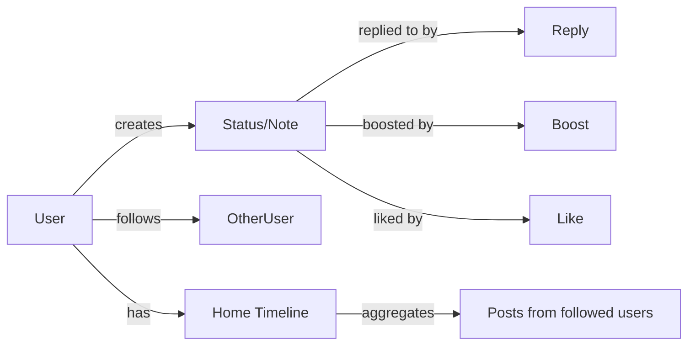
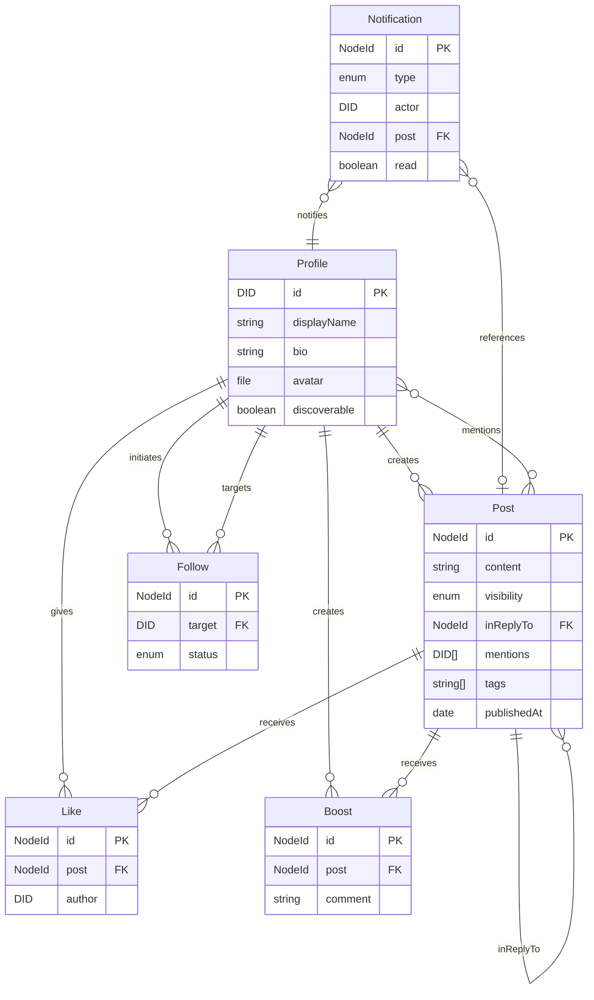
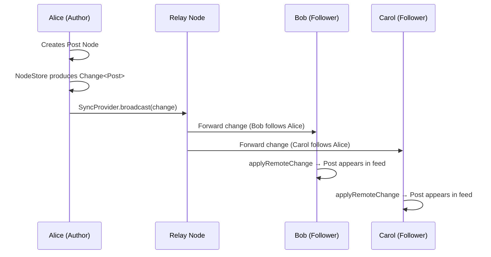
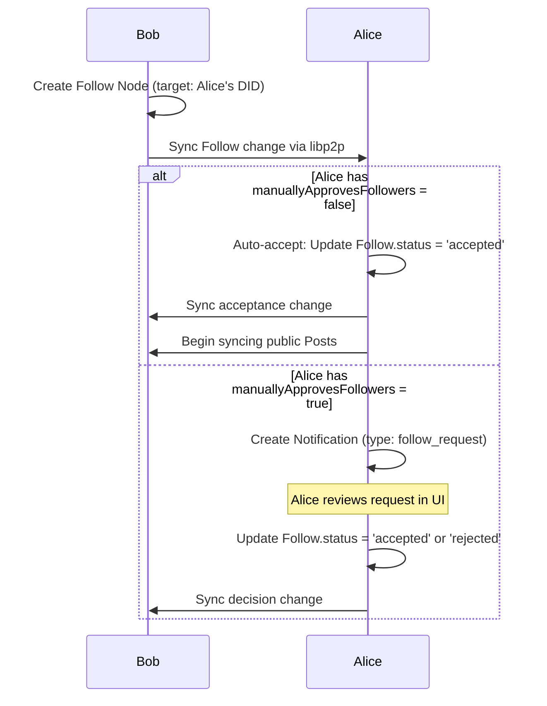
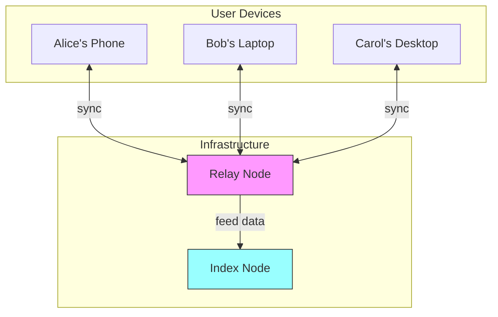
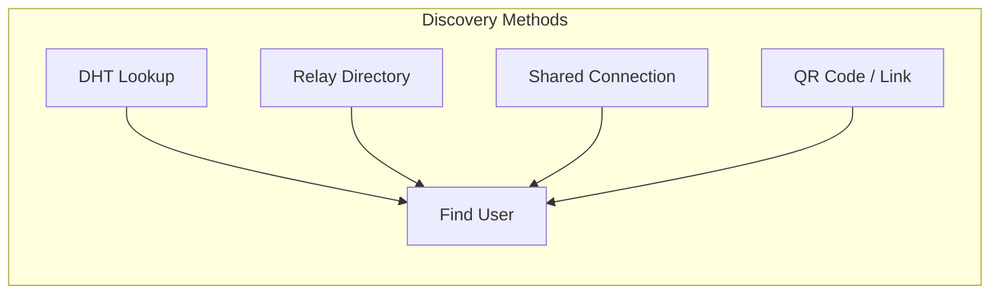
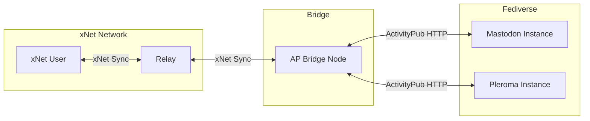
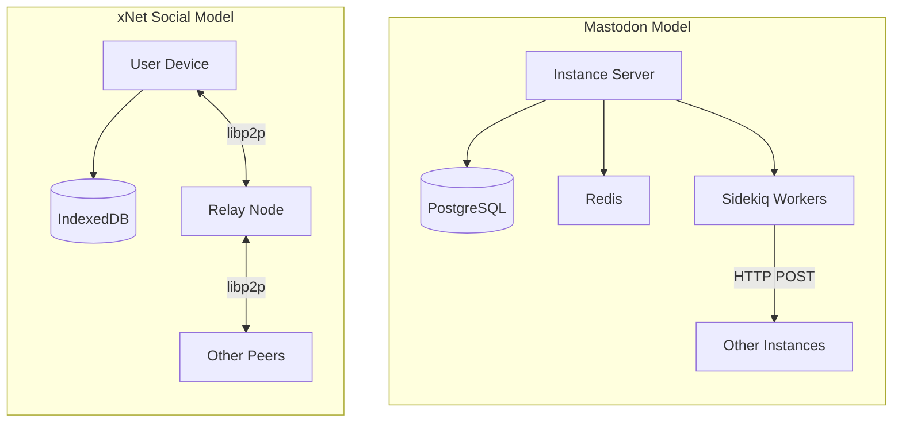

# Mastodon-Style Social Networking for xNet

## Executive Summary

This exploration examines how to integrate Mastodon-style microblogging and social networking into xNet, leveraging the existing decentralized infrastructure (DID identity, P2P sync, schema-first data model) while maintaining the local-first, user-owned-data philosophy. The goal is a federated social experience where posts, follows, and timelines are user-owned Nodes synced peer-to-peer, with optional ActivityPub bridging for interop with the wider Fediverse.

---

## 1. What Mastodon Gets Right (And What We Borrow)

Mastodon's core model is simple and proven:



### Key Concepts We Adopt

| Mastodon Concept | xNet Equivalent          | Notes                                  |
| ---------------- | ------------------------ | -------------------------------------- |
| Account/Actor    | DID + Profile Node       | Self-sovereign identity                |
| Status/Toot      | Post Node                | Schema-defined, CRDT-synced            |
| Follow           | Follow Node              | Directed relationship between DIDs     |
| Boost/Reblog     | Boost Node               | References original Post               |
| Favourite/Like   | Like Node                | References a Post                      |
| Reply            | Post with `inReplyTo`    | Thread via relation property           |
| Timeline         | Computed feed            | Local query over synced Posts          |
| Instance         | Peer/Relay               | No central server, but optional relays |
| Hashtag          | Tag property             | Indexed for discovery                  |
| Mention          | Person reference in Post | DID-based, not @user@server            |

### What We Intentionally Diverge From

1. **No server-centric model**: Users don't "join an instance." Their data lives on their devices and syncs P2P.
2. **No HTTP inbox/outbox**: We use libp2p streams and sync protocols instead of HTTP POST to inboxes.
3. **No server-side rendering**: Feed assembly happens client-side from locally-replicated data.
4. **DID-native addressing**: Users are `did:key:z6Mk...` not `@user@server.tld`.
5. **Optional ActivityPub bridge**: A relay node can translate between xNet sync and ActivityPub for Fediverse interop.

---

## 2. Data Model: Social Schemas

Using xNet's `defineSchema()` system, we define the core social primitives:

### 2.1 Profile Schema

```typescript
const Profile = defineSchema({
  name: 'Profile',
  namespace: 'xnet://xnet.dev/',
  properties: {
    displayName: text({ required: true, maxLength: 50 }),
    bio: text({ maxLength: 500 }),
    avatar: file({ accept: ['image/*'] }),
    header: file({ accept: ['image/*'] }),
    discoverable: checkbox({ default: true }),
    manuallyApprovesFollowers: checkbox({ default: false }),
    fields: text({ multiple: true }) // Key-value pairs serialized
  }
})
// IRI: xnet://xnet.dev/Profile
```

The Profile is a singleton Node per DID -- one per identity. The DID itself serves as the globally unique actor identifier.

### 2.2 Post Schema

```typescript
const Post = defineSchema({
  name: 'Post',
  namespace: 'xnet://xnet.dev/',
  properties: {
    content: text({ required: true, maxLength: 500 }),
    contentWarning: text({ maxLength: 200 }),
    visibility: select({
      options: ['public', 'followers', 'mentioned', 'direct'],
      default: 'public'
    }),
    inReplyTo: relation({ target: 'xnet://xnet.dev/Post' }),
    mentions: person({ multiple: true }),
    tags: multiSelect({ options: [] }), // Dynamic hashtags
    attachments: file({ multiple: true, accept: ['image/*', 'video/*', 'audio/*'] }),
    sensitive: checkbox({ default: false }),
    language: text({ maxLength: 10 }),
    publishedAt: date()
  }
})
// IRI: xnet://xnet.dev/Post
```

### 2.3 Follow Schema

```typescript
const Follow = defineSchema({
  name: 'Follow',
  namespace: 'xnet://xnet.dev/',
  properties: {
    target: person({ required: true }), // DID of who we're following
    status: select({
      options: ['pending', 'accepted', 'rejected'],
      default: 'pending'
    }),
    notify: checkbox({ default: true }) // Get notifications for this person
  }
})
// IRI: xnet://xnet.dev/Follow
```

### 2.4 Like Schema

```typescript
const Like = defineSchema({
  name: 'Like',
  namespace: 'xnet://xnet.dev/',
  properties: {
    post: relation({ target: 'xnet://xnet.dev/Post', required: true }),
    author: person({ required: true }) // DID of post author (for routing)
  }
})
// IRI: xnet://xnet.dev/Like
```

### 2.5 Boost Schema

```typescript
const Boost = defineSchema({
  name: 'Boost',
  namespace: 'xnet://xnet.dev/',
  properties: {
    post: relation({ target: 'xnet://xnet.dev/Post', required: true }),
    author: person({ required: true }), // DID of original author
    comment: text({ maxLength: 500 }) // Optional quote-boost
  }
})
// IRI: xnet://xnet.dev/Boost
```

### 2.6 Notification Schema

```typescript
const Notification = defineSchema({
  name: 'Notification',
  namespace: 'xnet://xnet.dev/',
  properties: {
    type: select({
      options: ['follow', 'like', 'boost', 'mention', 'reply', 'follow_request'],
      required: true
    }),
    actor: person({ required: true }), // Who triggered this
    post: relation({ target: 'xnet://xnet.dev/Post' }), // Related post if any
    read: checkbox({ default: false })
  }
})
// IRI: xnet://xnet.dev/Notification
```

### Data Model Diagram



---

## 3. Federation Architecture

### 3.1 How Posts Propagate (P2P Model)

Unlike Mastodon's HTTP inbox delivery, xNet propagates social data through the existing sync layer:



### 3.2 Follow Mechanics



### 3.3 The Relay Node

Since xNet is local-first, peers may not be online simultaneously. A **relay node** solves this:



The relay is a headless xNet node that:

1. Maintains persistent connections
2. Stores-and-forwards Changes when peers are offline
3. Respects visibility rules (only forwards public/followers posts to authorized peers)
4. Does NOT own or control the data -- just caches and relays

This maps to Mastodon's "instance" role but without any authority over user identity or data.

### 3.4 Visibility & Access Control

Post visibility maps to sync permissions:

| Visibility  | Who receives the Change         | Implementation                                    |
| ----------- | ------------------------------- | ------------------------------------------------- |
| `public`    | All connected peers + relay     | Broadcast to all, no UCAN required                |
| `followers` | Only peers with accepted Follow | UCAN check: must have Follow with status=accepted |
| `mentioned` | Only mentioned DIDs             | Direct peer sync, UCAN scoped to mentioned        |
| `direct`    | Only specific recipients        | Encrypted with recipient's X25519 key             |

For `direct` messages, we leverage `@xnet/crypto`'s XChaCha20-Poly1305 encryption:

```typescript
// Encrypt post content for specific recipient
const encrypted = encrypt(
  postContent,
  recipientPublicKey, // X25519 from their KeyBundle
  senderPrivateKey
)
// Store as encrypted Uint8Array in Post.content
// Only recipient can decrypt
```

---

## 4. Timeline/Feed Assembly

### 4.1 Local Feed Construction

The home timeline is assembled locally from replicated data:

```typescript
// Pseudocode for feed assembly
async function getHomeTimeline(store: NodeStore, myDID: DID) {
  // 1. Get all accepted follows
  const follows = await store.query({
    schemaId: 'xnet://xnet.dev/Follow',
    filter: { createdBy: myDID, status: 'accepted' }
  })
  const followedDIDs = follows.map((f) => f.properties.target)

  // 2. Query posts from followed users + own posts
  const posts = await store.query({
    schemaId: 'xnet://xnet.dev/Post',
    filter: {
      createdBy: { $in: [...followedDIDs, myDID] },
      visibility: { $in: ['public', 'followers'] },
      inReplyTo: null // Top-level only (not replies)
    },
    sort: { publishedAt: 'desc' },
    limit: 50
  })

  // 3. Interleave boosts from followed users
  const boosts = await store.query({
    schemaId: 'xnet://xnet.dev/Boost',
    filter: { createdBy: { $in: followedDIDs } },
    sort: { createdAt: 'desc' },
    limit: 20
  })

  // 4. Merge and sort chronologically
  return mergeAndSort(posts, boosts)
}
```

### 4.2 Feed Types

| Feed          | Source                    | Description                      |
| ------------- | ------------------------- | -------------------------------- |
| Home          | Followed users' posts     | Chronological, no algorithm      |
| Local         | Same relay's public posts | Discover nearby users            |
| Public        | All synced public posts   | Firehose of everything received  |
| Profile       | Single user's posts       | Their post history               |
| Thread        | Post + all replies        | Conversation view                |
| Notifications | Actions targeting you     | Follows, likes, boosts, mentions |
| Hashtag       | Posts with specific tag   | Topic-based discovery            |

### 4.3 Indexing for Performance

We extend `@xnet/query`'s MiniSearch index for social queries:

```typescript
// Add social-specific indexes
const socialIndex = new MiniSearch({
  fields: ['content', 'tags'],
  storeFields: ['createdBy', 'publishedAt', 'visibility'],
  searchOptions: {
    fuzzy: 0.2,
    prefix: true,
    boost: { tags: 3 }
  }
})

// Index by author for fast profile feeds
const authorIndex = new Map<DID, NodeId[]>()

// Index by tag for hashtag feeds
const tagIndex = new Map<string, NodeId[]>()
```

---

## 5. Discovery & Search

### 5.1 User Discovery

Without a central server, user discovery uses multiple mechanisms:



1. **DID Resolution via DHT**: Look up a DID to find their current network addresses (already in `packages/network/src/resolution/did.ts`)
2. **Relay Directory**: Relays maintain a list of `discoverable: true` profiles
3. **Mutual Connections**: "People you might know" from followers-of-followers
4. **Direct Share**: QR codes or `xnet://did:key:z6Mk.../Profile` links

### 5.2 Hashtag Discovery

Hashtags are indexed locally and optionally shared with relay nodes:

```typescript
// When a Post is created with tags
post.tags.forEach((tag) => {
  tagIndex.add(tag, post.id)
  // Optionally publish tag association to relay for global trending
  relay.publishTagEntry({ tag, postId: post.id, author: myDID })
})
```

### 5.3 Trending & Recommendations

Without a central algorithm, trending is computed by relay nodes:

- **Trending Tags**: Relay counts unique tag usage over time windows (1h, 24h, 7d)
- **Popular Posts**: Relay counts likes + boosts per post
- **Suggested Follows**: Based on graph analysis of who follows whom

These are advisory only -- the client can ignore relay suggestions and show pure chronological feeds.

---

## 6. ActivityPub Bridge (Optional Fediverse Interop)

For users who want to interact with the broader Fediverse (Mastodon, Pleroma, Pixelfed, etc.), an optional bridge node translates between protocols:



### 6.1 DID to ActivityPub Actor Mapping

```
xNet DID:     did:key:z6MkhaXgBZDvotDkL5257faiztiGiC2QtKLGpbnnEGta2doK
AP Actor:     https://bridge.xnet.dev/users/z6MkhaXgBZDvotDkL5257faiztiGiC2QtKLGpbnnEGta2doK
WebFinger:    @z6MkhaX...2doK@bridge.xnet.dev
```

### 6.2 Translation Rules

| xNet                     | Direction | ActivityPub                        |
| ------------------------ | --------- | ---------------------------------- |
| Post Node (create)       | ->        | Create(Note) to followers' inboxes |
| Post Node (delete)       | ->        | Delete(Note)                       |
| Follow Node (create)     | ->        | Follow activity                    |
| Follow.status = accepted | ->        | Accept(Follow)                     |
| Like Node                | ->        | Like activity                      |
| Boost Node               | ->        | Announce activity                  |
| Incoming Create(Note)    | <-        | Create Post Node in bridge's store |
| Incoming Follow          | <-        | Create Follow Node                 |
| Incoming Like            | <-        | Create Like Node                   |

### 6.3 Bridge Implementation Sketch

```typescript
class ActivityPubBridge {
  private store: NodeStore
  private syncProvider: SyncProvider
  private httpServer: HTTPServer // For AP inbox

  // xNet -> ActivityPub
  async onLocalChange(change: Change<NodePayload>) {
    const node = change.payload
    if (node.schemaId === 'xnet://xnet.dev/Post') {
      const activity = this.postToActivity(node)
      await this.deliverToFollowers(activity, change.authorDID)
    }
  }

  // ActivityPub -> xNet
  async onInboxReceive(activity: APActivity) {
    switch (activity.type) {
      case 'Create':
        const post = this.activityToPost(activity)
        await this.store.create(post)
        break
      case 'Follow':
        const follow = this.activityToFollow(activity)
        await this.store.create(follow)
        break
      // ...
    }
  }

  private postToActivity(node: Node): APActivity {
    return {
      '@context': 'https://www.w3.org/ns/activitystreams',
      type: 'Create',
      actor: this.didToActorURI(node.createdBy),
      object: {
        type: 'Note',
        content: node.properties.content,
        published: new Date(node.properties.publishedAt).toISOString(),
        to: this.resolveAudience(node.properties.visibility),
        tag: this.buildTags(node.properties.mentions, node.properties.tags),
        inReplyTo: node.properties.inReplyTo ? this.nodeIdToURI(node.properties.inReplyTo) : null
      }
    }
  }
}
```

---

## 7. Implementation Plan

### Phase 1: Core Schemas & Local Social (2-3 weeks)

1. Define and register social schemas (Post, Profile, Follow, Like, Boost, Notification)
2. Implement feed assembly queries in `@xnet/query`
3. Build basic React hooks: `useTimeline()`, `useProfile()`, `useThread()`
4. Create compose UI component for posting
5. Profile view with post history

### Phase 2: P2P Social Sync (2-3 weeks)

1. Extend SyncProvider to handle social-specific routing (visibility-aware delivery)
2. Implement follow/unfollow mechanics with UCAN-gated sync
3. Like and Boost propagation
4. Notification generation on incoming social events
5. Direct messaging with end-to-end encryption

### Phase 3: Relay & Discovery (2-3 weeks)

1. Build relay node for store-and-forward
2. Implement user directory and search on relay
3. Hashtag indexing and trending computation
4. "Local" timeline (posts from same relay)
5. Profile discovery via DID resolution

### Phase 4: ActivityPub Bridge (3-4 weeks)

1. HTTP server for ActivityPub inbox/outbox
2. WebFinger endpoint for user discovery
3. DID <-> Actor URI mapping
4. Bidirectional translation (xNet Changes <-> AP Activities)
5. HTTP Signatures for S2S authentication
6. Follower synchronization

### Phase 5: Polish & Moderation (2-3 weeks)

1. Content warnings and sensitive media handling
2. Block/mute at social layer (leveraging PeerAccessControl)
3. Report mechanism
4. Media attachments with blurhash previews
5. Thread view and conversation UI

---

## 8. Key Technical Decisions

### 8.1 Why Not Just Implement ActivityPub Directly?

| ActivityPub Assumption | xNet Reality            | Resolution                |
| ---------------------- | ----------------------- | ------------------------- |
| Server-to-server HTTP  | Peer-to-peer libp2p     | Bridge node for interop   |
| Server hosts user data | User owns data locally  | Relay caches, doesn't own |
| HTTP Signatures (RSA)  | Ed25519 + UCAN          | Bridge translates auth    |
| JSON-LD over HTTP      | Nodes over sync streams | Schema mapping            |
| Server-assigned IDs    | Content-addressed (CID) | Deterministic URL mapping |
| Central inbox per user | Distributed sync        | Relay aggregates          |

Implementing ActivityPub natively would require an always-online HTTP server per user, which contradicts the local-first model. The bridge approach gives interoperability without sacrificing the P2P architecture.

### 8.2 Conflict Resolution for Social Actions

Social actions are naturally idempotent and conflict-free:

- **Posts**: Unique per `(author DID, Node ID)`. No conflicts possible.
- **Likes**: Deduplicated by `(author DID, post ID)`. Double-like is a no-op.
- **Follows**: Deduplicated by `(follower DID, target DID)`. LWW on status field.
- **Boosts**: Unique per `(author DID, post ID)`. Double-boost is a no-op.

The existing Lamport + LWW conflict resolution in NodeStore handles the edge cases (e.g., concurrent follow accept/reject resolves to latest wall-time).

### 8.3 Scalability Considerations

| Scale                | Strategy                                 |
| -------------------- | ---------------------------------------- |
| < 100 followers      | Direct P2P sync, no relay needed         |
| 100 - 10K followers  | Single relay node stores-and-forwards    |
| 10K - 100K followers | Multiple relay shards, geo-distributed   |
| > 100K followers     | Pub/sub topic trees, hierarchical relays |

For most users (< 1000 followers), a single relay node is sufficient. The relay only needs to buffer changes for offline peers -- once a peer syncs, the relay can garbage-collect delivered changes.

### 8.4 Storage Estimates

Per-user storage for social data:

| Content                    | Size              | 1000 posts |
| -------------------------- | ----------------- | ---------- |
| Post Node (text only)      | ~500 bytes        | 500 KB     |
| Post Node (with image ref) | ~1 KB             | 1 MB       |
| Follow Node                | ~200 bytes        | N/A        |
| Like Node                  | ~150 bytes        | N/A        |
| Change metadata            | ~300 bytes/change | 300 KB     |

A user with 1000 posts, 500 follows, and 2000 likes uses ~3 MB of structured data. Media files are stored separately and referenced by CID.

---

## 9. Comparison with Mastodon Architecture



| Aspect         | Mastodon                       | xNet Social                       |
| -------------- | ------------------------------ | --------------------------------- |
| Data ownership | Instance operator              | User (on device)                  |
| Identity       | Instance-scoped (@user@server) | Global DID (portable)             |
| Availability   | Server uptime                  | Device + relay                    |
| Migration      | Export/import, redirect        | Just connect to new relay         |
| Moderation     | Instance admin                 | User-level block + relay policies |
| Discovery      | WebFinger + HTTP               | DHT + relay directories           |
| Encryption     | TLS only (server sees all)     | E2E for DMs, transport for public |
| Offline use    | Not possible                   | Full offline, sync when connected |
| Algorithm      | Chronological                  | Chronological (pluggable later)   |

---

## 10. React Hooks API (Proposed)

```typescript
// --- Feed Hooks ---

// Home timeline (posts from followed users)
const { posts, loading, loadMore } = useTimeline('home')

// Profile feed
const { posts } = useTimeline('profile', { did: userDID })

// Hashtag feed
const { posts } = useTimeline('tag', { tag: 'decentralization' })

// Thread view
const { thread, replies } = useThread(postId)

// --- Social Action Hooks ---

// Compose and publish a post
const { publish, draft, setDraft } = useCompose()
await publish({ content: 'Hello world!', visibility: 'public' })

// Follow/unfollow
const { follow, unfollow, status } = useFollow(targetDID)

// Like/unlike
const { like, unlike, isLiked, count } = useLike(postId)

// Boost
const { boost, unboost, isBoosted, count } = useBoost(postId)

// --- Profile Hooks ---

// Own profile management
const { profile, updateProfile } = useMyProfile()

// View another user's profile
const { profile, posts, followers, following } = useProfile(did)

// --- Notification Hook ---
const { notifications, unreadCount, markRead } = useNotifications()

// --- Discovery Hooks ---
const { results } = useSearch(query) // Full-text search
const { trending } = useTrending() // Trending tags/posts
const { suggestions } = useSuggestions() // Follow suggestions
```

---

## 11. Open Questions

1. **Character limit**: Mastodon uses 500 chars. Do we match this or allow longer posts?
   - Recommendation: 500 default, configurable per-user since there's no instance policy.

2. **Media hosting**: Where do images/videos live in a P2P network?
   - Option A: IPFS/CID-addressed, pinned by relay
   - Option B: Relay stores media blobs, serves via HTTP
   - Option C: User's device serves media (poor availability)
   - Recommendation: Option B initially, migrate to A later.

3. **Moderation without admins**: How do we handle abuse in a network with no central authority?
   - Relay operators can set content policies (like instance admins)
   - Users can block/mute at their client level
   - Community-maintained blocklists (shared as xNet Nodes)
   - Reputation scoring via existing PeerScorer

4. **Quote posts**: Mastodon historically resisted these but added them in v4.5. Do we support from day one?
   - Recommendation: Yes, the Boost schema already has an optional `comment` field.

5. **Edit history**: Mastodon added post editing in v4.0. How does this work with CRDTs?
   - NodeStore's Change history naturally provides edit history
   - Each property update is a separate Change with a Lamport timestamp
   - UI can show "Edited" badge and display previous versions from change log

6. **Relay trust**: How does a user choose which relay to use?
   - User picks relay(s) by multiaddr or domain
   - Multiple relays possible for redundancy
   - Relay reputation based on uptime and community trust
   - Users can self-host a relay (it's just a headless xNet node)

---

## 12. Package Structure (Proposed)

```
packages/
  social/               # New package: @xnet/social
    src/
      schemas/
        post.ts         # Post schema definition
        profile.ts      # Profile schema
        follow.ts       # Follow schema
        like.ts         # Like schema
        boost.ts        # Boost schema
        notification.ts # Notification schema
        index.ts        # Re-exports
      feed/
        timeline.ts     # Feed assembly logic
        thread.ts       # Thread resolution
        trending.ts     # Trending computation
      sync/
        social-router.ts    # Visibility-aware sync routing
        follow-manager.ts   # Follow/unfollow lifecycle
        notification-gen.ts # Generate notifications from events
      discovery/
        user-search.ts      # DID-based user lookup
        tag-index.ts        # Hashtag indexing
        suggestions.ts      # Follow suggestions
      moderation/
        block.ts            # Block/mute management
        report.ts           # Report generation
        filter.ts           # Content filtering
      index.ts
    tests/
      schemas.test.ts
      feed.test.ts
      sync.test.ts

  social-react/         # New package: @xnet/social-react
    src/
      hooks/
        useTimeline.ts
        useCompose.ts
        useFollow.ts
        useLike.ts
        useBoost.ts
        useProfile.ts
        useThread.ts
        useNotifications.ts
        useSearch.ts
      components/
        PostCard.tsx
        ComposeBox.tsx
        Timeline.tsx
        ProfileHeader.tsx
        ThreadView.tsx
        NotificationList.tsx
      index.ts

  social-bridge/        # New package: @xnet/social-bridge (optional)
    src/
      activitypub/
        inbox.ts        # AP inbox handler
        outbox.ts       # AP outbox delivery
        actor.ts        # DID <-> AP Actor mapping
        webfinger.ts    # WebFinger resolution
        signatures.ts   # HTTP Signatures
      translation/
        to-ap.ts        # xNet Node -> AP Activity
        from-ap.ts      # AP Activity -> xNet Node
      server.ts         # HTTP server for AP endpoints
```

---

## 13. Security Considerations

### Authentication

- All social actions are signed with Ed25519 (existing Change signature mechanism)
- Follow requests carry UCAN proof of identity
- Relay nodes verify signatures before forwarding

### Privacy

- DMs use XChaCha20-Poly1305 end-to-end encryption
- Followers-only posts require UCAN proof of follow relationship
- Relay nodes cannot read encrypted content
- Metadata (who follows whom) is visible to relay operators -- future work could encrypt this too

### Spam Prevention

- PeerScorer (existing) rates peers by behavior
- Rate limiting per DID at relay level
- Proof-of-work challenge for new follows (optional)
- Community blocklists shared as Nodes

### Data Integrity

- Every Change is content-addressed (BLAKE3 hash)
- Hash chains detect tampering or missing data
- Signature verification ensures author authenticity

---

## 14. Summary

xNet's existing infrastructure is remarkably well-suited for Mastodon-style social networking:

- **Identity**: DID:key provides self-sovereign, portable identity (no "@user@server" lock-in)
- **Data Model**: `defineSchema()` can express Posts, Follows, Likes as first-class Nodes
- **Sync**: Change-based propagation naturally distributes social activity
- **Encryption**: KeyBundle provides E2E encryption for DMs
- **Access Control**: UCAN + PeerAccessControl handle visibility and blocking
- **Query**: Local query engine assembles feeds from replicated data

The main gaps to fill are:

1. Social schema definitions
2. Feed assembly logic
3. Relay infrastructure for offline delivery
4. Optional ActivityPub bridge for Fediverse interop

This aligns with the Vision document's Phase 4 (Decentralize) goal of "Social Networks" and builds naturally on the existing P2P infrastructure without introducing centralized dependencies.
