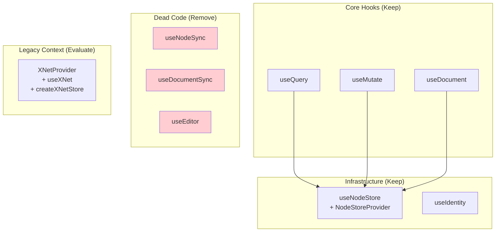
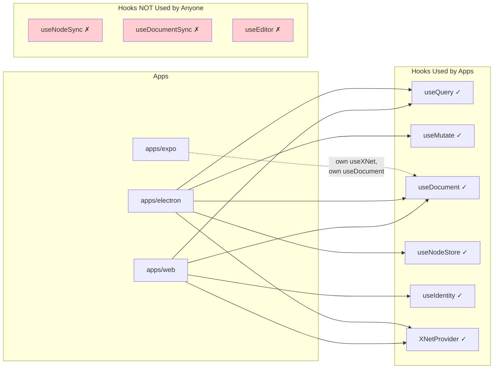
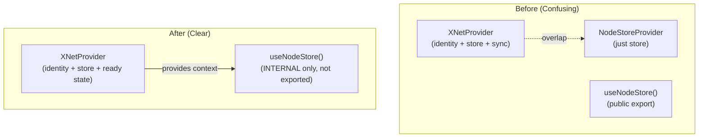
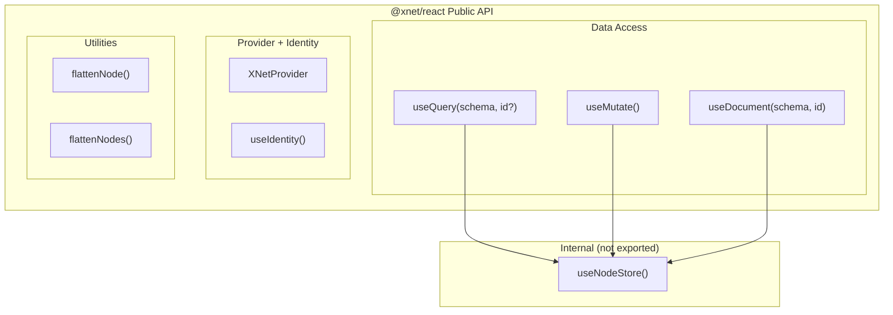

# React Hooks Simplification

> Audit of `@xnet/react` hooks: what's used, what's dead, and what can be removed.

**Status**: ✅ Implemented  
**Last Updated**: January 2026  
**Implemented**: January 24, 2026 (commits `903232e`, `bab49ae`, `9b4368f`)

---

## Current State

The `@xnet/react` package exports 3 core hooks (the "new" API) plus several legacy hooks that are still exported but no longer used:



---

## Hook-by-Hook Analysis

### Core Hooks (Keep — These ARE the API)

| Hook          | Purpose                                                 | Used In                   |
| ------------- | ------------------------------------------------------- | ------------------------- |
| `useQuery`    | Read nodes (single by ID, list, filtered)               | 3 app files, 3 test files |
| `useMutate`   | Write operations (create, update, delete, transactions) | 1 app file, 3 test files  |
| `useDocument` | Full document editing (Node + Y.Doc + sync + presence)  | 4 app files, 3 test files |

These are the simplified API. All app code has migrated to them. No changes needed.

### Infrastructure (Keep but Simplify)

| Hook                | Purpose                                              | Used In                                                                 | Action                                     |
| ------------------- | ---------------------------------------------------- | ----------------------------------------------------------------------- | ------------------------------------------ |
| `useNodeStore`      | Access raw NodeStore (used internally by core hooks) | 2 app files (ready check), 1 package (devtools), internal to core hooks | **Internalize** (stop exporting)           |
| `useIdentity`       | Access DID identity                                  | 2 app files (web)                                                       | Keep                                       |
| `NodeStoreProvider` | Context provider that initializes NodeStore          | App entry points, test wrappers                                         | **Remove** (redundant with `XNetProvider`) |
| `XNetProvider`      | App-level context (identity + store)                 | 2 app entry points                                                      | Keep (becomes the single provider)         |

`useNodeStore` is foundational — the core hooks call it internally. But apps should not need it. They currently use it only for `isReady` checks, which the core hooks' `loading` state already handles. Internalize it (keep the file, stop exporting it from the package index).

### Dead Code (Remove)

| Hook              | Purpose                                  | Imported By | Verdict |
| ----------------- | ---------------------------------------- | ----------- | ------- |
| `useNodeSync`     | WebSocket P2P sync for NodeStore changes | **Nobody**  | Remove  |
| `useDocumentSync` | Legacy XDocument y-webrtc sync           | **Nobody**  | Remove  |
| `useEditor`       | Plain-text editor binding to Y.Doc       | **Nobody**  | Remove  |

All three are defined, exported, and imported by exactly zero files outside their own definition. They have been fully superseded.

### Legacy Context (Evaluate)

| Export            | Purpose                                     | Used In                            |
| ----------------- | ------------------------------------------- | ---------------------------------- |
| `XNetProvider`    | App-level context (identity + store + sync) | 2 app entry points (web, electron) |
| `useXNet`         | Access the XNetProvider context             | 1 web component (GlobalSearch)     |
| `createXNetStore` | Factory for XNet zustand store              | Used by XNetProvider               |

`XNetProvider` is still used in app entry points. However, its role overlaps with `NodeStoreProvider` — both provide the store. This is a separate cleanup (provider consolidation), not part of the immediate hook removal.

---

## Usage Heatmap



---

## What About `useEditor`?

There's a naming collision that may be causing confusion:

| `useEditor`                 | Package                                 | Purpose                                                                                      |
| --------------------------- | --------------------------------------- | -------------------------------------------------------------------------------------------- |
| `@xnet/react`'s `useEditor` | `packages/react/src/hooks/useEditor.ts` | **Dead code.** Plain-text binding to Y.Doc via `@xnet/editor`'s `createEditor()`.            |
| TipTap's `useEditor`        | `@tiptap/react`                         | **Active.** Used by `RichTextEditor` in `packages/editor/src/components/RichTextEditor.tsx`. |

The `@xnet/react` `useEditor` was a lower-level plain-text hook that predates the TipTap-based rich text editor. Apps now use `useDocument` to get a `Y.Doc`, then pass it to `<RichTextEditor ydoc={doc} />` which uses TipTap's `useEditor` internally.

There's no reason for `@xnet/react` to export an editor hook. The editor package owns its own React integration. This is consistent with how we don't have `useTable` or `useCanvas` hooks in the react package — each package handles its own component binding.

---

## What About `useNode` / `useNodes`?

These are mentioned in `CLAUDE.md` but **don't exist** in the codebase. They were apparently planned but never implemented, or were removed when `useQuery` was built. Their functionality is fully covered:

```typescript
// useNode(schema, id) → equivalent:
const { data, loading, error } = useQuery(PageSchema, nodeId)

// useNodes(schema) → equivalent:
const { data, loading, error } = useQuery(PageSchema)

// useNodes(schema, filter) → equivalent:
const { data } = useQuery(PageSchema, { where: { status: 'active' } })
```

The `CLAUDE.md` description should be updated to reflect the actual API.

---

## Recommendation

### Immediate: Remove Dead Hooks

Remove these three exports and their source files:

```
packages/react/src/hooks/useNodeSync.ts     → DELETE
packages/react/src/hooks/useDocumentSync.ts → DELETE
packages/react/src/hooks/useEditor.ts       → DELETE
```

Remove from `packages/react/src/index.ts`:

```typescript
// REMOVE these lines:
export { useNodeSync, ... } from './hooks/useNodeSync'
export { useDocumentSync, ... } from './hooks/useDocumentSync'
export { useEditor, ... } from './hooks/useEditor'
```

### Immediate: Update CLAUDE.md

Update the react package description to match reality:

```markdown
react/ # useQuery, useMutate, useDocument, useNodeStore, useIdentity
```

### Immediate: Consolidate Providers

`XNetProvider` and `NodeStoreProvider` have overlapping responsibilities. `XNetProvider` already creates the store AND provides identity. `NodeStoreProvider` is a subset (just store, no identity). There's no reason for both.

**Consolidate to a single `XNetProvider`** as the only provider apps use:



**Changes:**

- `NodeStoreProvider` → remove as public export (or make it an internal detail of `XNetProvider`)
- `useNodeStore()` → make internal (not exported from `@xnet/react`). Core hooks use it internally. Apps never need it directly.
- Apps check readiness via `useQuery`/`useDocument` loading states, not `useNodeStore().isReady`
- Devtools accesses the store from `XNetProvider`'s context (same context, just not through a dedicated hook export)

### Immediate: Make `useNodeStore` Internal

App code currently uses `useNodeStore()` for one thing: checking `isReady` before rendering. But the core hooks already return `{ loading: true }` while the store initializes. Apps should use that instead:

```typescript
// BEFORE (apps checking store readiness directly):
const { isReady } = useNodeStore()
if (!isReady) return <Loading />

// AFTER (just use the hooks — they handle loading internally):
const { data, loading } = useQuery(PageSchema)
if (loading) return <Loading />
```

`useNodeStore` remains as a private helper inside `packages/react/src/hooks/` but is no longer exported from the package index.

### The Resulting API Surface

After cleanup, `@xnet/react` exports exactly:



**3 hooks + 1 identity hook + 1 provider + 2 utilities** = minimal, focused API.

---

## Summary

| Action          | Export              | Reason                                                                   |
| --------------- | ------------------- | ------------------------------------------------------------------------ |
| **Keep**        | `useQuery`          | Core read hook                                                           |
| **Keep**        | `useMutate`         | Core write hook                                                          |
| **Keep**        | `useDocument`       | Core document hook (includes sync)                                       |
| **Keep**        | `useIdentity`       | Identity access                                                          |
| **Keep**        | `XNetProvider`      | Single provider for apps                                                 |
| **Internalize** | `useNodeStore`      | Still used by core hooks internally, but not exported                    |
| **Remove**      | `NodeStoreProvider` | Redundant with `XNetProvider`                                            |
| **Remove**      | `useNodeSync`       | Dead code, zero imports                                                  |
| **Remove**      | `useDocumentSync`   | Dead code, zero imports, replaced by `useDocument`                       |
| **Remove**      | `useEditor`         | Dead code, zero imports, replaced by `@xnet/editor`'s TipTap integration |
| **Remove**      | `useXNet`           | Replaced by `useIdentity` + core hooks' loading states                   |
| **Remove**      | `createXNetStore`   | Internal to provider, not a public API                                   |
| **Update**      | CLAUDE.md           | Remove references to `useNode`, `useNodes`, `useNodeSync`                |
