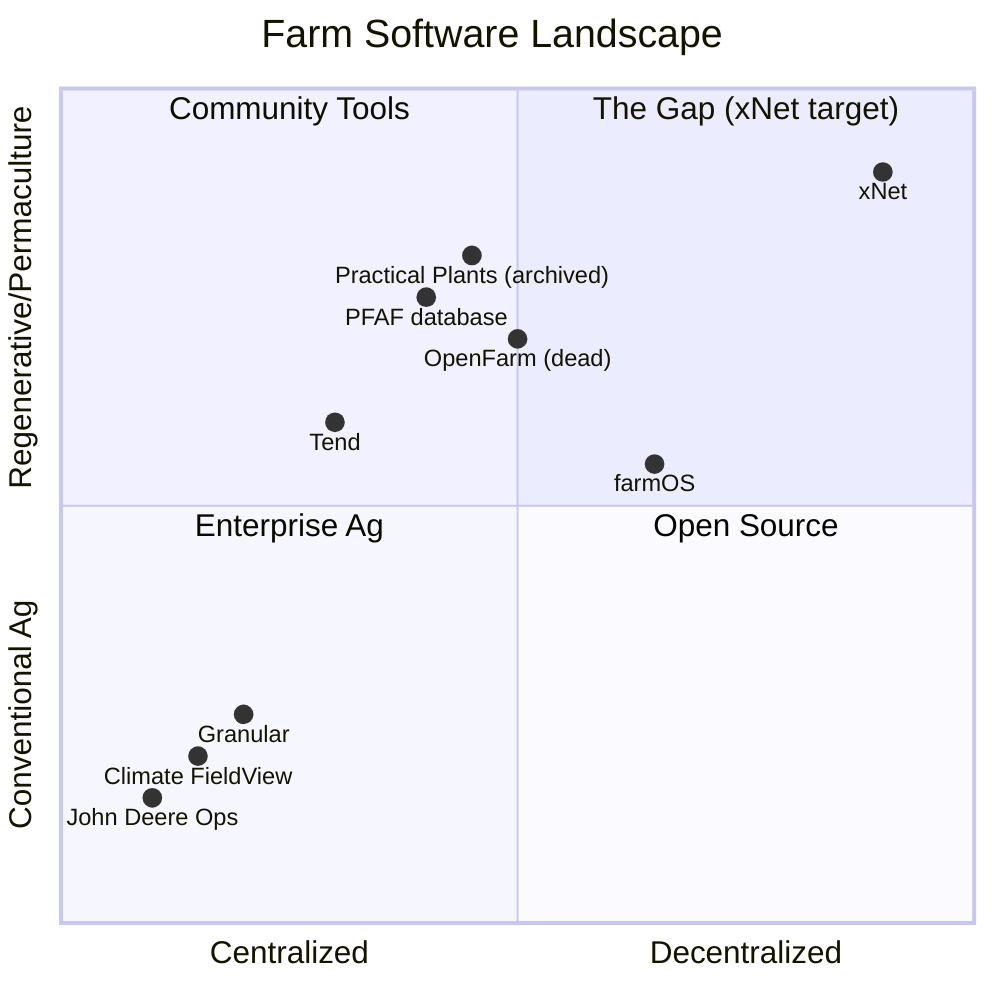
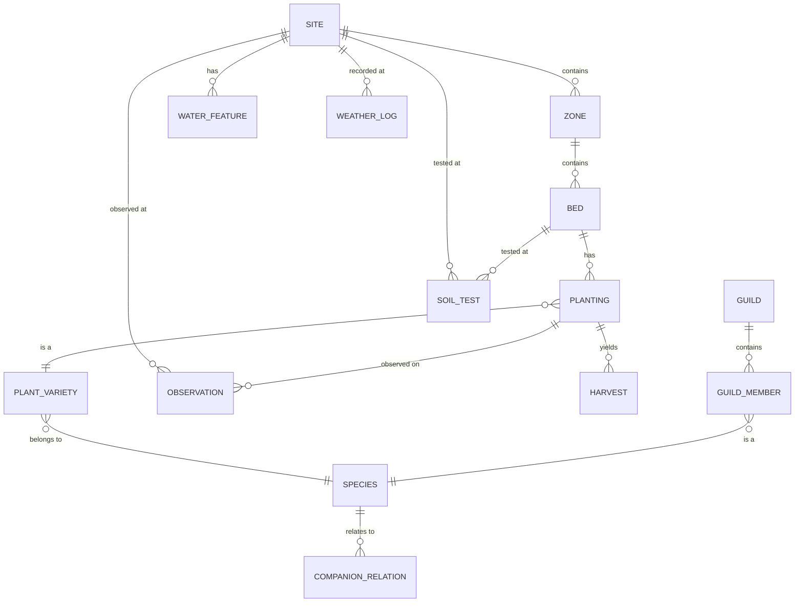
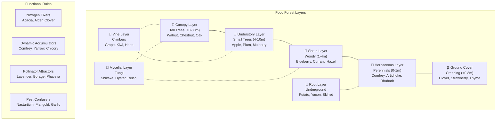
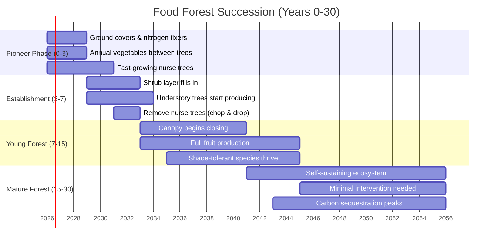
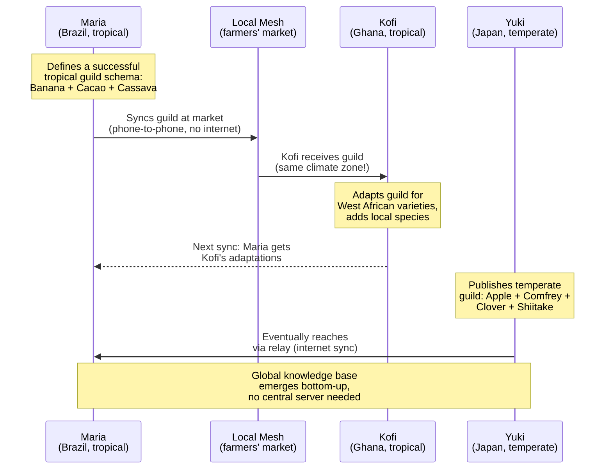
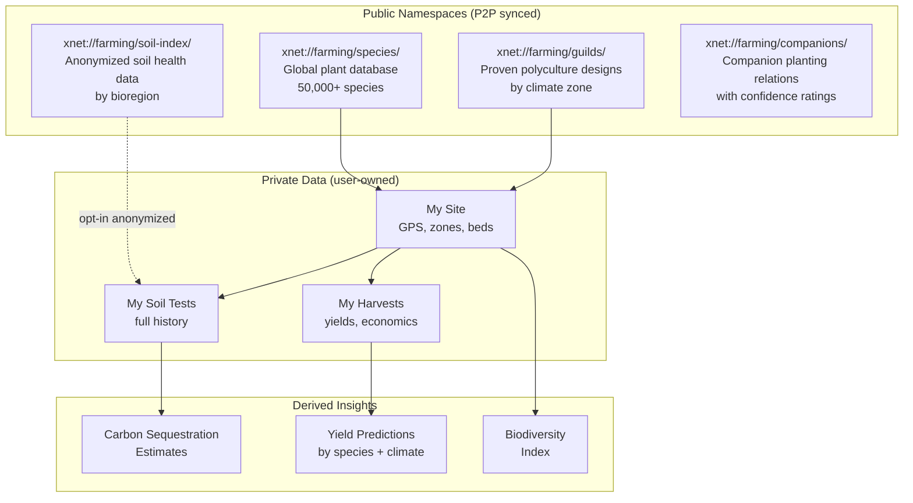
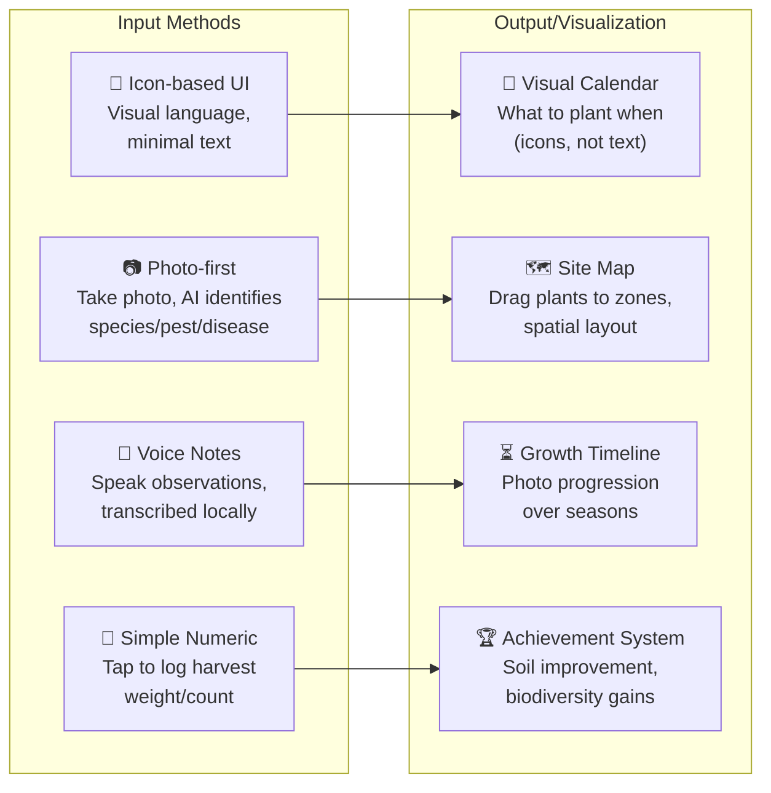
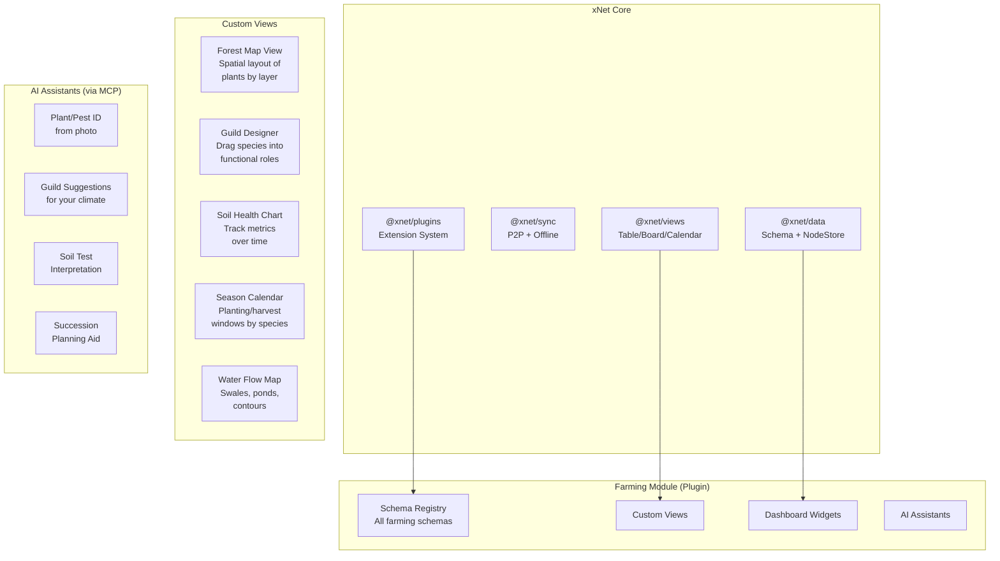
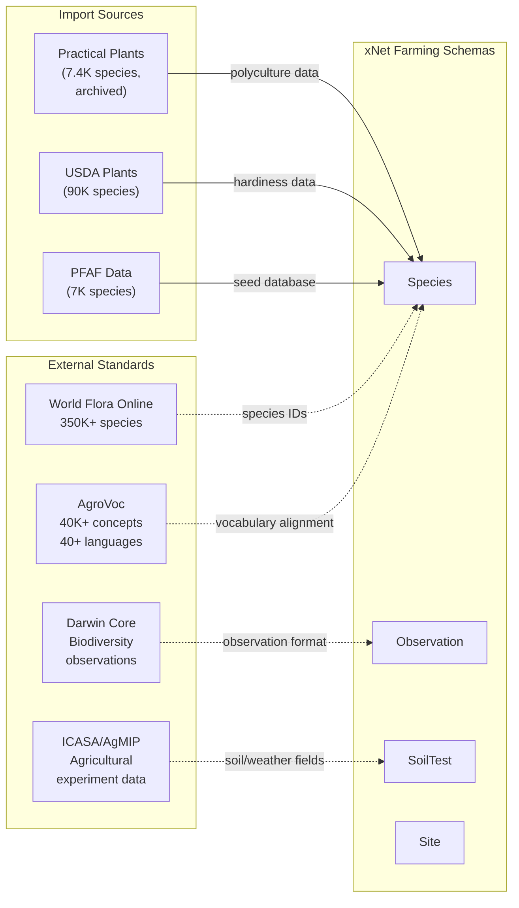

# Regenerative Farming ERP: Food Forests, Permaculture & Soil Regeneration

## The Opportunity

2 billion+ people work in agriculture. Most have no digital tools for managing their land — or worse, are locked into corporate platforms (Bayer/Climate FieldView, Corteva) that extract their data and sell it back to them as "insights." Meanwhile, the permaculture and regenerative agriculture communities are producing extraordinary knowledge about soil health, polycultures, water management, and biodiversity — but sharing it through fragmented, ephemeral channels (Facebook groups, YouTube, PDFs, word of mouth).

xNet's architecture is uniquely suited to this:

- **Offline-first**: 2.9 billion people lack reliable internet. Farmers work in fields, not at desks.
- **P2P sync**: Share data at farmers' markets, co-op meetings, or when devices are briefly in range.
- **User-owned data**: No corporation owns your soil data, harvest records, or planting designs.
- **Schema-first**: Schemas can represent plant guilds, soil tests, water systems — all type-safe and queryable.
- **Plugin system**: Community-built modules for different bioregions, climate zones, crop types.
- **Free and open**: No subscriptions, no vendor lock-in, no data extraction.

---

## Landscape Analysis

### Existing Tools and Their Limitations



| Tool                  | Type                     | Strengths                                            | Limitations                                                          |
| --------------------- | ------------------------ | ---------------------------------------------------- | -------------------------------------------------------------------- |
| **farmOS**            | Open-source, self-hosted | Comprehensive, Drupal-based, active community        | Requires server, not offline-first, not P2P, complex setup           |
| **OpenFarm**          | Centralized wiki         | Community crop guides, growing info                  | Shut down April 2025 after 10 years — centralization failure         |
| **Practical Plants**  | Plant database           | 7,400+ species, polyculture data, companion planting | Archived after server failure — data loss cautionary tale            |
| **PFAF**              | Plant database           | 7,000+ useful plants, permaculture focus             | Read-only website, no farm management, no offline                    |
| **Climate FieldView** | Corporate SaaS           | Precision ag, satellite imagery, yield maps          | Data extraction, subscription, conventional-ag only, no permaculture |
| **FarmHack**          | Community                | Open-source hardware designs                         | Not a data platform, wiki-style                                      |
| **Tend**              | Mobile app               | Simple crop tracking, harvest logs                   | Limited, centralized, no P2P, no soil/ecosystem tracking             |
| **iNaturalist**       | Citizen science          | Species ID via AI, massive community                 | Observation-only, not farm management, requires internet             |

**Key insight**: OpenFarm and Practical Plants both died because they were centralized. Their data — contributed by thousands of people over years — is now at risk. A decentralized, user-owned system would have survived.

### Why Nothing Exists in the Top-Right Quadrant

No existing tool is simultaneously:

1. Offline-first (works without internet)
2. P2P-synced (share without servers)
3. Permaculture-aware (guilds, layers, zones, succession)
4. User-owned (your data stays yours)
5. Globally accessible (free, multilingual, low-literacy friendly)

This is exactly what xNet provides at the infrastructure level.

---

## Data Model: Schemas for Regenerative Farming

### Entity Relationship Overview



### Core Schemas

```typescript
// ─── Site & Zones ───────────────────────────────────────────

const SiteSchema = defineSchema({
  name: 'Site',
  namespace: 'xnet://farming/',
  document: 'yjs', // rich text notes, design rationale
  properties: {
    name: text({ required: true }),
    location: geo(), // lat/lng/altitude
    area: number(), // hectares or acres
    climate: select({
      options: [
        { id: 'tropical', name: 'Tropical' },
        { id: 'subtropical', name: 'Subtropical' },
        { id: 'temperate', name: 'Temperate' },
        { id: 'arid', name: 'Arid' },
        { id: 'mediterranean', name: 'Mediterranean' },
        { id: 'continental', name: 'Continental' },
        { id: 'boreal', name: 'Boreal' }
      ] as const
    }),
    hardinessZone: text(), // USDA zone or equivalent
    annualRainfall: number(), // mm
    elevation: number(), // meters
    aspect: select({
      // slope direction
      options: [
        { id: 'n', name: 'North' },
        { id: 's', name: 'South' },
        { id: 'e', name: 'East' },
        { id: 'w', name: 'West' },
        { id: 'flat', name: 'Flat' }
      ] as const
    }),
    startDate: date(),
    photo: file()
  }
})

const ZoneSchema = defineSchema({
  name: 'Zone',
  namespace: 'xnet://farming/',
  document: 'yjs',
  properties: {
    name: text({ required: true }),
    siteId: relation({ schema: SiteSchema }),
    zoneNumber: select({
      options: [
        { id: '0', name: 'Zone 0 — Home/Processing' },
        { id: '1', name: 'Zone 1 — Intensive Garden' },
        { id: '2', name: 'Zone 2 — Food Forest/Orchard' },
        { id: '3', name: 'Zone 3 — Farm/Broadacre' },
        { id: '4', name: 'Zone 4 — Semi-wild/Managed Forest' },
        { id: '5', name: 'Zone 5 — Wilderness/Conservation' }
      ] as const
    }),
    area: number(),
    notes: text()
  }
})

// ─── Plants & Species ───────────────────────────────────────

const SpeciesSchema = defineSchema({
  name: 'Species',
  namespace: 'xnet://farming/',
  document: 'yjs', // detailed growing notes, traditional uses
  properties: {
    commonName: text({ required: true }),
    scientificName: text({ required: true }),
    family: text(),
    forestLayer: select({
      options: [
        { id: 'canopy', name: 'Canopy (tall trees)' },
        { id: 'understory', name: 'Understory (small trees)' },
        { id: 'shrub', name: 'Shrub Layer' },
        { id: 'herbaceous', name: 'Herbaceous Layer' },
        { id: 'groundcover', name: 'Ground Cover' },
        { id: 'vine', name: 'Vine/Climber' },
        { id: 'root', name: 'Root/Tuber' },
        { id: 'mycelial', name: 'Mycelial/Fungal' }
      ] as const
    }),
    functions: multiSelect({
      options: [
        { id: 'nitrogen_fixer', name: 'Nitrogen Fixer' },
        { id: 'dynamic_accumulator', name: 'Dynamic Accumulator' },
        { id: 'pollinator_attractor', name: 'Pollinator Attractor' },
        { id: 'pest_confuser', name: 'Pest Confuser' },
        { id: 'ground_cover', name: 'Living Mulch' },
        { id: 'windbreak', name: 'Windbreak' },
        { id: 'shade_provider', name: 'Shade Provider' },
        { id: 'food_human', name: 'Human Food' },
        { id: 'food_animal', name: 'Animal Forage' },
        { id: 'medicine', name: 'Medicinal' },
        { id: 'fiber', name: 'Fiber/Material' },
        { id: 'fuel', name: 'Fuel/Biomass' },
        { id: 'soil_builder', name: 'Soil Builder' }
      ] as const
    }),
    hardinessMin: number(), // min USDA zone
    hardinessMax: number(), // max USDA zone
    waterNeeds: select({
      options: [
        { id: 'xeric', name: 'Xeric (very low)' },
        { id: 'low', name: 'Low' },
        { id: 'moderate', name: 'Moderate' },
        { id: 'high', name: 'High' },
        { id: 'aquatic', name: 'Aquatic' }
      ] as const
    }),
    sunNeeds: select({
      options: [
        { id: 'full_sun', name: 'Full Sun' },
        { id: 'part_shade', name: 'Part Shade' },
        { id: 'full_shade', name: 'Full Shade' }
      ] as const
    }),
    mature_height: number(), // meters
    spread: number(), // meters
    yearsToProduction: number(),
    lifespan: number(), // years
    nativeRegions: multiSelect({ options: [] as const }), // extensible
    photo: file()
  }
})

const CompanionRelationSchema = defineSchema({
  name: 'CompanionRelation',
  namespace: 'xnet://farming/',
  properties: {
    speciesA: relation({ schema: SpeciesSchema }),
    speciesB: relation({ schema: SpeciesSchema }),
    relationship: select({
      options: [
        { id: 'beneficial', name: 'Beneficial' },
        { id: 'antagonistic', name: 'Antagonistic' },
        { id: 'neutral', name: 'Neutral' }
      ] as const
    }),
    mechanism: text(), // why they help/hinder each other
    source: text(), // citation
    confidence: select({
      options: [
        { id: 'anecdotal', name: 'Anecdotal' },
        { id: 'observed', name: 'Observed (personal)' },
        { id: 'replicated', name: 'Replicated (community)' },
        { id: 'scientific', name: 'Scientific Literature' }
      ] as const
    })
  }
})

// ─── Guilds & Polycultures ──────────────────────────────────

const GuildSchema = defineSchema({
  name: 'Guild',
  namespace: 'xnet://farming/',
  document: 'yjs', // design notes, rationale
  properties: {
    name: text({ required: true }),
    centralSpecies: relation({ schema: SpeciesSchema }),
    climate: select({ options: [] as const }), // same as Site
    description: text(),
    spacing: number(), // meters diameter
    yearsToEstablish: number(),
    source: text(), // who designed it, citation
    photo: file()
  }
})

const GuildMemberSchema = defineSchema({
  name: 'GuildMember',
  namespace: 'xnet://farming/',
  properties: {
    guildId: relation({ schema: GuildSchema }),
    species: relation({ schema: SpeciesSchema }),
    role: select({
      options: [
        { id: 'central', name: 'Central/Primary' },
        { id: 'nitrogen_fixer', name: 'Nitrogen Fixer' },
        { id: 'mulch', name: 'Mulch/Chop-and-Drop' },
        { id: 'pollinator', name: 'Pollinator Attractor' },
        { id: 'pest_repellent', name: 'Pest Repellent' },
        { id: 'ground_cover', name: 'Ground Cover' },
        { id: 'nutrient_accumulator', name: 'Nutrient Accumulator' },
        { id: 'structural', name: 'Trellis/Support' }
      ] as const
    }),
    quantity: number(),
    placementNotes: text()
  }
})

// ─── Soil Health ────────────────────────────────────────────

const SoilTestSchema = defineSchema({
  name: 'SoilTest',
  namespace: 'xnet://farming/',
  document: 'yjs', // observations, methodology notes
  properties: {
    siteId: relation({ schema: SiteSchema }),
    zoneId: relation({ schema: ZoneSchema }),
    testDate: date({ required: true }),
    depth: number(), // cm
    // Chemical
    ph: number(),
    organicMatter: number(), // percentage
    nitrogen: number(), // ppm
    phosphorus: number(), // ppm
    potassium: number(), // ppm
    calcium: number(), // ppm
    magnesium: number(), // ppm
    cec: number(), // cation exchange capacity
    // Physical
    texture: select({
      options: [
        { id: 'sand', name: 'Sand' },
        { id: 'loamy_sand', name: 'Loamy Sand' },
        { id: 'sandy_loam', name: 'Sandy Loam' },
        { id: 'loam', name: 'Loam' },
        { id: 'clay_loam', name: 'Clay Loam' },
        { id: 'clay', name: 'Clay' }
      ] as const
    }),
    bulkDensity: number(), // g/cm³
    infiltrationRate: number(), // mm/hr
    aggregateStability: number(), // percentage
    // Biological
    microbialBiomass: number(), // μg C/g soil
    fungalBacterialRatio: number(),
    earthwormCount: number(), // per m²
    respirationRate: number(), // mg CO₂/kg/day
    // Carbon
    totalCarbon: number(), // tonnes/hectare
    carbonSequestrationRate: number(), // tonnes/hectare/year
    // Methodology
    lab: text(),
    method: text(),
    photo: file() // soil sample photo
  }
})

// ─── Water Management ───────────────────────────────────────

const WaterFeatureSchema = defineSchema({
  name: 'WaterFeature',
  namespace: 'xnet://farming/',
  document: 'yjs',
  properties: {
    name: text({ required: true }),
    siteId: relation({ schema: SiteSchema }),
    type: select({
      options: [
        { id: 'swale', name: 'Swale' },
        { id: 'pond', name: 'Pond/Dam' },
        { id: 'rain_garden', name: 'Rain Garden' },
        { id: 'hugelkultur', name: 'Hugelkultur' },
        { id: 'keyline', name: 'Keyline' },
        { id: 'irrigation', name: 'Irrigation System' },
        { id: 'rainwater_tank', name: 'Rainwater Tank' },
        { id: 'greywater', name: 'Greywater System' },
        { id: 'spring', name: 'Natural Spring' },
        { id: 'well', name: 'Well/Bore' },
        { id: 'stream', name: 'Stream/Creek' }
      ] as const
    }),
    capacity: number(), // liters
    flowRate: number(), // liters/min
    lengthMeters: number(),
    status: select({
      options: [
        { id: 'planned', name: 'Planned' },
        { id: 'under_construction', name: 'Under Construction' },
        { id: 'active', name: 'Active' },
        { id: 'maintenance', name: 'Needs Maintenance' }
      ] as const
    }),
    installDate: date(),
    photo: file()
  }
})

// ─── Plantings & Harvests ───────────────────────────────────

const PlantingSchema = defineSchema({
  name: 'Planting',
  namespace: 'xnet://farming/',
  properties: {
    species: relation({ schema: SpeciesSchema }),
    siteId: relation({ schema: SiteSchema }),
    zoneId: relation({ schema: ZoneSchema }),
    guildId: relation({ schema: GuildSchema }),
    plantDate: date({ required: true }),
    quantity: number(),
    source: select({
      options: [
        { id: 'seed', name: 'From Seed' },
        { id: 'cutting', name: 'Cutting/Clone' },
        { id: 'transplant', name: 'Transplant' },
        { id: 'division', name: 'Division' },
        { id: 'volunteer', name: 'Volunteer/Self-seeded' },
        { id: 'existing', name: 'Pre-existing' }
      ] as const
    }),
    status: select({
      options: [
        { id: 'germinating', name: 'Germinating' },
        { id: 'establishing', name: 'Establishing' },
        { id: 'growing', name: 'Growing' },
        { id: 'producing', name: 'Producing' },
        { id: 'dormant', name: 'Dormant' },
        { id: 'declined', name: 'Declined' },
        { id: 'dead', name: 'Dead' },
        { id: 'removed', name: 'Removed' }
      ] as const
    }),
    notes: text()
  }
})

const HarvestSchema = defineSchema({
  name: 'Harvest',
  namespace: 'xnet://farming/',
  properties: {
    plantingId: relation({ schema: PlantingSchema }),
    harvestDate: date({ required: true }),
    quantity: number(), // kg or count
    unit: select({
      options: [
        { id: 'kg', name: 'Kilograms' },
        { id: 'count', name: 'Count/Pieces' },
        { id: 'bunches', name: 'Bunches' },
        { id: 'liters', name: 'Liters' }
      ] as const
    }),
    quality: select({
      options: [
        { id: 'excellent', name: 'Excellent' },
        { id: 'good', name: 'Good' },
        { id: 'fair', name: 'Fair' },
        { id: 'poor', name: 'Poor' }
      ] as const
    }),
    destination: select({
      options: [
        { id: 'home', name: 'Home Use' },
        { id: 'market', name: 'Market/Sale' },
        { id: 'preserve', name: 'Preserved/Stored' },
        { id: 'seed_save', name: 'Seed Saving' },
        { id: 'compost', name: 'Compost/Return' },
        { id: 'share', name: 'Shared/Gift' },
        { id: 'animal_feed', name: 'Animal Feed' }
      ] as const
    }),
    notes: text()
  }
})

// ─── Observations & Biodiversity ────────────────────────────

const ObservationSchema = defineSchema({
  name: 'Observation',
  namespace: 'xnet://farming/',
  document: 'yjs', // detailed field notes
  properties: {
    siteId: relation({ schema: SiteSchema }),
    observationDate: date({ required: true }),
    category: select({
      options: [
        { id: 'pest', name: 'Pest/Disease' },
        { id: 'beneficial', name: 'Beneficial Insect' },
        { id: 'pollinator', name: 'Pollinator' },
        { id: 'bird', name: 'Bird' },
        { id: 'mammal', name: 'Mammal' },
        { id: 'fungi', name: 'Fungi' },
        { id: 'weather', name: 'Weather Event' },
        { id: 'phenology', name: 'Phenology (bloom, leaf-out)' },
        { id: 'soil', name: 'Soil Observation' },
        { id: 'general', name: 'General Note' }
      ] as const
    }),
    species: text(), // what was observed
    count: number(),
    photo: file(),
    actionTaken: text()
  }
})

// ─── Weather ────────────────────────────────────────────────

const WeatherLogSchema = defineSchema({
  name: 'WeatherLog',
  namespace: 'xnet://farming/',
  properties: {
    siteId: relation({ schema: SiteSchema }),
    logDate: date({ required: true }),
    tempHigh: number(), // °C
    tempLow: number(),
    rainfall: number(), // mm
    humidity: number(), // percentage
    windSpeed: number(), // km/h
    frostEvent: checkbox(),
    notes: text()
  }
})
```

---

## The Seven Layers: Food Forest Data Model



---

## Succession Planning Timeline



---

## How P2P Sync Enables Knowledge Sharing



### Sync Scenarios for Farming

| Scenario                       | How It Works                                                      |
| ------------------------------ | ----------------------------------------------------------------- |
| **Farmer-to-farmer at market** | Phone Bluetooth/WiFi Direct, no internet needed                   |
| **Co-op meeting**              | One device acts as relay, all members sync                        |
| **Extension worker visit**     | Worker carries data from research station, syncs to remote farms  |
| **Regional network**           | Signaling server at local ag office, WebRTC when online           |
| **Global species database**    | Public namespace, syncs via relay nodes when connected            |
| **Seed library**               | Track seed varieties, provenance, performance — sync at exchanges |

---

## Public Namespaces: Shared Knowledge Commons

xNet's `xnet://` addressing enables shared, community-maintained datasets that sync P2P:



### Global Soil Health Index

Farmers can opt-in to share anonymized soil test data. Aggregated across thousands of sites, this creates a living map of soil health by bioregion — showing where regeneration is working and where it's needed most.

```typescript
// Anonymized soil contribution (strips GPS to bioregion-level)
const contribution = {
  bioregion: 'Atlantic Forest, Brazil', // coarse location only
  climate: 'subtropical',
  years_regenerating: 5,
  organic_matter_start: 1.2, // percentage at start
  organic_matter_now: 4.8, // percentage now
  practices: ['food_forest', 'chop_and_drop', 'no_till'],
  carbon_delta: +12.5 // tonnes/hectare gained
}
```

### Open Plant Database

Unlike PFAF or Practical Plants (both now degraded/archived), an xNet-native plant database would be:

- **Indestructible**: Lives on users' devices, not one server
- **Community-maintained**: Anyone can add species, varieties, observations
- **Confidence-rated**: Claims about companion planting rated by evidence quality
- **Climate-tagged**: Filter species by your hardiness zone, rainfall, soil type
- **Multilingual**: Same species node, multiple language properties

---

## Accessibility: Reaching Every Farmer

### Challenge: 773 Million Illiterate Adults

Traditional ERP assumes literacy and technical skill. For global reach, xNet farming tools need:



### Progressive Complexity

| User Level       | Features Available                                                               |
| ---------------- | -------------------------------------------------------------------------------- |
| **Beginner**     | Photo log, harvest counter, weather notes, pre-built guild templates             |
| **Intermediate** | Soil tests, custom plantings, companion planting suggestions, yield tracking     |
| **Advanced**     | Full schema design, custom views, data export, carbon calculations, P2P teaching |
| **Researcher**   | Statistical analysis, multi-site comparison, publication-ready data, API access  |

### Multilingual Support

Schemas support multiple language properties natively:

```typescript
// Species with multilingual names
const species = {
  commonName: 'Moringa', // English (default)
  'commonName:pt': 'Moringa', // Portuguese
  'commonName:sw': 'Mlonge', // Swahili
  'commonName:hi': 'सहजन', // Hindi
  'commonName:es': 'Moringa', // Spanish
  scientificName: 'Moringa oleifera' // universal
}
```

---

## Module Architecture: xNet Farming Plugin



### Implementation as xNet Plugin

The farming module fits naturally into the planStep03_5 plugin architecture:

| Plugin Layer     | Farming Implementation                                             |
| ---------------- | ------------------------------------------------------------------ |
| **Scripts**      | Frost date calculator, companion planting lookup, carbon estimator |
| **Extensions**   | Forest Map view, Guild Designer, Soil Chart, Season Calendar       |
| **Services**     | Weather data sync (when online), photo AI processing               |
| **Integrations** | iNaturalist import, weather API, soil lab results import           |

---

## Integration with Existing Standards



The farming schemas align with established agricultural ontologies:

- **AgroVoc** (FAO): 40,000+ concepts in 40+ languages — use for multilingual term alignment
- **Darwin Core**: Standard for biodiversity observations — map our Observation schema
- **ICASA/AgMIP**: Agricultural experiment vocabulary — align soil test field names
- **World Flora Online**: 350,000+ accepted species names — canonical species IDs

---

## Why xNet Beats Everything Else

| Requirement               | farmOS              | Corporate Ag       | xNet                         |
| ------------------------- | ------------------- | ------------------ | ---------------------------- |
| Works offline             | No (server-based)   | Partial            | Full (local-first)           |
| Free to use               | Yes (self-host)     | No ($$$)           | Yes (runs on device)         |
| Data ownership            | Self-hosted = yes   | No (their servers) | Yes (your device)            |
| P2P knowledge sharing     | No                  | No                 | Yes (built-in)               |
| Permaculture-aware        | Partial             | No                 | Full (guilds, layers, zones) |
| Mobile-friendly           | Limited             | Yes                | Yes (Expo/PWA)               |
| Low-literacy accessible   | No                  | No                 | Designed for it              |
| Works without server      | No                  | No                 | Yes (P2P, no infra needed)   |
| Survives company shutdown | Maybe (open-source) | No                 | Yes (data on your device)    |
| Global plant database     | No                  | Proprietary        | Yes (public namespace, P2P)  |

---

## Phased Implementation

### Phase 1: Core Farming Schemas + Basic Views (2-3 weeks)

- Define all schemas (Site, Zone, Species, Planting, Harvest, SoilTest, Observation)
- Register as farming module plugin
- Use existing Table/Board views for data entry
- Calendar view for planting/harvest dates
- Basic species database seed (import from PFAF/USDA public data)

### Phase 2: Custom Views (4-6 weeks)

- **Forest Map View**: Spatial drag-drop of species by layer
- **Soil Health Chart**: Line charts of pH, organic matter, carbon over time
- **Season Calendar**: Visual planting windows by species + climate zone
- **Guild Designer**: Compose guilds by dragging species into functional roles

### Phase 3: Knowledge Sharing (3-4 weeks)

- Public species namespace (`xnet://farming/species/`)
- Public guild namespace (`xnet://farming/guilds/`)
- Opt-in anonymous soil health contributions
- P2P sync optimized for low-bandwidth (delta compression)
- Companion planting confidence ratings

### Phase 4: AI & Accessibility (4-6 weeks)

- Photo-based plant/pest ID (MCP integration)
- Voice note transcription (local Whisper model)
- Icon-based minimal-text UI mode
- Guild suggestions based on climate + existing plantings
- Soil test interpretation assistant

### Phase 5: Community & Scale (ongoing)

- Regional bioregion dashboards (aggregated public data)
- Carbon sequestration estimates and tracking
- Seed library management (track varieties, swap events)
- Integration with local weather stations
- Multi-language community translation of species data

---

## Example User Stories

### Maria (Smallholder, Brazil)

> Maria has a 2-hectare food forest in the Atlantic Forest region. She opens xNet on her phone (no internet), logs today's harvest by tapping species icons and entering weights. At Saturday's market, her phone syncs with other farmers — she receives a new guild design for shade-grown cacao that Kofi adapted from her banana guild. She also contributes her latest soil test to the regional soil health index.

### James (Permaculture Teacher, UK)

> James teaches PDC courses and maintains a 0.5-hectare demonstration food forest. He uses the Guild Designer to create teaching materials, the Timeline view to show students succession over 10 years, and exports species lists for handouts. His designs sync to students' devices during class — no internet needed in the rural venue.

### Aisha (Extension Worker, Kenya)

> Aisha visits remote farms with no connectivity. She carries a library of proven guilds for East African highland climate, soil improvement techniques, and a species database in Swahili. At each farm, she syncs with the farmer's phone, leaves them with planting calendars and soil improvement plans. When she returns to town, her observations sync to the regional agricultural office.

---

## Open Questions

1. **Species ID authority**: Should we use World Flora Online IDs, USDA codes, or generate our own with cross-references?
2. **GPS privacy**: How coarse should location anonymization be for the public soil index? Bioregion level? Country level?
3. **Photo storage**: Photos are large. Should they sync P2P or use optional cloud pinning?
4. **AI model hosting**: For plant/pest ID, run locally (large model) or call API (needs internet)?
5. **Seed saving**: Should seed provenance tracking be its own schema or part of Planting?
6. **Animal integration**: Chickens, bees, fish (aquaponics) — separate module or part of this one?
7. **Economics**: Track costs/revenue per planting? This edges into the Finance ERP module territory.
8. **Certification**: Some farms track organic/biodynamic certification data. Include or separate module?

---

## References

- [farmOS](https://farmos.org/) — Open-source farm management (Drupal-based)
- [Plants For A Future](https://pfaf.org/) — 7,000+ useful plant species database
- [Practical Plants](https://practicalplants.org/) — Archived polyculture wiki (7,400+ species)
- [AgroVoc](https://agrovoc.fao.org/) — FAO multilingual agricultural thesaurus
- [Darwin Core](https://dwc.tdwg.org/) — Biodiversity observation standard
- [ICASA](https://dssat.net/icasa/) — Agricultural experiment data vocabulary
- [World Flora Online](http://www.worldfloraonline.org/) — 350,000+ accepted plant species
- [GBIF](https://www.gbif.org/) — 2.4 billion+ biodiversity occurrence records
- [SoilGrids](https://soilgrids.org/) — Global soil property maps
- [Toby Hemenway, "Gaia's Garden"](https://www.chelseagreen.com/product/gaias-garden/) — Food forest guild design reference
- [xNet Vision](../VISION.md) — Micro-to-macro data sovereignty
- [xNet Plugin Architecture](../planStep03_5Plugins/README.md) — Extension system this module uses
- [xNet ERP Plan](../planStep03ERP/README.md) — General ERP framework
