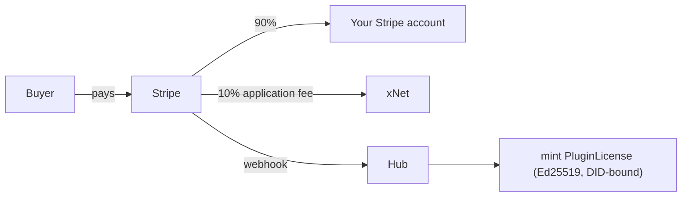

# Sell a plugin

xNet lets a plugin author **charge for their work** — a one-time fee or a monthly
subscription — through an App-Store-like marketplace, without a 30% tax and
without giving up the bring-your-own-Stripe ethos
([exploration 0196](../explorations/0196_[_]_PAID_PLUGIN_MARKETPLACE_MONETIZATION_AND_LICENSING.md)).

This guide covers the three decisions you make as a seller: **how you get paid**,
**which license you ship under**, and **how the license is enforced**.

## 1. Price your plugin

Add a `pricing` block (and a `license`) to your manifest. The scaffolder
(`xnet plugin scaffold`) emits these for you:

```ts
import { defineFeatureModule } from '@xnetjs/plugins'

export const ProModule = defineFeatureModule({
  id: 'com.acme.pro',
  name: 'Acme Pro',
  version: '1.0.0',
  publisherDid: 'did:key:zYourPublisherDid',
  license: 'FSL-1.1-MIT', // source-available; auto-opens to MIT after 2 years
  pricing: {
    mode: 'subscription', // 'free' | 'one-time' | 'subscription'
    amountMinor: 500, // $5.00 — integer minor units
    currency: 'USD',
    billing: 'managed' // 'managed' = xNet Connect (we take the fee); 'byo' = your own
  },
  contributes: {
    /* … */
  }
})
```

`free` plugins need none of this. Paid plugins are **gated at install** — xNet
will not activate paid code without a valid license (see §3).

## 2. How you get paid

### Managed (recommended): your own Stripe + a small marketplace fee

Connect your **own** Stripe account once via Stripe Connect **Standard** (one
click — Stripe keeps your dashboard, your payouts, your KYC, your dispute
handling). xNet attaches a small **application fee** (default **10%**, far below
the App Store's 30%) to each charge and routes the rest to you:



This is genuinely "use your own Stripe" — you are the merchant of record for your
sales — plus an automatically-captured marketplace fee. (There is **no** way for
a platform to skim a fee from a _standalone_ Stripe account it doesn't control;
Connect is the supported version of that.)

### BYO (fully sovereign): your own checkout, 0% fee

Set `pricing.billing: 'byo'` and xNet takes **nothing**. You run your own
checkout and mint your own license tokens (publishing your public key in the
listing's provenance); xNet only _verifies_ the resulting license at install.

## 3. Licensing + enforcement

Paid plugins must declare a **marketplace-approved** license — enforced in CI by
`pnpm check:plugin-licenses`:

| License                                | Source-available | Converts to open             |
| -------------------------------------- | ---------------- | ---------------------------- |
| `FSL-1.1-MIT` _(default)_              | ✅               | ✅ MIT, after 2 years        |
| `FSL-1.1-Apache-2.0`                   | ✅               | ✅ Apache-2.0, after 2 years |
| `MIT` / `Apache-2.0` / `AGPL-3.0-only` | ✅               | already open                 |

**FSL** (the Functional Source License, same one [`@xnetjs/cloud`](../../packages/cloud/LICENSE)
uses) keeps your source published, forbids only a _competing_ marketplace, and
auto-converts each version to MIT/Apache exactly two years after it ships. The
scaffolder writes the matching `LICENSE` file automatically.

Enforcement is a signed **`PluginLicense`** token, not the copyright license. On
purchase the hub mints an **Ed25519-signed, DID-bound** token
([`@xnetjs/licenses`](../../packages/licenses)); the plugin runtime verifies it
**offline** at install/activate. Because it is bound to the buyer's **DID** (not
a device), one purchase works across all their devices and can be revoked
hub-side. The token is the anti-piracy moat; the license governs redistribution
and the eventual open-sourcing.

## 4. Marketplace neutrality

The marketplace's steward is also a publisher (xNet ships first-party plugins),
so the ranking rule is written down before it is ever needed
([exploration 0351](../explorations/0351_[_]_FRONTIER_ECONOMICS_WITHOUT_ENCLOSURE_RAILROADS_AIRLINES_AND_THE_COMMONS.md)):

- **First-party plugins compete under the same ranking inputs as third-party
  plugins.** No reserved slots, no default boost, no placement that a
  third-party listing could not earn with the same signals.
- The marketplace fee pays for the distribution services the marketplace
  actually provides (hosting, review, licensing, payments) — it is a fee on
  improvements, not a toll for reaching users. BYO checkout stays available,
  fee-free, for exactly that reason.
- Any change to ranking inputs is documented in this guide **before** it goes
  live.

## 5. Publish

1. `xnet plugin scaffold` → set `license` + `pricing` (above).
2. Connect Stripe (managed) from the marketplace's "Become a publisher" flow, or
   wire your own checkout (BYO).
3. Submit your manifest URL to the marketplace registry. CI validates the license
   policy; the listing shows a price + license badge.

See the exploration for the full architecture, the Connect vs. merchant-of-record
tradeoffs, and the lifecycle (updates, refunds/revocation, the 2-year auto-open).
