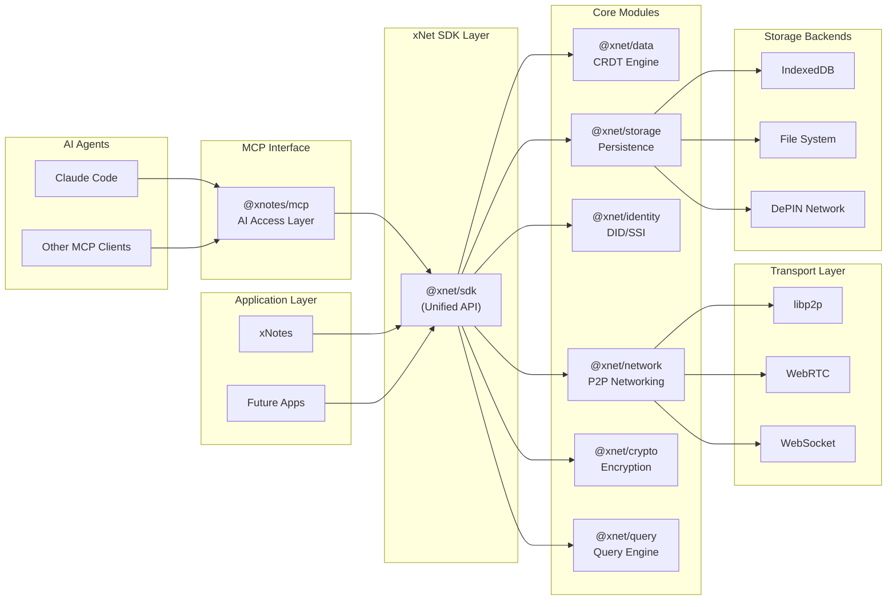
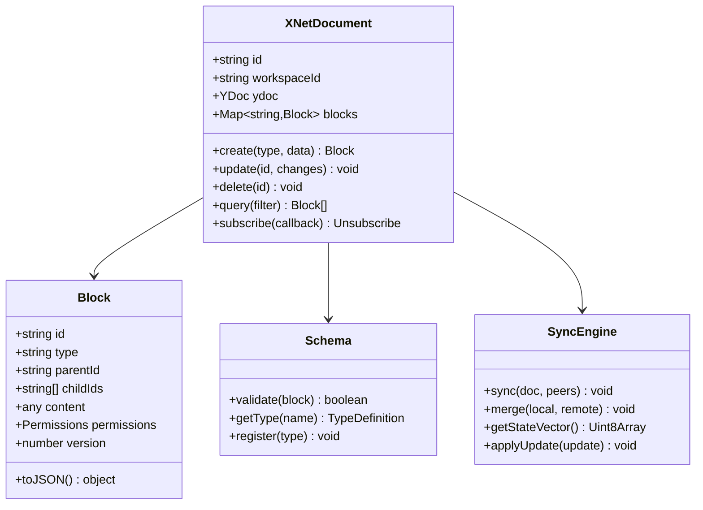
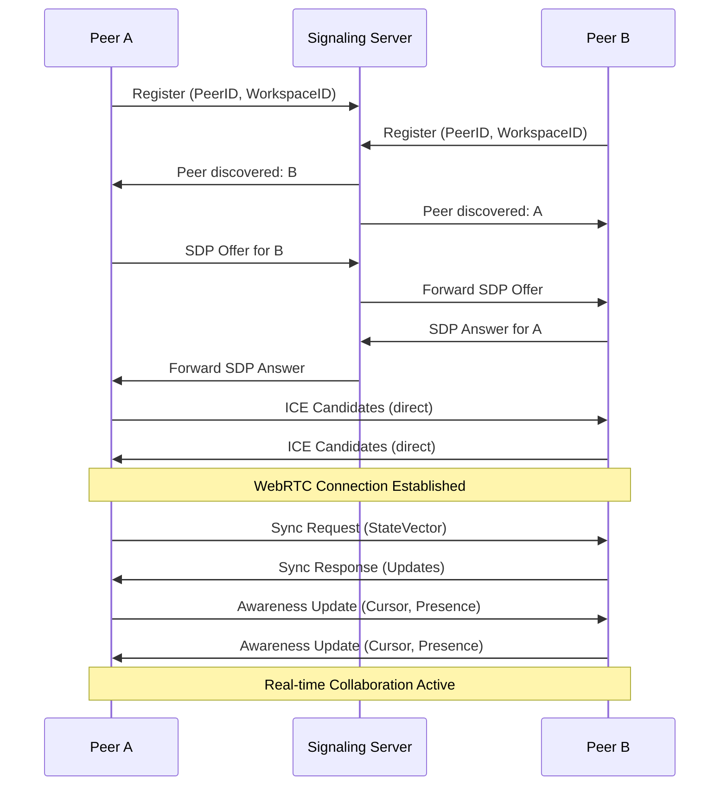
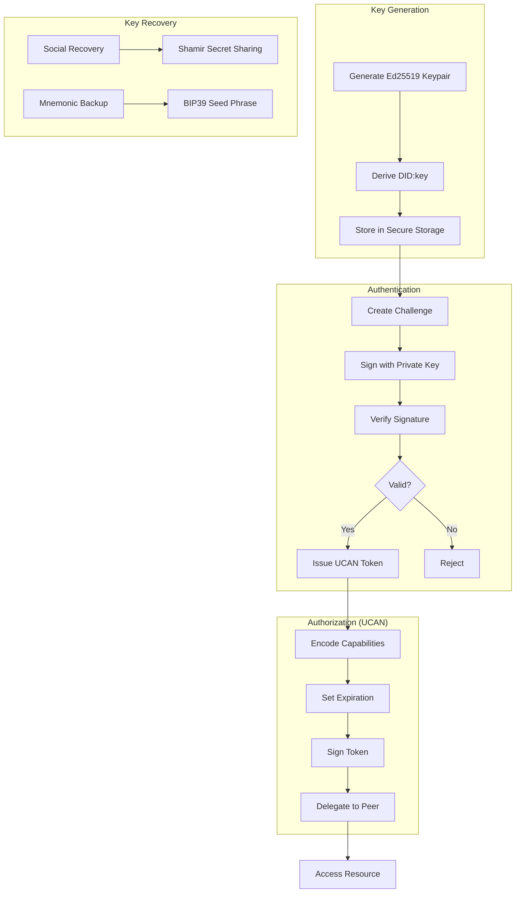
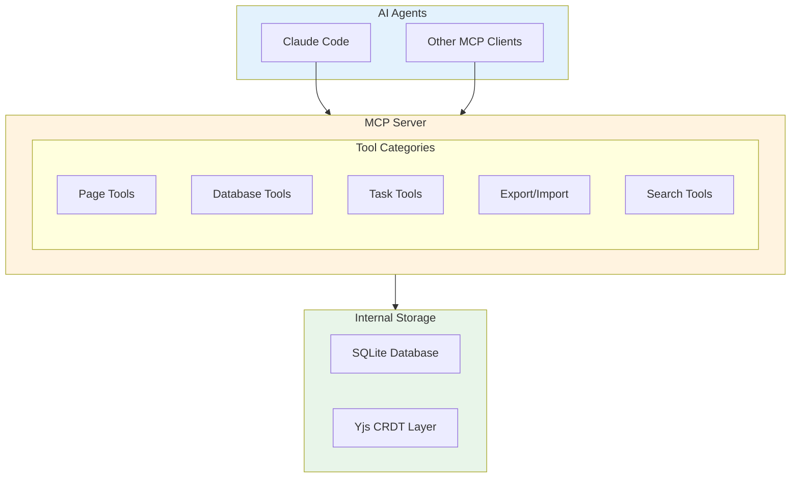
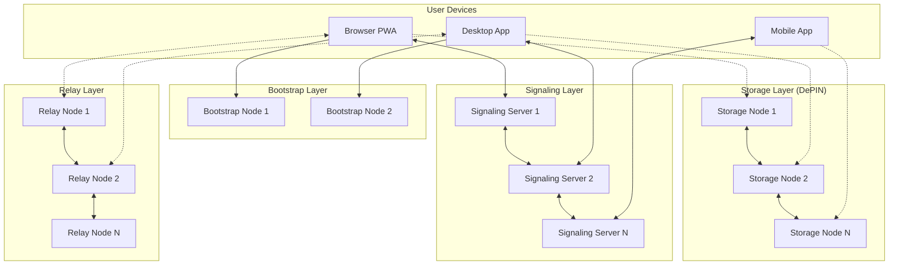

# 01: xNet Core Platform

> The foundational SDK and infrastructure for decentralized applications

[← Back to Plan Overview](./README.md)

---

## Overview

xNet is the foundational infrastructure that powers xNotes and future decentralized applications. It must be developed **in parallel** with xNotes, with xNotes serving as the primary driver and validator of xNet's capabilities.

---

## Platform Architecture



---

## Package Structure

```
xnet/
├── packages/
│   ├── sdk/                      # @xnet/sdk - Unified API
│   │   ├── src/
│   │   │   ├── client.ts         # Main XNet client
│   │   │   ├── workspace.ts      # Workspace management
│   │   │   └── index.ts
│   │   └── package.json
│   │
│   ├── data/                     # @xnet/data - CRDT & Data Model
│   │   ├── src/
│   │   │   ├── document.ts       # CRDT document wrapper
│   │   │   ├── schema.ts         # JSON-LD schema definitions
│   │   │   ├── types.ts          # Block types (Page, Task, etc.)
│   │   │   ├── operations.ts     # CRDT operations
│   │   │   └── validation.ts     # Schema validation
│   │   └── package.json
│   │
│   ├── network/                  # @xnet/network - P2P Layer
│   │   ├── src/
│   │   │   ├── node.ts           # libp2p node setup
│   │   │   ├── protocols/        # Custom protocols
│   │   │   │   ├── sync.ts       # Document sync protocol
│   │   │   │   ├── presence.ts   # Presence/awareness
│   │   │   │   └── discovery.ts  # Peer discovery
│   │   │   ├── transports/       # Transport adapters
│   │   │   │   ├── webrtc.ts
│   │   │   │   ├── websocket.ts
│   │   │   │   └── webtransport.ts
│   │   │   └── relay.ts          # Relay node support
│   │   └── package.json
│   │
│   ├── identity/                 # @xnet/identity - DID/Auth
│   │   ├── src/
│   │   │   ├── did.ts            # DID generation/resolution
│   │   │   ├── keys.ts           # Key management
│   │   │   ├── ucan.ts           # UCAN tokens
│   │   │   ├── session.ts        # Session management
│   │   │   └── recovery.ts       # Key recovery
│   │   └── package.json
│   │
│   ├── storage/                  # @xnet/storage - Persistence
│   │   ├── src/
│   │   │   ├── adapters/
│   │   │   │   ├── indexeddb.ts  # Browser storage
│   │   │   │   ├── sqlite.ts     # Desktop/mobile
│   │   │   │   └── memory.ts     # Testing
│   │   │   ├── blob.ts           # Binary blob storage
│   │   │   ├── backup.ts         # Export/import
│   │   │   └── sync.ts           # Storage sync
│   │   └── package.json
│   │
│   ├── crypto/                   # @xnet/crypto - Security
│   │   ├── src/
│   │   │   ├── symmetric.ts      # AES-GCM encryption
│   │   │   ├── asymmetric.ts     # X25519/Ed25519
│   │   │   ├── signing.ts        # Digital signatures
│   │   │   ├── hashing.ts        # Content addressing
│   │   │   └── zk.ts             # zk-SNARK helpers (future)
│   │   └── package.json
│   │
│   ├── query/                    # @xnet/query - Query Engine
│   │   ├── src/
│   │   │   ├── parser.ts         # SQL-like query parser
│   │   │   ├── executor.ts       # Local query execution
│   │   │   ├── federation.ts     # Distributed queries
│   │   │   ├── indexing.ts       # Index management
│   │   │   └── fulltext.ts       # Full-text search
│   │   └── package.json
│   │
│   └── vectors/                  # @xnet/vectors - AI/Embeddings
│       ├── src/
│       │   ├── index.ts          # HNSW vector index
│       │   ├── embeddings.ts     # On-device embeddings
│       │   └── similarity.ts     # Similarity search
│       └── package.json
│
├── apps/
│   └── mcp/                      # @xnotes/mcp - AI Access Layer
│       ├── src/
│       │   ├── index.ts          # MCP server entry point
│       │   ├── server.ts         # MCP server setup
│       │   ├── tools/
│       │   │   ├── pages.ts      # Page CRUD operations
│       │   │   ├── databases.ts  # Database queries
│       │   │   ├── tasks.ts      # Task operations
│       │   │   ├── search.ts     # Search tools
│       │   │   └── export.ts     # Export/import
│       │   └── converters/
│       │       ├── markdown.ts   # ProseMirror ↔ Markdown
│       │       └── json.ts       # Export formatting
│       └── package.json
│
├── infrastructure/
│   ├── signaling-server/         # WebRTC signaling
│   ├── relay-node/               # libp2p relay
│   ├── bootstrap-node/           # DHT bootstrap
│   └── storage-node/             # DePIN storage node
│
└── tools/
    ├── cli/                      # xnet CLI tool
    └── devtools/                 # Browser devtools extension
```

---

## Core Module Specifications

### @xnet/data - CRDT Engine

The data layer manages all document state using CRDTs for conflict-free synchronization.



**Key Responsibilities:**
- CRDT document lifecycle management
- JSON-LD schema validation
- Block hierarchy and relationships
- Change subscription and notifications

---

### @xnet/network - P2P Layer

Handles all peer-to-peer communication using libp2p and WebRTC.



**Key Responsibilities:**
- Peer discovery and connection management
- Document synchronization protocol
- Presence and awareness (cursors, online status)
- NAT traversal and relay fallback

---

### @xnet/identity - Self-Sovereign Identity

Manages decentralized identity using DIDs and UCAN tokens.



**Key Responsibilities:**
- DID generation and resolution (did:key method)
- Key pair management and secure storage
- UCAN token creation and verification
- Key recovery mechanisms

---

### @xnet/storage - Persistence

Provides durable storage across platforms with multiple backend adapters.

| Backend | Platform | Durability | Use Case |
|---------|----------|------------|----------|
| SQLite | Desktop/Mobile | High | Primary storage |
| OPFS | Web (Modern) | Medium | Better than IndexedDB |
| IndexedDB | Web (Legacy) | Low | Fallback |
| Memory | Testing | None | Unit tests |

**See also:** [Persistence Architecture](../PERSISTENCE_ARCHITECTURE.md)

---

### @xnet/crypto - Encryption

Handles all cryptographic operations for security.

| Operation | Algorithm | Use Case |
|-----------|-----------|----------|
| Symmetric Encryption | AES-256-GCM | Document content |
| Asymmetric Encryption | X25519 | Key exchange |
| Digital Signatures | Ed25519 | Authentication |
| Hashing | BLAKE3 | Content addressing |
| Key Derivation | Argon2id | Password-based keys |

---

### @xnet/query - Query Engine

SQL-like query interface over CRDT documents.

**Supported Operations:**
- Filter by property values
- Full-text search
- Sorting and pagination
- Aggregate functions
- Federated queries across peers (future)

---

### @xnet/vectors - AI/Embeddings

On-device vector search for semantic capabilities.

| Feature | Implementation |
|---------|----------------|
| Vector Index | HNSW algorithm |
| Embeddings | TensorFlow.js / MiniLM |
| Similarity | Cosine distance |

---

### @xnotes/mcp - AI Access Layer

MCP (Model Context Protocol) server enabling AI agents to interact with xNotes data.



| Tool Category | Operations | Use Case |
|---------------|------------|----------|
| **Pages** | list, get, create, update, delete | Wiki page management |
| **Databases** | schema, query, create_record, update | Structured data access |
| **Tasks** | list, create, update | Task management |
| **Search** | search, get_backlinks | Content discovery |
| **Export** | export_workspace, import_file | Backup and interop |

**Key Design Decisions:**
- **MCP-only access**: AI interacts via tools, not files
- **Markdown content**: Page content exposed as Markdown for AI readability
- **Export for portability**: On-demand export to Markdown/JSON for backups
- **Local-first**: MCP server runs locally, no auth needed for single-user

**See also:** [AI & MCP Interface](./09-ai-mcp-interface.md) for full tool specifications.

---

## Infrastructure Components



### Component Descriptions

| Component | Purpose | Technology |
|-----------|---------|------------|
| **Signaling Server** | WebRTC connection establishment | Node.js + WebSocket |
| **Relay Node** | NAT traversal for restricted networks | libp2p circuit relay |
| **Bootstrap Node** | Initial peer discovery | libp2p Kademlia DHT |
| **Storage Node** | Blob storage and backup (DePIN) | IPFS-compatible |

---

## SDK Usage Example

```typescript
import { XNet } from '@xnet/sdk';

// Initialize xNet client
const xnet = new XNet({
  identity: await XNet.createIdentity(), // or load existing
  storage: 'indexeddb',
  signaling: ['wss://signal1.xnet.io', 'wss://signal2.xnet.io'],
});

// Create or join a workspace
const workspace = await xnet.workspace.create({
  name: 'My Team Workspace',
  encryption: 'e2e', // end-to-end encrypted
});

// Create a document
const doc = await workspace.document.create({
  type: 'Page',
  content: {
    title: 'Welcome',
    body: { type: 'doc', content: [] },
  },
});

// Subscribe to real-time updates
doc.subscribe((changes) => {
  console.log('Document updated:', changes);
});

// Invite collaborators
const invite = await workspace.createInvite({
  permissions: ['read', 'write'],
  expiresIn: '7d',
});
console.log('Share this link:', invite.url);

// Query documents
const pages = await workspace.query({
  type: 'Page',
  where: { 'content.title': { $contains: 'Welcome' } },
  orderBy: { updatedAt: 'desc' },
  limit: 10,
});
```

---

## Next Steps

- [Development Timeline](./02-development-timeline.md) - When to build each package
- [Phase 1: Wiki & Tasks](./03-phase-1-wiki-tasks.md) - First xNotes features
- [Appendix: Code Samples](./08-appendix-code-samples.md) - Detailed implementations

---

[← Back to Plan Overview](./README.md) | [Next: Development Timeline →](./02-development-timeline.md)
