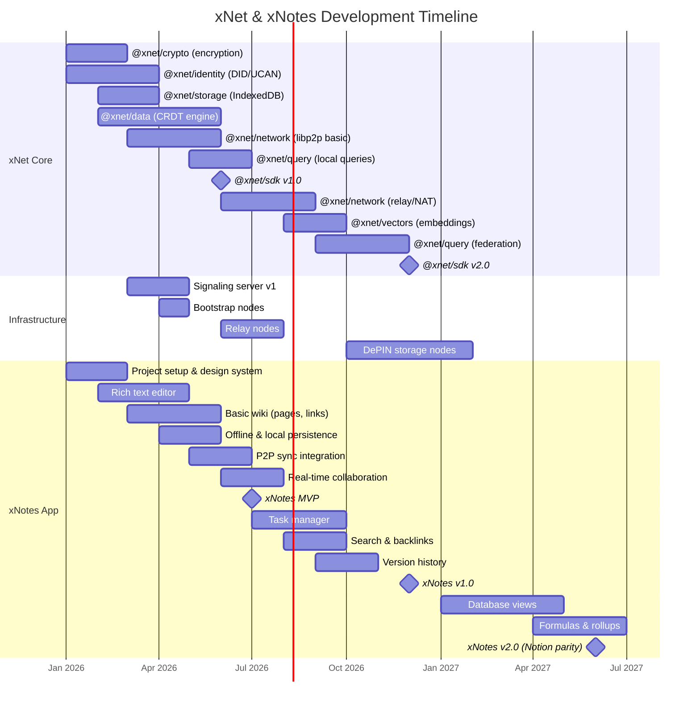
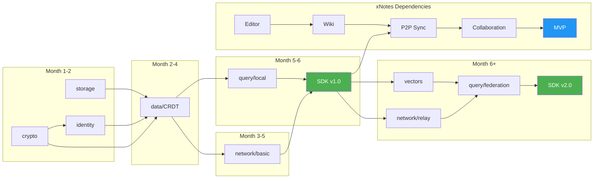
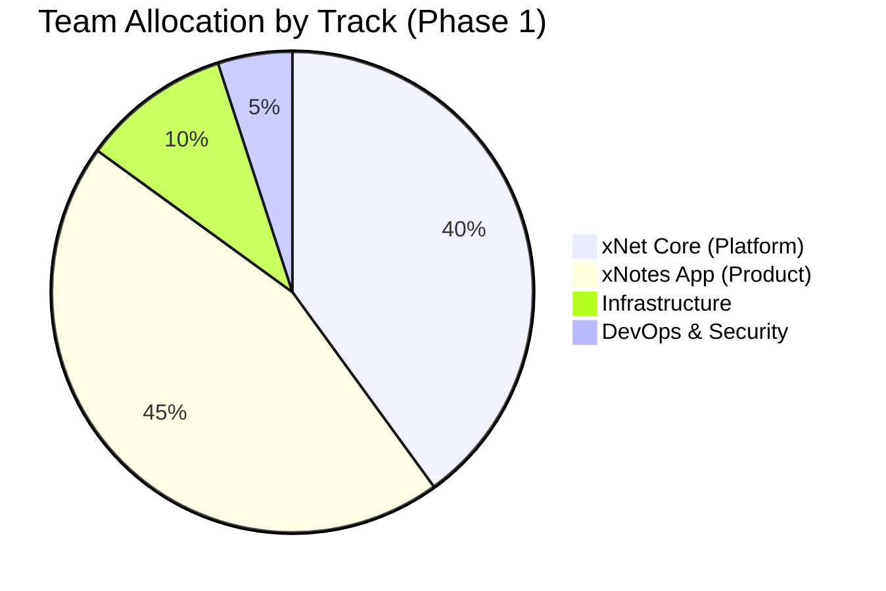

# 02: Development Timeline

> Parallel development tracks, dependencies, and milestones

[← Back to Plan Overview](./README.md) | [Previous: xNet Core Platform](./01-xnet-core-platform.md)

---

## Overview

xNet and xNotes are developed in parallel with carefully mapped dependencies. The xNet SDK provides the foundation, while xNotes drives requirements and validates capabilities.

---

## Parallel Development Tracks

---

## Dependency Map

Understanding dependencies is critical for parallel development. Teams can work simultaneously, but integration points must be coordinated.

### Dependency Rules

1. **@xnet/crypto** has no dependencies - start immediately
2. **@xnet/identity** depends on crypto for key operations
3. **@xnet/data** depends on crypto, identity, and storage
4. **@xnet/network** depends on data for sync protocol
5. **@xnet/query** depends on data for local indexing
6. **@xnet/sdk** bundles everything for v1.0 release

---

## Team Allocation

| Track | Engineers | Focus |
|-------|-----------|-------|
| **xNet Core** | 3-4 | SDK packages, protocols, cryptography |
| **xNotes App** | 4-5 | UI components, features, UX |
| **Infrastructure** | 1 | Signaling, relay, bootstrap nodes |
| **DevOps/Security** | 1 | CI/CD, audits, monitoring |

### Team Structure by Phase

| Phase | Total Team | xNet | xNotes | Infra | DevOps |
|-------|------------|------|--------|-------|--------|
| 1 (0-12 mo) | 8-10 | 3-4 | 4-5 | 1 | 1 |
| 2 (12-24 mo) | 12-15 | 3-4 | 7-9 | 1 | 1 |
| 3 (24+ mo) | 20+ | 5+ | 12+ | 2 | 2 |

---

## Integration Milestones

Critical checkpoints where xNet capabilities enable xNotes features.

| Milestone | xNet Dependency | xNotes Feature | Target |
|-----------|-----------------|----------------|--------|
| **M1** | @xnet/storage | Offline persistence | Month 3 |
| **M2** | @xnet/data | CRDT-based documents | Month 4 |
| **M3** | @xnet/identity | User accounts, workspaces | Month 4 |
| **M4** | @xnet/network | P2P document sync | Month 5 |
| **M5** | @xnet/crypto | E2E encryption | Month 6 |
| **M6** | @xnet/sdk v1.0 | **xNotes MVP** | Month 7 |
| **M7** | @xnet/query | Full-text search | Month 8 |
| **M8** | @xnet/vectors | Semantic search | Month 10 |
| **M9** | @xnet/sdk v2.0 | **xNotes v1.0** | Month 12 |

---

## Sprint Breakdown (Phase 1)

2-week sprint cadence with clear deliverables.

### xNet Core Sprints

| Sprint | Duration | Package | Deliverable |
|--------|----------|---------|-------------|
| 1-2 | Weeks 1-4 | @xnet/crypto | Symmetric/asymmetric encryption, signing |
| 3-4 | Weeks 5-8 | @xnet/identity | DID generation, key management |
| 5-6 | Weeks 9-12 | @xnet/storage | IndexedDB adapter, blob storage |
| 7-10 | Weeks 13-20 | @xnet/data | CRDT engine, schema validation |
| 11-14 | Weeks 21-28 | @xnet/network | libp2p node, WebRTC transport |
| 15-16 | Weeks 29-32 | @xnet/query | Local query engine, FTS |
| 17-18 | Weeks 33-36 | @xnet/sdk | SDK v1.0 integration |

### xNotes App Sprints

| Sprint | Duration | Feature | Deliverable |
|--------|----------|---------|-------------|
| 1-2 | Weeks 1-4 | Setup | Project structure, design system |
| 3-5 | Weeks 5-10 | Editor | Rich text with Tiptap, markdown |
| 6-8 | Weeks 11-16 | Wiki | Page hierarchy, wikilinks, backlinks |
| 9-10 | Weeks 17-20 | Offline | Local persistence integration |
| 11-12 | Weeks 21-24 | Sync | P2P sync integration |
| 13-14 | Weeks 25-28 | Collab | Real-time collaboration, presence |
| - | Week 28 | **MVP** | Internal release |
| 15-17 | Weeks 29-34 | Tasks | Task manager, Kanban boards |
| 18-19 | Weeks 35-38 | Search | Full-text search, backlinks panel |
| 20-22 | Weeks 39-44 | History | Version history, restore |
| 23-24 | Weeks 45-48 | Polish | Bug fixes, performance, testing |
| - | Week 48 | **v1.0** | Public release |

---

## Infrastructure Timeline

| Component | Start | Duration | Priority |
|-----------|-------|----------|----------|
| Signaling Server v1 | Month 3 | 2 months | Critical (P0) |
| Bootstrap Nodes | Month 4 | 1 month | Critical (P0) |
| Relay Nodes | Month 6 | 2 months | High (P1) |
| DePIN Storage | Month 10 | 4 months | Medium (P2) |

### Signaling Server Requirements

- **Scale**: 10k concurrent connections initially
- **Redundancy**: 3 geographic regions
- **Protocol**: WebSocket with fallback to HTTP long-polling
- **Monitoring**: Connection metrics, latency tracking

---

## Risk Checkpoints

| Month | Checkpoint | Risk Assessment |
|-------|------------|-----------------|
| 2 | Crypto + Identity | Can we generate/manage keys securely? |
| 4 | CRDT Engine | Does Yjs meet our performance needs? |
| 5 | P2P Networking | Can we establish connections reliably? |
| 6 | SDK v1.0 | Is the API usable for xNotes? |
| 7 | MVP | Does the core experience work offline? |
| 10 | Sync at Scale | How does P2P perform with 10+ peers? |
| 12 | v1.0 Release | Are we production-ready? |

---

## Next Steps

- [Phase 1: Wiki & Tasks](./03-phase-1-wiki-tasks.md) - Detailed Phase 1 implementation
- [Engineering Practices](./06-engineering-practices.md) - Sprint processes and CI/CD

---

[← Previous: xNet Core Platform](./01-xnet-core-platform.md) | [Next: Phase 1 →](./03-phase-1-wiki-tasks.md)
