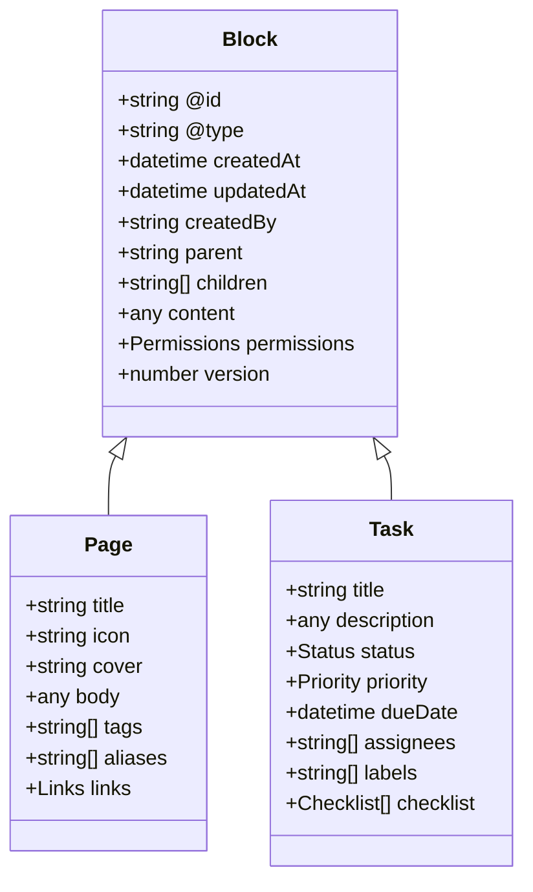
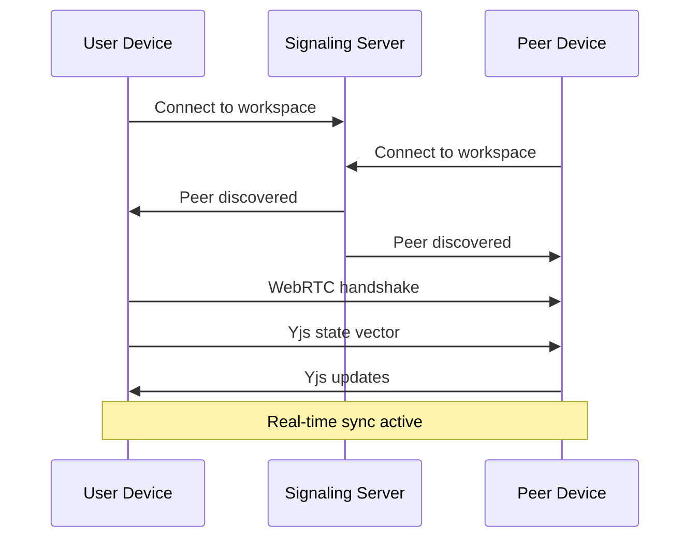

# 03: Phase 1 - Wiki & Task Manager

> Core productivity features (Months 0-12)

[← Back to Plan Overview](./README.md) | [Previous: Development Timeline](./02-development-timeline.md)

---

## Overview

Phase 1 delivers the core xNet MVP: a decentralized wiki with real-time collaboration and a task manager with Kanban boards. This phase validates xNet's capabilities and establishes product-market fit.

**Goal**: 50,000 Monthly Active Users

---

## Feature Specifications

### Wiki Module

#### User Stories

| ID | Story |
|----|-------|
| US-1.1 | As a user, I can create hierarchical pages with rich text content |
| US-1.2 | As a user, I can link between pages using `[[wikilinks]]` syntax |
| US-1.3 | As a user, I can see all backlinks to the current page |
| US-1.4 | As a user, I can search across all my pages with full-text search |
| US-1.5 | As a user, I can embed content from other pages |
| US-1.6 | As a user, I can view version history and restore previous versions |
| US-1.7 | As a collaborator, I can see real-time edits from other users |
| US-1.8 | As a user, I can work offline and sync when reconnected |

#### Feature Matrix

| Feature | Priority | Complexity | Sprint |
|---------|----------|------------|--------|
| Rich text editor with markdown | P0 | High | 1-3 |
| Page hierarchy (tree view) | P0 | Medium | 2-3 |
| Wikilinks with autocomplete | P0 | Medium | 4 |
| Backlinks panel | P1 | Low | 5 |
| Full-text search | P0 | High | 4-5 |
| Page embeds/transclusion | P1 | Medium | 6 |
| Version history | P1 | High | 7-8 |
| Real-time collaboration | P0 | Very High | 3-6 |
| Offline support | P0 | High | 2-4 |
| Export (Markdown, HTML, PDF) | P2 | Low | 9 |

---

### Task Manager Module

#### User Stories

| ID | Story |
|----|-------|
| US-2.1 | As a user, I can create tasks with titles, descriptions, due dates |
| US-2.2 | As a user, I can organize tasks into projects and lists |
| US-2.3 | As a user, I can view tasks in Kanban board view |
| US-2.4 | As a user, I can view tasks in calendar view |
| US-2.5 | As a user, I can assign tasks to collaborators |
| US-2.6 | As a user, I can set task priorities and labels |
| US-2.7 | As a user, I can create subtasks and checklists |
| US-2.8 | As a user, I can link tasks to wiki pages |
| US-2.9 | As a user, I can receive reminders for due tasks |

#### Feature Matrix

| Feature | Priority | Complexity | Sprint |
|---------|----------|------------|--------|
| Task CRUD with properties | P0 | Medium | 5-6 |
| Project/list organization | P0 | Medium | 6 |
| Kanban board view | P0 | High | 7-8 |
| List view with sorting/filtering | P0 | Medium | 7 |
| Calendar view | P1 | High | 9-10 |
| Task assignments | P1 | Medium | 8 |
| Labels and priorities | P0 | Low | 6 |
| Subtasks/checklists | P1 | Medium | 9 |
| Wiki page linking | P1 | Low | 8 |
| Local notifications/reminders | P2 | Medium | 11 |

---

### Collaboration Features

#### User Stories

| ID | Story |
|----|-------|
| US-3.1 | As a user, I can create a workspace and invite collaborators via link/key |
| US-3.2 | As a collaborator, I can join a workspace using an invite |
| US-3.3 | As a workspace admin, I can manage member permissions |
| US-3.4 | As a user, I can see presence indicators (who's online) |
| US-3.5 | As a user, I can see cursors of collaborators in real-time |
| US-3.6 | As a user, all my data is end-to-end encrypted |

---

## Technical Architecture

### Project Structure

```
xnet/
├── packages/
│   ├── core/                    # Shared data models, utilities
│   │   └── src/
│   │       ├── schema/          # JSON-LD schemas
│   │       ├── crdt/            # Yjs document bindings
│   │       ├── crypto/          # Encryption utilities
│   │       ├── search/          # Lunr.js integration
│   │       └── types/           # TypeScript types
│   │
│   ├── network/                 # P2P networking layer
│   │   └── src/
│   │       ├── libp2p/          # libp2p node configuration
│   │       ├── sync/            # Sync protocols
│   │       ├── discovery/       # Peer discovery
│   │       └── signaling/       # WebRTC signaling
│   │
│   ├── storage/                 # Persistence layer
│   │   └── src/
│   │       ├── indexeddb/       # IndexedDB adapter
│   │       ├── blob/            # Binary blob storage
│   │       └── backup/          # Export/import
│   │
│   ├── editor/                  # Rich text editor
│   │   └── src/
│   │       ├── extensions/      # Tiptap extensions
│   │       ├── components/      # Editor UI components
│   │       └── collaboration/   # Real-time collab bindings
│   │
│   ├── ui/                      # Design system
│   │   └── src/
│   │       ├── primitives/      # Base components
│   │       ├── patterns/        # Composite components
│   │       └── theme/           # Theme tokens
│   │
│   └── app/                     # Main application
│       └── src/
│           ├── features/        # Feature modules
│           │   ├── wiki/
│           │   ├── tasks/
│           │   ├── workspace/
│           │   └── settings/
│           ├── stores/          # Zustand stores
│           ├── hooks/           # React hooks
│           └── routes/          # Routing
│
├── apps/
│   ├── web/                     # PWA build
│   ├── desktop/                 # Tauri/Electron
│   └── mobile/                  # React Native (future)
│
├── tools/
│   ├── scripts/                 # Build scripts
│   └── generators/              # Code generators
│
├── turbo.json                   # Turborepo config
└── pnpm-workspace.yaml
```

### Data Model

All content in xNet is represented as **Blocks** using JSON-LD schemas:



**See**: [Appendix: Code Samples](./08-appendix-code-samples.md#block-schema) for full schema implementation.

---

## Key Technical Components

### 1. Rich Text Editor (Tiptap + Yjs)

| Component | Technology | Purpose |
|-----------|------------|---------|
| Editor Core | Tiptap 2.x | ProseMirror wrapper |
| CRDT Binding | y-prosemirror | Real-time sync |
| Wikilinks | Custom Extension | `[[page]]` syntax |
| Slash Commands | Custom Extension | `/` menu |

**See**: [Appendix: Code Samples](./08-appendix-code-samples.md#tiptap-wikilink-extension)

### 2. P2P Sync (libp2p + y-webrtc)



**See**: [Appendix: Code Samples](./08-appendix-code-samples.md#libp2p-configuration)

### 3. Full-Text Search (Lunr.js)

| Feature | Implementation |
|---------|----------------|
| Indexing | Background worker |
| Tokenization | Porter stemmer |
| Ranking | TF-IDF |
| Fields | Title (10x), body (5x), tags (3x) |

**See**: [Appendix: Code Samples](./08-appendix-code-samples.md#search-index)

### 4. Encryption (libsodium)

| Layer | Algorithm | Purpose |
|-------|-----------|---------|
| Identity | Ed25519 | Key pairs, signing |
| Key Exchange | X25519 | Workspace key sharing |
| Workspace Data | AES-256-GCM | Document encryption |

**See**: [Appendix: Code Samples](./08-appendix-code-samples.md#encryption-layer)

---

## Development Workflow

### Sprint Structure (2-week sprints)

| Sprint | Weeks | Focus |
|--------|-------|-------|
| 1-2 | 1-4 | Project setup, design system, core data model |
| 3-4 | 5-8 | Basic editor with persistence, offline support |
| 5-6 | 9-12 | P2P sync foundation, real-time collaboration |
| 7-8 | 13-16 | Wiki features (links, backlinks, hierarchy) |
| 9-10 | 17-20 | Task manager core (CRUD, views) |
| 11-12 | 21-24 | Kanban board, search integration |
| 13-14 | 25-28 | Calendar view, assignments, permissions |
| 15-16 | 29-32 | Version history, export, polish |
| 17-18 | 33-36 | Security audit, performance optimization |
| 19-20 | 37-40 | Beta testing, bug fixes |
| 21-22 | 41-44 | Launch preparation, documentation |
| 23-24 | 45-48 | Public release, monitoring |

### Testing Strategy

| Type | Tools | Coverage Target |
|------|-------|-----------------|
| Unit Tests | Vitest | 80% |
| Integration Tests | Vitest | Key flows |
| E2E Tests | Playwright | Critical paths |
| P2P Simulation | Custom harness | Sync scenarios |

**See**: [Engineering Practices](./06-engineering-practices.md#testing-strategy)

---

## Risks and Mitigations

| Risk | Probability | Impact | Mitigation |
|------|-------------|--------|------------|
| P2P performance issues at scale | High | High | Implement relay fallback, optimize gossip protocol |
| WebRTC connection failures | Medium | Medium | Multiple STUN/TURN servers, WebSocket fallback |
| CRDT merge edge cases | Medium | High | Extensive testing, formal verification |
| Browser storage limits | Medium | Medium | Blob offloading, compression, pruning |
| User onboarding complexity | High | High | Progressive disclosure, guided tutorials |
| Discoverability (no central index) | High | Medium | Optional public directory, workspace discovery |

---

## Deliverables

### MVP (Month 7)

- [ ] Rich text wiki with page hierarchy
- [ ] Wikilinks and backlinks
- [ ] Basic full-text search
- [ ] Offline support
- [ ] P2P sync between devices
- [ ] Real-time collaboration (cursors, presence)
- [ ] E2E encryption

### v1.0 (Month 12)

- [ ] All MVP features, polished
- [ ] Task manager with Kanban/list views
- [ ] Calendar view
- [ ] Version history
- [ ] Advanced search
- [ ] Export/import
- [ ] Desktop app (Tauri)

---

## Next Steps

- [Phase 2: Database UI](./04-phase-2-database-ui.md) - Notion-like databases
- [Appendix: Code Samples](./08-appendix-code-samples.md) - Implementation details

---

[← Previous: Development Timeline](./02-development-timeline.md) | [Next: Phase 2 →](./04-phase-2-database-ui.md)
