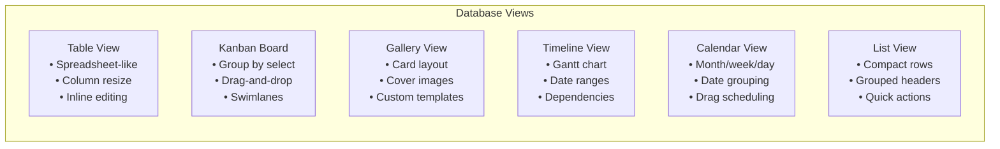
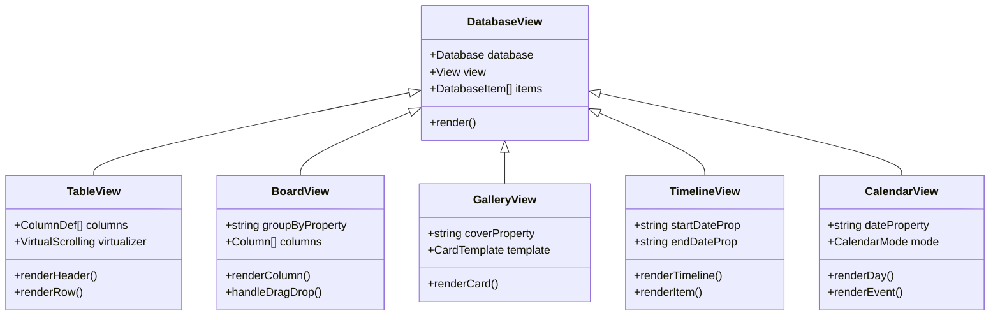
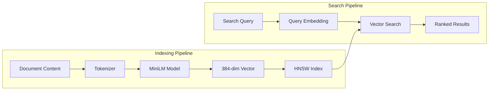

# 04: Phase 2 - Database UI

> Notion-like database platform (Months 12-24)

[← Back to Plan Overview](./README.md) | [Previous: Phase 1](./03-phase-1-wiki-tasks.md)

---

## Overview

Phase 2 transforms xNotes from a wiki/task manager into a full-featured database platform comparable to Notion. Users can create custom databases with various property types, multiple views, formulas, and relations.

**Goal**: 100,000 Daily Active Users

---

## Feature Specifications

### Database Module

#### User Stories

| ID | Story |
|----|-------|
| US-4.1 | As a user, I can create a database with custom properties (columns) |
| US-4.2 | As a user, I can add properties of various types (text, number, date, select, multi-select, person, relation, formula, rollup) |
| US-4.3 | As a user, I can view my database as a table |
| US-4.4 | As a user, I can view my database as a Kanban board grouped by a select property |
| US-4.5 | As a user, I can view my database as a gallery with card previews |
| US-4.6 | As a user, I can view my database as a timeline/Gantt chart |
| US-4.7 | As a user, I can view my database as a calendar by date property |
| US-4.8 | As a user, I can create formulas to compute values from other properties |
| US-4.9 | As a user, I can create rollup properties to aggregate related data |
| US-4.10 | As a user, I can filter and sort any view by properties |
| US-4.11 | As a user, I can create multiple views of the same database |
| US-4.12 | As a user, I can link databases together with relation properties |

---

### Property Types

| Type | Storage | Validation | Display |
|------|---------|------------|---------|
| Text | string | length limit | Inline editor |
| Number | number | min/max, format | Formatted display |
| Date | ISO string | range | Date picker |
| Date Range | [start, end] | start < end | Range picker |
| Select | string (option ID) | from options | Dropdown |
| Multi-Select | string[] | from options | Tag chips |
| Person | DID | workspace member | Avatar + name |
| Checkbox | boolean | - | Toggle |
| URL | string | URL validation | Link |
| Email | string | email validation | Mailto link |
| Phone | string | phone validation | Tel link |
| File | blob reference | size limit | File preview |
| Relation | block ID[] | valid blocks | Linked items |
| Formula | expression | syntax valid | Computed value |
| Rollup | aggregate config | valid relation | Aggregated value |
| Created Time | auto | - | Read-only |
| Last Edited | auto | - | Read-only |
| Created By | auto DID | - | Read-only |

---

### View Types



---

## Technical Implementation

### Database Schema Extension

**See**: [Appendix: Code Samples](./08-appendix-code-samples.md#database-schema) for full implementation.

```typescript
// Property definition with discriminated union
export const PropertyDefinitionSchema = z.discriminatedUnion('type', [
  z.object({ type: z.literal('text'), config: z.object({ maxLength: z.number().optional() }) }),
  z.object({ type: z.literal('number'), config: z.object({ format: z.enum(['number', 'percent', 'currency', 'progress']) }) }),
  z.object({ type: z.literal('select'), config: z.object({ options: z.array(SelectOption) }) }),
  z.object({ type: z.literal('relation'), config: z.object({ targetDatabaseId: z.string().uuid() }) }),
  z.object({ type: z.literal('formula'), config: z.object({ expression: z.string(), returnType: FormulaReturnType }) }),
  z.object({ type: z.literal('rollup'), config: z.object({ relationPropertyId: z.string().uuid(), aggregation: AggregationType }) }),
  // ... other types
]);

// View configuration
export const ViewSchema = z.object({
  id: z.string().uuid(),
  name: z.string(),
  type: z.enum(['table', 'board', 'gallery', 'timeline', 'calendar', 'list']),
  properties: z.array(ViewProperty),
  filter: FilterSchema.optional(),
  sorts: z.array(SortSchema),
  config: z.record(z.any()), // type-specific config
});
```

---

### Formula Engine

The formula engine supports Notion-compatible expressions with:

| Category | Functions |
|----------|-----------|
| **Math** | `abs`, `ceil`, `floor`, `round`, `min`, `max`, `sum` |
| **String** | `concat`, `lower`, `upper`, `length`, `contains`, `replace`, `slice` |
| **Date** | `now`, `today`, `dateAdd`, `dateBetween`, `formatDate` |
| **Logic** | `if`, `and`, `or`, `not`, `empty` |
| **Type** | `toNumber`, `toString` |

**Example formulas:**

```
// Weighted value calculation
prop("value") * prop("probability") / 100

// Days until due
dateBetween(prop("dueDate"), now(), "days")

// Status indicator
if(prop("progress") >= 100, "Complete", if(prop("progress") > 0, "In Progress", "Not Started"))
```

**See**: [Appendix: Code Samples](./08-appendix-code-samples.md#formula-engine) for tokenizer, parser, and evaluator.

---

### Database View Components



**See**: [Appendix: Code Samples](./08-appendix-code-samples.md#table-view-component) for React implementation with TanStack Table and virtual scrolling.

---

## Vector Database Integration

For semantic search capabilities, Phase 2 introduces on-device vector embeddings.



| Feature | Implementation |
|---------|----------------|
| Vector Index | HNSW algorithm (hierarchical navigable small world) |
| Embeddings | TensorFlow.js with MiniLM (384 dimensions) |
| Similarity | Cosine distance |
| Persistence | Serializable to IndexedDB |

**See**: [Appendix: Code Samples](./08-appendix-code-samples.md#vector-index) for VectorIndex and EmbeddingModel classes.

---

## Sprint Plan

| Sprint | Weeks | Focus | Deliverables |
|--------|-------|-------|--------------|
| 25-26 | 49-52 | Database schema | Property type system, schema design |
| 27-28 | 1-4 | Table view | TanStack Table, virtual scrolling |
| 29-30 | 5-8 | Property editors | Date picker, select, relation editors |
| 31-32 | 9-12 | Filter/sort | Filter builder, sort system |
| 33-34 | 13-16 | Kanban board | Database-backed board view |
| 35-36 | 17-20 | Gallery view | Card templates, cover images |
| 37-38 | 21-24 | Timeline view | Gantt chart, dependencies |
| 39-40 | 25-28 | Calendar view | Database-backed calendar |
| 41-42 | 29-32 | Formula engine | Expression parser, functions |
| 43-44 | 33-36 | Rollups/relations | Cross-database linking |
| 45-46 | 37-40 | Vector search | HNSW index, embeddings |
| 47-48 | 41-44 | Performance | Caching, optimization |

---

## Feature Matrix

| Feature | Priority | Complexity | Sprint |
|---------|----------|------------|--------|
| Property type system | P0 | High | 25-26 |
| Table view with virtual scroll | P0 | High | 27-28 |
| Inline property editing | P0 | Medium | 29-30 |
| Filter builder | P0 | Medium | 31-32 |
| Sort system | P0 | Low | 31-32 |
| Kanban board view | P0 | High | 33-34 |
| Gallery view | P1 | Medium | 35-36 |
| Timeline/Gantt view | P1 | High | 37-38 |
| Calendar view | P1 | High | 39-40 |
| Formula engine | P0 | Very High | 41-42 |
| Rollup properties | P1 | High | 43-44 |
| Relation properties | P0 | High | 43-44 |
| Vector search | P2 | High | 45-46 |

---

## Risks and Mitigations

| Risk | Probability | Impact | Mitigation |
|------|-------------|--------|------------|
| Formula engine complexity | Medium | High | Start with subset of Notion functions, expand over time |
| Performance with large datasets | High | High | Virtual scrolling, pagination, computed view caching |
| CRDT merge conflicts in relations | Medium | Medium | Careful schema design, last-write-wins for simple cases |
| View state sync across devices | Medium | Medium | Store view config in CRDT, per-device overrides |

---

## Deliverables

### v1.5 (Month 18)

- [ ] All property types implemented
- [ ] Table view with filtering/sorting
- [ ] Kanban board view
- [ ] Basic formula support

### v2.0 (Month 24)

- [ ] All view types (gallery, timeline, calendar)
- [ ] Full formula engine with all functions
- [ ] Rollups and cross-database relations
- [ ] Vector-based semantic search
- [ ] View templates and sharing

---

## Next Steps

- [Phase 3: ERP Platform](./05-phase-3-erp.md) - Module system, workflows, enterprise
- [Appendix: Code Samples](./08-appendix-code-samples.md) - Full implementations

---

[← Previous: Phase 1](./03-phase-1-wiki-tasks.md) | [Next: Phase 3 →](./05-phase-3-erp.md)
