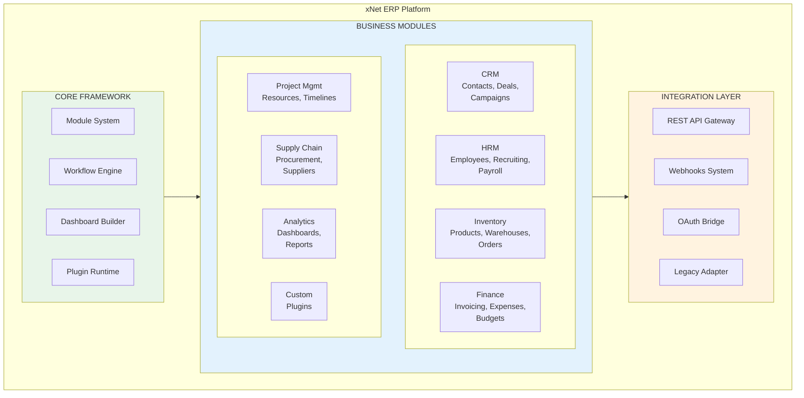
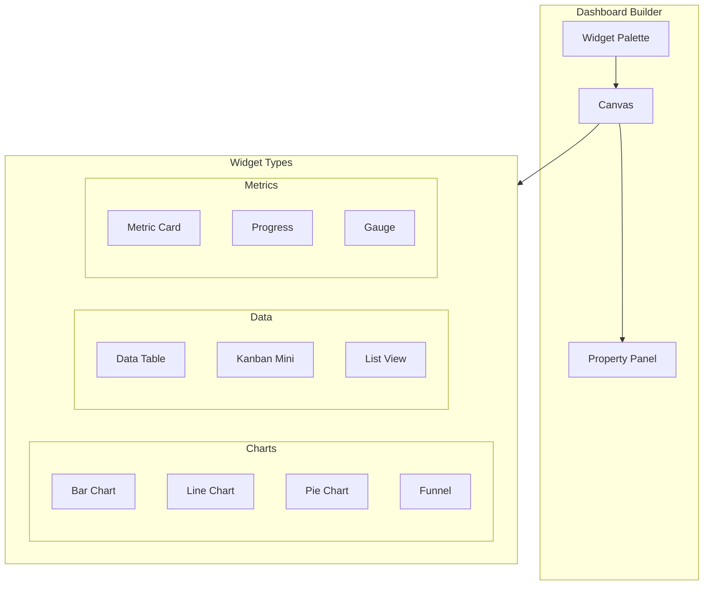
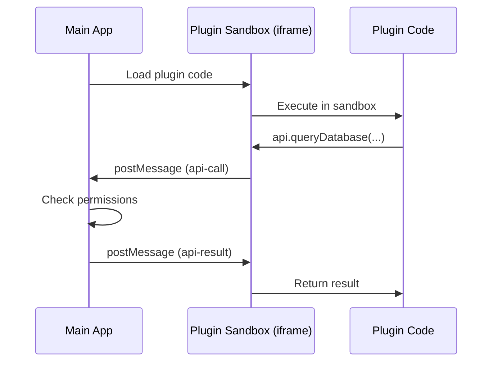

# 05: Phase 3 - ERP Platform

> Open-source enterprise resource planning (Months 24+)

[← Back to Plan Overview](./README.md) | [Previous: Phase 2](./04-phase-2-database-ui.md)

---

## Overview

Phase 3 evolves xNet into a fully customizable ERP platform, similar to Tesla's Warp Drive. The modular architecture allows businesses to build complete operational systems using the database and workflow foundations from Phase 2.

**Goal**: 500+ Enterprise Deployments

---

## Module Architecture



---

## Module System

### Module Definition Interface

Each module is self-contained with:
- Data model extensions (databases, relations)
- UI components (pages, widgets, actions)
- Workflows and automations
- API extensions
- Permissions and settings

```typescript
export interface ModuleDefinition {
  id: string;
  name: string;
  version: string;
  description: string;
  author: string;
  license: string;

  // Dependencies
  dependencies: {
    core: string;          // Minimum core version
    modules: string[];     // Other required modules
    libraries: Record<string, string>;
  };

  // Data model extensions
  schema: {
    databases: DatabaseTemplate[];
    relations: RelationTemplate[];
  };

  // UI components
  components: {
    pages: PageComponent[];
    widgets: WidgetComponent[];
    actions: ActionComponent[];
  };

  // Workflows and automations
  workflows: WorkflowTemplate[];

  // Lifecycle hooks
  hooks: {
    onInstall?: () => Promise<void>;
    onUninstall?: () => Promise<void>;
    onUpgrade?: (fromVersion: string) => Promise<void>;
  };
}
```

**See**: [Appendix: Code Samples](./08-appendix-code-samples.md#crm-module) for full CRM module example.

---

### Built-in Modules

| Module | Databases | Key Features |
|--------|-----------|--------------|
| **CRM** | Contacts, Companies, Deals | Pipeline view, Deal funnel, Email integration |
| **HRM** | Employees, Candidates, Timesheets | Recruiting workflow, Payroll, Leave management |
| **Inventory** | Products, Warehouses, Stock Movements | Barcode scanning, Reorder alerts, Location tracking |
| **Finance** | Invoices, Expenses, Budgets | Payment tracking, Reconciliation, Tax reports |
| **Project Management** | Projects, Tasks, Resources | Resource allocation, Gantt charts, Time tracking |
| **Supply Chain** | Suppliers, Purchase Orders, Shipments | Vendor management, Order tracking, Cost analysis |

---

## Workflow Engine

The workflow engine enables no-code automation of business processes.

### Workflow Components

```mermaid
flowchart LR
    subgraph Triggers["TRIGGERS"]
        Manual[Manual]
        Schedule[Schedule]
        PropChange[Property Change]
        RecordCreate[Record Create]
        Webhook[Webhook]
    end

    subgraph Conditions["CONDITIONS"]
        If["If/Else"]
        Filter[Filter]
        Switch[Switch]
    end

    subgraph Actions["ACTIONS"]
        UpdateRecord[Update Record]
        CreateRecord[Create Record]
        SendEmail[Send Email]
        Notification[Notification]
        CallAPI[Call Webhook]
        RunScript[Run Script]
    end

    Triggers --> Conditions
    Conditions --> Actions
```



### Workflow Definition

```typescript
export interface WorkflowDefinition {
  id: string;
  name: string;
  enabled: boolean;
  trigger: WorkflowTrigger;
  conditions?: WorkflowCondition[];
  actions: WorkflowAction[];
}

// Example: Deal stage notification
const dealStageWorkflow: WorkflowDefinition = {
  id: 'deal-stage-notification',
  name: 'Deal Stage Change Notification',
  enabled: true,
  trigger: {
    type: 'property_change',
    config: { database: 'deals', property: 'stage' }
  },
  actions: [
    {
      type: 'send_notification',
      config: {
        to: '{{owner}}',
        title: 'Deal moved to {{stage}}',
        body: '{{name}} has moved to {{stage}}'
      }
    }
  ]
};
```

### Template Resolution

Workflows support `{{property}}` syntax for dynamic values:

```typescript
// Input template
"Deal {{name}} worth {{value}} moved to {{stage}}"

// With context { name: "Acme Corp", value: "$50,000", stage: "Negotiation" }
// Output
"Deal Acme Corp worth $50,000 moved to Negotiation"
```

### Sandboxed Script Execution

For advanced automation, workflows can run custom JavaScript in a sandboxed Web Worker:

```typescript
// Script has access to:
// - context: trigger data and previous action outputs
// - api.log(): logging
// - api.setOutput(key, value): set output for next action

const result = context.value * context.quantity;
api.setOutput('total', result);
api.log('Calculated total:', result);
```

**See**: [Appendix: Code Samples](./08-appendix-code-samples.md#workflow-engine) for full WorkflowEngine implementation.

---

## Dashboard Builder

Drag-and-drop dashboard creation with configurable widgets.



### Built-in Widgets

| Widget | Category | Default Size | Use Case |
|--------|----------|--------------|----------|
| Metric | Metrics | 2x1 | Single KPI display |
| Bar Chart | Charts | 4x3 | Categorical comparisons |
| Line Chart | Charts | 4x3 | Trends over time |
| Pie Chart | Charts | 3x3 | Proportions |
| Data Table | Data | 6x4 | Record listing |
| Kanban Mini | Data | 6x4 | Status overview |

**See**: [Appendix: Code Samples](./08-appendix-code-samples.md#dashboard-builder) for DashboardBuilder component.

---

## Plugin System

Third-party developers can extend xNet with plugins.

### Plugin Manifest

```typescript
export interface PluginManifest {
  id: string;
  name: string;
  version: string;

  // Entry points
  main: string;           // Main JS file
  styles?: string;        // Optional CSS

  // Capabilities requested
  permissions: PluginPermission[];

  // Extension points
  extends: {
    databases?: DatabaseExtension[];
    views?: ViewExtension[];
    actions?: ActionExtension[];
    widgets?: WidgetExtension[];
    commands?: CommandExtension[];
  };
}

type PluginPermission =
  | 'read:databases'
  | 'write:databases'
  | 'read:files'
  | 'write:files'
  | 'network'
  | 'notifications'
  | 'clipboard';
```

### Sandboxed Execution

Plugins run in sandboxed iframes with permission-based API access:



**See**: [Appendix: Code Samples](./08-appendix-code-samples.md#plugin-runtime) for PluginRuntime and sandbox implementation.

---

## Feature Priorities

| Quarter | Focus | Key Features |
|---------|-------|--------------|
| Q1 | Module Framework | Module system, CRM core, basic workflows |
| Q2 | HRM + Inventory | Employee management, product catalog, orders |
| Q3 | Finance + Analytics | Invoicing, expenses, dashboard builder |
| Q4 | Integrations + Plugins | API gateway, OAuth, plugin marketplace |
| Q5+ | Vertical Solutions | Industry-specific modules, enterprise features |

---

## Enterprise Features

| Feature | Description | Target |
|---------|-------------|--------|
| SSO Integration | SAML 2.0, OIDC support | Enterprise tier |
| Audit Logging | Comprehensive activity tracking | Enterprise tier |
| Role-Based Access | Fine-grained permissions | Team tier+ |
| Custom Branding | White-label deployment | Enterprise tier |
| Data Residency | Region-specific storage | Enterprise tier |
| SLA Support | Guaranteed uptime, priority support | Enterprise tier |
| On-Premise | Self-hosted deployment option | Enterprise tier |

---

## API Gateway

REST API for external integrations:

```
POST /api/v1/databases/{id}/items
GET  /api/v1/databases/{id}/items?filter=...&sort=...
PUT  /api/v1/databases/{id}/items/{itemId}
DELETE /api/v1/databases/{id}/items/{itemId}

POST /api/v1/workflows/{id}/trigger
GET  /api/v1/workflows/{id}/executions

POST /api/v1/webhooks
GET  /api/v1/webhooks/{id}
```

### Webhook System

```typescript
interface WebhookConfig {
  id: string;
  url: string;
  events: WebhookEvent[];
  secret: string;  // For signature verification
  enabled: boolean;
}

type WebhookEvent =
  | 'record.created'
  | 'record.updated'
  | 'record.deleted'
  | 'workflow.completed'
  | 'workflow.failed';
```

---

## Risks and Mitigations

| Risk | Probability | Impact | Mitigation |
|------|-------------|--------|------------|
| Module complexity | High | High | Clear module API boundaries, extensive documentation |
| Workflow performance | Medium | High | Async execution, rate limiting, execution quotas |
| Plugin security | High | Critical | Strict sandboxing, permission model, code review for marketplace |
| Enterprise scale | Medium | High | Sharding strategy, caching layers, CDN for static assets |

---

## Deliverables

### v2.5 (Month 30)

- [ ] Module framework with hot-loading
- [ ] CRM and HRM core modules
- [ ] Basic workflow engine
- [ ] Dashboard builder MVP

### v3.0 (Month 36)

- [ ] All business modules (Inventory, Finance, SCM)
- [ ] Full workflow engine with scripting
- [ ] Plugin system with marketplace
- [ ] API gateway and webhooks
- [ ] Enterprise SSO and audit logging

---

## Next Steps

- [Engineering Practices](./06-engineering-practices.md) - Security, testing, CI/CD
- [Monetization & Adoption](./07-monetization-adoption.md) - Revenue model, growth
- [Appendix: Code Samples](./08-appendix-code-samples.md) - Full implementations

---

[← Previous: Phase 2](./04-phase-2-database-ui.md) | [Next: Engineering Practices →](./06-engineering-practices.md)
