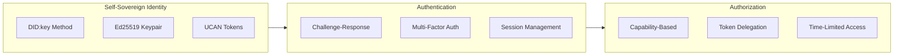
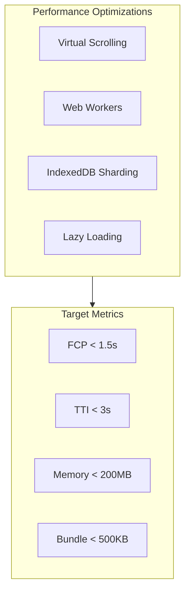
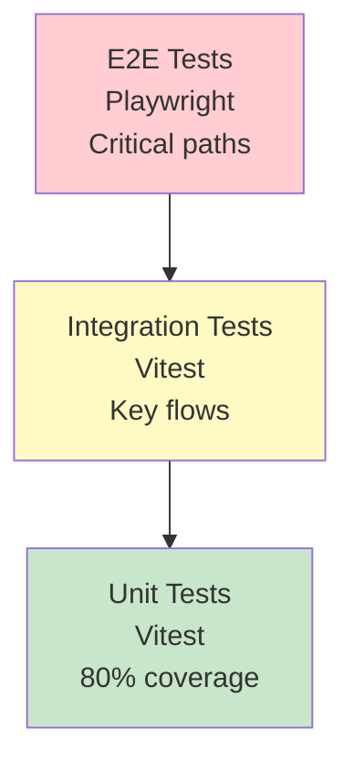
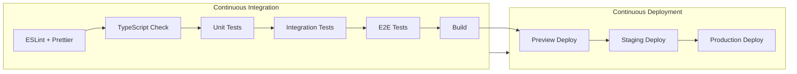
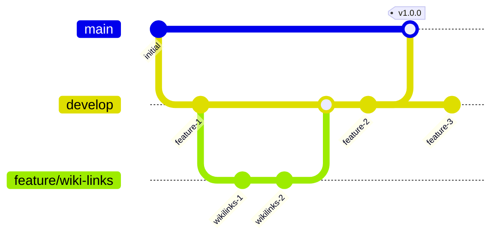

# 06: Engineering Practices

> Security, testing, CI/CD, and contribution guidelines

[← Back to Plan Overview](./README.md) | [Previous: Phase 3](./05-phase-3-erp.md)

---

## Overview

This document outlines the engineering practices, security guidelines, and development workflows for the xNet and xNotes projects.

---

## Security Guidelines

### 1. Data Security

| Layer | Implementation |
|-------|----------------|
| At Rest | AES-256-GCM encryption for all IndexedDB data |
| In Transit | TLS 1.3 for all network communication |
| Key Derivation | Argon2id for password-based keys |
| Key Storage | Browser Credential Management API |
| Key Rotation | Automatic workspace key rotation |

### 2. Authentication & Authorization



- **DIDs**: Self-sovereign identity using `did:key` method
- **UCAN**: User Controlled Authorization Networks for capability-based permissions
- **MFA**: Optional multi-factor authentication support
- **Sessions**: Secure token storage with automatic refresh

### 3. Code Security

| Practice | Implementation |
|----------|----------------|
| No eval() | Strict prohibition in main codebase |
| CSP Headers | Content Security Policy for web deployment |
| Sandboxing | iframe isolation for plugins |
| Dependency Audit | Snyk/Dependabot automated scanning |
| Input Validation | Zod schemas for all user input |

### 4. Security Audits

| Phase | Focus Areas |
|-------|-------------|
| Phase 1 | Cryptographic implementation, key management |
| Phase 2 | P2P protocol review, data integrity, CRDT security |
| Phase 3 | Plugin sandbox, workflow engine, API security |

---

## Scalability Strategies

### Client-Side Performance



| Strategy | Implementation |
|----------|----------------|
| Virtual Scrolling | TanStack Virtual for large datasets |
| Web Workers | Heavy computation offloaded |
| IndexedDB Sharding | Separate stores per workspace |
| Lazy Loading | Route-based code splitting |
| Memoization | React.memo and useMemo patterns |

### P2P Network Scalability

| Strategy | Purpose |
|----------|---------|
| Hierarchical Gossip | Super-peers for large workspaces |
| Selective Sync | Only sync what's needed |
| Delta Compression | Minimize sync message size |
| Bloom Filters | Efficient reconciliation |

### Data Model Scalability

| Strategy | Purpose |
|----------|---------|
| Pagination | Cursor-based for large collections |
| Computed Views | Cached materialized views |
| Background Indexing | Async search index updates |
| Incremental CRDTs | Efficient partial updates |

---

## Testing Strategy

### Test Pyramid



| Type | Tool | Coverage Target | Scope |
|------|------|-----------------|-------|
| Unit | Vitest | 80% | Pure functions, utilities, hooks |
| Integration | Vitest | Key flows | Store interactions, API calls |
| E2E | Playwright | Critical paths | User journeys, real browser |
| P2P Simulation | Custom harness | Sync scenarios | Multi-peer scenarios |

### Testing Patterns

```typescript
// Unit test example
describe('FormulaEngine', () => {
  it('should evaluate arithmetic expressions', () => {
    const engine = new FormulaEngine();
    const result = engine.evaluate('1 + 2 * 3', {});
    expect(result).toBe(7);
  });

  it('should resolve property references', () => {
    const context = { getProperty: (name: string) => name === 'value' ? 100 : 0 };
    const result = engine.evaluate('prop("value") * 2', context);
    expect(result).toBe(200);
  });
});

// Integration test example
describe('PageStore', () => {
  it('should sync page changes to IndexedDB', async () => {
    const store = createPageStore();
    await store.createPage({ title: 'Test' });

    // Verify persistence
    const persisted = await db.pages.get(store.pages[0].id);
    expect(persisted.title).toBe('Test');
  });
});

// E2E test example
test('user can create and edit a page', async ({ page }) => {
  await page.goto('/');
  await page.click('[data-testid="new-page"]');
  await page.fill('[data-testid="page-title"]', 'My New Page');
  await page.keyboard.press('Enter');

  await expect(page.locator('[data-testid="page-content"]')).toBeVisible();
});
```

---

## CI/CD Pipeline



### GitHub Actions Workflow

```yaml
name: CI/CD

on:
  push:
    branches: [main, develop]
  pull_request:
    branches: [main, develop]

jobs:
  lint:
    runs-on: ubuntu-latest
    steps:
      - uses: actions/checkout@v4
      - uses: pnpm/action-setup@v2
      - run: pnpm install --frozen-lockfile
      - run: pnpm lint
      - run: pnpm typecheck

  test:
    runs-on: ubuntu-latest
    needs: lint
    steps:
      - uses: actions/checkout@v4
      - uses: pnpm/action-setup@v2
      - run: pnpm install --frozen-lockfile
      - run: pnpm test:unit
      - run: pnpm test:integration

  e2e:
    runs-on: ubuntu-latest
    needs: test
    steps:
      - uses: actions/checkout@v4
      - uses: pnpm/action-setup@v2
      - run: pnpm install --frozen-lockfile
      - run: pnpm exec playwright install --with-deps
      - run: pnpm test:e2e

  build:
    runs-on: ubuntu-latest
    needs: e2e
    steps:
      - uses: actions/checkout@v4
      - uses: pnpm/action-setup@v2
      - run: pnpm install --frozen-lockfile
      - run: pnpm build
      - uses: actions/upload-artifact@v4
        with:
          name: dist
          path: dist/

  deploy-preview:
    runs-on: ubuntu-latest
    needs: build
    if: github.event_name == 'pull_request'
    steps:
      - uses: actions/download-artifact@v4
      - run: # Deploy to preview environment
```

---

## Development Setup

### Prerequisites

- Node.js 20+
- pnpm 8+
- Git

### Getting Started

```bash
# Clone the repository
git clone https://github.com/xnet/xnotes.git
cd xnotes

# Install dependencies
pnpm install

# Start development server
pnpm dev

# Run tests
pnpm test

# Build for production
pnpm build
```

### Project Scripts

| Script | Description |
|--------|-------------|
| `pnpm dev` | Start development server |
| `pnpm build` | Build for production |
| `pnpm test` | Run all tests |
| `pnpm test:unit` | Run unit tests |
| `pnpm test:e2e` | Run E2E tests |
| `pnpm lint` | Run ESLint |
| `pnpm typecheck` | Run TypeScript check |
| `pnpm format` | Format with Prettier |

---

## Contribution Guidelines

### Code of Conduct

We follow the [Contributor Covenant](https://www.contributor-covenant.org/). Be respectful and inclusive.

### Pull Request Process

1. **Fork** the repository and create a feature branch from `develop`
2. **Write tests** for new functionality
3. **Ensure** all tests pass and linting is clean
4. **Update** documentation if needed
5. **Submit** PR with clear description
6. **Address** review feedback

### Commit Messages

Follow [Conventional Commits](https://www.conventionalcommits.org/):

| Prefix | Description |
|--------|-------------|
| `feat:` | New feature |
| `fix:` | Bug fix |
| `docs:` | Documentation |
| `refactor:` | Code refactoring |
| `test:` | Adding tests |
| `chore:` | Maintenance |

Example:
```
feat(editor): add wikilink autocomplete

- Implement fuzzy search for page titles
- Add keyboard navigation in suggestions
- Show page preview on hover

Closes #123
```

### Code Style

| Rule | Enforcement |
|------|-------------|
| TypeScript strict mode | `tsconfig.json` |
| ESLint + Prettier | `.eslintrc.js`, `.prettierrc` |
| Functional components | React hooks preferred |
| Comprehensive JSDoc | Public APIs documented |

### Review Process

- Two approvals required for merge to `main`
- CI must pass
- No unresolved conversations
- Squash merge preferred

---

## Branching Strategy



| Branch | Purpose | Merge Target |
|--------|---------|--------------|
| `main` | Production-ready code | - |
| `develop` | Integration branch | `main` |
| `feature/*` | New features | `develop` |
| `fix/*` | Bug fixes | `develop` |
| `hotfix/*` | Production fixes | `main` + `develop` |

---

## Monitoring & Observability

| Tool | Purpose |
|------|---------|
| Sentry | Error tracking, crash reporting |
| Plausible | Privacy-friendly analytics |
| Custom | P2P connection metrics |
| Prometheus | Infrastructure monitoring |

### Key Metrics

| Metric | Target |
|--------|--------|
| Error rate | < 0.1% |
| P95 latency | < 200ms |
| Sync success rate | > 99% |
| Uptime | 99.9% |

---

## Next Steps

- [Monetization & Adoption](./07-monetization-adoption.md) - Revenue model, growth strategy
- [Appendix: Code Samples](./08-appendix-code-samples.md) - Reference implementations

---

[← Previous: Phase 3](./05-phase-3-erp.md) | [Next: Monetization →](./07-monetization-adoption.md)
