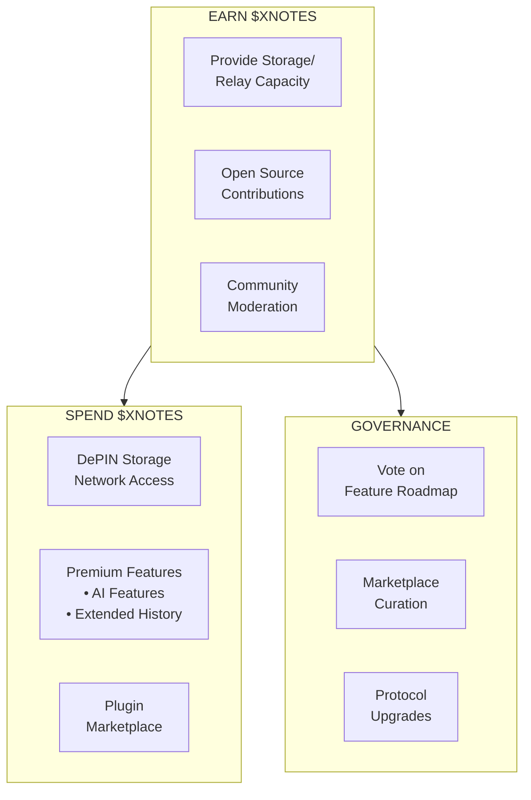
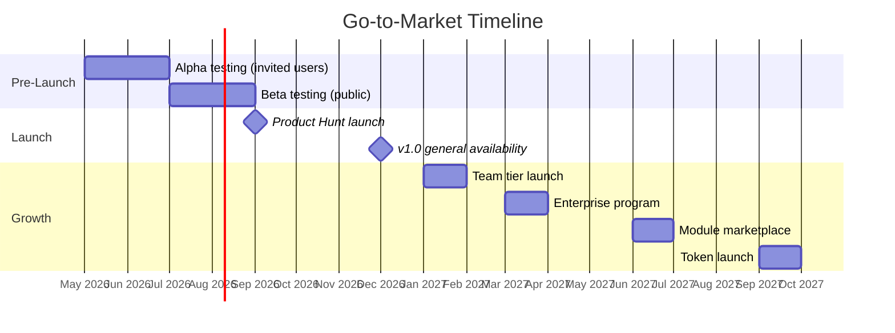

# 07: Monetization & Adoption Strategy

> Revenue model, token economics, and growth strategy

[← Back to Plan Overview](./README.md) | [Previous: Engineering Practices](./06-engineering-practices.md)

---

## Overview

xNet follows a freemium model with optional token economics for the broader xNet ecosystem. The strategy balances open-source principles with sustainable revenue generation.

---

## Revenue Model

### Pricing Tiers

| Tier | Price | Features |
|------|-------|----------|
| **Free (Core)** | $0 | Full app, local storage, P2P sync (3 users) |
| **Team** | $8/user/mo | Unlimited workspace members, priority signaling |
| **Enterprise** | Custom | SLA, dedicated support, on-premise, custom modules |

### Feature Comparison

| Feature | Free | Team | Enterprise |
|---------|------|------|------------|
| Wiki & Pages | ✓ | ✓ | ✓ |
| Task Manager | ✓ | ✓ | ✓ |
| Databases | ✓ | ✓ | ✓ |
| P2P Sync | 3 users | Unlimited | Unlimited |
| Offline Support | ✓ | ✓ | ✓ |
| E2E Encryption | ✓ | ✓ | ✓ |
| Priority Signaling | - | ✓ | ✓ |
| Admin Console | - | ✓ | ✓ |
| SSO/SAML | - | - | ✓ |
| Audit Logs | - | - | ✓ |
| SLA | - | - | ✓ |
| On-Premise | - | - | ✓ |
| Custom Modules | - | - | ✓ |
| Dedicated Support | - | - | ✓ |

---

## Token Economics (Future)

### Token Utility

| Use Case | Description |
|----------|-------------|
| **Storage Incentives** | Earn tokens by providing storage/relay capacity |
| **Premium Features** | Spend tokens for AI features, extended versioning |
| **Marketplace** | Buy/sell plugins, templates, professional services |
| **Governance** | Vote on roadmap, curation, protocol upgrades |

### Token Distribution

| Allocation | Percentage | Vesting |
|------------|------------|---------|
| Community & Ecosystem | 40% | 4 years |
| Team & Advisors | 20% | 4 years, 1 year cliff |
| Treasury | 20% | Governance-controlled |
| Early Supporters | 15% | 2 years |
| Liquidity | 5% | Immediate |

---

## Adoption Funnel

```mermaid
flowchart TB
    subgraph A["AWARENESS"]
        A1["Developer content<br/>(blog, YouTube, podcasts)"]
        A2["Open source community<br/>engagement"]
        A3["Privacy-focused<br/>publications"]
        A4["Comparison content<br/>(vs Notion/Asana)"]
    end

    subgraph B["ACQUISITION"]
        B1["Free tier with<br/>full functionality"]
        B2["One-click templates<br/>(wiki, tasks)"]
        B3["Import from<br/>Notion/Roam/Obsidian"]
        B4["Browser extension<br/>for quick capture"]
    end

    subgraph C["ACTIVATION"]
        C1["Interactive<br/>onboarding tour"]
        C2["Pre-populated<br/>sample workspace"]
        C3["Quick wins<br/>(page in <2 min)"]
        C4["Keyboard shortcut<br/>tutorial"]
    end

    subgraph D["RETENTION"]
        D1["Daily digest /<br/>notifications"]
        D2["Graph view<br/>gamification"]
        D3["Weekly workspace<br/>insights"]
        D4["Community templates<br/>& showcases"]
    end

    subgraph E["REFERRAL"]
        E1["Easy workspace<br/>sharing"]
        E2["Referral rewards<br/>(extended storage)"]
        E3["Team conversion<br/>incentives"]
        E4["Public workspace<br/>showcase"]
    end

    subgraph F["REVENUE"]
        F1["Team tier upsell<br/>at 4+ members"]
        F2["Enterprise for<br/>compliance needs"]
        F3["Marketplace<br/>revenue share"]
        F4["Token<br/>ecosystem"]
    end

    A --> B --> C --> D --> E --> F

    style A fill:#e3f2fd
    style B fill:#e8f5e9
    style C fill:#fff3e0
    style D fill:#f3e5f5
    style E fill:#e0f2f1
    style F fill:#fce4ec
```

---

## Growth Strategies

### Content Marketing

| Channel | Content Type | Frequency |
|---------|--------------|-----------|
| Blog | Technical deep-dives, tutorials | 2x/week |
| YouTube | Feature demos, architecture videos | 1x/week |
| Podcast | Interviews, ecosystem updates | 2x/month |
| Twitter/X | Tips, updates, community highlights | Daily |

### Developer Relations

| Activity | Purpose |
|----------|---------|
| Open Source | Build trust, attract contributors |
| Documentation | Reduce friction, enable self-service |
| SDK/API | Enable integrations, ecosystem growth |
| Hackathons | Discover use cases, build community |

### Partnership Strategy

| Partner Type | Value Proposition |
|--------------|-------------------|
| Note-taking apps | Import/export integrations |
| Project management | Workflow extensions |
| CRM/ERP vendors | Module marketplace |
| Privacy advocates | Co-marketing, endorsements |

---

## Community Building

### Channels

| Platform | Purpose |
|----------|---------|
| **Discord** | Developer community, support, feature discussions |
| **GitHub Discussions** | Technical RFCs, roadmap input |
| **Forum** | Long-form discussions, knowledge base |

### Programs

| Program | Description |
|---------|-------------|
| **Office Hours** | Weekly video calls with core team |
| **Contributor Program** | Swag, recognition, bounties |
| **Module Showcase** | Highlight community-built modules |
| **Ambassador Program** | Local community leaders |
| **Annual Conference** | xNet Summit (virtual/hybrid) |

### Engagement Metrics

| Metric | Target (Year 1) |
|--------|-----------------|
| Discord members | 10,000 |
| GitHub stars | 5,000 |
| Active contributors | 100 |
| Community modules | 50 |

---

## Go-to-Market Timeline

### Launch Checklist

- [ ] Landing page with waitlist
- [ ] Documentation site
- [ ] Demo video
- [ ] Press kit
- [ ] Product Hunt submission
- [ ] Hacker News Show HN
- [ ] Reddit announcements (r/selfhosted, r/productivity)
- [ ] Influencer outreach

---

## Success Metrics

### Phase 1 (Year 1)

| Metric | Target |
|--------|--------|
| Monthly Active Users | 50,000 |
| Weekly Active Users | 20,000 |
| Monthly Retention | 40% |
| NPS Score | 50+ |

### Phase 2 (Year 2)

| Metric | Target |
|--------|--------|
| Daily Active Users | 100,000 |
| Paying Teams | 5,000 |
| ARR | $500K |
| Monthly Retention | 50% |

### Phase 3 (Year 3+)

| Metric | Target |
|--------|--------|
| Enterprise Deployments | 500+ |
| ARR | $5M |
| Community Modules | 200+ |
| Token Market Cap | TBD |

---

## Competitive Positioning

### vs. Notion

| Aspect | Notion | xNet |
|--------|--------|--------|
| Data Location | Cloud (centralized) | Local-first (user devices) |
| Privacy | Notion has access | E2E encrypted |
| Offline | Limited | Full functionality |
| Pricing | $8-15/user | Free core, $8 team |
| Customization | Templates | Full open-source |
| Vendor Lock-in | High | Zero (open formats) |

### vs. Obsidian

| Aspect | Obsidian | xNet |
|--------|----------|--------|
| Collaboration | Plugin-based | Native P2P |
| Databases | No | Full Notion-like |
| Task Management | Basic | Full Kanban/Calendar |
| Sync | Paid service | Free P2P |
| Platform | Electron | PWA + Tauri |

### vs. Roam Research

| Aspect | Roam | xNet |
|--------|------|--------|
| Pricing | $15/mo | Free core |
| Self-hosting | No | Yes |
| Mobile | Limited | Full PWA |
| Databases | No | Yes |
| Encryption | No | E2E |

---

## Next Steps

- [Appendix: Code Samples](./08-appendix-code-samples.md) - Reference implementations
- [Engineering Practices](./06-engineering-practices.md) - Development workflows

---

[← Previous: Engineering Practices](./06-engineering-practices.md) | [Next: Appendix →](./08-appendix-code-samples.md)
