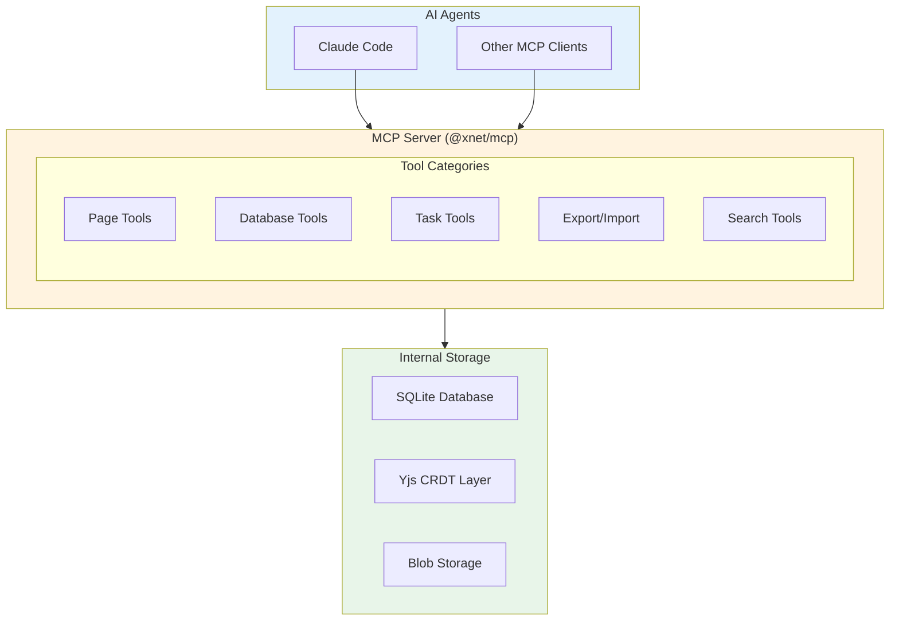

# 09: AI & MCP Interface

> Making xNet data accessible to AI agents

[← Back to Plan Overview](./README.md) | [Previous: Appendix](./08-appendix-code-samples.md)

---

## Overview

xNet exposes all data operations through an MCP (Model Context Protocol) server, enabling AI agents like Claude to read, write, and query content programmatically. This replaces the need for file-based storage while providing structured, type-safe access to all data.

**Design Principle**: AI agents access data via tools (MCP), not files. This provides:

- Structured queries (filter, sort, aggregate)
- Atomic operations (no parse errors)
- Schema-aware updates (type validation)
- Full flexibility for rich content (not limited by Markdown)

---

## Architecture



---

## Why MCP Instead of Files?

| Approach                        | Pros                                                             | Cons                                                         |
| ------------------------------- | ---------------------------------------------------------------- | ------------------------------------------------------------ |
| **File-based (Obsidian-style)** | Human-readable, Git-friendly, external editor support            | Sync conflicts, Markdown limits rich content, parsing errors |
| **MCP-based (xNet)**            | Structured queries, atomic ops, full flexibility, no sync issues | Requires MCP client, less portable                           |

For AI agents specifically, MCP is superior:

- Query: "find tasks due this week" (vs grep through files)
- Bulk update: "mark all done" (vs edit multiple files)
- Type safety: dates stay dates, numbers stay numbers
- No formatting errors from malformed Markdown

**Portability solved via Export/Import**: On-demand export to Markdown/JSON for backups, Git, and interop.

---

## MCP Tools Reference

### Page Operations

#### xnet_list_pages

List pages with optional filtering.

```typescript
// Parameters
{
  parent_id?: string;      // Filter by parent page
  tag?: string;            // Filter by tag
  search?: string;         // Full-text search
  limit?: number;          // Default: 50
  offset?: number;         // For pagination
}

// Returns
{
  pages: [{
    id: string;
    title: string;
    path: string;          // e.g., "Work/Projects/Alpha"
    tags: string[];
    updated_at: string;
    has_children: boolean;
  }];
  total: number;
}
```

#### xnet_get_page

Get full page content.

```typescript
// Parameters
{
  id?: string;             // By UUID
  path?: string;           // By path like "Work/Projects/Alpha"
}

// Returns
{
  id: string;
  title: string;
  content: string;         // Markdown format
  tags: string[];
  aliases: string[];
  created_at: string;
  updated_at: string;
  created_by: string;      // DID
  parent_id?: string;
  children: { id: string; title: string }[];
  backlinks: { id: string; title: string }[];
  outgoing_links: { id: string; title: string }[];
}
```

#### xnet_create_page

Create a new page.

```typescript
// Parameters
{
  title: string;
  content: string;         // Markdown
  parent_id?: string;      // Parent page UUID
  tags?: string[];
  aliases?: string[];
}

// Returns
{
  id: string;
  path: string;
}
```

#### xnet_update_page

Update an existing page.

```typescript
// Parameters
{
  id: string;
  title?: string;
  content?: string;        // Full replacement
  append?: string;         // Append to existing content
  prepend?: string;        // Prepend to existing content
  tags?: string[];         // Replace tags
  add_tags?: string[];     // Add to existing tags
  remove_tags?: string[];  // Remove from existing tags
}

// Returns
{
  success: boolean;
  updated_at: string;
}
```

#### xnet_delete_page

Delete a page.

```typescript
// Parameters
{
  id: string;
  recursive?: boolean;     // Delete children too (default: false)
}

// Returns
{
  success: boolean;
  deleted_count: number;   // Including children if recursive
}
```

---

### Database Operations

#### xnet_list_databases

List all databases in the workspace.

```typescript
// No parameters

// Returns
{
  databases: [{
    id: string;
    name: string;
    icon?: string;
    record_count: number;
    properties: [{
      id: string;
      name: string;
      type: string;
    }];
  }];
}
```

#### xnet_get_database_schema

Get detailed schema for a database.

```typescript
// Parameters
{
  id: string;
}

// Returns
{
  id: string;
  name: string;
  properties: [{
    id: string;
    name: string;
    type: "text" | "number" | "select" | "multi_select" | "date" |
          "checkbox" | "url" | "email" | "phone" | "person" |
          "relation" | "formula" | "rollup" | "created_time" |
          "last_edited_time" | "created_by";
    config: {
      // Type-specific configuration
      options?: { id: string; name: string; color: string }[];  // for select
      format?: string;           // for number
      target_database?: string;  // for relation
      expression?: string;       // for formula
    };
  }];
  views: [{
    id: string;
    name: string;
    type: "table" | "board" | "gallery" | "calendar" | "timeline";
  }];
}
```

#### xnet_query_database

Query records with filtering and sorting.

```typescript
// Parameters
{
  database_id: string;
  filter?: {
    and?: FilterCondition[];
    or?: FilterCondition[];
  };
  sort?: [{
    property: string;
    direction: "asc" | "desc";
  }];
  limit?: number;          // Default: 100
  offset?: number;
}

// FilterCondition
{
  property: string;
  operator: "equals" | "not_equals" | "contains" | "not_contains" |
            "starts_with" | "ends_with" | "is_empty" | "is_not_empty" |
            "gt" | "gte" | "lt" | "lte" |
            "before" | "after" | "on_or_before" | "on_or_after";
  value: any;
}

// Returns
{
  records: [{
    id: string;
    properties: Record<string, any>;
    created_at: string;
    updated_at: string;
  }];
  total: number;
  has_more: boolean;
}
```

#### xnet_create_record

Create a new database record.

```typescript
// Parameters
{
  database_id: string
  properties: Record<string, any> // property_name → value
}

// Returns
{
  id: string
  created_at: string
}
```

#### xnet_update_record

Update an existing record.

```typescript
// Parameters
{
  record_id: string
  properties: Record<string, any> // Only include properties to update
}

// Returns
{
  success: boolean
  updated_at: string
}
```

#### xnet_delete_record

Delete a record.

```typescript
// Parameters
{
  record_id: string
}

// Returns
{
  success: boolean
}
```

#### xnet_create_database

Create a new database.

```typescript
// Parameters
{
  name: string;
  icon?: string;
  parent_page_id?: string;  // Embed in a page
  properties: [{
    name: string;
    type: string;
    config?: any;
  }];
}

// Returns
{
  id: string;
}
```

---

### Task Operations

Tasks are stored in a built-in database but have convenience methods.

#### xnet_list_tasks

```typescript
// Parameters
{
  status?: "todo" | "in_progress" | "done" | "cancelled";
  priority?: "low" | "medium" | "high" | "urgent";
  assignee?: string;       // DID
  due_before?: string;     // ISO date
  due_after?: string;
  project_id?: string;     // Linked page
  include_completed?: boolean;  // Default: false
  limit?: number;
}

// Returns
{
  tasks: [{
    id: string;
    title: string;
    status: string;
    priority: string;
    due_date?: string;
    assignees: string[];
    project?: { id: string; title: string };
    subtask_count: number;
    completed_subtasks: number;
  }];
  total: number;
}
```

#### xnet_create_task

```typescript
// Parameters
{
  title: string;
  description?: string;    // Markdown
  status?: string;         // Default: "todo"
  priority?: string;       // Default: "medium"
  due_date?: string;
  assignees?: string[];
  labels?: string[];
  project_id?: string;     // Link to page
  parent_task_id?: string; // For subtasks
  checklist?: string[];    // Quick checklist items
}

// Returns
{
  id: string;
}
```

#### xnet_update_task

```typescript
// Parameters
{
  id: string;
  title?: string;
  description?: string;
  status?: string;
  priority?: string;
  due_date?: string;
  assignees?: string[];
  add_checklist_item?: string;
  complete_checklist_item?: number;  // Index
}

// Returns
{
  success: boolean;
}
```

---

### Search Operations

#### xnet_search

Global search across all content types.

```typescript
// Parameters
{
  query: string;
  types?: ("page" | "task" | "database_record")[];
  tags?: string[];         // Filter by tags
  limit?: number;          // Default: 20
}

// Returns
{
  results: [{
    type: "page" | "task" | "database_record";
    id: string;
    title: string;
    excerpt: string;       // Matching text with highlights
    score: number;         // Relevance score
    path?: string;         // For pages
    database_name?: string; // For records
  }];
}
```

#### xnet_get_backlinks

Get all pages linking to a specific page.

```typescript
// Parameters
{
  page_id: string;
}

// Returns
{
  backlinks: [{
    id: string;
    title: string;
    path: string;
    excerpt: string;       // Context around the link
  }];
}
```

---

### Export/Import Operations

#### xnet_export_workspace

Export workspace to files.

```typescript
// Parameters
{
  format: "markdown" | "json" | "sqlite";
  output_path?: string;    // Default: temp directory
  include?: ("pages" | "databases" | "tasks" | "attachments")[];
  page_ids?: string[];     // Export specific pages only
  database_ids?: string[]; // Export specific databases only
}

// Returns
{
  path: string;            // Where files were written
  stats: {
    pages: number;
    databases: number;
    records: number;
    attachments: number;
    total_size: number;    // Bytes
  };
}
```

#### xnet_import_file

Import from file or directory.

```typescript
// Parameters
{
  path: string;            // File or directory
  conflict_resolution: "skip" | "overwrite" | "rename" | "ask";
  dry_run?: boolean;       // Preview without importing
}

// Returns
{
  imported: {
    pages: number;
    records: number;
  };
  skipped: number;
  renamed: string[];       // If conflict_resolution = "rename"
  errors: [{
    file: string;
    error: string;
  }];
}
```

---

## Export Formats

### Markdown Bundle

```
export/
├── pages/
│   ├── Home.md
│   └── Work/
│       ├── _index.md
│       └── Projects/
│           └── Alpha.md
├── databases/
│   ├── tasks.json
│   └── contacts.json
├── attachments/
│   └── {content-hash}.png
└── .xnet/
    ├── manifest.json
    └── links.json
```

### Page Format (Markdown + Frontmatter)

```markdown
---
id: 550e8400-e29b-41d4-a716-446655440000
title: Project Alpha
created: 2026-01-15T10:30:00Z
updated: 2026-01-20T14:22:00Z
tags:
  - project
  - active
aliases:
  - Alpha Project
---

# Project Alpha

Project description and content here.

## Links

- Related: [[Project Beta]]
- Owner: [[John Smith]]
```

### Database Format (JSON)

```json
{
  "id": "db-uuid",
  "name": "Tasks",
  "schema": {
    "properties": [
      {
        "id": "prop-1",
        "name": "Title",
        "type": "title"
      },
      {
        "id": "prop-2",
        "name": "Status",
        "type": "select",
        "options": [
          { "id": "opt-1", "name": "Todo", "color": "gray" },
          { "id": "opt-2", "name": "Done", "color": "green" }
        ]
      }
    ]
  },
  "records": [
    {
      "id": "rec-1",
      "properties": {
        "Title": "Implement feature",
        "Status": "Todo"
      },
      "created_at": "2026-01-15T10:00:00Z"
    }
  ]
}
```

---

## Content Format: Markdown

Page content is stored internally as ProseMirror JSON but exposed via MCP as **Markdown** for AI accessibility.

### Supported Markdown Features

| Feature     | Syntax                    | Notes                    |
| ----------- | ------------------------- | ------------------------ |
| Headings    | `# H1` to `###### H6`     |                          |
| Bold/Italic | `**bold**` `*italic*`     |                          |
| Links       | `[text](url)`             | External links           |
| Wikilinks   | `[[Page Name]]`           | Internal links           |
| Code        | `` `inline` `` and fenced | With syntax highlighting |
| Lists       | `- item` and `1. item`    | Nested supported         |
| Tasks       | `- [ ] todo`              | Checkbox items           |
| Blockquotes | `> quote`                 |                          |
| Tables      | GFM tables                |                          |
| Images      | ``             |                          |
| Embeds      | `![[Page Name]]`          | Transclusion             |
| Math        | `$inline$` `$$block$$`    | LaTeX                    |
| Mermaid     | ````mermaid`              | Diagrams                 |

### Conversion Notes

- **Read**: ProseMirror JSON → Markdown (lossless for supported features)
- **Write**: Markdown → ProseMirror JSON (parsed and validated)
- **Unsupported**: Custom blocks serialize to HTML comments

---

## Authentication & Security

### Local Mode (Default)

When running on the same machine:

- MCP server binds to localhost only
- No authentication required
- Full access to workspace

### Remote Mode (Future)

For remote access:

- Token-based authentication
- Workspace-level API keys
- Permission scoping (read-only, read-write, admin)

### Encryption

- Data at rest: Encrypted with workspace key
- MCP responses: Decrypted for authorized clients
- Export files: Option to export encrypted or plaintext

---

## Implementation Notes

### Package Structure

```
packages/mcp/
├── src/
│   ├── index.ts           # Entry point
│   ├── server.ts          # MCP server setup
│   ├── tools/
│   │   ├── pages.ts
│   │   ├── databases.ts
│   │   ├── tasks.ts
│   │   ├── search.ts
│   │   └── export.ts
│   ├── converters/
│   │   ├── markdown.ts    # ProseMirror ↔ Markdown
│   │   └── json.ts        # Export formatting
│   └── types.ts
└── package.json
```

### Dependencies

- `@modelcontextprotocol/sdk` - MCP server framework
- `@xnet/storage` - Data access
- `@xnet/query` - Search and filtering
- `prosemirror-markdown` - Content conversion
- `gray-matter` - Frontmatter parsing

---

## Example AI Interactions

### "What tasks are due this week?"

```typescript
// AI calls:
xnet_list_tasks({
  due_after: '2026-01-20',
  due_before: '2026-01-27',
  status: 'todo'
})

// Returns tasks, AI formats response
```

### "Create a meeting notes page"

```typescript
// AI calls:
xnet_create_page({
  title: 'Meeting Notes - Jan 20',
  content: '# Meeting Notes\n\n## Attendees\n\n## Agenda\n\n## Action Items\n',
  parent_id: 'meetings-folder-uuid',
  tags: ['meeting', '2026']
})
```

### "Find all pages mentioning Project Alpha"

```typescript
// AI calls:
xnet_search({
  query: 'Project Alpha',
  types: ['page']
})

// Or for backlinks specifically:
xnet_get_backlinks({
  page_id: 'project-alpha-uuid'
})
```

### "Add a row to my contacts database"

```typescript
// AI calls:
xnet_create_record({
  database_id: 'contacts-db-uuid',
  properties: {
    Name: 'Jane Smith',
    Email: 'jane@example.com',
    Company: 'Acme Corp',
    Status: 'Lead'
  }
})
```

---

## AI-Collaborative Document Editing

Beyond tool-based CRUD, the most compelling direction is AI agents that can collaboratively edit rich text documents, canvases, and databases — the same content types that humans work with in xNet. This is explored in depth in [**Exploration 0044: AI-Collaborative Editing via MCP and Yjs**](../explorations/0044_AI_COLLABORATIVE_EDITING.md), which covers how an MCP server can give AI agents the same power over xNet content that Claude Code has over an Obsidian vault — but with rich text, structured data, and real-time collaboration.

---

## Next Steps

- [Back to Plan Overview](./README.md)
- [xNet Core Platform](./01-xnet-core-platform.md) - SDK architecture
- [Appendix: Code Samples](./08-appendix-code-samples.md) - Implementation details

---

[← Previous: Appendix](./08-appendix-code-samples.md) | [Back to Plan Overview →](./README.md)
