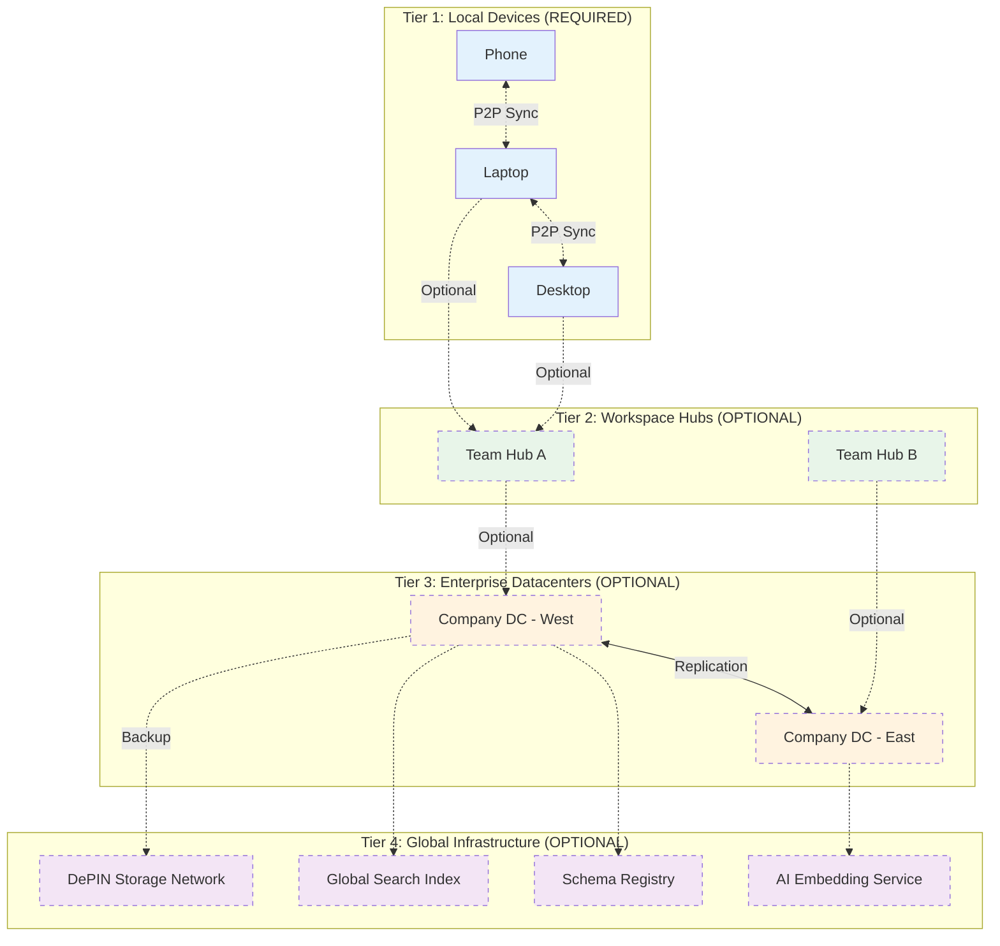
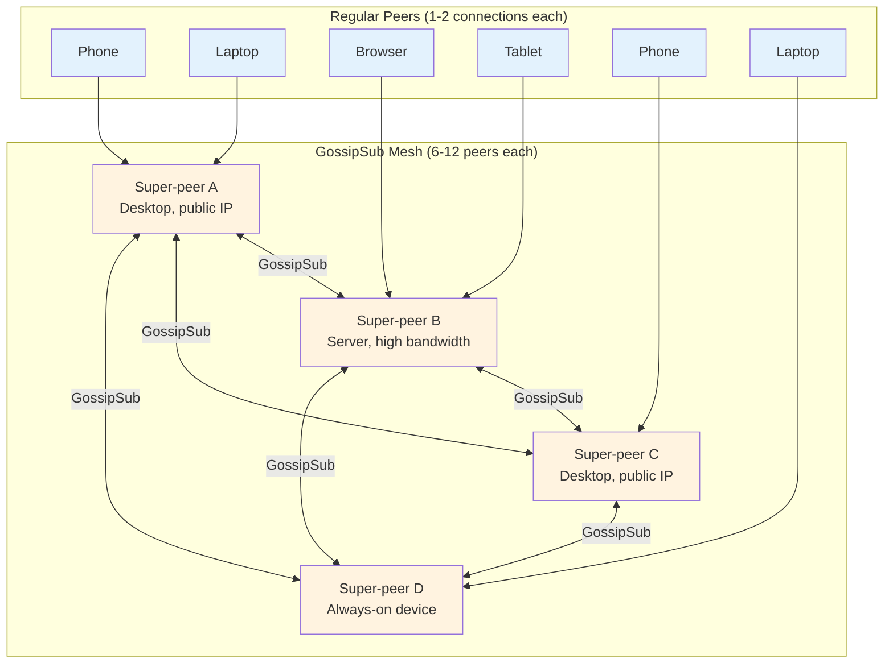
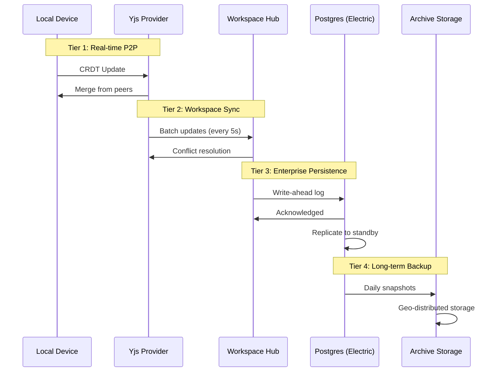
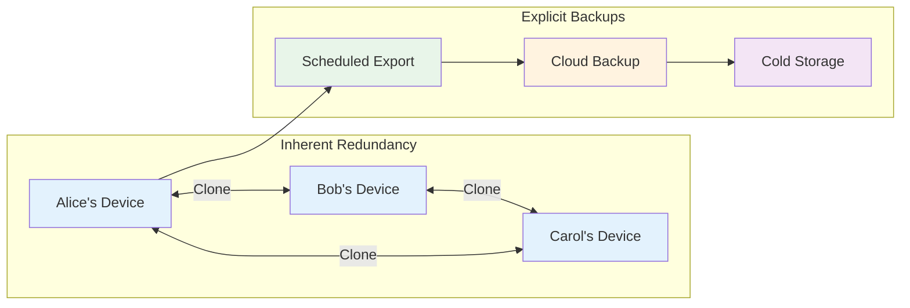
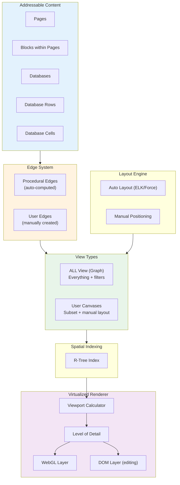

# 10: Scaling Architecture

> Federation, global namespaces, infinite canvas, and backup strategies

[← Back to Plan Overview](./README.md) | [Previous: AI & MCP Interface](./09-ai-mcp-interface.md)

---

## Overview

**Core Principle**: xNet works with **zero infrastructure**—just laptops and phones. Higher tiers are **optional optimizations** for institutions with specific needs.

This document covers how to scale xNotes from personal use to global infrastructure:

- **Pure P2P** - Works with just user devices, no servers
- **P2P Mesh Scaling** - GossipSub, super-peers, and circuit relays for unlimited scale
- **Optional Tiers** - Add infrastructure only when needed
- **Global Schema Registry** - Namespaced attributes across the network
- **Unified Graph & Canvas** - Procedural edges, user edges, and virtualized rendering
- **Edge Performance** - Hybrid storage strategies, indexing, and optimization
- **Backup & Recovery** - Multi-layer redundancy strategies

---

## Tiered Federation Model



### Tier Characteristics

| Tier | Required? | Sync Technology | Latency | Who Needs It |
|------|-----------|-----------------|---------|--------------|
| **Local** | **Yes** | Yjs (P2P CRDTs) | <10ms | Everyone |
| **Workspace** | No | Yjs + relay | <100ms | Teams wanting always-on sync |
| **Enterprise** | No | ElectricSQL | <500ms | Companies with 100TB+ or compliance |
| **Global** | No | IPFS/DePIN | 1-5s | Global search, AI embeddings |

### What Works at Each Level

| Capability | Tier 1 Only | + Tier 2 | + Tier 3 | + Tier 4 |
|------------|-------------|----------|----------|----------|
| Offline editing | Yes | Yes | Yes | Yes |
| Real-time collaboration | Yes (when online) | Yes (24/7) | Yes | Yes |
| Cross-internet sync | Yes (via peers) | Faster | Faster | Fastest |
| Data capacity | Device storage | 1TB shared | 100TB+ | Unlimited |
| Compliance/Audit | Manual export | Manual | Built-in | Built-in |
| Global search | Local only | Workspace | Company | Global |
| AI embeddings | On-device | On-device | Company models | Global models |

---

## P2P Mesh Scaling

Full mesh P2P topologies hit practical limits at 4-6 direct connections. This section explains why and how xNet scales beyond this without central servers.

### Why the 4-6 Connection Limit?

This is a **practical limit, not a hard technical limit**. The constraints arise from:

| Factor | Impact | Details |
|--------|--------|---------|
| **Bandwidth** | O(N) upload | Each peer uploads to N-1 others. 5 Mbps upstream ÷ 1 Mbps/peer = 5 connections max |
| **CPU** | O(N) processing | Each WebRTC connection requires encryption, DTLS, SCTP overhead |
| **Memory** | O(N) buffers | Connection state, send/receive buffers per peer |
| **Network** | O(N²) total | Full mesh of 10 peers = 45 connections; 20 peers = 190 connections |

**Yjs/y-webrtc specifics:**
- No hard limit in the library
- Creates full mesh between all peers
- Practical limit: 4-8 users for real-time collaboration
- Beyond 8: Performance degrades rapidly

### Solution: GossipSub + Super-Peers

Instead of full mesh, xNet uses a **partial mesh with gossip propagation**.



### How GossipSub Works

libp2p's GossipSub maintains a partial mesh with intelligent message propagation:

```typescript
interface GossipSubConfig {
  // Mesh parameters (per topic)
  D: 6;          // Target mesh degree (connections per topic)
  D_low: 4;      // Minimum mesh peers before grafting
  D_high: 12;    // Maximum mesh peers before pruning
  D_lazy: 6;     // Gossip-only peers (metadata, not full messages)

  // Heartbeat
  heartbeatInterval: 1000;  // ms - check mesh health

  // Message propagation
  mcacheLength: 5;          // History windows to remember
  mcacheGossip: 3;          // History windows to gossip about
}

// Message flow:
// 1. Peer A publishes message to topic
// 2. A sends FULL message to D mesh peers (6 peers)
// 3. A sends IHAVE (message ID only) to D_lazy peers (6 more)
// 4. Peers receiving IHAVE can request full message via IWANT
// 5. Each mesh peer repeats, creating exponential propagation
```

**Key insight**: Message reaches all peers in O(log N) hops, not O(N) connections.

### Super-Peer Selection

Super-peers are regular peers that volunteer to handle more connections. **No central authority assigns them.**

```typescript
interface PeerCapabilities {
  // Self-reported capabilities
  bandwidth: {
    upload: number;      // Mbps
    download: number;
  };
  availability: {
    uptime: number;      // Percentage online (rolling 7 days)
    publicIP: boolean;   // Can accept incoming connections
    natType: 'none' | 'full-cone' | 'symmetric';
  };
  resources: {
    canRelay: boolean;   // Willing to relay for others
    maxRelayConns: number;
  };
}

// Super-peer eligibility (all must be true):
const canBeSuperPeer = (peer: PeerCapabilities): boolean =>
  peer.bandwidth.upload >= 10 &&           // 10+ Mbps upload
  peer.availability.uptime >= 0.8 &&       // 80%+ uptime
  peer.availability.publicIP &&            // Reachable directly
  peer.availability.natType !== 'symmetric' && // Can hole-punch
  peer.resources.canRelay;                 // Willing to help

// Selection methods (decentralized):
type SuperPeerSelection =
  | 'capability-based'    // Peers with best scores volunteer
  | 'dht-proximity'       // Peers closest to topic hash
  | 'stake-weighted'      // Peers with tokens locked (optional)
  | 'reputation'          // Peers with good history
```

### Circuit Relay (P2P Hubs)

When direct connection fails (symmetric NAT, firewalls), peers connect via relay:

```typescript
// Relay is just another peer - no central server
// Any peer can be a relay if it has:
// 1. Public IP or full-cone NAT
// 2. Spare bandwidth
// 3. Willingness to relay

// Example relay address:
// /p2p/QmRelayPeer.../p2p-circuit/p2p/QmTargetPeer...
//      ↑ relay node              ↑ destination through relay

class CircuitRelay {
  // Reserve a slot on a relay
  async reserveSlot(relayPeerId: string): Promise<Reservation> {
    // Relay grants time-limited slot (e.g., 1 hour)
    // Renewable while in use
  }

  // Advertise our relay address to DHT
  async advertiseRelayedAddress(reservation: Reservation): Promise<void> {
    const relayedAddr = `/p2p/${reservation.relayId}/p2p-circuit/p2p/${this.peerId}`;
    await this.dht.provide(this.peerId, relayedAddr);
  }
}
```

**NAT traversal success rates:**

| NAT Type | Direct Connection | With Relay |
|----------|-------------------|------------|
| None (public IP) | 100% | N/A |
| Full-cone NAT | ~90% | 100% |
| Restricted NAT | ~70% | 100% |
| Symmetric NAT | ~10% | 100% |

### Scaling Recommendations

| Scenario | Topology | Max Peers | Notes |
|----------|----------|-----------|-------|
| **Personal devices** | Full mesh | 3-5 | Your own phone, laptop, desktop |
| **Small team** | Full mesh | 6-8 | Real-time collaboration |
| **Large team** | Super-peer | 20-50 | 2-3 super-peers, others connect to them |
| **Organization** | GossipSub | 100-1000 | Tiered topology, workspace hubs |
| **Global** | GossipSub + DHT | Unlimited | Full libp2p stack |

### Yjs Integration

For Yjs, the recommended approach is a **hybrid** where super-peers bridge WebSocket and libp2p:

```typescript
// Super-peer bridges y-websocket clients to GossipSub
class YjsSuperPeer {
  private ydocs = new Map<string, Y.Doc>();
  private wsClients = new Map<string, WebSocket[]>();
  private libp2p: Libp2p;

  constructor() {
    // WebSocket server for regular peers
    this.wss = new WebSocketServer({ port: 4444 });
    this.wss.on('connection', this.handleWsClient);

    // libp2p for super-peer mesh
    this.libp2p = await createLibp2p({
      services: {
        pubsub: gossipsub(),
      },
    });
  }

  // Bridge: WebSocket → GossipSub
  private handleYjsUpdate = (docId: string, update: Uint8Array) => {
    // Broadcast to local WebSocket clients
    for (const ws of this.wsClients.get(docId) ?? []) {
      ws.send(update);
    }

    // Broadcast to GossipSub mesh
    this.libp2p.services.pubsub.publish(
      `yjs/${docId}`,
      update
    );
  };

  // Bridge: GossipSub → WebSocket
  private handleGossipMessage = (msg: Message) => {
    const docId = msg.topic.replace('yjs/', '');
    const update = msg.data;

    // Apply to local doc
    Y.applyUpdate(this.ydocs.get(docId)!, update, 'gossipsub');

    // Forward to WebSocket clients
    for (const ws of this.wsClients.get(docId) ?? []) {
      ws.send(update);
    }
  };
}
```

**Result**: Regular peers (phones, browsers) connect to 1-2 super-peers via WebSocket. Super-peers form GossipSub mesh. Unlimited scale, no central servers.

---

## Hybrid Sync Architecture

### Why Hybrid?

| Scenario | Best Fit | Reason |
|----------|----------|--------|
| Real-time collaboration | Yjs | Sub-second CRDT sync |
| Offline-first mobile | Yjs | No server required |
| Enterprise compliance | ElectricSQL | SQL queries, audit logs |
| Large datasets | ElectricSQL | Postgres scalability |
| Global search | Custom indexer | Specialized infrastructure |

### Sync Flow



### Implementation

```typescript
interface SyncConfig {
  // Tier 1: P2P
  p2p: {
    enabled: boolean;
    provider: 'y-webrtc' | 'y-websocket';
    signaling: string[];
  };

  // Tier 2: Workspace Hub
  workspace?: {
    hubUrl: string;
    batchInterval: number;  // ms
    conflictStrategy: 'last-write-wins' | 'merge' | 'manual';
  };

  // Tier 3: Enterprise
  enterprise?: {
    electricUrl: string;
    postgresConnection: string;
    replicationMode: 'sync' | 'async';
  };

  // Tier 4: Archive
  archive?: {
    provider: 'ipfs' | 'depin' | 's3' | 'gcs';
    schedule: 'realtime' | 'hourly' | 'daily';
    retention: string;  // e.g., '7y' for 7 years
  };
}

class HybridSyncManager {
  private yjs: YjsProvider;
  private electric?: ElectricClient;
  private archive?: ArchiveProvider;

  async sync(doc: XNetDocument): Promise<void> {
    // Always sync via Yjs for real-time
    await this.yjs.sync(doc);

    // Batch to enterprise if configured
    if (this.electric) {
      await this.batchToElectric(doc);
    }

    // Archive based on schedule
    if (this.archive && this.shouldArchive(doc)) {
      await this.archive.backup(doc);
    }
  }

  private async batchToElectric(doc: XNetDocument): Promise<void> {
    // Convert CRDT state to SQL operations
    const operations = this.crdtToSql(doc.getStateVector());
    await this.electric.transact(operations);
  }
}
```

---

## Global Schema Registry

A decentralized registry for attribute definitions, enabling interoperability.

### Namespace Structure

```
xnet.core/              # Core types (Page, Task, Database)
xnet.canvas/            # Canvas-specific types
com.acme/               # Company: Acme Corp
org.example/            # Organization: Example.org
did:key:abc123/         # Personal namespace (by DID)
```

### Schema Definition

```typescript
interface SchemaDefinition {
  // Identity
  namespace: string;           // e.g., 'com.acme'
  name: string;                // e.g., 'Invoice'
  version: string;             // Semantic versioning

  // Schema
  properties: PropertyDefinition[];
  extends?: string;            // Parent schema

  // Metadata
  author: string;              // DID of creator
  license: string;             // SPDX identifier
  signature: string;           // Ed25519 signature

  // Discovery
  tags: string[];
  description: string;
  documentation?: string;      // URL
}

interface PropertyDefinition {
  name: string;
  type: PropertyType;
  required: boolean;
  indexed: boolean;            // For query optimization
  encrypted: boolean;          // E2E encrypt this field
  default?: any;
}

// Registry operations
interface SchemaRegistry {
  // Lookup
  resolve(uri: string): Promise<SchemaDefinition>;
  search(query: string): Promise<SchemaDefinition[]>;

  // Publishing
  publish(schema: SchemaDefinition): Promise<string>;
  deprecate(uri: string, replacement?: string): Promise<void>;

  // Subscription
  subscribe(namespace: string): AsyncIterable<SchemaDefinition>;

  // Validation
  validate(data: any, schemaUri: string): ValidationResult;
}
```

### Selective Sync with Schemas

```typescript
interface SyncPolicy {
  // What schemas to materialize locally
  schemas: {
    // Full sync for core types
    'xnet.core/*': { mode: 'full' };

    // Partial sync for company data
    'com.acme/Invoice': {
      mode: 'partial',
      filter: { status: 'open' },
      maxAge: '90d',
    };

    // On-demand for archives
    'com.acme/ArchivedInvoice': { mode: 'on-demand' };
  };

  // Storage limits
  quotas: {
    local: '10GB',
    cached: '1GB',
  };
}
```

---

## Backup & Recovery

### The Git Analogy

Like Git, xNotes provides inherent redundancy through distribution:



### Backup Layers

| Layer | Type | RPO | RTO | Retention |
|-------|------|-----|-----|-----------|
| **Peer Replicas** | Inherent | 0 (real-time) | Instant | While online |
| **Local Snapshots** | Automatic | 1 hour | Minutes | 7 days |
| **Cloud Sync** | Scheduled | 1-24 hours | Hours | 30 days |
| **Archive Storage** | Manual/Scheduled | Daily | Days | 7+ years |
| **DePIN/IPFS** | Content-addressed | On-demand | Variable | Permanent |

*RPO = Recovery Point Objective (max data loss)*
*RTO = Recovery Time Objective (time to restore)*

### Backup Strategies

#### 1. Peer Replication (Inherent)

Every connected peer is a full replica:

```typescript
interface PeerBackupStatus {
  // Track which peers have which data
  peers: {
    peerId: string;
    lastSeen: Date;
    documentsReplicated: string[];
    syncStatus: 'full' | 'partial' | 'stale';
  }[];

  // Minimum replicas for safety
  replicationFactor: number;  // e.g., 3

  // Alert if below threshold
  checkReplication(): {
    healthy: boolean;
    underReplicated: string[];  // Document IDs
  };
}
```

#### 2. Local Snapshots

Automatic point-in-time snapshots:

```typescript
interface SnapshotConfig {
  enabled: boolean;
  interval: 'hourly' | 'daily' | 'manual';
  retention: number;           // Number of snapshots to keep
  location: string;            // Local path
  compression: 'none' | 'gzip' | 'zstd';
  encryption: boolean;         // Encrypt at rest
}

interface Snapshot {
  id: string;
  timestamp: Date;
  size: number;
  documents: number;
  databases: number;
  checksum: string;            // BLAKE3 hash

  // Metadata for recovery
  yjs_state_vectors: Map<string, Uint8Array>;
  schema_versions: Map<string, string>;
}

class SnapshotManager {
  async createSnapshot(): Promise<Snapshot> {
    const snapshot: Snapshot = {
      id: crypto.randomUUID(),
      timestamp: new Date(),
      // ... capture full state
    };

    // Write to SQLite backup file
    await this.storage.backup(`snapshots/${snapshot.id}.sqlite`);

    // Prune old snapshots
    await this.pruneOldSnapshots();

    return snapshot;
  }

  async restoreSnapshot(id: string): Promise<void> {
    const snapshot = await this.getSnapshot(id);

    // Warn about data loss
    const currentState = await this.getCurrentStateVector();
    const dataLoss = this.calculateDataLoss(currentState, snapshot);

    if (dataLoss.documents > 0) {
      throw new Error(
        `Restore would lose ${dataLoss.documents} documents. ` +
        `Use forceRestore() to proceed.`
      );
    }

    await this.storage.restore(snapshot);
  }
}
```

#### 3. Cloud Backup

Encrypted backup to cloud providers:

```typescript
interface CloudBackupConfig {
  provider: 'icloud' | 's3' | 'gcs' | 'azure' | 'backblaze';
  bucket: string;
  prefix: string;

  schedule: {
    frequency: 'realtime' | 'hourly' | 'daily';
    time?: string;              // For daily, e.g., '02:00'
  };

  encryption: {
    enabled: true;
    keySource: 'derived' | 'user-provided';
  };

  retention: {
    daily: number;              // Days to keep daily backups
    weekly: number;             // Weeks to keep weekly
    monthly: number;            // Months to keep monthly
    yearly: number;             // Years to keep yearly
  };
}

class CloudBackup {
  async backup(): Promise<BackupResult> {
    // Export to encrypted bundle
    const bundle = await this.export({
      format: 'sqlite',
      encryption: this.config.encryption,
    });

    // Upload with deduplication
    const key = `${this.config.prefix}/${this.getBackupKey()}`;
    await this.provider.upload(key, bundle, {
      contentHash: bundle.checksum,
      metadata: {
        timestamp: new Date().toISOString(),
        version: this.schemaVersion,
      },
    });

    // Apply retention policy
    await this.applyRetentionPolicy();

    return { key, size: bundle.size };
  }
}
```

#### 4. Archive Storage (Long-term)

For compliance and historical records:

```typescript
interface ArchiveConfig {
  provider: 'glacier' | 'archive' | 'tape' | 'depin';

  // What to archive
  scope: {
    minAge: string;            // e.g., '1y' - only archive old data
    types: string[];           // Schema types to archive
    excludeTags: string[];     // Tags to exclude
  };

  // Legal/compliance
  retention: {
    minimum: string;           // e.g., '7y' for tax records
    legalHold: boolean;        // Prevent deletion
  };

  // Verification
  verification: {
    schedule: 'monthly' | 'quarterly' | 'yearly';
    sampleSize: number;        // % of archives to verify
  };
}
```

#### 5. DePIN/IPFS Backup

Decentralized, content-addressed storage:

```typescript
interface DePINBackupConfig {
  network: 'ipfs' | 'filecoin' | 'arweave' | 'storj';

  // Pinning strategy
  pinning: {
    redundancy: number;        // Number of nodes to pin on
    regions: string[];         // Geographic distribution
  };

  // Cost management
  budget: {
    maxMonthly: number;        // Max USD per month
    prioritize: 'cost' | 'speed' | 'redundancy';
  };
}

class DePINBackup {
  async backup(data: Uint8Array): Promise<string> {
    // Content-addressed storage
    const cid = await this.ipfs.add(data, {
      pin: true,
      wrapWithDirectory: false,
    });

    // Pin to additional nodes for redundancy
    await this.pinningService.pin(cid, {
      redundancy: this.config.pinning.redundancy,
      regions: this.config.pinning.regions,
    });

    // Store CID in local index for recovery
    await this.index.add({
      cid: cid.toString(),
      timestamp: new Date(),
      size: data.length,
      checksum: await blake3(data),
    });

    return cid.toString();
  }

  async verify(cid: string): Promise<VerificationResult> {
    const providers = await this.ipfs.dht.findProviders(cid);
    const retrieved = await this.ipfs.cat(cid);
    const checksum = await blake3(retrieved);

    return {
      available: providers.length > 0,
      providers: providers.length,
      integrityValid: checksum === this.index.get(cid).checksum,
    };
  }
}
```

### Recovery Scenarios

| Scenario | Recovery Method | Time | Data Loss |
|----------|-----------------|------|-----------|
| Device lost | Sync from peers | Minutes | None |
| All peers offline | Restore from cloud | Hours | Up to RPO |
| Ransomware attack | Restore from archive | Hours-Days | Up to RPO |
| Accidental deletion | Local snapshot | Minutes | Up to 1 hour |
| Compliance audit | Archive retrieval | Days | None |
| Catastrophic failure | DePIN recovery | Days | Varies |

### Backup UI/UX

```typescript
interface BackupDashboard {
  // Status overview
  status: {
    lastBackup: Date;
    nextScheduled: Date;
    health: 'healthy' | 'warning' | 'critical';
  };

  // Peer replication
  peers: {
    connected: number;
    replicationFactor: number;
    underReplicated: string[];
  };

  // Storage usage
  storage: {
    local: { used: number; quota: number };
    cloud: { used: number; quota: number };
    archive: { used: number; cost: number };
  };

  // Actions
  actions: {
    backupNow(): Promise<void>;
    restoreFromBackup(id: string): Promise<void>;
    exportToFile(path: string): Promise<void>;
    verifyBackups(): Promise<VerificationReport>;
  };
}
```

---

## Unified Graph & Canvas

xNotes unifies **graph visualization** and **infinite canvas** into a single system where:

- **Graph View ("ALL")** - Procedurally generated from all content with computed edges
- **Canvas Views** - User-curated subsets with manual positioning and custom edges
- **Universal Edges** - Any content can link to any other content at any granularity

### Architecture



### Core Concepts

| Concept | Description |
|---------|-------------|
| **Addressable Content** | Every page, block, database, row, and cell has a stable ID |
| **Procedural Edges** | Auto-computed from wikilinks, tags, shared attributes, DB relations |
| **User Edges** | Manually created links between any two pieces of content |
| **ALL View** | Graph of everything with filters for edge types |
| **Canvas View** | User-curated subset with manual XY positioning |

---

### Addressable Content Reference

All content in xNotes is addressable, allowing edges to target any level of granularity.

```typescript
/**
 * Universal reference to any content in xNotes.
 * Enables edges between pages, blocks, databases, rows, and cells.
 */
interface ContentRef {
  // Top-level content type
  type: 'page' | 'block' | 'database' | 'row' | 'cell';

  // Primary ID (page ID or database ID)
  id: string;

  // Sub-document targeting
  blockId?: string;        // Specific block within a page
  rowId?: string;          // Specific row within a database
  propertyId?: string;     // Combined with rowId = specific cell

  // Optional: specific version/snapshot
  version?: number;
}

// Examples:
const pageRef: ContentRef = {
  type: 'page',
  id: 'page-123'
};

const blockRef: ContentRef = {
  type: 'block',
  id: 'page-123',
  blockId: 'block-456'
};

const cellRef: ContentRef = {
  type: 'cell',
  id: 'db-789',
  rowId: 'row-abc',
  propertyId: 'prop-def'
};
```

---

### Edge System

Edges connect any two pieces of addressable content. They come in two types:

```typescript
/**
 * Edge connecting two pieces of content.
 * Can be procedural (auto-computed) or user-created.
 */
interface Edge {
  id: string;

  // Edge classification
  edgeType: 'procedural' | 'user';

  // Source and target can be ANY addressable content
  source: ContentRef;
  target: ContentRef;

  // Procedural edge metadata (computed, read-only in UI)
  procedural?: {
    kind: ProceduralEdgeKind;
    // Additional context for the edge
    attribute?: string;      // e.g., tag name, property name
    bidirectional?: boolean; // e.g., shared tags are bidirectional
  };

  // User edge metadata (editable)
  user?: {
    label?: string;
    description?: string;
    color?: string;
    style?: 'solid' | 'dashed' | 'dotted' | 'arrow';
  };

  // Visual properties (for canvas rendering)
  routing?: 'straight' | 'orthogonal' | 'curved';
  points?: Point[];          // Manual routing waypoints

  // Metadata
  createdAt: string;
  createdBy: string;         // DID
}

type ProceduralEdgeKind =
  | 'wikilink'          // [[Page Name]] reference
  | 'backlink'          // Reverse of wikilink
  | 'tag'               // Shared tag between items
  | 'shared-attribute'  // Same value in a property (e.g., same author)
  | 'db-relation'       // Database relation property
  | 'parent-child'      // Page hierarchy
  | 'block-reference';  // Block embed/transclusion
```

#### Procedural Edge Computation

```typescript
/**
 * Computes procedural edges from content metadata.
 * Runs incrementally as content changes.
 */
class ProceduralEdgeComputer {

  // Compute wikilink edges from page content
  computeWikilinks(page: Page): Edge[] {
    const edges: Edge[] = [];
    const links = this.extractWikilinks(page.body);

    for (const link of links) {
      const targetPage = this.resolvePageByTitle(link.title);
      if (targetPage) {
        edges.push({
          id: `wikilink:${page.id}:${targetPage.id}`,
          edgeType: 'procedural',
          source: { type: 'page', id: page.id },
          target: { type: 'page', id: targetPage.id },
          procedural: { kind: 'wikilink' },
          createdAt: new Date().toISOString(),
          createdBy: 'system',
        });
      }
    }
    return edges;
  }

  // Compute tag edges (bidirectional between items with same tag)
  computeTagEdges(items: (Page | DatabaseItem)[]): Edge[] {
    const tagMap = new Map<string, ContentRef[]>();

    // Group items by tag
    for (const item of items) {
      for (const tag of item.tags ?? []) {
        if (!tagMap.has(tag)) tagMap.set(tag, []);
        tagMap.get(tag)!.push(this.toContentRef(item));
      }
    }

    // Create edges between items with same tag
    const edges: Edge[] = [];
    for (const [tag, refs] of tagMap) {
      for (let i = 0; i < refs.length; i++) {
        for (let j = i + 1; j < refs.length; j++) {
          edges.push({
            id: `tag:${tag}:${refs[i].id}:${refs[j].id}`,
            edgeType: 'procedural',
            source: refs[i],
            target: refs[j],
            procedural: {
              kind: 'tag',
              attribute: tag,
              bidirectional: true,
            },
            createdAt: new Date().toISOString(),
            createdBy: 'system',
          });
        }
      }
    }
    return edges;
  }

  // Compute shared attribute edges
  computeSharedAttributeEdges(
    items: DatabaseItem[],
    propertyId: string
  ): Edge[] {
    const valueMap = new Map<string, ContentRef[]>();

    for (const item of items) {
      const value = item.properties[propertyId];
      if (value != null) {
        const key = JSON.stringify(value);
        if (!valueMap.has(key)) valueMap.set(key, []);
        valueMap.get(key)!.push({ type: 'row', id: item.databaseId, rowId: item.id });
      }
    }

    const edges: Edge[] = [];
    for (const [_, refs] of valueMap) {
      if (refs.length < 2) continue;
      for (let i = 0; i < refs.length; i++) {
        for (let j = i + 1; j < refs.length; j++) {
          edges.push({
            id: `shared:${propertyId}:${refs[i].rowId}:${refs[j].rowId}`,
            edgeType: 'procedural',
            source: refs[i],
            target: refs[j],
            procedural: {
              kind: 'shared-attribute',
              attribute: propertyId,
              bidirectional: true,
            },
            createdAt: new Date().toISOString(),
            createdBy: 'system',
          });
        }
      }
    }
    return edges;
  }
}
```

---

### Canvas Data Model

```typescript
/**
 * A canvas view - either the ALL view or a user-created canvas.
 */
interface CanvasDocument {
  id: string;
  name: string;

  // Special flag for the ALL view
  isAllView: boolean;

  // For user canvases: which content is included
  // For ALL view: this is computed from all content
  nodes: Map<string, CanvasNode>;

  // User-created edges (procedural edges computed on-demand)
  userEdges: Map<string, Edge>;

  // Edge visibility filters
  edgeFilters: EdgeFilterConfig;

  // Layout mode
  layout: LayoutConfig;

  // View state (not synced)
  viewport: Viewport;
}

/**
 * A node on the canvas representing content or a shape.
 */
interface CanvasNode {
  id: string;

  // Position (for user canvases; computed for ALL view)
  x: number;
  y: number;
  width: number;
  height: number;

  // What this node represents
  type: 'content' | 'shape' | 'group' | 'text';

  // Reference to actual content (for content nodes)
  contentRef?: ContentRef;

  // Inline content (for shape/text nodes)
  content?: {
    text?: string;
    shape?: 'rect' | 'ellipse' | 'diamond' | 'parallelogram';
    style?: ShapeStyle;
  };

  // Display options
  displayMode?: 'full' | 'compact' | 'icon';  // How much to show
  collapsed?: boolean;

  // Grouping
  parentId?: string;

  // Styling
  style: NodeStyle;

  // Metadata
  createdAt: string;
  updatedAt: string;
  createdBy: string;
}

/**
 * Configuration for which edge types to display.
 */
interface EdgeFilterConfig {
  // Procedural edge visibility
  procedural: {
    wikilinks: boolean;
    backlinks: boolean;
    tags: boolean;
    sharedAttributes: boolean;
    dbRelations: boolean;
    parentChild: boolean;
    blockReferences: boolean;
  };

  // User edge visibility
  userEdges: boolean;

  // Filter by specific values
  filterByTag?: string[];           // Only show edges for these tags
  filterByAttribute?: string[];     // Only show edges for these attributes
  filterByDatabase?: string[];      // Only show edges from these DBs
}

interface LayoutConfig {
  // Layout algorithm
  algorithm: 'manual' | 'force' | 'layered' | 'radial' | 'grid';

  // Spacing
  nodeSpacing: number;
  edgeSpacing: number;
  layerSpacing: number;

  // Edge routing
  edgeRouting: 'orthogonal' | 'spline' | 'polyline';
  minimizeCrossings: boolean;

  // Direction (for layered layout)
  direction: 'right' | 'down' | 'left' | 'up';

  // Animation
  animate: boolean;
  animationDuration: number;
}

type Anchor = 'top' | 'right' | 'bottom' | 'left' | 'center' | { x: number; y: number };
```

---

### ALL View vs User Canvas

```typescript
/**
 * The ALL View is a special canvas that shows everything.
 */
class AllViewCanvas {
  private edgeComputer: ProceduralEdgeComputer;
  private spatialIndex: SpatialIndex;
  private layoutEngine: AutoLayoutEngine;

  constructor(
    private pages: Map<string, Page>,
    private databases: Map<string, Database>,
    private items: Map<string, DatabaseItem>
  ) {
    this.edgeComputer = new ProceduralEdgeComputer();
    this.layoutEngine = new AutoLayoutEngine();
  }

  /**
   * Generate the ALL view with current filters.
   */
  generate(filters: EdgeFilterConfig, layout: LayoutConfig): CanvasDocument {
    // Create nodes for all content
    const nodes = new Map<string, CanvasNode>();

    for (const page of this.pages.values()) {
      nodes.set(page.id, this.pageToNode(page));
    }

    for (const db of this.databases.values()) {
      nodes.set(db.id, this.databaseToNode(db));
    }

    // Compute visible edges based on filters
    const visibleEdges = this.computeVisibleEdges(filters);

    // Auto-layout if not manual
    if (layout.algorithm !== 'manual') {
      const positions = this.layoutEngine.layout(
        Array.from(nodes.values()),
        visibleEdges,
        layout
      );
      for (const [id, pos] of positions) {
        const node = nodes.get(id);
        if (node) {
          node.x = pos.x;
          node.y = pos.y;
        }
      }
    }

    return {
      id: 'all-view',
      name: 'All Notes & Databases',
      isAllView: true,
      nodes,
      userEdges: new Map(),
      edgeFilters: filters,
      layout,
      viewport: { x: 0, y: 0, width: 1200, height: 800, zoom: 1 },
    };
  }

  private computeVisibleEdges(filters: EdgeFilterConfig): Edge[] {
    const edges: Edge[] = [];

    if (filters.procedural.wikilinks) {
      for (const page of this.pages.values()) {
        edges.push(...this.edgeComputer.computeWikilinks(page));
      }
    }

    if (filters.procedural.tags) {
      const allItems = [
        ...this.pages.values(),
        ...this.items.values(),
      ];
      edges.push(...this.edgeComputer.computeTagEdges(allItems));
    }

    // ... compute other edge types based on filters

    return edges;
  }
}

/**
 * User-created canvas with manual positioning and custom edges.
 */
class UserCanvas {
  constructor(private canvas: CanvasDocument) {}

  /**
   * Add content to the canvas at a position.
   */
  addContent(ref: ContentRef, x: number, y: number): void {
    const node: CanvasNode = {
      id: crypto.randomUUID(),
      x, y,
      width: 200,
      height: 150,
      type: 'content',
      contentRef: ref,
      style: {},
      createdAt: new Date().toISOString(),
      updatedAt: new Date().toISOString(),
      createdBy: getCurrentUserDID(),
    };
    this.canvas.nodes.set(node.id, node);
  }

  /**
   * Create a user edge between two pieces of content.
   */
  createEdge(source: ContentRef, target: ContentRef, options?: {
    label?: string;
    color?: string;
  }): void {
    const edge: Edge = {
      id: crypto.randomUUID(),
      edgeType: 'user',
      source,
      target,
      user: {
        label: options?.label,
        color: options?.color,
      },
      createdAt: new Date().toISOString(),
      createdBy: getCurrentUserDID(),
    };
    this.canvas.userEdges.set(edge.id, edge);
  }

  /**
   * Move a node to a new position.
   */
  moveNode(nodeId: string, x: number, y: number): void {
    const node = this.canvas.nodes.get(nodeId);
    if (node) {
      node.x = x;
      node.y = y;
      node.updatedAt = new Date().toISOString();
    }
  }
}
```

### Spatial Indexing

```typescript
import RBush from 'rbush';

class SpatialIndex {
  private tree: RBush<CanvasNode>;
  private nodeMap: Map<string, CanvasNode>;

  constructor(nodes: CanvasNode[]) {
    this.tree = new RBush();
    this.nodeMap = new Map();

    const items = nodes.map(n => ({
      ...n,
      minX: n.x,
      minY: n.y,
      maxX: n.x + n.width,
      maxY: n.y + n.height,
    }));

    this.tree.load(items);
    nodes.forEach(n => this.nodeMap.set(n.id, n));
  }

  // Query visible nodes - O(log n + k)
  queryViewport(viewport: Viewport): CanvasNode[] {
    return this.tree.search({
      minX: viewport.x,
      minY: viewport.y,
      maxX: viewport.x + viewport.width / viewport.zoom,
      maxY: viewport.y + viewport.height / viewport.zoom,
    });
  }

  // Get nodes at zoom level with LOD
  queryWithLOD(viewport: Viewport): RenderNode[] {
    const visible = this.queryViewport(viewport);
    const zoom = viewport.zoom;

    return visible.map(node => {
      // Determine render mode based on zoom and node size
      const screenSize = node.width * zoom;

      let renderMode: RenderMode;
      if (screenSize < 20) {
        renderMode = 'dot';           // Just a dot
      } else if (screenSize < 50) {
        renderMode = 'icon';          // Icon only
      } else if (screenSize < 150) {
        renderMode = 'thumbnail';     // Static preview
      } else {
        renderMode = 'full';          // Full interactive
      }

      return { ...node, renderMode };
    });
  }

  // Update node position
  updateNode(id: string, updates: Partial<CanvasNode>): void {
    const node = this.nodeMap.get(id);
    if (!node) return;

    // Remove from tree
    this.tree.remove(node, (a, b) => a.id === b.id);

    // Update and re-insert
    Object.assign(node, updates);
    this.tree.insert({
      ...node,
      minX: node.x,
      minY: node.y,
      maxX: node.x + node.width,
      maxY: node.y + node.height,
    });
  }
}

type RenderMode = 'dot' | 'icon' | 'thumbnail' | 'full';
```

### Auto-Layout Engine

```typescript
import ELK, { ElkNode, ElkEdge } from 'elkjs/lib/elk.bundled';

interface LayoutConfig {
  algorithm: 'manual' | 'force' | 'layered' | 'radial' | 'grid';

  // Spacing
  nodeSpacing: number;
  edgeSpacing: number;
  layerSpacing: number;

  // Edge routing
  edgeRouting: 'orthogonal' | 'spline' | 'polyline';
  minimizeCrossings: boolean;

  // Direction (for layered)
  direction: 'right' | 'down' | 'left' | 'up';

  // Animation
  animate: boolean;
  animationDuration: number;
}

class AutoLayoutEngine {
  private elk = new ELK();

  async layout(
    nodes: CanvasNode[],
    edges: CanvasEdge[],
    config: LayoutConfig
  ): Promise<Map<string, { x: number; y: number }>> {

    if (config.algorithm === 'manual') {
      return new Map(); // No changes
    }

    const elkGraph: ElkNode = {
      id: 'root',
      layoutOptions: this.getLayoutOptions(config),
      children: nodes.map(n => ({
        id: n.id,
        width: n.width,
        height: n.height,
        // Preserve groups
        ...(n.parentId ? { parent: n.parentId } : {}),
      })),
      edges: edges.map(e => ({
        id: e.id,
        sources: [e.source],
        targets: [e.target],
      })),
    };

    const result = await this.elk.layout(elkGraph);

    const positions = new Map<string, { x: number; y: number }>();
    this.extractPositions(result, positions);

    return positions;
  }

  private getLayoutOptions(config: LayoutConfig): Record<string, string> {
    const options: Record<string, string> = {
      'elk.spacing.nodeNode': config.nodeSpacing.toString(),
      'elk.spacing.edgeEdge': config.edgeSpacing.toString(),
      'elk.layered.spacing.nodeNodeBetweenLayers': config.layerSpacing.toString(),
      'elk.edgeRouting': config.edgeRouting.toUpperCase(),
    };

    switch (config.algorithm) {
      case 'force':
        options['elk.algorithm'] = 'force';
        break;
      case 'layered':
        options['elk.algorithm'] = 'layered';
        options['elk.direction'] = config.direction.toUpperCase();
        if (config.minimizeCrossings) {
          options['elk.layered.crossingMinimization.strategy'] = 'LAYER_SWEEP';
        }
        break;
      case 'radial':
        options['elk.algorithm'] = 'radial';
        break;
      case 'grid':
        options['elk.algorithm'] = 'rectpacking';
        break;
    }

    return options;
  }

  private extractPositions(
    node: ElkNode,
    positions: Map<string, { x: number; y: number }>,
    offsetX = 0,
    offsetY = 0
  ): void {
    if (node.children) {
      for (const child of node.children) {
        const x = (child.x ?? 0) + offsetX;
        const y = (child.y ?? 0) + offsetY;
        positions.set(child.id, { x, y });

        // Recurse for groups
        this.extractPositions(child, positions, x, y);
      }
    }
  }
}
```

### Virtualized Renderer

```tsx
import { useCallback, useMemo, useState } from 'react';
import { Stage, Layer, Rect, Text, Arrow } from 'react-konva';

interface CanvasViewProps {
  document: CanvasDocument;
  onNodeMove: (id: string, x: number, y: number) => void;
  onNodeEdit: (id: string) => void;
}

function CanvasView({ document, onNodeMove, onNodeEdit }: CanvasViewProps) {
  const [viewport, setViewport] = useState<Viewport>({
    x: 0, y: 0, width: 1200, height: 800, zoom: 1
  });

  // Build spatial index
  const spatialIndex = useMemo(
    () => new SpatialIndex(Array.from(document.nodes.values())),
    [document.nodes]
  );

  // Get visible nodes with LOD
  const visibleNodes = useMemo(
    () => spatialIndex.queryWithLOD(viewport),
    [spatialIndex, viewport]
  );

  // Get visible edges
  const visibleEdges = useMemo(() => {
    const nodeIds = new Set(visibleNodes.map(n => n.id));
    return Array.from(document.edges.values())
      .filter(e => nodeIds.has(e.source) || nodeIds.has(e.target));
  }, [document.edges, visibleNodes]);

  // Handle pan/zoom
  const handleWheel = useCallback((e: KonvaEventObject<WheelEvent>) => {
    e.evt.preventDefault();

    const scaleBy = 1.1;
    const stage = e.target.getStage()!;
    const pointer = stage.getPointerPosition()!;

    const oldZoom = viewport.zoom;
    const newZoom = e.evt.deltaY > 0
      ? oldZoom / scaleBy
      : oldZoom * scaleBy;

    const clampedZoom = Math.max(0.1, Math.min(5, newZoom));

    setViewport(v => ({
      ...v,
      zoom: clampedZoom,
      x: pointer.x - (pointer.x - v.x) * (clampedZoom / oldZoom),
      y: pointer.y - (pointer.y - v.y) * (clampedZoom / oldZoom),
    }));
  }, [viewport.zoom]);

  return (
    <div className="canvas-container">
      {/* WebGL/Canvas layer for shapes and edges */}
      <Stage
        width={viewport.width}
        height={viewport.height}
        scaleX={viewport.zoom}
        scaleY={viewport.zoom}
        x={-viewport.x * viewport.zoom}
        y={-viewport.y * viewport.zoom}
        onWheel={handleWheel}
        draggable
      >
        <Layer>
          {/* Render edges */}
          {visibleEdges.map(edge => (
            <EdgeRenderer key={edge.id} edge={edge} nodes={document.nodes} />
          ))}

          {/* Render nodes by LOD */}
          {visibleNodes.map(node => {
            switch (node.renderMode) {
              case 'dot':
                return <DotNode key={node.id} node={node} />;
              case 'icon':
                return <IconNode key={node.id} node={node} />;
              case 'thumbnail':
                return <ThumbnailNode key={node.id} node={node} />;
              case 'full':
                // Full nodes rendered in DOM layer
                return null;
            }
          })}
        </Layer>
      </Stage>

      {/* DOM layer for editable content */}
      <div
        className="dom-overlay"
        style={{
          transform: `scale(${viewport.zoom}) translate(${-viewport.x}px, ${-viewport.y}px)`,
          transformOrigin: '0 0',
        }}
      >
        {visibleNodes
          .filter(n => n.renderMode === 'full')
          .map(node => (
            <EditableNode
              key={node.id}
              node={node}
              onMove={(x, y) => onNodeMove(node.id, x, y)}
              onEdit={() => onNodeEdit(node.id)}
            />
          ))}
      </div>
    </div>
  );
}

// Editable node with embedded content
function EditableNode({ node, onMove, onEdit }: EditableNodeProps) {
  return (
    <div
      className="canvas-node"
      style={{
        position: 'absolute',
        left: node.x,
        top: node.y,
        width: node.width,
        height: node.height,
      }}
    >
      {node.type === 'page' && (
        <EmbeddedPageEditor pageId={node.contentRef!.id} />
      )}
      {node.type === 'database' && (
        <EmbeddedDatabaseView
          databaseId={node.contentRef!.id}
          viewConfig={node.contentRef!.viewConfig}
        />
      )}
      {node.type === 'table' && (
        <EmbeddedTableView databaseId={node.contentRef!.id} />
      )}
      {node.type === 'text' && (
        <TextEditor content={node.content?.text} />
      )}
      {node.type === 'shape' && (
        <ShapeNode shape={node.content?.shape} style={node.content?.style} />
      )}
    </div>
  );
}
```

### Performance Targets

| Metric | Target | Technique |
|--------|--------|-----------|
| Nodes on canvas | 100,000+ | R-tree spatial indexing |
| Render frame time | <16ms (60fps) | Virtualization + WebGL |
| Pan/zoom latency | <8ms | GPU transforms |
| Layout computation | <500ms for 1000 nodes | ELK with Web Workers |
| Content edit latency | <50ms | DOM overlay for focused node |
| Memory usage | <500MB for 10k nodes | LOD + lazy loading |

### Edge Performance & Storage

Block-level granularity creates 10-100x more edges than document-level. This section covers performance implications and mitigation strategies.

#### Storage Overhead

| Granularity | Example | Edges | Storage | Memory |
|-------------|---------|-------|---------|--------|
| **Document-level** | 1,000 docs × 10 links | 10,000 | ~640 KB | ~50 MB |
| **Block-level** | 1,000 docs × 50 blocks × 2 links | 100,000 | ~6.4 MB | ~200 MB |
| **Cell-level** | + database cells | 500,000+ | ~32 MB | ~500 MB |

**Per-edge overhead:**
- Neo4j: 33 bytes/edge on disk, 9 bytes/node
- SQLite with indexes: ~64 bytes/edge
- In-memory adjacency list: ~100 bytes/edge (with metadata)

#### Query Performance

| Operation | With Index | Without Index | Notes |
|-----------|------------|---------------|-------|
| Find edges for 1 node | <1ms (cached), 5-50ms (disk) | 100-500ms | B-tree essential |
| 1-hop traversal | 1-30ms | 50-200ms | Fast |
| 2-hop traversal | 15-150ms | 200-1000ms | Graph DB advantage |
| 3-hop traversal | 150ms-3s | 1-10s | Combinatorial explosion |
| 4+ hops | Often impractical | Very slow | Use background job |

**Real-world benchmarks:**
- Adding index to 120k edges: 150ms → 6ms (25x improvement)
- Branching factor matters more than edge count
- Supernodes (10k+ edges) are performance killers

#### Comparison with Existing Systems

| System | Database | Degrades At | Severe Issues |
|--------|----------|-------------|---------------|
| **Notion** | PostgreSQL + Redis | 1,000+ blocks/page | 10k+ DB entries |
| **Roam** | Datomic | 5k-10k blocks | 100k+ (users split graphs) |
| **Obsidian** | In-memory index | 25k-30k notes (graph view) | Core app stays fast |
| **LogSeq** | DataScript → SQLite | Similar to Obsidian | Slow startup |

**Key insight**: Graph **rendering** is the bottleneck, not storage or querying. All systems can query fast with proper indexes, but visualizing thousands of nodes in a UI is where they struggle.

#### Hybrid Edge Strategy

xNotes uses different strategies for different edge types:

```typescript
interface EdgeStorageStrategy {
  // User edges: always persisted (they're user data)
  userEdges: {
    storage: 'sqlite';
    indexed: true;
    synced: true;  // Via CRDT
  };

  // Procedural edges: computed with caching
  proceduralEdges: {
    wikilinks: {
      strategy: 'computed-cached';
      cache: 'in-memory';
      ttl: '5 minutes';
      invalidateOn: 'content-change';
    };
    backlinks: {
      strategy: 'computed-cached';  // Reverse of wikilinks
      cache: 'in-memory';
      ttl: '5 minutes';
    };
    tags: {
      strategy: 'computed-cached';
      cache: 'in-memory';
      ttl: '5 minutes';
    };
    sharedAttributes: {
      strategy: 'computed-lazy';  // Expensive, compute on demand
      cache: 'lru';
      maxSize: '10000 edges';
    };
    dbRelations: {
      strategy: 'stored';  // Part of database schema
      indexed: true;
    };
  };
}
```

**Trade-offs:**

| Strategy | Pros | Cons | Best For |
|----------|------|------|----------|
| **Stored** | Fast reads, predictable | Storage cost, sync overhead | User edges, DB relations |
| **Computed-cached** | Always fresh, low storage | Cache invalidation, memory | Wikilinks, tags |
| **Computed-lazy** | Minimal resources | Slow first query | Expensive computations |

#### Index Strategy

```sql
-- Primary edge table (for user edges and stored procedural edges)
CREATE TABLE edges (
  id TEXT PRIMARY KEY,
  edge_type TEXT NOT NULL,           -- 'user' | 'procedural'
  source_type TEXT NOT NULL,         -- 'page' | 'block' | 'row' | 'cell'
  source_id TEXT NOT NULL,
  source_block_id TEXT,              -- For block/cell references
  target_type TEXT NOT NULL,
  target_id TEXT NOT NULL,
  target_block_id TEXT,
  procedural_kind TEXT,              -- 'wikilink' | 'tag' | etc.
  user_label TEXT,
  user_color TEXT,
  created_at TEXT NOT NULL,
  created_by TEXT NOT NULL
);

-- Critical indexes
CREATE INDEX idx_edges_source ON edges(source_id, source_block_id);
CREATE INDEX idx_edges_target ON edges(target_id, target_block_id);  -- For backlinks
CREATE INDEX idx_edges_type ON edges(edge_type, procedural_kind);

-- For efficient "find all edges in document"
CREATE INDEX idx_edges_source_doc ON edges(source_id) WHERE source_block_id IS NOT NULL;
```

#### Graph View Optimization

```typescript
class GraphViewOptimizer {
  // Don't render everything - start with local neighborhood
  private readonly DEFAULT_SCOPE = 2;  // 2-hop from current node
  private readonly MAX_VISIBLE_NODES = 500;
  private readonly MAX_VISIBLE_EDGES = 2000;

  async getVisibleGraph(
    centerNodeId: string,
    filters: EdgeFilterConfig
  ): Promise<VisibleGraph> {
    // 1. Get nodes within N hops
    const nodes = await this.getNodesWithinHops(
      centerNodeId,
      this.DEFAULT_SCOPE,
      this.MAX_VISIBLE_NODES
    );

    // 2. Get edges between visible nodes only
    const edges = await this.getEdgesBetweenNodes(
      nodes.map(n => n.id),
      filters
    );

    // 3. Apply LOD based on distance from center
    for (const node of nodes) {
      node.renderMode = this.getLOD(node, centerNodeId);
    }

    // 4. Warn about supernodes
    const supernodes = nodes.filter(n => n.edgeCount > 1000);
    if (supernodes.length > 0) {
      console.warn('Supernodes detected, may impact performance:', supernodes);
    }

    return { nodes, edges };
  }

  // Pagination for high-degree nodes
  async getEdgesForNode(
    nodeId: string,
    options: { limit: number; offset: number; type?: string }
  ): Promise<{ edges: Edge[]; total: number; hasMore: boolean }> {
    // Don't load all 10k edges at once
    const edges = await this.db.query(`
      SELECT * FROM edges
      WHERE source_id = ? OR target_id = ?
      ${options.type ? 'AND procedural_kind = ?' : ''}
      LIMIT ? OFFSET ?
    `, [nodeId, nodeId, options.type, options.limit, options.offset]);

    const total = await this.db.queryOne(`
      SELECT COUNT(*) FROM edges
      WHERE source_id = ? OR target_id = ?
    `, [nodeId, nodeId]);

    return {
      edges,
      total,
      hasMore: options.offset + options.limit < total,
    };
  }
}
```

#### Scaling Thresholds

| Scale | Storage | Recommendation |
|-------|---------|----------------|
| **<10k blocks** (<50k edges) | SQLite | In-memory cache, single file |
| **10k-100k blocks** (50k-500k edges) | SQLite + indexes | LRU cache (50-200 MB), background reindex |
| **>100k blocks** (>500k edges) | Consider PostgreSQL | Selective sync, pagination, graph DB for queries |

#### Memory Budget

```typescript
interface MemoryBudget {
  // Allocate memory by component
  edgeCache: {
    max: '100MB';
    eviction: 'lru';
    priority: ['user-edges', 'wikilinks', 'tags', 'shared-attributes'];
  };

  graphView: {
    max: '200MB';
    nodeLimit: 500;
    edgeLimit: 2000;
  };

  spatialIndex: {
    max: '50MB';  // R-tree for visible viewport
  };

  // Total: ~350MB for graph/canvas features
  // Leaves headroom for document editing, sync, etc.
}
```

---

## Implementation Priorities

| Priority | Feature | Complexity | Impact |
|----------|---------|------------|--------|
| P0 | Local snapshots | Low | High |
| P0 | Peer replication tracking | Medium | High |
| P1 | Cloud backup (S3/iCloud) | Medium | High |
| P1 | Infinite canvas MVP | High | High |
| P2 | ElectricSQL integration | High | Medium |
| P2 | Auto-layout engine | Medium | Medium |
| P2 | Schema registry | High | Medium |
| P3 | DePIN backup | High | Low |
| P3 | Global search index | Very High | Medium |

---

## Next Steps

- [Back to Plan Overview](./README.md)
- [Engineering Practices](./06-engineering-practices.md) - Testing, CI/CD
- [AI & MCP Interface](./09-ai-mcp-interface.md) - AI agent access

---

[← Previous: AI & MCP Interface](./09-ai-mcp-interface.md) | [Back to Plan Overview →](./README.md)
