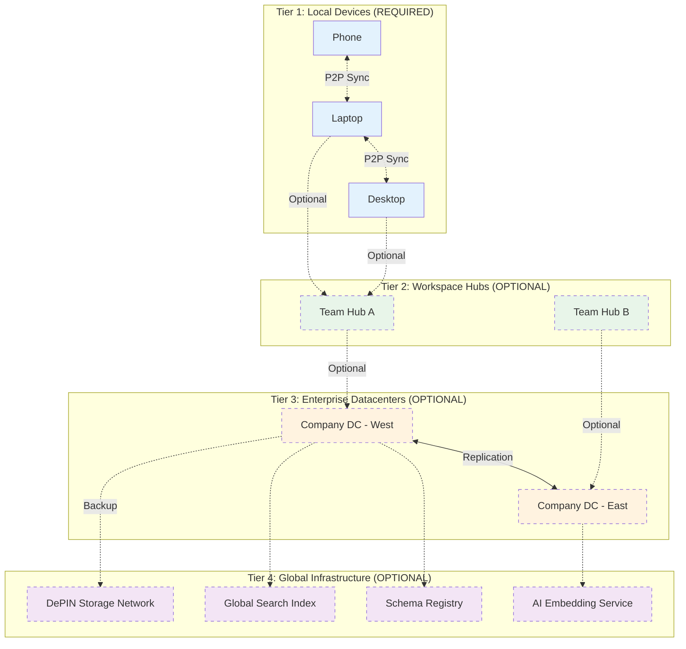
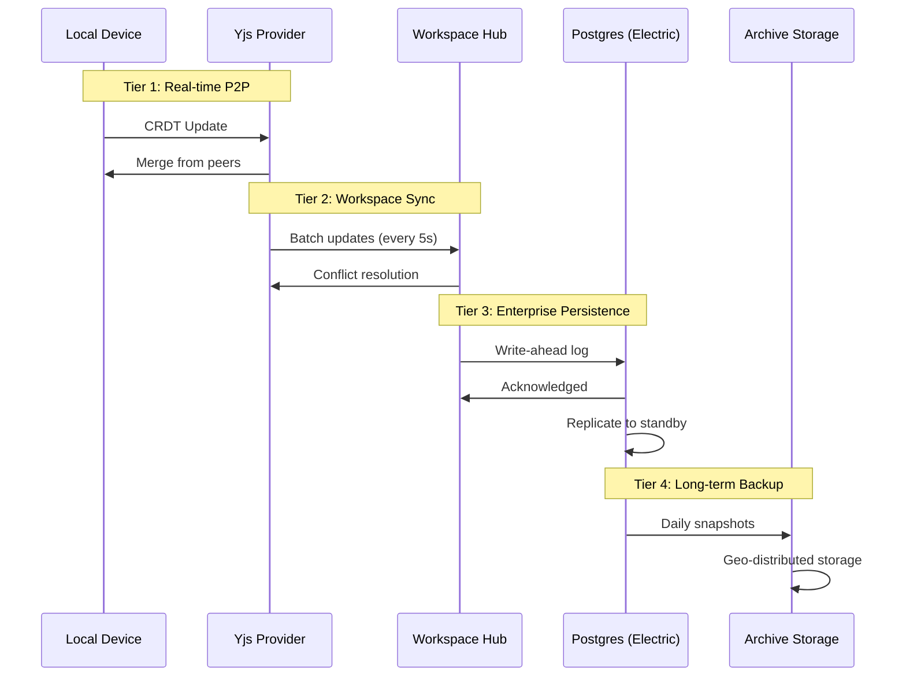
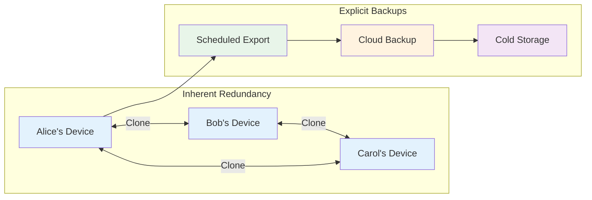
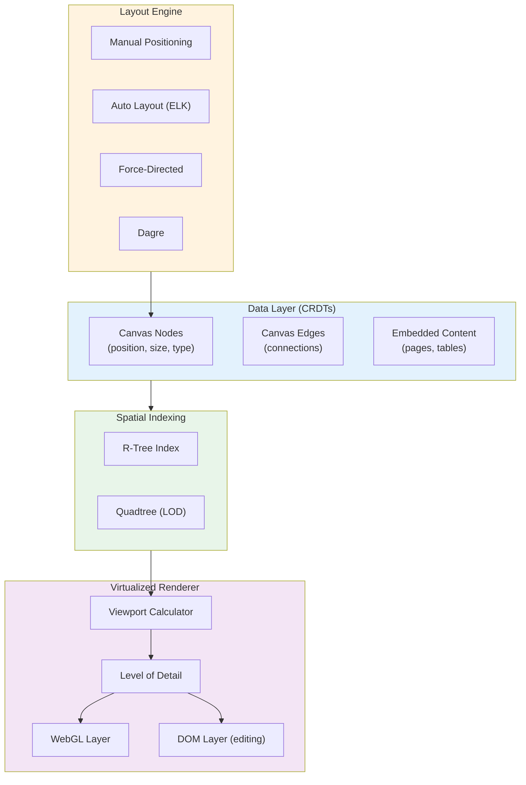

# 10: Scaling Architecture

> Federation, global namespaces, infinite canvas, and backup strategies

[← Back to Plan Overview](./README.md) | [Previous: AI & MCP Interface](./09-ai-mcp-interface.md)

---

## Overview

**Core Principle**: xNet works with **zero infrastructure**—just laptops and phones. Higher tiers are **optional optimizations** for institutions with specific needs.

This document covers how to scale xNotes from personal use to global infrastructure:

- **Pure P2P** - Works with just user devices, no servers
- **Optional Tiers** - Add infrastructure only when needed
- **Global Schema Registry** - Namespaced attributes across the network
- **Infinite Canvas** - Virtualized rendering with auto-layout
- **Backup & Recovery** - Multi-layer redundancy strategies

---

## Tiered Federation Model



### Tier Characteristics

| Tier | Required? | Sync Technology | Latency | Who Needs It |
|------|-----------|-----------------|---------|--------------|
| **Local** | **Yes** | Yjs (P2P CRDTs) | <10ms | Everyone |
| **Workspace** | No | Yjs + relay | <100ms | Teams wanting always-on sync |
| **Enterprise** | No | ElectricSQL | <500ms | Companies with 100TB+ or compliance |
| **Global** | No | IPFS/DePIN | 1-5s | Global search, AI embeddings |

### What Works at Each Level

| Capability | Tier 1 Only | + Tier 2 | + Tier 3 | + Tier 4 |
|------------|-------------|----------|----------|----------|
| Offline editing | Yes | Yes | Yes | Yes |
| Real-time collaboration | Yes (when online) | Yes (24/7) | Yes | Yes |
| Cross-internet sync | Yes (via peers) | Faster | Faster | Fastest |
| Data capacity | Device storage | 1TB shared | 100TB+ | Unlimited |
| Compliance/Audit | Manual export | Manual | Built-in | Built-in |
| Global search | Local only | Workspace | Company | Global |
| AI embeddings | On-device | On-device | Company models | Global models |

---

## Hybrid Sync Architecture

### Why Hybrid?

| Scenario | Best Fit | Reason |
|----------|----------|--------|
| Real-time collaboration | Yjs | Sub-second CRDT sync |
| Offline-first mobile | Yjs | No server required |
| Enterprise compliance | ElectricSQL | SQL queries, audit logs |
| Large datasets | ElectricSQL | Postgres scalability |
| Global search | Custom indexer | Specialized infrastructure |

### Sync Flow



### Implementation

```typescript
interface SyncConfig {
  // Tier 1: P2P
  p2p: {
    enabled: boolean;
    provider: 'y-webrtc' | 'y-websocket';
    signaling: string[];
  };

  // Tier 2: Workspace Hub
  workspace?: {
    hubUrl: string;
    batchInterval: number;  // ms
    conflictStrategy: 'last-write-wins' | 'merge' | 'manual';
  };

  // Tier 3: Enterprise
  enterprise?: {
    electricUrl: string;
    postgresConnection: string;
    replicationMode: 'sync' | 'async';
  };

  // Tier 4: Archive
  archive?: {
    provider: 'ipfs' | 'depin' | 's3' | 'gcs';
    schedule: 'realtime' | 'hourly' | 'daily';
    retention: string;  // e.g., '7y' for 7 years
  };
}

class HybridSyncManager {
  private yjs: YjsProvider;
  private electric?: ElectricClient;
  private archive?: ArchiveProvider;

  async sync(doc: XNetDocument): Promise<void> {
    // Always sync via Yjs for real-time
    await this.yjs.sync(doc);

    // Batch to enterprise if configured
    if (this.electric) {
      await this.batchToElectric(doc);
    }

    // Archive based on schedule
    if (this.archive && this.shouldArchive(doc)) {
      await this.archive.backup(doc);
    }
  }

  private async batchToElectric(doc: XNetDocument): Promise<void> {
    // Convert CRDT state to SQL operations
    const operations = this.crdtToSql(doc.getStateVector());
    await this.electric.transact(operations);
  }
}
```

---

## Global Schema Registry

A decentralized registry for attribute definitions, enabling interoperability.

### Namespace Structure

```
xnet.core/              # Core types (Page, Task, Database)
xnet.canvas/            # Canvas-specific types
com.acme/               # Company: Acme Corp
org.example/            # Organization: Example.org
did:key:abc123/         # Personal namespace (by DID)
```

### Schema Definition

```typescript
interface SchemaDefinition {
  // Identity
  namespace: string;           // e.g., 'com.acme'
  name: string;                // e.g., 'Invoice'
  version: string;             // Semantic versioning

  // Schema
  properties: PropertyDefinition[];
  extends?: string;            // Parent schema

  // Metadata
  author: string;              // DID of creator
  license: string;             // SPDX identifier
  signature: string;           // Ed25519 signature

  // Discovery
  tags: string[];
  description: string;
  documentation?: string;      // URL
}

interface PropertyDefinition {
  name: string;
  type: PropertyType;
  required: boolean;
  indexed: boolean;            // For query optimization
  encrypted: boolean;          // E2E encrypt this field
  default?: any;
}

// Registry operations
interface SchemaRegistry {
  // Lookup
  resolve(uri: string): Promise<SchemaDefinition>;
  search(query: string): Promise<SchemaDefinition[]>;

  // Publishing
  publish(schema: SchemaDefinition): Promise<string>;
  deprecate(uri: string, replacement?: string): Promise<void>;

  // Subscription
  subscribe(namespace: string): AsyncIterable<SchemaDefinition>;

  // Validation
  validate(data: any, schemaUri: string): ValidationResult;
}
```

### Selective Sync with Schemas

```typescript
interface SyncPolicy {
  // What schemas to materialize locally
  schemas: {
    // Full sync for core types
    'xnet.core/*': { mode: 'full' };

    // Partial sync for company data
    'com.acme/Invoice': {
      mode: 'partial',
      filter: { status: 'open' },
      maxAge: '90d',
    };

    // On-demand for archives
    'com.acme/ArchivedInvoice': { mode: 'on-demand' };
  };

  // Storage limits
  quotas: {
    local: '10GB',
    cached: '1GB',
  };
}
```

---

## Backup & Recovery

### The Git Analogy

Like Git, xNotes provides inherent redundancy through distribution:



### Backup Layers

| Layer | Type | RPO | RTO | Retention |
|-------|------|-----|-----|-----------|
| **Peer Replicas** | Inherent | 0 (real-time) | Instant | While online |
| **Local Snapshots** | Automatic | 1 hour | Minutes | 7 days |
| **Cloud Sync** | Scheduled | 1-24 hours | Hours | 30 days |
| **Archive Storage** | Manual/Scheduled | Daily | Days | 7+ years |
| **DePIN/IPFS** | Content-addressed | On-demand | Variable | Permanent |

*RPO = Recovery Point Objective (max data loss)*
*RTO = Recovery Time Objective (time to restore)*

### Backup Strategies

#### 1. Peer Replication (Inherent)

Every connected peer is a full replica:

```typescript
interface PeerBackupStatus {
  // Track which peers have which data
  peers: {
    peerId: string;
    lastSeen: Date;
    documentsReplicated: string[];
    syncStatus: 'full' | 'partial' | 'stale';
  }[];

  // Minimum replicas for safety
  replicationFactor: number;  // e.g., 3

  // Alert if below threshold
  checkReplication(): {
    healthy: boolean;
    underReplicated: string[];  // Document IDs
  };
}
```

#### 2. Local Snapshots

Automatic point-in-time snapshots:

```typescript
interface SnapshotConfig {
  enabled: boolean;
  interval: 'hourly' | 'daily' | 'manual';
  retention: number;           // Number of snapshots to keep
  location: string;            // Local path
  compression: 'none' | 'gzip' | 'zstd';
  encryption: boolean;         // Encrypt at rest
}

interface Snapshot {
  id: string;
  timestamp: Date;
  size: number;
  documents: number;
  databases: number;
  checksum: string;            // BLAKE3 hash

  // Metadata for recovery
  yjs_state_vectors: Map<string, Uint8Array>;
  schema_versions: Map<string, string>;
}

class SnapshotManager {
  async createSnapshot(): Promise<Snapshot> {
    const snapshot: Snapshot = {
      id: crypto.randomUUID(),
      timestamp: new Date(),
      // ... capture full state
    };

    // Write to SQLite backup file
    await this.storage.backup(`snapshots/${snapshot.id}.sqlite`);

    // Prune old snapshots
    await this.pruneOldSnapshots();

    return snapshot;
  }

  async restoreSnapshot(id: string): Promise<void> {
    const snapshot = await this.getSnapshot(id);

    // Warn about data loss
    const currentState = await this.getCurrentStateVector();
    const dataLoss = this.calculateDataLoss(currentState, snapshot);

    if (dataLoss.documents > 0) {
      throw new Error(
        `Restore would lose ${dataLoss.documents} documents. ` +
        `Use forceRestore() to proceed.`
      );
    }

    await this.storage.restore(snapshot);
  }
}
```

#### 3. Cloud Backup

Encrypted backup to cloud providers:

```typescript
interface CloudBackupConfig {
  provider: 'icloud' | 's3' | 'gcs' | 'azure' | 'backblaze';
  bucket: string;
  prefix: string;

  schedule: {
    frequency: 'realtime' | 'hourly' | 'daily';
    time?: string;              // For daily, e.g., '02:00'
  };

  encryption: {
    enabled: true;
    keySource: 'derived' | 'user-provided';
  };

  retention: {
    daily: number;              // Days to keep daily backups
    weekly: number;             // Weeks to keep weekly
    monthly: number;            // Months to keep monthly
    yearly: number;             // Years to keep yearly
  };
}

class CloudBackup {
  async backup(): Promise<BackupResult> {
    // Export to encrypted bundle
    const bundle = await this.export({
      format: 'sqlite',
      encryption: this.config.encryption,
    });

    // Upload with deduplication
    const key = `${this.config.prefix}/${this.getBackupKey()}`;
    await this.provider.upload(key, bundle, {
      contentHash: bundle.checksum,
      metadata: {
        timestamp: new Date().toISOString(),
        version: this.schemaVersion,
      },
    });

    // Apply retention policy
    await this.applyRetentionPolicy();

    return { key, size: bundle.size };
  }
}
```

#### 4. Archive Storage (Long-term)

For compliance and historical records:

```typescript
interface ArchiveConfig {
  provider: 'glacier' | 'archive' | 'tape' | 'depin';

  // What to archive
  scope: {
    minAge: string;            // e.g., '1y' - only archive old data
    types: string[];           // Schema types to archive
    excludeTags: string[];     // Tags to exclude
  };

  // Legal/compliance
  retention: {
    minimum: string;           // e.g., '7y' for tax records
    legalHold: boolean;        // Prevent deletion
  };

  // Verification
  verification: {
    schedule: 'monthly' | 'quarterly' | 'yearly';
    sampleSize: number;        // % of archives to verify
  };
}
```

#### 5. DePIN/IPFS Backup

Decentralized, content-addressed storage:

```typescript
interface DePINBackupConfig {
  network: 'ipfs' | 'filecoin' | 'arweave' | 'storj';

  // Pinning strategy
  pinning: {
    redundancy: number;        // Number of nodes to pin on
    regions: string[];         // Geographic distribution
  };

  // Cost management
  budget: {
    maxMonthly: number;        // Max USD per month
    prioritize: 'cost' | 'speed' | 'redundancy';
  };
}

class DePINBackup {
  async backup(data: Uint8Array): Promise<string> {
    // Content-addressed storage
    const cid = await this.ipfs.add(data, {
      pin: true,
      wrapWithDirectory: false,
    });

    // Pin to additional nodes for redundancy
    await this.pinningService.pin(cid, {
      redundancy: this.config.pinning.redundancy,
      regions: this.config.pinning.regions,
    });

    // Store CID in local index for recovery
    await this.index.add({
      cid: cid.toString(),
      timestamp: new Date(),
      size: data.length,
      checksum: await blake3(data),
    });

    return cid.toString();
  }

  async verify(cid: string): Promise<VerificationResult> {
    const providers = await this.ipfs.dht.findProviders(cid);
    const retrieved = await this.ipfs.cat(cid);
    const checksum = await blake3(retrieved);

    return {
      available: providers.length > 0,
      providers: providers.length,
      integrityValid: checksum === this.index.get(cid).checksum,
    };
  }
}
```

### Recovery Scenarios

| Scenario | Recovery Method | Time | Data Loss |
|----------|-----------------|------|-----------|
| Device lost | Sync from peers | Minutes | None |
| All peers offline | Restore from cloud | Hours | Up to RPO |
| Ransomware attack | Restore from archive | Hours-Days | Up to RPO |
| Accidental deletion | Local snapshot | Minutes | Up to 1 hour |
| Compliance audit | Archive retrieval | Days | None |
| Catastrophic failure | DePIN recovery | Days | Varies |

### Backup UI/UX

```typescript
interface BackupDashboard {
  // Status overview
  status: {
    lastBackup: Date;
    nextScheduled: Date;
    health: 'healthy' | 'warning' | 'critical';
  };

  // Peer replication
  peers: {
    connected: number;
    replicationFactor: number;
    underReplicated: string[];
  };

  // Storage usage
  storage: {
    local: { used: number; quota: number };
    cloud: { used: number; quota: number };
    archive: { used: number; cost: number };
  };

  // Actions
  actions: {
    backupNow(): Promise<void>;
    restoreFromBackup(id: string): Promise<void>;
    exportToFile(path: string): Promise<void>;
    verifyBackups(): Promise<VerificationReport>;
  };
}
```

---

## Infinite Canvas

### Architecture



### Canvas Data Model

```typescript
interface CanvasDocument {
  id: string;
  name: string;

  // Spatial data
  nodes: Map<string, CanvasNode>;
  edges: Map<string, CanvasEdge>;

  // View state (not synced)
  viewport: Viewport;

  // Layout settings
  layout: LayoutConfig;
}

interface CanvasNode {
  id: string;

  // Position (absolute coordinates)
  x: number;
  y: number;
  width: number;
  height: number;

  // Type determines rendering
  type: 'page' | 'database' | 'table' | 'image' | 'embed' | 'shape' | 'group' | 'text';

  // Reference to content (for page/database/table)
  contentRef?: {
    type: 'page' | 'database';
    id: string;
    viewConfig?: any;          // e.g., which database view
  };

  // Inline content (for shape/text)
  content?: {
    text?: string;
    shape?: 'rect' | 'ellipse' | 'diamond' | 'parallelogram';
    style?: ShapeStyle;
  };

  // Grouping
  parentId?: string;           // For groups
  collapsed?: boolean;         // For LOD

  // Styling
  style: NodeStyle;

  // Metadata
  createdAt: Date;
  updatedAt: Date;
  createdBy: string;           // DID
}

interface CanvasEdge {
  id: string;

  // Connections
  source: string;              // Node ID
  target: string;              // Node ID
  sourceAnchor?: Anchor;       // Where on source node
  targetAnchor?: Anchor;       // Where on target node

  // Routing
  points?: Point[];            // Intermediate points
  routing: 'straight' | 'orthogonal' | 'curved' | 'step';

  // Labels
  label?: string;
  labelPosition?: number;      // 0-1 along edge

  // Styling
  style: EdgeStyle;
}

type Anchor = 'top' | 'right' | 'bottom' | 'left' | 'center' | { x: number; y: number };
```

### Spatial Indexing

```typescript
import RBush from 'rbush';

class SpatialIndex {
  private tree: RBush<CanvasNode>;
  private nodeMap: Map<string, CanvasNode>;

  constructor(nodes: CanvasNode[]) {
    this.tree = new RBush();
    this.nodeMap = new Map();

    const items = nodes.map(n => ({
      ...n,
      minX: n.x,
      minY: n.y,
      maxX: n.x + n.width,
      maxY: n.y + n.height,
    }));

    this.tree.load(items);
    nodes.forEach(n => this.nodeMap.set(n.id, n));
  }

  // Query visible nodes - O(log n + k)
  queryViewport(viewport: Viewport): CanvasNode[] {
    return this.tree.search({
      minX: viewport.x,
      minY: viewport.y,
      maxX: viewport.x + viewport.width / viewport.zoom,
      maxY: viewport.y + viewport.height / viewport.zoom,
    });
  }

  // Get nodes at zoom level with LOD
  queryWithLOD(viewport: Viewport): RenderNode[] {
    const visible = this.queryViewport(viewport);
    const zoom = viewport.zoom;

    return visible.map(node => {
      // Determine render mode based on zoom and node size
      const screenSize = node.width * zoom;

      let renderMode: RenderMode;
      if (screenSize < 20) {
        renderMode = 'dot';           // Just a dot
      } else if (screenSize < 50) {
        renderMode = 'icon';          // Icon only
      } else if (screenSize < 150) {
        renderMode = 'thumbnail';     // Static preview
      } else {
        renderMode = 'full';          // Full interactive
      }

      return { ...node, renderMode };
    });
  }

  // Update node position
  updateNode(id: string, updates: Partial<CanvasNode>): void {
    const node = this.nodeMap.get(id);
    if (!node) return;

    // Remove from tree
    this.tree.remove(node, (a, b) => a.id === b.id);

    // Update and re-insert
    Object.assign(node, updates);
    this.tree.insert({
      ...node,
      minX: node.x,
      minY: node.y,
      maxX: node.x + node.width,
      maxY: node.y + node.height,
    });
  }
}

type RenderMode = 'dot' | 'icon' | 'thumbnail' | 'full';
```

### Auto-Layout Engine

```typescript
import ELK, { ElkNode, ElkEdge } from 'elkjs/lib/elk.bundled';

interface LayoutConfig {
  algorithm: 'manual' | 'force' | 'layered' | 'radial' | 'grid';

  // Spacing
  nodeSpacing: number;
  edgeSpacing: number;
  layerSpacing: number;

  // Edge routing
  edgeRouting: 'orthogonal' | 'spline' | 'polyline';
  minimizeCrossings: boolean;

  // Direction (for layered)
  direction: 'right' | 'down' | 'left' | 'up';

  // Animation
  animate: boolean;
  animationDuration: number;
}

class AutoLayoutEngine {
  private elk = new ELK();

  async layout(
    nodes: CanvasNode[],
    edges: CanvasEdge[],
    config: LayoutConfig
  ): Promise<Map<string, { x: number; y: number }>> {

    if (config.algorithm === 'manual') {
      return new Map(); // No changes
    }

    const elkGraph: ElkNode = {
      id: 'root',
      layoutOptions: this.getLayoutOptions(config),
      children: nodes.map(n => ({
        id: n.id,
        width: n.width,
        height: n.height,
        // Preserve groups
        ...(n.parentId ? { parent: n.parentId } : {}),
      })),
      edges: edges.map(e => ({
        id: e.id,
        sources: [e.source],
        targets: [e.target],
      })),
    };

    const result = await this.elk.layout(elkGraph);

    const positions = new Map<string, { x: number; y: number }>();
    this.extractPositions(result, positions);

    return positions;
  }

  private getLayoutOptions(config: LayoutConfig): Record<string, string> {
    const options: Record<string, string> = {
      'elk.spacing.nodeNode': config.nodeSpacing.toString(),
      'elk.spacing.edgeEdge': config.edgeSpacing.toString(),
      'elk.layered.spacing.nodeNodeBetweenLayers': config.layerSpacing.toString(),
      'elk.edgeRouting': config.edgeRouting.toUpperCase(),
    };

    switch (config.algorithm) {
      case 'force':
        options['elk.algorithm'] = 'force';
        break;
      case 'layered':
        options['elk.algorithm'] = 'layered';
        options['elk.direction'] = config.direction.toUpperCase();
        if (config.minimizeCrossings) {
          options['elk.layered.crossingMinimization.strategy'] = 'LAYER_SWEEP';
        }
        break;
      case 'radial':
        options['elk.algorithm'] = 'radial';
        break;
      case 'grid':
        options['elk.algorithm'] = 'rectpacking';
        break;
    }

    return options;
  }

  private extractPositions(
    node: ElkNode,
    positions: Map<string, { x: number; y: number }>,
    offsetX = 0,
    offsetY = 0
  ): void {
    if (node.children) {
      for (const child of node.children) {
        const x = (child.x ?? 0) + offsetX;
        const y = (child.y ?? 0) + offsetY;
        positions.set(child.id, { x, y });

        // Recurse for groups
        this.extractPositions(child, positions, x, y);
      }
    }
  }
}
```

### Virtualized Renderer

```tsx
import { useCallback, useMemo, useState } from 'react';
import { Stage, Layer, Rect, Text, Arrow } from 'react-konva';

interface CanvasViewProps {
  document: CanvasDocument;
  onNodeMove: (id: string, x: number, y: number) => void;
  onNodeEdit: (id: string) => void;
}

function CanvasView({ document, onNodeMove, onNodeEdit }: CanvasViewProps) {
  const [viewport, setViewport] = useState<Viewport>({
    x: 0, y: 0, width: 1200, height: 800, zoom: 1
  });

  // Build spatial index
  const spatialIndex = useMemo(
    () => new SpatialIndex(Array.from(document.nodes.values())),
    [document.nodes]
  );

  // Get visible nodes with LOD
  const visibleNodes = useMemo(
    () => spatialIndex.queryWithLOD(viewport),
    [spatialIndex, viewport]
  );

  // Get visible edges
  const visibleEdges = useMemo(() => {
    const nodeIds = new Set(visibleNodes.map(n => n.id));
    return Array.from(document.edges.values())
      .filter(e => nodeIds.has(e.source) || nodeIds.has(e.target));
  }, [document.edges, visibleNodes]);

  // Handle pan/zoom
  const handleWheel = useCallback((e: KonvaEventObject<WheelEvent>) => {
    e.evt.preventDefault();

    const scaleBy = 1.1;
    const stage = e.target.getStage()!;
    const pointer = stage.getPointerPosition()!;

    const oldZoom = viewport.zoom;
    const newZoom = e.evt.deltaY > 0
      ? oldZoom / scaleBy
      : oldZoom * scaleBy;

    const clampedZoom = Math.max(0.1, Math.min(5, newZoom));

    setViewport(v => ({
      ...v,
      zoom: clampedZoom,
      x: pointer.x - (pointer.x - v.x) * (clampedZoom / oldZoom),
      y: pointer.y - (pointer.y - v.y) * (clampedZoom / oldZoom),
    }));
  }, [viewport.zoom]);

  return (
    <div className="canvas-container">
      {/* WebGL/Canvas layer for shapes and edges */}
      <Stage
        width={viewport.width}
        height={viewport.height}
        scaleX={viewport.zoom}
        scaleY={viewport.zoom}
        x={-viewport.x * viewport.zoom}
        y={-viewport.y * viewport.zoom}
        onWheel={handleWheel}
        draggable
      >
        <Layer>
          {/* Render edges */}
          {visibleEdges.map(edge => (
            <EdgeRenderer key={edge.id} edge={edge} nodes={document.nodes} />
          ))}

          {/* Render nodes by LOD */}
          {visibleNodes.map(node => {
            switch (node.renderMode) {
              case 'dot':
                return <DotNode key={node.id} node={node} />;
              case 'icon':
                return <IconNode key={node.id} node={node} />;
              case 'thumbnail':
                return <ThumbnailNode key={node.id} node={node} />;
              case 'full':
                // Full nodes rendered in DOM layer
                return null;
            }
          })}
        </Layer>
      </Stage>

      {/* DOM layer for editable content */}
      <div
        className="dom-overlay"
        style={{
          transform: `scale(${viewport.zoom}) translate(${-viewport.x}px, ${-viewport.y}px)`,
          transformOrigin: '0 0',
        }}
      >
        {visibleNodes
          .filter(n => n.renderMode === 'full')
          .map(node => (
            <EditableNode
              key={node.id}
              node={node}
              onMove={(x, y) => onNodeMove(node.id, x, y)}
              onEdit={() => onNodeEdit(node.id)}
            />
          ))}
      </div>
    </div>
  );
}

// Editable node with embedded content
function EditableNode({ node, onMove, onEdit }: EditableNodeProps) {
  return (
    <div
      className="canvas-node"
      style={{
        position: 'absolute',
        left: node.x,
        top: node.y,
        width: node.width,
        height: node.height,
      }}
    >
      {node.type === 'page' && (
        <EmbeddedPageEditor pageId={node.contentRef!.id} />
      )}
      {node.type === 'database' && (
        <EmbeddedDatabaseView
          databaseId={node.contentRef!.id}
          viewConfig={node.contentRef!.viewConfig}
        />
      )}
      {node.type === 'table' && (
        <EmbeddedTableView databaseId={node.contentRef!.id} />
      )}
      {node.type === 'text' && (
        <TextEditor content={node.content?.text} />
      )}
      {node.type === 'shape' && (
        <ShapeNode shape={node.content?.shape} style={node.content?.style} />
      )}
    </div>
  );
}
```

### Performance Targets

| Metric | Target | Technique |
|--------|--------|-----------|
| Nodes on canvas | 100,000+ | R-tree spatial indexing |
| Render frame time | <16ms (60fps) | Virtualization + WebGL |
| Pan/zoom latency | <8ms | GPU transforms |
| Layout computation | <500ms for 1000 nodes | ELK with Web Workers |
| Content edit latency | <50ms | DOM overlay for focused node |
| Memory usage | <500MB for 10k nodes | LOD + lazy loading |

---

## Implementation Priorities

| Priority | Feature | Complexity | Impact |
|----------|---------|------------|--------|
| P0 | Local snapshots | Low | High |
| P0 | Peer replication tracking | Medium | High |
| P1 | Cloud backup (S3/iCloud) | Medium | High |
| P1 | Infinite canvas MVP | High | High |
| P2 | ElectricSQL integration | High | Medium |
| P2 | Auto-layout engine | Medium | Medium |
| P2 | Schema registry | High | Medium |
| P3 | DePIN backup | High | Low |
| P3 | Global search index | Very High | Medium |

---

## Next Steps

- [Back to Plan Overview](./README.md)
- [Engineering Practices](./06-engineering-practices.md) - Testing, CI/CD
- [AI & MCP Interface](./09-ai-mcp-interface.md) - AI agent access

---

[← Previous: AI & MCP Interface](./09-ai-mcp-interface.md) | [Back to Plan Overview →](./README.md)
